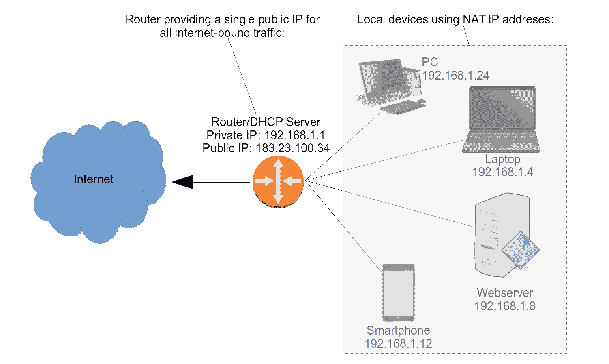

# 什么是局域网？用简单的英语解释局域网

> 原文：<https://www.freecodecamp.org/news/what-is-a-lan-local-area-network-explained-in-plain-english/>

局域网(LAN)实际上只不过是一种组织和保护单个家庭或办公室中运行的所有设备的网络通信的结构。

让我来解释一下。当我说*在一个家庭或办公室内*时，我指的是通过物理或无线连接到网络路由器的所有设备。该路由器可能是 WiFi 接入点或您的互联网服务提供商(ISP)给您的调制解调器。

通过*组织*,我的意思是每个设备都有一个标识地址，它对本地网络之外的互联网的访问被定义。

通过*保护*，我的意思是，通常情况下，来自外部网络的针对您设备的流量请求将被扫描和过滤，以帮助防止未经授权和潜在危险的访问。

部分基于我的 Linux in Action book 中的[内容，我将尝试解释所有这些是如何工作的。](https://www.amazon.com/gp/product/1617294934/ref=as_li_tl?ie=UTF8&camp=1789&creative=9325&creativeASIN=1617294934&linkCode=as2&tag=projemun-20&linkId=1a460c0cd9a39e01821133b90632cba8)

# IPv4 寻址

这看起来可能是这样的。此图中的路由器有一个 183.23.100.34 的*公共* IP 地址，所有传入和传出流量都与之相关联。

同时，路由器充当动态主机配置协议(DHCP)服务器，为家中所有的 PC、笔记本电脑、智能手机和服务器分配*私有* IP 地址。每当设备相互通信时，它们都会使用这些地址。



A typical local area network (LAN) topography

请注意，所有本地设备都被描述为使用“NAT IP 地址”NAT 代表网络地址转换，它是用于组织专用局域网内设备的方法。

但是为什么呢？为所有设备提供与路由器相同的公共 IP 地址有什么问题？

一开始，有 IPv4。IPv4 地址是 32 位数字，由点分隔的四个 8 位二进制八位数组成。这可能是这样的:

```
192.168.1.10 
```

# 子网符号

因为确保系统知道网络地址所在的子网类型至关重要，所以我们需要一个标准符号来准确传达哪些八位字节是网络的一部分，哪些可供设备使用。

有两种常用的标准:无类域间路由(CIDR)符号和网络掩码。

使用 CIDR，一个网络可以表示为 192.168.1.0/24。/24 告诉您，前三个二进制八位数(8×3=24)构成了网络部分，只留下第四个二进制八位数作为设备地址。位于 CIDR 的第二个网络(或子网)将被描述为 192.168.2.0/24。

这两个网络也可以通过网络掩码 255.255.255.0 来描述。这意味着网络会使用前三个二进制八位数的所有 8 位，但不会使用第四个二进制八位数。

# 了解专用网络

理论上，IPv4 协议允许大约 40 亿个唯一地址，范围从 1.0.0.0 到 255.255.255.255。

但是，即使所有这 40 亿个地址实际上都可用，它仍然无法覆盖已经存在的数十亿部手机、数十亿台笔记本电脑和台式电脑，以及数十亿台联网汽车、电器和物联网设备。更不用说即将到来的数十亿。

因此，网络工程师留出三个 IPv4 地址范围，专门用于私有网络。使用这些范围内任何地址的设备将无法从公共互联网直接访问，也无法访问互联网资源。这是三个范围:

```
Between 10.0.0.0 and 10.255.255.255
Between 172.16.0.0 and 172.31.255.255
Between 192.168.0.0 and 192.168.255.255 
```

还记得 NAT 中的“T”代表什么吗？是“翻译”这意味着一个支持 NAT 的路由器将获取局域网和互联网之间的流量请求中使用的私有 IP 地址，并将它们转换成路由器自己的公有地址。名副其实的路由器将*把这些请求路由*到它们合适的目的地。

这种简单的网络寻址重新设计节省了数十亿个地址，供手机等不属于专用网络的设备使用。在所有家庭和办公室中运行的所有笔记本电脑、个人电脑等将方便地(无缝地)共享其路由器的公共 IP。

问题解决了？不完全是。你看，即使所有这些地址的有效使用，仍然没有足够的面向公众的设备上线爆炸。为了解决这个问题，更多的网络工程师提出了 IPv6 协议。IPv6 地址可能是这样的:

```
2002:0df6:0001:004b:0100:6c2e:0370:7234 
```

看起来很恶心，不是吗？它看起来比之前那个软弱的 IPv4 例子要大得多。

是啊是啊。我很擅长记住一些 IPv4 地址，但是我从来没有尝试过“下载”这些怪物中的一个。

首先，它是十六进制的，这意味着它使用 0 到 9 之间的数字*和*字母表(a-f)的前六个字母！除此之外，还有八个二进制八位数而不是四个，并且地址是 128 位而不是 32 位。

所有这些都意味着，一旦协议完全实现，我们将不会在很长很长的时间内(意思是:永远)面临地址用尽的风险。从地址分配的角度来看，意味着不再需要私有 NAT 网络。

尽管如此，出于安全考虑，您仍然希望在局域网内为您的设备提供一些保护。

****在我的[bootstrap-it.com](https://bootstrap-it.com/)有更多的书籍、课程和文章形式的管理知识。****