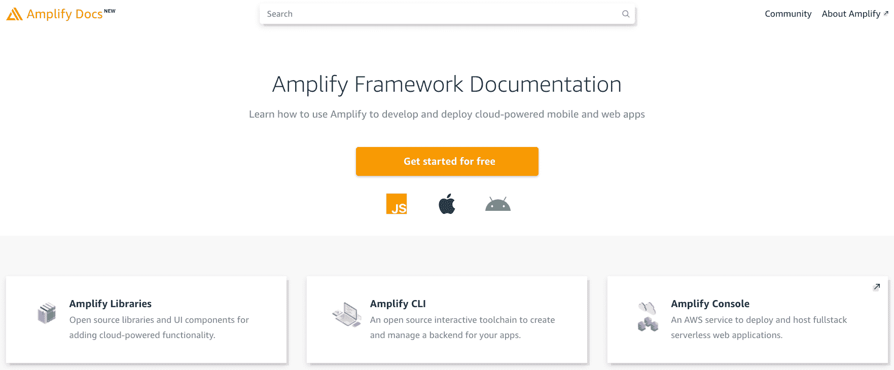
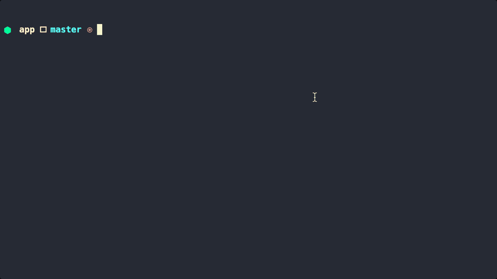
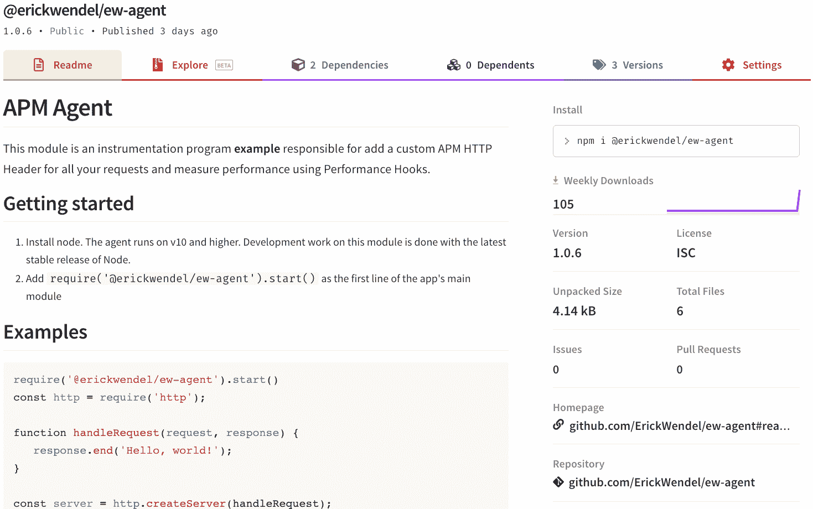
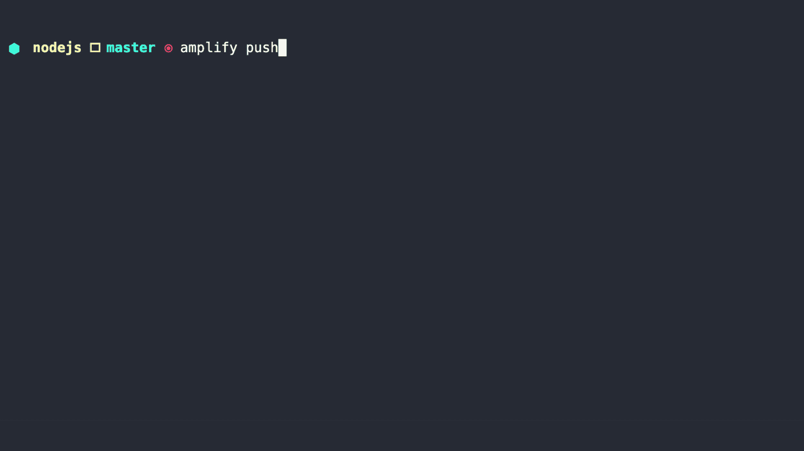
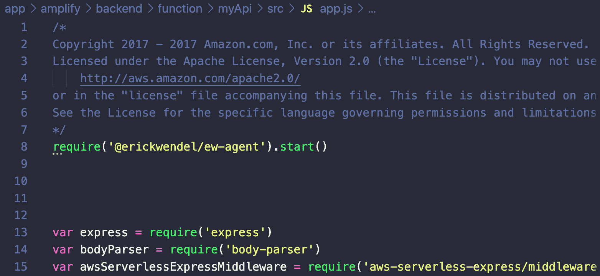
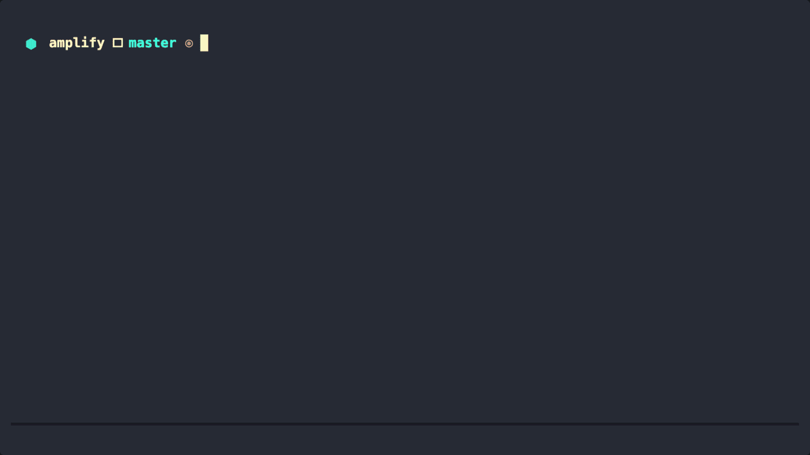
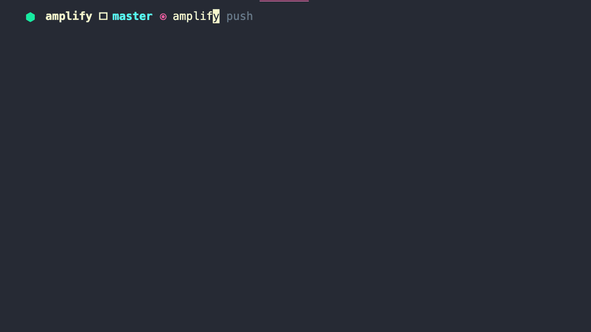

# 如何使用 Amplify 和 Lambda 层重用带有 AWS Lambda 函数的 Node.js 包

> 原文：<https://www.freecodecamp.org/news/how-to-reuse-packages-with-aws-lambda-functions-using-amplify/>

在本文中，您将了解如何通过使用 AWS Lambda 层在 AWS Lambda 函数的运行时注入定制包。您还将使用 Amplify 来开发、部署和分发您的应用程序。

无服务器应用程序非常适合那些不想为闲置机器付费甚至不想管理云基础设施的人。这篇文章将重点介绍使用 **Node.js** 的 **Amplify 框架**。你只需安装一个定制的 Node.js 包，然后使用 **AWS Lambda 层**将它注入到你的所有函数中。

在本文结束时，您将学会如何通过以下方式在 AWS 上部署无服务器功能:

*   使用 Express.js 创建 Node.js Web API，作为使用 **Amplify 框架**的无服务器函数
*   使用 AWS Lambda 层在 AWS Lambda 函数的运行时注入一个定制包来监控和扩展 HTTP 请求。

## **要求**

在接下来的步骤中，您将创建一个真正的应用程序，并将其发布到 AWS 基础设施上。在开始编码之前，请确保在您的环境中设置了以下要求:

*   AWS 活动帐户
*   [AWS CLI](https://docs.aws.amazon.com/cli/latest/userguide/cli-chap-configure.html)
*   [Node.js v14](https://nodejs.org/en/download/current/)

## **简介**

我最喜欢的提供无服务器基础设施的云平台之一是 Amazon Web Services。他们长期以来一直在开发和发布平台，使公司能够比必须配置和处理重复配置更快地发布软件。

如果你熟悉无服务器应用，你可能听说过[无服务器框架](https://www.serverless.com/)。这是一个多云框架，通过使用配置文件来管理无服务器架构，使用一个命令来部署和运行应用程序。

即便如此，开发人员仍然需要自己安装插件和管理配置文件，这可能需要一段时间来建立一个复杂的工作流程。

那么，你最喜欢哪种 CLI 呢？CLI 会询问您想要什么，例如外部连接(数据库、存储、队列等)、身份验证流、外部权限等等？是的，我的朋友，欢迎来到 AWS Amplify。

## AWS 放大器



Amplify Framework website

AWS Amplify 是一个帮助后端、前端和集成开发人员的生态系统。如果你看一下它的[官方文档](https://aws.amazon.com/amplify/framework/)，你会看到一个庞大的列表，里面列出了可以在后端、前端和应用程序上工作的库和示例。

当您配置了 AWS CLI 并设置了环境后，运行以下命令在您的计算机上全局安装 AWS Amplify:

`npm install -g amplify-cli`

接下来，让我们通过创建文件夹来初始化工作目录:

`mkdir app && cd app`

现在，您将通过运行以下命令来初始化 amplify 项目。为此，您需要检查 CLI 向导中的一些选项。请注意，当出现提示时，您可以按下键盘上的 **Enter** 来选择默认值。

`amplify init`

根据下面的**粗体**文本**T3 选择选项:**

*   输入项目名称 **app**
*   输入环境名称 **dev**
*   选择您的默认编辑器: **Visual Studio 代码**
*   选择你正在构建的应用类型 **javascript**

请告诉我们你的项目

*   您使用的是什么 javascript 框架**无**
*   源目录路径: **src**
*   分发目录路径: **dist**
*   构建命令: **npm 运行-脚本构建**
*   开始命令: **npm 运行-脚本开始**



## 正在初始化共享项目

通过接下来的步骤，您将创建一个函数。该函数将用于存储依赖关系，这些依赖关系将在以后注入到 AWS Lambda 函数生态系统的函数中。

运行下面的命令将引导您创建 Lambda 图层的步骤:

`amplify function add`

根据下面的**粗体**文本**选项选择选项。注意，对于兼容的运行时，您需要点击键盘上的**空格键**来选择运行时。**

*   选择要添加的功能:Lambda 层(跨功能使用的共享代码和资源)
*   为你的 Lambda 层提供一个名字: **apmAgentLayer**
*   选择最多 2 个兼容的运行时:**节点 j**
*   当前的 AWS 帐户将始终可以访问该层。
*   或者，配置其他可以访问此图层的用户。**(点击跳过)公共**

✅λ层文件夹和文件创建:放大/后端/功能/apmAgentLayer

### 安装自定义模块

转到图层的路径*amplify/back end/function/apmAgentLayer*你可能会看到一些由 Amplify 创建的文件夹。因为我们正在做一个 Node.js 项目，所以所有的节点模块都必须安装在 *lib/nodejs* 上。

我构建了一个应用程序性能监视器的示例，以展示如何使用 Node.js *性能挂钩*特性来测量请求之间的持续时间并更改 HTTP 响应读取器。它将向您展示实现共享代码和扩展 Node.js 行为的其他可能性。



NPM package to measure duration between requests

这里的第一步是安装共享的依赖项，并将它们上传到 AWS。转到 CLI 生成的路径*amplify/back end/function/apmAgentLayer/lib/nodejs*，然后使用以下命令安装软件包:

```
cd amplify/backend/function/apmAgentLayer/lib/nodejs
npm i @erickwendel/ew-agent
```

### 部署

一旦你安装了你的包，你就可以通过 AWS 控制台部署和检查它。请注意，我们还没有添加任何代码。此时的目标只是为将来使用这个库做准备。

运行以下命令上传 Lambda 图层:

`amplify push`



running amplify push command and seeing output

## 创建 Web API 函数

此时，您已经有了一个本地 Amplify 基础设施项目，可以添加 API 路由、例程、与 AWS 服务的链接等等。

下面的命令将有助于生成基于 ExpressJS 的项目和 AWS Lambda 函数。它还将链接您几乎创建的 AWS Lambda 层上的函数，并在 AWS API 网关上公开它。

`amplify api add`

根据下面的**粗体**文本**T3 选择选项:**

*   请从下面提到的服务中选择一项: **REST**
*   为您的资源提供一个友好的名称，作为项目中该类别的标签: **myApi**
*   提供路径(例如/book/{isbn}): **/hi**
*   选择一个λ源**创建一个新的λ函数**
*   为您的资源提供一个友好的名称，作为项目中该类别的标签: **myApi**
*   提供 AWS Lambda 函数名: **myApi**
*   选择您想要使用的运行时: **NodeJS**
*   选择您想要使用的函数模板:**无服务器 ExpressJS 函数(与 API 网关集成)**
*   是否希望从 Lambda 函数访问此项目中的其他资源？**否**
*   您想在定期计划中调用此功能吗？**否**
*   是否要为此功能配置 Lambda 层？**是**
*   提供现有图层或选择该项目中的图层，以从此功能访问(选择
    至 5): **apmAgentLayer**
*   为 apmAgentLayer 选择一个版本: **1**
*   您想现在编辑本地 lambda 函数吗？**是**

由于我使用的是 VSCode，最后一个向导的回答将在我的编辑器上打开`app.js`文件，这样我就可以编辑了。现在不添加其他依赖项，让我们使用下面的代码在这个文件的第一行导入 **Lambda 层**共享模块:

```
require('@erickwendel/ew-agent').start()
```



code added on the file's head

编辑完文件后，到终端点击**进入**，选择下面**粗体**显示的答案:

*   限制 API 访问**否**
*   您想添加另一个路径吗？**否**

在撰写本文时，我们无法使用 AWS Amplify 在本地测试 Lambda 层。但是您将把您的项目部署到 AWS，并通过再次运行`amplify push`命令在生产中测试它**。**

请注意，它将打印出哪些资源需要更新，以及哪些资源将在此部署中创建。执行所有操作需要一段时间，您的输出应该如下所示:



deploying API

正如您的终端可能已经显示的那样，您的 API 现在有了一个 URL。我生成的 URL 是[https://nlq7x7onj0.execute-api.us-east-1.amazonaws.com/dev](https://nlq7x7onj0.execute-api.us-east-1.amazonaws.com/dev/hi)，路线是`hi`，这是我们在前面的步骤中一起创建的。

让我们使用 cURL(甚至是您的浏览器)触发一个请求，看看会发生什么:

```
curl -i https://nlq7x7onj0.execute-api.us-east-1.amazonaws.com/dev/hi
```

运行之后，API 应该用一个 JSON 响应来响应，内容如下`{"success":"get call succeed!","url":"/hi"}`。Lambda 层被注入，它应该已经改变了你的响应头，增加了`x-instrumented-by`和`x-request-id`键，就像这样:

```
x-instrumented-by: ErickWendel
x-request-id: 5ddf1343-e42e-4e33-b1e1-936c303c14c8
```

如果你想知道 Amplify 在本教程中为你做了什么，运行`amplify console`并在仪表板上浏览。你可以在下面看到我的:



dashboard and seeing function logs on AWS

## 清理

要删除 Amplify 创建的所有资源，请运行`amplify delete`。

## 结论

有很多方法可以改善你在无服务器应用上的体验。Amplify 框架可以帮助您构建下一代应用程序，并避免重复任务。

查看官方文档，了解使用 GraphQL 和 AWS AppSync 等前沿技术构建强大 API 的其他可能性。肯定对你有很大帮助！

## **感谢您阅读**

我真的很感激我们一起度过的时光。希望这个内容不仅仅是文字。我希望它能让你成为一个更好的思考者和程序员。在 [Twitter](https://twitter.com/erickwendel_) 上关注我，并查看我的[个人博客](https://erickwendel.com/)，在那里我分享我所有有价值的内容。

再见！？