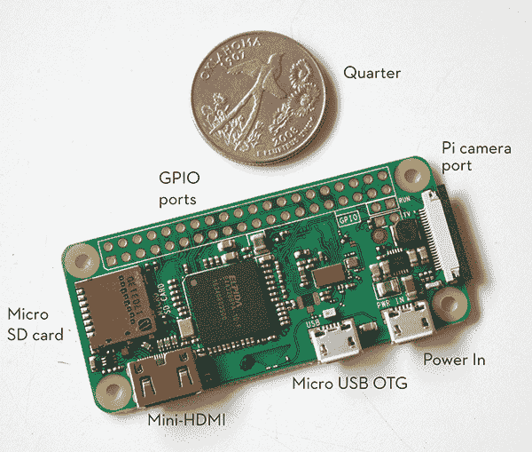
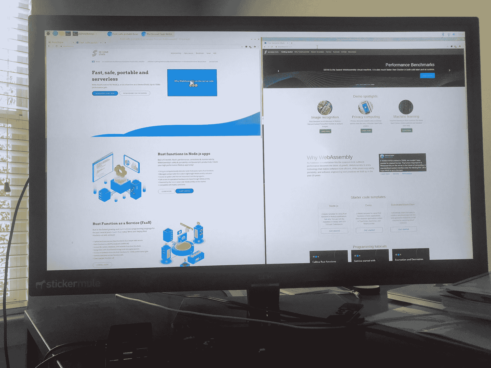

# 如何在 5 美元的 Raspberry Pi 上构建个人开发服务器

> 原文：<https://www.freecodecamp.org/news/build-a-personal-dev-server-on-a-5-dollar-raspberry-pi/>

在本文中，您将了解如何通过在 Raspberry Pi 上安装 Git、Node.js、Rust 和 Docker 来构建个人开发服务器。最便宜的选择只需 5 美元。你可以在这里免费获得一个初学者工具包(25 美元)。

树莓派是一个非常强大的微型计算机。最便宜的选项 [Raspberry Pi Zero](https://www.raspberrypi.org/products/raspberry-pi-zero/) ，能够运行全功能的 Linux 发行版，并驱动高清显示器。它有两枚硬币(美国 25 美分)那么大，售价 5 美元。

售价 10 美元的 [Raspberry Pi Zero W](https://www.raspberrypi.org/products/raspberry-pi-zero-w/) 配有集成 WiFi 和蓝牙功能。



The $10 Raspberry Pi Zero W has a powerful CPU, WiFi, Bluetooth, and all kinds of connectors

在“高端”，你可以花不到 100 美元购买一个[树莓 Pi 4 桌面套件](https://www.raspberrypi.org/products/raspberry-pi-4-desktop-kit/)。它有一个运行频率为 1.5GHz 的 4 核 ARM CPU、GPU、2GB(最高 8 GB)内存、MicroSD 卡上的 16GB(最高 2TB)存储空间、wifi 和以太网连接器、USB 端口、可以驱动 4K 显示器的 HDMI 端口，以及键盘和鼠标。

树莓派也不仅仅是一台标准的电脑。这很有趣，也很容易破解。Raspberry Pi 暴露了一排 GPIO(通用输入输出)引脚。您可以将简单的传感器(如温度、湿度、光线)连接到这些引脚上，并从 Pi 上运行的应用程序中捕获它们的数据。

您还可以将 LED 灯和电机连接到这些引脚，并使用您的 Pi 应用程序来驱动这些外围设备。

对于更复杂的传感器或设备，如摄像头模块，您也可以通过 USB 或 Wifi 连接到 Pi，并在软件中访问它们。Pi 是学习和硬件黑客的好工具。正因为如此，它被广泛应用于教育领域。

然而，乐趣和学习不仅仅是孩子们的事。凭借如此强大的计算能力和简单的网络连接，Raspberry Pi 可以轻松地成为您的个人应用服务器。

例如，您可以将一个 web 应用程序(例如，一个协作笔记应用程序，或者只是一些要共享的文档/视频)放在 Pi 上，带到一个会议上，并让房间中的每个人都可以访问它。你甚至不需要互联网。它是完全去中心化和抵制审查的。

个人服务器对开发人员特别有用。您可以有一个单独的环境来部署和测试您的服务器端应用程序，而不必使用笔记本电脑。个人开发服务器就像类固醇上的 Docker。在这篇文章中，我将教你如何设置一个。

## 首先，买一个树莓派

如果这是你第一次使用 Raspberry Pi，最简单(也是最贵)的方法就是花 100 美元左右买一个桌面套件。除了显示屏之外，它配有电脑所需的一切。

如果您将 Pi 用作个人开发服务器，则在初始设置后，您不需要显示器。一旦开机，你就可以从你的笔记本电脑上 SSH 到它！

[了解如何](https://www.secondstate.io/articles/raspberry-pi-for-free-20200709/)在参加这个[高性能 web 应用学习练习](https://www.secondstate.io/articles/getting-started-with-rust-function/)时免费获得您的 Raspberry Pi 初学者工具包。

当然，如果你有备用的计算机部件，比如 MicroSD 卡、USB 电源、键盘和鼠标，你可以通过只购买主板来省钱。你可以花 5 美元买一个 Raspberry Pi Zero 板，35 美元买一个 Raspberry Pi 4 板。

但主板上缺少的是一个 MicroSD 卡，它可以充当存储操作系统和数据的“硬盘”。你可以花 10 美元在线购买一个 16GB 的 MicroSD 卡，一个 MicroSD 读卡器，并使用 [Raspberry Pi Imager](https://www.raspberrypi.org/downloads/) 从你的笔记本电脑将操作系统加载到 MicroSD 卡上。

两个流行的选择是树莓 Pi OS 和 Ubuntu Linux。两者都是基于 Debian 的 Linux 发行版。大多数初学者工具包在他们的 MicroSD 卡上预装了 Raspberry Pi 操作系统(它被称为 NOOBS)。

在接下来的两节中，我将向您介绍这两种操作系统。

## 如何设置树莓 Pi 操作系统

一旦你插入带有 NOOBS 的 MicroSD 卡，连接显示器、键盘和鼠标，你就可以打开电源了！

从那里，只需按照屏幕上的指示安装 Raspberry Pi 操作系统(以前称为 Raspbian 操作系统)。然后为用户 pi 设置密码，并设置 wifi 连接。

登录后，进入首选项→ Raspberry Pi 配置菜单并启用 SSH。这将允许您从另一台计算机登录到 Pi。

**注意**:为了将 Pi 用作“无头”服务器，您可以向路由器请求一个静态 IP 地址。将来，您只需打开 Pi，并通过 SSH 从您的其他计算机或电话连接到它。

Raspberry Pi 操作系统源自 Debian Linux 发行版。它附带了一个完整的桌面 UI 环境，带有一个现代化的 web 浏览器、一个命令行终端和学习程序，如 Python、Java 和 Scratch 的 ide。



My Raspberry Pi 4 with Raspberry Pi OS setup. Notice how small the actual computer is.

就我们的目的而言，我们最感兴趣的是通过命令行终端安装开发和服务器软件。

此时，您还可以通过运行以下命令找出本地网络上 Pi 的 IP 地址。然后，您可以使用本地 IP 地址、用户名 pi 和您在设置过程中提供给 pi 的密码 SSH 到 Pi。

```
$ hostname -I
192.168.2.108 172.17.0.1
```

你可以在这里找到安装在 Raspberry Pi 操作系统上的软件包的完整列表。更新和升级到最新的软件包总是一个好主意。运行下面的命令并保持耐心。可能要花一个小时。

```
$ sudo apt update && sudo apt upgrade
```

## 如何安装 Ubuntu Server 20.04

Raspberry Pi 操作系统主要面向桌面体验。对于那些只想将设备用作服务器或物联网设备的开发人员来说，Ubuntu Linux 是一个更好的选择。它拥有最新的软件包和库，如果没有桌面窗口、网络浏览器、Java、游戏和学习工具，它的效率会高得多。

你可以从网上下载用于 Raspberry Pi 的 Ubuntu 服务器映像，并将其加载到 MicroSD 卡上。但也许更简单的方法是使用 [Raspberry Pi 成像仪](https://www.raspberrypi.org/downloads/)，从菜单中选择 Ubuntu Server 20.04 TLS，并写入一张空的 MicroSD 卡。

一旦 MicroSD 卡准备好，你应该[按照这些指示](https://ubuntu.com/tutorials/how-to-install-ubuntu-on-your-raspberry-pi#3-wifi-or-ethernet)输入你的 WiFi 网络名称和密码。这允许 Raspberry Pi 设备一启动就连接到网络。

基本上你只要把 MicroSD 卡放进树莓 Pi 里，接上 USB 电源，然后等它上线就可以了。你可以从你的 WiFi 路由器找到`raspberrypi`设备 IP，然后从你网络上的任何一台电脑 SSH 进入。

初始用户名和密码为`ubuntu / ubuntu`。甚至不需要连接显示器或键盘。这是一个完全没有头的设置！

**注意**:如果由于某种原因，你的 Raspberry Pi 在启动时无法连接到 WiFi，你可以为它连接一个 HDMI 显示器和一个 USB 键盘。然后[按照这些指示](https://linuxconfig.org/ubuntu-20-04-connect-to-wifi-from-command-line)在运行的系统上调试并设置 WiFi。

接下来，让我们在 Pi 上安装开发人员工具栈。

## Install Git

我总是在我所有的开发环境中安装 Git，因为很多软件可以直接从 Git 仓库中获取。省去了我下载复制的麻烦。

Git 还允许我在私有存储库中保存和备份我自己的工作。对于像 Raspberry Pi 这样的小型计算机，我会建议您在 Git 中保存工作，以防丢失设备或 MicroSD 卡。

以下命令安装 Git:

```
$ sudo apt install git
```

## 安装 Node.js

要将 Raspberry Pi 变成 web 应用程序的个人开发服务器，您需要安装一个现代化的 web 应用程序运行时。

对于今天的大多数开发人员来说，最好的起点是 Node.js，它允许您用 JavaScript 编写服务器端应用程序。以下两个命令在您的 Pi 上安装 Node.js。

```
$ curl -sL https://deb.nodesource.com/setup_10.x | sudo bash -
$ sudo apt install nodejs
```

您可以通过运行以下两个命令来验证安装是否正确。节点和 npm 现在都可用。

```
$ node -v
v10.19.0
$ npm -v
5.8.0
```

从这里，您可以使用 npm 来安装模块。例如，一个常用的 npm 模块是 web 应用程序的快速框架。

```
$ npm install express
```

现在，您可以通过 [ExpressJS hello world 示例](https://expressjs.com/en/starter/hello-world.html)在您的 Pi 上创建一个 web 服务器，并从您网络上的任何计算机上使用 web 浏览器来访问该应用程序！

## 安装铁锈

Rust 是一种快速发展的编程语言，用于编写系统和 web 应用程序。它接近硬件，高性能，内存安全。这使得 Rust 成为在 Raspberry Pi 等资源受限设备上编写应用程序的绝佳语言。

此外，Rust 是 StackOverflow 用户连续五年最喜爱的编程语言。它非常值得你花时间去学习！

Rust 的一个重要用例是将 [Rust 函数编译成 WebAssembly，并在 Node.js](https://www.secondstate.io/articles/getting-started-with-rust-function/) 应用内部运行，以实现[性能、安全性和代码可移植性](https://www.secondstate.io/articles/why-webassembly-server/)。这是在小型 [Raspberry Pi 设备](https://www.secondstate.io/articles/get-started-with-raspberry-pi-20200708/)上运行计算密集型 web 应用程序的绝佳选择。事实上，如果你学会如何做，你可以得到一个免费的树莓派入门套件。

注意:严格来说，你不需要在 Pi 上安装防锈工具。您通常只需要在 Pi 中运行 Rust 程序。您可以在任何计算机上编译 Rust 程序，然后将编译后的二进制文件复制到 Pi。

不过，凭借强大的 CPU，你可以在 Raspberry Pi 上编译 Rust 程序。为什么不呢？

以下命令在 Pi 上安装 Rust 编译器工具链。

```
$ curl --proto '=https' --tlsv1.2 -sSf https://sh.rustup.rs | sh
```

运行以下命令来设置正确的路径，而无需注销并再次登录。

```
$ source $HOME/.cargo/env
```

上面的命令还会安装名为 cargo 的 Rust 包管理器。大多数 Rust 开发人员使用 cargo 来构建和共享他们的工作。

```
$ cargo -V
cargo 1.44.1 (88ba85757 2020-06-11)
```

接下来，您可以克隆我们的 [Rust 学习资源库](https://github.com/second-state/wasm-learning/)，并从示例中学习。

```
$ git clone https://github.com/second-state/wasm-learning.git
```

这里是 [hello world 的例子](https://www.secondstate.io/articles/a-rusty-hello-world/)。玩得开心！

```
$ cd wasm-learning/rust/hello
$ cargo build
   Compiling hello v0.1.0 (/home/pi/Dev/wasm-learning/rust/hello)
    Finished dev [unoptimized + debuginfo] target(s) in 4.35s
$ target/debug/hello
Hello, world!
```

查看[Rust 官方网站](https://www.rust-lang.org/learn)和 [Rust by Example](https://rust-by-example-ext.com/) 书籍，获取更多学习资源。

## 学习 Docker

我们已经看到 Raspberry Pi 操作系统和 Ubuntu 服务器都是非常强大的 Linux 发行版，有很多软件包。

但是如果我想在其他操作系统上测试应用程序呢？我需要在 MicroSD 卡上擦除并重新安装不同的操作系统吗？答案是否定的，你可以直接用 Docker！以下两个命令在 Raspberry Pi 上安装 docker:

```
$ curl -fsSL https://get.docker.com -o get-docker.sh
$ sudo sh get-docker.sh
```

运行以下命令，以便您可以将 Docker 用作 pi 用户:

```
$ sudo usermod -aG docker pi
```

Docker info 命令显示 Docker 现在安装在一个装有 Raspberry Pi OS 的 ARM 系统上。

```
$ docker info
... ...
 Kernel Version: 4.19.118-v7l+
 Operating System: Raspbian GNU/Linux 10 (buster)
 OSType: linux
 Architecture: armv7l
 CPUs: 4
 Total Memory: 3.814GiB
 Name: raspberrypi
 ID: XERI:ZVVZ:XQVA:HXSH:KRPI:6GL2:5QRE:E7GZ:Z72Q:6SGF:CEI6:GKTC
 Docker Root Dir: /var/lib/docker
... ...
```

接下来，您可以获取最新 Ubuntu 发行版的 Docker 映像，运行它，并作为命令行用户登录到 Ubuntu。

```
$ docker pull ubuntu
... ...
$ docker run -it ubuntu bash
root# ... enter commands ...
```

## 下一步是什么？

在本文中，我们已经触及了基础知识，并学习了如何将您的 Raspberry Pi 4 设备变成软件开发人员的个人开发服务器。

关于 Git、Node.js、Rust、WebAssembly 和 Docker 还有很多要学的。你也可以在 Raspberry Pi 上安装许多其他的开发者栈。

[拿起你的免费树莓派套装](https://www.secondstate.io/articles/raspberry-pi-for-free-20200709/)，让我们知道你用它做了什么！

订阅我们的简讯并保持联系。