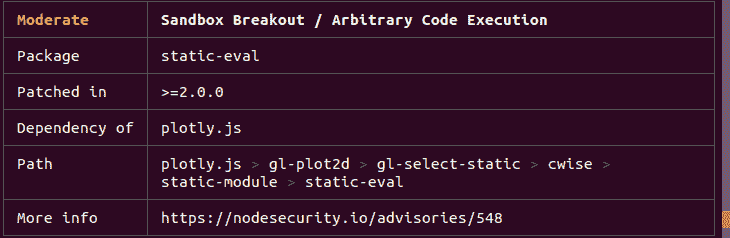

# 什么是 npm？初学者的节点包管理器教程

> 原文：<https://www.freecodecamp.org/news/what-is-npm-a-node-package-manager-tutorial-for-beginners/>

本文应该作为 Node.js 最喜欢的伙伴:npm 的一体化基本指南。

自 2009 年以来，Node.js 风靡全球。使用 Node.js 构建了数十万个系统，促使开发者社区宣称“JavaScript 正在吞噬软件”。

Node 成功的主要因素之一是 NPM——它流行的包管理器，允许 JavaScript 开发人员快速轻松地共享有用的包，如 [lodash](https://www.npmjs.com/package/lodash) 和 [moment](https://www.npmjs.com/package/moment) 。

在我写这篇文章的时候，npm 已经发布了超过 130 万个包，每周下载量超过 160 亿！这些数字对于任何软件工具来说都是惊人的。所以现在我们来谈谈 npm 到底是什么。

## 什么是 NPM？

NPM——或者“节点包管理器”——是 JavaScript 运行时 Node.js 的默认包管理器

它也被称为“忍者南瓜变种人”、“非营利披萨制造商”，以及一系列其他随机名称，你可以在 [npm-expansions](https://github.com/npm/npm-expansions) 上探索并可能做出贡献。

NPM 由两个主要部分组成:

*   用于发布和下载软件包的 CLI(命令行界面)工具，以及
*   一个托管 JavaScript 包的在线存储库

为了更直观的解释，我们可以把仓库[npmjs.com](https://npmjs.com)想象成一个履行中心，它从卖家(npm 包作者)那里接收货物包，并将这些货物分发给买家(npm 包用户)。

为了促进这一过程，[npmjs.com](https://npmjs.com)履行中心雇佣了一支勤劳的袋熊大军(npm CLI)，他们将被指派为每位[npmjs.com](https://npmjs.com)客户的私人助理。因此，依赖关系是这样传递给 JavaScript 开发人员的:


为你的 JS 伙伴发布一个包的过程应该是这样的:


让我们看看这群袋熊是如何帮助想要在项目中使用 JavaScript 包的开发人员的。我们还将看到他们如何帮助开源向导将他们的酷库推向世界。

## package.json

JavaScript 中的每个项目——无论是 Node.js 还是浏览器应用程序——都可以作为一个 npm 包，它有自己的包信息和描述项目的`package.json`任务。

我们可以把`package.json`想象成我们的袋熊大军分发的那些 npm 货物盒子上的标签。

运行`npm init`初始化 JavaScript/Node.js 项目时会生成`package.json`，这些基本元数据由开发者提供:

*   `name`:您的 JavaScript 库/项目的名称
*   `version`:你的项目的版本。对于应用程序开发来说，这个领域经常被忽略，因为没有对开源库进行版本控制的明显需求。但是，作为部署版本的来源，它还是很有用的。
*   `description`:项目描述
*   `license`:项目许可证

### npm 脚本

`package.json`还支持一个`scripts`属性，可以定义该属性来运行安装在项目本地上下文中的命令行工具。例如，npm 项目的`scripts`部分可能是这样的:

```
{
  "scripts": {
    "build": "tsc",
    "format": "prettier --write **/*.ts",
    "format-check": "prettier --check **/*.ts",
    "lint": "eslint src/**/*.ts",
    "pack": "ncc build",
    "test": "jest",
    "all": "npm run build && npm run format && npm run lint && npm run pack && npm test"
  }
} 
```

其中`eslint`、`prettier`、`ncc`、`jest`不一定作为全局可执行文件安装，而是作为本地文件安装在`node_modules/.bin/`中的项目中。

最近引入的 [npx](https://www.freecodecamp.org/news/npm-vs-npx-whats-the-difference/) 允许我们运行这些`node_modules`项目范围的命令，就像一个通过前缀`npx ...`(即`npx prettier --write **/*.ts`)全球安装的程序一样。

### 依赖关系与开发依赖关系

这两个以键-值对象的形式出现，以 npm 库的名称作为键，以它们的[语义格式的](https://semver.org/)版本作为值。这是来自 [Github 的 TypeScript 动作模板](https://github.com/actions/typescript-action)的一个例子:

```
{
  "dependencies": {
    "@actions/core": "^1.2.3",
    "@actions/github": "^2.1.1"
  },
  "devDependencies": {
    "@types/jest": "^25.1.4",
    "@types/node": "^13.9.0",
    "@typescript-eslint/parser": "^2.22.0",
    "@zeit/ncc": "^0.21.1",
    "eslint": "^6.8.0",
    "eslint-plugin-github": "^3.4.1",
    "eslint-plugin-jest": "^23.8.2",
    "jest": "^25.1.0",
    "jest-circus": "^25.1.0",
    "js-yaml": "^3.13.1",
    "prettier": "^1.19.1",
    "ts-jest": "^25.2.1",
    "typescript": "^3.8.3"
  }
} 
```

这些依赖项是通过带有`--save`和`--save-dev`标志的`npm install`命令安装的。它们分别用于生产和开发/测试环境。我们将在下一节更深入地研究这些包的安装。

与此同时，重要的是理解语义版本之前可能出现的迹象(假设你已经读过[塞姆弗](https://semver.org/)的`major.minor.patch`模型):

*   最新的次要版本。例如，如果版本`1.3.0`是`1`主要系列中最新的次要版本，那么`^1.0.4`规范可能会安装该版本。
*   `~`:最新补丁发布。与`^`用于次要版本一样，`~1.0.4`规范可能会安装版本`1.0.7`，如果那是`1.0`次要系列中最新的次要版本。

所有这些确切的包版本都将记录在一个生成的`package-lock.json`文件中。

### 包锁. json

该文件描述了 npm JavaScript 项目中使用的依赖项的确切版本。如果`package.json`是通用描述性标签，`package-lock.json`是成分表。

就像我们通常不会阅读产品的成分表一样(除非你太无聊或需要知道)，`package-lock.json`并不意味着被开发人员逐行阅读(除非我们不顾一切地解决“在我的机器上工作”的问题)。

`package-lock.json`通常由`npm install`命令生成，也由我们的 NPM CLI 工具读取，以确保使用`npm ci`为项目复制构建环境。

## 如何有效地指挥 NPM 袋熊作为“买家”

从前面提到的 130 万个发布包和 160 亿个下载量来看，大多数 npm 用户都在这个方向使用 npm。所以知道如何使用这个强大的工具是很好的。

### npm 安装

这是我们现在开发 JavaScript/Node.js 应用程序时最常用的命令。

默认情况下，`npm install <package-name>`会安装带有`^`版本标志的软件包的最新版本。npm 项目环境中的`npm install`将根据`package.json`规范将包下载到项目的`node_modules`文件夹中，根据`^`和`~`版本匹配在任何可能的地方升级包版本(并进而重新生成`package-lock.json`)。

如果你想在全局上下文中安装一个可以在你的机器上的任何地方使用的包，你可以指定一个全局标志`-g`(这对于像 [live-server](https://github.com/tapio/live-server) 这样的命令行工具包是很常见的)。

npm 使得安装 JavaScript 包变得如此容易，以至于这个命令经常被错误地使用。这导致 npm 成为许多程序员的笑柄，比如:


这就是`--production`旗来救援的地方！在上一节中，我们讨论了分别用于生产和开发/测试环境的`dependencies`和`devDependencies`。这面`--production`旗帜就是`node_modules`的与众不同之处。

通过将这个标志附加到`npm install`命令上，我们将只安装来自`dependencies`的包，从而极大地减少了我们的`node_modules`的大小，这对于我们的应用程序启动和运行是绝对必要的。

就像我们童子军没有把柠檬榨汁机带到我们的柠檬水摊位一样，我们也不应该把`devDependencies`带到生产现场！

### npm ci

因此，如果`npm install --production`对于生产环境来说是最佳的，那么必须有一个对于我的本地开发、测试设置来说是最佳的命令吗？

答案是`npm ci`。

就像如果项目中不存在`package-lock.json`，那么每当调用`npm install`时就会生成一样，`npm ci`使用这个文件来下载项目所依赖的每个单独包的确切版本。

这就是我们如何确保我们的项目的上下文在不同的机器上保持完全相同，无论是我们用于开发的笔记本电脑还是像 Github Actions 这样的 CI(持续集成)构建环境。

### npm 审计

由于大量的软件包已经被发布并且可以很容易地被安装，npm 软件包很容易受到像[这些](https://medium.com/@jsoverson/how-two-malicious-npm-packages-targeted-sabotaged-one-other-fed7199099c8)这样怀有恶意的不良作者的影响。

意识到生态系统中存在问题，npm.js 组织提出了`npm audit`的[想法](https://blog.npmjs.org/post/173719309445/npm-audit-identify-and-fix-insecure)。他们维护了一个安全漏洞列表，开发者可以使用`npm audit`命令来检查他们的依赖关系。

`npm audit`向开发人员提供关于漏洞的信息，以及是否有需要升级的版本。举个例子，



如果修正在下一次不间断版本升级中可用，`npm audit fix`可用于自动升级受影响依赖项的版本。

## 如何有效地指挥 NPM 袋熊做“销售”

我们已经介绍了如何作为消费者使用 NPM CLI 工具，但是作为作者如何有效地使用它(并有可能成为 JavaScript 开源向导)？)?

### npm 发布

将包裹发送到我们的[npmjs.com](https://npmjs.com)履行中心非常简单，因为我们只需要运行`npm publish`。棘手的部分是确定包的版本，这不是特定于 npm 包作者的**而不是**。

根据[semver.org](https://semver.org)的经验法则:

1.  主要版本当您进行不兼容的 API 更改时，
2.  以向后兼容的方式添加功能时的次要版本，以及
3.  补丁版本，当你做向后兼容的错误修正。

在发布您的包时，遵循上面的规则更加重要，以确保您没有违反任何人的代码，因为 npm 中匹配的默认版本是`^`(也就是下一个次要版本)。

## NPM JavaScript node . js

这就是我们开始有效运用 npm 和指挥我们可爱的袋熊军队所需要知道的一切！

