# 如何在 React Native & Firebase 中设置 Google 登录

> 原文：<https://www.freecodecamp.org/news/google-login-with-react-native-and-firebase/>

Google sign-in 是一个很好的登录功能，可以提供给你的应用程序的用户。这使得他们更容易创建帐户和登录。

更好的是，Firebase 使得开发者可以非常容易地添加对 Google sign-in 的支持。但是设置 React 本地环境可能会带来一些挑战，本教程将全面介绍这些挑战。

React Native 和 Firebase SDK 使得 Google 登录的实现非常简单。让我们构建一个只有一个 Google 登录按钮的简单应用程序。一旦用户成功登录到 Google，我们将显示从他们的 Google 帐户中检索到的用户信息以及一个注销按钮。

如果您有兴趣为用户提供更多登录选项，还可以将脸书登录添加到您的应用程序中。如果你想了解更多关于如何设置脸书登录的信息，你可以在 React Native with Firebase 查看这个[脸书登录指南。](https://www.instamobile.io/react-native-tutorials/facebook-login-react-native-firebase/)

## 为什么在移动应用程序中使用谷歌登录按钮？

1.  使用谷歌或其他第三方可以使您的认证过程无缝和友好。用户不必在注册过程中浪费时间，这将极大地提高你的注册率和留存率。
2.  安全又有保障。
3.  相比互联网上的未知网站或应用程序，用户更信任谷歌或脸书。
4.  它提供了良好的用户体验。作为用户，我们对任何需要做的动作或工作都没有多少耐心，尤其是在我们第一次尝试的一个相当不知名的应用中。

事不宜迟，让我们直接进入本教程的应用程序开发部分。

## 设置 Firebase 项目

转到 [Firebase 控制台](https://firebase.google.com/)并创建一个 Firebase 项目:

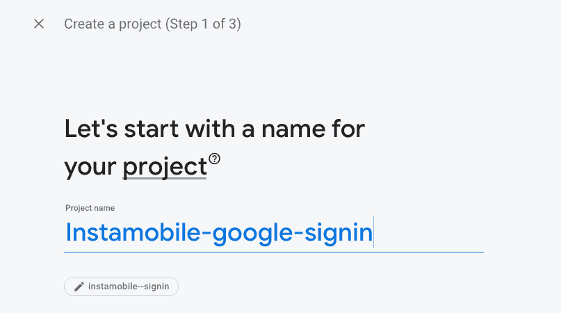

create new firebase project

在这里，我们将需要设置 Firebase 项目名称和应用程序标识符，所以让我们首先创建 React 本机应用程序。

## 创建 React 本机项目

首先，我们需要使用以下命令创建一个 React 本地项目:

`react-native init instamobile-google-login-demo`

H‌ere，我们给这个项目命名为**insta mobile-Google-log in-demo**。现在，我们需要使用以下命令安装**react-native-Google-sign in**包:

`yarn add react-native-google-singin`

`react-native-google-signin`包用于在 React 原生应用中实现 Google auth 功能。现在，我们需要从相应的包中导入必要的模块和组件，如下面的代码片段所示:

```
import {
GoogleSignin,
GoogleSigninButton,
statusCodes,
} from 'react-native-google-signin';
```

import google sign-in component

接下来，我们需要创建状态，以便处理授权状态和用户信息。为此，我们使用下面的代码片段所示的`useState`模块:

```
const [loggedIn, setloggedIn] = useState(false);
const [userInfo, setuserInfo] = useState([]);
```

add state

现在，我们需要创建一个登录函数来处理身份验证，如下面的代码片段所示:

```
_signIn = async () => {
  try {
    await GoogleSignin.hasPlayServices();
    const {accessToken, idToken} = await GoogleSignin.signIn();
    setloggedIn(true);
  } catch (error) {
    if (error.code === statusCodes.SIGN_IN_CANCELLED) {
      // user cancelled the login flow
      alert('Cancel');
    } else if (error.code === statusCodes.IN_PROGRESS) {
      alert('Signin in progress');
      // operation (f.e. sign in) is in progress already
    } else if (error.code === statusCodes.PLAY_SERVICES_NOT_AVAILABLE) {
      alert('PLAY_SERVICES_NOT_AVAILABLE');
      // play services not available or outdated
    } else {
      // some other error happened
    }
  }
};
```

add google sign-in function

接下来，我们需要利用`useEffect`函数初始化 Google 登录对象的设置:

```
useEffect(() => {
   GoogleSignin.configure({
     scopes: ['email'], // what API you want to access on behalf of the user, default is email and profile
     webClientId:
       '418977770929-g9ou7r9eva1u78a3anassxxxxxxx.apps.googleusercontent.com', // client ID of type WEB for your server (needed to verify user ID and offline access)
     offlineAccess: true, // if you want to access Google API on behalf of the user FROM YOUR SERVER
   });
 }, []);
```

最后，我们需要一个处理注销操作的函数。为此，我们将实现`signOut`方法，如下面的代码片段所示:

```
signOut = async () => {
    try {
      await GoogleSignin.revokeAccess();
      await GoogleSignin.signOut();
      setloggedIn(false);
      setuserInfo([]);
    } catch (error) {
      console.error(error);
    }
  };
```

add Google Sign-out function

现在，我们还需要在屏幕上呈现组件。为此，我们将利用各种组件，如`View`和`Button`:

```
return (
    <>
      <StatusBar barStyle="dark-content" />
      <SafeAreaView>
        <ScrollView
          contentInsetAdjustmentBehavior="automatic"
          style={styles.scrollView}>
          <Header />

          <View style={styles.body}>
            <View style={styles.sectionContainer}>
              <GoogleSigninButton
                style={{width: 192, height: 48}}
                size={GoogleSigninButton.Size.Wide}
                color={GoogleSigninButton.Color.Dark}
                onPress={this._signIn}
              />
            </View>
            <View style={styles.buttonContainer}>
              {!loggedIn && <Text>You are currently logged out</Text>}
              {loggedIn && (
                <Button
                  onPress={this.signOut}
                  title="LogOut"
                  color="red"></Button>
              )}
            </View>
          </View>
        </ScrollView>
      </SafeAreaView>
    </>
  );
```

UI code

现在，如果我们在模拟器中运行我们的项目，我们将得到以下结果:

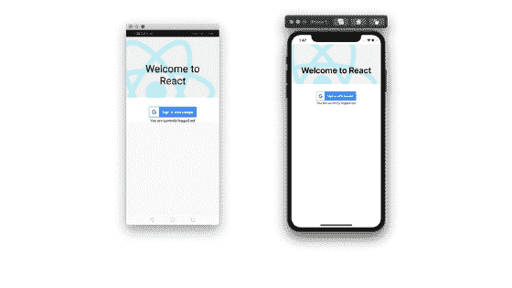

Login with Google React Native

很可爱，对吧？我们已经完成了项目中 React 本机级别的实现(UI 和业务逻辑)。

正如你所看到的，我们有一个“使用 Google 登录”按钮，一旦登录操作成功完成，它就会变成一个注销按钮。

我们现在要设置 Google 登录包和 Firebase 应用程序。

## 配置 iOS 和 Android 原生项目

在项目全面运行之前，我们需要采取一些设置步骤。它们大多与应用程序的实际本机方面有关。

### 适用于 iOS

这里，在 VSCode(或任何终端)中只需运行`cd ios && pod install`。然后打开*。xcworkspace* 文件在 Xcode 中(从 ios 文件夹中)并确保包含 pod:

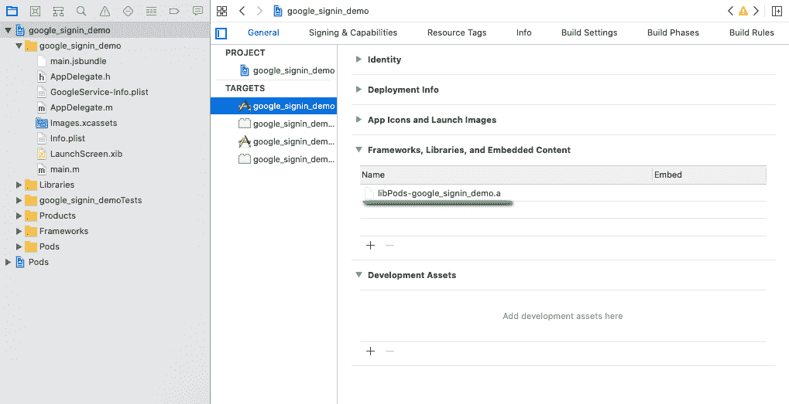

install google login lib in xcode

### 适用于 Android

1.首先，我们需要链接本机模块。

*   在 RN >= 0.60 时，由于自动链接，您应该不需要做任何事情。
*   在 RN < 0.60 时运行`react-native link **react-native-google-signin**`。

2.使用以下配置更新 **android/build.gradle** :

```
buildscript {
    ext {
        buildToolsVersion = "27.0.3"
        minSdkVersion = 16
        compileSdkVersion = 27
        targetSdkVersion = 26
        supportLibVersion = "27.1.1"
        googlePlayServicesAuthVersion = "16.0.1" // <--- use this version or newer
    }
...
    dependencies {
        classpath 'com.android.tools.build:gradle:3.1.2' // <--- use this version or newer
        classpath 'com.google.gms:google-services:4.1.0' // <--- use this version or newer
    }
...
allprojects {
    repositories {
        mavenLocal()
        google() // <--- make sure this is included
        jcenter()
        maven {
            // All of React Native (JS, Obj-C sources, Android binaries) is installed from npm
            url "$rootDir/../node_modules/react-native/android"
        }
    }
}
```

3.用以下配置更新`android/app/build.gradle`:

```
...
dependencies {
    implementation fileTree(dir: "libs", include: ["*.jar"])
    implementation "com.android.support:appcompat-v7:23.0.1"
    implementation "com.facebook.react:react-native:+"
    implementation(project(":react-native-community_google-signin")) // <--- add this dependency
}
```

检查`react-native link`是否链接了本机模块——但前提是您使用了`react-native link`!

在`android/settings.gradle`中，我们应该有以下配置:

```
...
include ':react-native-google-signin', ':app'
project(':react-native-google-signin').projectDir = new File(rootProject.projectDir, '../node_modules/@react-native-community/google-signin/android')
```

setup google login for android in setting.gradle

接下来，在`MainApplication.java`中，我们应该添加 Google 包，如下面的代码片段所示:

```
import co.apptailor.googlesignin.RNGoogleSigninPackage;  // <--- import

public class MainApplication extends Application implements ReactApplication {

  ......

  @Override
    protected List<ReactPackage> getPackages() {
      return Arrays.<ReactPackage>asList(
          new MainReactPackage(),
          new RNGoogleSigninPackage() // <-- this needs to be in the list
      );
    }
  ......

}
```

setup google login for android in MainApplication.java

## 设置 Firebase

### 适用于 iOS

现在，我们需要开始进行 Firebase 配置。在 Firebase 中，我们需要设置一个谷歌云应用程序。但是，当我们在 Firebase 上设置身份验证方法时，这也创建了一个谷歌云应用程序。

首先，我们需要创建 Firebase iOS 应用程序，以获取 **GoogleServiceinfo.plist** ，如下图所示:

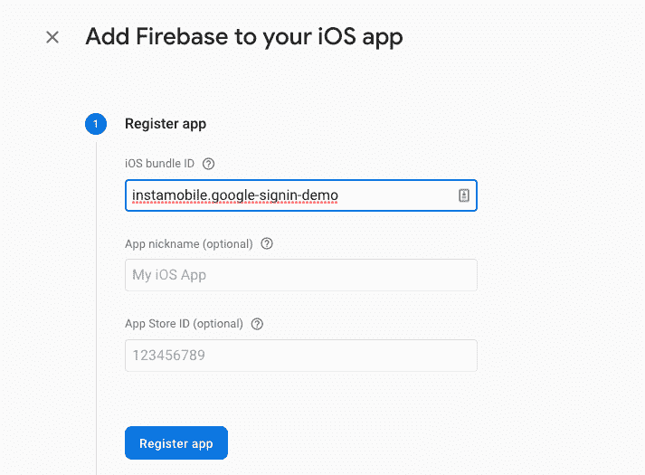

add new firebase app name

接下来，我们将 **GoogleService-info.plist** 文件复制到 Xcode 项目，如下图所示:

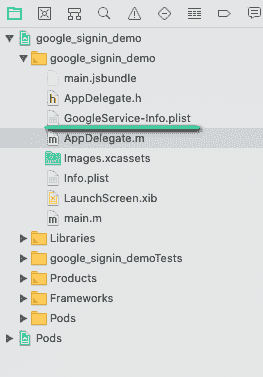

add google service plist to xcode

现在，我们需要将出现在 **GoogleService-info.plist** 文件中的反向客户端 ID 添加到 URL 类型中，如下面的屏幕截图所示:

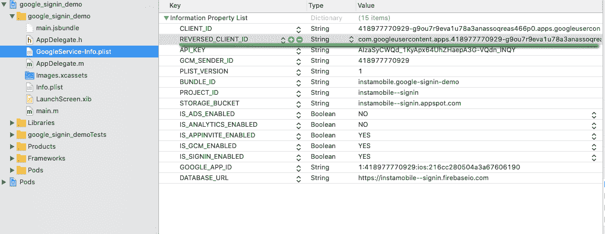

get reverse client id from xcode

下一步是进入**信息** → **网址类型**，然后填写**网址方案**，如下图所示:

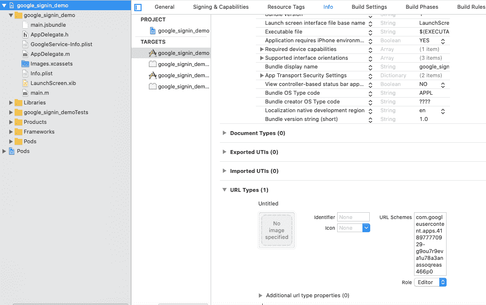

add url scheme to xcode

### 适用于 Android

首先，我们需要在 Firebase 上创建一个 Android 应用程序。为此，我们需要从我们的应用程序中获得一个包名和证书 **SHA-1** 。然后，我们可以注册 Firebase 应用程序，如下所示:

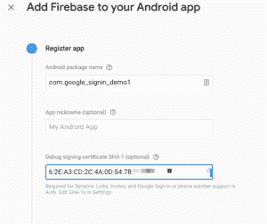

create new android firebase app

我们可以在项目的**MainApplication.java**中获得包名，如下面的代码片段所示:

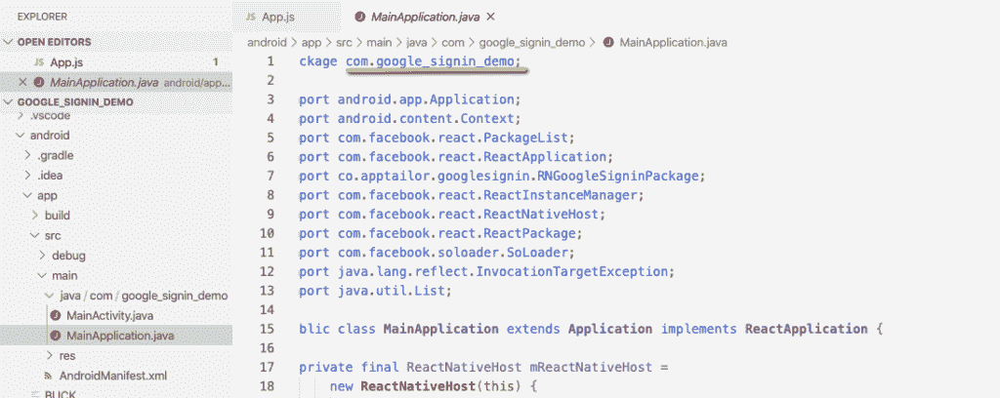

find out bundle name in android app

接下来，我们可以获取密钥存储文件中的 SHA-1 密钥。在 **android/app** 目录中，我们可以运行命令:

```
cd android/app ; 
keytool -exportcert -keystore debug.keystore -list -v
```

generate sha-1

然后会出现 **SHA-1** 键，如下截图所示:

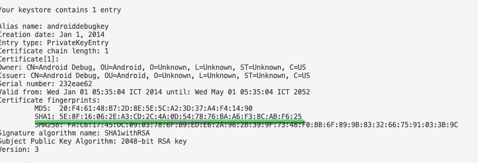

generate sha1 for register android app in firebase

成功创建 Firebase 设置 app 后，我们需要下载 **google-services.json** 文件并复制到目录中，如下图截图所示:

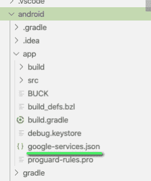

add google service json to android app folder

现在，最后一步是在 Android 中设置一个 Google 登录组件。

### 安装 React Native Firebase 包

为了安装 **react-native-firebase** 包版本 6，我们需要在项目命令提示符下运行以下命令:

```
# Using npm 
npm install --save @react-native-firebase/app 
# Using Yarn 
yarn add @react-native-firebase/app
```

install react native firebase core component

在使用任何其他 Firebase 服务之前，必须安装`@react-native-firebase/app`模块。

### 适用于 iOS

我们已经将 **GoogleService-Info.plist** 添加到 Xcode 中。剩下的就是允许 iOS 上的 Firebase 使用凭证。Firebase iOS SDK 必须在应用程序的引导阶段进行配置。

为此，我们需要打开我们的`/ios/{projectName}/AppDelegate.m`文件，并添加以下内容:

在文件的顶部，我们需要导入 Firebase SDK:

```
#import <Firebase.h>
```

include Firebase

在您现有的`didFinishLaunchingWithOptions`方法中，我们需要将以下内容添加到方法的顶部:

```
- (BOOL)application:(UIApplication *)application didFinishLaunchingWithOptions:(NSDictionary *)launchOptions {
  // Add me --- \/
  if ([FIRApp defaultApp] == nil) {
    [FIRApp configure];
  }
  // Add me --- /\
  // ...
}
```

Firebase React Native

最后，我们需要运行以下命令来完成 CocoaPods 包的安装:

```
cd ios ; pod install
```

CocoaPods install

就是这样。现在我们已经在 iOS 上完成了主 Firebase 包的安装

### 适用于 Android

我们需要用 Android 凭证配置 Firebase。要允许 Android 上的 Firebase 使用凭证，必须在项目上启用 google-services 插件。这需要修改 Android 目录中的两个文件。

首先，将 google-services 插件作为依赖项添加到您的 **android/build.gradle** 文件中:

```
buildscript {
  dependencies {
    // ... other dependencies
    classpath 'com.google.gms:google-services:4.2.0'
    // Add me --- /\
  }
}
Lastly, execute the plugin by adding the following to the very bottom of your /android/app/build.gradle file:

apply plugin: 'com.google.gms.google-services'
```

add google service

## React 本机 Firebase 身份验证模块

安装完成后，我们需要设置父 Firebase 包。接下来，我们需要安装子模块进行身份验证。为此，我们需要打开一个终端并运行以下命令:

```
yarn add @react-native-firebase/auth
```

install react native firebase auth 

### 适用于 iOS

我们只需要在命令提示符下再次安装 pod:

```
cd ios/ && pod install
```

install cacao pod

### 适用于 Android

你可以遵循[官方文档](https://rnfirebase.io/auth/usage/installation/android)上的说明，只有在你使用 React Native < = 0.59 或者需要手动集成库的情况下才需要。

### 在 Firebase 上激活 Google 登录

我们需要去 Firebase 控制台。然后，在认证部分，我们需要点击 Google，如下图所示:

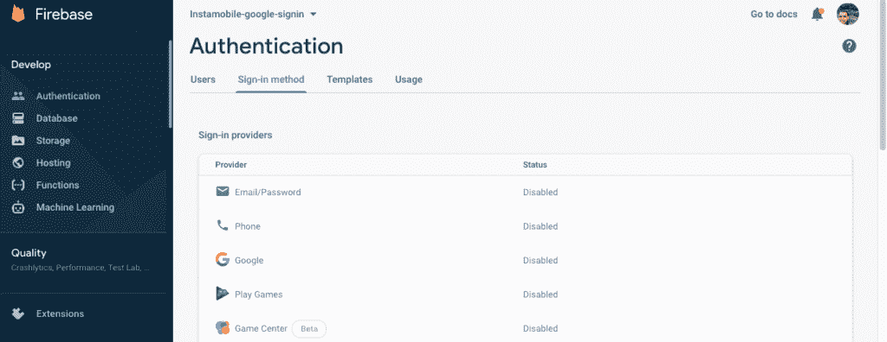

authentication method in firebase

接下来，我们需要使用以下配置来启用设置，并保存配置，如下面的屏幕截图所示:

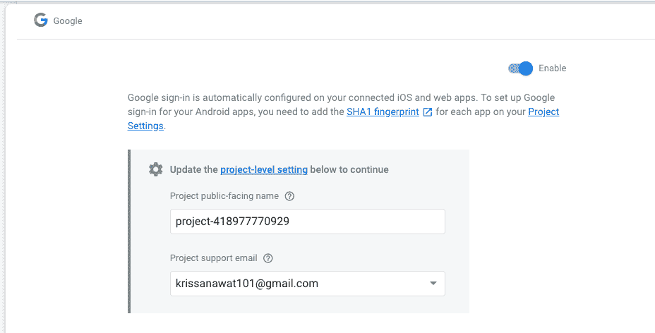

activate project support email

在 **App.js** 中，我们需要从 Firebase 包中导入 **auth** ，如下面的代码片段所示:

```
import auth from '@react-native-firebase/auth';
```

import firebase auth package

接下来，我们需要将身份验证配置集成到**登录**功能中。成功登录后，我们将**访问令牌**和**id 令牌**存储到 **Firebase。**现在，我们可以尝试在我们的演示版 React 原生应用程序上登录 Google。

```
_signIn = async () => {
    try {
      await GoogleSignin.hasPlayServices();
      const {accessToken, idToken} = await GoogleSignin.signIn();
      setloggedIn(true);
      const credential = auth.GoogleAuthProvider.credential(
        idToken,
        accessToken,
      );
      await auth().signInWithCredential(credential);
    } catch (error) {
```

Firebase Login function

现在，我们已经成功地将 Google Sign-in 集成到 React 本地应用程序中:

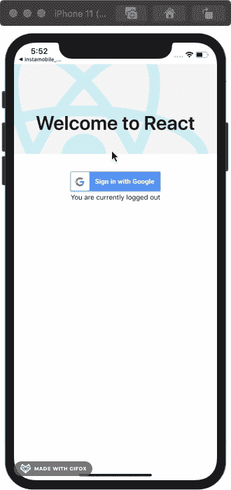

result of google login with react native

我们可以看到添加到 Firebase 控制台的新数据:

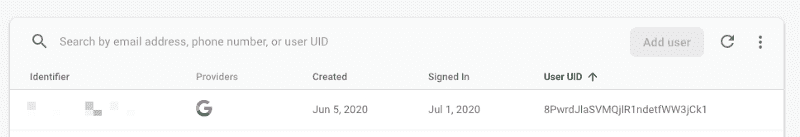

firebase authentication console

## 跟踪用户状态

为了检查用户的登录状态，我们使用 Firebase Auth。为此，我们需要将 **onAuthStateChanged** 方法添加到 **useEffect** 中，以便它可以在每个**componentdimount**事件调用中运行。

此外，我们需要将回调作为参数传递给名为 **onAuthStateChanged** 的函数，如下面的代码片段所示:

```
useEffect(() => {
    .............
    const subscriber = auth().onAuthStateChanged(onAuthStateChanged);
    return subscriber; // unsubscribe on unmount
  }, []);
```

subscribe to auth state

在函数 **onAuthStateChanged，**中，我们处理本地状态数据，如下面的代码片段所示:

```
function onAuthStateChanged(user) {
    setUser(user);
    console.log(user);
    if (user) setloggedIn(true);
  }
```

set user data

现在，我们需要存储州的用户数据。然后，尝试在成功登录后显示用户的数据。为此，我们需要使用下面这段代码:

```
{!user && <Text>You are currently logged out</Text>}
{user && (
  <View>
    <Text>Welcome {user.displayName}</Text>
    <Button
      onPress={this.signOut}
      title="LogOut"
      color="red"></Button>
  </View>
)}
```

code for display user info

我们将在模拟器中得到以下结果:

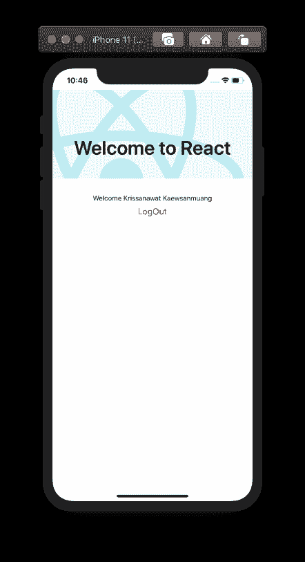

logout firebase auth

## Firebase 注销

为了注销，我们需要删除所有用户的凭证并撤销 Google 登录令牌。

首先，我们需要等待 **GoogleSignin** 模块撤销访问并退出。然后，我们调用 **Firebase** auth 的**注销**方法来成功注销。

下面的代码片段提供了整体代码实现:

```
signOut = async () => {
    try {
      await GoogleSignin.revokeAccess();
      await GoogleSignin.signOut();
      auth()
        .signOut()
        .then(() => alert('Your are signed out!'));
      setloggedIn(false);
      // setuserInfo([]);
    } catch (error) {
      console.error(error);
    }
  };
```

Firebase sign-out function

因此，我们现在可以执行注销操作，如下面的代码片段所示:

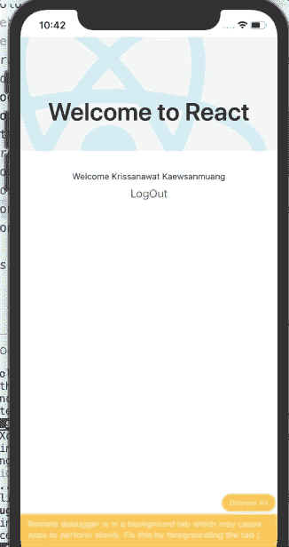

firebase react native logout

## 结论

在本教程中，我们学习了如何在 React 本地项目中利用 Firebase 来设置 Google 登录，以及存储访问令牌。

首先，我们用所有必需的组件和功能配置创建了 React 本地项目。然后，我们学习了如何为 Android 和 iOS 平台配置 Google Sign In 和 Firebase。最后，我们使用 Firebase 包在 React Native 应用程序中设置了 Firebase，并显示了用户数据和注销按钮。

你可以从 [Github](https://github.com/florion101/firebase-google-login-react-native) 下载本教程的完整源代码。

最棒的是 Firebase 和 Google Auth 支持所有移动开发语言，如 [Flutter](https://www.instaflutter.com) 、 [Swift](https://www.iosapptemplates.com) 或 [Kotlin](https://www.instakotlin.com) 。配置步骤和架构方法完全相同。

## 后续步骤

现在，您已经了解了如何在 React Native apps 中设置 Firebase Google 登录，以下是您可以研究的一些其他主题:

*   [如何用 Firebase 后端构建 React 原生应用](https://www.freecodecamp.org/news/react-native-firebase-tutorial/)
*   Firebase & React Native — [推送通知](https://www.instamobile.io/react-native-tutorials/push-notifications-react-native-firebase/) | [Firebase 存储](https://www.instamobile.io/mobile-development/react-native-firebase-storage/)
*   React Native & Firebase 中更多认证方式— [Google 登录](https://www.instamobile.io/mobile-development/google-login-react-native-firebase/) | [脸书登录](https://www.instamobile.io/react-native-tutorials/facebook-login-react-native-firebase/) | [电话短信 OTP 认证](https://www.instamobile.io/mobile-development/firebase-phone-authentication-react-native/)

如果你喜欢这个 React Native 教程，请在 [Github repo](https://github.com/florion101/firebase-google-login-react-native) 上给我一颗星，并与你的社区分享。你可以在 Instamobile 上查看更多[免费反应本地项目](https://www.instamobile.io/mobile-templates/react-native-templates-free/)。干杯！