# 数据科学的 Python 基础

> 原文：<https://www.freecodecamp.org/news/python-fundamentals-for-data-science/>

不熟悉编程的数据科学领域的初学者通常很难弄清楚他们应该从哪里开始。

在各种论坛上有数百个关于如何开始使用 [Python for DS](https://github.com/dswh/python_fundamentals) 的问题，这篇文章(和视频系列)是我试图解决所有这些问题的尝试。

我是一名 Python 福音传播者，在转向数据工程和数据科学之前，我是一名全栈 Python 开发人员。我以前使用 Python 的经验和对数学的良好掌握帮助我更容易转向数据科学。

所以，这里是帮助你用 Python 编程的基础。

在我们深入了解要点之前，请确保您已经[设置了您的 Python 环境](https://youtu.be/t8AUwTDtno8)并且知道如何使用 [Jupyter 笔记本(可选)。](https://www.youtube.com/watch?v=TmDUZfkdZoo&list=PLIkXejH7XPT_y00hj-mB-zTzePsMu2gRb&index=3&t=0s)

Python 基础课程可分为 4 个基本主题，包括:

1.  数据类型(整型、浮点型、字符串型)
2.  复合数据结构(列表、元组和字典)
3.  条件、循环和函数
4.  面向对象编程和使用外部库

让我们看一下每一个，看看你应该学习的基础知识是什么。

## 1.数据类型和结构

第一步是理解 Python 如何解释数据。

从广泛使用的数据类型开始，您应该熟悉整数(int)、浮点(float)、字符串(str)和布尔(bool)。以下是你应该练习的。

### 类型、类型转换和 I/O 函数:

*   使用`type()`方法学习数据类型。

```
type('Harshit')

# output: str 
```

*   将值存储到变量和输入输出函数中(`a = 5.67`)
*   类型转换—如果可能，将特定类型的变量/数据转换为另一种类型。例如，将一串整数转换为一个整数:

```
astring = "55"
print(type(astring))

# output: <class 'str'> 
```

```
astring = int(astring)
print(type(astring))

# output: <class 'int64'> 
```

但是如果你试图将一个字母数字或字母串转换成一个整数，它会抛出一个错误:

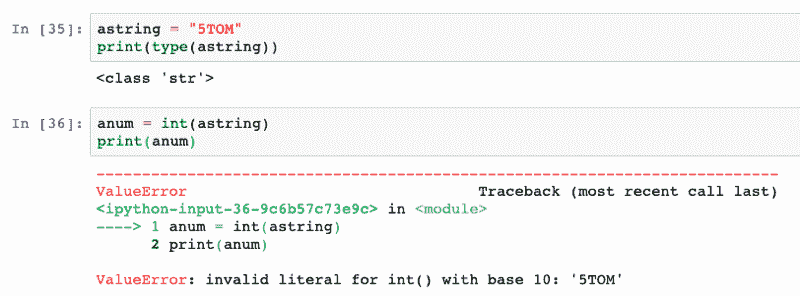

一旦你熟悉了基本的数据类型及其用法，你应该学习 ****算术运算符和表达式求值****【DMAS】**以及如何将结果存储在变量中以备后用。**

```
answer = 43 + 56 / 14 - 9 * 2
print(answer)

# output: 29.0 
```

### 字符串:

在处理字符串数据类型时，知道如何处理文本数据及其操作符会很方便。实践这些概念:

*   使用`+`连接字符串
*   使用`split()`和`join()`方法分裂和连接管柱
*   使用`lower()`和`upper()`方法改变字符串的大小写
*   使用字符串的子字符串

这是涵盖所有讨论要点的笔记本。

## 2.复合数据结构(列表、元组和字典)

### 列表和元组(复合数据类型):

Python 中最常用和最重要的数据结构之一是列表。列表是元素的集合，集合可以是相同或不同的数据类型。

理解列表将最终为在数据阵列上计算代数方程和统计模型铺平道路。

以下是您应该熟悉的概念:

*   如何在 Python 列表中存储多种数据类型。
*   ****索引和切片**** 访问列表的特定元素或子列表。
*   用于 ****排序、反转、删除元素、复制和追加**** 的 Helper 方法。
*   嵌套列表—包含列表的列表。比如`[1,2,3, [10,11]]`。
*   列表中的添加。

```
alist + alist

# output: ['harshit', 2, 5.5, 10, [1, 2, 3], 'harshit', 2, 5.5, 10, [1, 2, 3]]
```

将列表与标量相乘:

```
alist * 2

# output: ['harshit', 2, 5.5, 10, [1, 2, 3], 'harshit', 2, 5.5, 10, [1, 2, 3]]
```

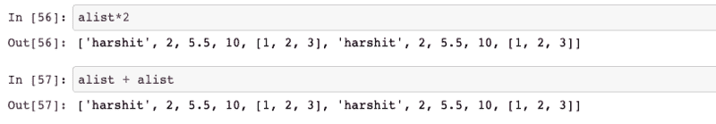

****元组**** 是一个不可变的有序项目序列。它们类似于列表，但是 ****的关键区别在于**元组**是不可变的，而列表是可变的。****

重点关注的概念:

*   索引和切片(类似于列表)。
*   嵌套元组。
*   添加元组和类似`count()`和`index()`的帮助方法。

### 字典

这些是 Python 中另一种类型的集合。列表是整数索引的，而字典更像是地址。字典有键值对，键类似于列表中的索引。

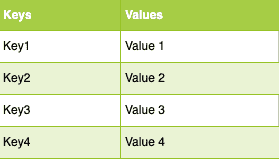

要访问一个元素，需要传递方括号中的键。

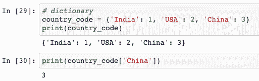

重点关注的概念:

*   遍历字典(也包含在循环中)。
*   使用`get()`、`pop()`、`items()`、`keys()`、`update()`等辅助方法。

以上主题的笔记本可以在[这里](https://github.com/dswh/python_fundamentals/blob/master/Notebooks/python_fundamentals_part-2.ipynb)找到。

## 3.条件、循环和函数

### 条件和分支

Python 使用这些布尔变量来评估条件。每当进行比较或评估时，布尔值就是最终的解决方案。

```
x = True

ptint(type(x))

# output: <class bool>
```

```
print(1 == 2)

# output: False
```

图像中的比较需要仔细观察，因为人们混淆了赋值操作符(`=`)和比较操作符(`==`)。

### 布尔运算符(或、与、非)

这些用于一起评估复杂的断言。

*   `or` —对于整个为真的条件，多个比较中的一个应该为真。
*   `and` —整个条件为真时，所有的比较都应该为真。
*   `not` —检查指定比较的相反情况。

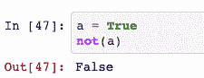

```
score = 76
percentile = 83

if score > 75 or percentile > 90:
    print("Admission successful!")
else:
    print("Try again next year")

# output: Try again next year 
```

要学习的概念:

*   `if`、`else`和`elif`语句来构建你的条件。
*   在一种情况下进行复杂的比较。
*   在编写嵌套的`if` / `else`语句时要记住缩进。
*   使用布尔、`in`、`is`和`not`运算符。

### 环

通常你需要做一个重复的任务，循环将是你最好的朋友来消除代码冗余的开销。您经常需要遍历列表或字典中的每个元素，循环对此很方便。`while`和`for`是两种类型的循环。

重点关注:

*   `range()`函数并使用`for`循环遍历序列。
*   `while`循环

```
age = [12,43,45,10]
i = 0
while i < len(age):
    if age[i] >= 18:
        print("Adult")
    else:
        print("Juvenile")
    i += 1

# output: 
# Juvenile
# Adult
# Adult
# Juvenile 
```

*   遍历列表并以特定顺序追加(或任何其他带有列表项的任务)元素

```
cubes = []
for i in range(1,10):
    cubes.append(i ** 3)
print(cubes)

#output: [1, 8, 27, 64, 125, 216, 343, 512, 729] 
```

*   使用`break`、`pass`和`continue`关键字。

### 列表理解

一种复杂而简洁的创建列表的方法，使用 iterable 后跟一个`for`子句。

例如，您可以使用 list comprehension 创建一个包含 9 个多维数据集的列表，如上例所示。

```
# list comprehension
cubes = [n** 3 for n in range(1,10)]
print(cubes)

# output: [1, 8, 27, 64, 125, 216, 343, 512, 729]
```

### 功能

在从事一个大项目时，维护代码变成了一件真正的苦差事。如果您的代码多次执行类似的任务，管理代码的一种简便方法是使用函数。

函数是对输入数据执行某些操作并给出所需输出的代码块。

使用函数使代码更具可读性，减少冗余，使代码可重用，并节省时间。

Python 使用缩进来创建代码块。这是一个函数示例:

```
def add_two_numbers(a, b):
    sum = a + b
    return sum 
```

我们使用关键字`def`定义一个函数，后跟函数名和圆括号内的参数(输入),再跟一个冒号。

函数体是缩进的代码块，输出用`return`关键字返回。

根据定义，通过指定名称并在括号内传递参数来调用函数。

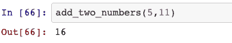

更多例子和细节[在这里](https://github.com/dswh/python_fundamentals/blob/master/Notebooks/python_fundamentals_part-2.ipynb)。

## 4.面向对象编程和使用外部库

我们一直在使用列表、字典和其他数据类型的 helper 方法，但是这些方法是从哪里来的呢？

当我们说 list 或 dict 时，我们实际上是在与 list 类对象或 dict 类对象进行交互。打印一个 **字典对象** 的类型会显示它是一个 class dict 对象。

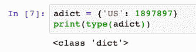

这些都是 Python 语言中预定义的类，它们使我们的任务变得非常简单和方便。

对象是类的实例，被定义为将变量(数据)和函数封装成一个实体。他们可以从类中访问变量(属性)和方法(函数)。

现在的问题是，我们能创建自己的自定义类和对象吗？答案是肯定的。

下面是定义一个类及其对象的方法:

```
class Rectangle:

    def __init__(self, height, width):
        self.height = height
        self.width = width

    def area(self):
        area = self.height * self.width
        return area

rect1 = Rectangle(12, 10)

print(type(rect1))

# output: <class '__main__.Rectangle'> 
```

然后，您可以使用点(.)运算符。

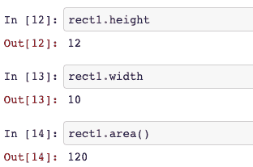

### 使用外部库/模块

将 Python 用于数据科学的一个主要原因是这个了不起的社区为不同的领域和问题开发了高质量的包。使用外部库和模块是在 Python 中处理项目不可或缺的一部分。

这些库和模块定义了我们可以用来完成任务的类、属性和方法。例如，`math`库包含许多数学函数，我们可以用它们来进行计算。这些库是`.py`文件。

你应该学会:

*   导入工作区中的库

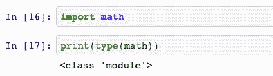

*   使用`help`函数了解一个库或函数

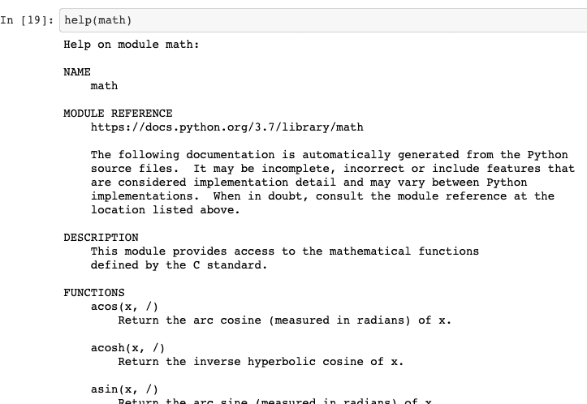

*   直接导入所需的函数。

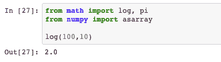

*   如何阅读像 pandas、numpy 和 sklearn 这样的知名软件包的文档并在您的项目中使用它们

## 包裹

这应该涵盖了 Python 的基础知识，并让您开始接触数据科学。

随着您在越来越多的项目中工作，还有一些其他的特性、功能和数据类型您会逐渐熟悉。

你可以在 GitHub repo 中浏览这些概念，在那里你会找到 ****练习**** ****笔记本以及**** :

[dswh/python_fundamentalsPython fundamentals is a series of tutorials on Basic Python knowledge required to get started in the field of Data Science. - dswh/python_fundamentalsdswhGitHub](https://github.com/dswh/python_fundamentals)

以下是基于这篇文章的 3 集视频系列，供您参考:

[https://www.youtube.com/embed/TLLHJC79rDU?feature=oembed](https://www.youtube.com/embed/TLLHJC79rDU?feature=oembed)

## Harshit 的数据科学

[https://www.youtube.com/embed/yapSsspJzAw?feature=oembed](https://www.youtube.com/embed/yapSsspJzAw?feature=oembed)

你可以在 [LinkedIn](https://www.linkedin.com/in/tyagiharshit/) 、 [Twitter](https://twitter.com/tyagi_harshit24) 、 [Instagram](https://www.instagram.com/upgradewithharshit/?hl=en) 上与我联系，也可以查看我的 [YouTube 频道](https://www.youtube.com/channel/UCH-xwLTKQaABNs2QmGxK2bQ)获取更深入的教程和采访。

如果这个教程有帮助，你应该看看我在 [Wiplane Academy](https://www.wiplane.com/) 上的数据科学和机器学习课程。它们全面而紧凑，帮助您建立一个坚实的工作基础来展示。