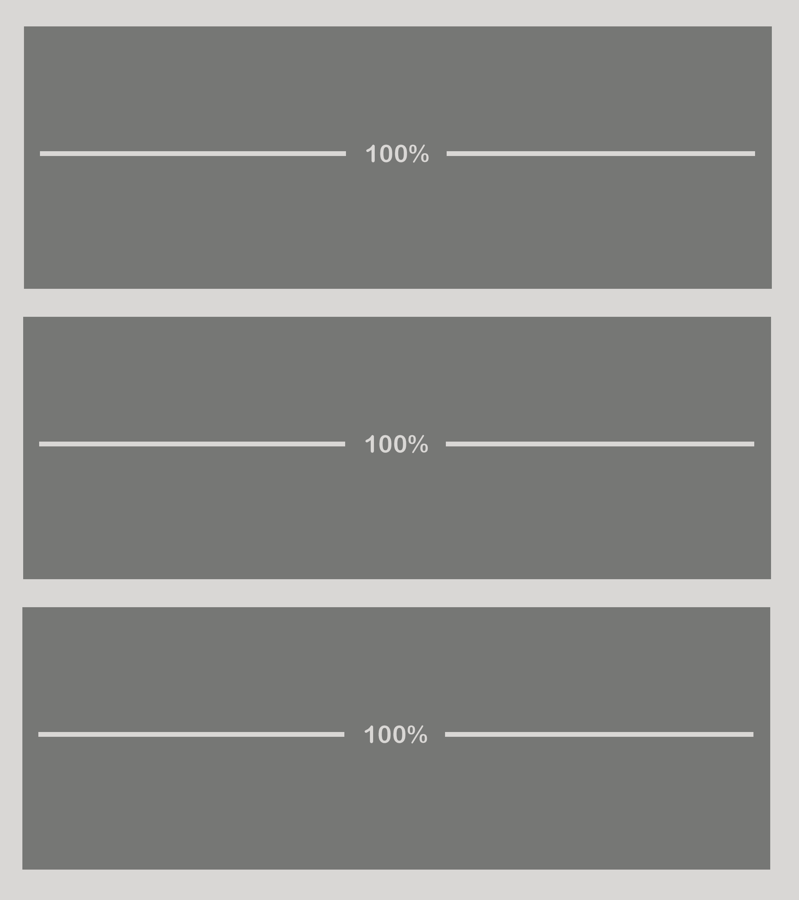
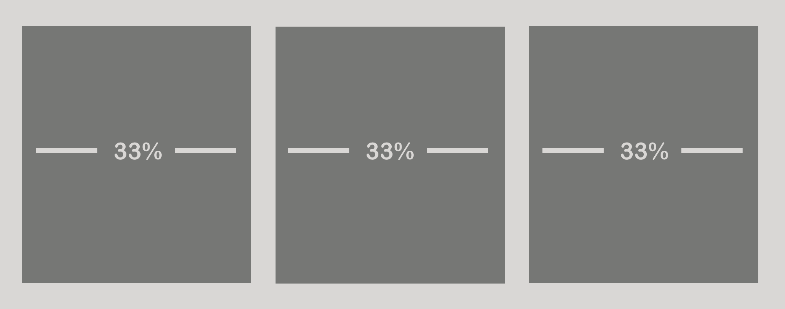
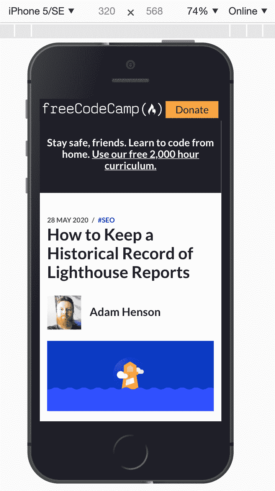
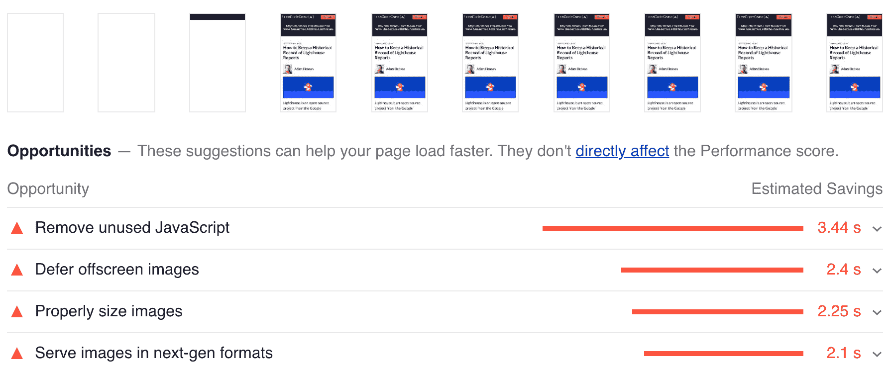

# 响应式网页设计——如何让一个网站在手机和平板电脑上看起来不错

> 原文：<https://www.freecodecamp.org/news/responsive-web-design-how-to-make-a-website-look-good-on-phones-and-tablets/>

在快速发展的互联设备环境中，响应式网页设计在网页开发中仍然至关重要。

不久前,“响应式网页设计”这个术语还不存在。但是今天，我们大多数人不得不在某种程度上接受它。

[根据 Statistica](https://www.statista.com/statistics/275814/mobile-share-of-organic-search-engine-visits/) 的数据，截至 2019 年，61%的谷歌搜索访问发生在移动设备上。2020 年 9 月[谷歌将改变其搜索算法](https://webmasters.googleblog.com/2020/03/announcing-mobile-first-indexing-for.html)，优先考虑移动友好网站。

**在这篇文章中，我将讲述以下内容:**

*   什么是响应式网页设计？
*   viewport meta 标签及其作用
*   响应式网页设计中使用的有效技术，以适应移动和平板设备
*   帮助模拟和监控移动和平板电脑用户体验的工具

## 什么是响应式网页设计？(RWD)

响应式网站设计是一种关注网站用户环境的方法。用户的环境将取决于他们连接到互联网的设备。

有许多设备特性为以用户为中心的关注提供了机会。其中包括:

*   网络连接
*   屏幕大小
*   交互类型(触摸屏、触控板)
*   图形分辨率。

在响应式网站设计流行之前，许多公司管理一个完全独立的网站，接收基于用户代理转发的流量。

但是在响应式 web 设计中，服务器总是向所有设备发送相同的 HTML 代码，CSS 用于改变页面在设备上的呈现。

不管上面的两种策略，为手机或平板电脑创建网站的第一步是确保浏览器知道用户的意图。这就是 viewport meta 标记发挥作用的地方。

## 用于标识移动网站的视区元标签

meta viewport 标签指示浏览器如何根据每个设备的宽度调整页面。

当缺少 meta viewport 元素时，移动浏览器将使用默认桌面设置显示网页。这导致了看似缩小的、无响应的体验。

下面是一个标准实现:

```
<meta name="viewport" content="width=device-width,initial-scale=1"/>
```

Viewport meta tag example

既然浏览器知道发生了什么，我们可以利用流行的技术使我们的网站响应迅速。？

## 不同屏幕尺寸和方向的 CSS 媒体查询

如果你是响应式网站设计的新手，媒体查询是首先要学习的，也是最重要的 CSS 特性。媒体查询允许您基于视口宽度设置元素的样式。一种流行的 CSS 策略是首先编写移动样式，然后在它们的基础上构建更复杂的、特定于桌面的样式。

媒体查询是响应式 web 设计的重要组成部分，通常用于不同屏幕大小和方向的网格布局、字体大小、边距和填充。

下面是 mobile first 样式的一个常见用例示例，其中对于较小的设备，列的宽度为 100%,但在较大的视口中为 50%。

```
.column {
  width: 100%;
}

@media (min-width: 600px) {
  .column {
    width: 50%;
  }
}
```

Mobile first CSS example

上面的代码是一个简单的例子，但是它实际做的事情非常有趣。

1.  首先考虑移动，“列”元素被设置为具有 100%的宽度；
2.  通过使用`min-width`媒体查询，我们专门为最小宽度为`600px`的视窗(比`600px`更宽的视窗)定义了规则。因此，对于比`600px`宽的视窗，我们的列元素的宽度将是其父元素的 50%。

尽管媒体查询对于响应式 web 设计来说是必不可少的，但许多其他新的 CSS 特性也在浏览器中被广泛采用和支持。就响应式 web 设计而言，Flexbox 是这些新重要 CSS 特性之一。

## 什么是 Flexbox？

你可能想知道 Flexbox 是做什么的”？更好的问题是——“Flexbox 不能做什么”？用 CSS 垂直居中最简单的方法是什么？Flexbox。如何创建一个响应式网格布局？Flexbox。我们怎样才能实现全球和平？Flexbox。

Flexbox 布局(Flexible Box)模块提供了一种更有效的方式来在容器中的项目之间布局、对齐和分配空间，即使它们的大小是动态的(因此有“flex”一词)。

在下面的例子中，我们结合如上所述的媒体查询来创建响应网格。

```
<style>
  main {
    background: #d9d7d5;
    display: flex;
    flex-wrap: wrap;
    justify-content: space-between;
  }

  div {
    background: #767775;
    flex-basis: 100%;
    height: 100px;
    margin-bottom: 0.5rem;
  }

  @media (min-width: 600px) {
    main {
      flex-wrap: nowrap;
    }

    div {
      flex-basis: 33%;
    }
  }
</style>
<main>
  <div></div>
  <div></div>
  <div></div>
</main>
```

CSS flexbox example

我们用这段代码完成了以下工作:

1.  在我们的`main`容器元素中建立一个带有`display: flex`的 flexbox 布局。
2.  风格为移动优先。我们将`main`元素设置为`flex-wrap: wrap`,这允许子元素在我们的 flexbox 布局中包装，如下图 1 所示。我们在`div`元素上设置了`flex-basis: 100%`，以确保它们包含 flexbox 布局中 100%的父宽度(图 1)。
3.  平板电脑和台式机等大型设备的风格。我们利用一个类似于上一节示例的媒体查询来将容器`main`元素设置为`flex-wrap: nowrap`。这确保子元素不会换行，并且它们在布局的行类型中维护一列。通过在媒体查询中将`div`设置为`flex-basis: 33%`，我们建立了宽度为父列 33%的列。
4.  在本例中，魔术将出现在具有我们的组合媒体查询和 flexbox 规则的较大设备中。因为我们定义了`display: flex`，并且因为我们没有覆盖媒体查询中的规则，所以我们有一个用于移动、平板和桌面的 flexbox 布局。媒体查询`flex-basis: 33%`和继承的`display: flex`规则将给我们一个可识别的 flexbox 布局，如图 2 所示。在过去，要实现这种列类型的布局，我们需要做一些繁重的工作，并编写 CSS 代码。



Figure 1: Mobile flexbox grid example



Figure 2: Desktop flexbox grid example

Flexbox 提供了一种很好的方式来实现变化的、流畅的布局。在某些情况下，我们在垂直空间可能没有这样的自由。我们可能需要在固定高度内安装一个元素。在这种情况下，我们有另一种技术可以使用——水平滚动。

## 带溢出滚动的水平滚动

可能会出现这样的情况:内容溢出了视窗，却没有一种优雅的方式来处理它。注视...溢出卷轴救援。？

这种技术的常见用途包括可滚动的菜单和表格。下面是一个可滚动菜单的例子。

<menu style="margin: auto; max-width: 826px; background: #d9d7d5; padding: 0.25rem; overflow-y: scroll; white-space: nowrap;">Responsive Web Design RWD Responsive menu Overflow scroll example This is a lot of content! Yes we have another item</menu>

```
<style>
  menu {
    background: #d9d7d5;
    padding: 0.25rem;
    overflow-y: scroll;
    white-space: nowrap;
  }

  span {
    background: #767775;
    color: #ffffff;
    display: inline-block;
    margin: 0.25rem;
    padding: 0.5rem;
  }
</style>
<menu>
  <span>Responsive Web Design</span>
  <span>RWD</span>
  <span>Responsive menu</span>
  <span>Overflow scroll example</span>
  <span>This is a lot of content!</span>
  <span>Yes</span>
  <span>we</span>
  <span>have</span>
  <span>another</span>
  <span>item</span>
</menu>
```

Example horizontal scroll menu

你怎么做到的！？让我们深入探讨一下。

*   是这个食谱的主要成分。通过指定它，子元素将通过滚动行为溢出水平轴。
*   没那么快！尽管你可能认为``overflow-y`` 就足够了，我们还必须告诉浏览器不要用`white-space: nowrap`包装子元素？

现在我们已经有了一些 RWD 布局的技巧，让我们来看看那些挑战视觉本质的元素——图像和视频。

## 响应图像

通过使用现代图像标签属性，我们可以适应各种设备和分辨率。下面是一个响应图像的示例。

```
<style>
  img {
    max-width: 100%;
  }
</style>

<picture>
  <source type="image/webp" srcset="https://my-image.com/my-image-100.webp 1x, https://my-image.com/my-image-200.webp 2x">
  <source type="image/png" srcset="https://my-image.com/my-image-100.png 1x, https://my-image.com/my-image-200.png 2x">
  
</picture>
```

这是在做很多事情。让我们来分解一下:

1.  通过设置`max-width: 100%`，图像将根据其容器宽度放大或缩小。
2.  通过使用`picture`、`source`和`img`标签的组合，我们实际上只渲染了一幅图像，并且只根据用户的设备加载了最合适的图像。
3.  **WebP** 是一种现代图像格式，为网络上的图像提供卓越的压缩。通过利用`source`,我们可以引用一个 WebP 图像用于支持它的浏览器，而另一个`source`标签引用不支持 WebP 的图像的 PNG 版本。
4.  `srcset`用于告知浏览器根据设备的分辨率使用哪个图像。
5.  我们通过利用`loading="lazy"`属性/值对建立[本地惰性加载](https://web.dev/native-lazy-loading/)。

## 响应视频

响应式视频是另一个激发了大量文章和文档的主题。

建立响应图像、视频、iframes 和其他元素的一个关键策略是使用纵横比。纵横比框并不是一项新技术，对于 web 开发人员来说，它是一个非常有用的工具。

[本文提供了关于如何实现“流畅”宽度视频的可靠演示](https://css-tricks.com/fluid-width-video/)。让我们看一下代码，并对其进行分解。

```
<style>
  .videoWrapper {
    position: relative;
    padding-bottom: 56.25%; /* 16:9 */
    height: 0;
  }

  .videoWrapper iframe {
    position: absolute;
    top: 0;
    left: 0;
    width: 100%;
    height: 100%;
  }
</style>

<div class="videoWrapper">
  <!-- Copy & Pasted from YouTube -->
  <iframe width="560" height="349" src="http://www.youtube.com/embed/n_dZNLr2cME?rel=0&hd=1" frameborder="0" allowfullscreen></iframe>
</div>
```

在这个例子中，我们有一个作为 iframe 嵌入 YouTube 视频和一个带有`videoWrapper`类的`div`容器。这段代码做了很多事情...让我们开始吃吧。

*   允许子元素利用相对于它的绝对定位。
*   `height: 0`结合`padding-bottom: 56.25%`是这里建立动态行为的关键成分，强制执行`16:9`纵横比。
*   在 iframe 上设置的`position: absolute`、`top: 0`和`left: 0`创建了一个行为，其中元素相对于其父元素绝对定位自己...贴在左上方。
*   最后，100%的宽度和高度使 iframe 子元素成为其父元素的 100%。母公司`.videoWrapper`完全控制该长宽比布局的建立。

我知道...太多了。为了让视频和图像在手机和平板电脑上呈现最佳效果，我们还可以做更多的事情。除此之外，我鼓励对这些主题进行独立的研究。

好了，现在我们是响应式网页设计的大师了，我们该如何测试我们所做的呢？幸运的是，我们有许多工具来模拟和监控各种设备上的用户体验。

## 模拟和监控响应网站的工具

有很多有用的工具可以帮助我们用响应式网页设计来创建网站。下面是一些我认为特别有用的例子。

### Chrome DevTools 移动仿真

Chrome 的 DevTools 提供了一系列平板电脑和移动设备的移动仿真。它还提供了一个“响应”选项，允许您定义自定义的视口大小。



Figure 3: Chrome DevTools mobile and tablet device emulation

### 用 Foo 监控移动网站性能

Lighthouse 是一个开源工具，它提供了一种针对特定设备分析网站性能的方法。

[Foo 在幕后使用 Lighthouse 监控网站性能，并提供反馈进行分析](https://www.foo.software/lighthouse/)。您可以为桌面和移动设备设置监控，以获得关于网站响应速度的持续反馈。

例如，Lighthouse 报告将根据设备标注未正确加载的图像。



Figure 4: Lighthouse report with mobile device emulation

## 结论

响应式网页设计将继续快速发展，但如果我们紧跟当前趋势，我们可以为用户提供最好的体验。希望这些工具和技巧有帮助！

不仅我们的网站用户会从多样化的设计中受益，而且搜索引擎也会将我们的网页排名提高。