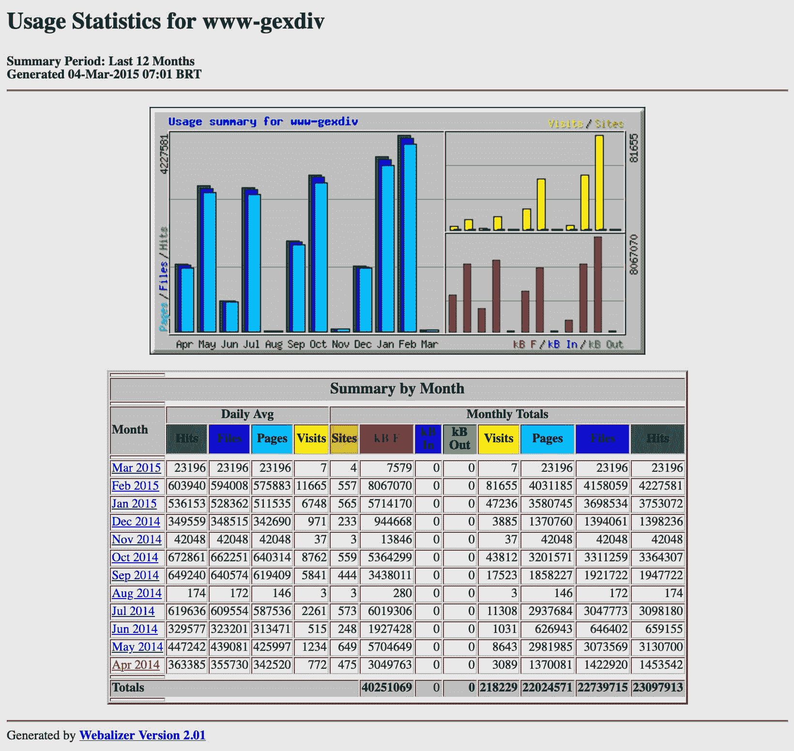
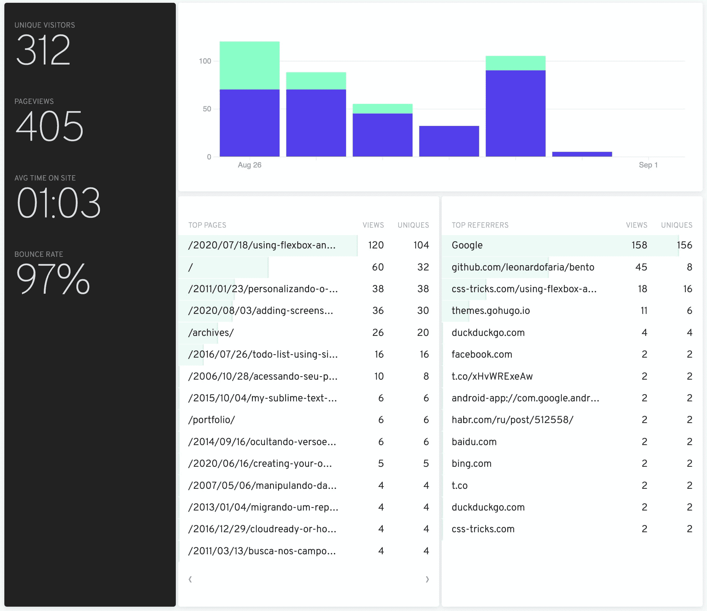
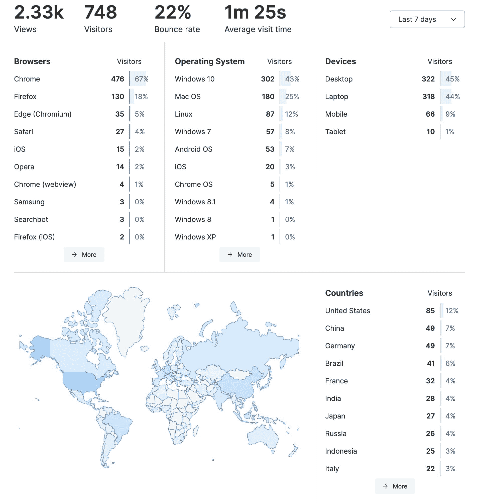
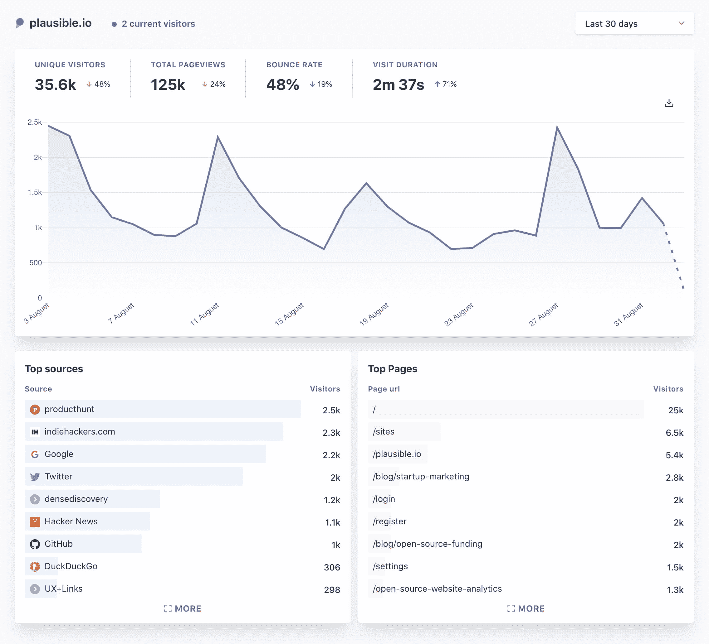

# 为你的下一个项目提供 3 个关注隐私的开源谷歌分析方案

> 原文：<https://www.freecodecamp.org/news/3-privacy-focused-open-source-google-analytics-alternatives-for-your-next-project/>

作为一个内容创作者，我想知道我的网站的页面分析。

总的来说，我很好奇有多少人在阅读我的内容，他们来自哪里(推荐人和国家)，最受欢迎的页面是什么。

20 年前，像 [Webalizer](http://www.webalizer.org/) 这样的工具是我们唯一可以依靠的。像这样的工具解析 Apache 日志，并用处理过的数据创建静态页面。

另一种获得页面分析的方法是在你的网站上插入一张图片——通常是看不见的。通过使用发送到服务器的请求头，人们可以统计访问者的数量，并获得更多的信息，如来源 IP、浏览器和操作系统。这种技术已经过时了，但是像 [statcounter](https://statcounter.com/) 这样的服务仍然提供这种功能。

2005 年，谷歌在收购了同样分析服务器日志的顽童公司后推出了谷歌分析。自早期以来，它的存在就一直在增长，其使用量远远超过任何竞争对手。但是，有几个理由[让你停止在你的网站上使用谷歌分析](https://plausible.io/blog/remove-google-analytics):

1.  它归谷歌所有，谷歌利用分析为自己谋利
2.  它通过给页面请求增加 45KB 来影响网站速度
3.  它太具侵犯性了，收集了大量你不需要的个人数据
4.  它被许多插件和浏览器屏蔽，产生不准确的数据

考虑到这一点，我想分享几个我在过去几个月里一直关注的开源替代方案。

## 英寻

[Fathom](https://usefathom.com/) ( [demo](https://app.usefathom.com/share/sqqvo/chimp+essentials) )是一款收集分析数据的 light Golang 应用。

他们有不同的付费计划，起价为每月 14 美元。他们也有一个精简版，你可以免费安装在你的服务器或 Heroku 上。

lite 版本使用 cookies，它给你提供关于独立访问者、页面浏览量、网站平均停留时间、跳出率、热门页面和热门推荐者的信息。Fathom 将数据存储在 SQLite、MySQL 或 Postgresql 数据库中。

## 鲜味

[umami](https://umami.is/) ( [demo](https://app.umami.is/share/ISgW2qz8/flightphp.com) )是用 Next.js 创建的解决方案，非常容易部署。在我的情况下，使用 Vercel。

除了独立访问者、页面浏览量、网站平均停留时间、跳出率、热门页面和热门推荐人之外，umami 还向您显示有关国家、浏览器、操作系统和设备数据的信息。

## 花言巧语的

我想我第一次听说[似是而非的](https://plausible.io/) ( [演示](https://plausible.io/plausible.io))是在“[去谷歌化你的网站分析](https://changelog.com/podcast/396)”博客播客中。从产品的角度来看，很高兴看到[公开路线图](https://plausible.io/roadmap)，这样客户就可以了解接下来会发生什么。

他们的计划起价为 6 美元/月，并根据你的页面浏览量而上涨，比如 Fathom。他们还有一个 *alpha* 自托管选项，但是我没有机会测试它。

## 结论

有很多选择，你不需要担心大公司会用这些选择来关注你或你的用户。每项服务的设置时间都非常相似，一旦完成，你就可以像使用谷歌分析一样添加多个网站。

我没有最喜欢的。就功能而言，鲜味提供了你想免费了解的所有基本信息。在 Vercel 或 Netlify 等服务上设置也非常容易。

Fathom 和振振有词都提供免费试用，因此您可以在决定之前轻松测试他们的解决方案。

你知道谷歌分析的另一个极简、开源的替代方案吗？请在我博客的[评论](https://leonardofaria.net/2020/09/01/three-privacy-focused-open-source-google-analytics-alternatives/)部分告诉我。

如果你喜欢这篇文章，请在 [Twitter](https://twitter.com/leozera) 和 [GitHub](https://github.com/leonardofaria) 上关注我。

封面照片由[马库斯·温克勒/Unsplash 拍摄](https://unsplash.com/photos/IrRbSND5EUc)