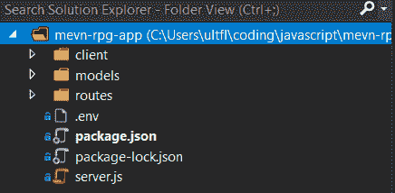
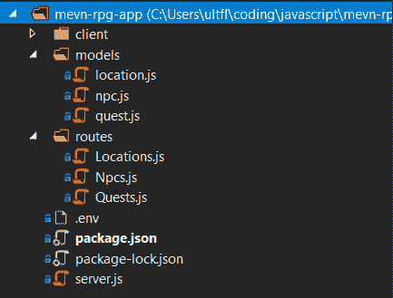

# 在部署您的第一款全栈应用之前，需要考虑三件事

> 原文：<https://www.freecodecamp.org/news/3-things-to-consider-before-deploying-your-first-full-stack-app/>

构建一个全栈应用不是一件容易的事情，部署它需要考虑很多事情。

我是一名[桌面游戏](https://www.nightpathpub.com/entromancy)开发者，最近部署了一个简单的[角色扮演游戏追踪器](https://mevn-rpg-app.herokuapp.com/)，它使用了[M](https://www.mongodb.com/)-[E](https://expressjs.com/)-[V](https://vuejs.org/)-[N](https://nodejs.org/en/)栈(你可以按照我的教程在这里创建自己的 app [)。](https://www.freecodecamp.org/news/build-a-full-stack-mevn-app/)

在部署应用程序的过程中，我遇到了三个关键的要点，当你开始考虑将项目从开发带入生产的最佳方式时，这些要点可能会有用。

你可以在 [GitHub](https://github.com/sominator/mevn-rpg-app) 上查看我的应用程序的代码，我应该提到，它包括乍得·卡特雷特的[非常酷的 CSS statblock](https://codepen.io/retractedhack/pen/gPLpWe) ，美化了原本非常基本的 HTML。

如果你正考虑像我在这里一样进行部署，一定要查看关于 Heroku、T2 和 T4 的官方文档以及尼克·曼宁的教程。

你可能还想看看威尔·艾布拉姆森关于类似主题的文章。

开始部署！

## 您的前端和后端可以一起部署，也可以分开部署，这取决于您的应用程序的复杂性。

当考虑生产时，一个似乎立即出现的障碍是如何部署应用程序的前端和后端的结构问题。

客户机(或静态文件)应该与服务器和数据库在同一个地方吗？或者它们应该是分开的，前端使用 [CORS](https://developer.mozilla.org/en-US/docs/Web/HTTP/CORS) 从其他地方向后端发出 HTTP 请求？

答案是肯定的！或者没有。也许？？

不管是好是坏，这个问题没有放之四海而皆准的解决方案，因为它很可能取决于你的应用的架构和复杂性。在我上面链接的角色扮演游戏跟踪器中，我让整个堆栈运行在一个 Heroku [dyno](https://www.heroku.com/dynos) 上，文件夹结构如下:



所有前端和后端文件都位于同一个位置，而为生产而构建的 Vue 客户端位于/client/dist 文件夹中。

在 server.js 中，除了一堆数据库和路由代码之外，还有一行代码:

```
server.use(serveStatic(__dirname + "/client/dist"));
```

在 Express 中，这告诉应用程序从一个特定的文件夹中提供我的静态客户端文件，并使我能够在同一个环境中运行前端和后端。如果您正在部署一个类似的简单应用程序，这种类型的解决方案可能也适合您。

相反，根据项目的复杂程度，您可能需要将前端和后端分开，将它们作为独立的应用程序，这没什么大不了的。在上面的应用程序中，我的客户端调用由服务器处理的静态 API 端点，如下所示:

```
getQuests: function () {
    axios
        .get('https://mevn-rpg-app.herokuapp.com/quests')
        .then(response => (this.questData = response.data))                   
 }
```

从技术上讲，我的客户可以从任何地方发出这些请求——甚至是一个静态的 GitHub 页面站点。这种类型的解决方案可以帮助将你的应用分成两个不同的实体来处理，这有时比试图将整个项目塞进一个位置要好。

有一点需要注意:如果您要发出跨来源的 HTTP 请求——也就是说，来自与 API 或服务器位于不同域的客户端的请求——您需要熟悉 [CORS](https://en.wikipedia.org/wiki/Cross-origin_resource_sharing) 。你可以在[这篇文章](https://www.freecodecamp.org/news/i-built-a-web-api-with-express-flask-aspnet/)中了解更多。

## 您的代码需要更改以支持生产环境。

当您深陷开发过程时，很容易忘记您的代码在多大程度上依赖于本地文件或其他数据。

在本地运行的 server.js 中考虑以下情况:

```
server.listen(3000, () => console.log("Server started!"));
```

在本地机器上，代码只是要求服务器监听端口 3000，并向控制台记录我们已经准备好起飞了。

在生产环境中，服务器不知道“本地主机”应该在哪里，也不知道它应该监听哪个端口 3000。对于这个例子，您必须将您的代码更改为如下所示:

```
const port = process.env.PORT || 3000;

server.listen(port, () => console.log("Server started!"));
```

上面指示服务器改为监听当前正在运行的*进程*的端口 3000，不管它可能在哪里(查看[这篇文章](https://codeburst.io/process-env-what-it-is-and-why-when-how-to-use-it-effectively-505d0b2831e7)以获得关于这个主题的进一步阅读)。

同样，在我的应用程序中，我有几个模块需要相互导入才能运行:



例如，在/routes/Quests.js 中，我有一个路由器，它告诉服务器在收到 API 请求与数据库中与 quest 相关的项目进行交互时应该做什么。路由器需要从/models/quest.js 导入一个[mongose 模式](https://mongoosejs.com/docs/guide.html)才能正常工作。如果应用程序在本地运行，我们可以说:

```
const Quest = require('../models/quest');
```

相当简单！然而，不幸的是，一旦部署，我们的服务器不知道在哪里找到我们项目的根目录。在 Express 中，我们会将代码改为如下形式:

```
const path = require('path');
const Quest = require(path.join(__dirname, '../models/quest'));
```

您的具体情况可能会有所不同，这取决于您的语言和框架，但是您需要具体了解您的代码在生产环境中的样子，而不是在您的本地开发环境中的样子。

此外，您可能已经熟悉了您的前端所使用的捆绑器(例如， [webpack](https://webpack.js.org/) )，并且想要构建您的生产客户端以优化部署。

## 您有许多部署平台可供选择。

如果您已经部署了一个前端网站或其他类型的静态应用程序，您可能很熟悉将您的文件推送到某个远程存储库并就此收工。

部署一个全栈应用程序(甚至只是一个后端)要复杂得多。您需要一个专用的服务器，或者类似的服务器，来响应它将接收到的 HTTP 请求，并使用一个在线数据库。

有许多服务将为您做这件事，范围基于价格、可伸缩性、复杂性和其他因素。

有很多文章比较了部署的 PaaS 选项，但是在您考虑第一个项目的平台时，这里有一些想法:

*   如果你有一个像我这样的小项目，或者只是想了解部署，那么第一步可以从 [Heroku](https://www.heroku.com/) 开始。
*   AWS、Docker 和 Kubernetes :如果你正在寻找全栈 web 开发或 DevOps 的职业生涯，现在是熟悉[亚马逊 Web 服务](https://aws.amazon.com/)和/或容器平台如 [Docker](https://www.docker.com/) 和 [Kubernetes](https://kubernetes.io/) 的好时机。
*   **Azure** :如果你是 C#或者。NET 开发者， [Azure](https://azure.microsoft.com/en-us/) 似乎是一种无缝的方式来部署你的应用程序，而不必离开微软生态系统的安全。

当然，还有其他几种选择，您的特定用例场景可能取决于价格或提供的特定功能集。

此外，您还需要考虑在生产环境中复制应用程序功能所需的任何插件。比如我的角色扮演游戏追踪器，用的是 MongoDB，但是量产版肯定用不了我本地机器上的那点数据库！相反，我已经使用了 [mLab](https://elements.heroku.com/addons/mongolab) Heroku 插件来启动并运行实时站点，其功能与我的开发环境中的相同。

你的应用的成功，以及你自己作为一个全栈 web 开发者的进步，取决于你考虑部署选项和创建成功的生产管道的能力。稍加研究，我相信你可以找到满足你所有应用需求的最佳解决方案。

编码快乐！

如果你喜欢这篇文章，请考虑[查看我的游戏和书籍](https://www.nightpathpub.com/)，[订阅我的 YouTube 频道](https://www.youtube.com/msfarzan?sub_confirmation=1)，或者[加入 *Entromancy* Discord](https://discord.gg/RF6k3nB) 。

米（meter 的缩写））S. Farzan 博士曾为知名视频游戏公司和编辑网站(如 Electronic Arts、Perfect World Entertainment、Modus Games 和 MMORPG.com)撰稿和工作，并担任过*地下城&龙无冬*和*质量效应:仙女座*等游戏的社区经理。他是 *[Entromancy:一款赛博朋克奇幻 RPG](https://www.nightpathpub.com/rpg)* 的创意总监兼首席游戏设计师，也是 *[夜路三部曲](http://nightpathpub.com/books)* 的作者。在 Twitter 上找到 m . s . Farzan[@ sominator](https://twitter.com/sominator)。