# 2017 年春季发布的 30 个新 Android 库值得您关注

> 原文：<https://www.freecodecamp.org/news/30-new-android-libraries-released-in-the-spring-of-2017-which-deserve-your-attention-faea359a1915/>

作者:米哈尔·比亚拉斯

# 2017 年春季最酷的 30 个安卓库

以上是 2017 年 3 月以来，我最喜欢的 30 个安卓新库。其中一些还没有准备好投入生产，但是你可能会从使用它们中获得很多乐趣。我希望你喜欢这些。

这里他们没有特定的顺序:

#### 1.[马蒂斯](https://github.com/zhihu/Matisse)

这是一个美丽的本地图像和视频选择器。主要功能:

*   选择包括 JPEG、PNG、GIF 的图像和包括 MPEG、MP4、
*   应用自定义主题，包括两个内置主题，
*   不同的图像加载器，
*   定义自定义过滤器规则，
*   在`Activities`和`Fragments`内完全运行。

你可以在 lib 的 [wiki](https://github.com/zhihu/Matisse/wiki) 中找到更多。

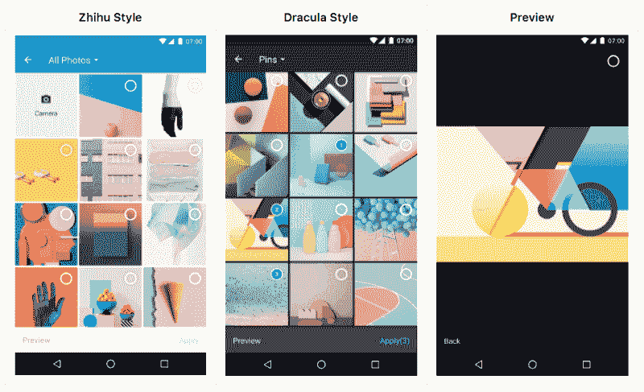

[**胡志/马蒂斯**](https://github.com/zhihu/Matisse)
[*马蒂斯- :fireworks:安卓*github.com](https://github.com/zhihu/Matisse)精心设计的本地图像和视频选择器

#### 2.[云杉安卓动画库](https://github.com/willowtreeapps/spruce-android)

> Spruce 是一个轻量级的动画库，可以帮助设计屏幕上的动画。有这么多不同的动画库，开发人员需要确保每个视图在适当的时间动画。云杉可以帮助设计师要求复杂的多视图动画，而不是让开发人员畏缩在原型。

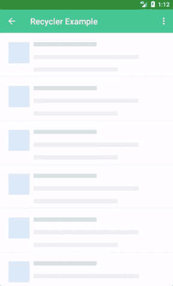

[**willow treeapps/Spruce-Android**](https://github.com/willowtreeapps/spruce-android)
[*Spruce-Android-Spruce 动画库*github.com](https://github.com/willowtreeapps/spruce-android)

#### 3.[材料芯片输入](https://github.com/pchmn/MaterialChipsInput)

芯片是在材料设计中提出的。他们

> 用小块表示复杂的实体，如联系人。芯片可能包含照片、文本、规则、图标或联系人等实体。

MaterialChipsInput 是该组件在 Android 上的实现。该库提供了两种视图:`[ChipsInput](https://github.com/pchmn/MaterialChipsInput#chipsinput)`和`[ChipView](https://github.com/pchmn/MaterialChipsInput#chipview)`。

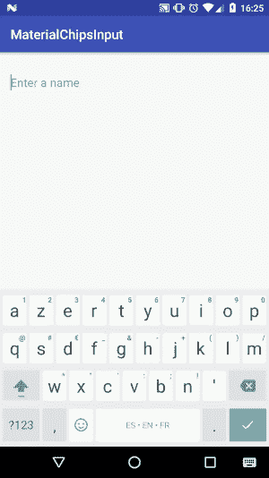

[**PCH Mn/materialschipsinput**](https://github.com/pchmn/MaterialChipsInput)
[*materialschipsinput-Android 的材料设计芯片组件的实现*github.com](https://github.com/pchmn/MaterialChipsInput)

#### 4.[墓](https://github.com/glomadrian/Grav)

这个库允许基于点创建多个动画。看一看——你可以非常容易地制作出多么流畅和美丽的动画。自述文件包含了很多例子，所以你可以在这里[查看](https://github.com/glomadrian/Grav)。

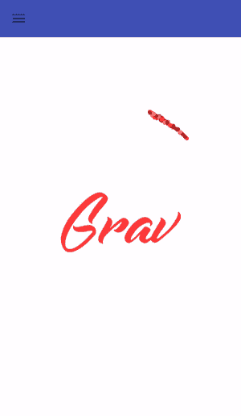

[**glom Adrian/Grav**](https://github.com/glomadrian/Grav)
[*Grav 基于点的可配置动画*github.com](https://github.com/glomadrian/Grav)

#### 5.[石印](https://github.com/facebook/litho)

Litho 不是一个库，而是一个框架。一个真正强大的以声明方式构建 UI 的框架。它是由脸书 devs 开发的，所以即使你不想尝试，仍然值得观察和遵循一个开发过程。

主要功能包括:

*   使用声明式 API 定义 UI 组件。您只需根据一组不变的输入来描述 UI 的布局，框架会处理其余的事情。
*   异步布局:Litho 可以提前测量和布局你的 UI，而不会阻塞 UI 线程。
*   视图扁平化:Litho 使用 [Yoga](https://facebook.github.io/yoga/) 进行布局，并自动减少 UI 包含的视图组数量。
*   细粒度回收:文本或图像等任何组件都可以在 UI 中的任何地方回收和重用。

[**Facebook/litho**](https://github.com/facebook/litho)
[*litho——一个在 Android 上构建高效 ui 的声明式框架。*github.com](https://github.com/facebook/litho)

#### 6.[适应性底部导航](https://github.com/bufferapp/AdaptableBottomNavigation)

前一段时间，谷歌更新了材料设计指南，并引入了底部导航栏，作为我们的应用程序中几个好的 UI 模式之一。他们还将实现添加到设计支持库中。

适应性强的底部导航可以轻松替换支持库中的`BottomNavigationView`。这是按照`ViewPager`和`TabLayout`的工作方式实现的。这是来自 Buffer 团队的简短解释:

> 如上所述，当使用 Android 支持库中的底部导航视图时，可能会有许多用于视图切换的样板代码。因此，我们从 TabLayout setupWithViewPager()方法中获得灵感，创建了一个定制的 ViewSwapper 组件，它可以附加到底部导航视图，以简化视图显示的管理。

你可以在 Github 上了解更多。有一个相当全面的文档和解释为什么要实现它(提示:干净的架构？).

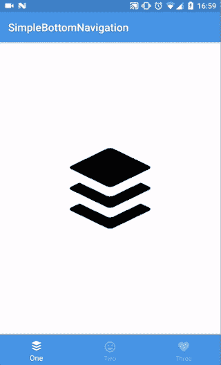

[**buffer app/AdaptableBottomNavigation**](https://github.com/bufferapp/AdaptableBottomNavigation)
[*AdaptableBottomNavigation——Android 上实现底部导航视图的更简单方式*github.com](https://github.com/bufferapp/AdaptableBottomNavigation)

#### 7.[模式锁定视图](https://github.com/aritraroy/PatternLockView)

> 这个库允许你在你的应用程序中简单快速地实现模式锁定机制。它非常易于使用，并且有大量的定制选项可用来改变该视图的功能和外观，以满足您的需求。

> 它还支持 RxJava 2 视图绑定，因此如果您是反应式编程的粉丝(就像我一样)，您可以在用户绘制模式时获得一系列更新。

*README* 中充满了例子，所以从库开始很容易。

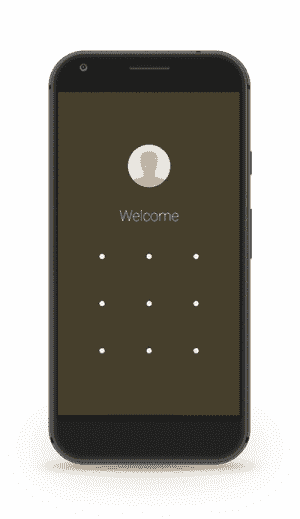

[**arit raroy/Pattern lockview**](https://github.com/aritraroy/PatternLockView)
[*Pattern lockview——一个易于使用、可定制和材质设计就绪的 Android 模式锁定视图*github.com](https://github.com/aritraroy/PatternLockView)

#### 8.[等距图](https://github.com/FabianTerhorst/Isometric)

这是一个帮助绘制等距图形的库。在我看来，它是列表中最酷的图书馆之一，因为它让我想起了[纪念碑谷](https://play.google.com/store/apps/details?id=com.ustwo.monumentvalley)游戏。
该库支持绘制多种形状、路径和复杂结构，如下例所示。

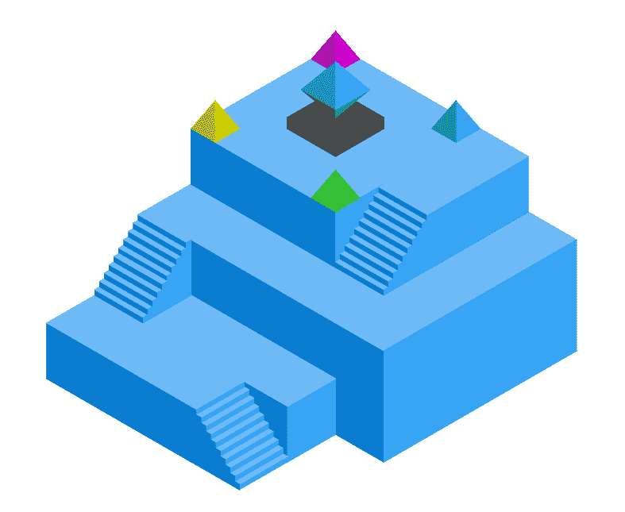

[**fabianterhost/Isometric**](https://github.com/FabianTerhorst/Isometric)
[*用于 Android 的等距图库*github.com](https://github.com/FabianTerhorst/Isometric)

#### 9.[超视距雷达](https://github.com/alibaba/UltraViewPager)

我们可以把这个库当做一个`ViewPager`扩展，封装了很多特性，主要是为多页面切换场景提供一个统一的解决方案。

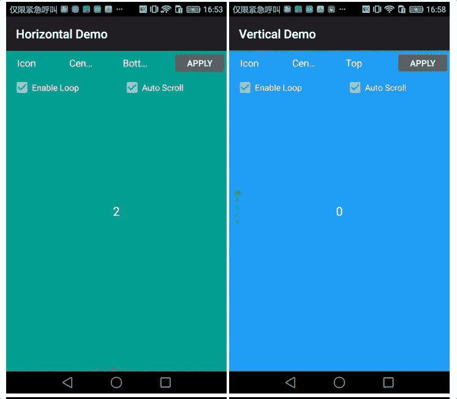

#### UltraViewPager 支持:

*   水平滚动和垂直滚动，
*   多视图合一`ViewPager`
*   循环切换视图。例如，如果在一个`ViewPager`中有 3 个视图要显示，它应该在第三个视图之后切换回第一个视图，
*   自动滚动功能(使用`Handler`实现定时器)，
*   设置最大高度和最大宽度，
*   设置纵横比，
*   指示我们当前的视图(圆圈和图标)，
*   内置两种页面过渡动画。

这个库也有很好的文档。

[**Alibaba/ultraViewPager**](https://github.com/alibaba/UltraViewPager)
[*ultraViewPager 是 view pager 的扩展，在单个 view pager 中提供多种功能。*github.com](https://github.com/alibaba/UltraViewPager)

#### 10.[无限卡](https://github.com/BakerJQ/Android-InfiniteCards)

这个库帮助实现 UI 卡，然后用一个漂亮的动画切换它们。

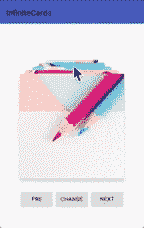

[**BakerJQ/Android-infinite cards**](https://github.com/BakerJQ/Android-InfiniteCards)
[*Android-infinite cards-一个面向 Android 的无限卡切换 UI，支持自定义动画可自定义动效的卡片切换视图*github.com](https://github.com/BakerJQ/Android-InfiniteCards)

#### 11.[磨根名](https://github.com/yarolegovich/SlidingRootNav)

这是一个库，我们可以把它看作是一个 DrawerLayout-like `ViewGroup`，其中一个*抽屉*隐藏在内容视图下，然后可以被移动以使抽屉可见。*很全面，确实值得一查。*

**

*[**yarolegovich/SlidingRootNav**](https://github.com/yarolegovich/SlidingRootNav)
[*SlidingRootNav-DrawerLayout-like view group，内容视图下隐藏了一个“抽屉”，可以移动…*github.com](https://github.com/yarolegovich/SlidingRootNav)*

#### *12.[密码视图](https://github.com/hanks-zyh/PasscodeView)*

*这只是一个您可以键入密码的视图。但是想一个！*

*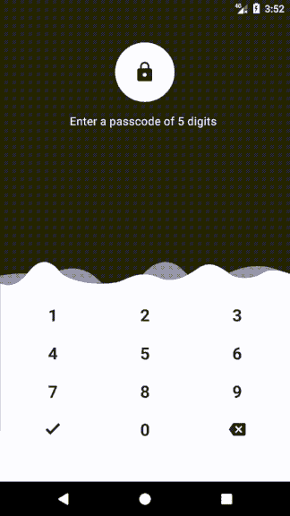*

*[**hanks-zyh/PasscodeView**](https://github.com/hanks-zyh/PasscodeView)
[*材质设计 PasscodeView for Android。*github.com](https://github.com/hanks-zyh/PasscodeView)*

#### *13. [MusicWave](https://github.com/akshay2211/MusicWave)*

*这个库允许将声音表现为一种渐变颜色的可视化。*

*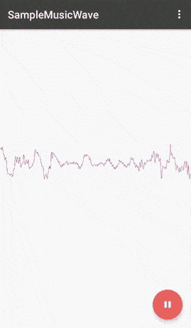*

*[**akshay 2211/MusicWave**](https://github.com/akshay2211/MusicWave)
[*用 music wave 以渐变的彩色可视化方式表现你的声音*github.com](https://github.com/akshay2211/MusicWave)*

#### *14. [ShadowImageView](https://github.com/yingLanNull/ShadowImageView)*

*这个库可以帮助你给你的图片添加更多有意义的阴影。根据*自述*，是*

> *更精致的阴影效果，用在一些特殊场景中提升用户体验。*

*而且，它很容易使用。*

**

* **[*shadow imageview-？可以根据图片内容变阴影颜色,更加细腻的阴影效果它可以根据画面改变颜色，更细腻的阴影效果 g*ithub.com](https://github.com/yingLanNull/ShadowImageView)***

#### ***15. [PolygonDrawingUtil](https://github.com/stkent/PolygonDrawingUtil)***

***这是一个高效的 Android 实用程序类，用于在`[Canvas](https://developer.android.com/reference/android/graphics/Canvas.html)`上绘制正多边形。我们可以指定:***

*   ***边数(≥ 3)，***
*   ***中心坐标，***
*   ***外径(中心到顶点)，***
*   ***圆角半径，***
*   ***多边形旋转，***
*   ***填充/描边`[Paint](https://developer.android.com/reference/android/graphics/Paint.html)`。***

***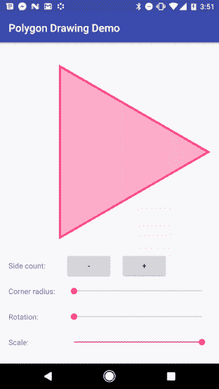***

***[**ST Kent/polygondrawinguti**](https://github.com/stkent/PolygonDrawingUtil)
[*polygondrawinguti——一个高效的 Android 实用程序类，用于在画布上绘制正多边形。*github.com](https://github.com/stkent/PolygonDrawingUtil)***

#### ***16.[微小的](https://github.com/Sunzxyong/Tiny)***

***这是列表中的第二个框架。它负责图像压缩，功能相当强大。此外，它***

> ***使用异步线程池压缩图像，并在压缩完成后在主线程中分发结果。***

***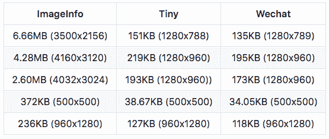

Effects of compression*** 

***[**sunzxyyong/Tiny**](https://github.com/Sunzxyong/Tiny)
[*Tiny-一个图像压缩框架。*github.com](https://github.com/Sunzxyong/Tiny)***

#### ***17.[粒子文本视图](https://github.com/Yasic/ParticleTextView)***

***这个库提供了一个定制的`TextView`小部件，它可以使用各种动画效果和配置属性从粒子创建文本。***

***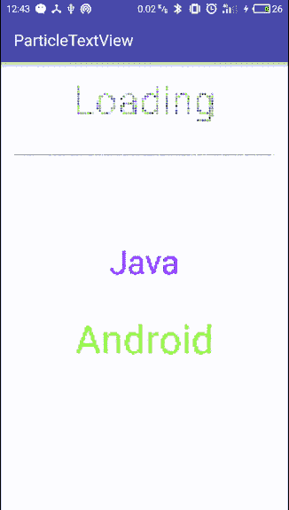***

***[**Yasic/particle textview**](https://github.com/Yasic/ParticleTextView)
[*particle textview-一个用粒子动画显示文字的机器人自定义查看*github.com](https://github.com/Yasic/ParticleTextView)***

#### ***18.[羊角面包](https://github.com/steelkiwi/cropiwa)***

***这是一个高度可配置的图像裁剪工具。该库具有模块化的体系结构，这使得它具有高度的可配置性。关于如何配置`CropIwaView`的信息，请参考 Github 上的 [wiki。](https://github.com/steelkiwi/cropiwa)***

***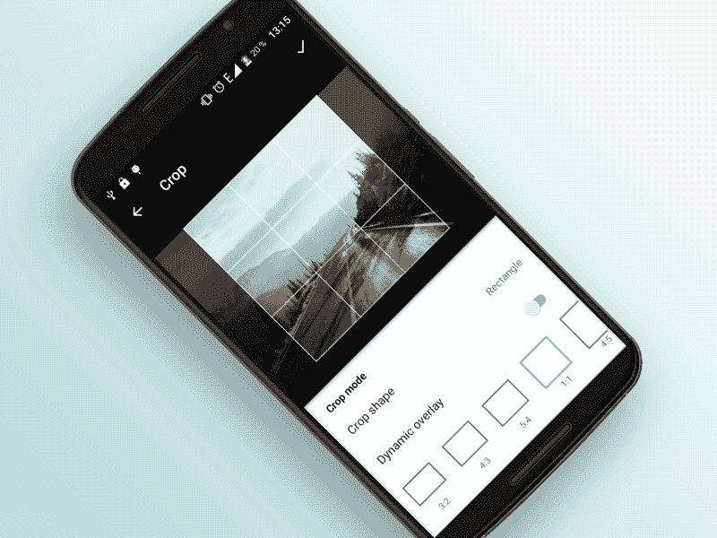***

***[**steel kiwi/cropiwa**](https://github.com/steelkiwi/cropiwa)
[*cropiwa-？Android g*ithub.com](https://github.com/steelkiwi/cropiwa)的可配置定制裁剪部件***

#### ***19.[避孕套项目](https://github.com/oasisfeng/condom)***

> ***这是一个很薄的库，用于在将 Android 项目传递给第三方 SDK 之前，对其进行封装。**它旨在阻止第三方 SDK 常见的有害行为，这些行为可能会损害您的应用程序的用户体验。*****

***以下是解释:***

> ***在其他应用程序中大量启动进程(常见于第三方推送 SDK)，导致应用程序启动缓慢，并在中低端设备上明显滞后。这种行为在具有类似 SDK 的应用程序中产生了连锁反应，极大地恶化了整体设备性能。***

***[**Oasis Feng/Condom**](https://github.com/oasisfeng/condom)
[*Condom-an ultra-light and ultra-thin Android tool library, can prevent common harmful behaviors in the three-party SDK without affecting the functions of the application itself. (such as "chain wake-up" which seriously affects the user experience)* github.com](https://github.com/oasisfeng/condom)***

#### ***20.[应用程序方法](https://github.com/zjw-swun/AppMethodOrder)***

***这个库允许你跟踪所有函数的调用顺序。该项目是有据可查的，你可以找到如何使用它的详细手册。唯一的限制是，它是用中文写的，但你可以随时在浏览器中点击*翻译成英文*，享受这个伟大的项目。***

***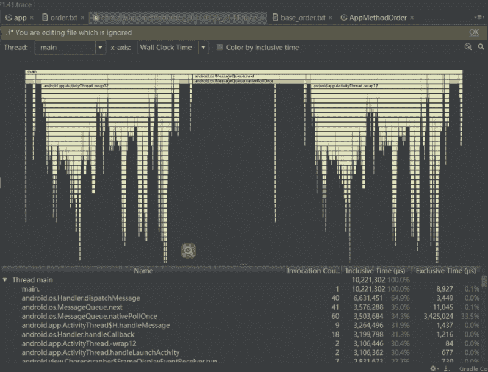***

***[**ZJW-Swun/AppMethoder**](https://github.com/zjw-swun/AppMethodOrder)
[*AppMethoder-an Android library (no intrusive code required)* github.com](https://github.com/zjw-swun/AppMethodOrder)***

#### ***21.[安卓调试包](https://github.com/hulab/debugkit)***

***这是一个有趣的图书馆。它允许你创建和使用特殊的悬停调试工具，来触发你在应用程序中定义的动作。很明显，这些动作可以在运行时触发，因此它可以在反馈书写或测试电话屏幕时使用。
本库使用构建器模式。它易于使用，在 *README，*中有一个用法示例。***

***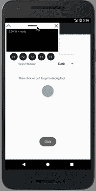***

***[**hulab/debug kit**](https://github.com/hulab/debugkit)
[*debug kit——你的 UI 里有没有隐藏调试功能？这里有一个干净的方法来做到这一点！*github.com](https://github.com/hulab/debugkit)***

#### ***22.[审美](https://github.com/afollestad/aesthetic)***

***这是一个新的库，仍处于测试阶段，但它做了一件非常酷的事情——它通过 Rx 支持动态地改变你的主题！根据作者的说法，这是***

> ***一个快速易用的即插即用动态主题引擎。由 Rx 提供支持，适用于 Android 应用程序。***

***文档非常好，非常全面，绝对值得一看。***

***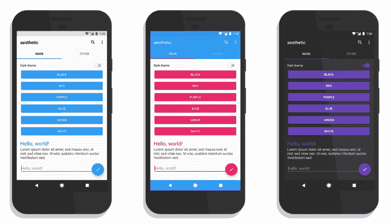***

***[**afollestad/唯美**](https://github.com/afollestad/aesthetic)
[*唯美——【BETA】一款快速易用的即插即用动态主题引擎。由 Rx 提供支持，适用于 Android 应用程序。*github.com](https://github.com/afollestad/aesthetic)***

#### ***23. [EasyCalendar](https://github.com/shichaohui/EasyCalendar)***

***这是一个简单的自定义日历部件。主要功能包括:***

*   ***标题自定义布局，***
*   ***日期的自定义布局，***
*   ***显示或隐藏日期分隔线，***
*   ***显示或隐藏溢出日期，***
*   ***点击收听日期视图。***

***文档很全面，库也很容易使用。***

******

***[**时潮汇/easy calendar**](https://github.com/shichaohui/EasyCalendar)
[*快速定制日历 ui。您可以使用 EasyCalendar 快速获得日历样式的 UI。*github.com](https://github.com/shichaohui/EasyCalendar)***

#### ***24. [SimpleRatingBar](https://github.com/ome450901/SimpleRatingBar)***

***该库提供了两个分级栏:***

*   ***BaseRatingBar —没有任何动画，***
*   ***ScaleRatingBar 带有渐进和缩放动画。***

***你可以在下面的 gif 中看到它们:***

***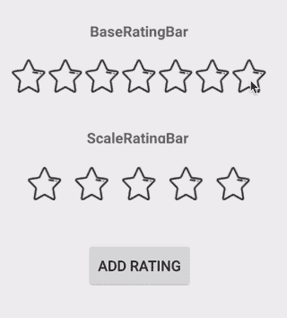***

***[**ome 450901/SimpleRatingBar**](https://github.com/ome450901/SimpleRatingBar)
[*SimpleRatingBar——一个带有刻度动画的简单评级栏*github.com](https://github.com/ome450901/SimpleRatingBar)***

#### ***25.[麦哲伦](https://github.com/wealthfront/magellan)***

***这个库被标榜为最简单的 Android 导航库，但你需要检查它是否值得你使用。
主要特点:***

*   ***导航就像调用`goTo(screen)`方法一样简单，***
*   ***你完全控制了背后攻击，***
*   ***过渡会自动为您处理。***

***它有全面的 wiki，包含所有需要的解释。***

******

***[**wealth front/麦哲伦**](https://github.com/wealthfront/magellan)
[*麦哲伦——最简单的安卓导航库。*github.com](https://github.com/wealthfront/magellan)***

#### ***26.[查看器动画器](https://github.com/StylingAndroid/ViewPagerAnimator)***

> ***ViewPagerAnimator 是一个新的轻量级，但功能强大的*view pager*Android 动画库。它被设计成当用户在*浏览器*中的页面间导航时动画显示任意值，并且将精确地跟随手指的运动。虽然这个库本身可能对某些人有用，但是发布这个库的主要目的是展示一些美妙的 API 细节，这些细节在使用即将到来的 Java 8 扩展时非常突出。提供了 Java 7 和 Java 8 的示例项目。***

***这是由马克·艾利森写的，你可以在他的 T2 风格的 Android 博客上获得更多信息。***

***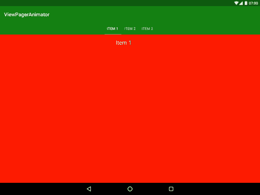***

***[**styling Android/viewpagerananimator**](https://github.com/StylingAndroid/ViewPagerAnimator)
[*viewpagerananimator——一个轻量级但功能强大的 Android ViewPager 动画库*github.com](https://github.com/StylingAndroid/ViewPagerAnimator)***

#### ***[27。BlockCanaryEx](https://github.com/seiginonakama/BlockCanaryEx)***

***这是一个库，当你的应用程序阻塞时，它有助于在你的代码中找到重方法。它基于 [BlockCanary](https://github.com/markzhai/AndroidPerformanceMonitor) 。***

******

***[**seiginonakama/BlockCanaryEx**](https://github.com/seiginonakama/BlockCanaryEx)
[*BlockCanaryEx——在 app 受阻时轻松进行性能瓶颈检测*github.com](https://github.com/seiginonakama/BlockCanaryEx)***

#### ***28. [PaletteImageView](https://github.com/DingMouRen/PaletteImageView)***

***这个图书馆很酷。它给你的图像增加了阴影，但是阴影的颜色是图像的主色。***

***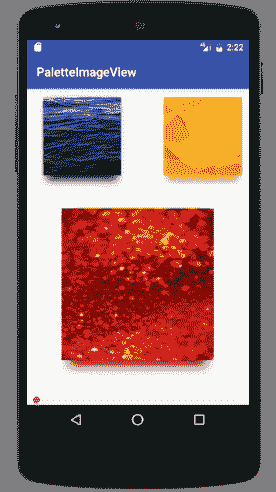***

***文档很差，但我认为代码是不言自明的。***

***[**丁某人/palette imageview**](https://github.com/DingMouRen/PaletteImageView)
[*palette imageview-为图片添加阴影,阴影颜色来源于图片的主色*github.com](https://github.com/DingMouRen/PaletteImageView)***

#### ***29. [RecyclerRefreshLayout](https://github.com/dinuscxj/ShootRefreshView)***

***这是一个打开相机快门的刷新动画。在我看来确实值得一查，尤其是在*自述*中有一段数学分析，是如何达到这种效果的！***

***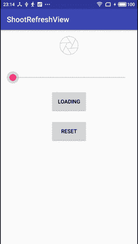***

***[**dinuscxj/shootrefresh view**](https://github.com/dinuscxj/ShootRefreshView)
[*shootrefresh view——是一个打开快门的刷新动画*github.com](https://github.com/dinuscxj/ShootRefreshView)***

#### ***30.超薄适配器***

***这是一种不用`ViewHolder`编写适配器的方法。主要特性包括:***

*   ***没有`ViewHolders`，***
*   ***没有反射，***
*   ***流畅简单的 API，***
*   ***多类型适配器，***
*   ***科特林支持，***
*   ***简单的`DiffUtil`支持。***

***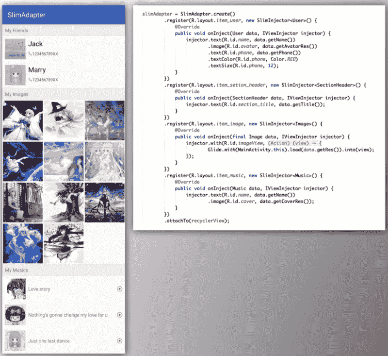***

***[**mei dik/slim Adapter**](https://github.com/MEiDIK/SlimAdapter)
[*slim Adapter-一款没有# VIEWHOLDER 的超薄&干净的&型适配器*github.com](https://github.com/MEiDIK/SlimAdapter)***

***就是这样。我希望你喜欢这篇文章！如果我没有提到今年春天发布的任何其他伟大的库，请在下面的评论中告诉我。让我们一起保持这个列表更大！***

***如果你喜欢我的文章，请别忘了点击？？？去推荐给别人？？？。***

***此外，要获得关于我的新文章和故事的通知，请在[媒体](https://medium.com/@mmbialas)和[推特](https://twitter.com/mmbialas)上关注我。你也可以在 [LinkedIn](https://www.linkedin.com/in/mmbialas) 上找到我。干杯！***