# 30 秒代码:如何在 JavaScript 中重命名多个对象键

> 原文：<https://www.freecodecamp.org/news/30-seconds-of-code-rename-many-object-keys-in-javascript-268f279c7bfa/>

《30 秒代码》是一个精彩的 JavaScript 片段集，可在≤ 30 秒内消化。任何想要掌握 JavaScript 的人都应该从头到尾看一遍。

然而，这个列表没有包含重命名多个对象键的函数，所以我创建了一个 [pull 请求](https://github.com/Chalarangelo/30-seconds-of-code/pull/646)，幸好它被合并了！

以下是官方参赛作品:[https://30secondsofcode.org/object#renamekeys](https://30secondsofcode.org/object#renamekeys)

我以前写过关于[重命名对象键](https://medium.com/front-end-hacking/immutably-rename-object-keys-in-javascript-5f6353c7b6dd)的文章，但是我们一次只改变一个键。

然后[亚当·罗](https://medium.com/@adaminsley)友好地评论，问我们如何重命名*多个*对象键。经过一番思考和研究后，我回复了这个代码示例。

```
renameKeys = (keysMap, obj) =>
  Object.keys(obj).reduce(
    (acc, key) => ({
      ...acc,
      ...{ [keysMap[key] || key]: obj[key] }
    }),
    {}
  ); 
```

这个灵感来自于 [Ramda 附属品](https://char0n.github.io/ramda-adjunct/2.6.0/RA.html#.renameKeys)的`renameKeys`功能。

*   `keysMap`包含旧/新对象键的键/值对。
*   `obj`是要改变的对象。

你可以这样使用它:

```
keysMap = {
  name: 'firstName',
  job: 'passion'
};

obj = {
  name: 'Bobo',
  job: 'Front-End Master'
};

renameKeys(keysMap, obj);
// { firstName: 'Bobo', passion: 'Front-End Master' } 
```

让我们一步一步来！我们可以编写这个函数的一个扩展的、`debugger`-友好版本:

```
renameKeys = (keysMap, obj) => {
  debugger;

  return Object.keys(obj).reduce((acc, key) => {
    debugger;

    const renamedObject = {
      [keysMap[key] || key]: obj[key]
    };

    debugger;

    return {
      ...acc,
      ...renamedObject
    };
  }, {});
}; 
```

我们会这样使用它:

```
renameKeys(
  {
    name: 'firstName',
    job: 'passion'
  },
  {
    name: 'Bobo',
    job: 'Front-End Master'
  }
); 
```

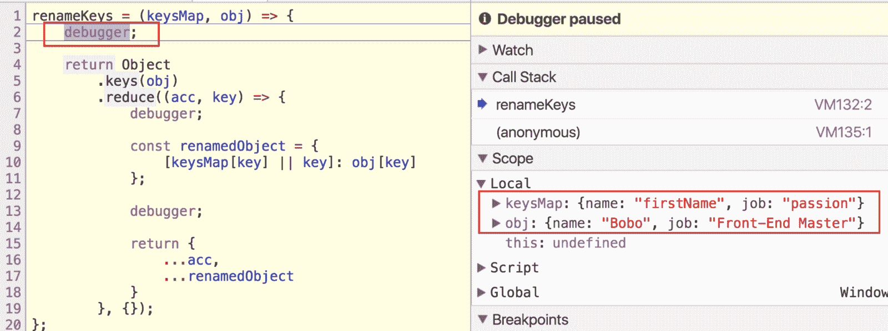

暂停在第 2 行，我们看到`keysMap`和`obj`已经被正确赋值。

有趣的事情开始了。移动到下一个`debugger`。

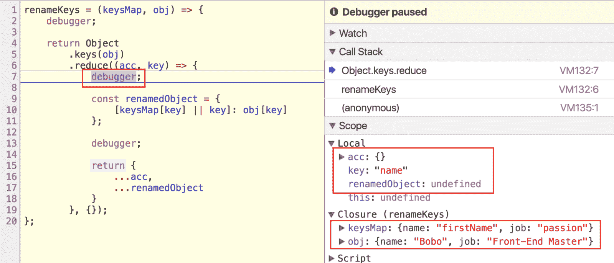

检查第 7 行的局部变量:

*   `acc: {}`因为那是`Array.reduce()`的初始值(第 19 行)。
*   `key: “name”`因为它是`Object.keys(obj)`的第一个键。
*   `renamedObject: undefined`

还要注意，我们可以从父函数的作用域访问`keysMap`和`obj`。

猜猜`renamedObject`会是什么。就像我在[前面提到的帖子](https://medium.com/front-end-hacking/immutably-rename-object-keys-in-javascript-5f6353c7b6dd)中一样，我们使用 [*计算属性名*](https://developer.mozilla.org/en-US/docs/Web/JavaScript/Reference/Operators/Object_initializer) 来动态分配`renamedObject`的键。

如果`keysMap[key]`存在，使用它。否则，使用原始对象键。在这个例子中，`keysMap[key]`就是`“firstName”`。

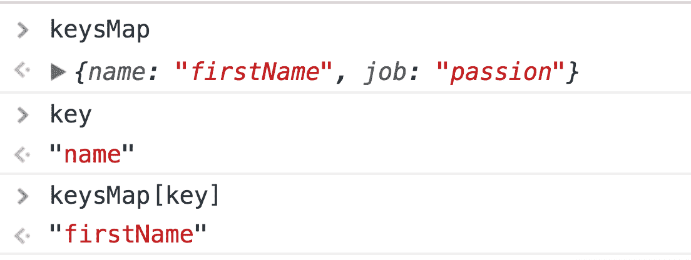

那是`renamedObject`的键，它对应的值呢？

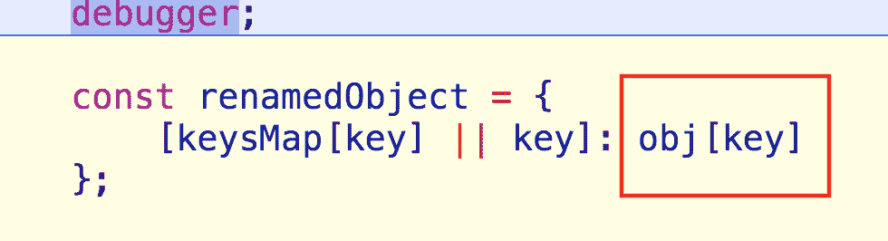

是`obj[key]` : `"Bobo"`。点击下一个`debugger`，查看一下。

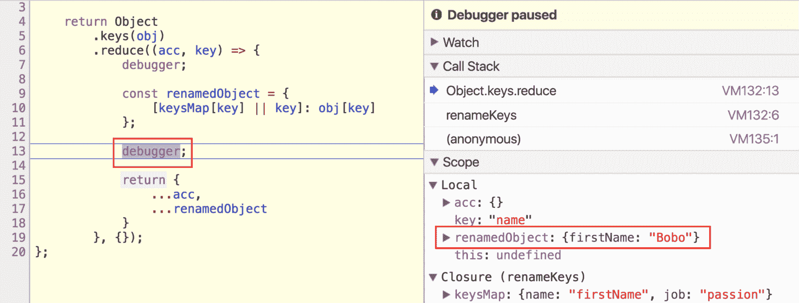

`renamedObject`现在是`{ firstName: “Bobo” }`。

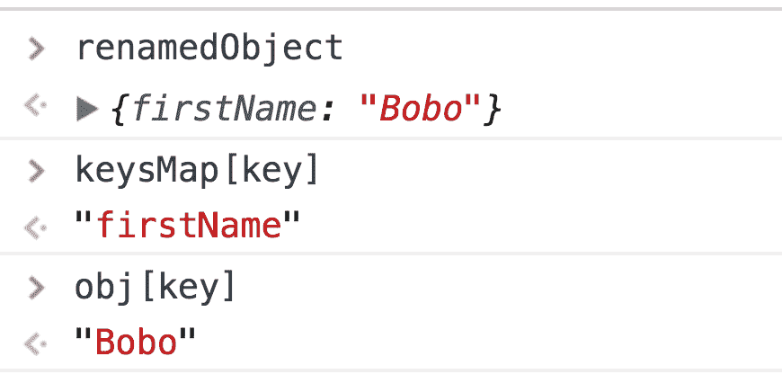

现在使用*展开*操作符，我们将合并`acc`和`renamedObject`。记住`acc`目前是`.reduce`的初始值:一个空对象。

所以合并`acc`和`renamedObject`只是产生了`renamedObject`的克隆。

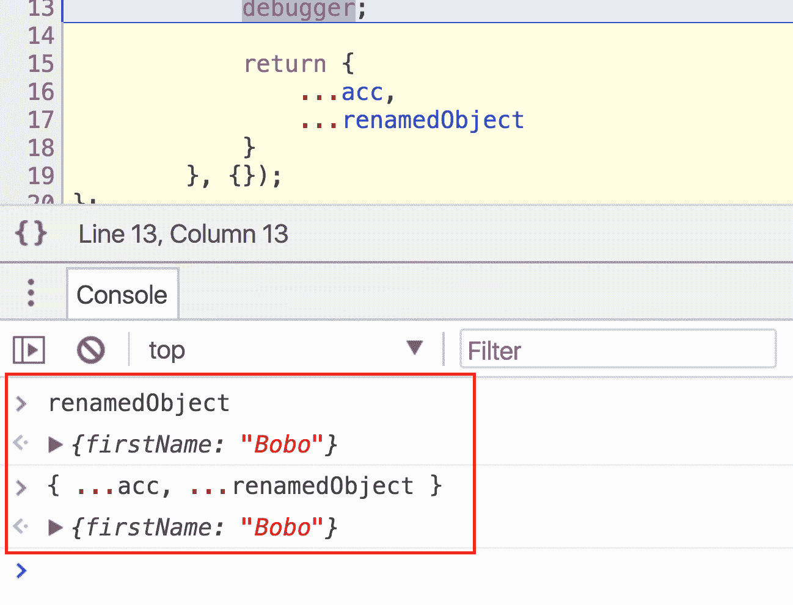

然而，由于我们正在返回这个对象，它在`.reduce`的下一次迭代中变成了`acc`。移到下一个`debugger`看这个。

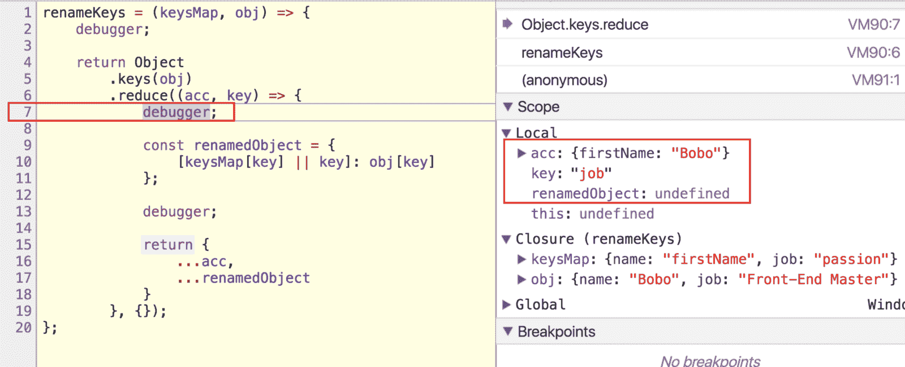

我们又回到了`.reduce`的内部，因为还有一个`key`要处理。我们看到`acc`现在是`{ firstName: "Bobo" }`。

同样的过程再次运行，并且正确地创建了`renamedObject`。

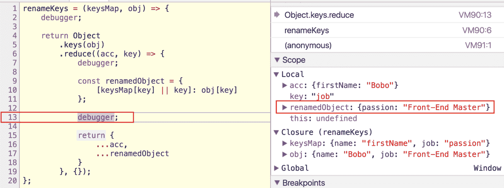

这一次，合并`acc`和`renamedObject`实际上有所不同。

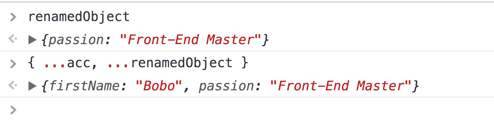

运行这个`debugger`来返回那个对象，就完成了！

以下是最终输出:

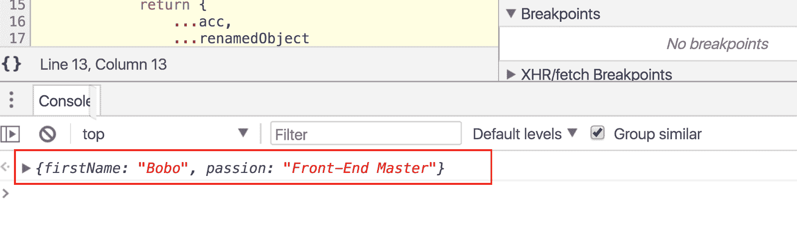

玩得开心重命名**所有的键**，直到下次！