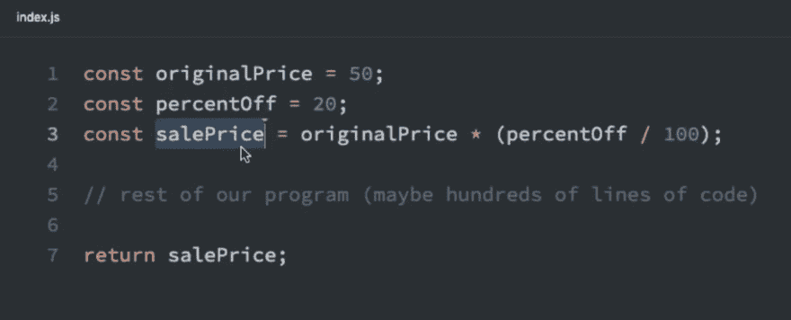
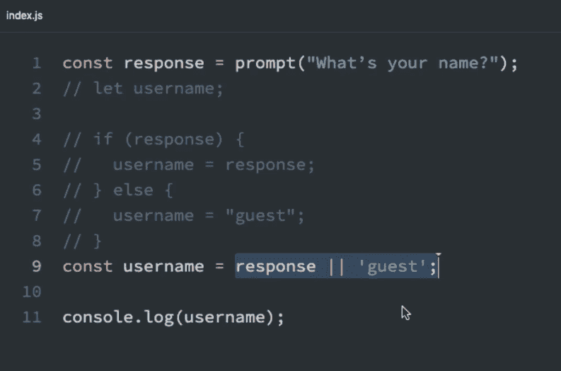
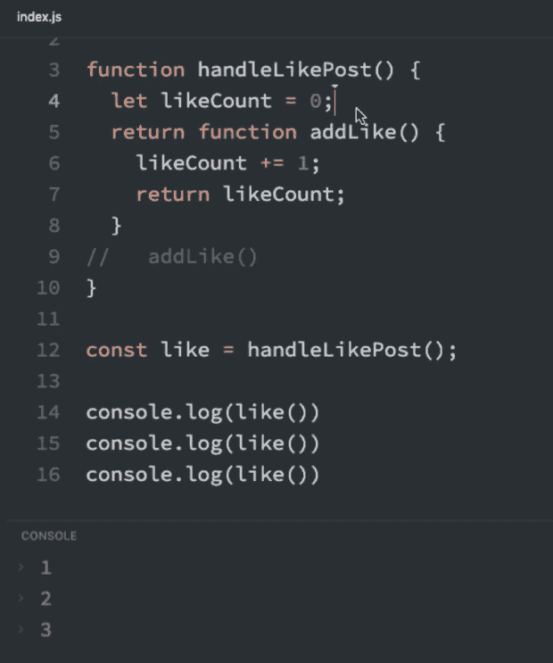
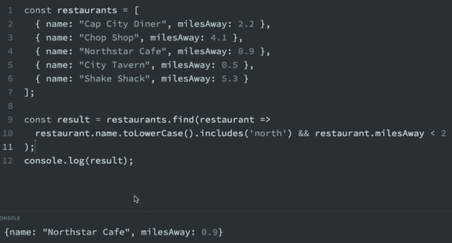
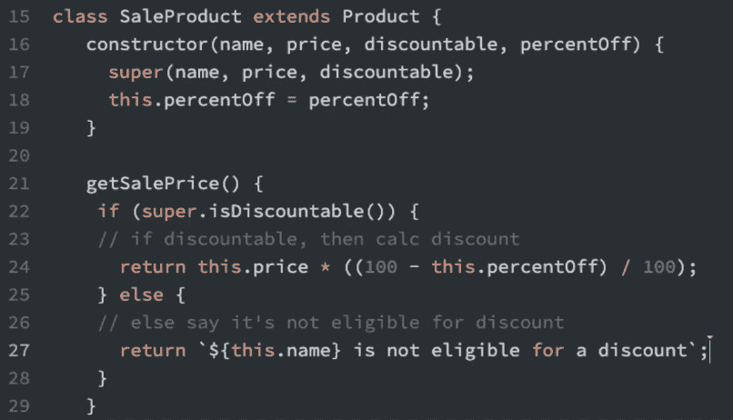
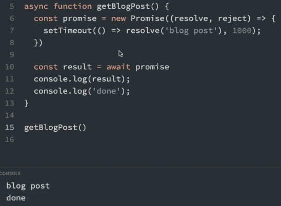
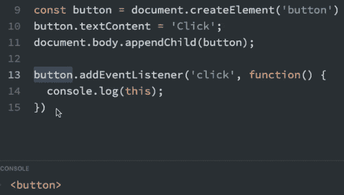

# 在这个 28 节的课程中，学习构建应用程序所需的 JavaScript

> 原文：<https://www.freecodecamp.org/news/learn-javascript-to-build-apps/>

您是否正在努力寻找构建真实应用程序所需的 JavaScript 技能？[看看这个简明的、充满示例的课程](https://bit.ly/2020-js-bootcamp)，它提供了使用 React、Angular 和 Vue 等库提高效率所需的核心 JavaScript 概念。

如果你想构建严肃的 web 应用程序，那么使用的语言是 JavaScript。

但是有效构建应用需要哪些 JavaScript 技能呢？

## 有哪些必备的 JavaScript 技能？

网上有很多关于 JavaScript 的课程，但是很少有人专门研究这么多开发人员想知道的内容:

哪些 JavaScript 技能对于构建自己的应用程序至关重要？

学习普通的 JavaScript 和学习像 React、Angular 和 Vue 这样的库来创建单页 JavaScript 应用程序是有区别的。

我组织了一个完整的课程，目的是向你展示如何缩小这个差距。

我的目标不仅仅是在展示真实世界的例子来巩固你的理解的同时，教给你所需要的技能，而且给你一个新的视角。您将找到一种更好的方式来看待您的 JavaScript 代码，这将帮助您开始像专业应用程序开发人员一样思考。

*想现在就开始吗？* [在这里走完全程](https://bit.ly/2020-js-bootcamp)。

## 课程概述

让我们简要浏览一下课程和每个主要部分。我们将看到每一部分如何确保你以最有效、最直接的方式学习 JavaScript。

在本课程中，我们将从基本概念发展到更复杂的技能。即使你是一个中级 JavaScript 开发人员，我们也会用你以前可能没有听说过的额外深度和观察来涵盖每一个概念。

### 变量和字符串

我们将从任何 JS 程序的构建块开始:变量。

首先，我们将介绍用 let 和 const 声明变量，以及它们是如何改进旧的 var 语法的。我们将学习像块作用域、变量阴影和时间死区这样的概念，还会发现这些新的关键字如何使我们的代码更容易处理。

例如，为什么下面的`salePrice`变量在我们用 const 而不是 let 或 var 声明时变得更具可读性。

 *点击观看本次讲座*

因为我们将变量声明为常量，所以我们知道以后不会给它赋不同的值。这使得我们的代码对其他开发人员和我们自己来说都更容易理解。

最后，在这一节中，我们将讨论模板文字，以及它们如何从各个方面改进 JavaScript 中的字符串，从格式化文本到插入动态值等等。

### 类型和条件

接下来我们将触及类型和条件，它们是相辅相成的。

我们将首先看一看 JavaScript 中一个奇怪的(通常很难理解的)部分，称为类型强制，这意味着类型如何从一个值变为另一个值。

当我们编写条件语句时，类型可以隐式地改变，这意味着我们必须知道 truthy 和 falsy 值，这些值分别被巧妙地强制为布尔值 true 和 falsy。

我们将看到如何通过使用&& (and)和|| (or)操作符创建更短的条件来利用 truthy 和 falsy 值。这种被称为短路的技巧是 React 等 JS 库显示或隐藏元素的基础。

 *点击观看本次讲座*

然后，我们将看到如何用三元运算符来缩短 if-else 条件语句，以及当我们想要有条件地设置变量值时，它们是如何派上用场的。

### 功能

之后，我们将深入函数，这是任何 Javascript 应用程序的动力。

我们将揭开被称为闭包的函数的一个关键特性。我们将通过在一个实际的例子中创建我们的来理解闭包是什么。

这将使我们明白为什么闭包值得了解，以及它们如何通过跟踪函数调用之间的值来改进我们的 JavaScript 代码:

 
*点击观看本次讲座*

我们将讨论一类函数，你会在每一个现代 Javascript 应用程序中找到它，即箭头函数。有了箭头函数，我们可以大大减少代码，因为我们要尽可能简洁地使用所有可用的技巧。

最后，我们将触及函数中的默认值，以及它们如何使我们的代码更加可靠，尤其是在没有提供预期参数的情况下。

### 目标

从原始数据类型，我们将移动到对象。

如果不知道 JavaScript 中基本类型和对象类型之间的区别，就不可能理解基本的应用构建概念，比如突变和不变性。我们将详细讨论这种差异，并直接了解为什么它对我们代码的可靠性至关重要。

我们将涉及各种实用的模式，通过对象析构更容易地获得我们的对象数据，如下所示:

 
*点击观看本次讲座*

然后在解构我们的对象之后，我们将看到如何更好地组装它们。通过使用对象扩展操作符，我们可以以不可变的方式无缝地合并多个对象。

### 数组

数组对于我们在应用程序中显示的任何数据列表都是必不可少的，我们需要知道如何轻松操作它们。

我们将介绍如何通过更高阶的数组函数(如 map 和 filter)对数组中的所有元素执行操作，以转换元素或将它们从数组中移除。

此外，我们将使用 find 之类的方法根据特定条件获取单个元素:

 
*点击观看本次讲座*

然后，我们将介绍最重要的数组方法 reduce，并看看它将数组数据转换成我们想要的几乎任何数据类型的能力。

### 面向对象的 JavaScript

接下来，我们将从面向对象编程开始，并讨论它背后的核心思想，这使得用 JavaScript 进行面向对象编程成为可能——构造函数。

构造函数使得通过所谓的原型链给我们的对象提供共享行为(函数)成为可能。

通过另一个较新的 JavaScript 特性 class，我们将介绍如何通过原型继承来轻松继承功能，并扩展我们的类以在它们之间共享特性。

 
*点击观看本次讲座*

### 异步 JavaScript

之后，我们将继续学习异步 JavaScript，如果你想创建任何复杂的 JavaScript 程序，这是一项必须掌握和理解的技能。

我们将首先讨论什么是异步代码，过去如何使用回调函数处理它，以及这如何在我们的代码中产生问题(例如“回调地狱”)。

幸运的是，我们将通过一个名为 Promise 的 ES6 特性修复一些使用回调的固有问题。通过熟悉浏览器的 Fetch API，我们将获得实际使用承诺的经验，该 API 允许我们发出 HTTP 请求并将外部数据引入我们的应用程序。

然后，最重要的是，我们将触及如何使我们的承诺起作用，看起来就像同步代码，这样我们就可以在新的 async-await 函数语法的帮助下轻松地进行推理。

 
*点击观看本次讲座*

### 基本主题

我们将用开始构建完整的 JavaScript 项目所需的一些关键技能来结束本课程。首先，我们将深入探讨 ES 模块，这是 ES6 的一个特性，它允许我们跨文件共享 JavaScript 代码。

我们将讨论一些棘手的问题，比如关键字`this`，我们将讨论一系列具体的规则来计算它在任何上下文中的值，比如在 DOM 事件处理程序中:

 
*点击观看本次讲座*

最后，我们将以命令式代码和声明式代码的一般性讨论来结束本课程，这是你在编码生涯中应该努力的方向，以及为什么。

## 现在观看课程

参加本课程，在一两个下午的时间内，您将了解到一些概念，这些概念将有意义地提高您的 JavaScript 技能，并使您能够自信地使用 React、Angular、Svelte、Vue 等强大的前端库。

尽情享受吧！