# 如何使用 Framer Motion 向 Next.js Web 应用程序添加交互式动画和页面过渡

> 原文：<https://www.freecodecamp.org/news/how-to-add-interactive-animations-and-page-transitions-to-a-next-js-web-app-with-framer-motion/>

网络是巨大的，充满了静态网站和应用程序。但是仅仅因为那些应用程序是静态的，并不意味着它们一定很无聊。

我们如何使用 Framer Motion 为我们的 web 应用程序添加一些动画，并提供更具交互性的体验？

*   什么是成帧器运动？
*   我们要建造什么？
*   [步骤 0:在你的 Next.js 应用程序中安装 Framer Motion](#step-0-installing-framer-motion-in-your-next-js-app)
*   [第一步:在 Next.js 应用程序中用框架动作制作页面标题动画](#step-1-animating-the-page-title-with-framer-motion-in-a-next-js-app)
*   [第二步:在 Next.js 应用程序的元素中添加带有帧运动的动画悬停效果](#step-2-adding-animated-hover-effects-with-framer-motion-to-elements-in-a-next-js-app)
*   [步骤 3:将带有框架动作的页面过渡添加到 Next.js 应用程序中](#step-3-adding-page-transitions-with-framer-motion-to-a-next-js-app)
*   [步骤 4:为高级动画使用帧运动关键帧](#step-4-using-framer-motion-keyframes-for-advanced-animations)
*   [额外的一步:在我们的 Next.js Rick 和 Morty 应用程序中使用一些奇怪的动画](#bonus-step-getting-a-little-weird-with-animations-in-our-next-js-rick-and-morty-app)

[https://www.youtube.com/embed/q9tpBtvTTz8?feature=oembed](https://www.youtube.com/embed/q9tpBtvTTz8?feature=oembed)

## 什么是框架运动？

[成帧器动作](https://www.framer.com/api/motion/)是一个直接来自成帧器 API 的 API。它提供了现成的动画和手势控制，可以轻松创建动态效果。

什么是[成帧器](https://www.framer.com/)？Framer 本身是一个 UI 原型工具，允许您创建带有动画的交互式界面，您可以将这些动画交给您的团队，而 [Framer API](https://www.framer.com/api/) 是一个 Javascript 库，允许您通过代码完成这些工作。

Motion API 源于这项工作，但作为一个独立的包，我们可以方便地用于动画控制。

## 我们要建造什么？

我们将使用框架运动的概念来为我们的应用程序添加交互和页面过渡效果。

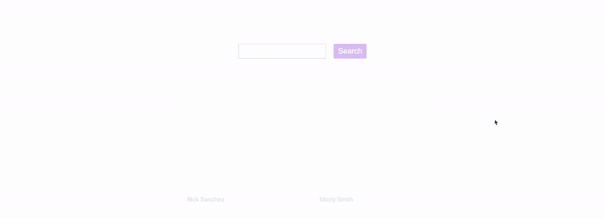

Animation demo using Framer Motion

我们将从页面加载时发生的一些基本动画开始，学习如何在悬停时触发它们，并构建一个允许我们在 Next.js 中优雅地转换页面的包装器。

## 开始之前

这是构建 Rick 和 Morty wiki 系列文章的第二部分。[第一部分](https://www.freecodecamp.org/news/how-to-create-a-dynamic-rick-and-morty-wiki-web-app-with-next-js/)主要是从 Rick 和 Morty API 请求数据并创建动态页面。

[如何使用 Next.js 创建动态 Rick 和 Morty Wiki Web 应用程序](https://www.freecodecamp.org/news/how-to-create-a-dynamic-rick-and-morty-wiki-web-app-with-next-js/)

虽然你可以不走第一步就跟着走，但有一个起点可能会有所帮助。否则，您应该能够使用任何 React 应用程序来跟踪大部分内容。

## 步骤 0:在 Next.js 应用程序中安装 Framer Motion

因为我们要使用 Framer Motion 来提供我们的动画特性，所以我们要做的第一件事就是安装它！

在本地运行应用程序后，您可以通过以下方式安装它:

```
yarn add framer-motion
# or
npm install framer-motion 
```

此时，您可以开始备份您的开发服务器，我们将准备就绪！

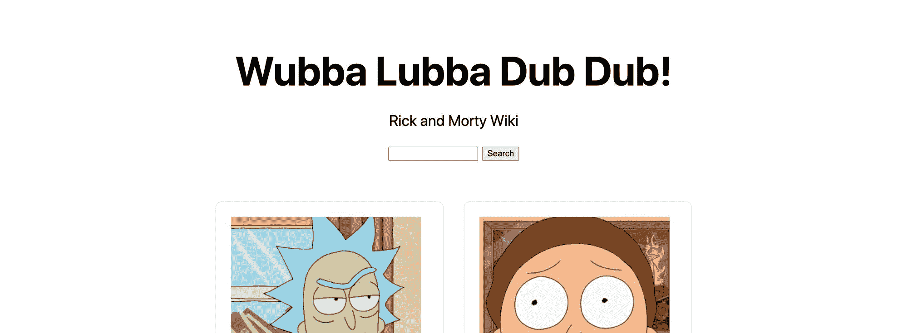

Starting point - Rick and Morty wiki app in Next.js

[跟随提交！](https://github.com/colbyfayock/my-rick-and-morty-wiki/commit/d768a2cd70fa990b31f9becdd82f034a676b6a9f)

## 步骤 1:在 Next.js 应用程序中用框架动作制作页面标题动画

首先，我们将在 wiki 应用程序中制作页面标题动画。特别是，我们将配置帧运动，使标题在页面第一次加载时淡入和增长。

首先，我们需要将动作导入到我们的应用程序中。

首先，将以下导入语句添加到`pages/index.js`的顶部:

```
import { motion } from 'framer-motion'; 
```

现在我们已经准备好使用`motion`，我们可以开始用运动组件包装`<h1>`标题:

```
<motion.div>
  <h1 className="title">
    Wubba Lubba Dub Dub!
  </h1>
</motion.div> 
```

包装我们的元素将允许我们挂钩到 [Motion API](https://www.framer.com/api/motion/) 。

如果我们重新加载我们的页面，它还不会做任何事情。这是因为我们还没有配置我们的动画，所以让我们这样做！

当将 Motion API 与我们的`<motion.x>`组件一起使用时，我们需要使用两个基本概念:

*   动画生命周期
*   变体

每个动画生命周期道具，比如`initial`和`animate`，都允许我们将动画的名字定义为一个变体。

我们的`variants`道具是通过定义变量名称以及我们希望它们执行的动画来配置这些动画。

首先，让我们通过添加两个生命周期道具来为我们的标题组件添加两个生命周期定义:

```
<motion.div initial="hidden" animate="visible">
  <h1 className="title">
    Wubba Lubba Dub Dub!
  </h1>
</motion.div> 
```

现在，我们想要定义这些:

```
<motion.div initial="hidden" animate="visible" variants={{
  hidden: {},
  visible: {},
}}>
  <h1 className="title">
    Wubba Lubba Dub Dub!
  </h1>
</motion.div> 
```

我们定义了两种变体——隐藏的和可见的——然后在`initial`和`animate`生命周期道具中引用它们。

现在，再次重新加载页面，它仍然不会做任何事情，因为我们仍然没有定义动画本身，所以让我们这样做:

```
<motion.div initial="hidden" animate="visible" variants={{
  hidden: {
    scale: .8,
    opacity: 0
  },
  visible: {
    scale: 1,
    opacity: 1,
    transition: {
      delay: .4
    }
  },
}}>
  <h1 className="title">
    Wubba Lubba Dub Dub!
  </h1>
</motion.div> 
```

事情是这样的:

*   我们有两个不同的生命周期，一个初始周期和一个动画周期。初始是页面加载时“最初”加载的内容，而动画是页面加载后发生的内容
*   在我们的初始状态，我们设置元素稍微缩小，不透明度为 0
*   当页面加载并触发我们的动画时，我们将比例设置回 1，不透明度设置回 1
*   我们也为我们的过渡设置了一个延迟，这样它在启动动画之前会延迟 0.4 秒。这只是为了让东西在触发前加载一点点

所以在上面，实际发生的是在页面加载后 0.4 秒，我们将淡入标题，让它看起来像是在轻微增长。

如果我们保存并重新加载页面，我们可以看到我们的标题的效果！

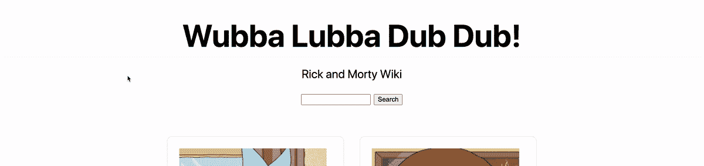

Animated title in Next.js app with Framer Motion

[跟随提交](https://github.com/colbyfayock/my-rick-and-morty-wiki/commit/80eb7c3fb694577002feac063a613c421826e03c)

## 步骤 2:向 Next.js 应用程序中的元素添加带有帧运动的动画悬停效果

现在我们对如何在页面加载时添加动画有了基本的了解，让我们开始添加一些交互。

我们将为每个角色卡添加一些悬停效果。这样，当您的光标移动到其中一张卡片上时，我们将触发动画。

首先，在我们的无序列表网格`<ul className=“grid”>`中，让我们将列表元素`<li>`更新为`<motion.li>`元素:

```
<motion.li key={id} className="card">
  ...
</motion.li> 
```

如果您保存并重新加载页面，您会注意到我们实际上有一个问题。


App with missing styles for character cards

由于 motion 和 Next.js CSS 集成之间的集成，我们的应用程序在类名上出错了。

虽然这不是在它的“核心”修复它，我们可以通过从我们的顶部`<style>`块中移除`jsx`道具来修复它，在那里我们有我们的`.card`定义。

改变:

```
<style jsx>{` 
```

收件人:

```
<style>{` 
```

现在，如果我们重新加载页面，我们又回到了开始的地方。


App with correct styles

为了添加悬停效果，我们将在名为`whileHover`的`<motion.li>`组件上创建一个新道具，并填充一些基本样式:

```
<motion.li key={id} className="card" whileHover={{
  scale: 1.2,
  transition: {
    duration: .2
  }
}}> 
```

上面，我们告诉 motion，当有人悬停在我们的元素上时，我们希望它通过缩放到 1.2 来增长，我们希望动画持续 0.2s。

如果我们重新加载页面，我们可以看到我们的动画！

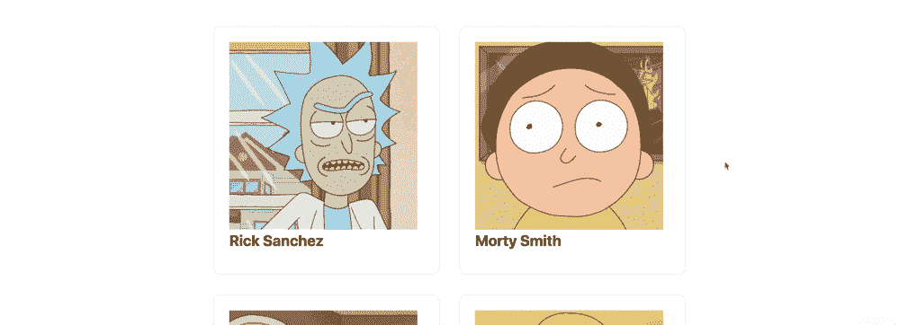

Hover effect in Next.js app using Framer Motion

如果你看看效果的底部，当卡片变大时，它会和下面的卡片重叠，看起来有点破损。我们可以通过应用一些 z 索引和背景色来解决这个问题！

```
<motion.li key={id} className="card" whileHover={{
  position: 'relative',
  zIndex: 1,
  background: 'white',
  scale: 1.2,
  transition: {
    duration: .2
  }
}}> 
```

如果我们再次重新加载页面，我们现在可以看到，随着我们的卡增长，它出现在下面的卡的顶部！

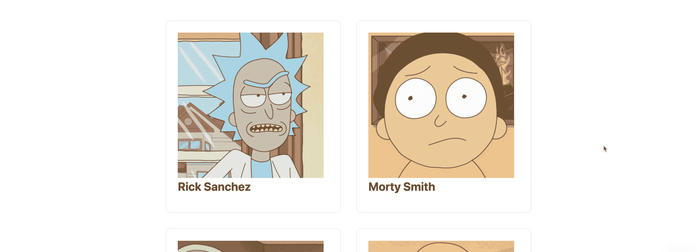

Fixing z-indexing and background on hover effect

[跟随提交！](https://github.com/colbyfayock/my-rick-and-morty-wiki/commit/b5c79c245edd586ee0d5fa6392bc52ae43378e13)

## 步骤 3:将带有帧运动的页面过渡添加到 Next.js 应用程序中

当页面加载时触发一些动画和悬停效果很酷，但当你的应用程序可以提供页面之间的优雅过渡时，这是一个很好的接触。这可能是让它感觉更像一个“网络应用”而不是一个静态“网站”的部分原因。

要做到这一点，我们需要[配置我们的 Next.js 应用程序](https://nextjs.org/docs/advanced-features/custom-app),用包装器包裹网站的根页面。这将允许我们挂钩到导航生命周期，并适当地动画我们的页面。

首先，我们需要在`pages`目录下创建一个名为`_app.js`的新文件:

```
// In pages/_app.js
function App({ Component, pageProps }) {
  return (
    <Component {...pageProps} />
  )
}

export default App; 
```

虽然我们不一定要理解正在发生的事情的细节，但我们基本上是在创建一个包装器，我们可以在其中添加额外的功能。

使用这个新文件，如果您重新加载页面，您应该还看不到任何更改。

接下来，我们将添加允许我们设置页面过渡的基础。

首先，让我们在页面顶部导入动作:

```
import { motion } from 'framer-motion'; 
```

然后，类似于我们的其他动画，让我们创建一个新的`<motion.div>`组件来包装我们的页面。

```
<motion.div initial="pageInitial" animate="pageAnimate" variants={{
  pageInitial: {
    opacity: 0
  },
  pageAnimate: {
    opacity: 1
  },
}}>
  <Component {...pageProps} />
</motion.div> 
```

这里，我们将初始状态的不透明度设置为 0，将动画状态的不透明度设置为 1，这样它就会淡入。

现在如果你点击刷新，你会注意到页面淡入。但是如果你点击其中一个角色，当角色页面加载时，它不会淡入。

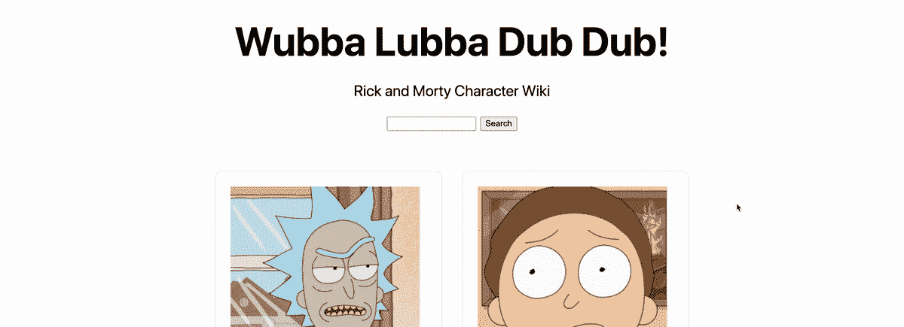

Changing page with no transition effect

目前的问题是，运动组件不知道这是一条新路线，所以我们需要强制它识别并更新。

为此，我们将在我们的应用程序 props 中析构`router`参数:

```
function App({ Component, pageProps, router }) { 
```

在我们的运动组件上，我们将把它作为一个键:

```
<motion.div key={router.route} initial="pageInitial" animate="pageAnimate" variants={{ 
```

现在，如果我们重新加载页面，在我们的角色页面和主页之间导航，你会看到它正在内容中消失！

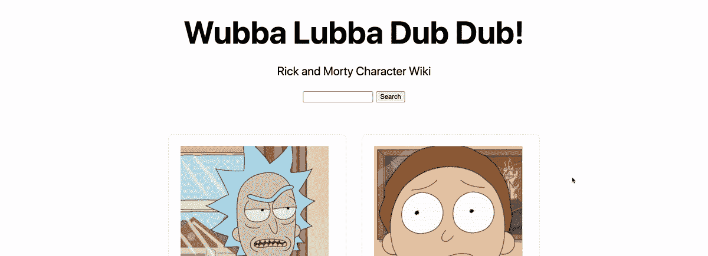

Next.js fading page transition with Framer Motion

[跟随提交！](https://github.com/colbyfayock/my-rick-and-morty-wiki/commit/c558283e0ade4dcc300c9b35e71b87217dd0bd78)

## 步骤 4:使用高级动画的帧运动关键帧

现在我们已经掌握了在应用生命周期中设置动画的基本知识，我们可以通过使用[关键帧](https://www.framer.com/api/motion/examples/#keyframes)来获得更高级的知识。

关键帧的工作方式是，当我们定义一个动画时，我们可以设置该动画在给定属性的一组不同值之间移动，从而允许我们根据自己的喜好构建自定义动画。

例如，假设我们想在一个动画序列中将悬停上的一个元素放大 2 倍，再缩小 1.5 倍，然后再放大 2 倍。我们可以通过关键帧做到这一点！

其语法如下所示:

```
scale: [1, 2, 1.5, 2] 
```

我们使用一个数组来指定我们的序列，该数组表示我们希望我们的元素以 1x 的正常大小开始，然后下一帧它将增长到 2x，然后稍微收缩到 1.5x，最后增长回 2x。

为了测试这一点，我们将对我们已经为角色卡配置的悬停效果做一些改变。

在`pages/index.js`中，将运动列表元素上的`whileHover`属性更新为:

```
<motion.li key={id} className="card" whileHover={{
  position: 'relative',
  zIndex: 1,
  background: 'white',
  scale: [1, 1.4, 1.2],
  rotate: [0, 10, -10, 0],
  transition: {
    duration: .2
  }
}}> 
```

我们指定了两组关键帧，如下所示:

*   它的初始大小为 1x，旋转角度为 0(或不旋转)
*   然后，它缩放到 1.4 倍大小，并旋转 10 度
*   然后，它缩小到 1.2 倍的大小，并以另一种方式旋转-10 度
*   此时，缩放关键帧已完成，因此我们不会再缩放任何东西，但我们有 1 个最后旋转，其中我们旋转回到我们的初始位置 0(或无旋转)

如果我们重新加载页面并将鼠标悬停在元素上，我们可以看到实际效果！

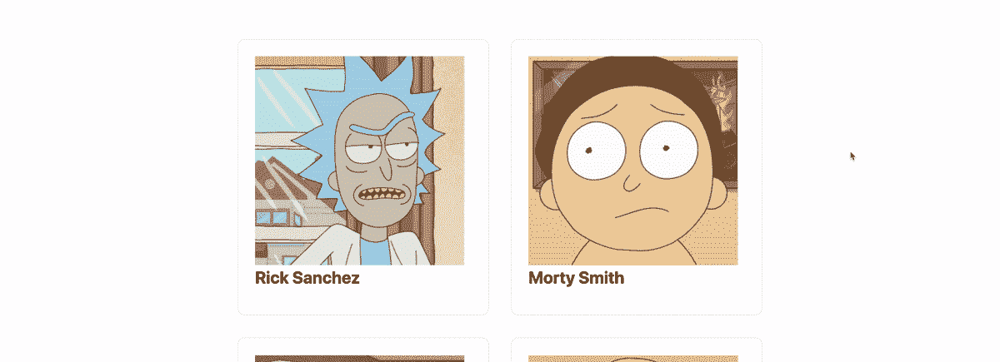

Framer Motion hover effect with rotation and scaling

没有关键帧，我们只能做从单个初始状态到另一个单个值的动画效果。但是通过我们的关键帧，我们可以添加更多的动态动画在不同的值之间移动。

[跟随提交！](https://github.com/colbyfayock/my-rick-and-morty-wiki/commit/99c75a3674623f896e12d29fff1431ac609bd60a)

## 额外的一步:在我们的 Next.js Rick 和 Morty 应用程序中使用一些奇怪的动画

为了增加另一层乐趣，我们可以使用其他属性使我们的动画更加动态。

首先，我们将把悬停效果提升一个档次。

在我们的`<motion.li>`卡元素的`whileHover`道具内的`pages/index.js`文件上，让我们添加以下属性:

```
filter: [
  'hue-rotate(0)',
  'hue-rotate(360deg)',
  'hue-rotate(45deg)',
  'hue-rotate(0)'
], 
```

这里，我们正在设置一组新的关键帧，它将基于 [hue-rotate CSS 函数](https://developer.mozilla.org/en-US/docs/Web/CSS/filter-function/hue-rotate)来“旋转”图像的色调。

如果我们保存并重新加载我们的页面，这给了我们一个漂亮的小颜色效果。

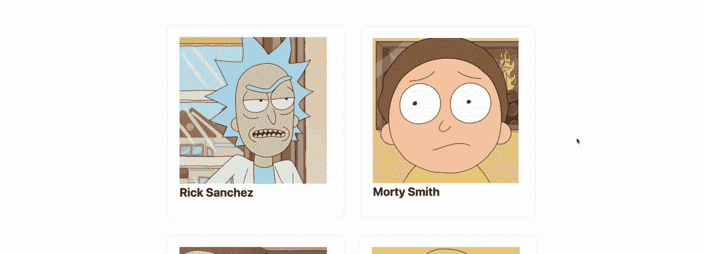

Changing color of image on hover with Framer Motion and CSS filters

但这对我来说太微妙了——我想让它更怪异一点。

让我们将过滤器属性更新为以下内容:

```
filter: [
  'hue-rotate(0) contrast(100%)',
  'hue-rotate(360deg) contrast(200%)',
  'hue-rotate(45deg) contrast(300%)',
  'hue-rotate(0) contrast(100%)'
], 
```

现在，不仅颜色发生了变化，我们还使用了 [contract CSS 函数](https://developer.mozilla.org/en-US/docs/Web/CSS/filter-function/contrast)来使颜色更加极端，给我们一个更加奇怪的效果。

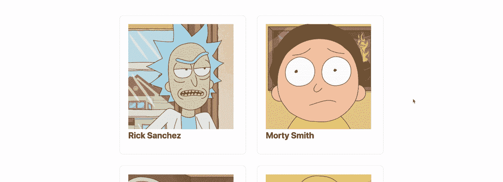

Changing contrast and colors using CSS filters on hover with Framer Motion 

接下来，我们可以做一些类似于页面转换的事情！

为此，我们将使用运动组件生命周期的一个新部分——退出。要做到这一点，我们需要利用 Motion 的 [AnimatePresence](https://www.framer.com/api/motion/animate-presence/) 组件，它允许我们在组件从 React 树中移除时制作动画。

首先，让我们打开`pages/_app.js`,在顶部导入组件:

```
import { motion, AnimatePresence } from 'framer-motion'; 
```

接下来，我们想用新的`AnimatePresence`组件包装我们的`<motion.div>`组件:

```
<AnimatePresence>
      <motion.div key={router.route} initial="pageInitial" animate="pageAnimate" variants={{ 
```

包装好组件后，我们现在可以设置新的生命周期属性`exit`及其变体:

```
<motion.div key={router.route} initial="pageInitial" animate="pageAnimate" exit="pageExit" variants={{
  pageInitial: {
    opacity: 0
  },
  pageAnimate: {
    opacity: 1
  },
  pageExit: {
    backgroundColor: 'white',
    filter: `invert()`,
    opacity: 0
  }
}}> 
```

在上面，我们是:

*   配置`pageExit`变量
*   我们将`exit`生命周期道具设定为`pageExit`
*   在我们的`pageExit`变体中，我们将背景颜色设置为白色，并添加一个滤镜来反转颜色

注意:将背景颜色设置为白色很重要，否则，反色滤镜将不会应用于背景。

如果我们保存并重新加载页面，当我们导航到另一个元素，我们得到我们的效果！

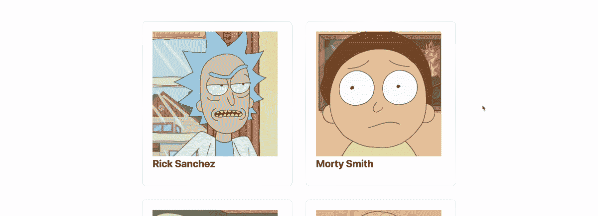

Inverting colors on page transition with Framer Motion

[跟随提交！](https://github.com/colbyfayock/my-rick-and-morty-wiki/commit/3c1455370f750ff86b75a3b3edc446ebe553bf5b)

## 我们还能做什么？

### 添加一些动画来错开搜索结果

如果您查看了我编写本教程所基于的原始演示，我添加了一个特性，通过略微上移使结果浮动。

我们可以通过在列表元素上设置 [staggerChildren](https://www.framer.com/api/motion/types/#orchestration.staggerchildren) 转换属性和 [x 和 y 位置属性](https://www.framer.com/api/motion/component/#transform)来做到这一点。

[https://github . com/colbyfayock/Rick-and-morty-wiki/blob/master/pages/index . js # L11](https://github.com/colbyfayock/rick-and-morty-wiki/blob/master/pages/index.js#L11)

### 动画按钮

目前按钮只是静态的。给按钮添加一些悬停和点击效果，比如底部的“加载更多”。

### 添加更多怪异的效果

毕竟这是里克和莫蒂，尽可能弄得诡异些！但仍然要确保它是可用的。

[](https://twitter.com/colbyfayock)

*   [？在 Twitter 上关注我](https://twitter.com/colbyfayock)
*   [？️订阅我的 Youtube](https://youtube.com/colbyfayock)
*   [✉️注册我的简讯](https://www.colbyfayock.com/newsletter/)