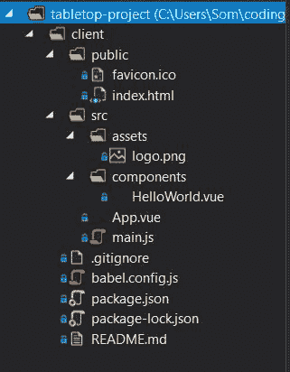
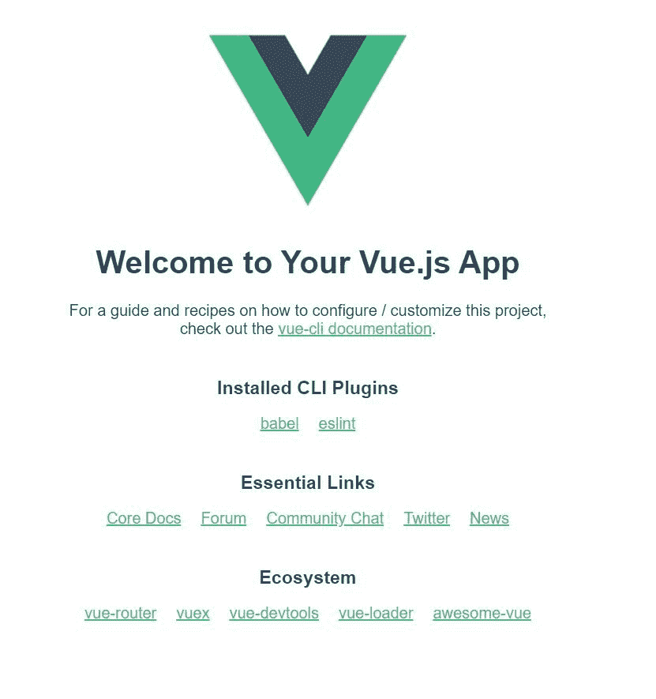
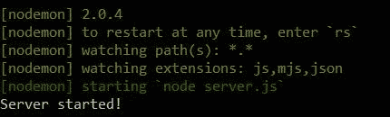
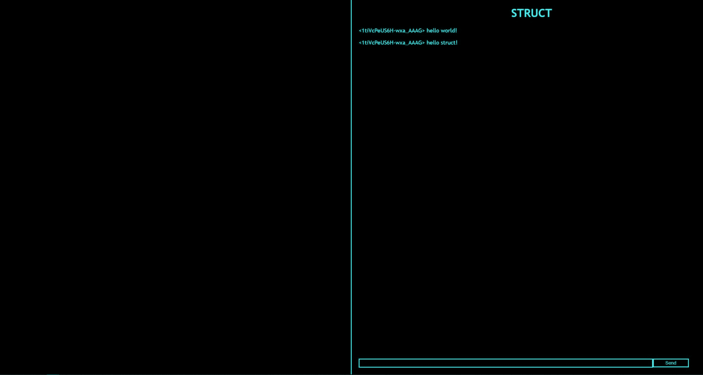
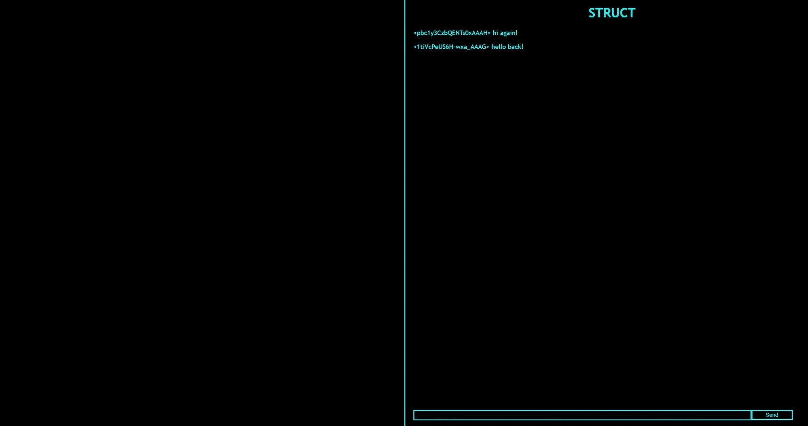
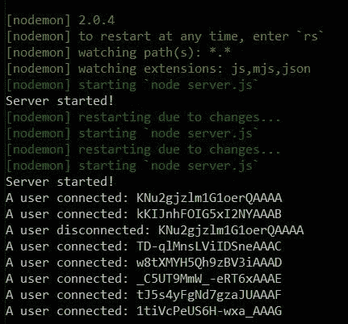
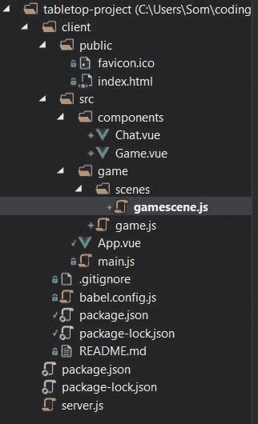
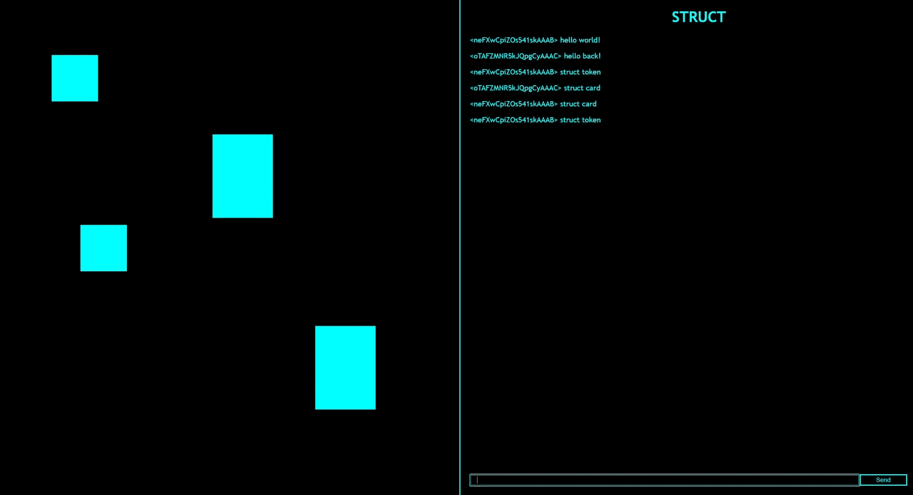

# 如何用 Vue、Phaser、Node、Express 和 Socket 构建一个多人桌面游戏模拟器？超正析象管(Image Orthicon)

> 原文：<https://www.freecodecamp.org/news/how-to-build-a-multiplayer-tabletop-game-simulator/>

将一个完整的 JavaScript 应用程序的所有部分放在一起可能是一项复杂的工作。

在本教程中，我们将使用 [Vue](https://vuejs.org/) 、 [Phaser](http://phaser.io/) 、 [Node](https://nodejs.org/) / [Express](https://expressjs.com/) 和 [Socket 构建一个多人桌面游戏模拟器。IO](https://socket.io/) 了解在任何全栈应用中都有用的几个概念。

您也可以跟随视频教程(观看 1 小时 16 分钟):

[https://www.youtube.com/embed/laNi0fdF_DU?feature=oembed](https://www.youtube.com/embed/laNi0fdF_DU?feature=oembed)

本教程的所有项目文件都可以在 [GitHub](https://github.com/sominator/tabletop-project) 上获得。

## 项目概述

我们的项目将以 Phaser 游戏实例为特色，允许我们在屏幕上创建令牌和卡片，并在数字游戏板上移动它们。

Phaser 实例将被封装在一个 Vue 组件中，该组件将处理多人聊天和命令之类的事情。Phaser 和 Vue 将共同构成我们的前端(从这里开始称为“客户端”)，我们将使用 Socket。IO 来与其他玩家交流，并将我们应用程序的前端和后端连接在一起。

后端(从这里开始称为“服务器”)将是一个接收套接字的简单 Express 服务器。来自客户端的 IO 事件，并相应地采取行动。整个应用程序将在节点上作为其运行时运行。

要完成这个项目，你不需要成为上述任何一个框架的专家，但在尝试解决具体问题之前，拥有基础 JavaScript 和 HTML/CSS 的坚实基础是一个好主意。你也可以跟随我的系列文章[通过制作数字桌面游戏和网络应用来学习 JavaScript](https://www.freecodecamp.org/news/learn-javascript-by-making-digital-tabletop-games-and-web-apps/)。

您还需要确保安装了 Node 和 [Git](https://github.com/) ，以及您最喜欢的代码编辑器和命令行界面(如果您需要帮助，可以在这里按照我的教程设置 IDE [)。](https://www.freecodecamp.org/news/how-to-set-up-an-integrated-development-environment-ide/)

我们开始吧！

## 第 1 部分:客户端基础知识

我们将通过安装 [Vue CLI](https://cli.vuejs.org/) 开始构建我们的客户端，这将帮助我们使用一些工具，并允许我们对我们的文件进行更改，而不必重新加载我们的 web 浏览器。

在命令行中，键入以下内容以全局安装 Vue CLI:

```
npm install -g @vue/cli
```

导航到所需的目录，并为我们的项目创建一个新文件夹:

```
mkdir tabletop-project
cd tabletop-project
```

现在，我们可以使用 Vue CLI 为我们创建一个前端项目模板:

```
vue create client
```

除非您有特定的偏好，否则您可以在随后的提示下点击“enter”。

Vue CLI 为我们提供了一个非常有用的前端项目模板，我们可以在代码编辑器中查看它:



让我们在 CLI 中导航到新的客户端文件夹，然后运行模板应用程序:

```
cd client
npm run serve
```

做了一点工作后，Vue CLI 应该开始在默认的 http://localhost:8080:



酷！我们有客户的基本结构。让我们通过在/components 文件夹中创建两个新组件来打破它，分别名为 Game.vue 和 Chat.vue(如果你像我一样痴迷于整洁，可以删除 HelloWorld.vue 和 assets 文件夹中的任何内容)。

用以下代码替换 App.vue 中的代码:

```
<template>
    <div id="app">
        <div id="game">
            <Game />
        </div>
        <div id="border" />
        <div id="input">
            <Chat />
        </div>
    </div>
</template>

<script>
    import Chat from './components/Chat.vue';
    import Game from './components/Game.vue';

    export default {
        name: 'App',
        components: {
            Chat,
            Game
        }
    }
</script>

<style>
    #app {
        font-family: 'Trebuchet MS';
        text-align: left;
        background-color: black;
        color: cyan;
        display: flex;
    }
    #game {
        width: 50vw;
        height: 100vh;
    }
    #input {
        width: 50vw;
        height: 100vh;
    }
    #border {
        border-right: 2px solid cyan;
    }
    @media (max-width: 1000px) {
        #app {
            flex-direction: column;
        }
        #game {
            width: 100vw;
            height: 50vh;
        }
        #input {
            width: 100vw;
            height: 50vh;
        }
    }
</style> 
```

如您所见，Vue 组件通常有三个部分:模板、脚本和样式，分别包含该组件的 HTML、JavaScript 和 CSS。我们刚刚在这里导入了我们的游戏和聊天组件，并添加了一点样式，让它在运行时有一种赛博朋克的感觉。

这实际上是我们设置 App.vue 组件所需要做的全部工作，该组件将包含客户端中的所有其他内容。在我们真正用它做任何事情之前，我们需要让我们的服务器工作起来！

## 第 2 部分:服务器基础

在我们的根目录(desktop-project，above /client)，通过键入以下命令在新的命令行界面中初始化一个新项目:

```
npm init
```

与我们的客户一样，您可以继续操作，并在出现提示时按“enter”键，除非此时您想要指定特定的内容。

我们需要安装 Express 和 Socket。IO 和 [Nodemon](https://nodemon.io/) 一起为我们监视我们的服务器文件，并在必要时重新启动:

```
npm install --save express socket.io nodemon
```

让我们在根目录中打开新的 package.json 文件，并在“scripts”部分添加一个“start”命令:

```
 "scripts": {
    "start": "nodemon server.js"
  },
```

在此目录中创建一个名为 server.js 的新文件，并输入以下代码:

```
const server = require('express')();
const http = require('http').createServer(server);
const io = require('socket.io')(http);

io.on('connection', function (socket) {
    console.log('A user connected: ' + socket.id);

    socket.on('send', function (text) {
        let newText = "<" + socket.id + "> " + text;
        io.emit('receive', newText);
    });

    socket.on('disconnect', function () {
        console.log('A user disconnected: ' + socket.id);
    });
});

http.listen(3000, function () {
    console.log('Server started!');
});
```

太棒了。我们的简单服务器现在将监听 http://localhost:3000，并使用套接字。当用户连接和断开连接时，IO 使用他们的套接字 ID 记录到控制台。

当服务器从客户机接收到一个“发送”事件时，它将创建一个新的文本字符串，该字符串包括发出该事件的客户机的套接字 ID，并向所有客户机发出它自己的“接收”事件，该事件带有它接收到的插入了套接字 ID 的文本。

我们可以通过返回命令行并启动它来测试服务器:

```
npm run start
```

命令控制台现在应该显示:



酷！让我们回到客户端的聊天组件，开始构建我们的前端功能。

## 第 3 部分:聊天

让我们打开一个单独的命令行界面，并导航到/client 目录。在该目录中，安装 Socket 的客户端版本。IO:

```
npm install --save socket.io-client
```

在/client/src/components/chat . vue 中，添加以下代码:

```
<template>
    <div id="container">
        <div id="output">
            <h1>STRUCT</h1>
            <p v-for="(text, index) in textOutput" :key="index">{{text}}</p>
        </div>
        <div id="input">
            <form>
                <input type="text" v-model="textInput" :placeholder="textInput" />
                <input type="submit" value="Send" v-on:click="submitText" />
            </form>
        </div>
    </div>
</template>

<script>
    import io from 'socket.io-client';
    let socket = io('http://localhost:3000');

    export default {
        name: 'Chat',
        data: function () {
            return {
                textInput: null,
                textOutput: []
            }
        },
        methods: {
            submitText: function (event) {
                event.preventDefault();
                socket.emit('send', this.textInput);
            }
        },
        created: function () {
            socket.on('connect', () => {
                console.log('Connected!');
            });
            socket.on('receive', (text) => {
                this.textOutput.push(text);
                this.textInput = null;
            });
        }
    }
</script>

<style scoped>
    #container {
        text-align: left;
        display: flex;
        flex-direction: column;
        margin-left: 1vw;
        min-height: 100vh;
    }
    h1 {
        text-align: center;
    }
    .hotpink {
        color: hotpink;
    }
    #input {
        position: fixed;
        margin-top: 95vh;
    }
    input[type=text] {
        height: 20px;
        width:  40vw;
        border: 2px solid cyan;
        background-color: black;
        color: hotpink;
        padding-left: 1em;
    }
    input[type=submit]{
        height: 25px;
        width: 5vw;
        background-color: black;
        color: cyan;
        border: 2px solid cyan;
        margin-right: 2vw;
    }
    input[type=submit]:focus{
        outline: none;
    }
    input[type=submit]:hover{
        color: hotpink;
    }
    @media (max-width: 1000px) {
        #container {
            border-left: none;
            border-top: 2px solid cyan;
            min-height: 50vh;
        }
        #input {
            margin-top: 43vh;
        }
        #output {
            margin-right: 10vw;
        }
        input[type=text] {
            width: 60vw;
        }
        input[type=submit] {
            min-width: 10vw;
        }
    }
</style> 
```

在继续之前，让我们自下而上地检查以上内容。在

在

然后我们给这个组件起了一个名字(“Chat”)，并利用 Vue 用来为我们处理交互性的数据、方法和创建的对象。

在数据对象中，我们存储两个变量:textInput 和 textOutput，前者以 null 开始，后者是一个空数组。

在 methods 对象中，我们创建了一个简单的函数 submitText，它通过 Socket 发出一个“send”事件。IO 以及 textInput，并阻止此类事件的默认行为(例如通过 HTML 表单发送数据)。

在创建的对象中，它在组件初始化时被触发，我们有两个对套接字的引用。第一个指示当它从服务器接收到“连接”事件时，套接字应该向控制台记录它已经“连接！”第二个指示当套接字接收到“接收”事件时，它应该将该事件中的文本推送到 textOutput 数组，并清除 textInput 变量。

在我们的<template></template>

输入部分有一个简单的表单，带有 Vue [表单输入绑定](https://vuejs.org/v2/guide/forms.html)和一个[事件处理程序](https://vuejs.org/v2/guide/events.html)来接收文本输入，将其存储在我们的 text input 变量中，并触发“发送”套接字。单击“发送”按钮时的 IO 事件。

唷！我们的聊天现在正常了。保存所有内容并导航到运行客户端的浏览器选项卡，网址为 http://localhost:8080:



请注意，您可以打开*另一个*浏览器选项卡，该选项卡将使用新的 socket ID 连接到服务器，聊天应该开始在两个客户端之间进行:



同时，您的命令行控制台还应该指示客户端何时连接到服务器和从服务器断开连接(当然，使用不同的套接字 id):



太棒了。让我们开始在 Phaser 中构建桌面模拟器吧！

## 第 4 部分:桌面模拟器

我们将需要一个 Vue 组件来容纳我们的 Phaser 实例，为此，我们将借用[sun 0 fab beach](https://github.com/Sun0fABeach)的 [Vue - Phaser 3 Webpack 样板](https://github.com/Sun0fABeach/vue-phaser3)(如果您愿意，您甚至可以使用这个样板来创建您的客户端)。

在我们的/client/src/components/game . vue 文件中，添加以下代码:

```
<template>
    <div :id="containerId" v-if="downloaded" />
    <div class="placeholder" v-else>
        Downloading...
    </div>
</template>

<script>
    export default {
        name: 'Game',
        data: function () {
            return {
                downloaded: false,
                gameInstance: null,
                containerId: 'game-container'
            }
        },
        async mounted() {
            const game = await import(../game/game');
            this.downloaded = true;
            this.$nextTick(() => {
                this.gameInstance = game.launch(this.containerId)
            })
        },
        destroyed() {
            this.gameInstance.destroy(false);
        }
    }
</script>

<style scoped>

</style> 
```

该组件将在游戏实例准备好的时候呈现它，并在此之前保留一个占位符(通常只有几秒钟)。它还不能工作，因为我们还没有创建一个游戏实例来工作。

在/client 目录下的命令行界面中，键入以下内容

```
npm install --save phaser
```

Phaser 将处理我们所有游戏对象的渲染，如代币和卡片，同时还使它们与拖放功能交互。

在/client/src 文件夹中，添加一个名为“game”的新文件夹，以及该文件夹中一个名为“scenes”的子文件夹。

在/client/src/game 文件夹中，添加一个名为 game.js 的文件，在/client/src/game/scenes 中，添加一个名为 gamescene.js 的文件。



我们的 game.js 文件将处理 Phaser 实例的初始设置，导入 gamescene.js 并将我们的游戏启动到 Vue 组件的 containerId 中(它还将实例缩放到容器的大小)。它应该是这样的:

```
import Phaser from "phaser";
import GameScene from "./scenes/gamescene";

function launch(containerId) {
    return new Phaser.Game({
        type: Phaser.AUTO,
        parent: containerId,
        scene: [
            GameScene
        ],
        scale: {
            mode: Phaser.Scale.FIT,
            width: '100%',
            height: '100%'
        }
    });
}

export default launch;
export { launch }
```

我们模拟器的主要功能将在 gamescene.js 文件中，我们将在其中编写:

```
import Phaser from 'phaser';
import io from 'socket.io-client';

export default class GameScene extends Phaser.Scene {
    constructor() {
        super({
            key: 'GameScene'
        });
    }

    preload() {

    }

    create() {
        this.socket = io('http://localhost:3000');

        this.socket.on('struct create', (width, height) => {
            let token = this.add.rectangle(300, 300, width, height, 0x00ffff).setInteractive();
            this.input.setDraggable(token);
        });

        this.input.on('drag', (pointer, gameObject, dragX, dragY) => {
            gameObject.x = dragX;
            gameObject.y = dragY;
        });
    }

    update() {

    }
}
```

我们的 Phaser 架构利用 JavaScript [类](https://developer.mozilla.org/en-US/docs/Web/JavaScript/Reference/Classes)来创建[场景](https://photonstorm.github.io/phaser3-docs/Phaser.Scene.html)，并且有三个主要功能:预加载、创建和更新。

预加载功能用于准备在场景中使用的资源，如精灵。

更新函数每帧调用一次，我们在项目中没有使用它。

当一个场景被创建时，create 函数被调用，我们所有的工作都在这里完成。我们初始化一个套接字变量并存储该套接字。IO 连接 http://localhost:3000，然后引用我们期望从服务器接收的“struct create”事件。

当客户端接收到“struct create”事件时，我们的 Phaser 实例应该在(300，300)的(x，y)坐标处创建一个矩形，使用由该事件指定的宽度和高度参数，以及我们选择的有趣的 cyberpunk 颜色。Phaser 随后会将矩形设置为交互式的，并提醒输入系统它也应该是可拖动的。

我们还写了一点逻辑，告诉 Phaser 在拖动矩形时应该做什么；也就是说，它应该跟随鼠标指针的方向。

我们现在要做的就是跳回我们的 server.js 并为我们的“struct create”事件添加逻辑:

```
const server = require('express')();
const http = require('http').createServer(server);
const io = require('socket.io')(http);

io.on('connection', function (socket) {
    console.log('A user connected: ' + socket.id);

    socket.on('send', function (text) {
        let newText = "<" + socket.id + "> " + text;
        if (text === 'struct card') {
            io.emit('struct create', 130, 180)
        };
        if (text === 'struct token') {
            io.emit('struct create', 100, 100)
        };
        io.emit('receive', newText);
    });

    socket.on('disconnect', function () {
        console.log('A user disconnected: ' + socket.id);
    });
});

http.listen(3000, function () {
    console.log('Server started!');
});
```

当我们的服务器从客户端接收到一个“发送”事件时，它现在充当一个简单的解析器。如果客户端发送文本“struct card ”,服务器将发出我们的“struct create”事件，参数为 130 x 180 像素，表示卡片的宽度和高度。

如果客户端发送文本“struct token ”,服务器将发出我们的“struct create”事件，参数为 100 x 100 像素，表示标记的宽度和高度。

试试看！保存所有内容，确保服务器正在运行，并在指向 http://localhost:8080 的 web 浏览器中打开几个选项卡。当您在一个选项卡中聊天时，它应该出现在另一个选项卡中，带有您客户的 socket ID，反之亦然。

如果您的聊天是命令“结构卡”或“结构令牌”，可拖动的卡或令牌应该分别出现在两个客户端中。



整洁！

## 包裹

按照本教程，你现在应该有一个工作的多人桌面游戏模拟器，具有聊天，卡和令牌创建，拖放功能。

你可以继续开发这个简单的全栈应用程序，增强风格，在聊天中添加滚动条，或者允许玩家选择用户名并使用 [Socket 登录特定的聊天实例。IO 房间](https://socket.io/docs/rooms/)。

您可以通过一次处理多张卡片和代币来改进棋盘游戏功能，或者熟悉 [Phaser 示例](http://phaser.io/examples)来添加您自己的功能。你也可以跟随我的教程[学习如何用 Phaser 3、Express 和 Socket 构建多人纸牌游戏。IO](https://www.freecodecamp.org/news/how-to-build-a-multiplayer-card-game-with-phaser-3-express-and-socket-io/) 获取灵感。

当然，你没有理由需要使用聊天命令来创建游戏对象。如果愿意，您可以在 Phaser 实例中完成所有这些工作，但是您需要创建自己的按钮或其他一些输入交互功能(根据我的经验，Vue 在处理文本方面要好得多，因此我们有聊天命令)。

然而，当前的功能在您希望能够通过运行聊天命令在屏幕上显示骰子的情况下可能是有用的。

此外，如果你想部署你的新应用，你可以先阅读我关于部署你的第一个全栈应用前需要考虑的三件事的文章，然后跟随我的教程到[学习如何用 Heroku](https://www.freecodecamp.org/news/how-to-deploy-a-full-stack-web-app-with-heroku/) 部署全栈 Web 应用。

编码快乐！

如果你喜欢这篇文章，请考虑[查看我的游戏和书籍](https://www.nightpathpub.com/)，[订阅我的 YouTube 频道](https://www.youtube.com/msfarzan?sub_confirmation=1)，或者[加入 *Entromancy* Discord](https://discord.gg/RF6k3nB) 。

米（meter 的缩写））S. Farzan 博士曾为知名视频游戏公司和编辑网站(如 Electronic Arts、Perfect World Entertainment、Modus Games 和 MMORPG.com)撰稿和工作，并担任过*地下城&龙无冬*和*质量效应:仙女座*等游戏的社区经理。他是 *[Entromancy:一款赛博朋克奇幻 RPG](https://www.nightpathpub.com/rpg)* 的创意总监兼首席游戏设计师，也是 *[夜路三部曲](http://nightpathpub.com/books)* 的作者。在 Twitter 上找到 m . s . Farzan[@ sominator](https://twitter.com/sominator)。