# Python 中递归神经网络的最终指南

> 原文：<https://www.freecodecamp.org/news/the-ultimate-guide-to-recurrent-neural-networks-in-python/>

递归神经网络是深度学习模型，通常用于解决时间序列问题。它们被用于自动驾驶汽车、高频交易算法和其他现实世界的应用。

本教程将教你递归神经网络的基础知识。您还将构建自己的递归神经网络来预测脸书明天的股票价格。

# **递归神经网络的直觉**

[递归神经网络](https://nickmccullum.com/python-deep-learning/recurrent-neural-network-tutorial/)是[神经网络](https://www.freecodecamp.org/news/deep-learning-neural-networks-explained-in-plain-english/)更广阔领域的一个例子。其他例子包括:

*   [人工神经网络](https://nickmccullum.com/python-deep-learning/artificial-neural-network-tutorial/)
*   [卷积神经网络](https://nickmccullum.com/python-deep-learning/convolutional-neural-network-tutorial/)

本文将集中讨论递归神经网络。

本教程将通过讨论递归神经网络背后的直觉来开始我们对递归神经网络的讨论。

## ****递归神经网络解决的问题类型****

虽然我们还没有明确地讨论它，但通常每种类型的神经网络都旨在解决广泛的问题:

*   人工神经网络:分类和回归问题
*   [卷积神经网络](https://nickmccullum.com/python-deep-learning/introduction-convolutional-neural-networks/):计算机视觉问题

在递归神经网络的情况下，它们通常用于解决时间序列分析问题。

这三种类型的神经网络(人工、卷积和递归)中的每一种都用于解决监督机器学习问题。

## ****将神经网络映射到人脑的各个部分****

你应该还记得，神经网络是为了模仿人脑而设计的。无论是它们的构造(大脑和神经网络都是由神经元组成的)还是它们的功能(它们都是用来做决策和预测的)，都是如此。

大脑的三个主要部分是:

*   大脑
*   脑干
*   小脑

可以说大脑最重要的部分是大脑。它包含四个叶:

*   额叶
*   顶叶
*   颞叶
*   枕叶

神经网络包含的主要创新是权重的概念。

换句话说，神经网络模仿的大脑最重要的特征是从其他神经元学习的能力。

神经网络在其训练阶段的每个时期改变其权重的能力类似于在人类(和其他动物)中看到的长期记忆。

颞叶是大脑中与长期记忆相关的部分。另外，人工神经网络是第一种具有长期记忆特性的神经网络。在这个意义上，许多研究人员将人工神经网络与人类大脑的颞叶进行了比较。

同样，枕叶是大脑中驱动我们视觉的部分。由于卷积神经网络通常用于解决计算机视觉问题，你可以说它们相当于大脑中的枕叶。

如上所述，递归神经网络用于解决时间序列问题。他们可以从最近几次训练中发生的事件中学习。在这方面，它们经常被比作大脑的额叶——它为我们的短期记忆提供动力。

总而言之，研究人员经常将三个神经网络中的每一个与大脑的以下部分配对:

*   人工神经网络:颞叶
*   卷积神经网络:枕叶
*   递归神经网络:额叶

## ****递归神经网络的组成****

现在让我们讨论递归神经网络的组成。首先，回想一下基本神经网络的组成如下:

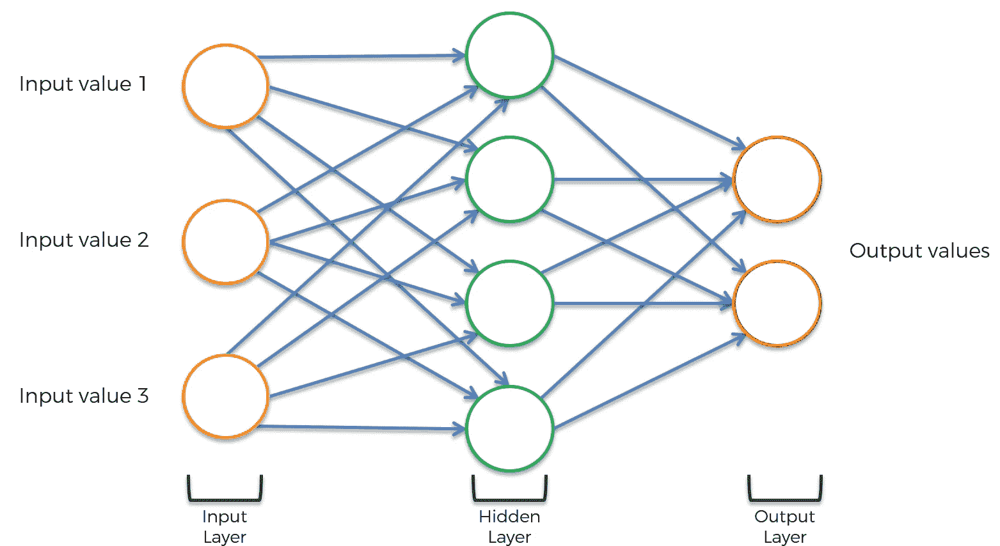

需要对这个神经网络进行的第一个修改是，网络的每一层都应该挤压在一起，就像这样:

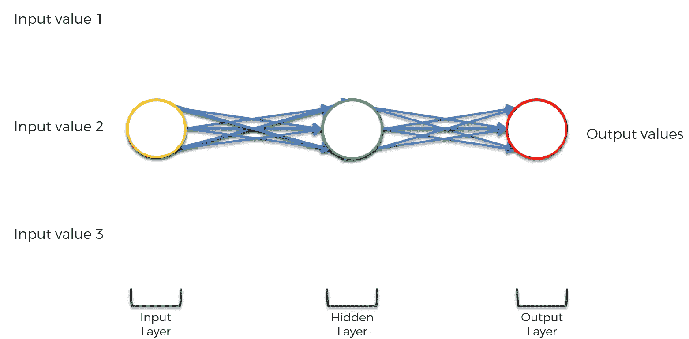

然后，还需要进行三项修改:

*   神经网络的神经元突触需要简化为单线
*   整个神经网络需要旋转 90 度
*   需要围绕神经网络的隐藏层生成一个循环

神经网络现在将具有以下外观:

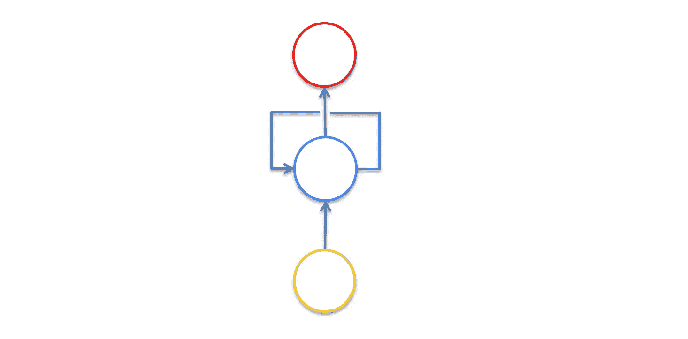

环绕递归神经网络隐藏层的那条线称为时间环。它用于指示隐藏层不仅生成输出，而且该输出作为输入反馈到同一层。

可视化有助于理解这一点。如下图所示，数据集的特定观察中使用的隐藏层不仅用于生成该观察的输出，还用于训练下一个观察的隐藏层。

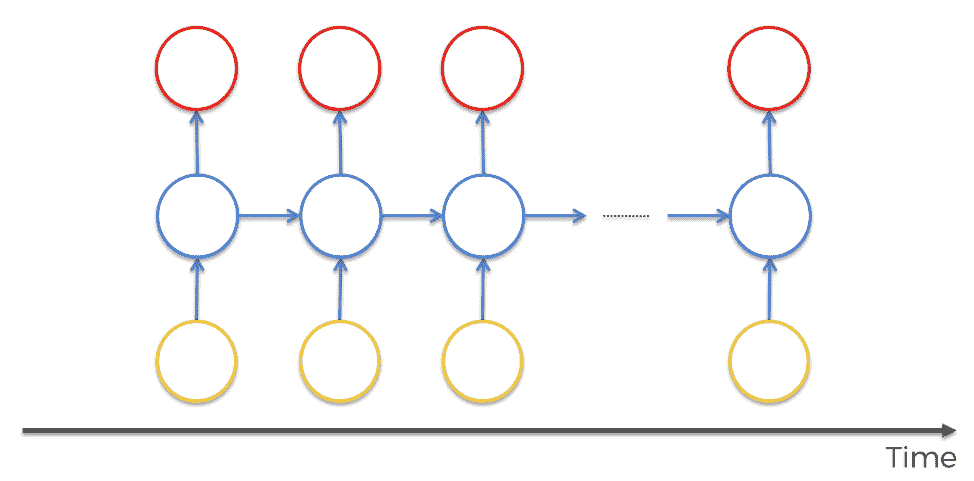

一个观察有助于训练下一个观察的这种特性就是为什么递归神经网络在解决时间序列分析问题时如此有用。

## 总结–递归神经网络的直觉

在本教程中，您首次了解了递归神经网络。更具体地说，我们讨论了递归神经网络背后的直觉。

以下是我们在本教程中讨论的内容的简要总结:

*   递归神经网络解决的问题类型
*   我们在这门课中学习过的大脑不同部分和不同神经网络之间的关系
*   递归神经网络的组成以及如何使用每个隐藏层来帮助根据数据集中的下一次观察训练隐藏层

# **递归神经网络中的消失梯度问题**

消失梯度问题在历史上一直是递归神经网络成功的最大障碍之一。

因此，在构建第一个 RNN 之前，理解渐变消失问题非常重要。

这部分将用简单的英语解释渐变消失的问题，包括对这个有趣问题最有用的解决方案的讨论。

## ****什么是消失渐变问题？****

在我们深入探讨渐变消失问题的细节之前，先了解一下这个问题最初是如何被发现的是很有帮助的。

消失梯度问题是由德国计算机科学家 Sepp Hochreiter 发现的，他在深度学习中的递归神经网络的开发中发挥了重要作用。

现在我们来详细探讨一下消失梯度问题。顾名思义，消失梯度问题与深度学习梯度下降算法有关。回想一下，梯度下降算法看起来像这样:

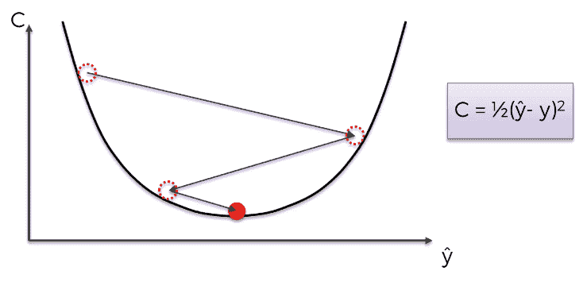

然后，该梯度下降算法与反向传播算法相结合，以更新整个神经网络中的突触权重。

递归神经网络的行为略有不同，因为一个观察的隐藏层用于训练下一个观察的隐藏层。

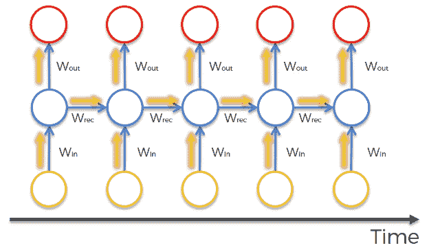

这意味着为数据集中的每个观察值计算神经网络的成本函数。这些成本函数值显示在下图的顶部:

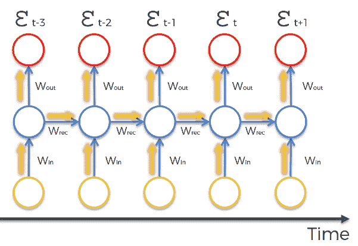

当反向传播算法通过神经网络的所有神经元反向移动以更新它们的权重时，出现消失梯度问题。递归神经网络的性质意味着在神经网络的深层计算的成本函数将用于改变较浅层神经元的权重。

计算这种变化的数学是乘法的，这意味着在神经网络深处的步骤中计算的梯度将通过网络中较早的权重被相乘。换句话说，在网络深处计算的梯度在通过网络返回时被“稀释”,这可能导致梯度消失——这就是消失梯度问题的名称！

在反向传播算法中通过递归神经网络相乘的实际因子由数学变量`Wrec`表示。这带来了两个问题:

*   当`Wrec`很小时，你会遇到渐变消失的问题
*   当`Wrec`很大时，你会遇到一个爆炸性的梯度问题

注意，这两个问题通常被称为“消失梯度问题”。

总之，消失梯度问题是由反向传播算法的乘法性质引起的。这意味着在递归神经网络的深层阶段计算的梯度对神经网络中较浅的神经元的权重的影响太小(在消失梯度问题中)或太大(在爆炸梯度问题中)。

## ****如何解决消失渐变问题****

有许多策略可以用来解决消失梯度问题。我们将分别探讨消失梯度和爆炸梯度问题的策略。先说后者。

### ****解决爆炸梯度问题****

对于爆炸梯度，可以使用称为`truncated backpropagation`的反向传播算法的修改版本。[截断反向传播算法](https://machinelearningmastery.com/gentle-introduction-backpropagation-time/)限制了反向传播将被执行的时间步数，在爆炸梯度问题发生之前停止算法。

您还可以引入`penalties`，这是一种硬编码技术，用于在神经网络中通过较浅层时减少反向传播的影响。

最后，您可以引入`gradient clipping`，它引入了一个人工上限，限制了反向传播算法中梯度可以变得多大。

### ****解决消失渐变问题****

权重初始化是一种可用于解决消失梯度问题的技术。它包括人工创建神经网络中权重的初始值，以防止反向传播算法分配不切实际的小权重。

您还可以使用回声状态网络，这是一种特定类型的神经网络，旨在避免消失梯度问题。回应状态网络超出了本课程的范围。现在知道它们的存在就足够了。

消失梯度问题最重要的解决方案是一种称为长短期记忆网络(LSTMs)的特定类型的神经网络，由 Sepp Hochreiter 和 [Jürgen Schmidhuber](https://en.wikipedia.org/wiki/J%C3%BCrgen_Schmidhuber) 首创。回想一下，Hochreiter 先生是最初发现消失梯度问题的科学家。

LSTM 主要用于与语音识别相关的问题，其中一个最著名的例子是[谷歌在 2015 年使用 LSTM 进行语音识别](https://googleblog.blogspot.com/2015/07/neon-prescription-or-rather-new.html),转录错误减少了 49%。

LSTMs 被认为是对实现递归神经网络感兴趣的科学家的首选神经网络。在本课程的剩余部分，我们将主要关注 LSTMs。

## **总结–消失梯度问题**

在本节中，您了解了递归神经网络的消失梯度问题。

以下是我们讨论内容的简要总结:

*   Sepp Hochreiter 是第一个发现递归神经网络中消失梯度问题的科学家
*   消失梯度问题(和它的表亲，爆炸梯度问题)涉及到什么
*   `Wrec`在消失梯度问题和爆发梯度问题中的作用
*   消失梯度问题和爆炸梯度问题是如何解决的
*   LSTMs 作为消失梯度问题最常见解决方案的作用

# **长短期记忆网络**

长短期记忆网络(LSTMs)是一种用于解决[消失梯度问题的递归神经网络。](https://nickmccullum.com/python-deep-learning/vanishing-gradient-problem/)

它们在重要方面不同于“常规的”递归神经网络。

本教程将向您介绍 LSTMs。在本课程的稍后部分，我们将从头开始构建和训练 LSTM。

## ****目录****

您可以使用下面的目录跳到本 LSTM 教程的特定部分:

*   [lstm 的历史](https://nickmccullum.com/python-deep-learning/lstms-long-short-term-memory-networks/#the-history-of-lstms)
*   【LSTMs 如何解决消失梯度问题
*   【LSTMs 如何工作
*   [LSTM 建筑的变化](https://nickmccullum.com/python-deep-learning/lstms-long-short-term-memory-networks/#variations-of-lstm-architectures)
*   [窥视孔变异](https://nickmccullum.com/python-deep-learning/lstms-long-short-term-memory-networks/#the-peephole-variation)
*   [耦合栅极变化](https://nickmccullum.com/python-deep-learning/lstms-long-short-term-memory-networks/#the-coupled-gate-variation)
*   [其他 LSTM 变体](https://nickmccullum.com/python-deep-learning/lstms-long-short-term-memory-networks/#other-lstm-variations)
*   [最终想法](https://nickmccullum.com/python-deep-learning/lstms-long-short-term-memory-networks/#final-thoughts)

## ****lst ms 的历史****

正如我们在上一节提到的，LSTMs 领域最重要的两个人物是 [Sepp Hochreiter](https://en.wikipedia.org/wiki/Sepp_Hochreiter) 和 [Jürgen Schmidhuber](https://en.wikipedia.org/wiki/J%C3%BCrgen_Schmidhuber) 。

后者是前者在德国慕尼黑工业大学的博士生导师。

Hochreiter 的博士论文首次向世界介绍了 LSTMs。

## ****lstm 如何解决渐变消失问题****

在上一个教程中，我们学习了反向传播算法中的`Wrec`项是如何导致消失梯度问题或爆炸梯度问题的。

我们探索了这个问题的各种可能的解决方案，包括惩罚，梯度裁剪，甚至回声状态网络。LSTMs 是最好的解决方案。

那么 LSTMs 是如何工作的呢？它们只是改变了`Wrec`的值。

在我们对消失梯度问题的解释中，您了解到:

*   当`Wrec`很小时，你会遇到渐变消失的问题
*   当`Wrec`很大时，你会遇到一个爆炸性的梯度问题

我们实际上可以更具体一些:

*   当`Wrec < 1`时，你会遇到渐变消失的问题
*   当`Wrec > 1`时，你经历了一个爆炸性的梯度问题

如果考虑到反向传播算法的乘法性质，这是有意义的。

如果你有一个比`1`小的数，然后你一遍又一遍地把它和自己相乘，你最终会得到一个消失的数。类似地，将一个大于`1`的数与自身相乘多次会得到一个非常大的数。

为了解决这个问题，LSTMs 设置了`Wrec = 1`。LSTMS 当然不仅仅是设置`Wrec = 1`，但这绝对是递归神经网络规范做出的最重要的改变。

## ****LSTMs 如何工作****

本节将解释 LSTMs 是如何工作的。在继续之前，值得一提的是，我将使用 Christopher Olah 的博客文章 [Understanding LSTMs](https://colah.github.io/posts/2015-08-Understanding-LSTMs/) 中的图片，该文章发表于 2015 年 8 月，其中有一些我见过的最好的 LSTM 可视化。

首先，让我们考虑递归神经网络的基本版本:

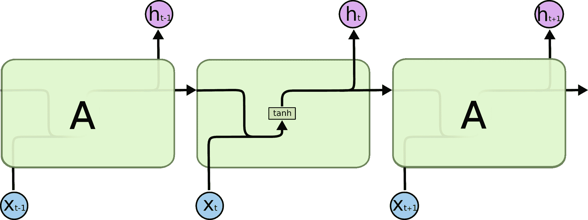

这种神经网络具有神经元和突触，它们将一层输出的加权和作为下一层的输入进行传输。反向传播算法将通过该算法向后移动，并响应于在其训练阶段的每个时期计算的成本函数来更新每个神经元的权重。

相比之下，LSTM 是这样的:

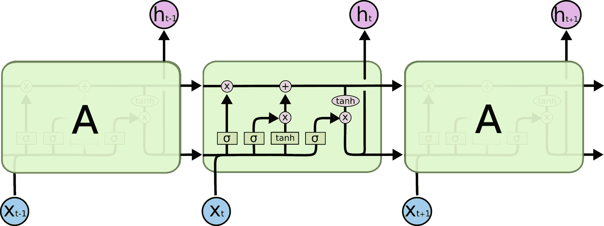

如你所见，LSTM 比常规的递归神经网络具有更高的嵌入复杂度。我的目标是让你在完成本教程时完全理解这幅图像。

首先，让我们熟悉一下上图中使用的符号:

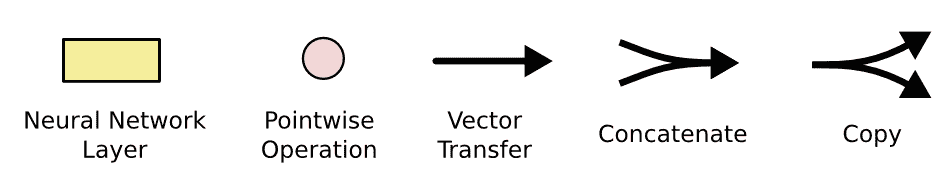

既然你对我们将在本 LSTM 教程中使用的符号有所了解，我们可以开始检查 LSTM 神经网络中某一层的功能。每一层都有以下外观:

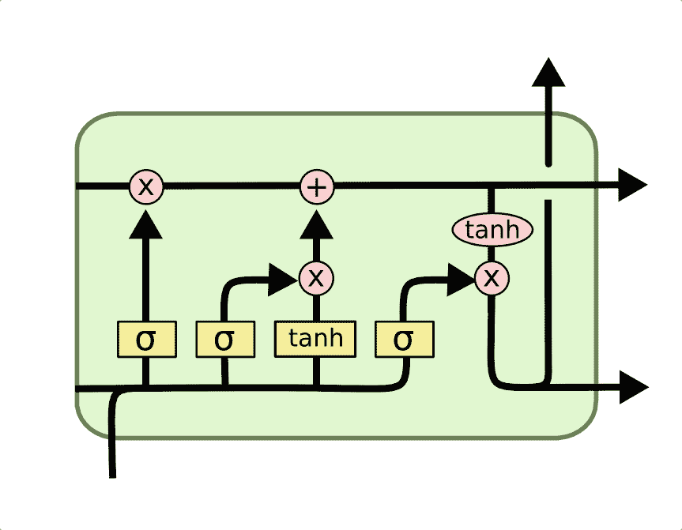

在我们深入研究 LSTM 神经网络中节点的功能之前，值得注意的是，这些深度学习模型的每个输入和输出都是一个向量。在 Python 中，这通常由一个 [NumPy 数组](https://nickmccullum.com/advanced-python/numpy-arrays/)或另一个一维数据结构来表示。

在 LSTM 中发生的第一件事是`forget gate layer`的[激活功能](https://nickmccullum.com/python-deep-learning/deep-learning-activation-functions/)。它查看该层的输入(标记为`xt`用于观察，标记为`ht`用于神经网络前一层的输出)，并输出前一层(标记为`Ct-1`的单元状态中的每个数字的`1`或`0`。

下面是激活`forget gate layer`的可视化效果:

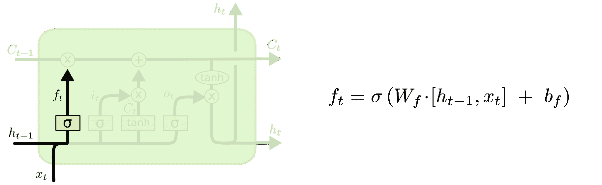

我们还没有讨论单元状态，所以现在让我们开始吧。在我们的图表中，单元格状态由贯穿图表顶部的长水平线表示。例如，以下是我们可视化中的细胞状态:

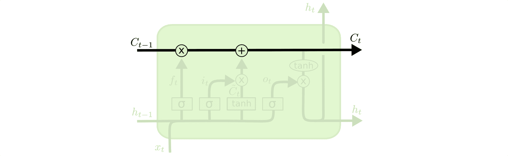

细胞状态的目的是决定从一个递归神经网络被训练的不同观察中携带什么信息。是否继续传递信息的决定由`gates`做出，其中`forget gate`是一个典型的例子。LSTM 内的每个门将具有以下外观:


这些门内的`σ`字符指的是 Sigmoid 函数，你可能已经在[逻辑回归机器学习模型](https://nickmccullum.com/python-machine-learning/logistic-regression-python/)中见过它。sigmoid 函数被用作 LSTMs 中的一种激活函数，它确定通过门传递什么信息来影响网络的单元状态。

根据定义，Sigmoid 函数只能输出在`0`和`1`之间的数字。正因为如此，它经常被用来计算概率。在 LSTM 模型的情况下，它规定了应该允许每种产出的多少比例来影响销售状态。

LSTM 模型的下两个步骤是密切相关的:`input gate layer`和`tanh layer`。这些层共同决定如何更新单元状态。同时，完成了最后一步，这允许单元确定关于数据集中的最后一次观察要忘记什么。

以下是这一过程的可视化:

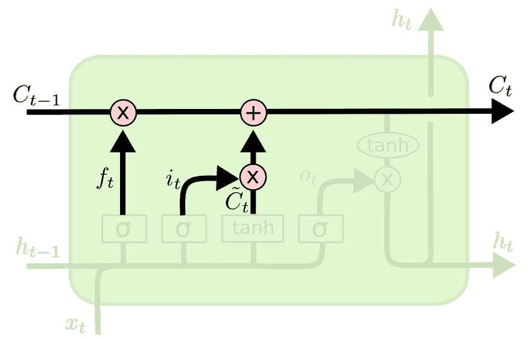

LSTM 的最后一步决定了该观察的输出(表示为`ht`)。这一步贯穿 sigmoid 函数和双曲正切函数。可以想象如下:

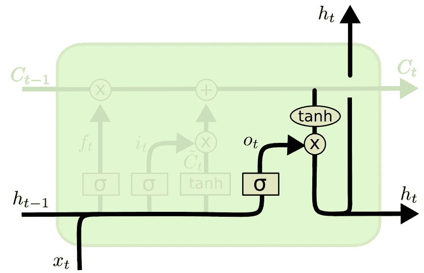

这结束了训练 LSTM 模型的单个层的过程。正如你可能想象的那样，在表面之下有大量的数学被我们掩盖了。本节的重点是广泛解释 LSTMs 如何工作，而不是让您深入理解过程中的每个操作。

## ****LSTM 建筑的变体****

我想通过讨论 LSTM 建筑的一些不同变体来结束本教程，这些变体与我们迄今为止讨论的基本 LSTM 略有不同。

简单回顾一下，LSTM 的广义节点如下所示:


### ****窥视孔变异****

也许 LSTM 架构最重要的变体是`peephole`变体，它允许栅极层从单元状态读取数据。

下面是窥视孔变体的可视化效果:

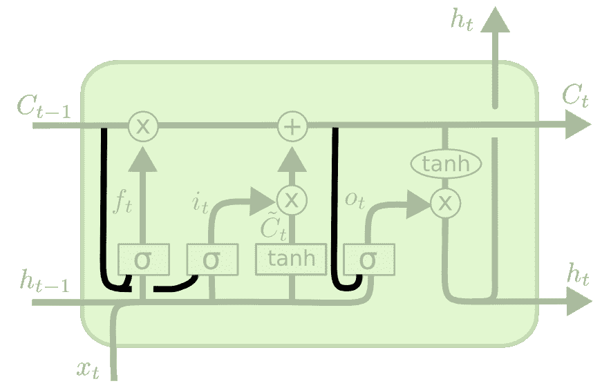

请注意，虽然该图在递归神经网络中的每个门中添加了窥视孔，但是您也可以在一些门中添加窥视孔，而不在其他门中添加。

### ****耦合门变异****

LSTM 体系结构还有另一种变体，其中模型决定要忘记什么以及要一起添加什么新信息。在最初的 LSTM 模型中，这些决定是分开做出的。

这是这种架构的可视化效果:

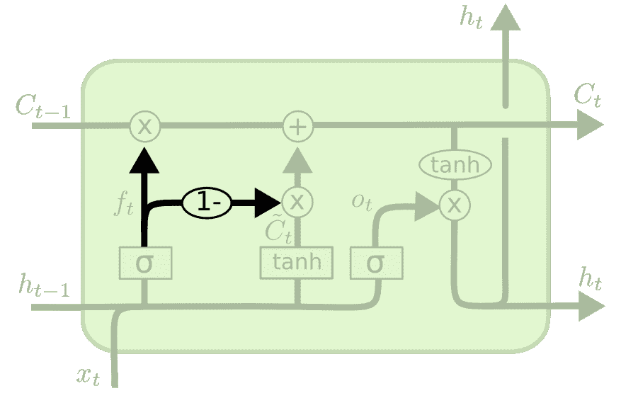

## ****其他 LSTM 变异****

这只是 LSTM 体系结构变体的两个例子。还有很多。下面列出了一些例子:

*   [门控循环单位](https://en.wikipedia.org/wiki/Gated_recurrent_unit)
*   [深度门控 RNNs](https://arxiv.org/abs/1508.03790)
*   [发条 RNNs](https://arxiv.org/abs/1402.3511)

## **总结——长短期记忆网络**

在本教程中，你第一次接触到了长短期记忆网络。

以下是您所学内容的简要总结:

*   LSTMs 的(非常)简史以及 Sepp Hochreiter 和 Jürgen Schmidhuber 在其发展中所起的作用
*   LSTMs 如何解决消失梯度问题
*   LSTMs 如何工作
*   LSTMs 中门、sigmoid 函数和双曲正切函数的作用
*   LSTM 建筑的几个最受欢迎的变体

# **如何建立和训练递归神经网络**

到目前为止，在我们对递归神经网络的讨论中，您已经了解了:

*   递归神经网络背后的基本直觉
*   历史上阻碍递归神经网络发展的消失梯度问题
*   [长短期记忆网络](https://nickmccullum.com/python-deep-learning/lstms-long-short-term-memory-networks/)如何帮助解决消失梯度问题

现在是时候建立你的第一个递归神经网络了！更具体地说，本教程将教你如何建立和训练一个 LSTM 来预测脸书的股票价格。

## ****目录****

您可以使用下面的目录跳到 Python 递归神经网络教程的特定部分:

*   [下载本教程的数据集](https://nickmccullum.com/python-deep-learning/recurrent-neural-network-tutorial/#downloading-the-data-set-for-this-tutorial)
*   [导入本教程所需的库](https://nickmccullum.com/python-deep-learning/recurrent-neural-network-tutorial/#importing-the-libraries-you-ll-need-for-this-tutorial)
*   [将我们的训练集导入 Python 脚本](https://nickmccullum.com/python-deep-learning/recurrent-neural-network-tutorial/#importing-our-training-set-into-the-python-script)
*   [将特征缩放应用于我们的数据集](https://nickmccullum.com/python-deep-learning/recurrent-neural-network-tutorial/#applying-feature-scaling-to-our-data-set)
*   [指定我们的递归神经网络的时间步数](https://nickmccullum.com/python-deep-learning/recurrent-neural-network-tutorial/#specifying-the-number-of-timesteps-for-our-recurrent-neural-network)
*   [通过将数据集转换成 NumPy 数组来最终确定数据集](https://nickmccullum.com/python-deep-learning/recurrent-neural-network-tutorial/#finalizing-our-data-sets-by-transforming-them-into-numpy-arrays)
*   [导入我们的 TensorFlow 库](https://nickmccullum.com/python-deep-learning/recurrent-neural-network-tutorial/#importing-our-tensorflow-libraries)
*   [构建我们的递归神经网络](https://nickmccullum.com/python-deep-learning/recurrent-neural-network-tutorial/#building-our-recurrent-neural-network)
*   [添加第一个 LSTM 图层](https://nickmccullum.com/python-deep-learning/recurrent-neural-network-tutorial/#adding-our-first-lstm-layer)
*   [增加一些退出规则](https://nickmccullum.com/python-deep-learning/recurrent-neural-network-tutorial/#adding-some-dropout-regularization)
*   [再添加三个 LSTM 图层，并进行剔除调整](https://nickmccullum.com/python-deep-learning/recurrent-neural-network-tutorial/#adding-three-more-lstm-layers-with-dropout-regularization)
*   [将输出层添加到我们的递归神经网络中](https://nickmccullum.com/python-deep-learning/recurrent-neural-network-tutorial/#adding-the-output-layer-to-our-recurrent-neural-network)
*   [编译我们的递归神经网络](https://nickmccullum.com/python-deep-learning/recurrent-neural-network-tutorial/#compiling-our-recurrent-neural-network)
*   [在训练集上拟合递归神经网络](https://nickmccullum.com/python-deep-learning/recurrent-neural-network-tutorial/#fitting-the-recurrent-neural-network-on-the-training-set)
*   [用我们的递归神经网络进行预测](https://nickmccullum.com/python-deep-learning/recurrent-neural-network-tutorial/#making-predictions-with-our-recurrent-neural-network)
*   [导入我们的测试数据](https://nickmccullum.com/python-deep-learning/recurrent-neural-network-tutorial/#importing-our-test-data)
*   [构建测试数据集我们需要进行预测](https://nickmccullum.com/python-deep-learning/recurrent-neural-network-tutorial/#building-the-test-data-set-we-need-to-make-predictions)
*   [缩放我们的测试数据](https://nickmccullum.com/python-deep-learning/recurrent-neural-network-tutorial/#scaling-our-test-data)
*   [对我们的测试数据进行分组](https://nickmccullum.com/python-deep-learning/recurrent-neural-network-tutorial/#grouping-our-test-data)
*   [实际做出预测](https://nickmccullum.com/python-deep-learning/recurrent-neural-network-tutorial/#actually-making-predictions)
*   [本教程的完整代码](https://nickmccullum.com/python-deep-learning/recurrent-neural-network-tutorial/#the-full-code-for-this-tutorial)
*   [最终想法](https://nickmccullum.com/python-deep-learning/recurrent-neural-network-tutorial/#final-thoughts)

## ****下载本教程的数据集****

要继续学习本教程，您需要下载两个数据集:

*   一组训练数据，包含从 2015 年初到 2019 年底脸书股票价格的信息
*   一组包含 2020 年第一个月脸书股票价格信息的测试数据

我们的递归神经网络将在 2015-2019 年的数据上进行训练，并将用于预测 2020 年 1 月的数据。

您可以使用以下链接下载培训数据和测试数据:

*   [训练数据](https://nickmccullum.com/files/recurrent-neural-networks/FB_training_data.csv)
*   [测试数据](https://nickmccullum.com/files/recurrent-neural-networks/FB_test_data.csv)

这些数据集都是从雅虎导出的。金融。它们看起来像这样(在 Microsoft Excel 中打开时):


一旦文件被下载，将它们移动到你想要工作的目录，并打开一个 [Jupyter 笔记本](https://nickmccullum.com/python-course/jupyter-notebook-basics/)。

## ****导入本教程所需的库****

本教程将依赖于许多开源 Python 库，包括 [NumPy](https://nickmccullum.com/advanced-python/numpy/) 、 [pandas](https://nickmccullum.com/advanced-python/pandas/) 和 [matplotlib](https://nickmccullum.com/python-visualization/how-to-import-matplotlib/) 。

让我们通过导入这些库来开始我们的 Python 脚本:

```
 import numpy as np

import pandas as pd

import matplotlib.pyplot as plt 
```

## ****将我们的训练集导入 Python 脚本****

下一个需要完成的任务是将数据集导入 Python 脚本。

我们最初将使用`read_csv`方法导入数据集作为[熊猫数据帧](https://nickmccullum.com/advanced-python/pandas-dataframes/)。然而，由于`TensorFlow`的`keras`模块只接受 [NumPy 数组](https://nickmccullum.com/advanced-python/numpy-arrays/)作为参数，数据结构需要在导入后进行转换。

让我们从将整个`.csv`文件作为数据帧导入开始:

```
 training_data = pd.read_csv('FB_training_data.csv') 
```

在查看数据框架时，您会注意到它包含了许多测量脸书股票价格的不同方法，包括开盘价、收盘价、最高价和最低价以及交易量信息:

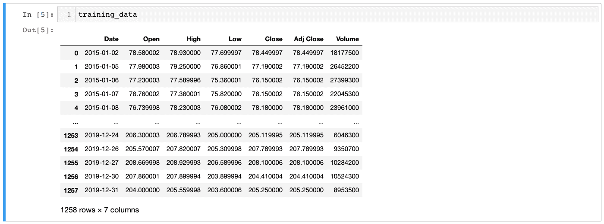

在继续之前，我们需要选择特定类型的股票价格。让我们用`Close`来表示脸书股票未经调整的收盘价。

现在我们需要选择数据帧中的那一列，并将其存储在一个 NumPy 数组中。下面是执行此操作的命令:

```
 training_data = training_data.iloc[:, 1].values 
```

注意，这个命令覆盖了我们之前创建的现有的`training_data`变量。

您现在可以通过运行`type(training_data)`来验证我们的`training_data`变量确实是一个 NumPy 数组，它应该返回:

```
 numpy.ndarray 
```

## ****对我们的数据集应用特征缩放****

现在，让我们花点时间对数据集进行一些特征缩放。

作为快速复习，有两种主要方法可以将特征缩放应用于数据集:

*   标准化
*   正常化

我们将使用归一化来构建我们的递归神经网络，包括减去数据集的最小值，然后除以数据集的范围。

以下是数学定义的归一化函数:

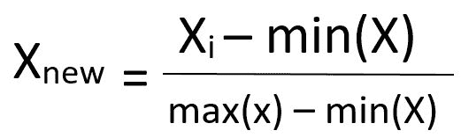

幸运的是，`scikit-learn`使得使用它的`MinMaxScaler`类对数据集应用规范化变得非常容易。

让我们从将这个类导入 Python 脚本开始。`MinMaxScaler`类位于`scikit-learn`的`preprocessing`模块中，因此导入该类的命令是:

```
 from sklearn.preprocessing import MinMaxScaler 
```

接下来，我们需要创建这个类的一个实例。我们将把新创建的对象赋给一个名为`scaler`的变量。我们将使用这个类的默认参数，所以我们不需要传入任何东西:

```
 scaler = MinMaxScaler() 
```

由于我们没有指定任何非默认参数，这将缩放我们的数据集，以便每个观察值都在`0`和`1`之间。

我们已经创建了我们的`scaler`对象，但是我们的`training_data`数据集还没有被缩放。我们需要使用`fit_transform`方法来修改原始数据集。下面是实现这一点的语句:

```
 training_data = scaler.fit_transform(training_data.reshape(-1, 1)) 
```

## ****指定我们的递归神经网络的时间步数****

接下来我们需要做的是指定我们的`timesteps`号。[时间步长](https://machinelearningmastery.com/use-timesteps-lstm-networks-time-series-forecasting/)指定当递归神经网络对当前观测值进行预测时，应考虑多少个先前观测值。

我们将在本教程中使用`40`时间步长。这意味着，对于神经网络预测的每一天，它都将考虑前 40 天的股票价格，以确定其输出。请注意，由于一个月只有大约 20 个交易日，使用 40 个时间步长意味着我们依赖于前两个月的股价数据。

那么，我们如何在 Python 脚本中指定时间步长的数量呢？

这是通过创建两种特殊的数据结构来实现的:

*   一个我们称之为`x_training_data`的数据结构包含数据集中最近 40 次股票价格观察。这是递归神经网络将用来进行预测的数据。
*   一个我们称之为`y_training_data`的数据结构包含下一个交易日的股票价格。这是递归神经网络试图预测的数据点。

首先，让我们将这些数据结构初始化为一个空的 Python 列表:

```
 x_training_data = []

y_training_data =[] 
```

现在，我们将使用 for 循环将实际数据填充到每个 Python 列表中。下面是代码(在代码块后有对代码的进一步解释):

```
 for i in range(40, len(training_data)):

    x_training_data.append(training_data[i-40:i, 0])

    y_training_data.append(training_data[i, 0]) 
```

让我们解开这个代码块的组件:

*   `range(40, len(training_data))`函数使 for 循环从`40`迭代到训练数据的最后一个索引。
*   在循环的每次迭代中，`x_training_data.append(training_data[i-40:i, 0])`行将导致循环将前面的 40 个股票价格附加到`x_training_data`。
*   类似地，`y_training_data.append(training_data[i, 0])`导致循环在每次迭代时将第二天的股票价格追加到`y_training_data`中。

## ****通过将数据集转换成 NumPy 数组来最终确定我们的数据集****

TensorFlow 主要用于 NumPy 数组。因此，我们需要做的最后一件事是将我们刚刚创建的两个 Python 列表转换成 NumPy 数组。

幸运的是，这很简单。您只需要将 Python 列表包装在`np.array`函数中。代码如下:

```
 x_training_data = np.array(x_training_data)

y_training_data = np.array(y_training_data) 
```

确保脚本按预期运行的一个重要方法是验证两个 NumPy 数组的形状。

`x_training_data`数组应该是一个双向 NumPy 数组，一维是`40`(时间步长的数量)，第二维是`len(training_data) - 40`，在我们的例子中计算为`1218`。

类似地，`y_training_data`对象应该是长度为`1218`的一维 NumPy 数组(同样是`len(training_data) - 40`)。

您可以通过打印数组的`shape`属性来验证数组的形状，如下所示:

```
 print(x_training_data.shape)

print(y_training_data.shape) 
```

这将打印:

```
 (1218, 40)

(1218,) 
```

两个数组都有你期望的尺寸。然而，在继续构建我们的递归神经网络之前，我们需要再次重塑我们的`x_training_data`对象。

原因是 TensorFlow 中可用的递归神经网络层只接受非常特定格式的数据。你可以在这里阅读 TensorFlow 文档。

为了重塑`x_training_data`对象，我将使用[NP . shape](https://nickmccullum.com/numpy-np-reshape/)方法。下面是执行此操作的代码:

```
 x_training_data = np.reshape(x_training_data, (x_training_data.shape[0], 

                                               x_training_data.shape[1], 

                                               1)) 
```

现在让我们再次打印出`x_training_data`的形状:

```
 print(x_training_data.shape) 
```

这将输出:

```
 (1218, 40, 1) 
```

我们的阵列具有期望的形状，所以我们可以继续构建我们的递归神经网络。

## ****导入我们的张量流库****

在我们开始构建递归神经网络之前，我们需要从 TensorFlow 导入一些类。以下是您在继续之前应该运行的语句:

```
 from tensorflow.keras.models import Sequential

from tensorflow.keras.layers import Dense

from tensorflow.keras.layers import LSTM

from tensorflow.keras.layers import Dropout 
```

## ****构建我们的递归神经网络****

现在是时候建立我们的循环神经网络了。

首先需要做的是初始化 TensorFlow 的`Sequential`类中的一个对象。顾名思义，`Sequential`类被设计成通过随时间增加层序列来构建神经网络。

下面是初始化我们的递归神经网络的代码:

```
 rnn = Sequential() 
```

就像我们的[人工神经网络](https://nickmccullum.com/python-deep-learning/artificial-neural-network-tutorial/)和[卷积神经网络](https://nickmccullum.com/python-deep-learning/convolutional-neural-network-tutorial/)一样，我们可以使用`add`方法向这个递归神经网络添加更多层。

## ****添加我们的第一个 LSTM 层****

我们将添加的第一层是一个 [LSTM](https://nickmccullum.com/python-deep-learning/lstms-long-short-term-memory-networks/) 层。为此，将对`LSTM`类(我们刚刚导入的)的调用传递到`add`方法中。

`LSTM`类接受几个参数。更准确地说，我们将指定三个参数:

*   你想包括在这一层的 LSTM 神经元的数量。增加神经元的数量是增加循环神经网络维数的一种方法。在我们的例子中，我们将指定`units = 45`。
*   如果你计划在你添加的 LSTM 图层之后添加另一个图层，这必须被指定。你应该为你的递归神经网络中的最后一个 LSTM 层指定`return_sequences = False`。
*   我们训练数据中的时间步数和预测数。在我们的例子中，我们使用了`40`时间步长和唯一的`1`预测值(股票价格),所以我们将添加

下面是完整的`add`方法:

```
 rnn.add(LSTM(units = 45, return_sequences = True, input_shape = (x_training_data.shape[1], 1))) 
```

请注意，我使用了`x_training_data.shape[1]`而不是硬编码值，以防我们日后决定在更大的模型上训练递归神经网络。

## ****增加一些辍学正规化****

[退出正则化](https://machinelearningmastery.com/dropout-for-regularizing-deep-neural-networks/)是一种用于在训练神经网络时避免过度拟合的技术。

它包括在训练阶段随机排除或“放弃”某些层的输出。

TensorFlow 使用我们之前在 Python 脚本中导入的`Dropout`类来轻松实现退出正则化。`Dropout`类接受一个参数:辍学率。

退出率表示在神经网络的特定层中应该退出多少个神经元。通常使用 20%的辍学率。在我们的递归神经网络中，我们将遵循这个惯例。

以下是如何指导 TensorFlow 在训练阶段的每次迭代中减少 20%的 LSTM 层神经元:

```
 rnn.add(Dropout(0.2)) 
```

## ****再添加三个 LSTM 图层，并去掉正则化****

我们现在将添加三个以上的 LSTM 层(与辍学正则化)到我们的递归神经网络。你会看到，指定第一个 LSTM 层后，添加更多是微不足道的。

要添加更多的层，所有需要做的就是复制前两个`add`方法，做一个小的改变。也就是说，我们应该从`LSTM`类中移除`input_shape`参数。

我们将在每个`LSTM`类调用中保持神经元的数量(或`units`)和丢失率相同。因为我们在这一部分添加的第三个`LSTM`层将是我们的最后一个 LSTM 层，我们可以像前面提到的那样移除`return_sequences = True`参数。移除参数会将`return_sequences`设置为默认值`False`。

下面是添加下面三个 LSTM 层的完整代码:

```
 rnn.add(LSTM(units = 45, return_sequences = True))

rnn.add(Dropout(0.2))

rnn.add(LSTM(units = 45, return_sequences = True))

rnn.add(Dropout(0.2))

rnn.add(LSTM(units = 45))

rnn.add(Dropout(0.2)) 
```

这段代码非常重复，违背了软件开发的 DRY(不要重复自己)原则。让我们将它嵌套在一个循环中:

```
 for i in [True, True, False]:

    rnn.add(LSTM(units = 45, return_sequences = i))

    rnn.add(Dropout(0.2)) 
```

## ****向我们的递归神经网络添加输出层****

让我们通过添加输出层来完成递归神经网络的架构设计。

输出层将是`Dense`类的一个实例，这个类就是我们在本课程前面用来创建[卷积神经网络的完整连接层](https://nickmccullum.com/python-deep-learning/flattening-full-connection/)的类。

我们需要指定的唯一参数是`units` ，它是输出层应该生成的理想维数。因为我们想要输出第二天的股票价格(单个值)，我们将指定`units = 1`。

下面是创建输出层的代码:

```
 rnn.add(Dense(units = 1)) 
```

## ****编译我们的递归神经网络****

正如您从人工神经网络和卷积神经网络教程中回忆的那样，构建神经网络的编译步骤是我们指定神经网络的优化器和损失函数的地方。

TensorFlow 允许我们使用名副其实的`compile`方法来编译一个神经网络。它接受两个参数:`optimizer`和`loss`。让我们首先创建一个空的`compile`函数:

```
 rnn.compile(optimizer = '', loss = '') 
```

我们现在需要指定`optimizer`和`loss`参数。

先来讨论一下`optimizer`参数。递归神经网络通常在编译阶段使用 RMSProp 优化器。也就是说，我们将使用 Adam 优化器(和以前一样)。Adam 优化器是一种重型优化器，在各种神经网络体系结构中都很有用。

`loss`参数相当简单。由于我们预测的是一个连续变量，我们可以使用均方差——就像你在测量[线性回归机器学习模型](https://nickmccullum.com/python-machine-learning/linear-regression-python/)的性能时一样。这意味着我们可以指定`loss = mean_squared_error`。

下面是最后一个`compile`方法:

```
 rnn.compile(optimizer = 'adam', loss = 'mean_squared_error') 
```

## ****在训练集上拟合递归神经网络****

现在是时候根据我们的训练数据来训练我们的递归网络了。

为此，我们使用了`fit`方法。在这种情况下，`fit`方法接受四个参数:

*   ****训练数据**** :在我们的例子中，这将是`x_training_data`和`y_training_data`
*   ****时期**** :你希望递归神经网络被训练的迭代次数。在这种情况下，我们将指定`epochs = 100`。
*   **:网络在每个历元中训练的批次大小。**

**下面是根据我们的规范训练这个递归神经网络的代码:**

```
 `rnn.fit(x_training_data, y_training_data, epochs = 100, batch_size = 32)` 
```

**您的 Jupyter 笔记本现在将为训练算法中的每个时期生成大量打印输出。它们看起来像这样:**

**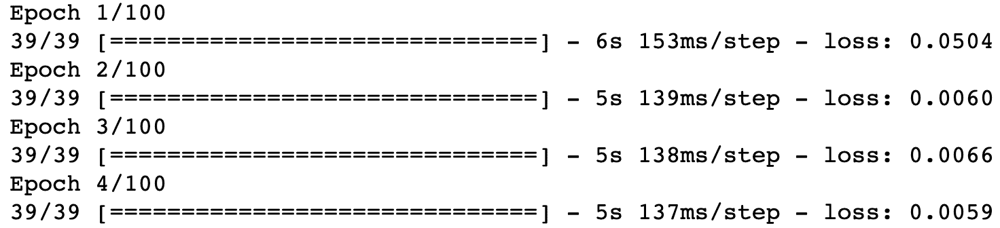**

**如您所见，每个输出都显示了计算该历元花费的时间以及在该历元计算的损失函数。**

**随着递归神经网络随着时间的推移适合训练数据，您应该会看到损失函数值缓慢下降。在我的例子中，损失函数值从第一次迭代的`0.0504`下降到最后一次迭代的`0.0017`。**

## ******用我们的递归神经网络进行预测******

**我们已经建立了我们的递归神经网络，并在过去 5 年的脸书股票价格数据上对其进行了训练。现在是做一些预测的时候了！**

### ******导入我们的测试数据******

**首先，让我们导入 2020 年第一个月的实际股价数据。这将给我们一些东西来比较我们的预测值。**

**下面是实现这一点的代码。请注意，它非常类似于我们在 Python 脚本开始时用来导入训练数据的代码:**

```
 `test_data = pd.read_csv('FB_test_data.csv')

test_data = test_data.iloc[:, 1].values` 
```

**如果运行语句`print(test_data.shape)`，它将返回`(21,)`。这表明我们的测试数据是一个有 21 个条目的一维 NumPy 数组——这意味着 2020 年 1 月有 21 个股市交易日。**

**您也可以使用`plt.plot(test_data)`生成数据的快速图表。这将生成以下 Python 可视化:**

**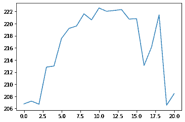**

**幸运的话，我们的预测值应该遵循相同的分布。**

### ******构建我们需要进行预测的测试数据集******

**在我们实际预测 2020 年 1 月脸书的股票价格之前，我们首先需要对我们的数据集进行一些更改。**

**这样做的原因是，为了预测 1 月份的每个`21`观察值，我们将需要之前的`40`个交易日。这些交易日中的一些将来自测试集，而其余的将来自训练集。正因为如此，一些[串联](https://nickmccullum.com/advanced-python/how-to-concatenate-pandas-dataframes/)是必要的。**

**不幸的是，您可以直接连接 NumPy 数组。这是因为我们已经对训练数据应用了特征缩放，但是还没有对测试数据应用任何特征缩放。**

**为了解决这个问题，我们需要在名为`unscaled_x_training_data`的新变量名下重新导入原始的`x_training_data`对象。为了一致性，我们也将测试数据作为名为`unscaled_test_data`的数据帧重新导入:**

```
 `unscaled_training_data = pd.read_csv('FB_training_data.csv')

unscaled_test_data = pd.read_csv('FB_test_data.csv')` 
```

**现在，我们可以用下面的语句将每个数据帧中的`Open`列连接在一起:**

```
 `all_data = pd.concat((unscaled_x_training_data['Open'], unscaled_test_data['Open']), axis = 0)` 
```

**这个`all_data`物体是一个长度为 1279 的熊猫系列。**

**现在我们需要创建一个数组，包含 2020 年 1 月以及 1 月之前 40 个交易日的所有股票价格。我们将把这个对象称为`x_test_data`，因为它包含了我们将用来预测 2020 年 1 月股票价格的`x`值。**

**您需要做的第一件事是在我们的`all_data`对象中找到一月份第一个交易日的指数。语句`len(all_data) - len(test_data)`为我们标识了这个索引。**

**这表示数组中第一项的上限。要得到下界，只需从这个数中减去`40`。说的不一样，下界是`len(all_data) - len(test_data) - 40`。**

**整个`x_test_data`数组的上界将是数据集中的最后一项。因此，我们可以用下面的语句创建这个 NumPy 数组:**

```
 `x_test_data = all_data[len(all_data) - len(test_data) - 40:].values` 
```

**您可以通过打印值为`61`的`len(x_test_data)`来检查该对象是否已按预期创建。这很有意义——它应该包含 2020 年 1 月的`21`值以及之前的`40`值。**

**本节的最后一步是快速重塑我们的 NumPy 数组，使其适合于`predict`方法:**

```
 `x_test_data = np.reshape(x_test_data, (-1, 1))` 
```

**请注意，如果您忽略了这一步，TensorFlow 会打印一条方便的消息，准确解释您需要如何转换数据。**

### ******缩放我们的测试数据******

**我们的递归神经网络是在缩放数据上训练的。因此，在使用模型进行预测之前，我们需要调整我们的`x_test_data`变量。**

```
 `x_test_data = scaler.transform(x_test_data)` 
```

**注意，我们在这里使用了`transform`方法，而不是`fit_transform`方法(像以前一样)。这是因为我们希望根据从整个训练数据集生成的拟合来转换测试数据。**

**这意味着应用于测试数据的转换将与应用于训练数据的转换相同，这是我们的递归神经网络进行准确预测所必需的。**

### ******分组我们的测试数据******

**我们需要做的最后一件事是将我们的测试数据分组到大小为`40`的`21`数组中。换句话说，我们现在将创建一个数组，其中每个条目对应一月份的一个日期，并包含`40`前几个交易日的股票价格。**

**完成这项工作的代码类似于我们之前使用的代码:**

```
 `final_x_test_data = []

for i in range(40, len(x_test_data)):

    final_x_test_data.append(x_test_data[i-40:i, 0])

final_x_test_data = np.array(final_x_test_data)` 
```

**最后，我们需要重塑`final_x_test_data`变量，以满足 TensorFlow 标准。**

**我们之前已经看到了这一点，所以代码应该不需要解释:**

```
 `final_x_test_data = np.reshape(final_x_test_data, (final_x_test_data.shape[0], 

                                               final_x_test_data.shape[1], 

                                               1))` 
```

### ******实际上做出预测******

**经过大量的数据重新处理后，我们现在可以使用我们的测试数据进行预测了！**

**这一步很简单。只需将我们的`final_x_test_data`对象传入在`rnn`对象上调用的`predict`方法。例如，下面是如何生成这些预测并将它们存储在名为`predictions`的变量中:**

```
 `predictions = rnn.predict(final_x_test_data)` 
```

**让我们通过运行`plt.plot(predictions)`来绘制这些预测(注意，您需要首先运行`plt.clf()`来清空您的画布):**

**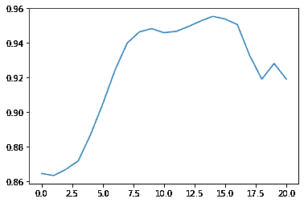**

**可以看到，这个图中的预测值都在`0`和`1`之间。这是因为我们的数据集仍然是可伸缩的！为了让预测有实际意义，我们需要缩小它的规模。**

**我们最初用来缩放数据集的`MinMaxScaler`类附带了一个有用的`inverse_transform`方法来取消数据缩放。以下是如何取消数据缩放并生成新图的方法:**

```
 `unscaled_predictions = scaler.inverse_transform(predictions)

plt.clf() #This clears the first prediction plot from our canvas

plt.plot(unscaled_predictions)` 
```

**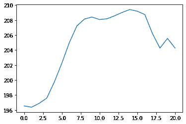**

**这样看起来好多了！任何跟踪脸书股票价格的人都可以看到，这似乎相当接近脸书的实际交易价格。**

**让我们制作一个图表，比较我们预测的股票价格和脸书的实际股票价格:**

```
 `plt.plot(unscaled_predictions, color = '#135485', label = "Predictions")

plt.plot(test_data, color = 'black', label = "Real Data")

plt.title('Facebook Stock Price Predictions')` 
```

## ******本教程的完整代码******

**你可以在 GitHub 库中查看本教程的完整代码。它也粘贴在下面供您参考:**

```
 `#Import the necessary data science libraries

import numpy as np

import pandas as pd

import matplotlib.pyplot as plt

#Import the data set as a pandas DataFrame

training_data = pd.read_csv('FB_training_data.csv')

#Transform the data set into a NumPy array

training_data = training_data.iloc[:, 1].values

#Apply feature scaling to the data set

from sklearn.preprocessing import MinMaxScaler

scaler = MinMaxScaler()

training_data = scaler.fit_transform(training_data.reshape(-1, 1))

#Initialize our x_training_data and y_training_data variables 

#as empty Python lists

x_training_data = []

y_training_data =[]

#Populate the Python lists using 40 timesteps

for i in range(40, len(training_data)):

    x_training_data.append(training_data[i-40:i, 0])

    y_training_data.append(training_data[i, 0])

#Transforming our lists into NumPy arrays

x_training_data = np.array(x_training_data)

y_training_data = np.array(y_training_data)

#Verifying the shape of the NumPy arrays

print(x_training_data.shape)

print(y_training_data.shape)

#Reshaping the NumPy array to meet TensorFlow standards

x_training_data = np.reshape(x_training_data, (x_training_data.shape[0], 

                                               x_training_data.shape[1], 

                                               1))

#Printing the new shape of x_training_data

print(x_training_data.shape)

#Importing our TensorFlow libraries

from tensorflow.keras.models import Sequential

from tensorflow.keras.layers import Dense

from tensorflow.keras.layers import LSTM

from tensorflow.keras.layers import Dropout

#Initializing our recurrent neural network

rnn = Sequential()

#Adding our first LSTM layer

rnn.add(LSTM(units = 45, return_sequences = True, input_shape = (x_training_data.shape[1], 1)))

#Perform some dropout regularization

rnn.add(Dropout(0.2))

#Adding three more LSTM layers with dropout regularization

for i in [True, True, False]:

    rnn.add(LSTM(units = 45, return_sequences = i))

    rnn.add(Dropout(0.2))

#(Original code for the three additional LSTM layers)

# rnn.add(LSTM(units = 45, return_sequences = True))

# rnn.add(Dropout(0.2))

# rnn.add(LSTM(units = 45, return_sequences = True))

# rnn.add(Dropout(0.2))

# rnn.add(LSTM(units = 45))

# rnn.add(Dropout(0.2))

#Adding our output layer

rnn.add(Dense(units = 1))

#Compiling the recurrent neural network

rnn.compile(optimizer = 'adam', loss = 'mean_squared_error')

#Training the recurrent neural network

rnn.fit(x_training_data, y_training_data, epochs = 100, batch_size = 32)

#Import the test data set and transform it into a NumPy array

test_data = pd.read_csv('FB_test_data.csv')

test_data = test_data.iloc[:, 1].values

#Make sure the test data's shape makes sense

print(test_data.shape)

#Plot the test data

plt.plot(test_data)

#Create unscaled training data and test data objects

unscaled_training_data = pd.read_csv('FB_training_data.csv')

unscaled_test_data = pd.read_csv('FB_test_data.csv')

#Concatenate the unscaled data

all_data = pd.concat((unscaled_x_training_data['Open'], unscaled_test_data['Open']), axis = 0)

#Create our x_test_data object, which has each January day + the 40 prior days

x_test_data = all_data[len(all_data) - len(test_data) - 40:].values

x_test_data = np.reshape(x_test_data, (-1, 1))

#Scale the test data

x_test_data = scaler.transform(x_test_data)

#Grouping our test data

final_x_test_data = []

for i in range(40, len(x_test_data)):

    final_x_test_data.append(x_test_data[i-40:i, 0])

final_x_test_data = np.array(final_x_test_data)

#Reshaping the NumPy array to meet TensorFlow standards

final_x_test_data = np.reshape(final_x_test_data, (final_x_test_data.shape[0], 

                                               final_x_test_data.shape[1], 

                                               1))

#Generating our predicted values

predictions = rnn.predict(final_x_test_data)

#Plotting our predicted values

plt.clf() #This clears the old plot from our canvas

plt.plot(predictions)

#Unscaling the predicted values and re-plotting the data

unscaled_predictions = scaler.inverse_transform(predictions)

plt.clf() #This clears the first prediction plot from our canvas

plt.plot(unscaled_predictions)

#Plotting the predicted values against Facebook's actual stock price

plt.plot(unscaled_predictions, color = '#135485', label = "Predictions")

plt.plot(test_data, color = 'black', label = "Real Data")

plt.title('Facebook Stock Price Predictions')` 
```

## ****总结-递归神经网络背后的直觉****

**在本教程中，您学习了如何构建和训练递归神经网络。**

**以下是您所学内容的简要总结:**

*   **如何将特征缩放应用于将训练递归神经网络的数据集**
*   **`timesteps`在训练递归神经网络中的作用**
*   **TensorFlow 主要使用 NumPy 数组作为数据结构来训练模型**
*   **如何向递归神经网络添加`LSTM`和`Dropout`层**
*   **为什么在训练神经网络时通常使用丢失正则化来避免过拟合**
*   **TensorFlow 中的`Dense`层通常用作递归神经网络的输出层**
*   **构建神经网络的第`compilation`步包括指定其优化器和损失函数**
*   **如何使用递归神经网络进行预测**
*   **使用基于缩放数据训练的神经网络做出的预测必须是未缩放的，才能被人类解释**

**如果你觉得这篇文章很有帮助，可以看看我的书[实用机器学习](https://gumroad.com/l/pGjwd)中关于深度学习模型的基于项目的指南，这本书和[我的其他文章](https://www.freecodecamp.org/news/author/nick/)中都有涉及。**

**[Pragmatic Machine LearningMachine learning is changing the world. But it&#39;s always been hard to learn machine learning... until now.Pragmatic Machine Learning is a step-by-step guide that will teach you machine learning fundamentals through building 9 real-world projects.You&#39;ll learn:Linear regressionLogistic regressi…Nick McCullumGumroad](https://gumroad.com/l/pGjwd)**