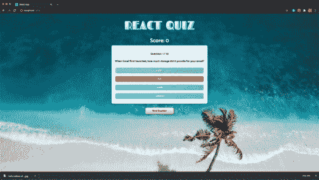

# 如何使用 React 和 TypeScript 构建测验应用程序

> 原文：<https://www.freecodecamp.org/news/how-to-build-a-quiz-app-using-react-and-typescript/>

了解如何使用 React 和 TypeScript 创建测验应用程序。我们在 freeCodeCamp.org YouTube 频道上发布了 Thomas Weibenfalk 的免费课程。

构建项目是一种很好的学习方式。在本课程中，您将学习如何创建交互式测验应用程序项目。托马斯从头到尾清楚地演示了所有步骤，因此您可以在自己的计算机上轻松地跟随。

首先，您将学习使用 TypeScript 通过 create-react-app 引导应用程序。然后，您将学习用 React 和 TypeScript 构建项目，包括样式化组件。测验问题将来自一个琐事 API。您将学习如何将 API 与 React 一起使用。

使用 Typescript 可以帮助确保您的变量和属性是您想要的，因为它在编译时(而不是运行时)评估您的代码。随着您的程序变得越来越大，这变得尤其重要。

Short demo of the app. [Try it here](https://tender-mcnulty-a4a646.netlify.app/).

在 freeCodeCamp.org YouTube 频道观看课程(1.5 小时观看)。