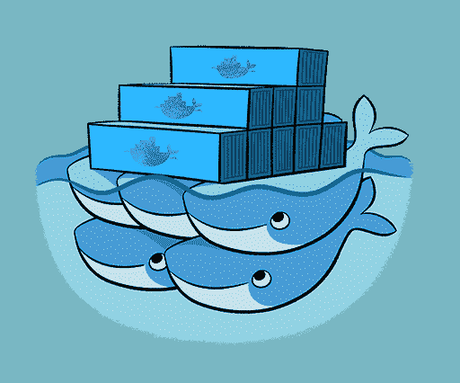
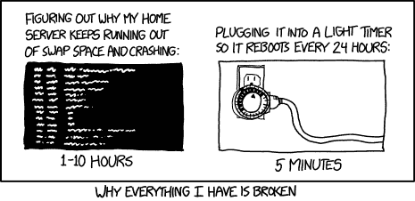
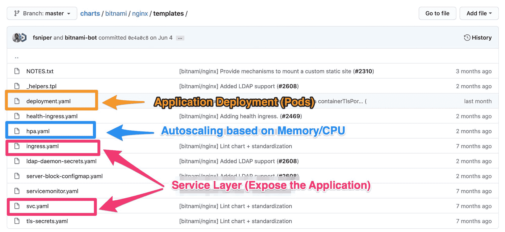

# Kubernetes 的 Helm 包管理器简介

> 原文：<https://www.freecodecamp.org/news/an-introduction-to-the-helm-package-manager-for-kubernetes/>

在我们深入到 [Helm package manager](https://helm.sh/) 之前，我将解释一些在任何地方部署任何应用程序的关键概念。我也给你简单介绍一下 [Kubernetes 术语](https://kubernetes.io/)。

## What is Kubernetes?

> Kubernetes (K8s) 是一个开源系统，用于自动化部署、扩展和管理容器化的应用
> [kubernetes.io](https://kubernetes.io/#kubernetes-k8s-docs-concepts-overview-what-is-kubernetes-is-an-open-source-system-for-automating-deployment-scaling-and-management-of-containerized-applications)

现在你可能会问自己，“这是什么意思？”

Kubernetes 本质上是一套非常好的 API，用于部署、管理和扩展应用程序。

应用程序用 Docker 打包，然后围绕应用程序部署的逻辑用 Helm 模板表示。模板本身就是使用 Kubernetes API 运行的指令。

已经创建了大量的 Helm 包来满足您的应用程序部署需求！

我喜欢把 Kubernetes + Helm 看作是我的应用程序开发需求的一站式商店。

## 有趣的事实时间！

包括 Docker 在内的整个集装箱生态系统都有一个非常好玩的航海主题。Docker 有鲸鱼，Kubernetes 有(鲸鱼的)豆荚，它的标志看起来像船的操舵部分，Helm 是船的舵。

他们不可爱吗？



[https://hub.docker.com/_/swarm](https://hub.docker.com/_/swarm)

## 在 Kubernetes 上部署应用程序

首先，无论你在哪里部署一个应用程序，总会有一些东西在任何地方保持不变*，*，我指的是任何地方的*！*；-)无论您是部署到笔记本电脑、远程服务器、AWS EC2 实例、高性能计算系统还是 Kubernetes，基本概念都不会改变。

我认为几乎所有的东西，尤其是技术概念，都是一系列的层次。一旦你理解了这些基础层是什么，你就可以开始烹饪了。

### 应用层

这些是:

| 一般 | 库伯内特斯 |
| --- | --- |
| 数据层 | PVC 或永久卷声明 |
| 应用层 | 分离舱 |
| 服务 | 交换虚拟电路 |

让我们一个一个来。

**数据层/永久卷声明(PVCs)**

这很好也很直接。当您需要持久化数据时，您可以将它持久化到文件系统中。这可以是本地存储或某种网络文件系统(NFS)。如果您使用的是数据库，数据库最终也会保存到文件系统中。

**应用层/pod**

应用层是我们通常在部署中想到的。它是我们`apt-get install`、`npm run`或`docker run`的部分。应用程序可以是 NGINX web 服务器、Python 或 Node.js 应用程序，或者 Spark 应用程序等等。

应用程序或者是 Kubernetes **部署**或者是**有状态集**，这取决于它们是否持久存储数据(或者有状态)。

MySQL 数据库就是一个有状态应用程序的例子。它需要跟踪自己的信息。

NGINX 服务器将是 Kubernetes 部署，因为它不需要跟踪任何关于自己的信息——它是无状态的。

**服务层/服务提供商**

服务层是我们向外界公开我们的*应用程序*的地方。这通常是通过说“嘿，我有一个应用程序在这个端口上运行”来完成的。您可能已经直接运行了这些，或者在 NGINX 或 Apache 中执行了类似代理传递的操作。

### **现场可靠性层**

站点可靠性是指我们有能力自信地说我们的应用程序已经启动并运行，并且*可能*会继续启动并运行！

实际上，我们需要一个 API 来完成这项工作。？

*[XKCD](https://xkcd.com/1495/) -硬重启*



| 一般 | 库伯内特斯 |
| --- | --- |
| 监视 | 度量-服务器 |
| 扩展(或负载平衡) | 水平 Pod 自动缩放器(HPA) |
| 服务规则 | 容器规格 |

**监控层/度量服务器**

监控层回答“我们的 app 做得怎么样”这个问题？理想情况下，它会回答诸如“那台机器上还剩下多少 CPU？”以及“我们的内存用完了吗”？

**缩放层/ HPA**

你有过这样的经历吗？一个应用程序一直工作得很好，直到太多人同时开始使用它？您可以通过放大或缩小应用程序的实例来解决这个问题。

对于 web 应用程序，您也会经常看到负载平衡这个术语。这一功能内置于许多进程管理器和 https 服务器中，如 [PM2](https://pm2.keymetrics.io/) 和 [Gunicorn](https://gunicorn.org/) 。

在 Kubernetes 中，您可以通过一个水平 Pod 自动缩放器(HPA)来实现这一点，您可以给出如何放大或缩小的具体规则。

**服务规则层**

您是否曾经想自动化您的应用程序应该何时/如何重启？也许你想让它重启 3 次然后放弃。或者你想让它重启，但不是马上重启。

给它一些时间！您可能还需要一些客观的方法来测试您的应用程序是否正常运行。

## 在 Kubernetes 上部署应用程序

Kubernetes 应用程序可以通过 CLI 部署，也可以通过编写描述各种 PVC、Pods(无论是部署还是有状态集)和服务(SVC)层的 YAML 模板来部署。

## Helm 包管理器

> Helm 是寻找、分享和使用为 Kubernetes 构建的软件的最佳方式。https://helm.sh/
> T3

Helm package manager 允许我们将复杂的 Kubernetes 部署连接到一个包中，这个包可以用一个命令安装。

Helm 在 Kubernetes YAML 定义的基础上使用了一种模板语言，让我们的部署更加灵活。

也许 Helm 最重要的一点是它已经被社区广泛接受。这意味着有大量的资源用于使用头盔，开始，也有大量的预配置头盔图表！

对我来说，完全从零开始创建一个头盔包是非常罕见的。我几乎总能从一张或多张已有的舵图中找到一个好的起点。

## 在魔方上部署 nginx

首先，让我们讨论一个没有 Helm 的基本 NGINX 部署。

如你所见，有很多东西需要跟踪，我们可能不会手工输入。这就是 Helm 包管理器的用武之地，但是最好先看看发生了什么！；-)

```
# Source: nginx/templates/deployment.yaml
apiVersion: apps/v1
kind: Deployment
metadata:
  name: nginx
  labels:
    app.kubernetes.io/name: nginx
    helm.sh/chart: nginx-6.0.1
    app.kubernetes.io/instance: nginx
    app.kubernetes.io/managed-by: Helm
spec:
  selector:
    matchLabels:
      app.kubernetes.io/name: nginx
      app.kubernetes.io/instance: nginx
  replicas: 1
  template:
    metadata:
      labels:
        app.kubernetes.io/name: nginx
        helm.sh/chart: nginx-6.0.1
        app.kubernetes.io/instance: nginx
        app.kubernetes.io/managed-by: Helm
    spec:      
      containers:
        - name: nginx
          image: docker.io/bitnami/nginx:1.19.0-debian-10-r2
          imagePullPolicy: "IfNotPresent"
          ports:
            - name: http
              containerPort: 8080

          livenessProbe:
            failureThreshold: 6
            initialDelaySeconds: 30
            tcpSocket:
              port: http
            timeoutSeconds: 5
          readinessProbe:
            initialDelaySeconds: 5
            periodSeconds: 5
            tcpSocket:
              port: http
            timeoutSeconds: 3
```

Kubernetes Deployment Pod definition for NGINX

现在让我们来分解 Kubernetes 部署定义的不同部分。

**元数据**

我想简单地谈一下`labels`。只是简单地说一下，因为您很可能对默认设置没有问题，不需要去碰它们。

Kubernetes 的目标之一是它应该抽象出实际的物理服务器。你不应该*通常*必须关心你的应用是在`node1`还是`node2`上运行。当然，在某些时候你会在意，然后你会开始进入标签。

在那之前，不要担心他们，只要坚持使用默认值。

**集装箱**

这是应用程序中与您部署应用程序最相关的部分。您需要定义您的容器。

一个部署单元可以有多个容器。那个容器至少有一个`name`、一个`repo`和一个`tag`:

```
 containers:
        - name: nginx
          #image:  "repo:tag"
          image: docker.io/bitnami/nginx:1.19.0-debian-10-r2
```

Container definition to run our app

一旦有了基础，您就需要定义服务将获取的端口。看到关注点的分离了吗？：

```
 ports:
            - name: http
              containerPort: 8080
```

App ports to later be exposed as services

**App 规则**

然后，在某些时候，我们想知道我们的应用程序是否在运行。我们甚至可以通过各种挂钩来确定它在生命周期中的确切位置:

```
 livenessProbe:
            failureThreshold: 6
            initialDelaySeconds: 30
            tcpSocket:
              # This corresponds to the ports[0].name
              port: http
            timeoutSeconds: 5
          readinessProbe:
            initialDelaySeconds: 5
            periodSeconds: 5
            # This corresponds to the ports[0].name
            tcpSocket:
              port: http
            timeoutSeconds: 3
```

Service Rules

**姓名**

这是一个更一般的概念，但我想指出的是，在 Kubernetes 生态系统中，给事物命名是非常重要的。注意，我们给了我们的`container`和`port`一个`name`。稍后当我们需要引用它们时，我们使用那个`name`。

## 使用舵图在 Kubernetes 上部署 NGINX

## 

Helm 软件包管理器创建了一系列可以通过 Helm CLI 修改的模板。这些模板中的每一个都对应于我们之前讨论过的一种 Kubernetes 类型。

这里有一个 [bitnami/nginx](https://github.com/bitnami/charts/blob/master/bitnami/nginx/templates/deployment.yaml) 舵图的例子:



Bitnami/NGINX Helm Chart Templates

这是带有 Helm 模板语言的同一个块。为了简洁起见，我省略了模板的一些部分。如果你想了解整个事情，你可以在 GitHub repo 中查看。

(这是为了演示的目的，并不是一个完整的功能舵图。请不要用这个。取而代之的是实际的舵图。)

```
# Source: nginx/templates/deployment.yaml
apiVersion: apps/v1
kind: Deployment
metadata:
  name: {{ template "nginx.fullname" . }}
  labels: {{- include "nginx.labels" . | nindent 4 }}
spec:
  selector:
    matchLabels: {{- include "nginx.matchLabels" . | nindent 6 }}
  replicas: {{ .Values.replicaCount }}
  template:
    metadata:
      labels: {{- include "nginx.labels" . | nindent 8 }}
      # Omitted the annotation labels!
    spec:
      containers:
        - name: nginx
          image: {{ template "nginx.image" . }}
          imagePullPolicy: {{ .Values.image.pullPolicy | quote }}
          ports:
            - name: http
              containerPort: {{ .Values.containerPort }}
            {{ if .Values.containerTlsPort }}
            - name: https
              containerPort: {{ .Values.containerTlsPort }}
            {{ end }}
          {{- if .Values.livenessProbe }}
          livenessProbe: {{- toYaml .Values.livenessProbe | nindent 12 }}
          {{- end }}
          {{- if .Values.readinessProbe }}
          readinessProbe: {{- toYaml .Values.readinessProbe | nindent 12 }}
          {{- end }}
          {{- if .Values.resources }}
          resources: {{- toYaml .Values.resources | nindent 12 }}
          {{- end }} 
```

Helm deployment template from the bitnami/nginx chart

### 舵模板值从哪里来？

这就是我真正喜欢赫尔姆的地方。模板中公开的值来自两个地方。

**模板化功能**

它们来自模板本身，如下所示。

```
{{ template "nginx.fullname" . }}
```

我们可以发现这是在我们的`templates/_helpers.tpl`中定义的，这是一种获得更复杂的函数的方法，我们只需要一个`yaml`文件就可以获得这些函数。

```
# templates/_helpers.tpl
{{/*
Create a default fully qualified app name.
We truncate at 63 chars because some Kubernetes name fields are limited to this (by the DNS naming spec).
*/}}
# Here is the nginx.fullname
{{- define "nginx.fullname" -}}
{{- if .Values.fullnameOverride -}}
{{- .Values.fullnameOverride | trunc 63 | trimSuffix "-" -}}
{{- else -}}
{{- $name := default .Chart.Name .Values.nameOverride -}}
{{- if contains $name .Release.Name -}}
{{- .Release.Name | trunc 63 | trimSuffix "-" -}}
{{- else -}}
{{- printf "%s-%s" .Release.Name $name | trunc 63 | trimSuffix "-" -}}
{{- end -}}
{{- end -}} 
```

Templated functions in Helm Charts

**Values . YAML 中暴露的值**

这实际上是一个非常好的特性，也是 Helm 如此强大和可配置的原因。

每个舵图表都有一个`values.yaml`。你可以在`values.yaml`中放入任何你想要的东西，然后在你的舵图中使用它，它通过 CLI 暴露出来！

```
## Bitnami NGINX image version
## ref: https://hub.docker.com/r/bitnami/nginx/tags/
##
image:
  registry: docker.io
  repository: bitnami/nginx
  tag: 1.19.1-debian-10-r0
  ## Specify a imagePullPolicy
  ## Defaults to 'Always' if image tag is 'latest', else set to 'IfNotPresent'
  ## ref: http://kubernetes.io/docs/user-guide/images/#pre-pulling-images
  ##
  pullPolicy: IfNotPresent
```

Exposed Helm Chart values in values.yaml

然后，我们在模板中将它称为:

```
# templates/deployment.yaml 

# ...
      containers:
        - name: nginx
          image: {{ template "nginx.image" . }}
          imagePullPolicy: {{ .Values.image.pullPolicy | quote }}
```

Some Helm template magic!

也可以通过 Helm CLI 修改`values.yaml`中的所有内容:

```
helm upgrade --install nginx bitnami/nginx \
	--set image.tag="my-new-tag"
```

Cosmic powers over your helm chart with the Helm CLI and the values.yaml

然后，它会将`containers[0].image`呈现为`image: docker.io/bitnami/nginx:my-new-tag`

## 包裹

就是这样！我希望你对 Kubernetes 和它的包管理器 Helm 有所了解。希望它不像以前那么可怕。