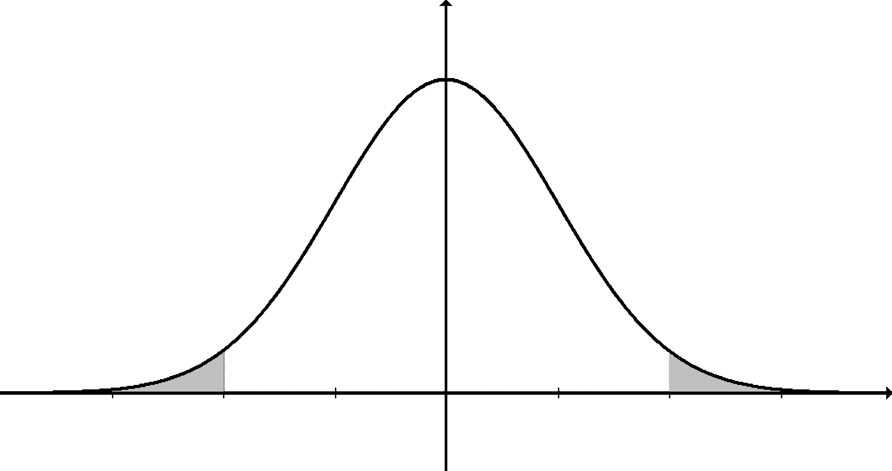
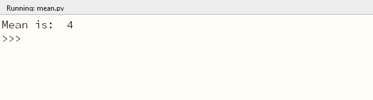

# 如何计算列表的平均值——详细解释了统计数据和 Python 的均值函数

> 原文：<https://www.freecodecamp.org/news/how-to-calculate-the-average-of-a-list-statistics-and-pythons-mean-function-explained-in-detail/>

数学和编程是相辅相成的。如果你是一名程序员，在某些时候你将不得不使用数学。

数据科学、机器学习、人工智能和加密货币都基于复杂的底层数学原理。

但是，使用数学函数不一定要复杂！Python 抽象了一切，所以一旦理解了概念，就不需要理解实现的全部细节。

## 数学不一定要恐怖

你会遇到很多数学函数。如果您正在处理数据或分析，了解一些数学原理和函数很重要。

您必须了解的一个函数是`mean`函数。

不要被这个名字吓跑 Python 中的`mean`函数没有任何意思(双关语)。

这篇文章是独立的，但是我希望你有一些使用 Python 的经验，并且你知道什么是 Python 列表。如果没有，请在继续之前查看这篇文章。

完成后，请回来和我一起深入研究`mean`函数。

## **统计数据**

所以你想了解一下`mean`函数。太好了！但是在我们研究这个函数之前，重要的是先看看它的起源学科:统计学。



Statistics has tools like this

在上图中，我们看到了一个图表。图表是显示一个变量与另一个变量之间关系的图示。

图表很有用，因为它允许我们组织数据，以便我们可以快速看到数据之间的趋势和关系。图表只是我们用来可视化和分析数据的一种工具。

统计学是数学的一个分支，它允许我们有一个系统的方法来分类、分析和解释数据。这很重要，因为有了统计，我们就有了一系列现成的工具来做这些事情。

想象一下，如果每次你需要切一块木头的时候，你都需要重新发明一把锯子。我们会看到许多人用不同的名字叫锯子，即使他们做同样的事情。为了避免这个问题，我们给锯子起了一个大家都可以引用的名字。

统计学也是如此——我们有大家都熟悉的工具。其中一个工具就是均值。

## 众数、中位数和平均值

虽然均值完全能够独立存在，但它通常是作为三重奏的一部分来教授的，三重奏包括众数、中位数和均值。

让我们看一组数字，这样你就会明白这里发生了什么。假设你有下面的数字:

## 1, 2, 3, 3, 4, 6, 9

假设我们想表达哪个数字出现的次数最多。应该是 3，我们给这个属性起的名字是 mode。众数是我们正在检查的一组数字中最频繁出现的数字。

有序集合中间的数称为中位数。要找到一组数字的中间值，从最小到最大排列这些数字，然后查看中间的数字。上面的这组数字已经从最小到最大排列了，所以中位数也是 3。

最后，平均值是指集合平均值的另一种方式。要计算平均值，只需将所有数字相加，然后除以集合中元素的总数。在上述数字的情况下，如果我们把它们加在一起，我们得到 28。集合中的项目总数是 7，所以我们的平均值是 4。

## 我们为什么需要平均值？

所以在这一点上，你可能想知道为什么我们需要找到一个数的平均值。

事情是这样的，甚至统计学本身也被细分成几个组。正如你有用于处理木材的工具和其他用于处理金属的工具一样，统计学中的一些工具被分成几类，因为它们用于类似的目的。

统计学中这样的一组叫做汇总统计。统计的用途之一是描述数据，汇总统计是用于该目的的工具的集合。这类工具中的一项是均值。

平均值很重要，因为它有助于我们分析所谓的分布。在统计学中，分布是一种我们用来观察我们想要了解的变量的方法。使用一个分布，我们将看看这个变量的值和它出现的频率。

如果我们收集数据，我们看到的常见分布类型是正态分布，它采用钟形曲线的形式:


The normal distribution

也就是说，变量有一个共同的趋向值，也有一个起点和一个终点。

均值的作用是，它允许我们采用这样的分布，并查看变量的中心趋势，即变量的值趋于聚集的点。

因此，我们可以说平均值描述了分布的中心趋势。

## 用 Python 计算平均值

如果我们有一个小的数字数据集，我们可以手动计算平均值。然而，当我们在一个数据集中有成百上千的值时，手工计算它就变得不可能了。

因为 Python 是一种“包含电池”的语言，所以我们可以使用 Python 中统计模块的`mean`函数。

让我们使用`mean`函数来计算我们之前在文章中得到的数字数据集的平均值:

```
 # 1\. import the statistics module
import statistics

# 2\. list containing our numerical data set
numerical_data_set = [1, 2, 3, 3, 4, 6, 9]

# 3\. calculate the mean
calc_mean = statistics.mean(numerical_data_set)

# 4\. print our calculated mean
print("Mean is: ", calc_mean) 
```

我们的代码由 4 步序列组成，可用于计算平均值:

1.  我们导入包含均值函数的统计模块
2.  我们创建一个 Python 列表，其中包含我们想要计算平均值的数值数据集
3.  我们计算平均值并将结果存储在变量`calc_mean`中
4.  我们输出计算出平均值，以便获得直观的反馈

当我们运行代码时，我们将得到以下输出:



Our result

该程序输出的值与我们手动计算的值相同。当我们处理大型数据集时，这个函数将能够处理我们可以处理的任何东西。

## 包扎

在这篇文章中，我们看了 Python 中的`mean`函数。我们从整体上讨论统计数据开始，然后深入探讨平均值。

现在您已经对统计和 Python 中的`mean`函数有了很好的理解，您可以在自己的程序中使用它。

如果您喜欢这篇文章，那么您可能也对学习数据结构和算法感兴趣。如果你想要一个简单，清晰，一步一步的学习数据结构和算法的指南，而不需要写一行代码，那么你可以看看《无代码数据结构和算法》这本书。

在这里阅读这本书:

[Codeless Data Structures and Algorithms - Learn DSA Without Writing a Single Line of Code | Armstrong Subero | ApressThis book brings you a new perspective on algorithms and data structures, completely code free. Learn about data structure algorithms (DSAs) without ever having to open your code editor, use a compiler, or look at an integrated development environment (IDE)....Armstrong SuberoSearch Menu Cart V Your cart is currently empty. Login AccountBookshelf Login Apress Access](https://www.apress.com/gp/book/9781484257241)