# 如何使用 Next.js 创建动态 Rick 和 Morty Wiki Web 应用程序

> 原文：<https://www.freecodecamp.org/news/how-to-create-a-dynamic-rick-and-morty-wiki-web-app-with-next-js/>

使用动态 API 和服务器端渲染来构建 web 应用程序是一种在内容和速度上给人们带来良好体验的方式。我们如何使用 Next.js 轻松构建这些应用程序？

*   我们要建造什么？
*   [next . js 是什么？](#what-is-next-js)
*   [步骤 0:设置新的 Next.js 应用程序](#step-0-setting-up-a-new-next-js-app)
*   [第一步:用 Next.js 中的 API 获取 Rick 和 Morty 角色](#step-1-fetching-rick-and-morty-characters-with-an-api-in-next-js)
*   [第二步:在页面上显示瑞克和莫蒂的角色](#step-2-displaying-rick-and-morty-characters-on-the-page)
*   [第三步:加载更多瑞克和莫蒂角色](#step-3-loading-more-rick-and-morty-characters)
*   [第四步:增加搜索瑞克和莫蒂角色的功能](#step-4-adding-the-ability-to-search-for-rick-and-morty-characters)
*   [第五步:使用动态路线链接到瑞克和莫蒂的角色页面](#step-5-using-dynamic-routes-to-link-to-rick-and-morty-character-pages)
*   额外步骤:将你的 Rick 和 Morty wiki 部署到 Vercel！

[https://www.youtube.com/embed/iW39Merz0zE?feature=oembed](https://www.youtube.com/embed/iW39Merz0zE?feature=oembed)

## 我们要建造什么？

我们将有一些乐趣，并建立一个网络应用程序，作为里克和莫蒂字符的基本维基。


Rick and Morty Wiki Demo

我们的应用程序将由几个部分组成:

*   头版上的人物名单
*   一个可以加载更多字符的按钮，因为 API 是分页的
*   用于查找字符的搜索框
*   包含基本细节的字符页面

我们将学习一些概念，如:

*   如何使用 [Next.js](https://nextjs.org/) 启动 web 应用程序
*   如何从 API 中获取和使用数据
*   如何[从 API 预渲染数据](https://nextjs.org/docs/basic-features/data-fetching#getserversideprops-server-side-rendering)
*   如何设置[动态路由](https://nextjs.org/docs/routing/dynamic-routes)

## Next.js 是什么？

[Next.js](https://nextjs.org/) 是来自 [Vercel](https://vercel.com/) 的 React 框架。它让你可以轻松地构建轻量级的动态 web 应用程序，并拥有你所期望的开箱即用的大量现代功能。

支持 Next.js 的公司 Vercel 是一项服务，它允许您自动化持续开发管道，以轻松地将 web 应用部署到世界各地。我们还将使用 Vercel 的命令行工具来选择性地部署我们的新 wiki 演示。

## 步骤 0:设置新的 Next.js 应用程序

首先，让我们启动 Next.js 项目。我们将使用 npm 或 yarn 开始:

```
yarn create next-app
# or
npx create-next-app 
```

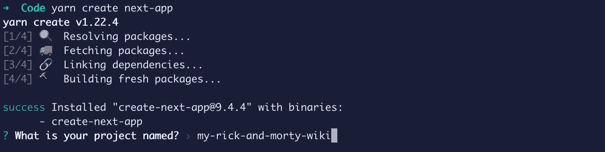

Creating a new Next.js app

一旦你运行这个命令，它会问你几个问题。我将把我的项目命名为`my-rick-and-morty-wiki`，但是你可以随意命名。

然后它会询问您选择哪个模板—继续并选择默认模板。

最后，它将安装所有的依赖项。

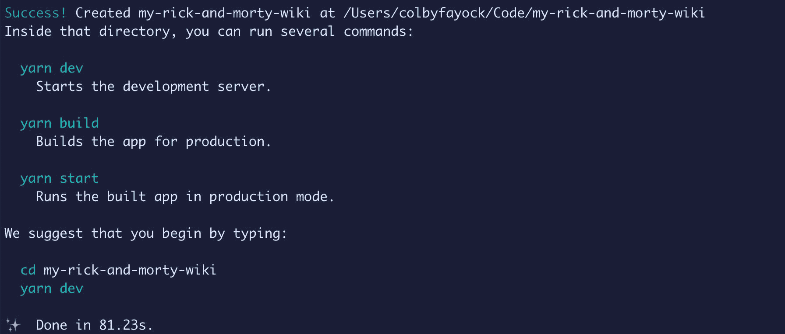

Successfully created a new Next.js app

完成后，您可以导航到该新目录并运行:

```
yarn dev
# or
npm run dev 
```


Starting Next.js development server

您现在应该有一个运行在 [http://localhost:3000](http://localhost:3000) 的本地服务器了！

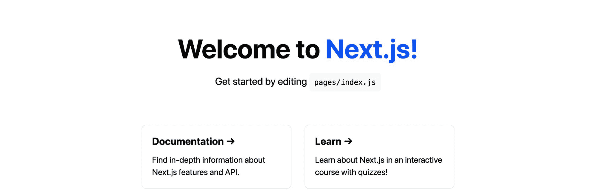

Default Next.js template

## 步骤 1:用 Next.js 中的 API 获取 Rick 和 Morty 角色

现在我们已经设置好了我们的应用程序，我们需要实际构建 wiki 的第一件事是一个字符列表。

为此，我们将从`pages/index.js`中的主页开始。

Next.js 自动为我们搭建了这个页面。这是人们在我们的网站上点击的第一个页面，在默认模板中有一些基本的功能，如标题、简单的网格和一些样式。

目前，该页面没有请求任何数据。为了获得我们的字符，我们将直接进入请求服务器端。

为此，Next.js 允许我们在页面旁边导出一个 async `getServerSideProps`函数，它将使用我们获取的任何数据注入页面。

让我们从在我们的`Home`函数组件上添加以下代码片段开始:

```
const defaultEndpoint = `https://rickandmortyapi.com/api/character/`;

export async function getServerSideProps() {
  const res = await fetch(defaultEndpoint)
  const data = await res.json();
  return {
    props: {
      data
    }
  }
} 
```

我们正在做的是:

*   我们正在设置一个名为`defaultEndpoint`的变量，它简单地定义了我们的默认 API 端点
*   我们正在定义用于获取数据的`getServerSideProps`函数
*   在这个函数中，我们首先使用`fetch` API 向我们的端点发出请求
*   根据它的响应，我们运行`json`方法，这样我们就可以获取 JSON 格式的输出
*   最后，我们返回一个对象，在这个对象中，我们将`data`作为属性`props`中的道具

既然我们提出了这个请求，我们需要让它可用。

我们的`data`是作为道具提供的，所以让我们在我们的`Home`组件函数中创建一个参数来获取它:

```
export default function Home({ data }) { 
```

为了测试这一点，我们可以使用`console.log`来查看结果:

```
export default function Home({ data }) {
  console.log('data', data); 
```

一旦我们保存并重新加载页面，我们现在可以看到我们的结果！

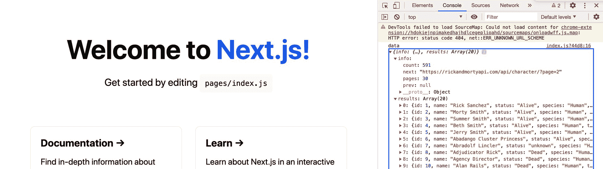

Logging out Rick and Morty character data in Next.js app

[跟随提交！](https://github.com/colbyfayock/my-rick-and-morty-wiki/commit/3850e08e47654053d33f8440557e882e3579b335)

## 步骤 2:在页面上显示 Rick 和 Morty 角色

现在我们已经有了角色数据，让我们在页面上显示它。

首先，我要做一些调整。我要更新了:

*   `<h1>`标题为“Wubba Lubba Dub！”
*   `<p>`对“瑞克和莫蒂性格维基”的描述

我还将把`<div clasName=“grid”`的内容更新为:

```
<ul className="grid">
  <li className="card">
    <a href="https://nextjs.org/docs">
      <h3>My Character</h3>
    </a>
  </li>
</ul> 
```

我在这里做的是:

*   我把`<div>`列成了一个列表，这样更便于访问
*   我把`<ul>`的`<li>`变成了`card`
*   只是暂时将`<h3>`改为“我的角色”

为了确保我们的新`<ul>`不会用它的默认样式弄乱布局，让我们也在`.grid` CSS 规则的底部添加以下内容:

```
list-style: none;
margin-left: 0;
padding-left: 0; 
```

现在，如果我们看页面，我们应该看到我们的基本变化。


Updated title in Rick and Morty Wiki

接下来，让我们的网格加载我们的角色。

在我们的`Home`组件函数的顶部，让我们添加:

```
const { results = [] } = data; 
```

这将从我们的数据对象中破坏我们的结果数组。

接下来，让我们更新网格代码:

```
<ul className="grid">
  {results.map(result => {
    const { id, name } = result;
    return (
      <li key={id} className="card">
        <a href="#">
          <h3>{ name }</h3>
        </a>
      </li>
    )
  })}
</ul> 
```

我们正在做的是:

*   我们使用`map`方法为每个结果(或字符)创建一个新的列表元素
*   在其中，我们从每个字符结果中获取`id`和`name`
*   我们使用 ID 作为列表元素的`key`,以使 React 更好
*   我们正在用`name`更新我们的标题

一旦您保存并重新加载页面，我们现在应该可以从 API 中看到一个新的角色列表！

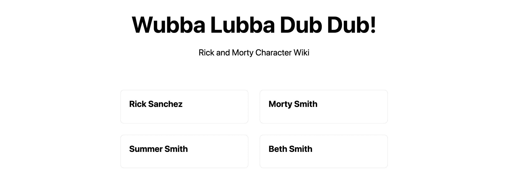

Dynamic list of Rick and Morty character names

我们还可以为每个角色添加一个图像。

首先，在我们的网格内部，让我们更新我们的 destructure 语句来获取图像 URL:

```
const { id, name, image } = result; 
```

接下来，让我们在标题上方添加图像:

```
 
```

现在我们每个角色也展示了他们的照片！

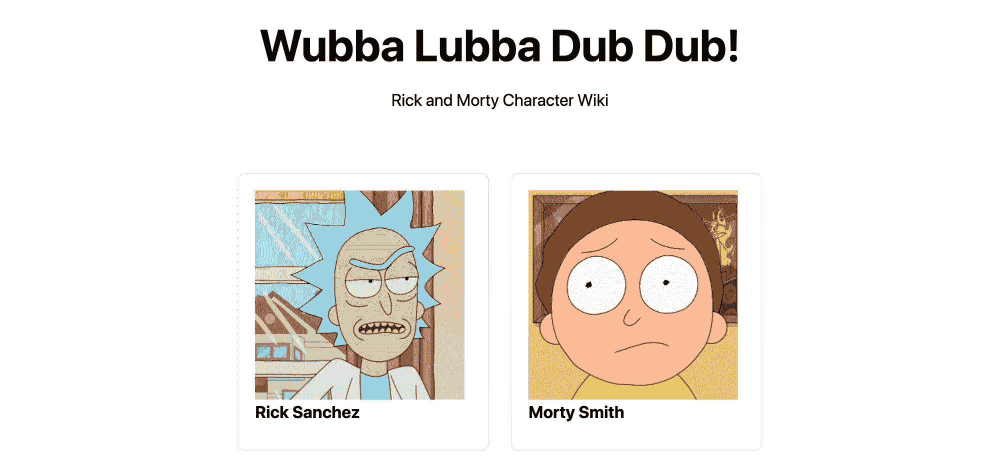

Adding character images on Rick and Morty Wiki

[跟随提交！](https://github.com/colbyfayock/my-rick-and-morty-wiki/commit/fd959ac66a51900d2fcff9130925d8979ab8db32)

## 步骤 3:加载更多的瑞克和莫蒂角色

如果你注意到了，当我们加载页面时，我们只得到一定数量的结果。默认情况下，API 不会返回整个字符列表，这是有意义的，因为它真的很长！

相反，它使用分页并为我们提供“下一个”端点，或者下一页结果，这将允许我们加载更多的结果。

首先，我们将使用 React 的`useState`钩子在 state 中存储我们的结果。然后，我们将能够用更多的结果更新该状态。

首先，让我们从 React 导入`useState`:

```
import { useState } from 'react'; 
```

接下来，让我们通过首先重命名原始的`results`变量并设置`useState`实例来创建我们的状态:

```
const { results: defaultResults = [] } = data;
const [results, updateResults] = useState(defaultResults); 
```

如果保存并重新加载页面，您应该不会注意到任何不同。

接下来，我们希望能够在我们的应用程序中了解我们发出请求的当前端点是什么，下一个端点是什么，上一个端点是什么，以及我们如何更新所有这些。

为此，我们要创建更多的州。首先，我们想用我们的`data`更新我们的析构语句，以获得`info`值:

```
const { info, results: defaultResults = [] } = data; 
```

接下来，让我们用它来设置一些状态:

```
const [page, updatePage] = useState({
  ...info,
  current: defaultEndpoint
}); 
```

在这里，我们是:

*   创建一个新的`page`状态，我们可以用它来获得我们的`prev`和`next`值
*   我们还创建了一个名为`current`的新值，我们将从使用服务器上的请求`defaultEndpoint`开始

这里的想法是，当我们想要加载更多的结果时，我们将设置代码来观察`current`的值，并用`next`更新该值，因此当它改变时，我们将发出新的请求。

为此，让我们添加一个`useEffect`钩子来发出请求:

```
const { current } = page;

useEffect(() => {
  if ( current === defaultEndpoint ) return;

  async function request() {
    const res = await fetch(current)
    const nextData = await res.json();

    updatePage({
      current,
      ...nextData.info
    });

    if ( !nextData.info?.prev ) {
      updateResults(nextData.results);
      return;
    }

    updateResults(prev => {
      return [
        ...prev,
        ...nextData.results
      ]
    });
  }

  request();
}, [current]); 
```

事情是这样的:

*   首先，我们从“page”中析构了`current`值
*   我们正在创建一个使用`current`作为依赖项的`useEffect`钩子。如果他们重视变化，挂钩就会运行
*   如果我们的`current`值与`defaultEndpoint`值相同，我们就不运行代码，因为我们已经有了请求数据。防止额外的加载请求
*   我们创建了一个可以运行的异步函数。这允许我们在我们的`useEffect`钩子内部使用`async/await`
*   我们向`current`端点发出请求。有了那个成功的请求，我们用新的`info`像新的`prev`和`next`值来更新`page`状态
*   如果我们的请求没有先前的值，这意味着它是给定请求的第一组结果，所以我们应该完全替换我们的结果，从头开始
*   如果我们有一个先前的值，将新的结果连接到旧的结果，因为这意味着我们刚刚请求了下一页的结果

同样，如果您保存并重新加载页面，这仍然不应该做任何事情，您的页面应该在原来的位置。

最后，我们将创建一个 Load More 按钮，并使用它来更新`current`值，以便在我们需要新页面时发出新请求。

为此，让我们首先在网格下方添加一个新按钮:

```
<p>
  <button>Load More</button>
</p> 
```


Added Load More button to Rick and Morty Wiki character list

现在我们希望在单击按钮时发生一些事情，所以首先添加一个事件处理程序:

```
<button onClick={handleLoadMore}>Load More</button> 
```

然后在组件返回语句上方，让我们添加那个函数:

```
function handleLoadMore() {
  updatePage(prev => {
    return {
      ...prev,
      current: page?.next
    }
  });
} 
```

当我们点击按钮时，这个函数将使用新的`current`值更新我们的`page`状态，特别是使用`next`值，它是获取下一页结果的端点。


Loading more results in Rick and Morty Wiki

当我们保存并重新加载页面时，它就是这样做的！

[跟随提交！](https://github.com/colbyfayock/my-rick-and-morty-wiki/commit/157eda9c3a93eb79e6e063eaa60f7abe82246fc5)

## 步骤 4:增加搜索瑞克和莫蒂角色的能力

Rick 和 Morty API 提供的特性之一是过滤结果的能力——所以基本上是搜索的能力。所以让我们把它作为一个特性添加进去。

首先，我们需要一个搜索表单。让我们在描述段落下添加以下代码片段:

```
<form className="search">
  <input name="query" type="search" />
  <button>Search</button>
</form> 
```

接下来，让我们将这些样式添加到第一个`<style jsx>`块的底部:

```
.search input {
  margin-right: .5em;
}

@media (max-width: 600px) {
  .search input {
    margin-right: 0;
    margin-bottom: .5em;
  }

  .search input,
  .search button {
    width: 100%;
  }
} 
```

这将为我们的搜索输入和按钮提供一些空间，并使其移动友好。如果你愿意，可以随意添加更多的样式。

如果我们保存并刷新我们的页面，我们有一个简单的表单。

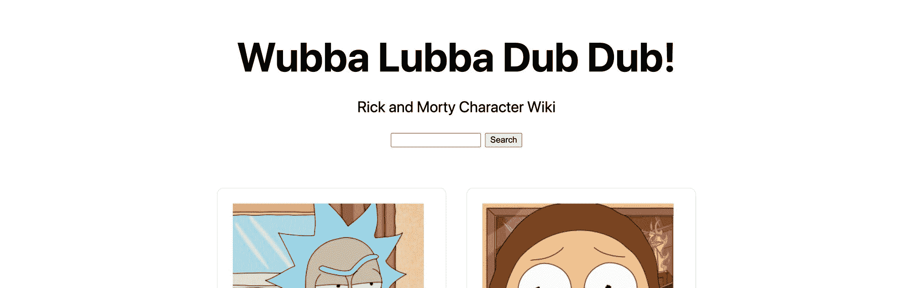

Added search form to Rick and Morty Wiki

它还不做任何事情，所以我们让它在提交表单时进行搜索。

首先，让我们给表单添加一个`onSubmit`属性:

```
<form className="search" onSubmit={handleOnSubmitSearch}> 
```

为此，让我们在 return 语句上方定义提交函数:

```
function handleOnSubmitSearch(e) {
  e.preventDefault();

  const { currentTarget = {} } = e;
  const fields = Array.from(currentTarget?.elements);
  const fieldQuery = fields.find(field => field.name === 'query');

  const value = fieldQuery.value || '';
  const endpoint = `https://rickandmortyapi.com/api/character/?name=${value}`;

  updatePage({
    current: endpoint
  });
} 
```

我们正在做的是:

*   首先，我们防止表单提交的默认行为，以防止页面重新加载
*   接下来，我们获取当前目标，这是我们的形式
*   我们通过使用 elements 属性从表单中获取字段。我们也把它变成了一个数组，所以很容易处理
*   我们在这些字段中搜索查询输入
*   我们获取输入的值
*   我们创建一个新端点，使用查询值按名称进行过滤
*   最后，我们更新页面状态中的`current`属性，以触发对该端点的新请求

保存并重新加载页面后，您现在可以尝试搜索了。你应该可以输入一个名字，比如“rick ”,点击回车或者点击搜索按钮，现在你应该可以看到宇宙中各种 Rick 的过滤结果！

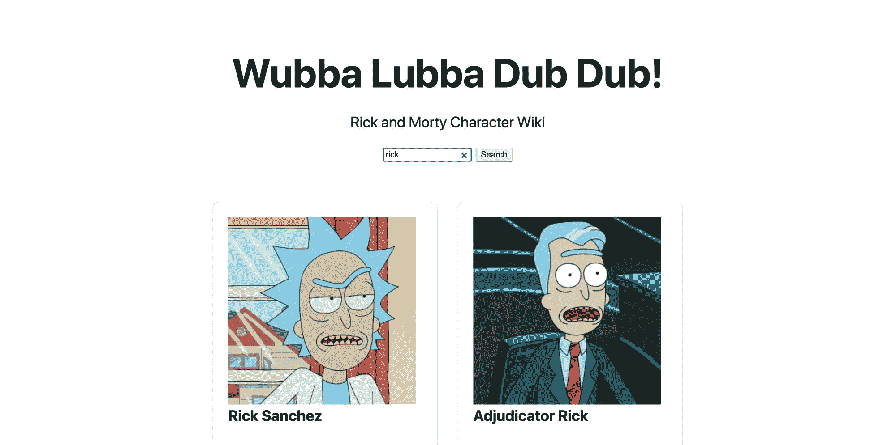

Searching for Rick on Rick and Morty Wiki

[跟随提交！](https://github.com/colbyfayock/my-rick-and-morty-wiki/commit/f365d2bc7fc3ca48c2ad693d457a6b6984ea67c3)

## 步骤 5:使用动态路由链接到瑞克和莫蒂的角色页面

现在我们已经有了所有的角色，我们希望能够点击这些角色并显示一些额外的细节。为此，我们将利用 Next.js 的动态路由。

我们需要做的第一件事是正确配置我们的目录结构，以便 Next.js 识别动态路径。为了设置动态路由，我们需要完全按照以下方式创建我们的文件夹:

```
- pages
-- character
--- [id]
-- index.js 
```

是的，这意味着你正在创建一个名为`[id]`的文件夹，这并不意味着被替换。Next.js 可以识别这种模式，并让我们使用它来创建动态路由。

为了使创建页面更容易，我们将简单地复制我们的主页，将我们的`pages/index.js`文件直接复制到我们的下一个。

所以我们现在应该在`pages/character/[id]/index.js`有了新的一页。

接下来，让我们去掉一些东西，这样我们可以有一个好的起点:

*   删除页面函数组件中`return`语句上面的所有内容
*   重命名功能组件字符
*   移除`useState`和`useEffect`导入
*   删除描述、搜索表单、网格和加载更多按钮
*   可选:移除页脚

完成后，我们页面的功能组件的顶部应该看起来像这样:

```
export default function Character({ data }) {
  return (
    <div className="container">
      <Head>
        <title>Create Next App</title>
        <link rel="icon" href="/favicon.ico" />
      </Head>

      <main>
        <h1 className="title">
          Wubba Lubba Dub Dub!
        </h1>
      </main> 
```

虽然有一些我们不需要的 CSS，但我们将把它们留在这里进行演示。稍后请随意清理一些。

如果您手动导航到/character/1，您现在应该会看到一个只有标题的简单页面:

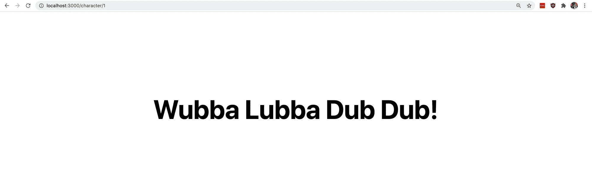

Simple character page

接下来，让我们更新正在获取的数据。我们可以重用我们的`getServerSideProps`函数中的大部分代码。

我们将为那个`getServerSideProps`函数添加一个新参数:

```
export async function getServerSideProps({ query }) { 
```

当我们的页面被渲染时，Next.js 将数据注入到我们的页面和关于环境的`getServerSideProps`函数中。在这里，我们正在析构该数据以获取包含任何动态路由属性的`query`对象，例如我们在路由中设置的`[id]`。

接下来，在`getServerSideProps`函数的顶部，让我们析构 ID:

```
const { id } = query; 
```

最后，让我们使用该 ID 来动态创建一个端点，我们将使用该端点来获取我们的角色数据:

```
const res = await fetch(`${defaultEndpoint}${id}`); 
```

这里，我们使用字符端点，并将 URL 的动态 ID 附加到 URL 的末尾。

为了测试这一点，让我们在`Character`函数的顶部添加一个`console.log`:

```
export default function Character({ data }) {
  console.log('data', data); 
```

如果我们点击保存并重新加载我们的页面，我们现在应该可以看到注销的 1 号人物的用户详细信息，他就是 Rick Sanchez！

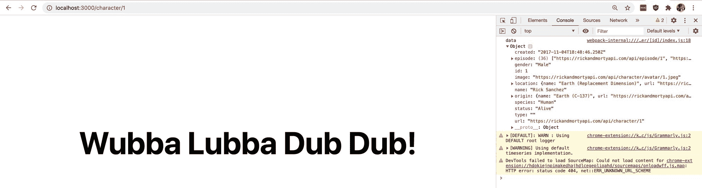

Logging out individual Rick and Morty character data

现在我们有了数据，让我们将它添加到页面中。

在字符函数的顶部，让我们添加这个析构语句:

```
const { name, image, gender, location, origin, species, status } = data; 
```

这为我们提供了一系列属性，这些属性都是从我们看到注销的数据对象中获得的。

要使用它，我们可以从将标题更新为该名称开始:

```
<title>{ name }</title> 
```

`<h1>`亦作:

```
<h1 className="title">{ name }</h1> 
```

此时，我们应该可以动态地看到 Rick 的名字。


Dynamic Rick and Morty character page title

接下来，让我们在`<h1>`下面添加这个模块来包含更多的角色细节:

```
<div className="profile">
  <div className="profile-image">
    
  </div>
  <div className="profile-details">
    <h2>Character Details</h2>
    <ul>
      <li>
        <strong>Name:</strong> { name }
      </li>
      <li>
        <strong>Status:</strong> { status }
      </li>
      <li>
        <strong>Gender:</strong> { gender }
      </li>
      <li>
        <strong>Species:</strong> { species }
      </li>
      <li>
        <strong>Location:</strong> { location?.name }
      </li>
      <li>
        <strong>Originally From:</strong> { origin?.name }
      </li>
    </ul>
  </div>
</div> 
```

这里我们使用我们的角色`image`来显示我们角色的图片和其他各种元数据来添加角色细节。

我们可以通过将这个 CSS 片段添加到我们的样式中来跟进:

```
.profile {
  display: flex;
  margin-top: 2em;
}

@media (max-width: 600px) {
  .profile {
    flex-direction: column;
  }
}

.profile-image {
  margin-right: 2em;
}

@media (max-width: 600px) {
  .profile-image {
    max-width: 100%;
    margin: 0 auto;
  }
} 
```

现在我们有了我们的人物传记！

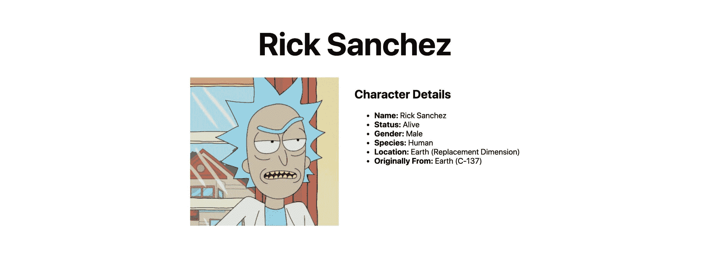

Dynamic Rick Sanchez characer page

简单回顾一下，我们有了新的动态页面。我们可以去`/character/1`或者任何 ID 看一个具体的人物。现在让我们更新我们的主页来链接到这些页面。

回到我们的主页`pages/index.js`，我们先从 Next.js 导入`Link`组件:

```
import Link from 'next/link' 
```

接下来，在我们映射结果列表的网格中，让我们使用我们的`<Link>`组件并更新我们的代码:

```
<li key={id} className="card">
  <Link href="/character/[id]" as={`/character/${id}`}>
    <a>
      
      <h3>{ name }</h3>
    </a>
  </Link>
</li> 
```

我们正在做的是:

*   首先，我们用一个`<Link>`组件包装我们的`<a>`元素
*   我们添加一个`href`和`as`属性来描述 Next.js 我们想要链接到什么页面。我们需要使用`as`属性，因为它是一个动态链接
*   我们从我们的`<a>`元素中移除了`href`,因为它现在被应用到了`<Link>`元素

如果我们保存并重新加载我们的主页，我们会注意到什么都没有改变，但当我们点击我们的任何角色时，我们现在会转到他们的个人主页！

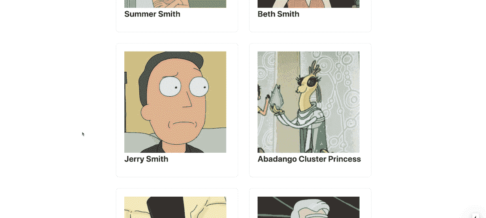

Navigating to Jerry Smith character page on Rick and Morty Wiki

最后，让我们在角色简介页面上添加一个按钮，链接回我们的主页，使它更容易导航。

首先，让我们导入`Link`组件:

```
import Link from 'next/link'; 
```

在我们的`.profile` div 下面的`<main>`标签的底部，让我们添加以下代码:

```
<p className="back">
  <Link href="/">
    <a>
      Back to All Characters
    </a>
  </Link>
</p> 
```

我们可以添加以下基本样式，使它看起来像一个链接:

```
.back a {
  color: blue;
  text-decoration: underline;
} 
```

如果我们重新加载页面，我们现在有一个链接，我们可以单击它返回到包含所有角色的主页！

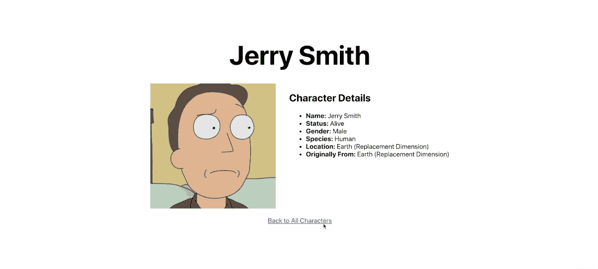

Back to All Characters link on Rick and Morty character page

[跟随提交！](https://github.com/colbyfayock/my-rick-and-morty-wiki/commit/61ec2f5b2092278dc3983c339fa4e556a5c7862c)

## 额外的一步:将你的 Rick 和 Morty wiki 部署到 Vercel！

因为我们使用 Next.js，所以 Vercel 使得部署我们的应用程序变得非常简单。

为此，我们需要[安装 Vercel CLI](https://vercel.com/download) 。我们可以通过在全球范围内将其安装为 npm 模块来实现这一点:

```
yarn global add vercel
# or 
npm i -g vercel 
```

现在，您可以在终端中运行`vercel`命令。

第一次运行时，会提示您登录。您将需要使用您的 Vercel 帐户来完成此操作。如果你还没有，你会想注册一个免费账户。

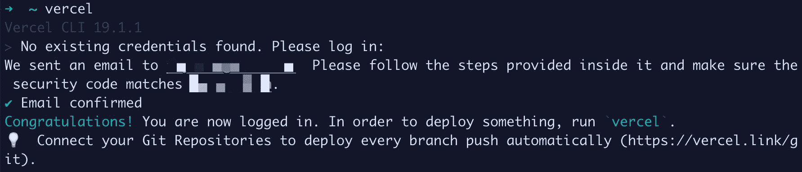

Logging into Vercel CLI

安装了 Vercel CLI 后，我们只需在我们的项目目录中运行`vercel`，填写几个问题，它就会自动部署！

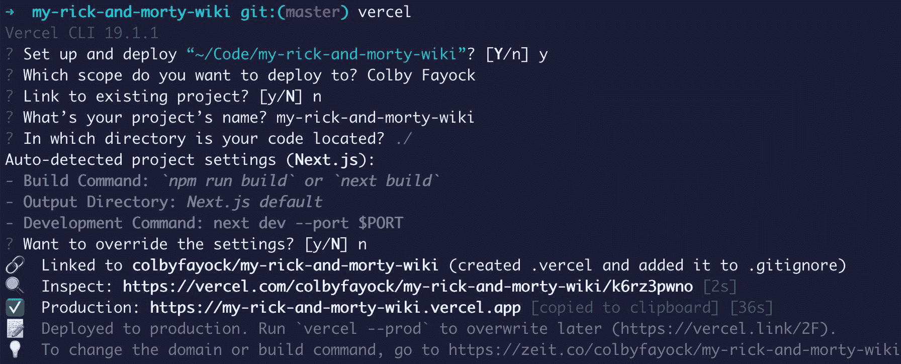

Deploying app with Vercel CLI

您可以使用几乎所有的默认值，尽管您可能需要使用一个不同于我正在使用的项目名称。

但一旦完成，我们现在已经成功地将我们的新应用程序部署到 Vercel！

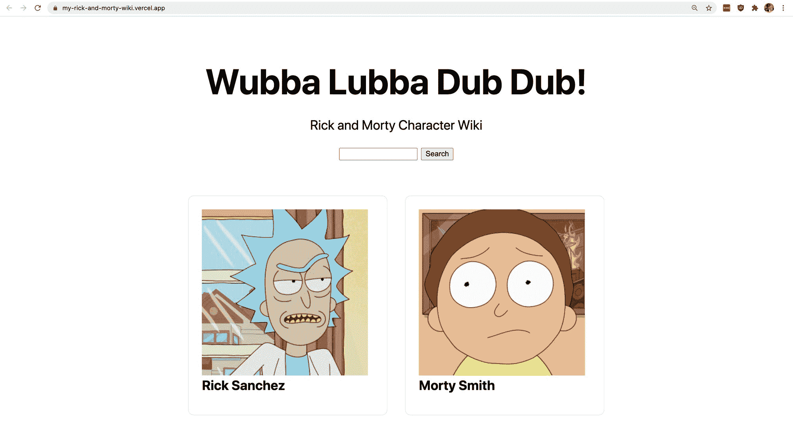

Finished Rick and Morty Wiki app

## 我们还能做什么？

### 更多动态页面

每次你向一个角色发出请求，API 都会返回你可以使用的其他端点，比如地点和情节。我们可以利用这些端点，创建新的动态页面，就像我们的动态人物简介页面一样，让人们看到关于特定地点或剧集的更多信息。

### 添加一些样式

我们坚持使用 Next.js 包含的一些基本样式，并添加了一些仅用于演示目的的基本样式。但是现在你完成了，你可以找点乐子，把它变成你自己的！

### 添加字符过滤器

除了按名称过滤， [API 还支持按状态过滤](https://rickandmortyapi.com/documentation/#filter-characters)。通过向端点 URL 添加一个`status`参数，就像我们的`name`参数一样，您可以添加一个新的过滤器，以便更容易地找到仍然活着或不活着的字符。

[](https://twitter.com/colbyfayock)

*   [？在 Twitter 上关注我](https://twitter.com/colbyfayock)
*   [？️订阅我的 Youtube](https://youtube.com/colbyfayock)
*   [✉️注册我的简讯](https://www.colbyfayock.com/newsletter/)