# Python 数据科学熊猫图书馆终极指南

> 原文：<https://www.freecodecamp.org/news/the-ultimate-guide-to-the-pandas-library-for-data-science-in-python/>

当你开始学习 Python 时，pandas(pandas)(pandas 是“面板数据”的组合)是最重要的软件包之一。

该软件包以一个非常有用的数据结构而闻名，称为 pandas DataFrame。Pandas 还允许 Python 开发人员在 Python 脚本中轻松处理表格数据(如电子表格)。

本教程将教你熊猫的基础知识，你可以用它来构建数据驱动的 Python 应用程序。

## 目录

您可以使用下面的目录跳到本熊猫教程的特定部分:

*   [熊猫简介](#introduction-to-pandas)
*   [熊猫系列](#pandas-series)
*   [熊猫数据帧](#pandas-dataframes)
*   如何处理熊猫数据中的缺失数据
*   [熊猫`groupby`法](#the-pandas--groupby--method)
*   [熊猫`groupby`有什么特点？](#what-is-the-pandas--groupby--feature-)
*   [熊猫`concat`法](#the-pandas--concat--method)
*   [熊猫`merge`法](#the-pandas--merge--method)
*   [熊猫`join`法](#the-pandas--join--method)
*   [熊猫的其他常见操作](#other-common-operations-in-pandas)
*   [Pandas 中的本地数据输入和输出(I/O)](#local-data-input-and-output--i-o--in-pandas)
*   [熊猫的远程数据输入输出(I/O)](#remote-data-input-and-output--i-o--in-pandas)
*   [最终想法&特价](#final-thoughts-special-offer)

## **熊猫简介**

Pandas 是构建在 NumPy 之上的一个广泛使用的 Python 库。本课程的其余部分将致力于学习熊猫以及它在金融领域的应用。

### 什么是熊猫？

[Pandas](https://nickmccullum.com/advanced-python/pandas) 是由 [Wes McKinney](https://wesmckinney.com/) 创建的 Python 库，Wes McKinney 在他工作的地方创建 Pandas 来帮助他处理 Python 中的数据集。

根据该图书馆的网站，pandas 是 **“一个快速、强大、灵活和易于使用的开源数据分析和操作工具，建立在 [Python](https://www.python.org/) 编程语言之上。”**

Pandas 代表“面板数据”。请注意，pandas 通常是一个全小写的单词，尽管在句首大写首字母被认为是一种最佳做法。

Pandas 是一个开源库，这意味着任何人都可以查看它的源代码，并使用 pull 请求提出建议。如果你对此感到好奇，请访问 GitHub 上的熊猫源代码库

### **熊猫的主要好处**

Pandas 设计用于处理二维数据(类似于 Excel 电子表格)。正如 NumPy 库有一个名为`array`的内置数据结构，它具有特殊的属性和方法，pandas 库有一个名为`DataFrame`的内置二维数据结构。

### 我们将了解到关于熊猫的什么

正如我们在本课程前面提到的，高级 Python 实践者将花更多的时间使用 pandas，而不是 NumPy。

在接下来的几节中，我们将介绍熊猫图书馆的以下信息:

*   熊猫系列
*   熊猫数据框
*   如何处理熊猫的缺失数据
*   如何在 Pandas 中合并数据帧
*   如何在 Pandas 中加入数据框
*   如何在 Pandas 中连接数据帧
*   熊猫的常见操作
*   熊猫的数据输入和输出
*   如何将熊猫数据框保存为 Excel 文件供外部用户使用

## **熊猫系列**

在本节中，我们将探索 [pandas 系列](https://nickmccullum.com/advanced-python/pandas-series/)，它是 Python 编程的 pandas 库的核心组件。

### **什么是熊猫系列？**

系列是 pandas Python 库中可用的一种特殊类型的数据结构。Pandas 系列类似于 NumPy 数组，只是我们可以给它们一个命名的或日期时间的索引，而不仅仅是一个数字索引。

### **处理熊猫系列所需的导入**

要使用 pandas 系列，您需要导入 NumPy 和 pandas，如下所示:

```
 import numpy as np

import pandas as pd 
```

对于本节的其余部分，我将假设在运行任何代码块之前已经执行了这两个导入。

### **如何打造熊猫系列**

有许多不同的方法来创造一个熊猫系列。我们将在本节中探讨所有这些问题。

首先，让我们创建几个起始变量——具体来说，我们将创建两个列表、一个 NumPy 数组和一个字典。

```
 labels = ['a', 'b', 'c']

my_list = [10, 20, 30]

arr = np.array([10, 20, 30])

d = {'a':10, 'b':20, 'c':30} 
```

创建熊猫系列最简单的方法是将一个普通的 Python 列表传递给`pd.Series()`方法。我们用下面的`my_list`变量来做这件事:

```
 pd.Series(my_list) 
```

如果您在 Jupyter 笔记本上运行这个，您会注意到输出与普通 Python 列表的输出有很大不同:

```
 0    10

1    20

2    30

dtype: int64 
```

上面显示的输出显然被设计成两列。第二列是来自`my_list`的数据。第一列是什么？

与 NumPy 阵列相比，使用 pandas 系列的一个主要优势是它们允许标记。您可能已经猜到，第一列是一列标签。

我们可以像这样使用`index`参数给熊猫系列添加标签:

```
 pd.Series(my_list, index=labels)

#Remember - we created the 'labels' list earlier in this section 
```

这段代码的输出如下:

```
 a    10

b    20

c    30

dtype: int64 
```

为什么你想在熊猫系列中使用标签？主要优点是它允许您使用标签而不是数字索引来引用系列中的元素。要明确的是，一旦标签被应用到熊猫系列，你可以使用*作为它的数字索引或标签。*

*这方面的一个例子如下。*

```
 *`Series = pd.Series(my_list, index=labels)

Series[0]

#Returns 10

Series['a']

#Also returns 10`* 
```

*您可能已经注意到，使用标签引用系列元素的能力类似于我们在字典中引用`key` - `value`对的`value`。由于它们在功能上的相似性，您也可以传入一个字典来创建一个熊猫系列。我们将使用我们之前创建的`d={'a': 10, 'b': 20, 'c': 30}`作为例子:*

```
 *`pd.Series(d)`* 
```

*这段代码的输出是:*

```
 *`a    10

b    20

c    30

dtype: int64`* 
```

*可能还不清楚为什么我们探索了两个如此相似的新数据结构(NumPy 数组和 pandas 系列)。在本节的下一节中，我们将探索 pandas 系列相对于 NumPy 阵列的主要优势。*

### ***Pandas 系列相对于 NumPy 阵列的主要优势***

*虽然我们当时没有遇到，但 NumPy 数组受到一个特性的高度限制:NumPy 数组的每个元素必须是相同类型的数据结构。换句话说，NumPy 数组元素必须全部是字符串，或者全部是整数，或者全部是布尔值——你明白这一点。*

*熊猫系列则不受此限制。事实上，熊猫系列的 **高度** 灵活。*

*例如，您可以将 Python 的三个内置函数传递给 pandas 系列，而不会出现错误:*

```
 *`pd.Series([sum, print, len])`* 
```

*下面是这段代码的输出:*

```
 *`0      <built-in function sum>

1    <built-in function print>

2      <built-in function len>

dtype: object`* 
```

*明确地说，上面的例子是非常不切实际的，并且不是我们在实践中会执行的。然而，它是 pandas 系列数据结构灵活性的一个很好的例子。*

## ***熊猫数据帧***

*NumPy 允许开发人员使用一维 NumPy 数组(有时称为向量)和二维 NumPy 数组(有时称为矩阵)。我们在上一节探索了 pandas 系列，它类似于一维 NumPy 数组。*

*在这一节中，我们将深入探讨 [pandas DataFrames](https://nickmccullum.com/advanced-python/pandas-dataframes/) ，它类似于二维 NumPy 数组——但是功能更多。数据帧是 pandas 库中最重要的数据结构，所以请密切关注这一部分。*

### *什么是熊猫数据框架？*

*熊猫数据帧是一个二维数据结构，它的行和列都有标签。对于熟悉 Microsoft Excel、Google Sheets 或其他电子表格软件的人来说，数据框架非常相似。*

*这是一个在 Jupyter 笔记本中显示的熊猫数据帧的例子。*

*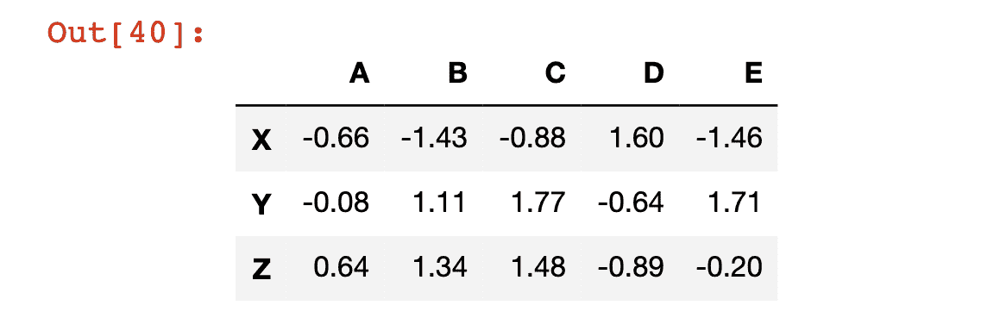*

*我们现在将一步一步地重新创建这个数据帧。*

*首先，您需要导入 NumPy 和 pandas 库。我们以前做过，但如果你不确定，这里有另一个如何做的例子:*

```
 *`import numpy as np

import pandas as pd`* 
```

*我们还需要为行名和列名创建列表。我们可以使用普通的 Python 列表来做到这一点:*

```
 *`rows = ['X','Y','Z']

cols = ['A', 'B', 'C', 'D', 'E']`* 
```

*接下来，我们需要创建一个 NumPy 数组来保存 DataFrame 的单元格中包含的数据。为此我使用了 NumPy 的`np.random.randn`方法。我还将该方法包装在`np.round`方法中(第二个参数是`2`，它将每个数据点四舍五入到小数点后两位，使数据结构更容易阅读。*

*这是生成数据的最后一个函数。*

```
 *`data = np.round(np.random.randn(3,5),2)`* 
```

*一旦完成，您就可以在`pd.DataFrame`方法中包装所有的组成变量来创建您的第一个数据框架！*

```
 *`pd.DataFrame(data, rows, cols)`* 
```

*这里有很多东西需要解开，所以让我们更详细地讨论一下这个例子。*

*首先，没有必要在数据帧本身之外创建每个变量。您可以用这样的一行代码创建这个数据帧:*

```
 *`pd.DataFrame(np.round(np.random.randn(3,5),2), ['X','Y','Z'], ['A', 'B', 'C', 'D', 'E'])`* 
```

*也就是说，单独声明每个变量会使代码更容易阅读。*

*其次，您可能想知道是否有必要将行放在列之前放入`DataFrame`方法中。确实有必要。如果您尝试运行`pd.DataFrame(data, cols, rows)`，您的 Jupyter 笔记本会生成以下错误消息:*

```
 *`ValueError: Shape of passed values is (3, 5), indices imply (5, 3)`* 
```

*接下来，我们将探讨熊猫系列和熊猫数据帧之间的关系。*

### ***熊猫系列与熊猫数据框的关系***

*让我们再来看看我们刚刚创建的熊猫数据框架:*

**

*如果您必须口头描述 pandas 系列，一种方法可能是" **一组包含数据的带标签的列，其中每一列共享同一组行索引。"***

*有趣的是，这些栏目实际上都是熊猫系列！因此，我们可以修改熊猫数据帧的定义，以匹配其正式定义:*

*" **共享同一索引的一组熊猫系列."***

### ***熊猫数据帧中的索引和赋值***

*我们实际上可以使用方括号从 pandas 数据帧中调用特定的系列，就像我们如何从列表中调用元素一样。下面是几个例子:*

```
 *`df = pd.DataFrame(data, rows, cols)

df['A']

"""

Returns:

X   -0.66

Y   -0.08

Z    0.64

Name: A, dtype: float64

"""

df['E']

"""

Returns:

X   -1.46

Y    1.71

Z   -0.20

Name: E, dtype: float64

"""`* 
```

*如果您想从 pandas 数据框架中选择多个列，该怎么办？您可以传入一列列表，或者直接放在方括号中——比如`df[['A', 'E']]`——或者在方括号外声明变量，如下所示:*

```
 *`columnsIWant = ['A', 'E']

df[columnsIWant]

#Returns the DataFrame, but only with columns A and E`* 
```

*您还可以使用链式方括号选择特定行的特定元素。例如，如果您想要索引 X 处的行 A 中包含的元素(这是数据帧左上角单元格中的元素)，您可以使用`df['A']['X']`来访问它。*

*下面是其他几个例子。*

```
 *`df['B']['Z']

#Returns 1.34

df['D']['Y']

#Returns -0.64`* 
```

### ***如何在熊猫数据框架中创建和删除列***

*您可以在 pandas 数据框架中创建新列，方法是指定该列，就像它已经存在一样，然后为它分配一个新的 pandas 系列。*

*例如，在下面的代码块中，我们创建了一个名为“A + B”的新列，它是 A 列和 B 列的总和:*

```
 *`df['A + B'] = df['A'] + df['B']

df 

#The last line prints out the new DataFrame`* 
```

*下面是该代码块的输出:*

*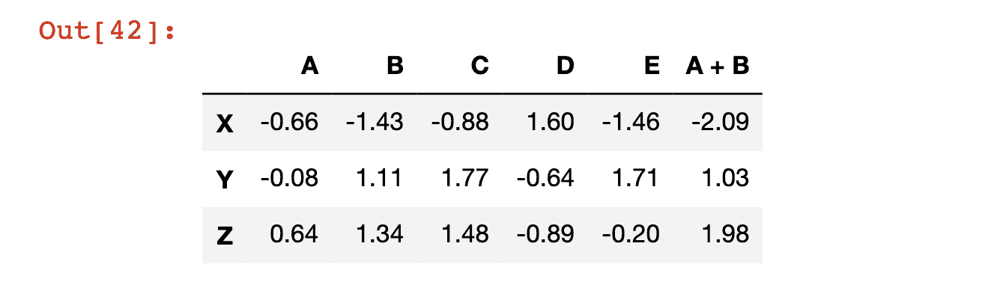*

*为了从 pandas 数据帧中删除这个列，我们需要使用`pd.DataFrame.drop`方法。*

*请注意，该方法默认删除行，而不是列。要切换方法设置来操作列，我们必须在`axis=1`参数中传递它。*

```
 *`df.drop('A + B', axis = 1)`* 
```

**

*值得注意的是，这个`drop`方法实际上并没有修改数据帧本身。为了证明这一点，再次打印出`df`变量，注意它仍然有`A + B`列:*

```
 *`df`* 
```

**

*原因是`drop`(以及其他许多 DataFrame 方法！)默认不修改数据结构是为了防止你不小心删除数据。*

*有两种方法可以让 pandas 自动覆盖当前数据帧。*

*第一种方法是传入参数`inplace=True`，就像这样:*

```
 *`df.drop('A + B', axis=1, inplace=True)`* 
```

*第二种方法是使用赋值运算符，手动覆盖现有变量，如下所示:*

```
 *`df = df.drop('A + B', axis=1)`* 
```

*两个选项都有效，但我发现自己更频繁地使用第二个选项，因为它更容易记住。*

*`drop`方法也可以用来删除行。例如，我们可以如下移除行`Z`:*

```
 *`df.drop('Z')`* 
```

*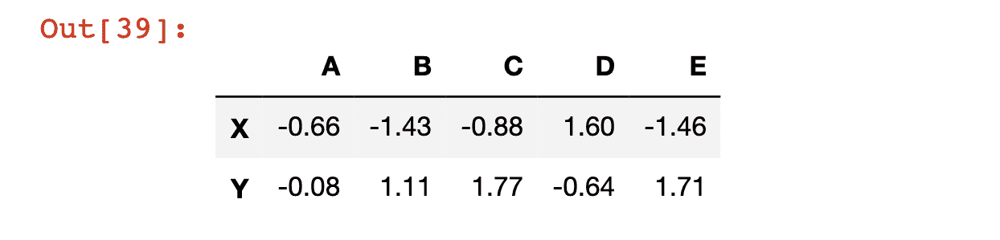*

### ***如何从熊猫数据帧中选择一行***

*我们已经看到，我们可以使用方括号访问熊猫数据帧的特定列。我们现在将看到如何访问 pandas 数据帧的特定行，类似的目标是从更大的数据结构生成 pandas 系列。*

*数据帧的行可以通过使用带有方括号的`loc`属性的行标签来访问。下面是一个例子。*

```
 *`df.loc['X']`* 
```

*下面是该代码的输出:*

```
 *`A   -0.66

B   -1.43

C   -0.88

D    1.60

E   -1.46

Name: X, dtype: float64`* 
```

*可以使用带有方括号的`iloc`属性通过数字索引来访问数据帧行。下面是一个例子。*

```
 *`df.iloc[0]`* 
```

*如您所料，这段代码的输出与我们上一个示例相同:*

```
 *`A   -0.66

B   -1.43

C   -0.88

D    1.60

E   -1.46

Name: X, dtype: float64`* 
```

### ***如何确定熊猫数据帧中的行数和列数***

*在很多情况下，你会想知道熊猫数据帧的形状。就形状而言，我指的是数据结构中的列数和行数。*

*Pandas 有一个名为`shape`的内置属性，让我们可以轻松访问它:*

```
 *`df.shape

#Returns (3, 5)`* 
```

### ***切片熊猫数据帧***

*我们已经看到了如何从 pandas 数据帧中选择行、列和元素。在本节中，我们将探讨如何选择数据帧的子集。具体来说，让我们从列`A`和`B`以及行`X`和`Y`中选择元素。*

*我们实际上可以一步一步地解决这个问题。首先，让我们选择列`A`和`B`:*

```
 *`df[['A', 'B']]`* 
```

*然后，让我们选择行`X`和`Y`:*

```
 *`df[['A', 'B']].loc[['X', 'Y']]`* 
```

*我们完事了。*

### ***使用熊猫数据框的条件选择***

*如果您还记得我们对 NumPy 数组的讨论，我们能够使用条件操作符选择数组的某些元素。例如，如果我们有一个名为`arr`的 NumPy 数组，并且我们只想要大于 4 的数组值，我们可以使用命令`arr[arr > 4]`。*

*熊猫数据帧遵循类似的语法。例如，如果我们想知道我们的数据帧在哪里有大于 0.5 的值，我们可以键入`df > 0.5`以获得以下输出:*

*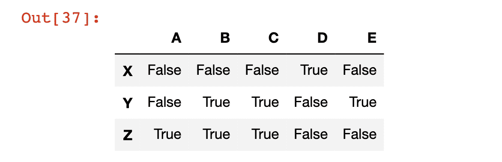*

*我们还可以生成一个新的 pandas DataFrame，其中包含语句为`True`时的正常值，以及语句为假时的值`NaN`——它代表的不是数字。为此，我们使用方括号将语句传递到数据帧中，如下所示:*

```
 *`df[df > 0.5]`* 
```

*下面是该代码的输出:*

*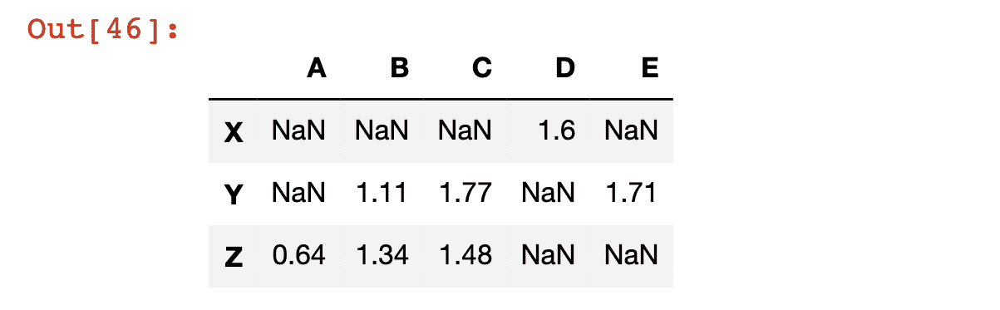*

*还可以使用条件选择返回数据帧的子集，其中指定的列满足特定的条件。*

*更具体地说，假设您想要数据帧的子集，其中列`C`中的值小于 1。这只适用于第`X`行。*

*您可以像这样获得与该语句相关联的布尔值数组:*

```
 *`df['C'] < 1`* 
```

*以下是输出结果:*

```
 *`X     True

Y    False

Z    False

Name: C, dtype: bool`* 
```

*您还可以通过键入`df[df['C'] < 1]`来获得与该条件选择命令相关的数据帧的实际值，这将只输出数据帧的第一行(因为这是唯一一个对于列`C`该语句为真的行:*

*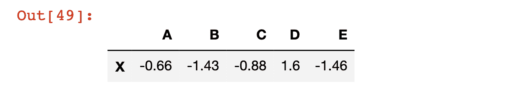*

*使用条件选择时，还可以将多个条件链接在一起。我们使用 pandas 的`&`操作符来实现这一点。您不能使用 Python 的普通`and`操作符，因为在这种情况下，我们不是在比较两个布尔值。相反，我们正在比较两个包含布尔值的熊猫系列，这就是为什么使用了`&`字符。*

*作为多条件选择的一个示例，您可以使用以下代码返回满足`df['C'] > 0`和`df['A']> 0`的 DataFrame 子集:*

```
 *`df[(df['C'] > 0) & (df['A']> 0)]`* 
```

*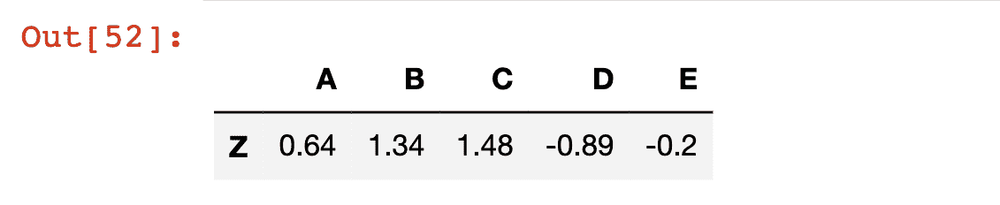*

### ***如何修改熊猫数据帧的索引***

*有许多方法可以修改熊猫数据帧的索引。*

*最基本的是将索引重置为其默认数值。我们使用`reset_index`方法来实现这一点:*

```
 *`df.reset_index()`* 
```

*请注意，这将在数据帧中创建一个名为`index`的新列，其中包含以前的索引标签:*

*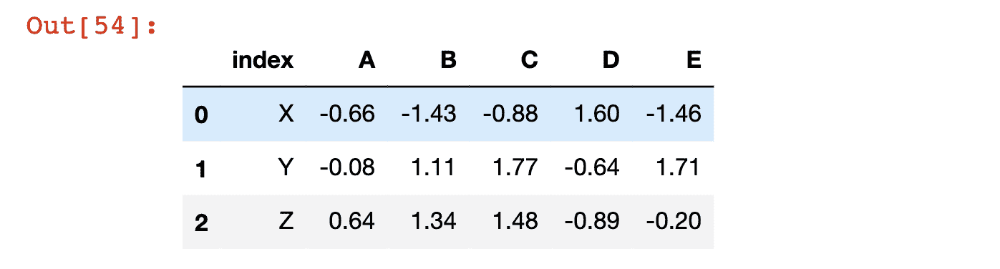*

*请注意，与我们研究的其他数据帧操作一样，`reset_index`不会修改原始数据帧，除非您(1)使用`=`赋值操作符强制修改它，或者(2)指定`inplace=True`。*

*您还可以使用`set_index`方法将现有的列设置为数据帧的索引。我们可以使用以下代码将列`A`设置为数据帧的索引:*

```
 *`df.set_index('A')`* 
```

*`A`的值现在位于数据帧的索引中:*

**

*这里有三样东西一文不值:*

*   *除非您(1)使用`=`赋值运算符强制修改原始数据帧，或者(2)指定`inplace=True`，否则`set_index`不会修改原始数据帧。*
*   *除非您先运行`reset_index`，否则使用`inplace=True`或强制`=`赋值操作符执行`set_index`操作将永久覆盖您当前的索引值。*
*   *如果您想要将您的索引重命名为当前不包含在列中的标签，您可以通过(1)用这些值创建一个 NumPy 数组，(2)将这些值添加为 pandas 数据帧的新行，以及(3)运行`set_index`操作来实现。*

### ***如何重命名熊猫数据框架中的列***

*我们将讨论的最后一个 DataFrame 操作是如何重命名它们的列。*

*列是 pandas DataFrame 的一个属性，这意味着我们可以使用一个简单的点操作符来调用和修改它们。例如:*

```
 *`df.columns

#Returns Index(['A', 'B', 'C', 'D', 'E'], dtype='object'`* 
```

*赋值运算符是修改该属性的最佳方式:*

```
 *`df.columns = [1, 2, 3, 4, 5]

df`* 
```

*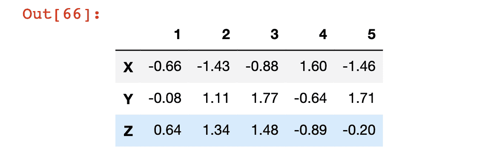*

## ***如何处理熊猫数据帧中的缺失数据***

*在一个理想的世界中，我们将总是使用完美的数据集。然而，实际情况从来不是这样。在许多情况下，当处理定量数据时，您需要删除或修改缺失的数据。在这一节中，我们将探讨[处理熊猫](https://nickmccullum.com/advanced-python/missing-data-pandas/)丢失数据的策略。*

### ***我们将在本节使用的数据帧***

*在本节中，我们将使用`np.nan`属性来生成`NaN`值。*

```
 *`Np.nan

#Returns nan`* 
```

*在本节中，我们将利用以下数据框架:*

```
 *`df = pd.DataFrame(np.array([[1, 5, 1],[2, np.nan, 2],[np.nan, np.nan, 3]]))

df.columns = ['A', 'B', 'C']

df`* 
```

*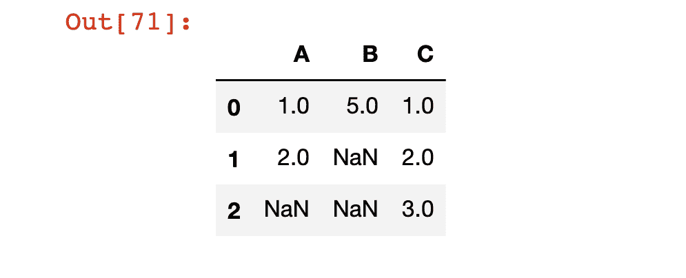*

### ***熊猫`dropna`法***

*熊猫有一个内置的方法叫做`dropna`。当应用于 DataFrame 时，`dropna`方法将删除任何包含 NaN 值的行。*

*举个例子，让我们将`dropna`方法应用于我们的`df`数据帧:*

```
 *`df.dropna()`* 
```

*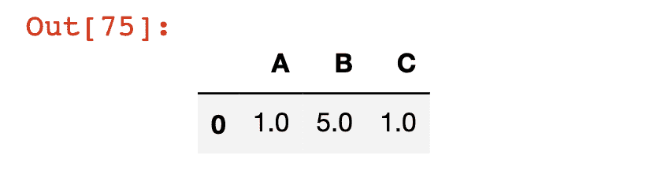*

*请注意，与我们研究的其他数据帧操作一样，`dropna`不会修改原始数据帧，除非您(1)使用`=`赋值操作符强制修改它，或者(2)指定`inplace=True`。*

*我们还可以通过将`axis=1`参数传递给`dropna`方法来删除任何缺少值的列，如下所示:*

```
 *`df.dropna(axis=1)`* 
```

*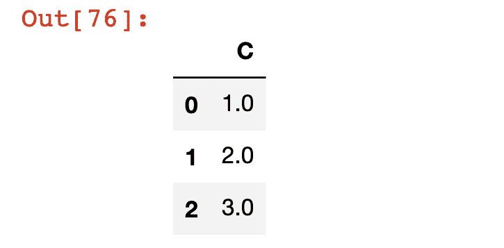*

### ***熊猫`fillna`法***

*在许多情况下，您会想要替换 pandas 数据帧中缺少的值，而不是完全删除它。`fillna`方法就是为此而设计的。*

*例如，让我们用`?`填充数据帧中的每个缺失值:*

```
 *`df.fillna('?')`* 
```

*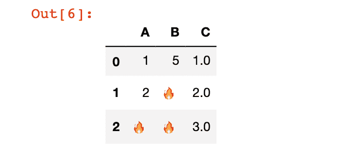*

*显然，基本上没有我们想要用表情符号替换丢失数据的情况。这只是一个有趣的例子。*

*相反，更常见的情况是，我们会用以下两者之一替换缺失值:*

*   *整个数据帧的平均值*
*   *数据帧行的平均值*

*我们将在下面演示这两者。*

*要用整个数据帧的平均值填充缺失值，请使用以下代码:*

```
 *`df.fillna(df.mean())`* 
```

*要用特定列中的平均值填充该列中缺少的值，请使用以下代码(这是针对列`A`):*

```
 *`df['A'].fillna(df['A'].mean())`* 
```

## ***熊猫`groupby`法***

*在这一节中，我们将讨论如何使用[熊猫 groupby](https://nickmccullum.com/advanced-python/pandas-dataframes-groupby/) 特性。*

## ***熊猫`groupby`有什么特点？***

*Pandas 有一个内置的`groupby`特性，允许你根据一个列将行组合在一起，并对它们执行聚合功能。例如，您可以计算列`ID`中值为`1`的所有行的总和。*

*对于任何熟悉查询数据库的 SQL 语言的人来说，pandas `groupby`方法非常类似于一个 [SQL groupby 语句](https://nickmccullum.com/sql/sql-group-by/)。*

*用一个例子来理解 pandas `groupby`方法是最容易的。我们将使用以下数据框架:*

```
 *`df = pd.DataFrame([ ['Google', 'Sam', 200],

                    ['Google', 'Charlie', 120],

                    ['Salesforce','Ralph', 125],

                    ['Salesforce','Emily', 250],

                    ['Adobe','Rosalynn', 150],

                    ['Adobe','Chelsea', 500]])

df.columns = ['Organization', 'Salesperson Name', 'Sales']

df`* 
```

*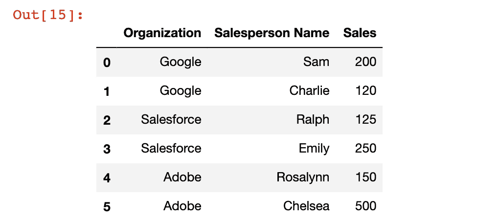*

*该数据框架包含三个独立组织的销售信息:Google、Salesforce 和 Adobe。我们将使用`groupby`方法获得每个特定组织的汇总销售数据。*

*首先，我们需要创建一个`groupby`对象。这是一个数据结构，它告诉 Python 你想根据哪一列对数据帧进行分组。在我们的例子中，它是`Organization`列，所以我们像这样创建一个`groupby`对象:*

```
 *`df.groupby('Organization')`* 
```

*如果您看到类似这样的输出，您将知道您已经成功地创建了对象:*

```
 *`<pandas.core.groupby.generic.DataFrameGroupBy object at 0x113f4ecd0>`* 
```

*一旦创建了`groupby`对象，就可以调用该对象上的操作来创建一个数据帧，其中包含关于`Organization`组的摘要信息。下面是几个例子:*

```
 *`df.groupby('Organization').mean()

#The mean (or average) of the sales column

df.groupby('Organization').sum()

#The sum of the sales column

df.groupby('Organization').std()

#The standard deviation of the sales column`* 
```

*注意，由于上面所有的操作都是数值操作，它们将自动忽略`Salesperson Name`列，因为它只包含字符串。*

*下面是其他几个与 pandas 的`groupby`方法配合良好的聚合函数:*

```
 *`df.groupby('Organization').count()

#Counts the number of observations

df.groupby('Organization').max()

#Returns the maximum value

df.groupby('Organization').min()

#Returns the minimum value`* 
```

## ***使用`groupby`配合`describe`的方法***

*当[处理熊猫数据帧](https://nickmccullum.com/advanced-python/pandas-common-operations/)时，一个非常有用的工具是`describe`方法，它返回`groupby`函数正在处理的每个类别的有用信息。*

*这最好通过一个例子来了解。我结合了下面的`groupby`和`describe`方法:*

```
 *`df.groupby('Organization').describe()`* 
```

*下面是输出的样子:*

*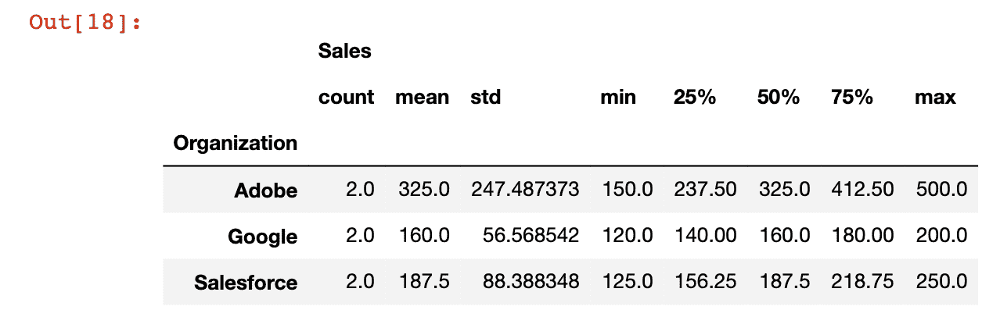*

## ***熊猫`concat`法***

*在这一部分，我们将学习如何连接熊猫数据帧。这将是一个简短的部分，但它仍然是一个重要的概念。让我们开始吧！*

### ***我们将在本节使用的数据帧***

*为了演示如何合并 pandas 数据帧，我将使用以下 3 个示例数据帧:*

```
 *`df1 = pd.DataFrame({'A': ['A0', 'A1', 'A2', 'A3'],

                        'B': ['B0', 'B1', 'B2', 'B3'],

                        'C': ['C0', 'C1', 'C2', 'C3'],

                        'D': ['D0', 'D1', 'D2', 'D3']},

                        index=[0, 1, 2, 3])

df2 = pd.DataFrame({'A': ['A4', 'A5', 'A6', 'A7'],

                        'B': ['B4', 'B5', 'B6', 'B7'],

                        'C': ['C4', 'C5', 'C6', 'C7'],

                        'D': ['D4', 'D5', 'D6', 'D7']},

                         index=[4, 5, 6, 7]) 

df3 = pd.DataFrame({'A': ['A8', 'A9', 'A10', 'A11'],

                        'B': ['B8', 'B9', 'B10', 'B11'],

                        'C': ['C8', 'C9', 'C10', 'C11'],

                        'D': ['D8', 'D9', 'D10', 'D11']},

                        index=[8, 9, 10, 11])`* 
```

### ***如何连接熊猫数据帧***

*任何上过我的 Python 入门课程的人都会记得，字符串连接意味着将一个字符串添加到另一个字符串的末尾。下面是字符串连接的一个示例。*

```
 *`str1 = "Hello "

str2 = "World!"

str1 + str2

#Returns 'Hello World!'`* 
```

*数据帧连接非常相似。这意味着将一个数据帧添加到另一个数据帧的末尾。*

*为了执行字符串连接，我们应该有两个具有相同列的数据帧。下面是一个例子:*

```
 *`pd.concat([df1, df2, df3])`* 
```

*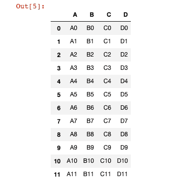*

*默认情况下，pandas 将沿着`axis=0`连接，这意味着它添加行，而不是列。*

*如果您想添加行，只需将`axis=0`作为一个新变量传递给`concat`函数。*

```
 *`pd.concat([df1,df2,df3],axis=1)`* 
```

*在我们的例子中，这会创建一个非常难看的数据帧，其中有许多缺失值:*

*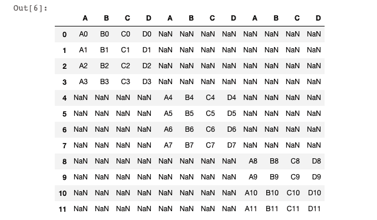*

## ***熊猫`merge`法***

*在这一节，我们将学习如何[合并熊猫数据帧](https://nickmccullum.com/advanced-python/how-to-merge-pandas-dataframes/)。*

### ***我们将在本节使用的数据帧***

*在本节中，我们将使用以下两个熊猫数据框架:*

```
 *`import pandas as pd

leftDataFrame = pd.DataFrame({'key': ['K0', 'K1', 'K2', 'K3'],

                     'A': ['A0', 'A1', 'A2', 'A3'],

                     'B': ['B0', 'B1', 'B2', 'B3']})

rightDataFrame = pd.DataFrame({'key': ['K0', 'K1', 'K2', 'K3'],

                          'C': ['C0', 'C1', 'C2', 'C3'],

                          'D': ['D0', 'D1', 'D2', 'D3']})`* 
```

*列`A`、`B`、`C`和`D`中有真实数据，而列`key`有一个在两个数据帧中通用的键。To `merge`两个数据帧意味着沿着它们共有的一列连接它们。*

### ***如何合并熊猫数据帧***

*您可以使用`merge`列沿着一个公共列合并两个 pandas 数据帧。对于任何熟悉 SQL 编程语言的人来说，这非常类似于在 SQL 中执行`inner join`。*

*如果您不熟悉 SQL，也不用担心，因为`merge`语法实际上非常简单。看起来是这样的:*

```
 *`pd.merge(leftDataFrame, rightDataFrame, how='inner', on='key')`* 
```

*让我们分解传递给`merge`方法的四个参数:*

1.  *这是我们想要在左边合并的数据帧。*
2.  *这是我们想要在右边合并的数据帧。*
3.  *`how=inner`:这是操作正在执行的合并类型。有多种类型的合并，但在本课程中我们将只讨论内部合并。*
4.  *`on='key'`:这是您想要执行合并的列。因为`key`是两个数据帧之间唯一的公共列，所以它是我们可以用来执行合并的唯一选项。*

## ***熊猫`join`法***

*在这一部分，你将学习如何加入熊猫数据框。*

### ***我们将在本节使用的数据帧***

*在本节中，我们将使用以下两个数据帧:*

```
 *`leftDataFrame = pd.DataFrame({  'A': ['A0', 'A1', 'A2', 'A3'],

                                'B': ['B0', 'B1', 'B2', 'B3']},

                                index =['K0', 'K1', 'K2', 'K3'])

rightDataFrame = pd.DataFrame({ 'C': ['C0', 'C1', 'C2', 'C3'],

                                'D': ['D0', 'D1', 'D2', 'D3']},

                                index = ['K0', 'K1', 'K2', 'K3'])`* 
```

*如果这些看起来很眼熟，那是因为它们就是！这些数据帧与我们在学习如何合并熊猫数据帧时使用的数据帧几乎相同。一个关键的区别是，`key`列不再是它自己的列，它现在是数据帧的索引。您可以认为这些数据帧是在执行了`.set_index(key)`之后来自上一节的数据帧。*

### ***如何加入熊猫数据框***

*连接 pandas 数据帧与合并 pandas 数据帧非常相似，除了您想要组合的键在索引中，而不是包含在列中。*

*要连接这两个数据帧，我们可以使用以下代码:*

```
 *`leftDataFrame.join(rightDataFrame)`* 
```

## ***熊猫的其他常见操作***

*本节将探索 pandas Python 库中的[常见操作。这一节的目的是探索到目前为止我们讨论过的任何一节都不适合的重要的 pandas 操作。](https://nickmccullum.com/advanced-python/pandas-common-operations/)*

### ***我们将在本节使用的数据帧***

*在本节中，我将使用以下数据框架:*

```
 *`df = pd.DataFrame({'col1':['A','B','C','D'],

                   'col2':[2,7,3,7],

                   'col3':['fgh','rty','asd','qwe']})`* 
```

### ***如何在熊猫系列中找到唯一值***

*Pandas 有一个很好的方法叫做`unique`,可以用来在 pandas 系列中寻找唯一的值。请注意，此方法仅适用于序列，不适用于数据帧。如果尝试将此方法应用于数据帧，将会遇到错误:*

```
 *`df.unique()

#Returns AttributeError: 'DataFrame' object has no attribute 'unique'`* 
```

*然而，由于 pandas 数据帧的每一列都是一个系列，我们可以对特定的列应用`unique`方法，如下所示:*

```
 *`df['col2'].unique()

#Returns array([2, 7, 3])`* 
```

*Pandas 还有一个单独的`nunique`方法，它计算一个序列中唯一值的数量，并将该值作为一个整数返回。例如:*

```
 *`df['col2'].nunique()

#Returns 3`* 
```

*有趣的是，`nunique`方法的 ****与`len(unique())`的**** 完全相同，但这是一个足够常见的操作，因此熊猫社区决定为这个用例创建一个特定的方法。*

### ***如何计算熊猫系列中每个值的出现次数***

*Pandas 有一个名为`counts_value`的功能，可以让你轻松统计每次观察发生的次数。下面是一个例子:*

```
 *`df['col2'].value_counts()

"""

Returns:

7    2

2    1

3    1

Name: col2, dtype: int64

"""`* 
```

### ***如何使用熊猫`apply`方法***

*方法是熊猫图书馆中最强大的方法之一。它允许您将自定义函数应用到熊猫系列的每个元素。*

*作为一个例子，假设我们有下面的函数`exponentify`,它接受一个整数并对其进行自乘:*

```
 *`def exponentify(x):

    return x**x`* 
```

*`apply`方法允许您轻松地将`exponentify`函数应用于序列的每个元素:*

```
 *`df['col2'].apply(exponentify)

"""

Returns:

0         4

1    823543

2        27

3    823543

Name: col2, dtype: int64

"""`* 
```

*`apply`方法也可以和像`len`这样的内置函数一起使用(尽管它和自定义函数一起使用时肯定更强大)。结合`apply`使用的`len`功能示例如下:*

```
 *`df['col3'].apply(len)

"""

Returns

0    3

1    3

2    3

3    3

Name: col3, dtype: int64

"""`* 
```

### ***如何对熊猫数据帧进行排序***

*您可以使用`sort_values`方法通过特定列的值来过滤 pandas 数据帧。例如，如果您想在我们的数据帧`df`中按`col2`排序，您可以运行以下命令:*

```
 *`df.sort_values('col2')`* 
```

*该命令的输出如下所示:*

*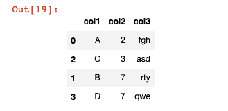*

*该输出中有两点需要注意:*

1.  *如您所见，每一行都保留了它的索引，这意味着索引现在是无序的。*
2.  *与其他 DataFrame 方法一样，这实际上并不修改原始 DataFrame，除非您使用`=`赋值操作符或通过传入`inplace = True`来强制修改它。*

## ***Pandas 中的本地数据输入和输出(I/O)***

*在本节中，我们将开始探索 pandas Python 库的[数据输入和输出。](https://nickmccullum.com/advanced-python/pandas-data-input-output/)*

### ***我们将在本节中使用的文件***

*在本节中，我们将使用不同的文件，其中包含脸书、亚马逊、谷歌和微软(MSFT)的股票价格。要下载这些文件，请点击这里下载本课程的整个 GitHub 资源库。本节中使用的文件可以在存储库的`stock_prices`文件夹中找到。*

*对于本节，您需要将这些文件保存在 Jupyter 笔记本所在的目录中。最简单的方法是下载 GitHub 资源库，然后在资源库的`stock_prices`文件夹中打开您的 Jupyter 笔记本。*

### ***如何使用熊猫**导入`.csv`文件*

*我们可以使用`read_csv`方法将`.csv`文件导入熊猫数据帧，如下所示:*

```
 *`import pandas as pd

pd.read_csv('stock_prices.csv')`* 
```

*正如您将看到的，这将创建(并显示)一个新的 pandas 数据帧，其中包含来自`.csv`文件的数据。*

**

*您也可以使用普通的`=`赋值操作符将这个新的数据帧赋给一个变量，以便以后引用:*

```
 *`new_data_frame = pd.read_csv('stock_prices.csv')`* 
```

*pandas 编程库中包含了许多`read`方法。如果您试图从外部文档导入数据，那么 pandas 很可能有一个内置的方法。*

*不同`read`方法的几个例子如下:*

```
 *`pd.read_json()

pd.read_html()

pd.read_excel()`* 
```

*我们将在本节的后面探讨其中的一些方法。*

*如果我们想导入一个不在工作目录中的`.csv`文件，我们需要稍微修改一下`read_csv`方法的语法。*

*如果文件所在的文件夹比您现在所在的文件夹更深，您需要在`read_csv`方法参数中指定文件的完整路径。例如，如果`stock_prices.csv`文件包含在一个名为`new_folder`的文件夹中，那么我们可以像这样导入它:*

```
 *`new_data_frame = pd.read_csv('./new_folder/stock_prices.csv')`* 
```

*对于那些不熟悉使用目录符号的人来说，文件路径开头的`.`表示当前目录。同样，`..`表示当前目录上面的一个目录，`...`表示当前目录上面的两个 目录。*

*这种语法(使用句点)正是我们引用(和导入)当前工作目录之上的文件的方式。例如，在`new_folder`文件夹中打开一个 Jupyter 笔记本，并将`stock_prices.csv`放在父文件夹中。使用这个文件布局，您可以使用以下命令导入`stock_prices.csv`文件:*

```
 *`new_data_frame = pd.read_csv('../stock_prices.csv')`* 
```

*请注意，此目录语法对于所有类型的文件导入都是相同的，因此，在本课程稍后探讨不同的导入方法时，我们将不再讨论如何从不同的目录导入文件。*

### ***如何使用熊猫**导出`.csv`文件*

*为了演示如何保存一个新的`.csv`文件，让我们首先创建一个新的数据帧。具体来说，让我们使用`np.random.randn`方法用随机数据填充 3 列 50 行的数据帧:*

```
 *`import pandas as pd

import numpy as np

df = pd.DataFrame(np.random.randn(50,3))`* 
```

*现在我们有了一个数据帧，我们可以使用`to_csv`方法保存它。这个方法接受新文件的名称作为它的参数。*

```
 *`df.to_csv('my_new_csv.csv')`* 
```

*您会注意到，如果运行上面的代码，新的`.csv`文件将以一个未标记的列开始，该列包含数据帧的索引。下面是一个例子(在 Microsoft Excel 中打开`.csv`之后):*

*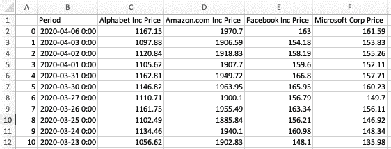*

*在许多情况下，这是不可取的。要删除空白索引列，将`index=False`作为第二个参数传递给`to_csv`方法，如下所示:*

```
 *`new_data_frame.to_csv('my_new_csv.csv', index = False)`* 
```

*新的`.csv`文件没有未标记的索引列:*

*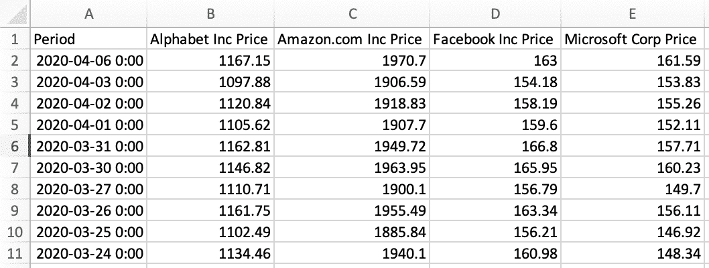*

*`read_csv`和`to_csv`方法使得使用 pandas 从`.csv`文件导入和导出数据变得非常容易。我们将在本节后面看到，对于每个允许我们导入数据的`read`方法，通常都有一个相应的`to`函数允许我们保存数据！*

### ***如何使用熊猫**导入`.json`文件*

*如果您没有处理大型数据集的经验，那么您可能不熟悉 JSON 文件类型。*

*JSON 代表 JavaScript 对象符号。JSON 文件非常类似于 Python 字典。*

*JSON 文件是软件开发人员最常用的数据类型之一，因为基本上可以使用每种编程语言来操作它们。*

*Pandas 有一个名为`read_json`的方法，它使得将 JSON 文件作为 pandas 数据帧导入变得非常容易。下面是一个例子。*

```
 *`json_data_frame = pd.read_json('stock_prices.json')`* 
```

*接下来我们将学习如何导出 JSON 文件。*

### ***如何使用熊猫**导出`.json`文件*

*正如我前面提到的，一般每个`read`方法都有一个`to`方法。这意味着我们可以使用`to_json`方法将数据帧保存到 JSON 文件中。*

*例如，让我们从本节前面的内容中随机生成数据帧`df`,并将其保存为本地目录中的 JSON 文件:*

```
 *`df.to_json('my_new_json.json')`* 
```

*接下来，我们将学习如何使用 Excel 文件——文件扩展名为`.xlsx`。*

### ***如何使用熊猫**导入`.xlsx`文件*

*Pandas 的`read_excel`方法使得将 Excel 文档中的数据导入 pandas 数据框架变得非常容易:*

```
 *`new_data_frame = pd.read_excel('stock_prices.xlsx')`* 
```

*与我们在本节前面探索的`read_csv`和`read_json`方法不同，`read_excel`方法可以接受第二个参数。`read_excel`接受多个参数的原因是 Excel 电子表格可以包含多个工作表。第二个参数指定您试图导入哪个工作表，称为`sheet_name`。*

*例如，如果我们的`stock_prices`有一个名为`Sheet2`的第二个工作表，您可以将该工作表导入到一个熊猫数据帧，如下所示:*

```
 *`new_data_frame.to_excel('stock_prices.xlsx', sheet_name='Sheet2')`* 
```

*如果您没有为`sheet_name`指定任何值，那么默认情况下`read_excel`将导入 Excel 电子表格的第一张工作表。*

*在导入 Excel 文档的同时，需要注意的是熊猫只导入数据。它不能导入其他 Excel 功能，如格式、公式或宏。尝试从具有这些功能的 Excel 文档导入数据可能会导致 pandas 崩溃。*

### ***如何使用熊猫**导出`.xlsx`文件*

*导出 Excel 文件与导入 Excel 文件非常相似，只是我们用`to_excel`代替`read_excel`。下面是使用我们随机生成的`df`数据框架的一个例子:*

```
 *`df.to_excel('my_new_excel_file.xlsx')`* 
```

*和`read_excel`一样，`to_excel`接受第二个参数`sheet_name`，允许您指定要保存的工作表的名称。例如，我们可以将新的`.xlsx`文件的工作表命名为`My New Sheet!`，方法如下:*

```
 *`df.to_excel('my_new_excel_file.xlsx', sheet_name='My New Sheet!')`* 
```

*如果您没有为`sheet_name`指定一个值，那么默认情况下工作表将被命名为`Sheet1`(就像您使用实际的应用程序创建一个新的 Excel 文档一样)。*

## ***熊猫的远程数据输入输出(I/O)***

*在本课程的最后一部分，我们学习了如何从保存在本地计算机上的`.csv`、`.json`和`.xlsx`文件中导入数据。接下来，我们将向您展示如何导入文件，而不必先将它们保存到本地机器上。这叫`remote importing`。*

### ***什么是远程导入，为什么有用？***

*远程导入意味着将文件引入 Python 脚本，而不将该文件保存在您的计算机上。*

*从表面上看，我们可能不清楚为什么要进行远程导入。然而，它可能非常有用。*

*远程导入之所以有用，是因为根据定义，这意味着即使导入的文件没有保存在您的计算机上，Python 脚本也将继续运行。这意味着我可以将我的代码发送给同事或朋友，它仍然可以正常工作。*

*在本节的其余部分，我将演示如何在熊猫中为`.csv`、`.json`和`.xlsx`文件执行远程导入。*

### ***如何导入远程`.csv`文件***

*首先，导航到本课程的 [GitHub 资源库](https://github.com/nicholasmccullum/advanced-python/)。打开`stock_prices`文件夹。点击文件`stock_prices.csv`，然后点击`Raw`文件的按钮，如下所示。*

*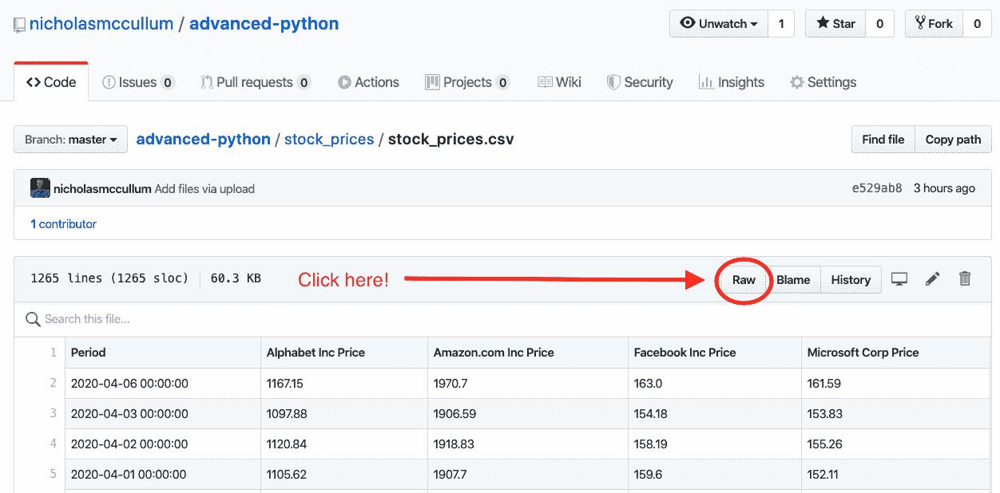*

*这将把您带到一个新页面，该页面包含来自包含在`stock_prices.csv`中的`.csv`文件的数据。*

*要将此远程文件导入到 Python 脚本中，必须首先将其 URL 复制到剪贴板。您可以通过(1)高亮显示整个 URL，右键单击所选文本，然后单击`copy`，或者(2)高亮显示整个 URL，然后在键盘上键入 CTRL+C。*

*URL 将如下所示:*

```
 *`[https://raw.githubusercontent.com/nicholasmccullum/advanced-python/master/stock_prices/stock_prices.csv](https://raw.githubusercontent.com/nicholasmccullum/advanced-python/master/stock_prices/stock_prices.csv)`* 
```

*您可以将这个 URL 传递到`read_csv`方法中，将数据集导入到 pandas 数据框架中，而无需先将数据集保存到您的计算机上:*

```
 *`pd.read_csv('https://raw.githubusercontent.com/nicholasmccullum/advanced-python/master/stock_prices/stock_prices.csv')`* 
```

### ***如何导入远程`.json`文件***

*我们可以用类似于导入`.csv`文件的方式导入远程`.json`文件。*

*首先，从 GitHub 获取原始 URL。它看起来会像这样:*

```
 *`https://raw.githubusercontent.com/nicholasmccullum/advanced-python/master/stock_prices/stock_prices.json`* 
```

*接下来，像这样将这个 URL 传递给`read_json`方法:*

```
 *`pd.read_json('https://raw.githubusercontent.com/nicholasmccullum/advanced-python/master/stock_prices/stock_prices.json')`* 
```

### ***如何导入远程`.xlsx`文件***

*我们可以用类似于导入`.csv`和`.json`文件的方式导入远程`.xlsx`文件。请注意，您需要在 GitHub 界面上稍微不同的地方单击。具体来说，您需要右键单击“查看原始数据”并选择“复制链接地址”，如下所示。*

*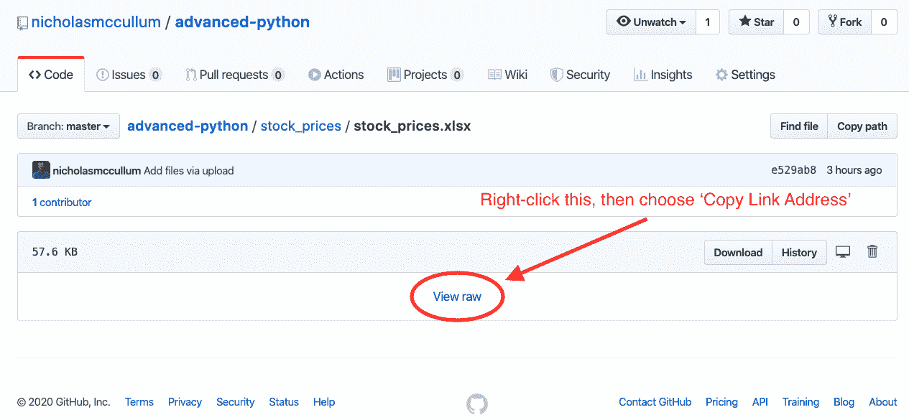*

*原始 URL 将如下所示:*

```
 *`https://github.com/nicholasmccullum/advanced-python/blob/master/stock_prices/stock_prices.xlsx?raw=true`* 
```

*然后，将这个 URL 传递给`read_excel`方法，就像这样:*

```
 *`pd.read_excel('https://github.com/nicholasmccullum/advanced-python/blob/master/stock_prices/stock_prices.xlsx?raw=true')`* 
```

### ***远程导入的缺点***

*远程导入意味着您不需要首先将导入的文件保存到您的本地计算机上，这无疑是一个优势。*

*然而，远程导入也有两个缺点:*

1.  *您必须有 Internet 连接才能执行远程导入*
2.  *ping URL 来检索数据集相当耗时，这意味着执行远程导入会降低 Python 代码的速度*

## ***最终想法&特价***

*感谢您阅读这篇关于 Pandas 的文章，它是我最喜欢的 Python 包之一，也是每个 Python 开发人员必读的库。*

*****本教程摘自我的课程********[Python For Finance and Data Science](https://courses.nickmccullum.com/courses/enroll/python-for-finance/)。如果您有兴趣学习更多的核心 Python 技能，该课程对注册的前 50 名 freeCodeCamp 读者提供 50%的折扣- [单击此处立即获得您的折扣课程](https://courses.nickmccullum.com/courses/enroll/python-for-finance/)！*****