# 如何变得有条理——来之不易的整理生活的技巧

> 原文：<https://www.freecodecamp.org/news/the-complete-guide-to-personal-organization/>

由于新冠肺炎带来的变化，许多人不得不寻找健康高效的远程工作方式。

有些人已经被送回家，可以在那里继续工作，但远程工作的“艺术”不仅仅是呆在家里，尽可能提高工作效率。有一整套的技巧和最佳实践可以让你高效工作，而不会感到疲惫不堪。

当人们问我如何变得有条理，不要害怕每周创作文章和发布内容(除了处理像社区和事件这样的其他问题)时，我产生了这篇文章的想法。

起初我不明白这有什么大不了的，因为我不这么看——直到更多的人开始问问题。所以我意识到这是一个整个社区都感兴趣的话题。就在那时，我决定写下我的所作所为，希望能帮助所有读到这篇文章的人。

# 目标

这篇文章并不一定是最重要的资源，而是我多年来收集和整理的一套最佳实践和技巧。

**注**:本文**完全**基于我的个人经历，所以我可能会遗漏或遗漏一些东西，因为我只是没有经历过。

此外，我自始至终提到的所有工具和关于它们的观点完全是我的，基于我的使用和我的经验。

如果你有不同的经历或对个人组织有不同的看法，我很乐意在另一篇文章或社交媒体上看到。

说了这么多，还是说内容吧！

# 我个人组织的历史

对于不认识我的人来说，我的名字是[卢卡斯·桑托斯](https://imasters.com.br/carreira-dev/dev-alem-do-codigo-lucas-santos)。我目前在[微软](https://www.microsoft.com/?WT.mc_id=devto-blog-ludossan)工作，担任[云倡导者](https://developer.microsoft.com/advocates/lucas-santos?WT.mc_id=devto-blog-ludossan)，但我已经在技术和开发部门工作了将近 9 年。

但我为什么要告诉你这些？因为我想展示我关于个人组织的想法的来源，以及为什么我认为它们特别重要。

在我的职业生涯中，我在不同的领域担任过不同的职位，从支持到领导。在我所有的经历中，我从来没有只做过开发工作。

换句话说，我的工作从来不是我唯一的工作——我一直积极参与开发社区、[活动、聚会、编程教学、写文章、制作视频和播客...同时努力管理我的个人生活。](https://abcdevelopers.org)

从小我就是一个非常焦虑的人。我总是非常好奇，想知道事情是如何运作的，我总是想控制一切。我**有**了解事情的整个过程，以确定他们做了什么。这给了我一种安全感，知道我的立场。

在小学和高中期间，这从来都不是问题。但是当我进入就业市场和大学时，它开始被证明是不切实际的。在一个小公司，你很容易知道所有的事情，但当事情开始变大时，它就超出了你的控制范围。试图重新获得对一切的完全控制就像试图用你自己的双手阻止一辆行驶的火车。

当然，我相信我能抓住火车...

因此，2016 年和 2017 年是我一生中压力最大的几年。我必须管理我的学院(当时我正在学习 UFABC)和我的工作，我的工作最近搬到了圣保罗一个叫“Vila Olímpia”的地方。它离我家很远，乘公共交通工具去那里很痛苦。

这是我必须通过的最难的考试之一。我花了将近 2 个小时去上班，所以我每天早上 5:40 醒来，直接从工作单位到大学，晚上 11 点回来。

不用说，我需要找到一种方法来组织我必须做的一切——为考试学习和我的睡眠和休闲时间。但是我惨败了。同年，我有过几次健康问题和几次焦虑发作。我仍然每天吃一片抗焦虑药。

从那时起，我开始意识到，重要的不是我做了或没做的事情的数量，而是我对它们的看法。我总是认为我做得不够，我没有达到我想去的地方。

就在那时，我意识到问题不在于我，而在于我缺乏组织能力。从那以后，我试图向尽可能多的人传播个人组织，这样就没有人会经历和我一样的问题。

# 为什么个人组织很重要

首先，有条理很重要，因为它有助于减少(如果不是消除)你对看到事情完成的焦虑——但我们将在另一部分对此进行更多的讨论。

这对你的健康很有好处，因为它可以帮助你避免许多焦虑可能导致的问题。你知道你可以放松，因为事情都是计划好的，如果你遵循你的计划，一切都会在该准备的时候准备好。

生活中的每一件事都需要组织和计划，从像你的仓鼠的生日这样最小的事情到像使用 [Kubernetes](https://tudosobrekubernetes.tech) 和 [AKS](https://azure.microsoft.com/services/kubernetes-service/?WT.mc_id=blog-devto-ludossan) 的分布式系统这样的大而复杂的问题。

你可能想知道——你必须组织自己去做生活中的每一件事吗，这是一种义务吗？不，你可以一个接一个地完成任务，按照你想要的顺序去做，把所有的事情都储存在你的大脑里。但最终，它会成为你的负担。

最后但同样重要的是，变得有条理是一种用更少的时间做更多事情的方法。所以你计划在一周内做的那 5 件事可能会在两天内同时解决。然后你会有 3 天时间做其他事情。

此外，组织起来不仅包括组织你的工作，还包括你的个人生活和闲暇时间。是啊！休闲和你在生活中要做的任何文章或项目一样重要。无论如何都要在你的日程中留出时间。但是如果你没有计划好，你总是会把它推到最后，然后你的焦虑又会回来。

## 个人组织的优势

我们来总结一下小题目里讲的内容。个人组织的优势是什么？

*   减少因无法控制事情而导致的焦虑和压力
*   创造一个成长中的组织心态，让你将组织心理扩展到其他领域和其他人
*   提高您的效率，让您在更短的时间内做更多的事情
*   腾出时间去完成更多的事情，从而给你更多的时间
*   创造健康的组织和归档习惯，让你更快地搜索和找到东西
*   产生责任
*   诱导自我控制和自律

## 个人组织的困难

变得有条理不是一项简单的任务，因此需要很长时间。个人组织远不止日历和任务清单——我们必须养成习惯。而且已经证明一个新习惯至少需要 21 天才能形成。

我们还需要建立纪律，避免拖延，并做许多其他事情，不仅涉及精神上的，也涉及身体上的变化。

许多事情会破坏我们的个人组织，我们甚至没有注意到，例如:

*   拖延，当没有完成任务的惩罚时，把事情留到以后做的行为
*   精神疲劳
*   身体疲劳
*   缺乏优先顺序
*   任务缺乏定义
*   自律的问题(毕竟，不是所有的人都能把自己组织到建立纪律和认真对待他人的程度)

还有很多其他的东西。

让我们把它科学化，看看我们的大脑是如何工作的。

## 个人组织背后的心理学

大脑是一台令人印象深刻的复杂计算机，充满了我们尚未发现的秘密。然而，我们已经设法创造了与计算机非常相似的类比。

就像你经常在你的个人电脑上同时运行一系列任务一样——例如，我的电脑现在有一个[浏览器](https://www.microsoft.com/edge?WT.mc_id=devto-blog-ludossan)，我写这篇文章的[编辑器](https://code.visualstudio.com/?WT.mc_id=blog-devto-ludossan)，以及一些通讯应用——一切似乎都在同时运行。但事实上，处理器正在[非常快速地在任务](https://en.wikipedia.org/wiki/Context_switch)之间切换，也就是说，本质上它一次只运行一个任务。

我们的大脑也是如此。虽然看起来我们可以同时执行几项任务，但大脑[只能同时执行两项复杂的认知任务](https://www.entrepreneur.com/article/224943)。

所以很多人认为多任务处理的行为是有益和高效的，而事实上，它弊大于利。一个典型的例子是一边打电话一边打不同的东西。或者一边写电子邮件，一边和别人谈论另一个话题。这是因为处理语音的通道是相同的，而且只有一个。

这就解释了为什么我们可以一边打结或者一边唱歌:负责琴弦运动的声音和运动通道是不同的。

当我们无意识地这样做时，我们称之为[任务转换](https://bit.ly/2U93xiI)，否则，我们称之为[认知转换](https://en.wikipedia.org/wiki/Cognitive_shifting)。

此外，有一个概念叫做你的[注意力持续时间](https://en.wikipedia.org/wiki/Attention_span),它是对一个人保持专注于一项特定任务的时间的测量。[微软加拿大](https://www.microsoft.com/?WT.mc_id=devto-blog-ludossan)发表[2015 年](http://dl.motamem.org/microsoft-attention-spans-research-report.pdf)的一项研究称，人类对一项任务保持专注的平均时间约为 8 秒。这对我们接下来要讲的内容非常重要。

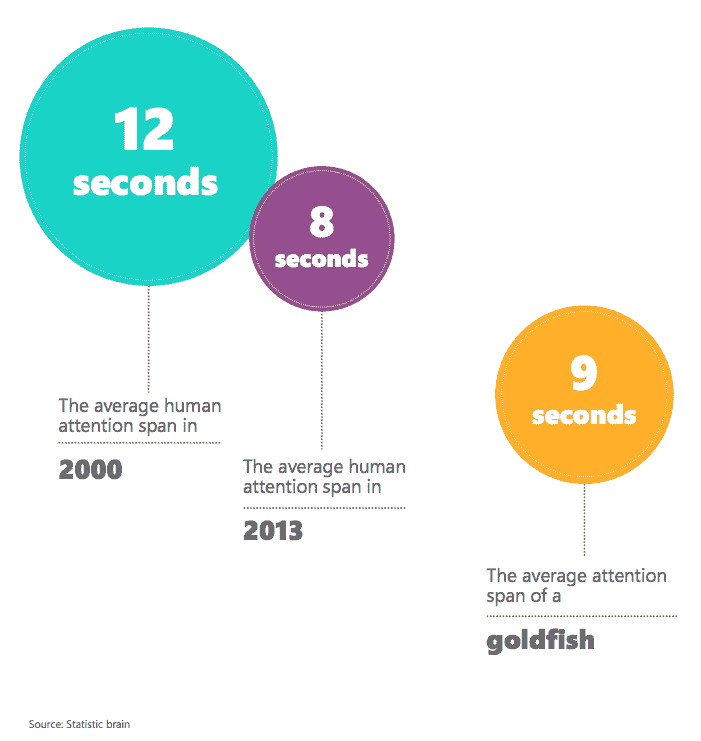

当然，这可以根据我们正在做的任务的类型而改变。显然，当一项任务[令人兴奋或愉快时，](https://en.wikipedia.org/wiki/Attention_span)我们可以有长达 20 分钟的注意力。

为什么这很重要？仅仅是因为我们现在有一个时间限制，我们必须在这个时间内完成我们的任务，以保持效率和组织性。也就是说，我们不能创建超过 20 分钟的任务。

这迫使我们将较大的任务分解成较小的任务。这本身就迫使我们详细描述我们所做的每一件事，更好地描述我们需要做什么。它也使我们消除了无用的任务或荒谬的项目，这些任务或项目乍一看似乎很重要。

这是走向个人组织的第一步:确切地知道你需要做什么。

当你有一个模糊的任务或者一个看起来不太清晰的任务时，你就不能按时完成任务。因此，你需要创建另一个任务，以便能够更好地思考第一个任务。这意味着你有一个计划下一个任务的任务，这正是我写这篇文章时所做的。

想写关于个人组织的内容，却不知道从何下手。因此，两个星期以来，我靠在它上面，研究我可以谈论和写的话题，总是记笔记。

因为我是巴西人，我的组织笔记是葡萄牙语的，但你明白我的意思了...

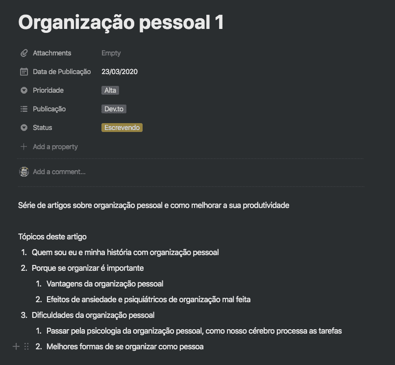

# 初始提示

对于文章的这一部分，我将更多地关注您应该在整个过程中发展的原则。我们将致力于把我们自己组织起来，所以我将把具体工具和方法的讨论留到下一部分。

我在这里所说的一切都是基于我多年来的经历。

### 避免半个字和开放的上下文。总是确切地知道需要做什么

确保你的任务被很好地定义到最小的细节。*“与约翰交谈”*不是一项明确的任务——你需要非常清楚地说明你需要做的每一件事，尽可能详细。

比如*“跟约翰谈保险单，要求 23 号把款送过来”*就具体明确多了。

### 你的大脑不是硬盘，它不可靠

你还记得三年前的这个时候你在做什么吗？没有吗？你当然不知道。我们的记忆是不可靠的，所以**总是**记下你当时想到的一切**。**不要等到以后，也不要说*“以后我会记下来的”*。

总是尽可能详细地写下每件事，以便忘掉它。

一天，我和一个朋友聊天，他叫威廉·莫利纳里，也是我最喜欢的一个组织工具的开发者。他给了我一个最酷的建议:

> *“你的大脑是用来处理的，而不是用来记忆的，所以把你需要记住的一切都放在另一个更可靠的渠道，比如纸”*。

### 遵守纪律

个人组织是高度以自律和责任为导向的，所以你需要把它作为你工作的一部分。

有些人很难把个人的事情变成责任。因为，毕竟，没有人会因为你错过或延误了一项个人任务而与你争吵或揪你的头发。你是你自己的经理。

但这既有好也有坏，主要是因为你需要对自己严格一点，才能富有成效和效率。记住，你的失败只能怪你自己，不能怪别人。

因此，建立纪律的责任——无论是大任务还是小任务——都是你的，而且仅仅是你的。所以如果你没有达到你的期望，给自己创造后果:“我今天不会看我的系列，因为我没有完成我的任务”，或者“我会关掉互联网，因为我推迟了这个任务”。

### 一切都是任务

我们稍后会谈到这一点，但是从清理花园里的树叶到为世界和平而努力，所有的事情都可以被认为是一项任务。所以写下你需要做的每件事，充分利用*来做*清单。

不要羞于让朋友发送周日烧烤的邀请，并遵循以下原则:“如果它不在我的日历或待办事项中，它就不存在。”

### 保持简单

我们刚说过要写下来。但是仅仅放下一个标题为“实现世界和平”的任务是没有用的。那太大太模糊了。我们将在下面详细讨论这一点，但是总是试着把大任务分成小任务——记住，20 分钟或更少。这样你总是知道该做什么。

### 每件事都有期限

我是一名程序员，我讨厌带着*截止日期*工作，因为我希望我的系统更加健壮、更加完美。但不幸的是，在我们的生活中，一切都需要一个结束日期。

您创建的所有任务都需要有完成日期和/或时间。如果到那时你还没有完成，你的计划就失败了，你需要重新考虑你是如何组织自己的。

理解你的节奏需要一段时间。例如，我在上午 9 点之前是一个人类变形虫，所以我知道在这个时间之前我将无法完成任何非常复杂的事情。所以我把最复杂、要求最高、认知负荷更大的任务安排在下午。

在此之前，我会做一些小事情，比如:回复邮件，阅读我阅读列表上的一些文章，看一些 YouTube 上的课程，整理文件夹和文件，等等。

### 超越你对未来的恐惧

这超出了任务的个人组织。但最大的问题是，我们认为我们会在未来使用一些东西，但我们最终却保留了它——例如，我这里有一个装满软盘的文件夹，我保留它只是因为纯粹的怀旧。

但是专业组织者 Mia Lotringer 在这篇出色的文章中向[展示了一种非常有趣的方式来组织你的文件:](https://www.psychologytoday.com/us/articles/200603/how-get-organized-finally)

1.  克服你对扔掉东西或删除文件的恐惧。
2.  把你认为将来会用到的所有东西放在一个有销毁日期的盒子里，通常是从现在算起的 6 个月。
3.  如果你需要在这个最后期限之前把东西拿出来使用，把那个东西从盒子里拿出来，放在另一个有更长销毁期限的盒子里，例如 1 年。
4.  如果你需要把这个东西从 1 年的盒子里拿出来，那就留着它，因为你真的会用到它。
5.  如果没有，当日期到了，把盒子里的东西都扔掉。

### 一定要有一个地方来组织你的任务

我们稍后会谈到工具和软件，但是现在，**总是有一个地方可以写下并准备好你的任务，包括日期和描述。它可以是一个笔记本，一个日历，一个计划(我从来不知道如何使用)，无论什么。最重要的不是媒介，而是**习惯**。**

你可以把一切都写在草稿纸上，只要你每天看着它。也就是说，只要你养成了每天看着完成任务的习惯，不管你把任务放在哪里，都没问题。但是请记住，我们至少需要 21 天来培养习惯。

### 身体组织

我这里所说的一切似乎都与任务和要做的事情有关，但你的工作场所和物质空间必须有条理。没有人能在一个非常混乱的环境中做任何事情，因为它会造成大量的视觉污染，最终会分散你的注意力。

### 专注、力量和信念。但主要是专注

让**专注于**你正在做的事情。对于专注，我说:*一次只做一件事*。不要试图拥抱世界，同时做五件事，选择一个任务，做到底，然后再去做另一个。

### 马上小任务！

如果你有一项耗时不超过 2 分钟的任务——比如发一封电子邮件、回复一个人、询问信息、改变某件事——那就立刻去做。这些任务甚至不必列在你的待办事项清单上，只要你一想到它们就去做。

这是前一个注释的例外，我把所有的东西都放在列表上。因为你在清单上写一个小任务所花的时间和你完成这个任务所花的时间是一样的。

# 贸易工具

既然我们现在已经介绍了一点什么是**个人组织，现在我们要详细地谈谈**如何**变得有组织！这都是关于你选择让你的生活更轻松的工具，以及你自己的自律。**

## 我应该组织什么？

我们总是说**“啊，我们需要组织”**但是**需要组织什么**？你的生活。行...但是什么组成了你的生活呢？

这将因人而异，但尝试做一个有趣的反思练习:坐着(或站着)列出一整天你通常做的所有事情。之后，试着列出与你互动来完成这样一个任务的东西，例如:

*   回复电子邮件(*这里的互动是通过电子邮件*)
*   修改日历(*这里的交互将是与议程*)
*   支付账单(*账单将是交互*

等等...

你会发现，一般来说，一个人不需要整理超过三样东西:电子邮件、日历和任务。

但是，重要的是要说明，在这些项目中，我们可以有一系列不同的类别，在这些类别中，我们可以创建应该区别对待的其他项目。

例如，我经常参与活动、文章、出版物和代码，所以我使用最多的工具是日历、电子邮件和文本编辑器。但我不能把所有事情都归为议程上的一个事件——我有几个需要区别对待的类别。

这样，我宁愿说需要组织的项目是:

### 任务

*   电子邮件
*   注释和文档

### 日程安排

*   现场活动
*   在线活动
*   外部工作(自由职业者)
*   日常任务(个人或工作相关)
*   账单
*   个人承诺
*   休息时间(休闲、爱好)
*   空档时间(*空闲时间*

所以，我们已经达成了议程上最大的争议:我们应该组织和计划我们的休闲时间吗？**是的！**和其他任何时间一样是自由时间，我们将在下面的段落中更多地谈论它。但这个想法是，你的议程不应该有“空”的位置。每件事都应该被你想做的事情占据。

然后我们有了另一个超级有效的问题:*但是如果我计划我的休闲时间，它会不再是休闲时间吗？*

为什么会这样？仅仅因为你把你的空闲时间放在日程上做你想做的事情，并不意味着你有条不紊地把它变成了必须严格遵守的正式工作时间。

你看，个人组织的想法不仅仅适用于工作任务——恰恰相反。个人组织意味着控制你的时间，以便你确切地知道如何最好地利用它。你所有的时间都必须包含在你的个人组织方法中。

只有当所有的时间都被计划好了，你才能控制你的时间，否则你会有计划缺口，这会影响你的生活。

我们现在将剖析这些最重要的话题。

## 日程安排

议程是你个人组织中最好的朋友。记住组织最大的座右铭:

> **如果不在日程上，它就不存在**

你就是不能忘记在日程上增加一些东西，因为否则你会有越来越多“不存在”的事情，你会经常忘记事情。

这会让你觉得你使用的方法不起作用，但事实并非如此。都是习惯的问题，这个我们以后再说。

### 工具

你所做的工作和你所拥有的工具一样好，所以让我们来谈一谈我们可用的计划工具:

*   [谷歌日历](https://calendar.google.com):这是我为了方便起见的选择。日历已经和 Gmail 邮箱账户(我的主要账户)整合在一起了，所以用起来非常舒服
*   [Outlook 日历](https://office.live.com/start/Calendar.aspx):与谷歌日历一样，供 [Outlook](https://docs.microsoft.com/office/client-developer/outlook/outlook-home?WT.mc_id=blog-fcc-ludossan) 用户作为你的主要电子邮件账户
*   苹果日历(Apple Calendar):同样，苹果账户的用户也可以使用主电子邮件账户

对于这些工具，我真的建议您坚持使用这三种工具中的一种，原因如下:

*   所有这些都链接到一个电子邮件帐户，这使得管理更加容易。记住:总是尝试使用尽可能少的工具。
*   它们都在云中同步，所以你很难丢失任何数据。此外，从一个设备迁移到另一个设备要容易得多。
*   他们都有网络客户端。

现在我们来看最重要的一点:**所有的日历都支持外部日历的导入**。这很重要，因为大多数时候，你会有一个个人日程和工作时间表。我还建议你为你所做的每一类任务都制定一个议程。

这意味着把你所有的时间表集中在一个地方是很重要的。只要时间表**同步，管理就更容易了。**这意味着，例如，如果我改变了我的个人日程安排中的工作日程安排，它会将该改变传播到原始日程安排中。

听起来很复杂？让我们看一个例子:

假设我从我的个人日程表中更改了我的工作日程表中的一个事件。例如，在我的个人日程表中，我将工作会议的回复从“是”改为“否”。这种变化必须传播到工作议程中，在工作议程中，事件必须表明我将不再出席。

这是可能的，因为大多数日历使用 [CalDAV](https://pt.wikipedia.org/wiki/CalDAV) 协议，这是远程日历的标准通信协议。

如果您对所选日历的默认视图不满意，您可以随时下载一个可以修改的客户端。您甚至可以包括其他选项和功能。

例如，如果你不喜欢通过网络访问， [Outlook](https://docs.microsoft.com/microsoft-365/admin/misc/set-up-outlook-to-read-email?view=o365-worldwide&WT.mc_id=blog-fcc-ludossan) 有一个优秀的 [PWA](https://docs.microsoft.com/microsoft-edge/progressive-web-apps-edgehtml/get-started?WT.mc_id=blog-fcc-ludossan) (见如何做[这里](https://www.thewindowsclub.com/install-outlook-on-the-web-as-a-pwa))。也有可能通过 Chrome 的[网络应用](https://www.makeuseof.com/tag/use-chrome-create-windows-10-app-website/)，将任何网站变成桌面应用。

## 组织议程

组织你的日程是非常重要的，因为从那里你将得到所有你自己的个人组织。因此，议程是我们这里所有“理论”的要点。

### 为每项活动制定不同的时间表

当我们在上述任何工具中创建日历时，我们会自动获得一个名为“日历”的日历。然而，这并不意味着我们必须坚持同一议程上的单一日历，我们也不应该这样做。

为你参加的每一种活动创建一个新的日历或者一个新的议程，这取决于你的平台，这是一个很好的实践。看看 **I** 如何组织我的日程:

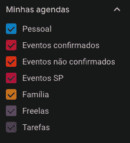

My agendas, they're in Portuguese because I'm Brazilian

*因为日历是葡萄牙语的，我将把翻译的名字放在列表中，原始的名字放在括号中:*

*   **个人(Pessoal):** 这是标准日历，我将其重命名为我的个人日历。我在上面标出了我所有的个人承诺和那些不适合任何其他日程的承诺。
*   **已确认的活动(Eventos confirmados):** 在这个日历中，我标记了我确定会参加的活动，比如聚会、讲座、会议、网络研讨会、播客...
*   **未确认事件(Eventos no confirm ados):**以下是我已提交演讲提案或即将参加但尚未完全确认的事件的*【保存日期】*。
*   SP 活动(Eventos SP) :在这个日历中，我标记了我将参加的其他活动，但不是作为演讲者或工作人员，而只是作为听众。这是在圣保罗组织活动的几个人的共同议程，因此它更多地是作为避免在同一天安排活动的指南。
*   家庭(Família): 这是我与父母和其他家人分享的日程，这样我们就可以知道每个人都在忙些什么。
*   自由职业者(Freelas): 这是一份日程安排表，安排附带项目的交付日期以及与客户的重要会议。
*   任务 **(Tarefas)** :这无疑是最重要的议程，因为这是我将任务与待办事项同步的地方。

### 加点颜色

当您为日历和任务添加颜色时，识别和检查正在发生的事情会容易得多。这样就有可能更清楚地看到什么占据了你更多的时间。

通过我的日历的颜色可以看到哪些属于哪个类别:

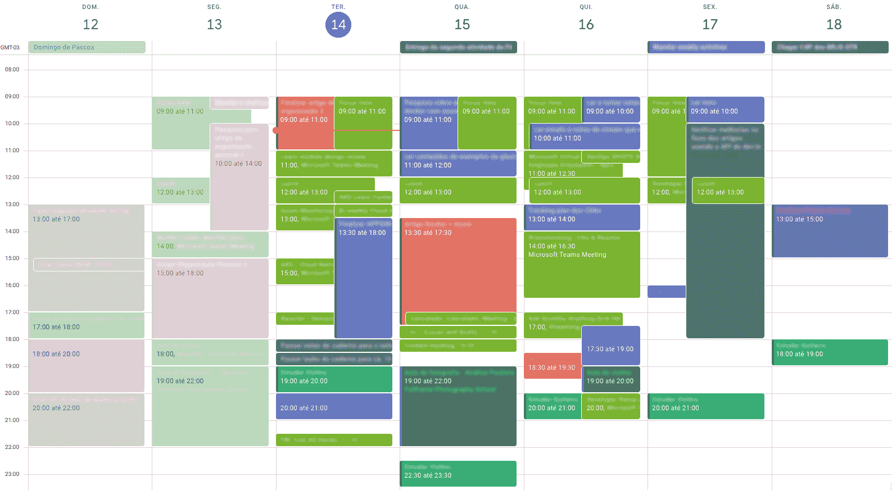

请注意，在其他任务的左侧有一些任务，这是因为它们是最初添加到日历中的项目，具有该类别的颜色。您可以看到那些带有灰色边框的项目已被添加到“任务”日历中。但是我自己涂了另一种颜色。我通常按类别给每一件物品涂上颜色，所以我马上就知道在特定的日子里我需要做什么。

此外，给日历上的项目着色可以帮助你了解你在哪里花的时间最多。例如，日历中非常常见的浅绿色项目是我工作会议议程的一部分(所以你可以看到我的日子几乎都被会议渗透了)。

Outlook 还允许你[添加图标](https://www.slipstick.com/outlook/calendar/add-charm-outlook-meetings/)到你的事件中，使它们更容易被找到。

### 超越任务

在日历上规划任务不仅仅包括创建项目并将其放在日历上。还有其他需要考虑的因素:

*   行程时间
*   无法预料的
*   到达该位置的便利性
*   距离

所有这些都需要考虑，这样你的计划才是高效的。这里有一些关于如何超越你需要做的事情的重要话题:

*   **测量行程时间:**有些日历(比如苹果的 iCalendar)有添加行程时间的功能，所以事件中填充了一点额外的时间，构成了到该地点的行程时间。如果你的日程中没有这个，那就另外制定一个旅行计划，或者试着总是考虑到所有离家在外的任务都需要一些时间，直到你到达目的地。
*   使用地址:只要有可能，写上活动将要发生的地址。这样大多数时刻表已经可以让你提前知道到达目的地需要多长时间。
*   15 分钟规则:总是在你的日历上标记出比实际开始时间早 15 分钟左右开始的项目，这样你就不会迟到了。
*   **利用通知:**在事件即将发生时添加通知，而且总是多个！这可以按默认时间表和按事件进行配置。

### 不可预见的事件发生了

随时准备重新审视你的时间表，重新组织你每天的任务。不可预见的事件会发生，计划会改变，所以议程永远不会一成不变。你需要在你能做的任何事情上有一定的灵活性。

改变你的日程并不是缺乏计划。相反，适应正在发生的事情的能力显示出非常高的个人组织能力。

### 沿着路往下看

不要坚持只安排下周发生的事情。计划和安排**所有**将要发生的和已经有日期的事件，包括下一年将要发生的事件。

### 没有不好的时间表

没有不能计划的任务。从你最不喜欢的会议到最大的会议，总是把所有的会议都放在你的日程上。记住:*“不在日程上，就不存在”*

#### 安排你的空闲时间

正如我们之前说过的，安排好自己的时间是非常重要的。所以享受并安排好空闲时间，这样你就不会在这段时间里安排其他事情。

此外，总是在你的个人和公司日历中安排你的午餐时间。这样，其他人(甚至你自己)就无法在这些时间安排事情。

### 合理安排时间

那个会议从来不会在上午 10 点整开始...多么令人沮丧。和其他人一起工作总是很复杂，所以尽你最大的努力坚持你计划的时间。

但是，在你的任务之间，一定要给自己一些时间，这样你才不会不知所措。

### 聚焦时间

每天，试着安排一些时间来集中注意力。在这段时间里，只把自己奉献给预定的事情。也就是不回消息，不回邮件(当然，除非这些是你的重点任务)。

Outlook 有一个名为 Insights 的扩展功能，除了其他非常酷的功能之外，它还允许你安排每周的专注时间。除此之外，还有其他程序，比如 [RescueTime](https://rescuetime.com) ，可以让你分析自己的日常工作效率:

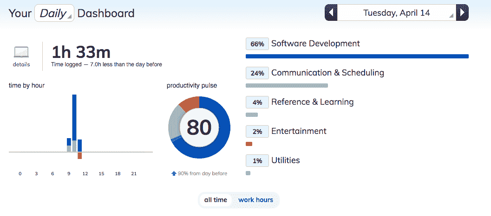

这给我们带来了另一个重要的话题。

### 寻找对你有帮助的工具

我给生活带来的最重要的箴言是，我们必须保持事情简单。这意味着我们应该只使用少量但有效的工具。

几个月来，我搜索并测试了几个工具，其中一些工具并没有给我带来多少好处。但是我发现其他的，比如[洞见](https://docs.microsoft.com/workplace-analytics/insights-in-outlook?WT.mc_id=blog-fcc-ludossan)和[改期](https://rescuetime.com)，让我看到了超级有趣的东西。

### 了解你的时间

除了要有见解，看到更大的图景也很重要。其他工具如 [WakaTime](https://wakatime.com/) 可以让你精确控制你在做什么，在哪里花大部分时间(以及同时你在做什么)。

像这样的工具可以帮助你获得如何改进你个人组织的想法。

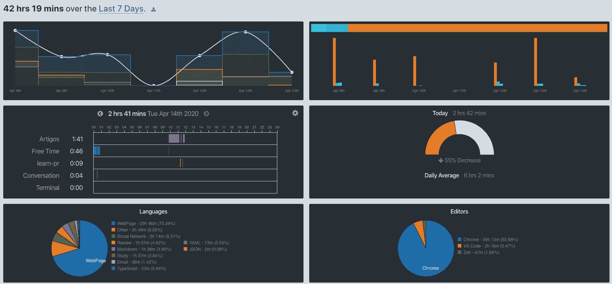

在 [RescueTime](https://rescuetime.com) 的情况下，它为你的电脑、手机和平板电脑提供了扩展，可以分析你做的事情类型，并将它们归类为有效时间或无效时间。

这一切都是可配置的，例如，可以显示你一天中拿出手机看了多少次。这也有助于你设定一周内可以努力实现的目标。

需要注意的是，这些工具是基于数据工作的，所以你需要使用很长时间(至少两个月)才能决定它们是否真的工作。所以，给他们时间调整。

## 电子邮件

个人组织的大反派之一？电子邮件。在过去的 20 年里，电子邮件已经成为最流行的交流方式之一。然而，它们不仅填满了你的收件箱，也占用了你的时间。毕竟，他们人多...

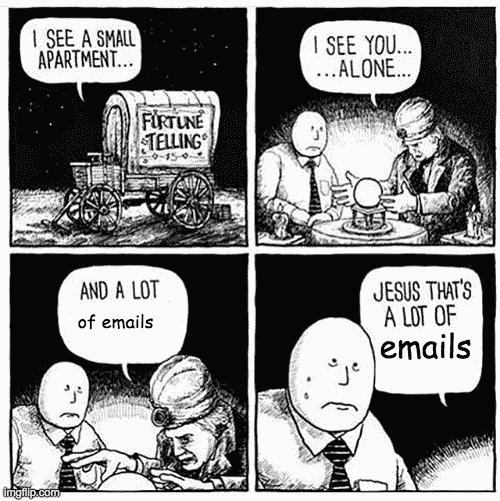

时间和必要性促使我们开发了一种处理电子邮件的方法，称为[零收件箱](https://blog.trello.com/br/inbox-zero)以及[其他重要技术](https://www.microsoft.com/en-us/microsoft-365/growth-center/resources/7-email-management-tips-to-achieve-inbox-zero?WT.mc_id=blog-fcc- ludossan)。

### 收件箱零

所有的邮件都是需要行动的任务。作家兼播客 Merlin Mann 在很久以前创造了收件箱零模式，直到今天，它仍然是处理电子邮件最有效的方式之一。

这个方法的目标很简单:每天清空你的收件箱，这样你就不会有任何悬而未决的问题。

为此，所有电子邮件都有四个可以采取的操作:

*   **排除:**是不是没有办法了？你不担心吗？你再也不需要回复这封邮件了吗？删除或存档——永远记住[永远不要在你的收件箱里留下一封已读的邮件](https://www.simpletivity.com/blog/why-you-should-never-leave-email-in-your-inbox)。
*   **代表:**如果你收到了这封邮件，但你不是解决需求的最佳人选，那么请将这封邮件转发给其他能够解决需求的人。这并不意味着你会自动成为经理。[在这篇 2016 年的文章](https://www.psychologytoday.com/us/articles/200603/how-get-organized-finally)中，个人组织者 Mia Lotringer 表示，尽可能将球传给邻居，避免出现悬而未决的问题，这一点尤为重要。
*   发送/计划:电子邮件的延期——或者，我喜欢称之为计划——是旧的(但却是金色的)谷歌收件箱中最酷的功能之一，它完美地应用了*收件箱零*技术！如果回复邮件的时间超过了两分钟，那么你最好把它推迟到一个特定的日期，这样你就可以冷静地回复邮件，并准备好体面回复所需的所有物品。如今，Gmail 和[的新 Outlook](https://support.microsoft.com/en-us/office/the-new-outlook-for-mac-6283be54-e74d-434e-babb-b70cefc77439) 都有邮件延期功能。不过，我喜欢做得更深入——除了推迟发送邮件，我还在我最喜欢的任务系统中为它添加了一个任务(Gmail 和 Outlook Web 都是如此)。
*   **Do:** 否则，如果邮件回复时间不到两分钟或者可以马上回复，就不要浪费时间去移动了，回复并归档就好。

### 零计划你的收件箱

像任何任务一样，收件箱零是一个需要每天执行的动作。但是大多数人都有一天检查几次邮件的习惯。哥伦比亚大学的研究人员已经证实，一天检查三次电子邮件可以大大降低你的压力水平。

就我而言，我通常在早上九点开始工作时检查一次电子邮件。整个过程不超过 30 分钟，所以在上午 9:30 我已经有空了。在那之后，我会在午饭后，下午 1 点左右，最后在下午 5:30 左右，在标记一天结束之前，再检查一次。

### 电子邮件是任务

不要忘记每封邮件都要求采取行动。这个动作可能很快，也可能很耗时。如果这个行动需要时间，它就会变成一个必须在你的任务系统中安排的任务，并且**被放在你的日程**上。

## 任务

我们现在已经到了每个人都认为问题所在的地方:任务列表！有几种经过充分测试的方法可以帮助你让你的个人组织运转起来。

最初，我们可以说任务列表是非常必要的，因为当我们有一个需要做的客观和具体的事情的列表时，人类会适应得更好。这样我们就不需要总是思考。

你的任务应该是:

*   简单的
*   简明的
*   坦率的

### 选择您的工具

以下是一系列用于组织任务的工具。正如我之前所说的，找到效率的秘诀是使用尽可能少的你用得好的工具。这种效率来自于整合您的工具，使它们作为一个整体工作。

让我们从我们之前提到的日历系统的本地工具开始。

*   第一个是[微软要做的](https://todo.microsoft.com/?WT.mc_id=blog-fcc-ludossan)，它已经[集成了【Outlook，因此也集成到了日历中。除了与](https://support.microsoft.com/office/use-microsoft-to-do-with-tasks-from-outlook-c7a0253d-b8cc-4054-b94b-c194e0e5308a?WT.mc_id=blog-fcc-ludossan) [Insights](https://docs.microsoft.com/workplace-analytics/insights-in-outlook?WT.mc_id=blog-fcc-ludossan) 很好地集成之外，它还有移动应用。
*   然后我们有[谷歌任务](https://support.google.com/tasks/answer/7675772?co=GENIE.Platform%3DDesktop&hl=en)，它也集成了 Gmail 和谷歌日历，并且有移动应用程序。
*   最后，我们有苹果的[提醒](https://support.apple.com/en-us/guide/reminders/welcome/mac)，它们执行相同的功能。虽然它没有直接与日历集成，但它是同步的，并且是所有苹果设备的原生功能。

这三个工具构成了可以完成的最简单的集成，因为它们是平台本身固有的。如果你是初学者(甚至已经组织过一段时间)，我推荐从这里开始。

对于那些想要遵循更像看板的模型的人来说，还有其他选择，比如 [Trello](https://trello.com) 。看看这个。

然而，当我第一次开始从事个人组织工作时，这些应用程序还不存在。所以我最后去了另一个工具，这仍然是我最喜欢的工具之一: **[Todoist](https://todoist.com)** 。

对我来说，Todoist 是正确的选择，因为它非常简单。它只是一个任务列表，允许您包含某种类型的标签并创建几个类别，这些类别称为项目:

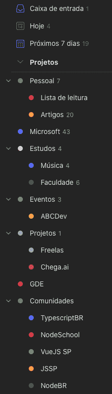

我在寻找一个系统，在那里我可以写下我所有的任务，设置截止日期并被提醒。托多伊斯给我的比我需要的多得多。

除了拥有优秀的网络、桌面和移动应用，它还集成了谷歌日历。这意味着我在私人日历上创建的所有事件都将成为 Todoist 中的任务，而 Todoist 中的所有任务都将成为我的日历中的项目。

此外，它允许您标记您的任务，以便以后更容易地找到它们。此外，如果您与多人一起参与一个项目，则可以与其他用户共享一个或多个项目，供每个人使用。

## 关于工具的小技巧

以下是我在使用各种任务管理应用时获得的一些小技巧。

### 你有一个极限

无论是时间限制还是认知限制，我们每天能完成的任务数量都是有限的。我们不能强迫自己在一天之内同时做太多复杂的任务。

而这个极限是我们每个人自己定义的，没有什么神奇的数字。不要试图在一天内完成 25 项任务，因为你最终不会完成所有的任务。这会给你一个错误的印象，你没有组织好自己。

为了找出你每天的极限是多少，试着运用 [Scrum point 技术](https://www.atlassian.com/agile/project-management/estimation)，根据任务的难度给每项任务贴标签。在一周结束时，计算**全部任务**的分数并记下来。月底的时候，对你记录的分数做一个平均，你就会有你估计的分数了。

### 测量时间

我们能为自己的个人组织做的最有帮助的事情之一是衡量我们在每项任务上花费的时间。我们可以用像 [Toggl](https://toggl.com) 这样的工具来做这件事——顺便说一句，它有[一个充满令人惊奇的漫画的博客](https://toggl.com/blog/tag/comics)——并且精确地测量我们在我们执行的每项任务上花了多少时间。您也可以将该工具与 Todoist 或其他工具集成。

然而，从我的角度来看，当我们在做个人组织时，时间测量有点太极端了。这是因为，至少对我来说，它没有给我任何有趣的见解，我经常忘记启动计时器。

### 越详细越好

正如我们之前说过的，你的任务应该简单，但同时要简洁。所以，尽量让你的待办事项标题非常具有描述性，但不要写得太多。然后，您可以对任务进行评论，并附上执行任务所需的所有内容。

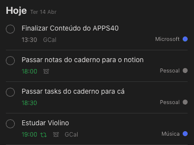

Describe your tasks in a way you can understand them later

对于其他的任务管理工具，我不能说太多，因为我从来没怎么用过，但是 Todoist 允许我们给任务添加评论和附加文件。

所以，在创建一个任务时，用一个简洁明了的标题来描述它，但是要留下尽可能详细的注释。还要附上所需的任何文件，即使这些文件已经在别处。

让我们跳到一个例子:我收到了一封关于一个文档的电子邮件，我需要审阅并将其返回给发件人。但是，在我审阅完文档后，我需要请其他人也审阅该文档。那么我的任务流会是怎样的呢？

1.  创建一个具有预定日期和时间的任务“分析来自电子邮件 X 的文档”
2.  我会在 Todoist 的项目中添加任务
3.  我会注释掉任务的上下文——这样我就可以在任何时候回到它，我就知道发生了什么，我必须遵循的上下文是什么
4.  将文档**和电子邮件**附加到任务
5.  创建另一个任务“将文档发送给 Y ”,并通过写下电子邮件和我必须在同一评论中发送答案的人来评论该任务的上下文

### 分步解决

正如我们在开始时看到的，人类的注意力持续时间大约是 20 分钟，所以我们不能创建太长的任务。为了帮助解决这个问题，大多数工具都为我们提供了一个子任务系统，我们可以在其中包含一个更大的任务和几个小任务。

让我们以前面的例子为例，用一种更有条理的方式来做:

1.  创建一个带有预定日期和时间的任务“分析来自电子邮件 X 的文档”
2.  我会将任务添加到 Todoist 项目中
3.  我会对任务的背景进行评论，这样我就可以在任何时候返回到任务，我就会知道发生了什么，我必须遵循的背景是什么
4.  附件**任务中的邮件**
5.  我创建了一个子任务“分析文档 Z”
6.  将文档附加到任务
7.  我创建了另一个子任务“将文档发送给 Y ”,并通过在同一条评论中写下电子邮件和我必须将答案发送给的人来评论该任务的上下文

我们可以创建另一个子任务，在一段时间后跟踪这个人，甚至创建另一个子任务来重新分析和响应。都有预定的日期和时间，并包含在同一个项目中。

## 笔记和其他东西

除了我们必须做的事情，重要的是知道我们目前正在做什么，并做笔记。而且，比记笔记更重要的是，我们应该简单有效地保存这些笔记，以便我们以后可以回头再看。

在这一部分，我将列出我用过的工具，但是你必须选择最适合你的。

### [Github](https://github.com)

如果你有学习笔记或者任何公开的，甚至是私人的东西，你可以把它们保存在 GitHub 的仓库里——就像 [I do](https://github.com/khaosdoctor/my-notes/) 一样——它们将会是安全的和版本化的。

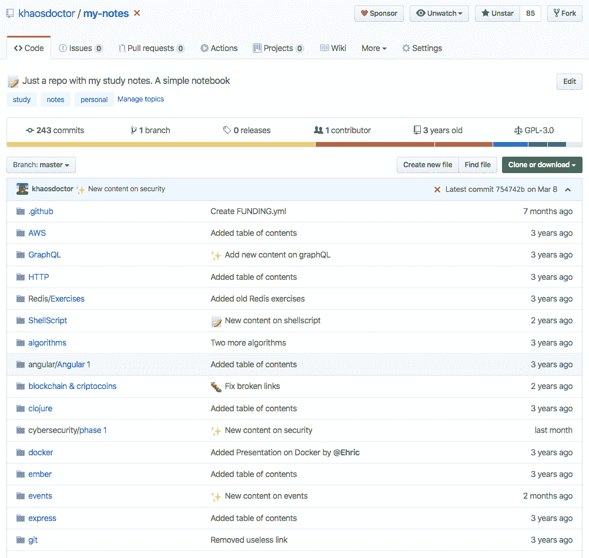

### [Google Keep](https://keep.google.com)

Keep 是一个在便利贴上整理笔记的优秀工具——它甚至支持待办事项！在迁移到另一个更适合我的工具之前，我个人使用了很长时间。

在我看来，Keep 是功能性和简洁性之间的平衡。问题是它有点重，而且没有那么多功能。

### [观念](https://notion.so)

我使用 Google Keep 很多年，直到我发现了 idea。这本质上是一个包含一切的工具。可以做表格，日历，计划项目，什么都可以。这真的是一个非常好的工具，今天它是我需要保存的任何东西的首选工具。它有适用于任何平台的应用程序。

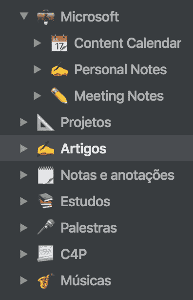

我今天使用这个应用程序来组织我正在写的内容列表(包括这篇文章)以及我将在未来写的内容。我会记录下我的演讲和想法，流，我想练习的歌曲，其他重要的笔记等等。

> 不，这篇文章很不幸地不是由观念赞助的？

content 的另一个好处是，您可以从其他工具本地导入内容，并且您还可以依靠一系列模板来创建您想要的内容，而不必考虑太多:

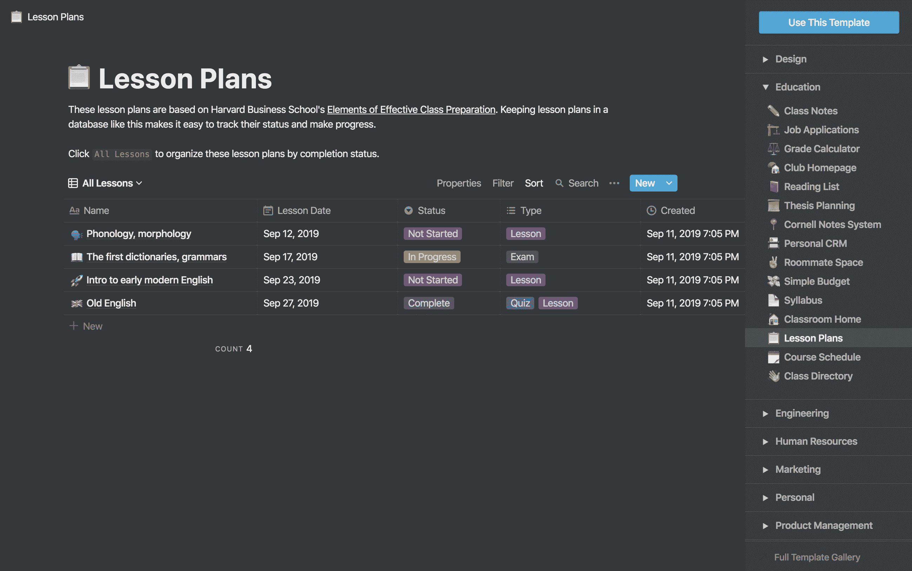

它还具有多种定制形式，包括动态组织过滤器:

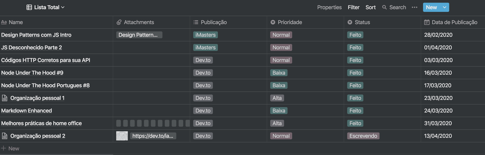

是的，我推迟了这篇文章的发表...但是不可预见的事情会发生，你需要做好准备。

### 本地笔记

您还可以在电脑/手机上使用本机 notes 应用程序。就苹果而言，我们谈论的是笔记，但所有手机都有一个原生的笔记应用程序。

# 方法学

既然我们已经讨论了工具、最佳实践、技巧和诀窍，那么让我们开始组织自己的方法。

方法论是对一种方法的研究，或者说是对达到最终目标的途径的研究。方法论帮助我们以一种更有组织和更具体的方式而不是试错的方式遵循一条道路。毕竟，它们恰恰是对这些尝试的研究。

很重要的一点是，如果一种方法完全符合你正在做的事情，那么你很可能做错了。这是因为方法论的建立是为了给我们一个如何行动的指南，而不是规定我们应该如何执行我们的任务。在大多数情况下，需要根据您的需求对方法进行调整甚至修改。

### 为什么要使用方法论？

多年来，我试图组织自己，我试图创造方法和活动，使我在个人组织中更有效率。但这并不总是最好的方法——我们经常发现非常有效的方法，但不切实际，反之亦然。

过了一段时间，我发现其他人和我有同样的问题，并且在如何对待这些问题上有不同的想法。所以我开始学习更多的方法论。

## 组织方法

一般来说，任何从事软件开发的人都非常习惯于[敏捷开发方法](https://docs.microsoft.com/azure/devops/learn/agile/what-is-agile-development?WT.mc_id=blog-fcc-ludossan)、[敏捷](https://docs.microsoft.com/azure/devops/learn/agile/what-is-agile?WT.mc_id=blog-fcc-ludossan)、 [Scrum](https://docs.microsoft.com/azure/devops/learn/agile/what-is-kanban?WT.mc_id=blog-fcc-ludossan) 、[看板、](https://docs.microsoft.com/azure/devops/learn/agile/what-is-kanban?WT.mc_id=blog-devtfcco-ludossan)以及其他著名的方法论。这些敏捷方法也可以让你的生活非常非常好...敏捷。

这就是为什么很多时候，个人组织从这些方法中“借用”生产力技术，这些方法是为了帮助人们在短时间内完成大量工作而创造的。我认为最成功的方法是:

*   [Scrum](https://docs.microsoft.com/azure/devops/learn/agile/what-is-scrum?WT.mc_id=blog-fcc-ludossan)
*   [中的“T1”](https://docs.microsoft.com/azure/devops/learn/agile/what-is-kanban?WT.mc_id=blog-fcc-ludossan)

然而，随着时间的推移，人们开始采用最初为完整团队创建的敏捷方法，并将它们转变为管理和完成任务的个人方法。因此出现了其他方法，最著名的是 [GTD ( *把事情做好* )](https://blogs.partner.microsoft.com/mpn/work-smarter-not-harder-getting-things-done/?WT.mc_id=blog-fcc-ludossan) 。

此外，诸如使用[番茄钟](https://francescocirillo.com/pages/pomodoro-technique)之类的一些技术已经被开发出来，并且可以与一些方法相结合以获得更有效的结果。

让我们来谈一谈每一个以及如何应用它们。

### 个人组织中的 Scrum

Scrum 是一种敏捷的持续反馈方法。在这个过程中，一个产品所有者、一个 Scrum Master 和一个开发团队对一个产品进行进化迭代，这样它就可以在客户参与的每个过程中一起开发。这不同于旧的*瀑布*模型，它是基于一步一步的过程。

团队被组织成冲刺阶段，可以持续 7 天、14 天或更长时间。在这些 sprint 中，所有要在*时间框架*内执行的任务都已经描述好了，在下一次 sprint 之前，其他任何事情都不能改变。

每天团队举行 15 分钟*的每日站立会议*，在冲刺结束时，团队进行回顾和回顾。

当然，我们没有办法将团队会议整合到我们的个人组织方法中，除非你有与自己讨论事情的天赋。但是 sprint 模型被广泛使用(在一些帮助下)来帮助我们进一步改善我们组织时间的方式。

以下是我们在开发方法时可以考虑的几点:

*   使用 7 天冲刺。也就是说，在周日计划你的整个一周
*   使用冲刺点(我们在前面的段落中谈到过)来衡量你每次冲刺完成的任务数量。这样你就会知道什么时候你超过了你的极限。
*   记住:**不可预见的事件发生**，所以放松在 sprint 中不改变任何东西的规则，这样它允许在一周内增加和删除。
*   可选地，在 sprint 结束时，做一个回顾，检查你那一周做得好或不好，这样你就不会在下一周重复错误。

### 个人组织中的看板

看板是另一个有趣的模型，经常和 Scrum 混合在一起。在这个模型中，可视化是关键，所以我们有所谓的*看板*，如下所示:

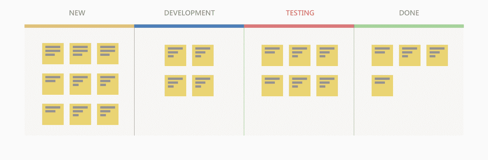

整个看板方法基于流程控制。因此，人们不是让别人告诉你做什么，而是把他们的需求放在待办事项列表中，团队会在有空位时接受并执行任务。

这是因为，在看板中，我们一次能做的工作是有限度的，通常一个人不能同时做两个以上的任务。

这就是为什么董事会是必要的。对于那些管理项目的人来说，有一个关于什么被阻塞了，什么正在被做，什么需要被做的视图提供了有趣的洞察力。

同样，如果只有你一个人，你就不是在一个团队中工作，所以方法的某些部分，比如让某人生产和请求添加到 backlog 中的任务，必须手工完成。所以这里有一些其他的建议:

*   用一块板来组织你的任务
*   列出所有需要做的事情，并在任务到达时添加
*   每当有新任务添加到待办事项列表中时，重新排列其优先级
*   利用工作限制来集中注意力

# GTD

GTD(把事情做完)是由美国人大卫·艾伦创立的，他致力于发现如何变得更有效率。在我看来，事实上，GTD 与其他方法相结合是一种非常有效的方法。

GTD 分为几个步骤:

1.  **捕捉**:获取需要完成的任务或行动，并以更可靠的方式写下来，就像我们在前面几段谈到的那样。
2.  **阐明**:你用来定义和描述所有任务的时间。
3.  **组织**:保持列表的有序性，并且易于访问
4.  **反映**:审查任务并确定优先事项
5.  **参与**:开始工作

你不必严格遵循所有的步骤。例如，我一天中没有一个时刻能理清所有的任务，因为我永远不会记住所有的事情。所以，我同时捕捉和澄清。组织和反思也是在我向列表中添加任务的时候完成的(这是我从看板借鉴来的)。

下图很好地解释了整个方法:

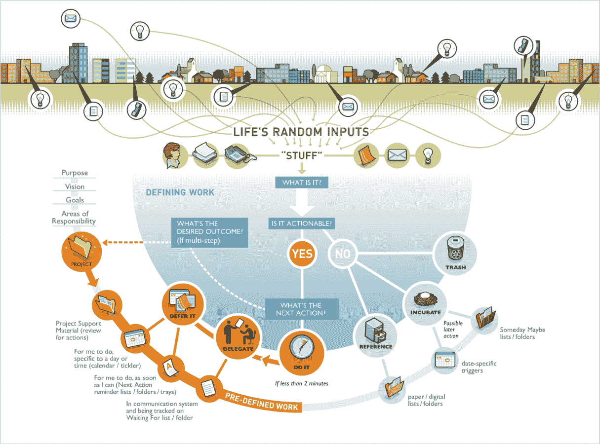

GTD in one diagram

我们不断地从环境中接收信息，包括新的任务和日常用品。当我们收到这些信息时，我们必须思考:“我能做些什么吗？”，如果答案是“否”，那么你有三个选择:

*   扔掉:你永远不会用这个(垃圾邮件或类似的东西)
*   **提醒**:你可能会在某个时候用到这个，并且已经知道日期。因此，您可以将此任务推迟到您认为会用到它的时候
*   **参考**:如果你认为这个东西会是参考资料(一份文件、证书)，把它存放在一个非常井井有条的地方，这样你就可以超级快地找到它。

如果您有可以在任务上执行的操作，让我们回到上一篇文章，在那里我们可以对该任务执行三种类型的操作:

*   如果不到 2 分钟，就去做！
*   委托:一旦你委托了，就为将来的某一天创建另一个后续任务
*   **推迟**:当我们不需要立即采取行动，但我们知道将来会需要的时候

请注意，我们正在应用 *inbox zero* 技术，这是我们在本方法的技术开始时看到的。也就是说，我们正在调整每个人的技术，以便他们作为一个整体更好地工作。

GTD 的另一个有趣的概念是“项目”。任何需要一个以上的步骤来完成的任务被称为项目。这些项目是需要手头有所有必要信息的任务组。

# 番茄吗

最后，我们不打算谈论一种方法论，而是一种技术。Pomodoro 是 Francesco Cirilo 在 80 年代创造的。

这是一个有点激进的技巧:它要求你必须在 25 分钟内完成你的任务。也就是说，对于每项任务，你需要至少 25 分钟完全不受干扰。这个时间段被称为*番茄大战*。

吃完番茄后，你要休息五分钟。四个番茄之后，休息 30 分钟。这种方法可以和前面的任何方法结合来提高你的效率，因为它避免了拖延。

每当你完成一项任务，写下你吃了多少番茄，然后把它从清单上划掉。随着时间的推移，这有助于了解你完成任务需要多长时间。

然而，像任何方法一样，它有优点也有缺点。最大的缺点之一是，如果你处于一种“流动”状态，一切都在流动，你在持续生产，计时器可能会在你的生产力中途终止。那么你可能要花更长的时间才能回到原来的地方，甚至完全失去这个想法。

在这些情况下，理想的做法是将番茄的时间调整到更长的跨度，这样你就可以集中精力，不受任何干扰。

# 习惯

正如本文开始时已经明确的那样，习惯非常重要。拥有最好的组织方法却没有查看列表的习惯是没有意义的。

一个习惯大概需要 21 天才能养成，并且无法去除，只是被另一个习惯取代。所以，为了养成习惯，我们可以用自己的意志力，强迫自己连续 21 天不间断地做我们想做的事情。但这对每个人来说都很难，所以我们都可以利用一点帮助。

有几个工具可以帮助我们培养习惯，其中之一是 [Habitica](https://habitica.com/static/home) ，它可以将你的生活变成一场 RPG 冒险。

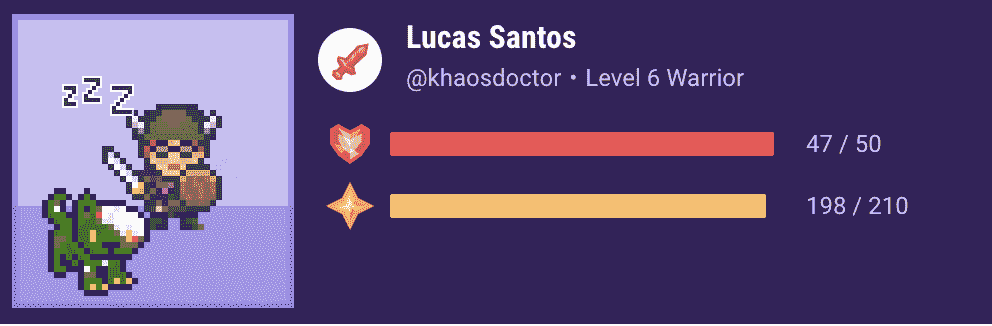

它还有一块板，可以让你定义自己的习惯、任务以及每天想做的事情:

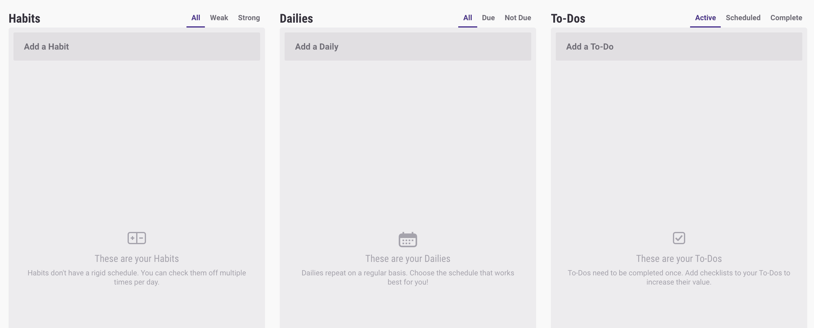

# 创造你自己的方法

最终，这将归结为创造你自己的工作方式。不要担心严格遵循所有方法论的思想，因为那是行不通的。理想的情况是，当你应用你自己的方法时，你调整它们中的每一个，并寻找使你更好地组织和感觉良好的部分。

就我而言，我试图遵循 GTD 的方法。所以每当我在做一件非常重要的事情时，我会关掉所有的电子设备，全神贯注，直到完成任务。这或多或少有点像番茄工作法，但没有计时器——因为我已经使用了这种技术，但我不太适应休息时间。

每当我有新任务或新邮件时，我都会经历信息图描述的过程，但我没有任务的“孵化器”。我可以简单地做或不做，没有完成的任务最终会被扔进垃圾箱。

此外，我所有的任务都有一个时间和日期设置——我从不把任务放在“越快越好”。如果任务很紧急，必须在任务结束后马上完成。

为了组织自己，我通常会不断修改我的日历，以适应任何变化，我也一直在努力改进它。最近这不是很有成效，所以我打算做一个改变，这样我就可以每周应用一个量化评估(比如冲刺点)，每周日回顾，这是我计划下一次冲刺的时候。

我不喜欢 GTD 的“项目”,因为它对我来说没有什么意义。因此，在 Todoist 中，我最终使用项目作为类别来定义我致力于什么样的工作，例如:研究、个人、文章等等。

最后，我喜欢保持看板的想法，所以我将所有的任务组织在一个“收件箱”中，这将是我的待办事项。在那之后，我一个接一个地搜索任务，并把它们分类，直到盒子里没有新任务。

此外，我不会一次计划一个星期。我试着组织这些任务，这样它们至少能填满两到三个星期。我总是填写一个简明的描述和一个表达性的标题，帮助我记住我每时每刻需要做什么。

# 结论

没有最好的方法论，因为最好的就是适合自己的。试着把每一种都混合一点，创造出最好的效果，不要害怕测试和犯错误。毕竟，一切都在你掌控之中。

一旦你达到了个人组织的理想水平，你就会知道你的整个生活都是有组织的。而且，不管怎样，只要你继续完成你的任务，你就会知道一切都会好的，因为这是你计划好的！这是终极目标。

我希望我的故事和建议能帮助你们中的一些人变得有条理。如果你有其他建议，请告诉我。让我们一起创造更好的方法论！:D

我也有一个[个人博客](https://blog.lsantos.dev) ，在那里我发表了很多关于发展的内容和我自己的想法。如果你想和我谈谈，你可以访问那里或者我的[网站](https://lsantos.dev) ，那里有我所有社交网络的链接。请随意关注并伸出手。

再见！