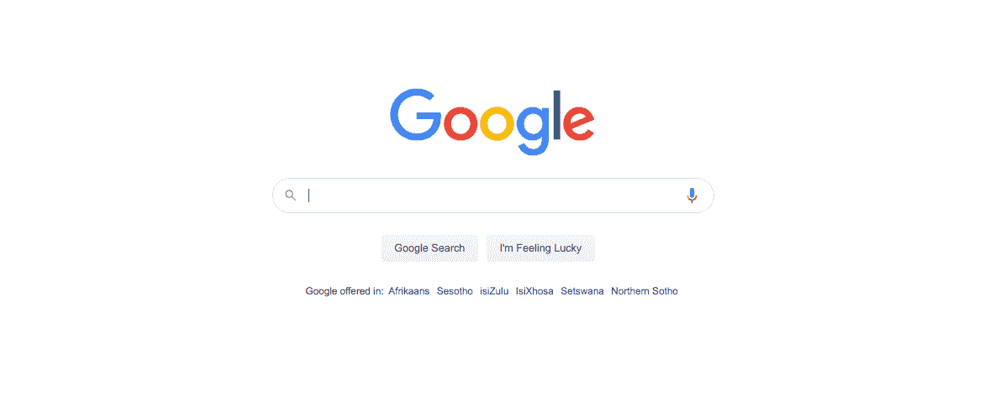
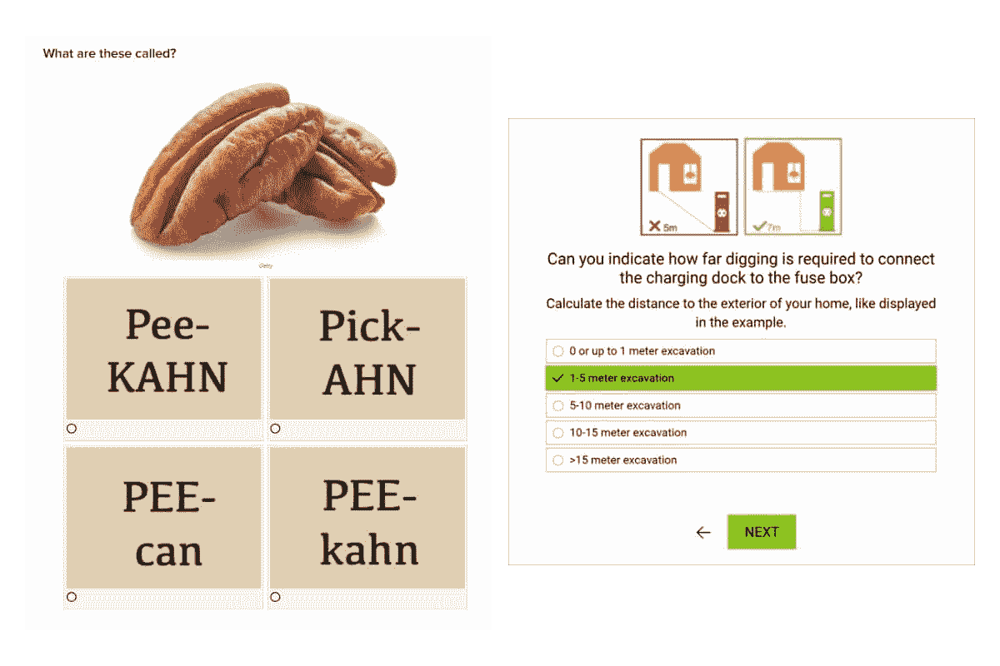
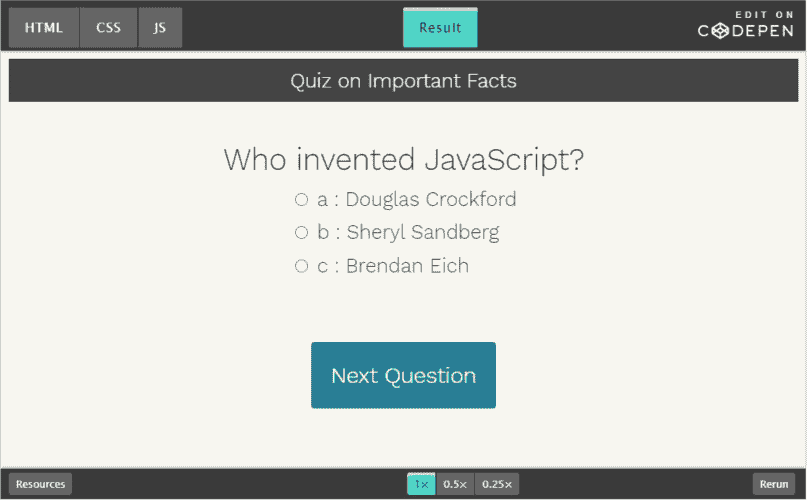
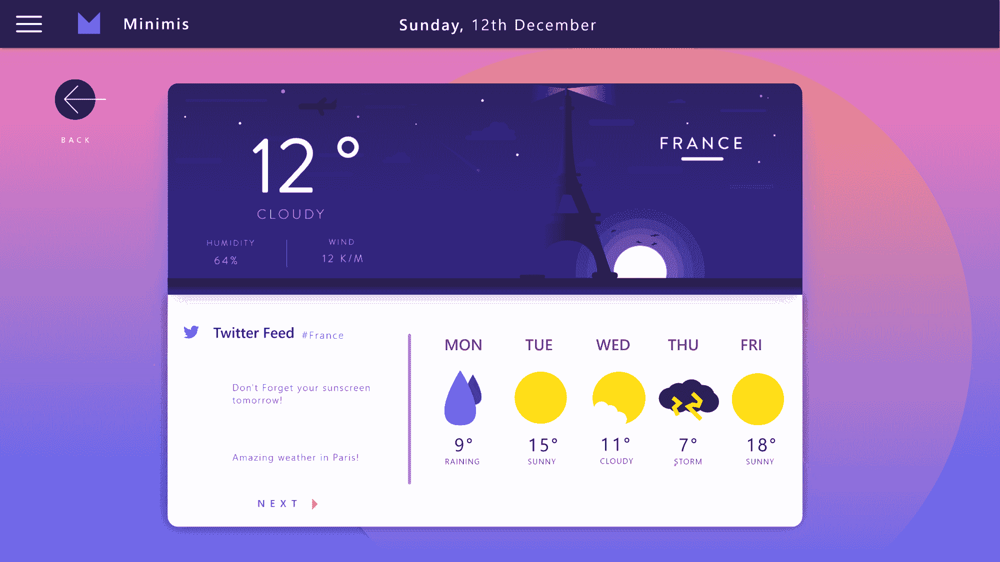
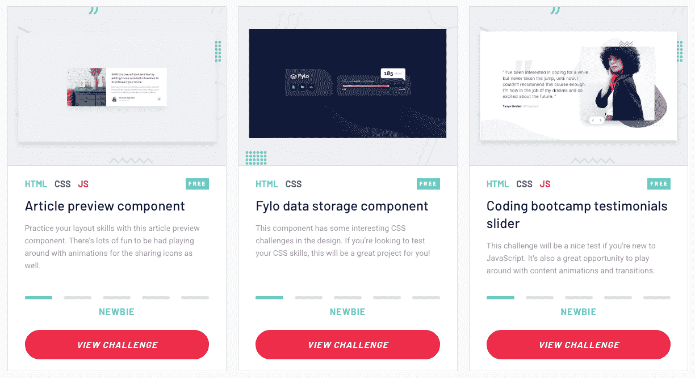

# 如何通过构建项目成为更好的前端开发人员(包括想法)

> 原文：<https://www.freecodecamp.org/news/become-a-better-developer-by-building-projects/>

如果你想作为一名前端开发人员快速成长，没有什么比做真正的开发项目更好的了。事实是，你可以观看世界上所有的教程和课程，但如果没有应用和实践，你就不会真正学到在实际项目中工作所需的技能。

客户项目没有一步一步的指示，因为否则，他们根本不需要你。你必须跳出框框思考，找到解决方案，妥协，然后一路杀到终点线。

学习这些技能最好的方法就是做一些前端的开发者项目，边做边学。最棒的是。你甚至不需要一个客户来开始，因为你可以自己做这些项目。

## 如何选择个人前端开发项目

### 牢记你的技能水平

不要选择对你的技能水平来说太高级的项目，尤其是当事情变得太困难时你会失去动力。但是不要忘记，因为这里的目标是帮助你掌握前端开发，所以选择一个超出你当前技能水平但仍然可行的项目。

举个例子，如果你最近学了 HTML 和 CSS，是时候通过学习 JavaScript 来提升水平了。

### 解决一个个人问题或你关心的问题

如果一个项目能解决你自己的问题或满足你自己的愿望，你也更有可能喜欢并坚持下去。也许你在浏览脸书新闻时总是忘了时间，或者你想要一个可以自动生成迷人的 YouTube 缩略图的网站。

想一个你可以用技术解决的个人问题，并从那里开始。本文中的建议只是一个起点。如果你改变它来增加你独特的变化，那会好得多。

## 4 个有趣的前端开发项目

### 建立一个网站的克隆。

需要学习的技能:HTML、CSS、JavaScript 和/或 Bootstrap。制作一个网站的复制品是探索它是如何构建的，以及学习页面结构、颜色、字体、媒体、表格等基础知识的好方法。尽可能详细地复制原件。

选择一个你喜欢的网站，然后自己复制一个。不要尽可能多地看源代码，以获得最大收益。

克隆谷歌实际上是 [Thinkful 为他们的编码车间学生准备的](https://studywebdevelopment.com/thinkful-bootcamp-review.html)练习之一。Thinkful 是一家教育公司，提供包括 web 开发训练营在内的技术课程。

Thinkful Google Clone

你也可以按照[这个练习](https://www.thinkful.com/projects/karma-landing-page-clone-129/)来帮你克隆一个叫 Karma WiFi 的 app 的登陆页面。它是由 Thinkful 的导师之一 Kyle Koski 创建的，使用 HTML 和 CSS。

克隆一个网站的好处是你可以选择网站的复杂程度。如果你刚刚开始，一个只需要 HTML 和 CSS 的简单网站是一个很好的开始。如果你更高级，选择一个需要 JavaScript 或 React 的网站。

### 创建一个 JavaScript 问答游戏。

需要学习的技能:JavaScript

JavaScript 是一种编程语言，可以让你制作交互式网页。它是你在创建诸如菜单、视频播放器、动画、交互式地图甚至浏览器内游戏等响应式元素时使用的语言。

但是在我们继续之前，知道你为什么想要建立一个测验是很重要的。
不仅仅是娱乐和游戏。作为内容营销工具，测验实际上越来越受欢迎。见过这种东西吗？

Quiz Examples

测验是极好的营销工具，因为它们是互动的。根据内容营销研究所(Content Marketing Institute)的一项民意调查，[% 的营销人员认为，互动内容——任何需要用户参与的内容——比静态内容更能吸引注意力。

由于这个原因，小测验被用于不同的营销目的。像左边这样的小测验是用来增加网站流量的。一些营销人员还使用测验来确认销售线索、细分销售线索并提高参与度。

我解释这一点是因为作为一名开发人员，你的工作不仅是确保东西看起来漂亮，还要创造用户友好的功能，使你的客户的网站更有效地实现其销售和营销目标。

要创建测验，请查看来自](https://www.pointvisible.com/blog/using-personalized-quizzes/) [WebDevTrick](https://webdevtrick.com/create-javascript-quiz-program/) 和 [SitePoint](https://www.sitepoint.com/simple-javascript-quiz/) 的 JavaScript 测验教程。你的 JS 测验可能是这样的:

Quiz example by SitePoint

### 创建您自己的移动 QR 阅读器。

需要学习的技能:JavaScript

条形码和二维码改变了我们购物的方式。顾客现在可以用他们的智能手机扫描一个产品，并找到关于它的各种信息，如价格或在哪里可以买到它。

它还消除了在网站上输入激活码或型号等长码的需要，使他们的购物体验更加轻松、便捷。

和别人想的相反，你不需要一个原生的手机 app 来扫描二维码。

在带有摄像头的智能设备上运行的网站可以做到这一点。

[本指南](https://www.sitepoint.com/create-qr-code-reader-mobile-website/)向您展示创建自己的二维码阅读器的一步一步的过程。

您将使用 HTML 和 JavaScript，但最重要的部分是使用可以解释二维码的 JS 库。好消息是，您不必从头开始创建它，因为有很多很棒的库可以用于这个目的。

### 建立一个天气应用程序。

需要学习的技能:Angular 8

Angular 是与 React 和 Vue.js 并列的三个最受欢迎的前端开发框架之一。它通常用于构建基于表单的应用程序(你必须注册才能创建帐户)，但也可以用于构建游戏，甚至是带有虚拟现实元素的应用程序。

Medium 上有一个非常详细的[循序渐进教程](https://medium.com/@hamedbaatour/build-a-real-world-beautiful-web-app-with-angular-6-a-to-z-ultimate-guide-2018-part-i-e121dd1d55e)，教初学者如何用 Angular 8(Angular 的最新版本)创建一个漂亮的天气 app。天气应用程序是这样的:

Weather App

这个应用程序具有干净，极简的设计，精美的插图和简单的界面。它还有一个漂亮的明暗模式功能，增加了更多的天赋。这个项目的伟大之处在于，你将感受到从头开始构建一个可用的、响应迅速的应用程序是什么感觉。从安装 Node.js 和 Angular CLI 到用 LightHouse 测试代码，您将学到一切。

虽然教程的创作者显然插入了自己的设计偏好，但你可以添加自己的造型，随心所欲地发挥创意。您可以尝试 CSS 样式和动画，甚至使用自己的徽标、图标和其他设计材料。做好这一点，你的文件夹中就会有一个令人印象深刻的天气应用。

点击可以进入教程[。虽然本教程是初学者友好的，但你仍然需要一点熟悉的角度。如果你想学习 Angular，最好的起点是在](https://medium.com/@hamedbaatour/build-a-real-world-beautiful-web-app-with-angular-6-a-to-z-ultimate-guide-2018-part-i-e121dd1d55e) [Angular.io](https://angular.io/start) 上。

### 设计并编写你自己的作品集网站。

在一个典型的项目中，你很可能会和一个决定网站外观的网页设计师一起工作。虽然设计和开发可以说是两个不同的领域，但是掌握网页设计不仅会增加你的技能，而且如果你决定单干，从事从设计到部署的项目，它也会让你有所准备。

设计和编写你自己的作品集网站会给你同时展示你艺术和技术一面的自由。

第一步是想到你的**信息或品牌**。你的核心服务是什么，你想为谁服务，他们为什么要选择你？(点击阅读更多关于品牌[的信息。)

其次是创建一个**模拟设计**，它将详细说明布局、颜色和排版。

也，想到一个主题。是极简主义还是喧闹时髦？是单色还是会用大胆的颜色？然后列出你需要的页面。这通常包括一个联系页面、一些博客文章、一个关于我的页面和一个条款和条件页面。

第三，**码吧**！用现代的 CSS 来布局网站，添加一些动画，添加一些高质量的图片等。天空是这里的极限——你可以用你的投资组合网站做任何你想做的事情，因为它是你的——去做吧！](https://studywebdevelopment.com/branding-freelance-developer.html)

## 哪里可以练习前端开发？

尽管实践前端开发的最佳方式是通过自己构建真正的应用和广告网站，但当你遇到困难或需要意见时，有一个可以获得提示、访问教程和支持的地方仍然很棒。

在您练习前端开发时，这些都是获得帮助的好地方:

1.  freeCodeCamp.org:这是一个网站，里面有很多关于网络开发理论、语言和最佳实践的免费教程。这里还有一个很棒的社区可以帮助解决你的问题。
2.  [现代 HTML & CSS 从头开始](https://click.linksynergy.com/deeplink?id=QqcN8lE0l0I&mid=39197&murl=https%3A%2F%2Fwww.udemy.com%2Fmodern-html-css-from-the-beginning%2F)——这是 Brad Traversy 的 Udemy 课程。它包含了很多有用的信息，可以教你开始学习这些语言所需的一切。
3.  [frontend mentor . io](https://www.frontendmentor.io/)–你可以在这里找到免费和额外的“挑战”,你可以在业余时间进行这些挑战来发展你的技能。挑战难度从“初级”到“高级”不等。以下是您将在此发现的挑战示例:

Frontend Mentor Challenges

我很乐意与你分享更多的资源，但为了避免太长，你可以点击[此链接](https://studywebdevelopment.com/web-development-courses.html)查看我的推荐课程列表。

这是你今天可以尝试的 5 个有趣的前端开发项目。同样，这些只是起点。最终还是要由你来定制它，添加一点你的个人风格:)

记住，这都是练习的结果。你需要构建一些东西来提高你的技能。

> 不要只看着学。
> 
> 通过建筑来学习。
> 
> 边做边学。
> 
> — Kyle Prinsloo (@study_web_dev) [June 24, 2020](https://twitter.com/study_web_dev/status/1275650860454948866?ref_src=twsrc%5Etfw)