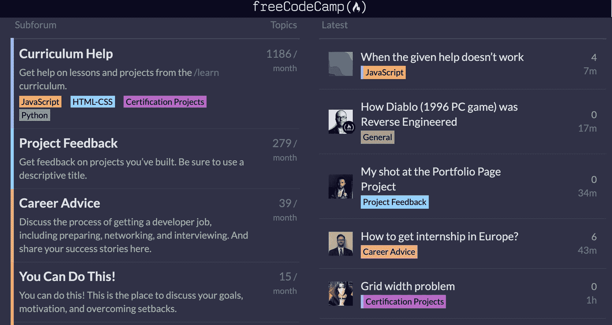
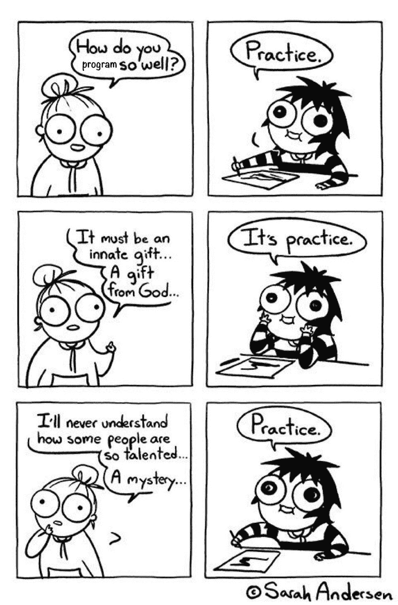

# Python 认证现已上线，其他 freeCodeCamp 版本 7.0 课程更新

> 原文：<https://www.freecodecamp.org/news/python-curriculum-is-live/>

freeCodeCamp 的核心课程现在提供 10 种认证，包括 4 种 Python 认证。

这些认证都是自定进度的，完全免费。您可以在浏览器中构建项目，或者在您的笔记本电脑或手机上编写项目代码，然后部署到云中。

## freeCodeCamp 认证是如何运作的？

所有的课程和项目都是公开的。您甚至不需要创建一个 freeCodeCamp 帐户来访问它们。但是如果你想保存你的进度并最终获得认证，你需要创建一个帐户。

请注意，默认情况下，所有帐户都是私有的。freeCodeCamp.org 非常重视隐私，我们有一个记录完善的隐私政策。您可以在设置中公开您的个人资料，也可以选择公开您获得的任何认证。

以下是这些认证的工作方式:

每个认证包括可选的课程，以帮助您准备其 5 个必需的项目。

当你觉得准备好了，你就可以构建认证的 5 个必选项目，并通过所有的自动测试。

一旦你完成了所有 5 个项目，你就可以进入设置，接受 freeCodeCamp 的学术诚信承诺，并申请你的认证。

你可以立即获得认证，它位于 freeCodeCamp 服务器上的一个永久网址上，你可以把它放在你的 LinkedIn、简历或个人网站上。

我们的机器人最终会审核你所有的项目，检查是否有抄袭或其他形式的学术欺诈。如果我们的机器人标记了任何可疑的东西，我们的团队将手动检查它。如果我们确定你作弊，我们将撤销你的认证，并永久禁止你的帐户。所以不要作弊。你只会欺骗你自己。？

## 有哪些新的认证？

以下是我们在 2018 年推出的 6 项认证。这些关注于使用 JavaScript 的全栈 Web 开发:

1.  响应式网页设计
2.  JavaScript 算法和数据结构
3.  前端库
4.  数据可视化
5.  API 和微服务
6.  质量保证

这些仍然是 2020 年最值得关注的地方，代表着最广泛的编程基础和获得开发人员工作的最快途径。

也就是说，从第一天起，我们就希望我们的课程涵盖许多其他技能。我们很高兴现在将这些作为四个新的 Python 认证添加到课程中。他们在这里:

1.  使用 Python 进行科学计算
2.  使用 Python 进行数据分析
3.  信息安全
4.  用 Python 进行机器学习

同样，这些是更高级的认证。他们假设您已经完成了前 6 项认证。因此对算法、数据结构、API 和其他概念有很强的理解。

我建议你从头到尾完成整个课程，这样你就可以在学习第二种语言(Python)之前真正学好一种语言(JavaScript)。

现在，你可能会想:“但是我听说 Python 比 JavaScript 更适合初学者。”许多人建议先学习 JavaScript 的原因有很多。

这些认证中的每一个都有 5 个必选项目，每个都有自己的测试套件。

这些项目可以建在你想建的任何地方。我们建议使用谷歌的合作实验室进行机器学习项目。这是一个托管的 Jupyter 笔记本工具，它是免费的，可以在浏览器中运行。

对于这些 Python 认证项目的其余部分，我们推荐使用 REPL.it，它快速、免费且易于使用。

这些项目中的每一个都包含一个到样板文件的链接，您可以从中开始。

如果您想在本地计算机上编码这些项目，您可以克隆这些存储库。但是你需要将你的解决方案公开发布在开放的网站上，这样你就可以提交它们并获得认证。

## 7.0 版本的课程中还有什么内容即将推出？

正如我们去年 12 月宣布的那样，我们正朝着完全以项目为导向的课程努力。你将通过构建项目来学习，而不是学习个别的编码课程。

我们正在构建 60 多个可选实践项目，例如:

*   “通过构建角色扮演游戏学习基本的 JavaScript”
*   《通过搭建股票交易平台学习 Express.js》
*   以及“通过构建数据包嗅探器来学习网络安全”

总的来说，完成整个 freeCodeCamp 课程将涉及在 3000 小时的时间内构建 100 多个项目。这大概是获得一个准学士学位所需的时间。

我们正在这些项目上取得稳步进展。我们也在更新我们的学习平台，使这些更精细的项目能够在 freeCodeCamp.org 建立。

一如既往，我们没有这些的发货日期。我们希望他们一准备好就投入生产，而不是更早。？

你会注意到，对于 4 个新的 Python 认证，我们有基于讲座的课程，而不是交互式课程(如前 6 个认证)。这些课程教得很好，我们相信你会从中学到很多东西。请注意，它们是我们即将开展的实践项目的占位符。

如果您发现 Python 认证项目势不可挡，您可能希望使用其他资源来补充您的学习，例如我们数百个关于 Python、数据分析、机器学习和安全性的免费课程和教程。你可以在 [freeCodeCamp 论坛](https://forum.freecodecamp.org)上提出编程问题，并获得关于你的项目的反馈。

A screenshot from our forum

我要感谢几十个善良的 alpha 测试人员，他们成功地构建了这 20 个新项目，并提供了他们的反馈和改进。

所以是的，这些项目是可以建设的。他们的测试可以通过。但你可能是第一批这样做的 100 人左右之一。如果您遇到任何错误或令人困惑的说明，我们鼓励您通过反馈打开 GitHub 问题。

## 即将到来的 60+实践项目的大致时间表是什么？

我们将首先重点推出 4 个新 Python 认证的实践项目。这些将取代每个认证中的占位性讲座。

然后，我们将用实践项目取代前 6 项认证中的互动课程。

请记住，除了目前正在进行的 50 个认证项目之外，所有课程和练习项目都是完全可选的。除非您愿意，否则在我们将它们添加到课程中时，您不必回去完成它们。从今天开始，通过构建每个项目的 5 个必需项目，您可以获得所有 10 项认证。

没有理由推迟开课。这些实践项目将涵盖与当前课程基本相同的技能和工具。它们只会更有趣、更具互动性、更吸引人，通过更多的重复来帮助你更好地记住这些概念。

这些都不是魔法。无论如何，你可以通过自己练习编码和构建项目来学习所有这些东西。学好编码的关键是实践。

Comic by [Sarah Andersen](https://www.facebook.com/DoodleTimeSarah/).

freeCodeCamp 给你一个简单的线性课程，让你以既省时又理智的方式练习。

你可以点击查看完整的 freeCodeCamp 课程及其 10 项认证。

快乐编码。？