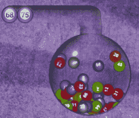

# 如何用 JavaScript 创建吹气效果

> 原文：<https://www.freecodecamp.org/news/how-to-create-a-lotto-balls-blowing-effect/>

你有没有想过如何用 JavaScript 创造出逼真的吹气效果？就像晚间电视节目中展示的那样，利用气压将多个球混合在一个类似球体的物体中？如果你想知道这是怎么做到的，请继续阅读。

✨如果你想跳过阅读直接跳到代码，你会在这里找到它。此外，我已经部署了一个[现场演示在这里](https://tender-hoover-fdc559.netlify.app/)。✨

## 研究

最近，我决定翻新一些我 4 年前为我的项目做的旧东西。下面是它的样子:

Bingo Blower

当时我选择使用一个名为 [Paperjs](http://paperjs.org/) 的库。那个时候，这个库让我建立了最接近我想要实现的东西。

事实证明，现在有更多的 JavaScript 库可以让你制作有物理或没有物理的动画。

在做出我的最终选择之前，你将在下面看到，我玩了一下 [Anime.js](https://animejs.com/) 、 [Velocity.js](http://velocityjs.org/) 、 [Popmotion](https://popmotion.io/pure/) 、 [Three.js](https://threejs.org/) 、 [GreenSock JS](https://greensock.com/gsap/) 、 [Mo.js](https://mojs.github.io/) 和 [Matter.js](https://brm.io/matter-js/) 。它们都有优点和缺点，和其他东西一样，你在它们之间的选择取决于你的具体需求。我选择了 Matter.js。

## Meet Matter.js

Matter.js 是一个 2d 刚体 JavaScript 物理引擎。听起来很复杂，但其实不然。这实际上意味着这个库包含了我们用 JavaScript 创建真实的 2d 物理动画所需的所有东西。

关于 Matter.js 所提供的详细信息，你可以查看他们的[文档](https://brm.io/matter-js/docs/)。在我们的例子中，我们将主要利用[主体模块](https://brm.io/matter-js/docs/classes/Body.html)及其特性。让我们在下一节看看如何实现。

## 球和管

“管”组件很简单。这只是一张背景图片,我用它来创造一种错觉，球在一个类似球体的玻璃物体里飞来飞去。

有趣的部分是创建动画和检测球和墙之间碰撞的代码。不过还是一步一步来吧。

正如我所说，“管子”是我通过简单的 CSS [背景属性](https://developer.mozilla.org/en-US/docs/Web/CSS/background)添加的背景图像。让我们看看球本身。对他们来说，我有两个选择——尝试在画布上画圆，让它们看起来像球，或者使用简单的图像。我选择了后者，因为我想对球有一个更真实的看法。

因此，在图形处理程序的帮助下，我的一个朋友为我制作了 75 张图片，每张图片对应一个球。

有了我们需要的所有资产，我们现在准备更深入，用 Matter.js 实现一些物理学。

## 实施，测试，实施，测试

在进入动画本身之前，我们需要提到一些 Matter.js 特定的事情。当用这个库创建动画时，我们至少需要定义:

*   [物质。引擎](https://brm.io/matter-js/docs/classes/Engine.html) -这是管理世界模拟更新的控制器。
*   [物质。World](https://brm.io/matter-js/docs/classes/World.html) -包含创建和操作世界合成的方法。
*   [物质。这个模块是一个简单的基于 HTML5 画布的渲染器，用于可视化`Matter.Engine`的实例。

    在我们的例子中我们也要用到:](https://brm.io/matter-js/docs/classes/Render.html)
*   [物质。身体](https://brm.io/matter-js/docs/classes/Bodies.html)用于创建场景的不同部分(球，不可见的边界圆)。
*   [物质。Body](https://brm.io/matter-js/docs/classes/Body.html) 用于将力施加到物体上，从而创建一个基于物理的风机模拟。
*   [物质。跑者](https://brm.io/matter-js/docs/classes/Runner.html)跑完全程。
*   [物质。Events](https://brm.io/matter-js/docs/classes/Events.html) 让我们能够监听动画中可能发生的不同事件。在这个特定的例子中，我们使用它来监听“tick”事件，该事件发生在每个渲染 tick 上。
    在事件处理函数中，我们检查球何时与墙壁碰撞，并应用相关的力来创建反弹效果。
    我们将该事件的监听推迟了 3 秒钟，这样我们可以得到更像乐透的效果。想象一个球体，当按下按钮时，球开始移动。

## 试着玩吧

在这篇文章的开始，我发布了到 [GitHub 仓库](https://github.com/mihailgaberov/bingo-blower)的链接，里面有代码和资产。如果你想玩得更多，你可以很容易地检查出来，并尝试不同的修改。你可能想玩施加的力，或者球的大小，等等。

当我们谈论物理时，有足够的空间进行实验。它总是很有趣，尤其是当我们给图片添加动画的时候。

## 结论

事实证明， [Matter.js](https://brm.io/matter-js/index.html) 是一个很棒的库，可以根据物理定律制作 2d 现实动画。当然，还有其他选项可供您选择，但正如我所说，这是一个选择和项目需求的问题。

我个人建议至少亲自试一试。对于有 Flash 经验或者类似的人来说，Matter.js 绝对是很容易上手的。如果你足够固执，坚持尝试不同的设置，你可能会获得令人难以置信的结果。

## 资源

https://brm.io/matter-js/-图书馆网站
[https://burakkanber . com/blog/modeling-physics-in-JavaScript-introduction/](https://burakkanber.com/blog/modeling-physics-in-javascript-introduction/)-JavaScript
[有趣且解释得很好的与物理学相关的文章 https://spicyyoghut . com/tutorials/html 5-JavaScript-game-development/collision-detection-physics/](https://spicyyoghurt.com/tutorials/html5-javascript-game-development/collision-detection-physics/) -碰撞检测教程
[https://codepen.io/AlexRA96/full/egaxVV](https://codepen.io/AlexRA96/full/egaxVV)-弹跳球示例
[https://codepen.io/Shokeen/pen/WjKmMG?editors=1010](https://codepen.io/Shokeen/pen/WjKmMG?editors=1010)-codepen 用力示例
-https://code . tuts plus . com/tutorials/getting-started-with-matter js-body-module-CMS-28835-入门教程入门 matter . js
[https://codepen.io/jh3y/pen/gOPmMyO?editors=0110](https://codepen.io/jh3y/pen/gOPmMyO?editors=0110)-另一个很酷的摔熊示例
[)里面](https://codepen.io/danielgivens/pen/geKrRx)