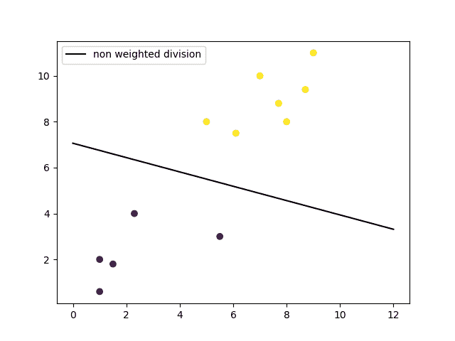
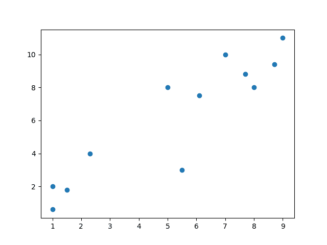
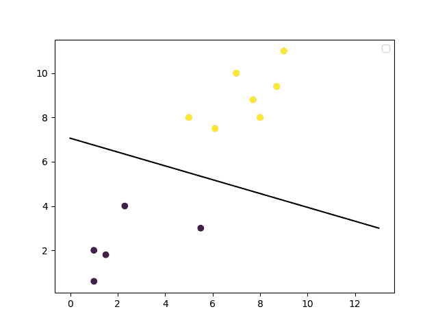
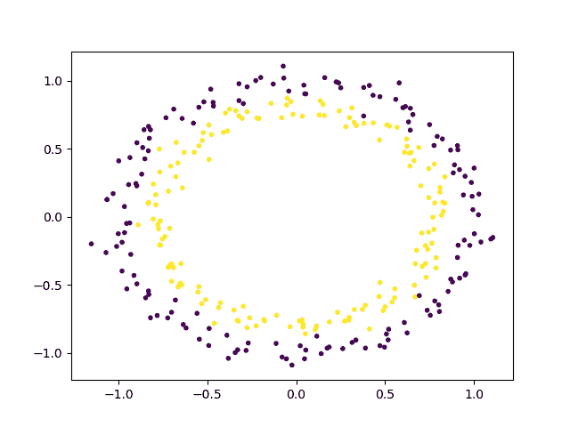
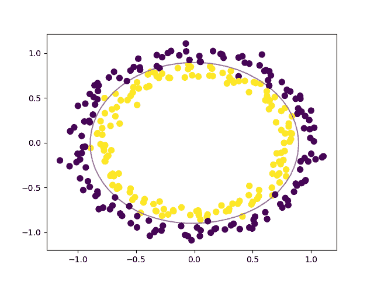

# SVM 机器学习教程-什么是支持向量机算法，用代码示例解释

> 原文：<https://www.freecodecamp.org/news/svm-machine-learning-tutorial-what-is-the-support-vector-machine-algorithm-explained-with-code-examples/>

机器学习目前处理的大多数任务包括分类图像、翻译语言、处理来自传感器的大量数据，以及根据当前值预测未来值。你可以选择不同的策略来解决你要解决的问题。

好消息是什么？机器学习中有一种算法，可以处理你扔给它的任何数据。但我们很快就会到达那里。

## 监督与非监督学习

机器学习中最常用的两种策略包括监督学习和非监督学习。

### 什么是监督学习？

监督学习是指使用标记数据训练机器学习模型。这意味着您的数据已经有了正确的分类。监督学习的一个常见用途是帮助您预测新数据的值。

使用监督学习，您需要在获得新数据时重建模型，以确保返回的预测仍然准确。监督学习的一个例子是给食物图片贴标签。你可以有一个数据集专门用于比萨饼的图像，以教导你的模型什么是比萨饼。

### 什么是无监督学习？

无监督学习是用未标记的数据训练一个模型。这意味着模型必须找到自己的特征，并根据其对数据的分类进行预测。

无监督学习的一个例子是给你的模型多种没有标签的食物图片。数据集将包含披萨、薯条和其他食物的图像，您可以使用不同的算法让模型只识别没有任何标签的披萨图像。

### 那么什么是算法呢？

当你听到人们谈论机器学习算法时，记住他们谈论的是不同的数学方程。

算法只是一个可定制的数学函数。这就是为什么大多数算法都有诸如成本函数、权重值和参数函数之类的东西，可以根据正在处理的数据进行交换。从本质上讲，机器学习只是一堆需要快速求解的数学方程。

这就是为什么有这么多不同的算法来处理不同种类的数据。一个特别的算法是支持向量机(SVM ),这是这篇文章将要详细介绍的。

## 什么是 SVM？

支持向量机是一组用于分类、回归和异常值检测的监督学习方法。所有这些都是机器学习中的常见任务。

你可以使用它们来检测基于数百万张图像的癌细胞，或者使用它们通过拟合良好的回归模型来预测未来的驾驶路线。

您可以使用特定类型的支持向量机来解决特定的机器学习问题，如支持向量回归(SVR)，它是支持向量分类(SVC)的扩展。

这里要记住的主要一点是，这些只是数学方程，它们会尽可能快地给你最准确的答案。

支持向量机不同于其他分类算法，因为它们选择决策边界的方式最大化了与所有类的最近数据点的距离。由支持向量机创建的决策边界被称为最大间隔分类器或最大间隔超平面。

## SVM 是如何工作的

一个简单的线性 SVM 分类器的工作原理是在两个类之间画一条直线。这意味着线一侧的所有数据点将代表一个类别，线另一侧的数据点将放入不同的类别。这意味着可以有无限多的行可供选择。

线性 SVM 算法优于其他一些算法(如 k-最近邻算法)的地方在于，它会选择最佳的线来对数据点进行分类。它选择分隔数据的线，并且尽可能远离最近的数据点。

一个二维例子有助于理解所有机器学习术语。基本上你在一个网格上有一些数据点。您正在尝试将这些数据点按照它们应该属于的类别进行分类，但是您不希望有任何数据属于错误的类别。这意味着您试图找到两个最近点之间的线，该线将其他数据点分开。

因此，两个最接近的数据点给你的支持向量，你将用来找到那条线。这条线被称为决策边界。



linear SVM

决策边界不一定是一条线。它也被称为超平面，因为您可以找到任意数量的特征的决策边界，而不仅仅是两个。


non-linear SVM using RBF kernel

### 支持向量机类型

有两种不同类型的支持向量机，分别用于不同的用途:

*   简单 SVM:通常用于线性回归和分类问题。
*   内核 SVM:对于非线性数据有更大的灵活性，因为您可以添加更多的特性来适应超平面而不是二维空间。

## 为什么支持向量机被用于机器学习

支持向量机用于手写识别、入侵检测、人脸检测、电子邮件分类、基因分类和网页等应用中。这也是我们在机器学习中使用支持向量机的原因之一。它可以处理线性和非线性数据的分类和回归。

我们使用支持向量机的另一个原因是，它们可以发现数据之间的复杂关系，而无需您自己进行大量转换。当您处理具有数万到数十万个要素的较小数据集时，这是一个很好的选择。与其他算法相比，它们通常会找到更准确的结果，因为它们能够处理小型复杂的数据集。

以下是使用支持向量机的一些优点和缺点。

### 赞成的意见

*   对具有多种特征的数据集有效，如金融或医疗数据。
*   在特征数量大于数据点数量的情况下有效。
*   在决策函数中使用称为支持向量的训练点子集，这使得它的存储效率更高。
*   可以为决策函数指定不同的核函数。您可以使用通用内核，但是也可以指定定制内核。

### 骗局

*   如果特征的数量远大于数据点的数量，在选择核函数和正则项时避免过拟合是至关重要的。
*   支持向量机不直接提供概率估计。这些都是通过昂贵的五重交叉验证计算出来的。
*   由于训练时间长，最适合小样本集。

因为支持向量机可以使用任意数量的内核，所以了解其中一些内核是很重要的。

## 核函数

### 线性的

这些通常被推荐用于文本分类，因为大多数这类分类问题是线性可分的。

当有很多特征时，线性核非常有效，文本分类问题也有很多特征。线性核函数比大多数其他函数更快，并且需要优化的参数更少。

下面是定义线性核的函数:

```
f(X) = w^T * X + b
```

在这个等式中， **w** 是您要最小化的权重向量， **X** 是您要尝试分类的数据， **b** 是根据训练数据估计的线性系数。这个等式定义了 SVM 返回的判定边界。

### 多项式

多项式核在实践中不常使用，因为它的计算效率不如其他核，其预测也不准确。

以下是多项式核的函数:

```
f(X1, X2) = (a + X1^T * X2) ^ b
```

这是您可以使用的更简单的多项式核方程之一。 **f(X1，X2)** 表示将分离数据的多项式决策边界。 **X1** 和 **X2** 代表你的数据。

### 高斯径向基函数(RBF)

支持向量机中最强大和最常用的内核之一。通常选择非线性数据。

下面是 RBF 核的公式:

```
f(X1, X2) = exp(-gamma * ||X1 - X2||^2)
```

在这个等式中， **gamma** 指定单个训练点对其周围的其他数据点有多大影响。 **||X1 - X2||** 是你的五官之间的点积。

### 乙状结肠的

在神经网络中比在支持向量机中更有用，但偶尔会有特定的用例。

以下是 sigmoid 内核的函数:

```
f(X, y) = tanh(alpha * X^T * y + C)
```

在这个函数中，**α**是一个权重向量，而 **C** 是一个偏移值，以解决可能发生的一些数据误分类。

### 其他人

有很多其他内核可以用于您的项目。当您需要满足某些误差约束、想要尝试加快训练时间或者想要优化参数时，这可能是一个需要做出的决定。

[其他一些内核包括](https://data-flair.training/blogs/svm-kernel-functions/) : ANOVA 径向基、双曲正切和拉普拉斯 RBF。

现在您已经对内核的工作原理有了一些了解，让我们来看几个例子。

## 数据集示例

为了向您展示 SVM 在实践中是如何工作的，我们将使用 [Python Scikit-learn 库](https://scikit-learn.org/stable/)来完成用它训练模型的过程。这通常用于各种机器学习问题，并且与其他 Python 库配合良好。

以下是机器学习项目中常见的步骤:

*   导入数据集
*   探索数据，找出它们的样子
*   预处理数据
*   将数据分为属性和标签
*   将数据分为训练集和测试集
*   训练 SVM 算法
*   做一些预测
*   评估算法的结果

根据您处理数据的方式，其中一些步骤可以合并。我们将用线性 SVM 和非线性 SVM 做一个例子。你可以在这里找到这些例子的代码。

### 线性 SVM 例子

我们将从导入几个库开始，这将使大多数机器学习项目变得容易。

```
import matplotlib.pyplot as plt
import numpy as np
from sklearn import svm
```

对于一个简单的线性示例，我们将只制作一些虚拟数据，它将代替导入数据集。

```
# linear data
X = np.array([1, 5, 1.5, 8, 1, 9, 7, 8.7, 2.3, 5.5, 7.7, 6.1])
y = np.array([2, 8, 1.8, 8, 0.6, 11, 10, 9.4, 4, 3, 8.8, 7.5])
```

我们使用 numpy 数组的原因是为了使矩阵运算更快，因为它们比 Python 列表使用更少的内存。您还可以利用键入数组内容的优势。现在让我们看看数据在图中的样子:

```
# show unclassified data
plt.scatter(X, y)
plt.show()
```



一旦你看到数据的样子，你就可以更好地猜测哪种算法最适合你。请记住，这是一个非常简单的数据集，所以大多数情况下，您需要对数据进行一些处理，以使其达到可用状态。

我们将对已经结构化的代码做一些预处理。这将把原始数据转换成我们可以用来训练 SVM 模型的格式。

```
# shaping data for training the model
training_X = np.vstack((X, y)).T
training_y = [0, 1, 0, 1, 0, 1, 1, 1, 0, 0, 1, 1]
```

现在我们可以使用线性核来创建 SVM 模型。

```
# define the model
clf = svm.SVC(kernel='linear', C=1.0)
```

这一行代码就创造了一个完整的机器学习模型。现在我们只需要用我们预处理过的数据来训练它。

```
# train the model
clf.fit(training_X, training_y)
```

这就是你如何为任何机器学习项目建立模型。我们拥有的数据集可能很小，但如果你遇到一个可以用线性边界分类的真实世界数据集，这个模型仍然有效。

训练好模型后，您可以预测新数据点将如何分类，并绘制决策边界图。让我们画出决策边界。

```
# get the weight values for the linear equation from the trained SVM model
w = clf.coef_[0]

# get the y-offset for the linear equation
a = -w[0] / w[1]

# make the x-axis space for the data points
XX = np.linspace(0, 13)

# get the y-values to plot the decision boundary
yy = a * XX - clf.intercept_[0] / w[1]

# plot the decision boundary
plt.plot(XX, yy, 'k-')

# show the plot visually
plt.scatter(training_X[:, 0], training_X[:, 1], c=training_y)
plt.legend()
plt.show()
```



### 非线性 SVM 示例

对于这个例子，我们将使用一个稍微复杂一点的数据集来展示支持向量机的一个亮点。让我们导入一些包。

```
import matplotlib.pyplot as plt
import numpy as np
from sklearn import datasets
from sklearn import svm
```

这组导入类似于线性示例中的那些，除了它多导入了一样东西。现在我们可以直接使用 Scikit-learn 库中的数据集。

```
# non-linear data
circle_X, circle_y = datasets.make_circles(n_samples=300, noise=0.05)
```

下一步是用图来看看这些原始数据是什么样子的。

```
# show raw non-linear data
plt.scatter(circle_X[:, 0], circle_X[:, 1], c=circle_y, marker='.')
plt.show()
```



现在你可以看到数据是如何分离的，我们可以选择一个非线性 SVM 开始。这个数据集在我们使用它来训练模型之前不需要任何预处理，所以我们可以跳过这一步。以下是 SVM 模式对此的看法:

```
# make non-linear algorithm for model
nonlinear_clf = svm.SVC(kernel='rbf', C=1.0)
```

在这种情况下，我们将使用一个 [RBF(高斯径向基函数)核](http://openclassroom.stanford.edu/MainFolder/DocumentPage.php?course=MachineLearning&doc=exercises/ex8/ex8.html)来对这些数据进行分类。您还可以尝试多项式核来查看您得到的结果之间的差异。现在是训练模型的时候了。

```
# training non-linear model
nonlinear_clf.fit(circle_X, circle_y)
```

您可以基于该模型开始在正确的类别中标记新数据。要查看决策边界是什么样子，我们必须创建一个自定义函数来绘制它。

```
# Plot the decision boundary for a non-linear SVM problem
def plot_decision_boundary(model, ax=None):
    if ax is None:
        ax = plt.gca()

    xlim = ax.get_xlim()
    ylim = ax.get_ylim()

    # create grid to evaluate model
    x = np.linspace(xlim[0], xlim[1], 30)
    y = np.linspace(ylim[0], ylim[1], 30)
    Y, X = np.meshgrid(y, x)

	# shape data
    xy = np.vstack([X.ravel(), Y.ravel()]).T

	# get the decision boundary based on the model
    P = model.decision_function(xy).reshape(X.shape)

    # plot decision boundary
    ax.contour(X, Y, P,
               levels=[0], alpha=0.5,
               linestyles=['-'])
```

您已经拥有了为这种非线性数据绘制决策边界所需的一切。我们可以用几行使用 [Matlibplot](https://matplotlib.org/) 库的代码来实现，就像其他图一样。

```
# plot data and decision boundary
plt.scatter(circle_X[:, 0], circle_X[:, 1], c=circle_y, s=50)
plot_decision_boundary(nonlinear_clf)
plt.scatter(nonlinear_clf.support_vectors_[:, 0], nonlinear_clf.support_vectors_[:, 1], s=50, lw=1, facecolors='none')
plt.show()
```



当你有了数据，并且知道你要解决的问题时，事情真的可以这么简单。

您可以完全改变您的训练模型，可以选择不同的算法和功能来工作，并且可以基于多个参数来微调您的结果。现在已经有了所有这些的库和包，所以你不必处理太多的数学。

## 现实世界问题的提示

现实世界的数据集有一些共同的问题，因为它们可以有多大，它们保存的数据类型有多种，以及它们需要多少计算能力来训练模型。

对于支持向量机，您应该特别注意以下几点:

*   确保您的数据是数字形式，而不是分类形式。支持向量机期望数字而不是其他种类的标签。
*   尽可能避免复制数据。如果数据不是特定的格式，一些 Python 库会复制数据。复制数据还会降低训练时间，并扭曲模型为特定要素分配权重的方式。
*   注意你的内核缓存大小，因为它使用你的内存。如果你有一个非常大的数据集，这可能会给你的系统带来问题。
*   缩放数据，因为 SVM 算法不是比例不变的。这意味着您可以将所有数据转换到[0，1]或[-1，1]的范围内。

## 其他想法

你可能想知道为什么我没有在这里深入研究数学的细节。主要是我不想吓唬人，让他们不敢多学机器学习。

学习那些又长又复杂的数学方程及其推导过程很有趣，但是你很少会在真实的项目中编写自己的算法和证明。

这就像使用你每天做的大部分其他东西，比如你的手机或电脑。您可以做任何您需要做的事情，而不需要知道处理器是如何构建的。

机器学习就像任何其他软件工程应用一样。有大量的软件包可以让你更容易得到你需要的结果，而不需要深厚的统计学背景。

一旦你练习了不同的软件包和库，你会发现机器学习最难的部分是获取和标记你的数据。

我在做一个神经科学，机器学习，基于网络的东西！你应该在 Twitter 上关注我，了解更多关于它和其他酷技术的东西。