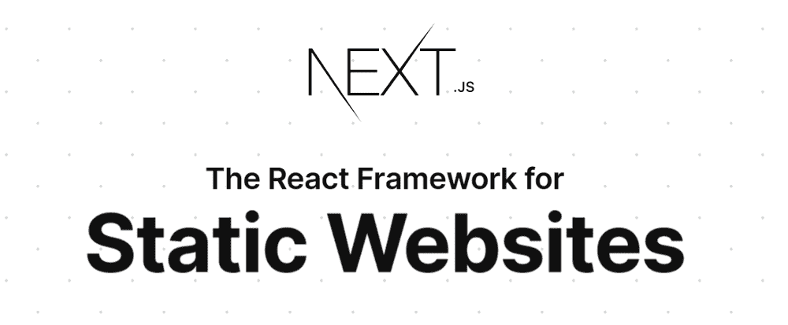
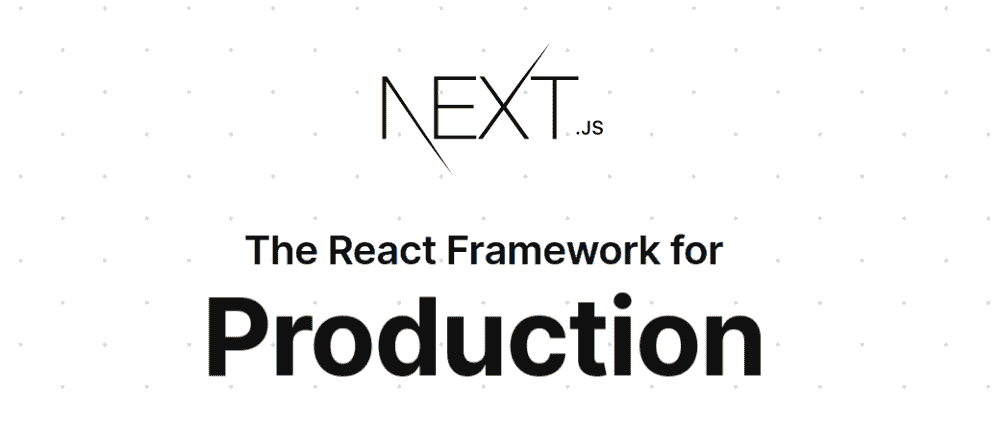
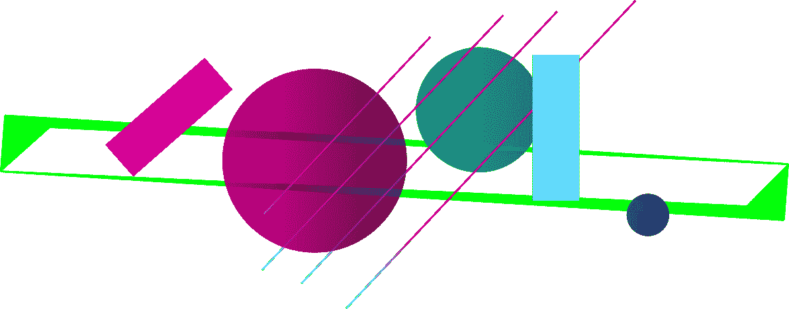

# 如何用 Next 取代 Meteor 介绍 Vulcan Next 启动器

> 原文：<https://www.freecodecamp.org/news/how-to-replace-meteor-by-next-introducing-vulcan-next-starter/>

## 2020 年，仍然在寻找一个高效的 JS 框架

当你为你自己的公司创建一个产品时，你可以自由地花时间建立一个适合你自己的开发环境。当然，你可能会花相当多的时间。

但是在为别人开发的时候，你就没有这个自由了。你必须在可预测的时间内交付高质量的代码。

为了具有竞争力，你必须跨客户进行扩展。每个 app 都不可能是你的第一个 app。知识和通用代码必须被重用。大多数时候这意味着依赖框架。

作为一个经纪公司的老板，我一直很喜欢流星。这是少有的真正以生产力为中心的 JavaScript 框架之一:包优先的架构，同构的方法，开箱即用的持久性解决方案…

我也是 [Sacha Greif 的 Vulcan.js 框架](http://vulcanjs.org/)的核心贡献者。Vulcan 是一个固执己见的全栈框架，实现为 Meteor 的超级集合。它更进一步，为非常快速的开发提供声明式模式，并依赖于 Apollo GraphQL。

一切(GraphQL 模式、API、数据库结构、表单、数据表等等)都是基于 JavaScript 模式自动生成的。很酷，不是吗？

但是 Meteor 的局限性是一个玻璃天花板。我在 Meteor 和 Vulcan 上有过成功的项目，但是我从来没有把这些框架推向更大的客户。太多的可伸缩性问题，缺乏牵引力，糟糕的测试工具，等等。

回到起点，我需要找到一个可以结婚的框架。

## 接下来 vs 流星？

### 那是苹果和橘子的比较！

[当我在 2017 年](https://medium.com/@eric.burel/next-the-next-big-thing-c7f9c34f9cce)第一次发现 Next back 时，它是一个很有前途的前端专用框架。仅限前端。我用它来建立我的公司网站，然后就把它忘了。

然后，我周围的人开始表现得很奇怪。他们突然谈到两个毫无共同之处的框架，Meteor 和 Next，好像是可以互换的。你用流星换了 Next？为什么不用 Create React App 代替 Express 呢？

You can even use create-react-app to fight hackers. Screenshot from the French TV show "Bureau des légendes" (Canal +).

就我记忆所及， [Reaction Commerce 是第一个实现这种转变的重要框架之一。](https://blog.reactioncommerce.com/reaction-v2-0-0-release-preview/)

我不相信。事实上，他们仍然必须在他们的 Meteor 应用程序之上实现一个 GraphQL API 来与他们的下一个前端通信。用一个框架换两个框架并不是最好的交易，所以我们保留了基于流星的 Vulcan 框架。

如果你认为把《流星》和《下一个》相提并论就是苹果和橘子的比较，那你就没那么错了。时至今日，Next 的口头禅依然是“React 框架”。而不是“节点框架”。

然而，几个月前我开始改变我的想法。

### 从前端到具有 API 路由的完整堆栈

API 路线于 2019 年 7 月随着 [v9 发布](https://nextjs.org/blog/next-9)正式引入。

这也是我再次追随潮流的原因。API 路线意味着 Next.js 现在是一个极简主义的，但是完全可行的全栈框架。

Vulcan 是围绕 GraphQL 构建的。而 GraphQL 非常适合 API 路由。该 API 通过一个独特的动态/graphQL 端点提供服务。接下来，通过创建一个 graphql.js API 路由进行转换。很简单。

## 如今，Next 涵盖了从静态到全堆栈的所有领域

Next 越来越被称为“混合框架”。这是有道理的，因为它的多功能性是极端的。

*   您可以开发一个具有无服务器风格后端的全栈应用程序。
*   您可以开发具有动态服务器端呈现的 SaaS 应用程序。
*   你不想维护一个服务器？您可以遵循 JAMstack 理念，通过构建时服务器端呈现导出静态应用程序。
*   如果您对客户端 JS 过敏，那么您可以从捆绑包中删除 JavaScript，只保留 HTML 代码。

但是不要认为 Next 是万能的。它是静态的盖茨比的有力竞争者。这是一个有前途的替代流星在其全栈形式。Vercel(前 Zeit)在保持高质量和轻量级方面做了大量工作，无论使用情况如何。

## 先不要掉流星

我想澄清一些事情。用 Next 代替 Meteor 作为我们在 Vulcan 中的核心框架并不意味着我们认为 Meteor 应该被完全抛弃。

我们从火神阿波罗和流星的实验中学到了一件大事:如果你打算使用流星，就接受它的工作方式。忘掉 GraphQL 吧。忘掉 Webpack 吧。虽然是同一个人创造的，阿波罗和流星却有很多冲突。这对于 GraphQL 开发人员来说很奇怪，对于流星纯化论者来说也很奇怪。

使用 DDP，methods，pub/sub，学习如何扩展你的应用程序，加入论坛，购买印有 Meteor 标志的咖啡杯。既然泰尼已经复活了《流星》,这是未来几年的一个安全赌注。

对于 Vulcan + Next，我们只是努力提供一个 GraphQL 来替代 Meteor。这不是最差或更好，这是相同的哲学与不同的实现。

框架就像一件乐器。不要挑最潮的，挑适合自己的。如果你的乐器是流星，那就去吧。

## 介绍 Vulcan Next Starter，一种最先进的 Next 应用程序

使用现成的 Next 完全没问题。你得到一个构建系统，一个样式化的解决方案，一个合理的文件夹结构。

但是如果你想为下一个十亿美元的创业公司开发一个应用程序，你可能需要更多的工具。请记住，我们正在寻找一个生产力第一的替代流星。

一个很酷的设置可能是这样的:

*   Cypress 和 Jest 用于单元和 e2e 测试
*   用于视觉测试和设计文档的故事书
*   国际化，别名 i18n(特别是如果你和我一样是法国人的话:)
*   TypeScript，通过静态类型来表达您的域模型
*   Material UI 获得一组可定制的核心组件
*   Apollo 客户端与 GraphQL APIs 通信
*   或者，Apollo 服务器设置一个 GraphQL 入口点，用 Playground 和 Voyager 进行 API 探索

Next 提供了几个核心回购的例子。但这在现实生活中是不够的。这些工具可以以意想不到的方式相互作用。

键入像 Leaflet 或 Plotly 这样的客户端组件可能会很困难。这同样适用于统一 Next、Jest 和 Storybook 的构建系统，或者在服务器端渲染期间避免 Apollo 和 Material UI 之间的不良交互。使用 SSR 的重定向意味着联合处理服务器和客户机场景。I18n 尤其难以独立设置。这样的例子不胜枚举。

相信我，你不会想独自解决这些问题的。你猜怎么着？我们已经为你经历了这些麻烦！

**所有那些工具都安装在我们崭新的、闪亮的** [**火神下一个启动器**](https://github.com/VulcanJS/vulcan-next-starter) **。**

我们还有很长的路要走，但我们可以自豪地说，在生产中使用是安全的。

## 后续步骤

我们的样板文件只实现了我们承诺的一半。您得到了一个很酷的前端设置，但仍然缺少实现后端的数据库和指南。在这一点上那真的比不上流星。少数兰姆达斯不是一个框架。订阅云托管解决方案也不是。

这就是瓦肯星的用武之地。多年来，我们已经精心制作了一个强大的 GraphQL API 生成器，使用 Mongo 作为数据库和大量的前端实用程序。自然，我们的下一步是将 Vulcan 和 next 结合起来，创建一个真正的全栈框架。

你可以通过加入我们的[Vulcan’s Slack](http://slack.telescopeapp.org/)来关注我们的进展。

Next 和 Meteor 将成为 Vulcan 的一等公民，但任何一种 JS 前端或后端技术都可以享受它。无论是盖茨比还是自定义节点微服务。在 Vulcan，我们卖苹果和橘子，只要它们能让你成为一个高效的开发者。

现在，是我们回去工作的时候了，我们有很多事情要做。希望在[火神](http://vulcanjs.org/)见到你！

## 从战壕出发的运动员

特别感谢 Aplines，他们信任我的公司(LBKE)在其产品中使用最新技术。感谢他们，我们已经在真实的专业应用程序中测试了 Vulcan Next Starter 中包含的所有功能。

他们正在寻找开发人员，所以如果你想了解更多关于大规模使用 Next 和 GraphQL 的知识，那就去那里:[job@aplines.com](mailto:job@aplines.com)