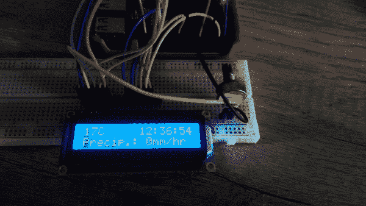
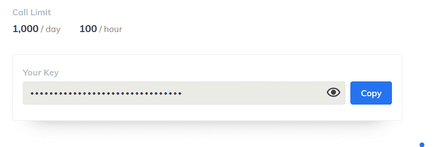
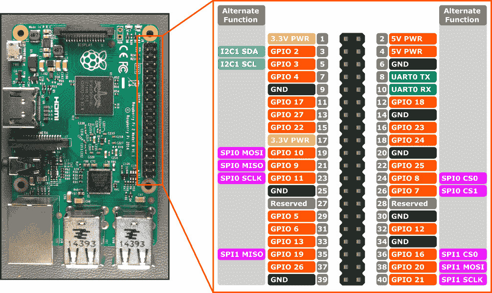
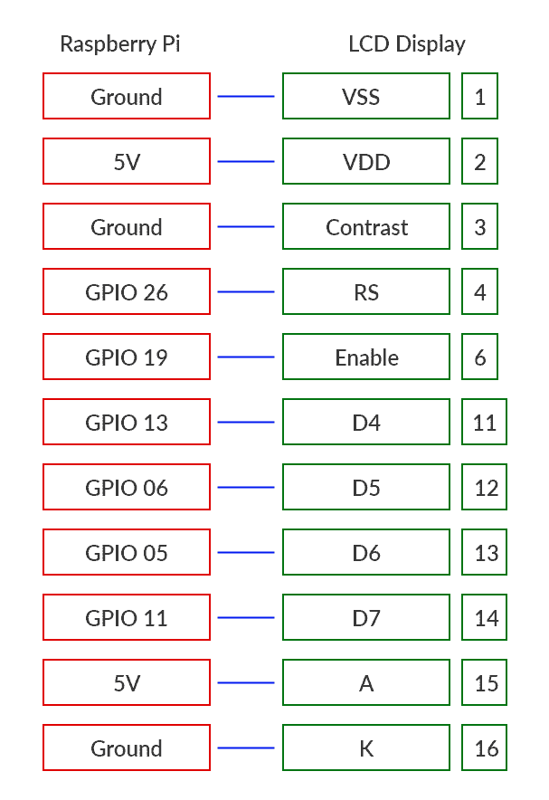
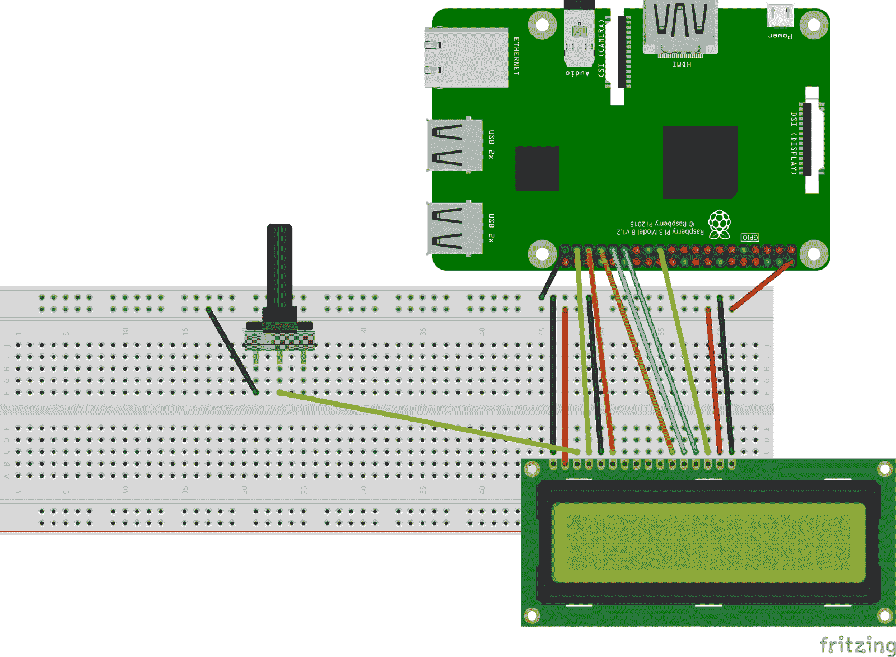
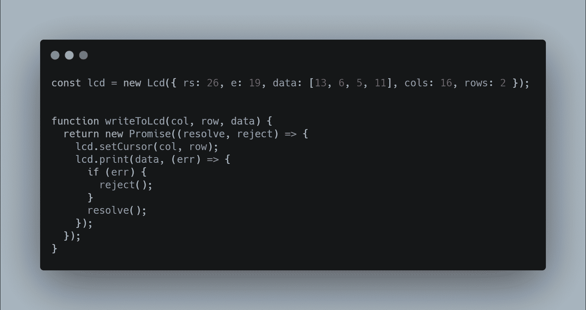
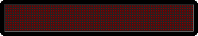
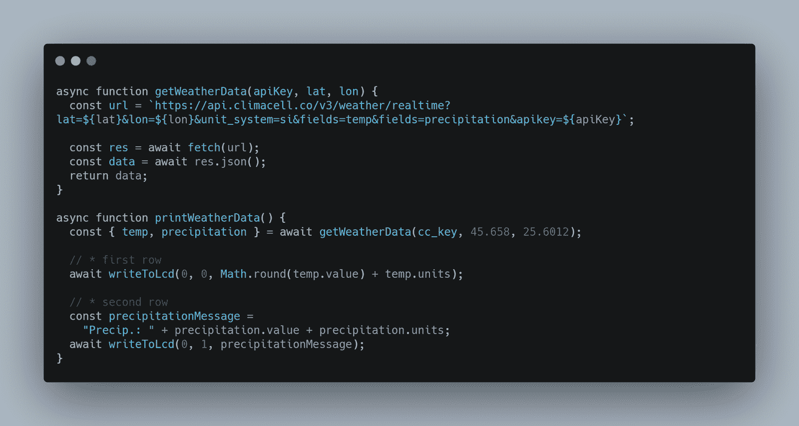
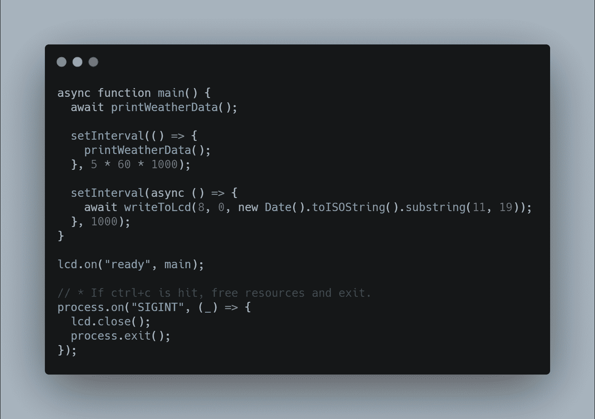

# 如何使用 Node，一个 Raspberry Pi，和一个 LCD 屏幕来监控天气

> 原文：<https://www.freecodecamp.org/news/monitor-the-weather-with-node-and-raspberry-pi/>

在过去几年中，智能家居设备从 2015 年的不到 30 万台增加到 2020 年的近 12 亿台。预计到 2021 年，这一数字将增长到 15 亿。

因此，鉴于到 2021 年平均每个家庭将拥有 8.7 台智能设备，你的家中可能至少有一些智能设备。

作为开发者，我们在这个领域有一些优势，因为我们可以建立自己的智能家居设备。

经历快速发展的不仅仅是设备。用于它们的开发板已经开始变得越来越商业化，越来越容易使用。

在本文中，我们将看到如何使用 Raspberry Pi、LCD 屏幕和几行代码来监控室外或特定位置的天气。



因为这是一个自己动手(DIY)的项目，有一些先决条件，我们需要这个设备。

## 先决条件

*   树莓 Pi 3(或更高)
*   液晶显示屏
*   连接线
*   电位计(可选)
*   试验板(可选)

# 如何构建它

一旦我们得到我们需要的一切，我们就可以开始了。让我们一步一步来。

## 步骤 I -基本配置

第一步包括基本设置和所有组件的验证。

对于这个演示，我们将使用 ClimaCell Weather API 作为天气数据提供者，因为他们有大量的指标供我们使用，包括空气质量指标。

要使用他们的 API，我们必须在他们的平台上开一个账户，并获得一个 API 密钥，我们将用它来签署我们的请求。



ClimaCell API Limit

该帐户是免费开放的，它有 100 小时的 API 调用限制，这对我们的项目来说绰绰有余。

一旦我们有了这个 API 键，我们就可以转移到硬件配置，并将 LCD 屏幕连接到我们的 Raspberry Pi。你应该在接线的时候关掉树莓派。

Raspberry Pi 3 的引脚布局可以在下图中看到。



Raspberry Pi 3 Pins

LCD 和开发板之间的接线如下:



Connection between Raspberry PI and LCD

这种硬件连接将使 LCD 屏幕处于全亮度和全对比度状态。亮度水平不是问题，但对比度是因为我们将无法看到屏幕上的字符。

这就是为什么我们需要引入至少一个电位计来设置对比度。



Schematic

在这一点上，我们可以打开我们的树莓派，我们应该看到液晶显示屏活着。在可变电阻的帮助下，我们应该能够控制对比度。

## 第二步-项目配置

作为一种编程语言，我们将使用 [NodeJS](https://nodejs.org/en/) 来编写代码。如果你还没有在你的树莓上安装 NodeJS，那么你可以遵循这些[简单的指令](https://www.instructables.com/id/Install-Nodejs-and-Npm-on-Raspberry-Pi/)。

在一个新文件夹中，运行命令`npm init -y`来设置一个新的 npm 包，然后运行命令`npm install lcd node-fetch`来安装这两个必需的依赖项。

*   `lcd`将用于与液晶显示屏通信
*   `node-fetch`将用于向 ClimaCell API 发出 [HTTP](https://en.wikipedia.org/wiki/Hypertext_Transfer_Protocol) 请求。

我们说过，我们需要一个 API 密钥来与天气数据提供者通信。您可以将您的秘密 API 密匙直接放在主代码中，或者您可以创建一个`config.json`文件，在该文件中您可以放置这个密匙和任何其他与代码相关的配置。

`config.json`

```
{  "cc_key": "<your_ClimaCell_API_key>"}
```

最后，让我们创建项目的主文件，并包含我们讨论过的所有内容。

```
// * Dependencies
const Lcd = require("lcd");
const fs = require("fs");
const fetch = require("node-fetch");

// * Globals
const { cc_key } = JSON.parse(fs.readFileSync("./config.json")); 
```

## 第三步-液晶显示器

使用 lcd 模块在屏幕上书写是小菜一碟。这个库充当我们如何与设备通信的抽象层。通过这种方式，我们不需要单独对每个命令进行微观管理。

我们的 LCD 屏幕的完整代码如下:



[RAW](https://carbon.now.sh/?bg=rgba(171%2C%20184%2C%20195%2C%201)&t=seti&wt=none&l=javascript&ds=true&dsyoff=20px&dsblur=68px&wc=true&wa=true&pv=56px&ph=56px&ln=false&fl=1&fm=Hack&fs=14px&lh=133%25&si=false&es=2x&wm=false&code=const%2520lcd%2520%253D%2520new%2520Lcd(%257B%2520rs%253A%252026%252C%2520e%253A%252019%252C%2520data%253A%2520%255B13%252C%25206%252C%25205%252C%252011%255D%252C%2520cols%253A%252016%252C%2520rows%253A%25202%2520%257D)%253B%250A%250A%250Afunction%2520writeToLcd(col%252C%2520row%252C%2520data)%2520%257B%250A%2520%2520return%2520new%2520Promise((resolve%252C%2520reject)%2520%253D%253E%2520%257B%250A%2520%2520%2520%2520lcd.setCursor(col%252C%2520row)%253B%250A%2520%2520%2520%2520lcd.print(data%252C%2520(err)%2520%253D%253E%2520%257B%250A%2520%2520%2520%2520%2520%2520if%2520(err)%2520%257B%250A%2520%2520%2520%2520%2520%2520%2520%2520reject()%253B%250A%2520%2520%2520%2520%2520%2520%257D%250A%2520%2520%2520%2520%2520%2520resolve()%253B%250A%2520%2520%2520%2520%257D)%253B%250A%2520%2520%257D)%253B%250A%257D)

第一步是创建一个新的`lcd`对象，并将我们使用过的 pin 作为参数传递。

按键`cols`和`rows`代表我们的 LCD 显示屏的列数和行数。16x2 是我在这个例子中使用的。如果你的 LCD 只有 8 列 1 行，那么用你的值替换 16 和 2。

要在显示器上写东西，我们需要连续使用这两种方法:

*   lcd.setCursor() -选择开始写入的位置
*   lcd.print()

同时，我们将这两个函数包装在一个承诺中，以利用`async/away`关键字。

此时，您可以使用此功能并在显示器上打印一些内容。`writeToLcd(0,0,'Hello World')`应该从第一列开始在第一行打印消息`Hello World`。

## 第四步-天气数据

下一步是获取天气数据并将其打印在显示器上。

ClimaCell 提供了很多天气数据信息，还有空气质量和花粉、火情等信息。数据是巨大的，但是记住你的 LCD 屏幕只有 16 列 2 行，也就是 32 个字符。

如果您想显示更多类型的数据，并且这个限制对您来说太小，那么您可以使用滚动效果。



对于本演示，我们将保持简单，我们将在 LCD 屏幕上打印以下数据:

*   当前日期(小时、分钟、秒)
*   温度
*   降水强度



[RAW](https://carbon.now.sh/?bg=rgba(171%2C%20184%2C%20195%2C%201)&t=seti&wt=none&l=javascript&ds=true&dsyoff=20px&dsblur=68px&wc=true&wa=true&pv=56px&ph=56px&ln=false&fl=1&fm=Hack&fs=14px&lh=133%25&si=false&es=2x&wm=false&code=async%2520function%2520getWeatherData(apiKey%252C%2520lat%252C%2520lon)%2520%257B%250A%2520%2520const%2520url%2520%253D%2520%2560https%253A%252F%252Fapi.climacell.co%252Fv3%252Fweather%252Frealtime%253Flat%253D%2524%257Blat%257D%2526lon%253D%2524%257Blon%257D%2526unit_system%253Dsi%2526fields%253Dtemp%2526fields%253Dprecipitation%2526apikey%253D%2524%257BapiKey%257D%2560%253B%250A%250A%2520%2520const%2520res%2520%253D%2520await%2520fetch(url)%253B%250A%2520%2520const%2520data%2520%253D%2520await%2520res.json()%253B%250A%2520%2520return%2520data%253B%250A%257D%250A%250Aasync%2520function%2520printWeatherData()%2520%257B%250A%2520%2520const%2520%257B%2520temp%252C%2520precipitation%2520%257D%2520%253D%2520await%2520getWeatherData(cc_key%252C%252045.658%252C%252025.6012)%253B%250A%250A%2520%2520%252F%252F%2520*%2520first%2520row%250A%2520%2520await%2520writeToLcd(0%252C%25200%252C%2520Math.round(temp.value)%2520%252B%2520temp.units)%253B%250A%250A%2520%2520%252F%252F%2520*%2520second%2520row%250A%2520%2520const%2520precipitationMessage%2520%253D%250A%2520%2520%2520%2520%2522Precip.%253A%2520%2522%2520%252B%2520precipitation.value%2520%252B%2520precipitation.units%253B%250A%2520%2520await%2520writeToLcd(0%252C%25201%252C%2520precipitationMessage)%253B%250A%257D)

要从 ClimaCell 获取特定位置的数据，您需要发送它的地理坐标、纬度和经度。

要找到你所在城市的坐标，你可以使用像[latlong.net](https://www.latlong.net/place/new-york-city-ny-usa-1848.html)这样的免费工具，然后你可以把它们和你的 API 密匙一起保存在`config.json`文件中，或者你可以直接把它们写在代码中。

此时，API 调用返回的数据格式如下:

```
{
  lat: 45.658,
  lon: 25.6012,
  temp: { value: 17.56, units: 'C' },
  precipitation: { value: 0.3478, units: 'mm/hr' },
  observation_time: { value: '2020-06-22T16:30:22.941Z' }
}
```

我们可以解构这个对象，获得温度和降水量的值，并将它们打印在第一行和第二行。

## 第五步-总结

我们现在需要做的就是为我们的脚本编写逻辑，并在新数据到达时更新 LCD 屏幕。



[RAW](https://carbon.now.sh/?bg=rgba(171%2C%20184%2C%20195%2C%201)&t=seti&wt=none&l=javascript&ds=true&dsyoff=20px&dsblur=68px&wc=true&wa=true&pv=56px&ph=56px&ln=false&fl=1&fm=Hack&fs=14px&lh=133%25&si=false&es=2x&wm=false&code=async%2520function%2520main()%2520%257B%250A%2520%2520await%2520printWeatherData()%253B%250A%250A%2520%2520setInterval(()%2520%253D%253E%2520%257B%250A%2520%2520%2520%2520printWeatherData()%253B%250A%2520%2520%257D%252C%25205%2520*%252060%2520*%25201000)%253B%250A%250A%2520%2520setInterval(async%2520()%2520%253D%253E%2520%257B%250A%2520%2520%2520%2520await%2520writeToLcd(8%252C%25200%252C%2520new%2520Date().toISOString().substring(11%252C%252019))%253B%250A%2520%2520%257D%252C%25201000)%253B%250A%257D%250A%250Alcd.on(%2522ready%2522%252C%2520main)%253B%250A%250A%252F%252F%2520*%2520If%2520ctrl%252Bc%2520is%2520hit%252C%2520free%2520resources%2520and%2520exit.%250Aprocess.on(%2522SIGINT%2522%252C%2520(_)%2520%253D%253E%2520%257B%250A%2520%2520lcd.close()%253B%250A%2520%2520process.exit()%253B%250A%257D)%253B)

天气数据每 5 分钟更新一次。但是因为 ClimaCell 规定了每小时 100 次 API 调用的限制，所以我们可以更进一步，每分钟更新一次天气数据。

对于当前日期，我们有两个选项:

*   我们可以使用属性`observation_time`并显示收到数据的日期，或者
*   我们可以做一个真正的时钟并显示当前时间。

我选择了第二个选项，但你可以随意做。

要在右上角打印时间，我们必须首先计算起始列，以使文本紧密贴合。为此，我们可以使用下一个公式`total columns number`减去`text to display length`

日期有 8 个字符，因为他有 16 列，我们必须从第 8 列开始。

LCD 的设置是异步的，所以我们必须使用相关库提供的方法`lcd.on()`，这样我们就知道 LCD 什么时候已经初始化，什么时候可以使用了。

嵌入式系统中的另一个最佳实践是关闭并释放您使用的资源。这就是为什么我们使用`SIGNINT`事件在程序停止时关闭 LCD 屏幕。其他类似的事件包括:

*   `SIGUSR1`和`SIGUSR2` -像 nodemon 重启一样捕获“kill pid”
*   `uncaughtException` -捕捉未捕捉的异常

## 第六步-永远运行它

脚本已经完成，现在我们可以运行程序了。在我们完成之前，我们还有一件事要做。

此时，您可能已经使用 SSH 连接到您的 Raspberry Pi，或者直接使用 HDMI 电缆和显示器连接。无论如何，当你关闭你的终端程序将会停止。

同时，如果您关闭设备，一段时间后或立即再次打开，脚本将不会启动，您必须手动执行。

为了解决这个问题，我们可以使用类似于 [pm2](https://www.npmjs.com/package/pm2) 的进程管理器。

以下是步骤:

1.  `sudo npm install pm2 -g` -安装 pm2
2.  `sudo pm2 startup` -为 pm2 管理器创建启动脚本
3.  `pm2 start index.js` -启动应用程序
4.  `pm2 save` -保存服务器重启后的进程列表

现在，您可以重启您的主板，当设备准备就绪时，脚本将自动启动。

# 结论

从这一点上，您可以自定义您的新设备，无论你想要的。如果您发现这些天气数据对您很重要(或 ClimaCell 的任何其他数据，如空气污染、花粉、火灾指数或道路风险)，您可以创建一个自定义案例，将 Raspberry Pi 和 LCD 显示屏放入其中。添加电池后，您可以将设备放在家中。

树莓派就像一台个人电脑，所以你可以在上面做比你通常在像 T2 Arduino T3 这样的微控制器上做的更多的事情。因此，它很容易与您家中的其他设备结合使用。