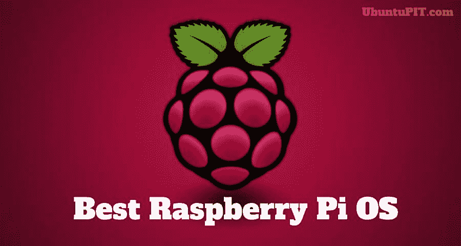
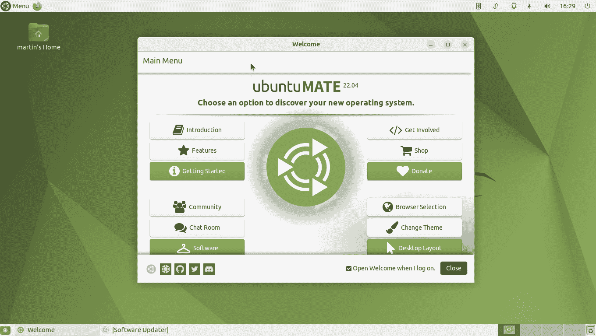
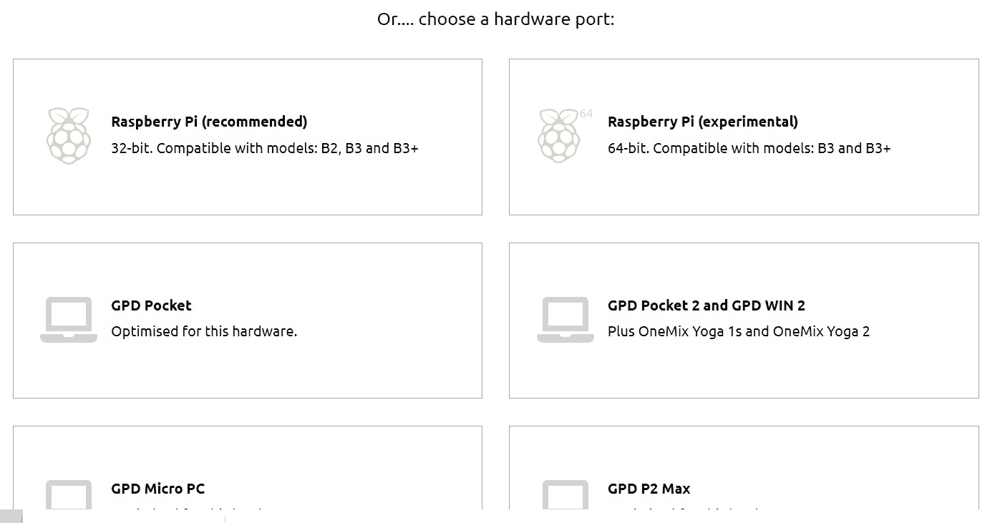
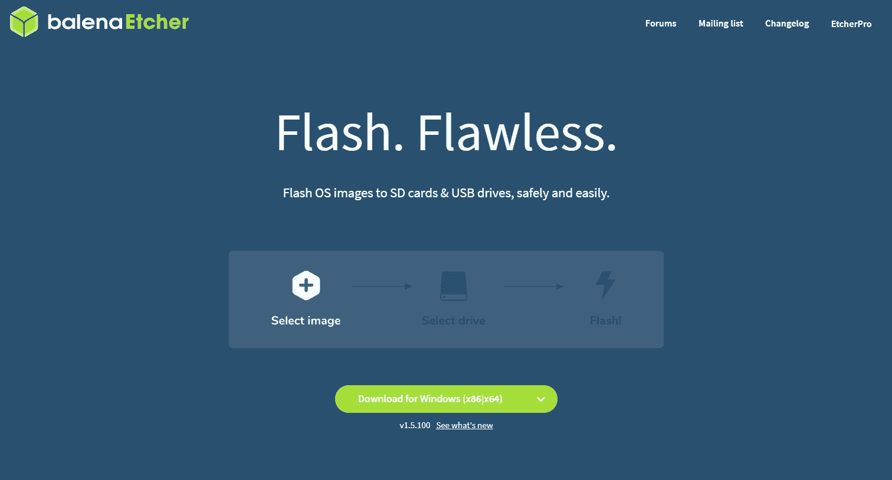
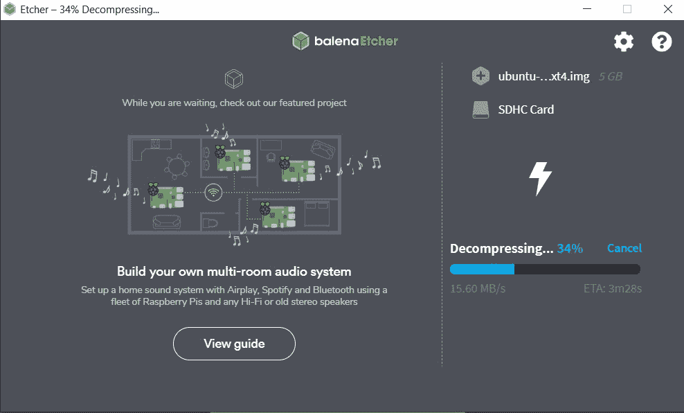
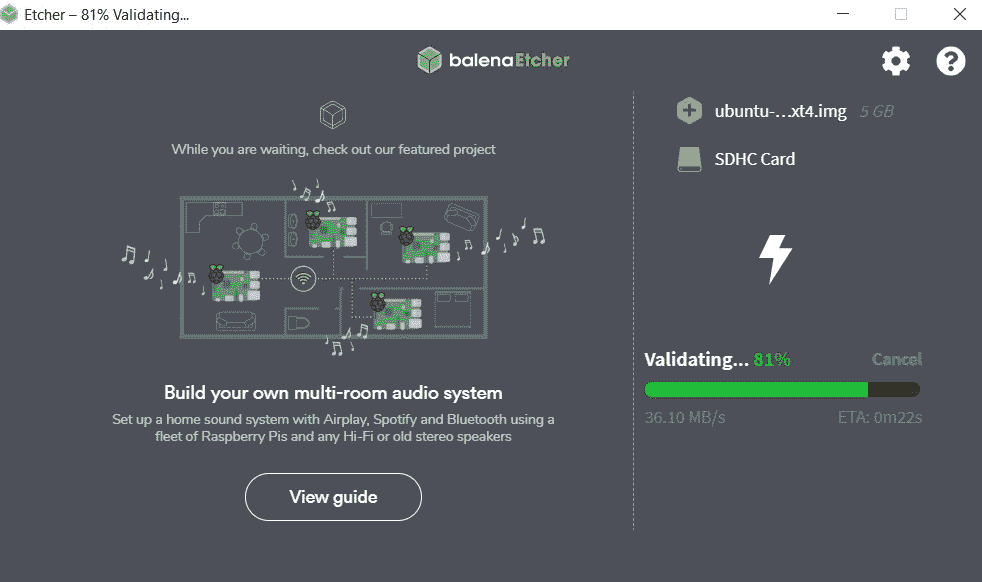
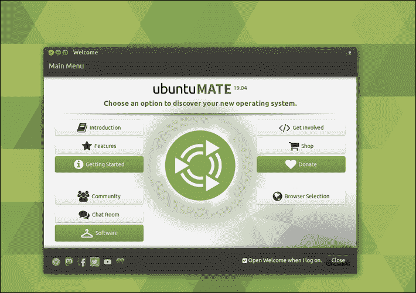

# 如何在树莓派上设置 Ubuntu MATE

> 原文：<https://www.freecodecamp.org/news/how-to-set-up-ubuntu-mate-on-raspberry-pi/>

几天前，我在个人项目中用于 CI 的一个树莓 Pi 停止了工作。这个错误很容易修复，但是因为在那个 PI 上运行任何东西从第一天起就很慢，所以我决定不朝那个方向前进。

此外，因为同样的问题，我总是想切换到另一个操作系统-但我从来没有适当的动机，因为一切都在那个树莓 PI 上工作，对不对？这篇文章带来了动力:)

**注意**:Raspberry PI 的初始设置非常简单:Raspibian 操作系统、VNC 服务器和 Jenkins。

对于刚接触覆盆子的你来说，这里有一些关于覆盆子的背景知识，以及它们的用途。

Raspberry Pi 基本上是最常用的小型计算机，用于学习编程技能、构建硬件项目、实现家庭自动化，有些甚至在工业应用中得到应用。

现在市场上有几种不同类型的 PI。要了解更多关于他们的信息，请访问他们的维基百科页面:[https://en.wikipedia.org/wiki/Raspberry_Pi#Generations](https://en.wikipedia.org/wiki/Raspberry_Pi#Generations)

完成本教程所需的工具:

*   树莓派
*   微型 SD 卡
*   适用于您笔记本电脑的微型 SD 卡适配器
*   Windows 操作系统
*   树莓派鼠标
*   HDMI 线缆，可将您的 Raspberry PI 连接到电视或任何其他类型的屏幕
*   Raspberry PI 的键盘很好，但不是 Ubuntu MATE 提供的屏幕键盘所必需的

完成所有步骤后，本文将向您展示如何:

*   使用 Windows 在 SD 卡上设置 Ubuntu MATE
*   将 Ubuntu MATE 安装到 Raspberry PI
*   安装 Ubuntu MATE 后要做的事情

树莓 PI 有几个 OS 选项可用，Ubuntu Mate 只是其中一个选项。有关其他选项的更多信息，您可以查看这篇文章:

[The 20 Best Raspberry Pi OS Available to Use in 2020In this article you will get a list of top Raspberry Pi OS and their features. Choose the suitable OS for you to build and accomplish your projects.Parijat DuttaUbuntuPIT](https://www.ubuntupit.com/best-raspberry-pi-os-available/)

## 刷新 Ubuntu MATE 到 Micro SD 卡

SD 卡和 u 盘被称为闪存驱动器，因为它们里面有一个闪存。因此，闪存意味着创建一个带有特定操作系统(OS)的可引导驱动器。

导航到 Ubuntu MATE 的下载页面，下载推荐的 Raspberry PI 架构镜像:

[Ubuntu MATE | For a retrospective futureIn a nutshell…Ubuntu MATE TeamUbuntu MATE](https://ubuntu-mate.org/)

Download the Raspberry PI 32 bit version (recommended)

### 设置 SD 卡

下载完 Ubuntu MATE 映像后，我们需要将其写入 SD 卡。为此，我们将使用 Balena 蚀刻工具。Etcher 是一款工具，我们可以从这里下载:

[balenaEtcher - Flash OS images to SD cards & USB drivesA cross-platform tool to flash OS images onto SD cards and USB drives safely and easily. Free and open source for makers around the world.balenaEtcher](https://www.balena.io/etcher/)

Balena Ether download page

安装蚀刻机并发射。然后选择你之前下载的 Ubuntu MATE 镜像文件，以及你的 SD 卡，开始刷新。

**注意**:将 Ubuntu MATE 刷新到 SD 卡需要一些时间，所以你可以自己去喝杯咖啡。

Balena Etcher decompressing Ubuntu MATE image

Balena Etcher validating Ubuntu MATE image

一旦你完成了闪存，从适配器中取出 SD 卡，并将其放入树莓 PI 中。此外，这是您需要将 PI 与鼠标和屏幕连接起来的步骤。

## 在树莓 PI 上安装 Ubuntu MATE

一旦您连接完 Raspberry PI 的所有外围设备，请将其连接到电源并启动。

Ubuntu MATE 的安装过程和普通 Ubuntu 完全一样。在此过程中，您将被要求选择您的键盘布局，时区，用户名和密码。下面是 Ubuntu 18.04 的逐步安装指南: [Ubuntu 安装](https://phoenixnap.com/kb/how-to-install-ubuntu-18-04-bionic-beaver)。

安装完成后，你会看到桌面屏幕。

Ubuntu Mate desktop greeting screen

## 安装 Ubuntu MATE 后要做的事情

### 更新本地数据库

这个命令用更新更新/映射您的本地包的本地数据库，稍后允许您的系统获取包的新版本。

sudo apt 更新

### 升级已安装的软件包

该命令获取您之前用 *sudo 更新*命令映射的机器上的新版本包。

sudo apt 升级

注意:更新 Ubuntu MATE 需要很长时间，所以你可以再喝一杯咖啡，吃一份点心。如果你周围没有糕点，可以去最近的面包店，因为当你回来的时候，你的系统可能已经升级了 50%。

### 安装 Ubuntu 软件应用程序

软件精品店是 Ubuntu MATE 上默认的软件中心。然而，它的应用程序非常有限，我的项目需要的一个更有趣的应用程序不见了。

幸运的是，由于这是一个 Ubuntu 发行版，有一种方法可以安装标准的 Ubuntu 软件中心，它有更多的应用程序选择。

显然有一种通过软件包安装 Ubuntu 软件中心的方式。但是当选择这个选项时，我被卡住了，似乎什么也没有发生，所以我只使用了终端命令:

sudo 安装 ubuntu 软件

Bra gjort！您刚刚在您的 Raspberry PI 设备上完成了 Ubuntu Mate 操作系统的设置！

在我的 [freeCodeCamp 个人资料](https://www.freecodecamp.org/news/author/goran/)、 [Medium 个人资料](https://medium.com/@goranaviani)上查看更多类似的文章，以及我在 [GitHub 页面](https://github.com/GoranAviani)上创建的其他有趣的东西。