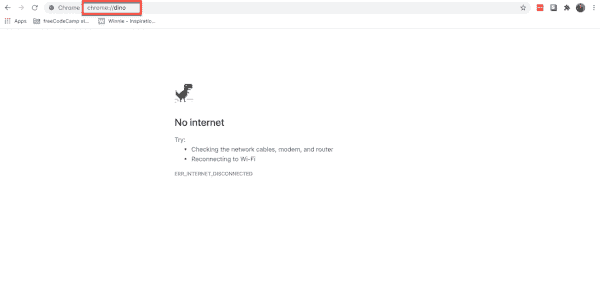
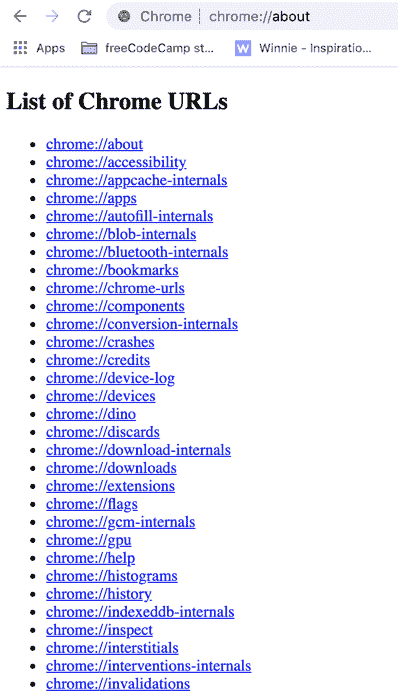
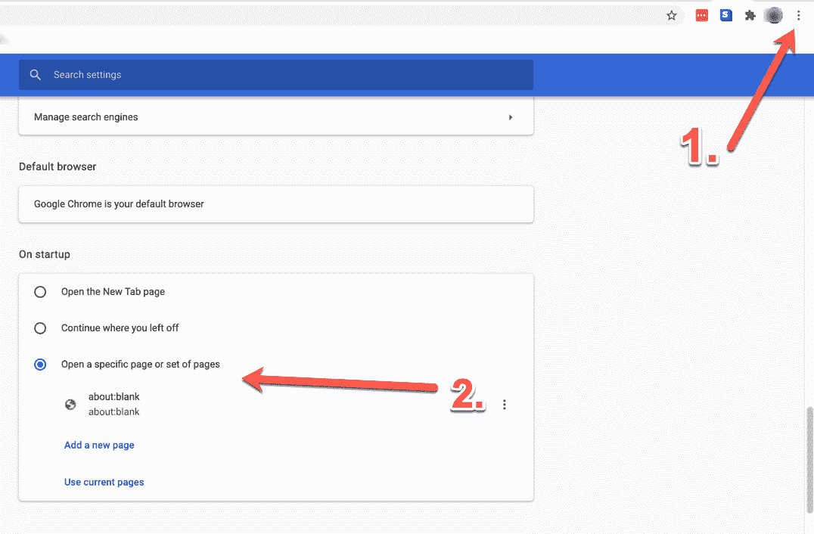

# 关于空白——关于:空白是什么意思，你应该摆脱它吗？

> 原文：<https://www.freecodecamp.org/news/about-blank-what-does-about-blank-mean-and-why-is-it-blocked-in-chrome-and-firefox/>

你有没有试过进入一个网页，却在地址栏看到“about:blank ”,而你想要的网址应该在那里？

不要担心——这有时会发生，并不是什么坏事。在本文中，您将了解到:

*   关于:空白的意思是
*   是什么导致了它的出现
*   为什么你会想用它
*   你是否能摆脱它，还有
*   你是否需要担心它

所以让我们开始吧。

## 关于什么:空白？

关于:空白是当您的浏览器没有其他内容可显示时出现的页面。它不是互联网上的一个页面，而是你浏览器内部的某个东西。

你所看到的“关于”部分来自于你的浏览器的[关于 URI 或者 URL 方案](https://en.wikipedia.org/wiki/About_URI_scheme#:~:text=about%20is%20an%20internal%20URI,registered%20scheme%2C%20and%20is%20standardized.&text=An%20exception%20is%20about%3Ablank%20%2C%20which%20is%20not%20translated.)。您可以在地址栏中键入“about:[whatever]”，以了解有关您的浏览器的更多信息。

这适用于大多数主流浏览器，如 Chrome、Firefox、Safari、Edge、Chromium、Internet Explorer 等。

例如，在 chrome 中你可以输入“about:dino”(哪个 Chrome 会变成 chrome://dino)，你会得到 Chrome 臭名昭著的“没有互联网”dino 消息:

Wait, but why?

如果你从来没有玩过没有互联网的恐龙游戏，[在这里学习如何玩](https://www.freecodecamp.org/news/how-to-play-the-no-internet-google-chrome-dinosaur-game-both-online-and-offline/)(准备浪费你生命中的时间)。但这无关紧要。

更有用的是，例如，“about:about”显示 Chrome 网址列表:

So many URLs (and there were more. Screenshots can only be so big.)

现在回到关于:空白的“空白”部分。它只是告诉你的浏览器，当它没有别的东西显示时，就把那个空白页扔掉。

所以它只是给你展示了一张空白的白纸:

They named it well.

再说一次，这不是互联网上的某个位置——这是你的浏览器为了这个目的而保留在手边的一个空白页。

## 空白是什么原因造成的？

那么为什么这个空白页有时候会出现呢？一些主要原因是:

*   如果你遇到了一个坏的链接/网址
*   如果浏览器不知道去哪里或做什么，它必须做一些事情，所以它显示给你的是:空白
*   如果您的浏览器检测到危险的东西(如恶意软件)，某些浏览器将显示 about:blank，而不是进入危险区域。

如你所见，about:blank 本身并没有什么好担心的。但是如果你经常看到它，你可能要检查你的电脑是否有恶意软件。更多信息请见下文。

## 关于的用途:空白

现在你可能想知道——为什么我要故意显示这个空白页？似乎没什么用。

没那么快。

如果您的带宽有限/互联网连接速度较慢，您可以将浏览器的主页设置为大约:空白。这样，无论何时你打开你的浏览器或者一个新的标签，它都会超快的加载，而不会浪费一个资源或者一毫秒。

### 如何着手:空白作为你的主页

在 Chrome 中，打开菜单(浏览器右上角的三个垂直小点)，向下滚动到“启动时”部分(可能在底部):

然后选择“打开特定页面或一组页面”(第三个选项)，并在出现的文本栏中键入“关于:空白”。

然后当你打开你的浏览器或一个新的标签，你应该看到一个空白的白色页面。

### 关于的其他用途:空白

您可能还想确保，当您打开浏览器时，没有标签页或您之前浏览会话中的任何内容被保留。

从隐私的角度来看，这是有帮助的，并且还允许您在没有互联网的情况下开始浏览会话，这使用较少的带宽。

## 能不能去掉关于:空白？

关于:空白并不是你真正要“摆脱”或避免的东西。但是如果你每次打开浏览器都看到它，那可能是因为它被设置为在启动时显示:空白。

如果你不希望这种情况发生，只需进入并把你的主页改成你想要的样子(按照上面的步骤)。

## 是关于:空白恶意软件还是病毒？

正如我们在本文中看到的，about:blank 本身并没有恶意。但这可能是你的电脑正在拦截恶意软件的迹象。所以他们可能是亲戚。

一些反病毒和反恶意软件软件在检测到不良 URL 或网站时会使用 about:blank。因此，浏览器不会把你导向那个恶意网站，而是抛出那个空白页面来保护你。

从系统中删除恶意软件后，还会出现“about:blank”页面。如果在删除过程中，某个东西损坏了，浏览器将显示 about:blank，因为它无法完成您要求它执行的操作。

最后，除非你想把 about:blank 作为你的主页，或者认为你需要调查你机器上可能的恶意软件或病毒，否则你不需要担心:blank。