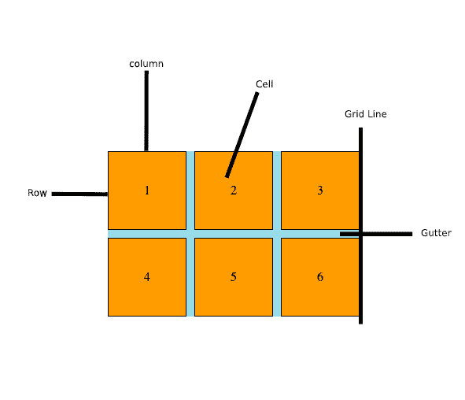
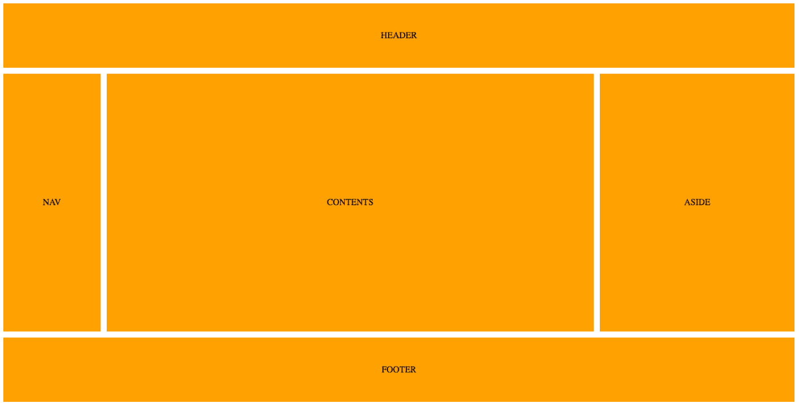
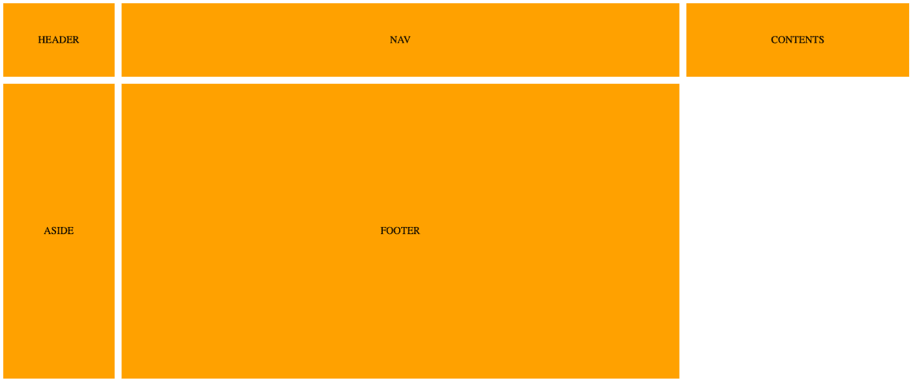

# CSS 网格布局介绍(附示例)

> 原文：<https://www.freecodecamp.org/news/intro-to-css-grid-layout/>

CSS Grid 已经占领了网页设计的世界。真的很酷。互联网上有大量的教程、博客和文章，这些都是很好的知识来源。

但是他们中的大多数用很少的真实例子教你基础知识。因此，在本指南中，我们将边学边看例子。

## 什么是网格？

CSS Grid 允许我们使用网格的浏览器内功能来编写更好的布局。在 CSS 网格出现之前，我们要么必须使用自己的定制网格系统，要么使用类似 Bootstrap 的东西。

这些其他选项工作得很好，但是 CSS grid 消除了我们在这些解决方案中面临的大部分问题。

CSS Grid 使开发简单和复杂的布局变得轻而易举。在这个博客中，我们将学习一些基本的术语，然后继续一个简单的布局例子。

## 基本术语

与 CSS 网格相关的基本术语如下:

1.  列
2.  行
3.  细胞
4.  网格线
5.  排水沟



上图中解释了所有术语。此示例是一个 3x2 列网格，这意味着 3 列和 2 行。

## 布局示例

既然基本概念已经出来了，我们将使用这些概念制作一个布局示例，如下所示:



如你所见，有一个页眉和一个页脚。然后，中间一行有 3 列，第一列的 nav 在右边的侧边栏中，主要内容区域在中间(占据了行的大部分)。

下面是这个例子的 HTML 示例。

```
<div class="wrapper">
  <header class="items">HEADER</header>
  <nav class="items">NAV</nav>
  <div class="items contents">CONTENTS</div>
  <aside class="items">ASIDE</aside>
  <footer class="items">FOOTER</footer>
</div>
```

既然 HTML 已经不碍事了，让我们深入研究 CSS。首先，让我们给它一些样式，使我们的 HTML 看起来像上面一样。这些 CSS 规则不是 CSS 网格的一部分，所以如果你愿意，可以省略它们。

```
.wrapper * {
  background: orange;
  display: flex;
  justify-content: center;
  align-items: center;
  margin-bottom: 1px;
  margin-right: 1px;
}
```

如您所见，我正在对包装容器中的所有项目进行样式化。我将它的背景颜色设置为`orange`，并赋予`bottom`和`right`T3。我设置`display`T5，只是为了通过将`justify-content`和`align-items`设置为`center`来对齐项目的死点。

接下来，让我们进入 CSS 网格的一部分。

```
.wrapper {
  display: grid;
  grid-template-columns: 1fr 5fr 2fr;
  grid-template-rows: 5fr 20fr 5fr;
  grid-gap: 10px;
  height: 720px;
}
```

在上面这段代码中，我们将`display`设置为`grid`——这就是这个主题的标题。这就是我们如何将一个容器转换成`grid`。

接下来，我们设置列和行。我们将通过使用`grid-template-columns`和`grid-template-rows`属性来做到这一点。`grid-template-columns`允许我们用合适的`width`来设置列的数量。`grid-template-rows`允许我们用合适的`height`设置`rows`的数量。

在上面的例子中，有 3 列，第一列取`1 fraction`，第二列取`5 fraction`，第三列取`2 fractions`。单个分数单位表示 **“一片，无论我们将它分成多少片”** 。

如果你看看上面的例子，同样的概念也适用于`rows`。有三行，第一行包含`header`,它将整行跨越所有三列。第二行包含导航、内容和旁白，而页脚则位于第三行也是最后一行，占据了所有三列。

这意味着第一行和最后一行占据相同的高度，即`5 fractions`。中间一排占据了剩余的高度。

接下来，我们还将创建一个 10px 的装订线。我们可以在 CSS 网格中通过使用`grid-gap`属性来做到这一点。最后，我们设置包装容器的高度。

如果我们在浏览器中查看它，就会得到我们想要的结果:



现在让我们通过为页眉和页脚设置一些属性来使它看起来更像我们想要的样子。我们将告诉页眉和页脚占据它们的整个行。

我们将通过使用`grid-column-start`和`grid-column-end`属性来实现这一点，如下所示:

```
header {
  grid-column-start: 1;
  grid-column-end: 4;
}

footer {
  grid-column-start: 1;
  grid-column-end: 4;
}
```

如您所见，页眉和页脚都从`grid line` 1 开始，到`grid line` 4 结束。这允许它们占据整个行。这将产生我们期望的确切输出，如下所示:


## 完全码

```
<!DOCTYPE html>
<html>
<head>
	<title>CSS Grid</title>
	<style type="text/css">
		.wrapper {
			display: grid;
			grid-template-columns: 1fr 5fr 2fr;
			grid-template-rows: 5fr 20fr 5fr;
			grid-gap: 10px;
			height: 720px;
		}

		header {
			grid-column-start: 1;
			grid-column-end: 4;
		}

		footer {
			grid-column-start: 1;
			grid-column-end: 4;
		}

		.wrapper * {
			background: orange;
			display: flex;
			justify-content: center;
			align-items: center;
			margin-bottom: 1px;
			margin-right: 1px;
		}
	</style>
</head>
<body>
	<div class="wrapper">
		<header class="items">HEADER</header>
		<nav class="items">NAV</nav>
		<div class="items contents">CONTENTS</div>
		<aside class="items">ASIDE</aside>
		<footer class="items">FOOTER</footer>
	</div>
</body>
</html>
```

这就是本文的全部内容。更多文章可以关注我[这里](https://www.freecodecamp.org/news/author/zafar/)。如果你喜欢，别忘了在社交媒体上分享。