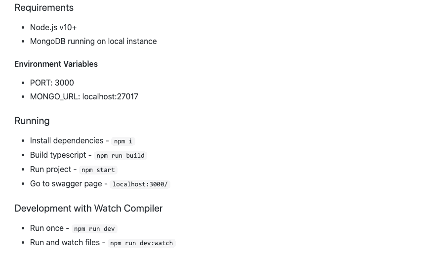
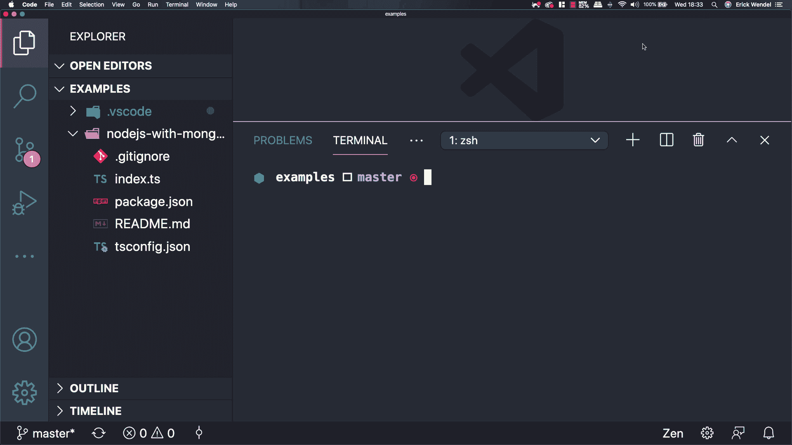

# 如何使用 Docker 卷在基于 Docker 的应用程序上启用实时重新加载

> 原文：<https://www.freecodecamp.org/news/how-to-enable-live-reload-on-docker-based-applications/>

在这篇文章中，你将学习如何配置一个支持实时重载的开发环境。这将允许您转换遗留应用程序，以便它使用 Docker、Docker volumes 和 docker-compose。

一些开发人员在谈论将 Docker 用于他们的开发环境时会嗤之以鼻。他们说 Docker 不利于开发，因为它总是需要重建整个映像来反映所有新的修改。这使得它效率低下，速度缓慢。

在本文中，我们的目标是通过展示简单的配置如何带来许多好处来解决这种思维模式，比如相对于生产和开发环境的可靠环境。

在这篇文章结束时，你将学会如何:

*   转换遗留应用程序以在 Docker 容器内运行；
*   在 Node.js 模块上启用依赖项缓存；
*   使用 docker 卷启用实时重新加载；
*   聚合 docker-compose 中的所有服务。

## **要求**

在接下来的步骤中，您将克隆一个现有的项目来执行本文中的所有示例。在开始编码之前，确保您的机器上安装了以下工具:

*   [坞站](https://docs.docker.com/desktop/)和[复合坞站](https://docs.docker.com/compose/)
*   [Node.js 1](https://nodejs.org/en/download/current/) 0+
*   [去](https://code.visualstudio.com/download)

## **为什么要用 docker？**

越来越多的前沿技术每时每刻都在为互联网发布。它们很稳定，开发和发布起来也很有趣，但是在不同的环境下工作时，它们是不可预测的。因此开发人员创建了 Docker 来帮助减少可能出错的机会。

Docker 是我最喜欢的工具之一，我每天都用它来处理桌面、网络和物联网应用。它不仅让我能够在不同的环境中移动应用程序，还能让我的本地环境尽可能保持干净。

使用尖端技术的开发人员总是在开发新的东西。但是遗留应用程序呢？我们应该用新技术重写一切吗？我知道这不像看起来那么简单。我们应该开发新的东西，但也要改进现有的应用程序。

假设您决定从 Windows 服务器迁移到 Unix 服务器。你会怎么做？你知道你的应用程序运行所需要的每一个依赖吗？

## 开发环境应该是什么样的？

开发人员总是试图通过在他们的编辑器/ide/终端上添加插件、样板文件和代码库来提高工作效率。我认为最好的环境应该是:

1.  易于运行和测试；
2.  环境不可知；
3.  快速评估修改；
4.  易于在任何机器上复制。

遵循这些原则，我们将在本文的下一节中配置应用程序。此外，如果您从未听说过 live-reload(或 hot reload ),这是一个监视代码变化并在需要时重启服务器的功能。所以你不需要来回，重新启动你的应用程序，甚至重建系统。

## 入门指南

首先，您需要一个名为`post-docker-livereload`的空文件夹，作为工作空间。去 [Github 库](https://github.com/ErickWendel/nodejs-with-mongodb-api-example)并在你的 post-docker-live-reload 文件夹中克隆它。

其次，让我们分析一下应用程序需要什么。如果你看一下 README.md 文件，有一些说明演示了如何运行这个应用程序，如下图所示:



它需要 Node.js 版本 10 或更高版本以及 MongoDB。您不用在本地环境机器上安装 MongoDB，而是使用 Docker 安装它。您还将在 localhost:27017 上公开它，以便不通过 Docker 运行的应用程序可以在不知道内部 Docker IP 地址的情况下访问它。

复制下面的命令并粘贴到您的终端中:

```
docker run --name mongodb -p 27017:27017 -d mongo:4
```

使用上面的命令，它将下载并运行 MongoDB 实例。请注意，如果您已经有一个同名的实例，它将抛出一个关于无效名称的错误。

如果您看到错误，运行`docker rm mongodb`，它将删除任何以前的实例，以便您可以再次运行 docker run 命令。

## 深入应用程序

README.md 文件指出，在启动应用程序之前，需要运行一个 MongoDB 实例，以及 Node.js。

如果您安装了 Node.js，请转到`nodejs-with-mongodb-api-example`文件夹并运行以下命令:

```
npm i 
npm run build 
npm start
```

运行完这些命令后，您可以转到 [http://localhost:3000](http://localhost:3000) 上的浏览器，查看应用程序的运行情况，如下图所示:



请记住，该应用程序已经有一个命令来启用 live reload，即`npm run dev:watch`。管道应反映以下步骤:

1.  开发人员更改 Typescript 文件；
2.  将文件转换成 Javascript
3.  服务器注意到 Javascript 的变化并重启 Node.js 服务器。

因此，将文件镜像到 Docker 容器将反映容器中的所有更改。来自应用程序的`npm run build:watch`将捕获这些更改，并在 lib 文件夹中生成输出文件，因此`npm run dev:run`将在每次被触发时重启服务器。

## 归档应用程序

如果 Docker 对你来说是一个全新的世界，不要害怕！您将从头开始配置它。您需要创建几个文件来开始:

1.  `Dockerfile` -收据文件，列出如何安装和运行您的应用程序；
2.  `.dockerignore` -一个文件，列出了哪些文件不能放入 Docker 容器实例中。

### 创建 Dockerfile 文件

Dockerfile 是这里的关键概念。在这里，您可以指定准备和运行应用程序的步骤和依赖项。只要看过 README.md 文件，实现回执文件就很容易了。

我将把整个文件放在下面，稍后再深入研究。在您的`nodejs-with-mongodb-api-example`文件夹中创建一个`Dockerfile` 文件，并粘贴下面的代码:

```
FROM node:14-alpine

WORKDIR /src

ADD package.json /src 

RUN npm i --silent

ADD . /src 

RUN npm run build 

CMD npm start
```

那里发生了什么事？

*   在第 1 行——它使用 Node.js 14 作为它的图像基础——alpine 版本；
*   从第 2 行到第 4 行——它将 Node.js 依赖项从主机复制并安装到容器中。注意，那里的顺序很重要。在恢复依赖项之前将 package.json 添加到 src 文件夹将缓存它，并防止它在每次需要构建映像时安装软件包；
*   从第 6 行到第 7 行——它运行编译过程的命令，然后启动 README.md 文件中提到的程序。

### 忽略不必要的文件。dockerignore

此外，我正在基于 OSX 的系统上工作，Docker 容器将在基于 Linux Alpine 的系统上运行。当您运行`npm install` 时，它将恢复特定环境的依赖关系。

现在您将创建一个文件来忽略从本地机器生成的代码，比如 node_modules 和 lib *。*所以当你从当前目录复制所有文件到容器时，它不会得到无效的包版本。

在`nodejs-with-mongodb-api-example`文件夹中创建一个`.dockerignore` 文件并粘贴下面的代码:

```
node_modules/
lib/
```

### 建立码头工人形象

我更喜欢从根文件夹运行这个应用程序。返回到`post-docker-live-reload`文件夹，运行以下命令，准备一个图像供以后使用:

```
docker build -t app nodejs-with-mongodb-api-example
```

请注意，上面的命令使用了`-t`标志来告诉您图像的名称，然后是包含`Dockerfile`文件的文件夹。

### 使用卷

在运行这个应用程序之前，让我们做一些修改来改善我们在 Docker 容器中的体验。

Docker volumes 是一个通过本地机器和 Docker 环境镜像文件的功能。您还可以在容器上共享卷，并重用它们来缓存依赖关系。

您的目标是观察本地`.ts`文件的任何变化，并将这些变化镜像到容器中。即使文件和`node_modules`文件夹在同一路径。

你还记得我说过每个操作系统中的依赖关系是不同的吗？为了确保我们的本地环境在镜像文件时不会影响 Docker 环境，我们将在一个不同的卷上隔离容器的`node_modules`文件夹。

因此，当在容器上创建`node_modules`文件夹时，它不会在本地机器环境上创建文件夹。在您的终端中运行以下命令来创建它:

```
docker volume create --name nodemodules 
```

### 运行和启用实时重新加载

如您所知，README.md 中指定的`npm run dev:watch`显示了如何启用实时重载。问题是你在本地机器上编码，它必须直接反映你的容器。

通过运行以下命令，您将把本地环境与 Docker 容器链接起来，因此``nodejs-with-mongodb-api-example`` 中的任何更改都会影响容器的`src`文件夹。

```
docker run \
    --name app \
    --link mongodb \
    -e MONGO_URL=mongodb \
    -e PORT=4000 \
    -p 4000:4000 \
    -v `pwd`/nodejs-with-mongodb-api-example:/src \
    -v nodemodules:/src/node_modules \
    app npm run dev:watch
```

让我们深入了解那里发生了什么:

*   `--link`正在授予应用程序访问 MongoDB 实例的权限；
*   `-e` -是环境变量。正如 README.md 文件中提到的，您可以通过覆盖`MONGO_URL`变量来指定想要连接的 MongoDB 连接字符串。如果您想在不同的端口上运行`PORT`变量，请覆盖它。注意，值`mongodb`与我们在前面几节中创建 MongoDB 实例时使用的名称相同。这个值也是内部 MongoDB 实例的 IP 的别名；
*   `-v` -使用虚拟卷将当前目录映射到 Docker 容器。使用`pwd`命令，您可以获得当前工作目录的绝对路径，然后获得您想要在 Docker 容器上镜像的文件夹。还有那个`:/src`。`src`路径是在`Dockerfile`上定义的`WORKDIR`指令，所以我们将本地文件夹镜像到 Docker 容器的 src
*   `-v` -第二个卷将镜像我们在容器的`node_modules`文件夹中创建的单个卷；
*   `app` -图像名称；
*   `npm run dev:watch` -这最后一个命令将覆盖来自`Dockerfile`的`CMD`指令。

运行下面的命令后，可以在修改本地`index.ts`文件后触发浏览器查看结果。下面的视频实际演示了这些步骤:

[https://www.youtube.com/embed/O9vEQhU_JEM?feature=oembed](https://www.youtube.com/embed/O9vEQhU_JEM?feature=oembed)

## 包扎

您知道使用 shell 命令是可行的。但是在这里使用它们并不常见，并且对于运行所有这些命令、构建映像和手动管理实例来说，效率并不高。所以作曲吧！

Docker compose 是一种简化服务聚合和链接的方法。您可以指定数据库、日志、应用程序、卷、网络等等。

首先，您需要删除所有活动实例，以避免暴露端口上的冲突。在终端上运行以下命令，删除卷、服务和容器:

```
docker rm app 
docker volume rm nodemodules
docker stop $(docker ps -aq)
docker rm $(docker ps -aq)
```

### docker-compose 文件

使用以下数据在您的`post-docker-livereload`文件夹中创建一个`docker-compose.yml`文件:

```
version: '3'
services:
    mongodb:
        image: mongo:4
        ports:
            - 27017:27017
    app:
        build: nodejs-with-mongodb-api-example
        command: npm run dev:watch
        ports:
            - 4000:4000
        environment: 
            MONGO_URL: mongodb
            PORT: 4000
        volumes:
            - ./nodejs-with-mongodb-api-example:/src/
            - nodemodules:/src/node_modules
        links:
            - mongodb
        depends_on: 
            - mongodb

volumes:
    nodemodules: {}
```

上面的文件按节指定了资源。注意，这里有`links`和`depends_on`部分。links 字段与您在 shell 命令中使用的标志相同。`depends_on`将确保 MongoDB 是运行您的应用程序的依赖项。它会像变魔术一样在你的应用程序之前运行 MongoDB！

回到您的终端，要启动所有服务并构建 Docker 映像以及创建卷和链接服务，请运行以下命令:

```
docker-compose up --build
```

如果您需要删除之前由那个`Dockerfile`创建的所有服务，您也可以运行`docker-compose down`。

## Docker 是你的朋友！

没错，朋友。Docker 可以帮助你防患于未然。您可以将它用于前端和后端应用程序。即使对于物联网，当您需要控制硬件时，您也可以指定使用它的策略。

作为您的下一步，我强烈建议您看看诸如 Kubernetes 和 Docker swarm 这样的容器编排器。它们可以进一步改进您现有的应用程序，并帮助您进入下一个阶段。

## ****感谢阅读****

我真的很感激我们一起度过的时光。希望这个内容不仅仅是文字。我希望它能帮助你成为一个更好的思考者和程序员。在 [Twitter](https://twitter.com/erickwendel_) 上关注我，并查看我的[个人博客](https://erickwendel.com/)，在那里我分享我所有有价值的内容。

再见！？