# 如何使用 Gatsby、React 传单和 Hygraph 创建旅行清单地图

> 原文：<https://www.freecodecamp.org/news/how-to-create-a-travel-bucket-list-map-with-gatsby-react-leaflet-graphcms/>

旅行很有趣，我们都有很多想去的地方，但我们很少有时间一次都去。这就是遗愿清单的作用！我们如何创建一个自定义的地图应用程序来显示我们遗愿清单上的所有目的地？

注:截至 2022 年 7 月，GraphCMS 现为 [Hygraph](https://hygraph.com/) 。

*   我们要建造什么？
*   [第一步:用 Gatsby 入门手册创建新应用](#step-1-creating-a-new-app-with-gatsby-starter-leaflet)
*   [步骤 2:使用 GraphCMS 创建和管理旅行地点列表](#step-2-creating-and-managing-a-list-of-travel-locations-with-graphcms)
*   [步骤 3:用 Gatsby 和 GraphQL 查询我们的 GraphCMS 位置数据](#step-3-querying-our-graphcms-location-data-with-gatsby-and-graphql)
*   [步骤 4:创建目的地列表，并将它们添加到地图上](#step-4-creating-a-bucket-list-of-destinations-and-adding-them-to-the-map)
*   我们的应用程序还可以增加哪些功能？
*   [想了解更多关于地图的知识？](#want-to-learn-more-about-maps)

[https://www.youtube.com/embed/isbr52VKjb0?feature=oembed](https://www.youtube.com/embed/isbr52VKjb0?feature=oembed)

## 我们要建造什么？

我们将使用 CMS 管理的 [Gatsby](https://www.gatsbyjs.org/) 构建一个地图应用程序，它将在地图上显示标记，并在一个简单的基于文本的列表中显示我们的位置，作为我们的遗愿列表位置。

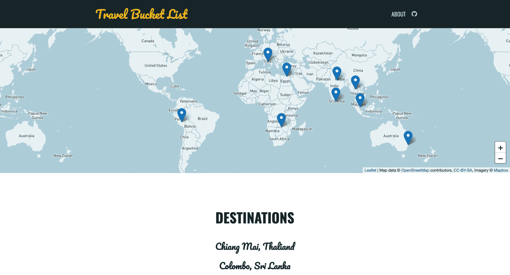

Demo of a Travel Bucket List mapping app

我们将使用 [Gatsby Starter 为传单](https://github.com/colbyfayock/gatsby-starter-leaflet)旋转应用程序，然后我们将使用 [GraphCMS](https://graphcms.com/) 为我们的地图创建和管理位置列表！

## 哇，一个地图应用？

没错。如果你之前没有玩过地图，也不要气馁！这并不像你想象的那么糟糕。如果你更愿意从映射基础开始，你可以先[阅读更多关于映射如何工作的信息](https://www.freecodecamp.org/news/easily-spin-up-a-mapping-app-in-react-with-leaflet/)。

## 步骤 1:用 Gatsby Starter 传单创建新应用程序

我们将从盖茨比的传单开始。这将为我们提供一个基本的 React 应用程序，其中已经内置了我们的映射工具。

### 使用盖茨比入门手册创建新的盖茨比应用程序

首先，导航至您想要创建新应用的位置，然后运行:

```
gatsby new my-travel-bucket-list https://github.com/colbyfayock/gatsby-starter-leaflet 
```

*注:你可以把`my-travel-bucket-list`换成任何你想要的。这将用于为应用程序创建新文件夹。*

一旦你运行它，Gatsby 将会把启动器拉下来并安装依赖项。完成后，导航到该目录并运行开发命令:

```
cd my-travel-bucket-list
yarn develop
# or
npm run develop 
```

一旦完成定位，你的应用程序应该准备好了！

### 清理我们的一些演示代码

因为我们使用了一个启动器，所以它有一点演示代码。让我们把它清理掉以免混淆。

打开`src/pages/index.js`文件。

首先，删除`mapEffect`中除第一行之外的所有内容，并为`leafletElement`到`map`设置一个别名:

```
async function mapEffect({ leafletElement: map } = {}) {
  if ( !map ) return;
} 
```

这样一来，我们可以删除`IndexPage`组件顶部的`markerRef`定义，从`<Marker>`组件中删除`ref={markerRef}`道具，然后再导入`useRef`来进行反应。

现在，我们可以删除所有以`popup`和`time`开头的变量，包括:

*   时间工作室
*   timeToOpenPopupAfterZoom
*   timeToUpdatePopupAfterZoom
*   popupContentHello
*   popupContentGatsby

最后，您可以删除以下所有行:

```
import L from 'leaflet';
...
import { promiseToFlyTo, getCurrentLocation } from 'lib/map';
...
import gatsby_astronaut from 'assets/images/gatsby-astronaut.jpg';
...
const ZOOM = 10; 
```

一旦完成，我们应该准备好了一个基本的地图应用程序！

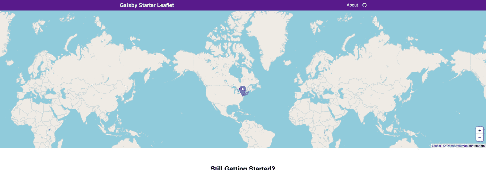

New app with Gatsby Starter Leaflet

[跟随提交！](https://github.com/colbyfayock/my-travel-bucket-list/commit/63eed5a7a208ede6f8eeec44e0c08b594b407360)

## 步骤 2:用 GraphCMS 创建和管理旅行地点列表

### 创建 GraphCMS 帐户

要开始使用 GraphCMS，您需要一个帐户。我不打算向您介绍这一部分，但好消息是，他们有一个慷慨的免费层，使我们很容易注册使用我们的演示！

[注册 GraphCMS](https://app.graphcms.com/signup)

或者，如果您已经有一个帐户，您可以确保您已登录。

### 创建新的 GraphCMS 项目

登录后，我们需要创建一个新项目。我们将手动创建一个，因此一旦在 [GraphCMS 仪表板](https://app.graphcms.com/)上，选择**创建新项目**:

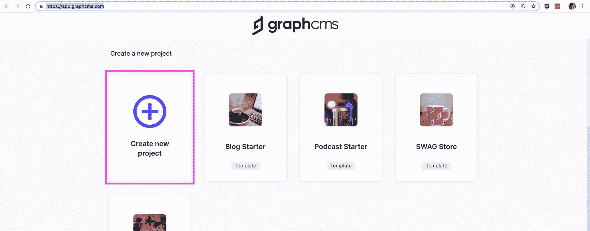

Creating a new project in GraphCMS

在这里，您可以为**名称**和**描述**输入您喜欢的任何内容，例如:

*   名称:我的旅行清单
*   描述:有一天我想去旅游的地方！

下面你会看到一张地图，你可以在上面选择一个**区域**。这是您的数据库数据将要存放的地方，所以虽然对我们的目的来说这可能没什么关系，但是您可以选择离您最近的一个。

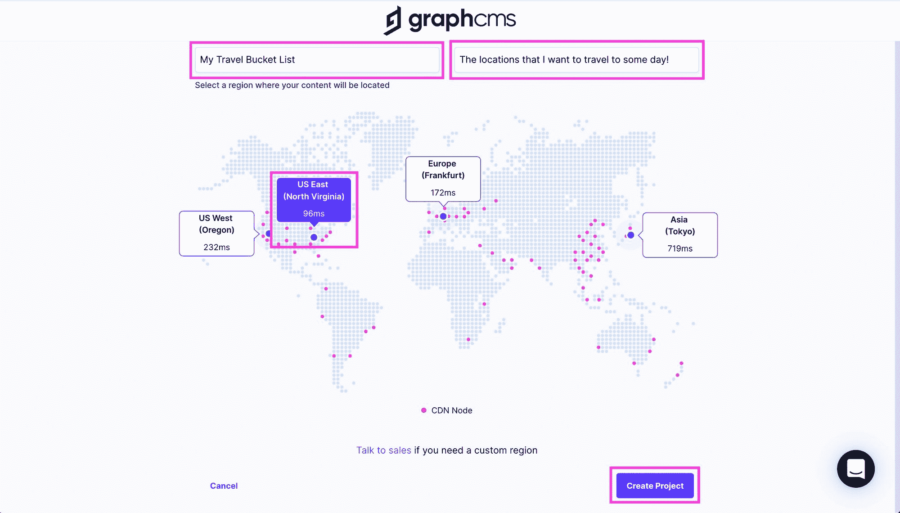

Configuring a new project in GraphCMS

选择选项后，点击**创建项目**。

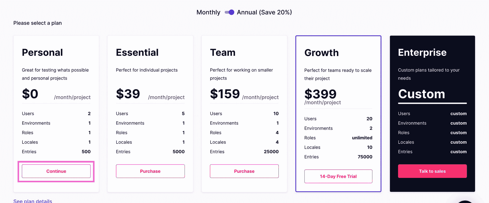

Selecting the Personal plan in GraphCMS

接下来，您将看到付费选项。由于我们只是在创建一个演示，在**个人**下选择**继续**，此时我们将进入新的 GraphCMS 项目仪表板。

### 使用 GraphCMS 创建新的内容模型模式

在 GraphCMS 中，内容模型指的是具有相关联的特定属性的特定类型的数据。在我们的例子中，我们的模型将是一个目的地，它将由一个名称和一个位置定义。

首先，导航到左侧栏中 GraphCMS 的**模式**部分，并选择**创建模型**。

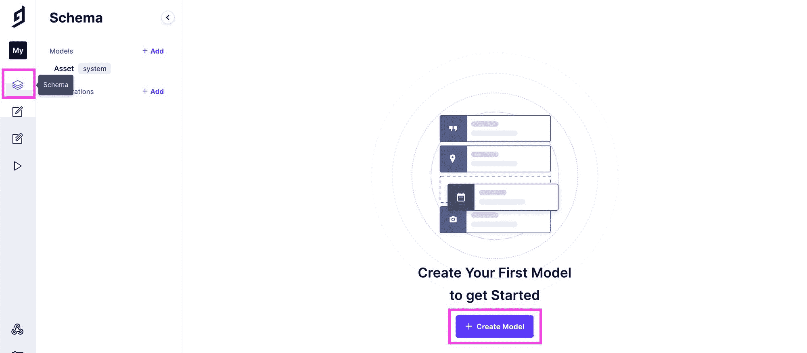

Creating a new Schema Model in GraphCMS

选中后，您将看到一个弹出窗口，要求提供更多信息。在这里，您可以键入“Destination”作为**显示名称**，这也将填充大多数其他字段。我们将让那些保持原样。

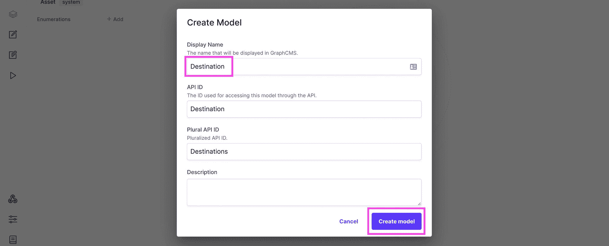

Configuring a new Model in GraphCMS

如果您愿意，可以随意添加描述，但这不是必需的。然后选择**创建模型**。

现在我们有了模型，我们需要我们的属性。

首先，在右边的字段列表中选择**单行文本**，并添加一个“名称”的**显示名称**。这也将填写**应用 Id** ，您可以保持原样。然后点击**创建**。

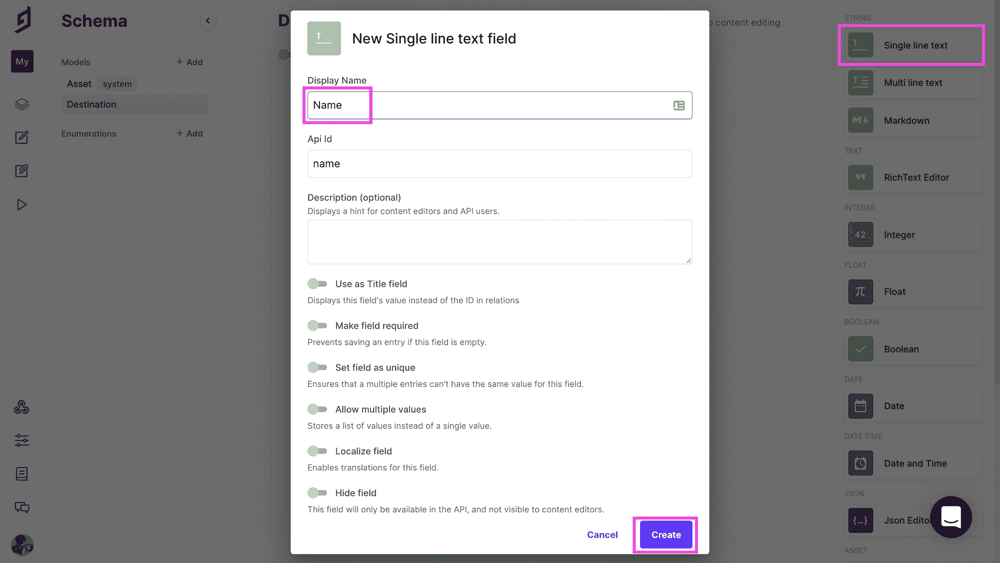

Adding and configuring a new text field in GraphCMS

接下来，向下滚动右边的字段选项，在**位置**下选择**地图**。添加“位置”作为**显示名称**，这将设置**应用 Id** 为“位置”,您可以保持不变。然后和之前一样，点击**创建**。

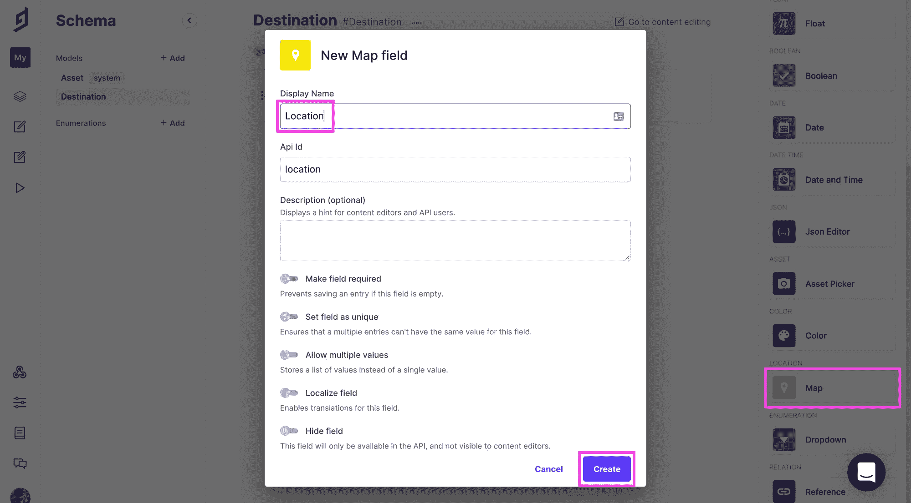

Adding and configuring a new map field in GraphCMS

现在我们有了一个内容模型，我们将使用它来创建我们的位置！

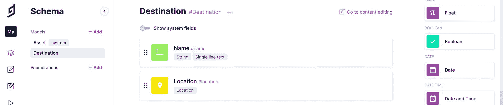

Destination content Model in GraphCMS

### 创建我们的位置

最后，让我们创建我们的位置。导航到 GraphCMS 仪表板中的**内容**，确保您已经选择了**系统**下的**目的地**(应该是唯一的一个)，并选择**创建新的**。

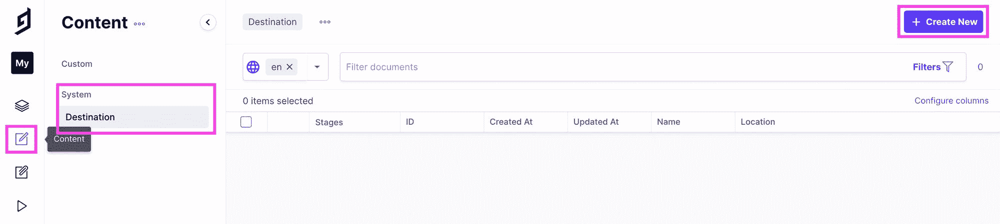

Create new Destination Content in GraphCMS

现在我们可以开始添加我们所有的位置！首先，在**名称**字段中添加您所在位置的名称，然后您可以使用**位置**下的**搜索框**在地图上找到该位置。

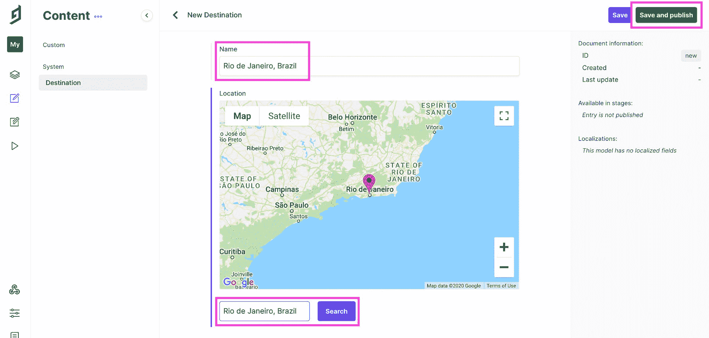

Adding a new Destination Content item in GraphCMS

一旦你准备好了，点击**保存并发布**。这将创建您的第一个位置！

按照同样的步骤，创建任意多个位置。

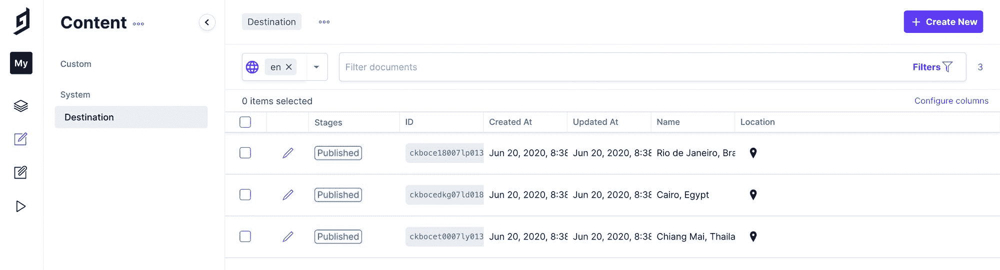

List of Destination Content items in GraphCMS

我们将把这些用于我们的地图和遗愿清单。

## 步骤 3:用 Gatsby 和 GraphQL 查询我们的 GraphCMS 位置数据

现在我们有了我们的位置，让我们使用它们！

### 向 Gatsby 添加一个插件来查询我们的 GraphQL 数据

首先，我们需要[向 Gatsby 项目添加一个新插件](https://www.gatsbyjs.org/packages/gatsby-source-graphql/)来查询我们的 GraphQL 数据。在您的终端中，确保您的开发服务器没有运行，然后运行:

```
yarn add gatsby-source-graphql
# or
npm install gatsby-source-graphql 
```

接下来，打开项目根目录下的`gatsby-config.js`文件，将以下内容添加到插件中:

```
{
  resolve: 'gatsby-source-graphql',
  options: {
    typeName: 'GCMS',
    fieldName: 'gcms',
    url: '[API ENDPOINT]',
  }
} 
```

这将是我们从 GraphCMS 获得数据的来源，但我们需要一个终点。

### 寻找我们的图形 api 端点

打开备份浏览器，进入 GraphCMS 项目。在左侧导航中选择**设置**后，选择 **API 访问**。

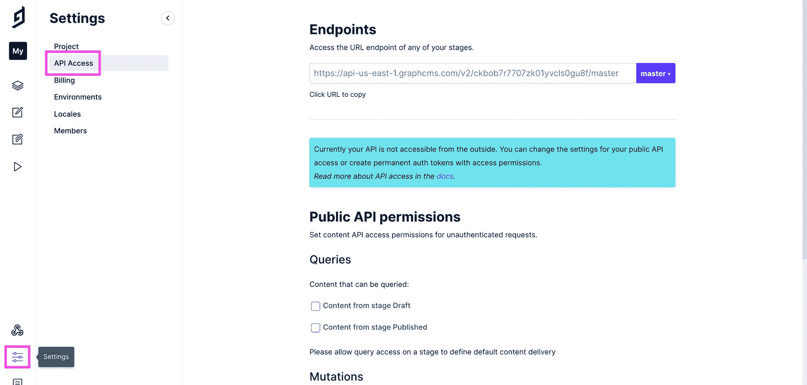

API Access in GraphCMS

在我们复制我们的 API 端点之前，首先我们需要更新我们的权限，以便我们可以查询我们的 API。在**公共 API 权限**下，勾选**发布阶段内容**旁边的复选框，点击**保存**。

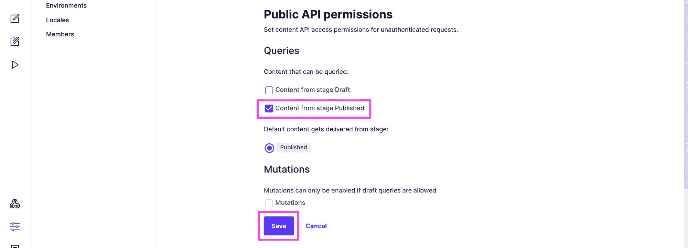

Configuring API permissions in GraphCMS

接下来，复制**端点**下的 URL:

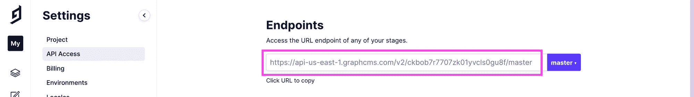

Copying API Endpoint in GraphCMS

并将它粘贴到我们在上面修改过的`gatsby-config.js`文件中:

```
{
  resolve: 'gatsby-source-graphql',
  options: {
    typeName: 'GCMS',
    fieldName: 'gcms',
    url: 'https://[region-id].graphcms.com/v2/[project-id]/master',
  },
}, 
```

*注意:你的 URL 将在`[region-id]`和`[project-id]`中有实际值。*

保存您的`gatsby-config.js`文件并启动您的开发服务器备份(`yarn develop`)，我们就可以开始了！

### 通过 GraphQL 查询我们的位置

最后，让我们实际查询我们的数据，以便能够在我们的应用程序中使用它。

我们将创建一个新的 [React Hook](https://reactjs.org/docs/hooks-reference.html) ,我们将能够使用它在我们的应用程序中的任何地方获取我们的位置。

在`src/hooks/index.js`下，将以下行添加到现有列表中:

```
export { default as useDestinations } from './useDestinations'; 
```

这将允许我们更方便地导入我们接下来要创建的钩子。

在`src/hooks`下，创建一个新文件`useDestinations.js`，并粘贴以下代码:

```
import { graphql, useStaticQuery } from 'gatsby';

export default function useDestinations() {
  const { gcms = {} } = useStaticQuery( graphql`
    query {
      gcms {
        destinations {
          id
          name
          location {
            latitude
            longitude
          }
        }
      }
    }
  ` );

  let { destinations } = gcms;

  return {
    destinations,
  };
} 
```

在这里，我们是:

*   从 Gatsby 导入`graphql`和`useStaticQuery`实用程序
*   我们正在创建一个默认导出的新函数(或钩子)
*   在该函数中，我们使用`useStaticQuery`创建一个新的 GraphQL 查询，该查询要求 GraphCMS 返回我们定义的数据结构。
*   该查询返回一个值，我们立即析构该值以获取`gmcs`对象
*   我们从`gmcs`中析构`destinations`,并从我们的钩子中将它作为新对象的一部分返回

有了这个，我们现在可以在应用程序的任何地方使用钩子了！

打开你的`src/pages/index.js`文件，首先导入我们的新钩子:

```
import { useDestinations } from 'hooks'; 
```

在`IndexPage`组件的顶部，查询我们的数据:

```
const { destinations } = useDestinations(); 
```

这将我们所有的位置放入`destinations`变量中。我们可以通过控制台将其注销来测试这是否可行:

```
console.log('destinations', destinations); 
```

一旦我们打开浏览器，在 web 开发人员工具控制台中查看，我们就可以看到我们的位置数据！

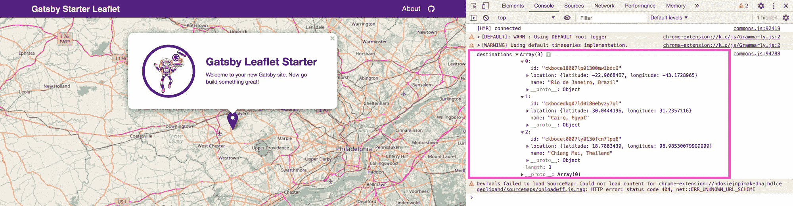

Logging destinations data to the web console 

## 步骤 4:创建目的地列表，并将它们添加到地图中

我们将从创建一个简单的目的地文本列表开始。这将让我们以一种易于阅读的格式看到我们所有的目的地。

### 创建我们目的地的文本列表

我们的`IndexPage`里面还有上面的“还入门？”，让我们添加以下代码:

```
<h2>My Destinations</h2>
<ul>
  { destinations.map(destination => {
    const { id, name } = destination;
    return <li key={id}>{ name }</li>
  })}
</ul> 
```

此代码:

*   为我们的列表添加新标题
*   创建一个新的无序列表
*   循环遍历我们的`destinations`,并为每个目的地创建一个新的列表项，其中包括该地点的名称

一旦我们点击保存和重新加载，我们应该看到我们的地图下的列表！

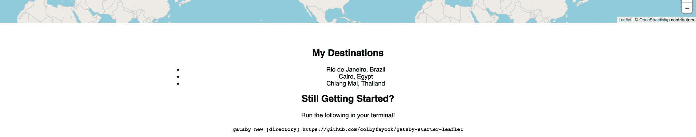

New basic list of destinations in the app

这份名单看起来有点奇怪，对吗？我们可能希望将它的格式设置得更好一点，以适应页面。

打开`src/assets/stylesheets/pages/_home.scss`并在`.home-start`类中添加:

```
.home-start {

  ...

  ul {
    list-style: none;
    padding: 0;
    margin: 1.2em 0;
  } 
```

让我们也修改一下`h2`来更好地分隔东西:

```
.home-start {

  ...

  h2 {

    margin-top: 2em;

    &:first-child {
      margin-top: 0;
    }

  } 
```

一旦你点击保存和重新加载，它应该看起来好一点。

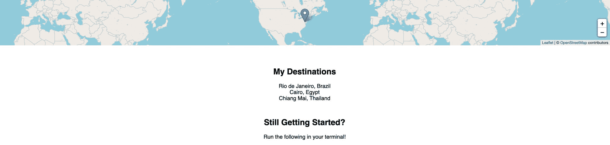

Destinations in the app with cleaned up styles

您可以随意进行额外的修改，但是我们现在就把它留在这里。

### 将我们的目的地添加到地图

现在我们终于可以在地图上添加我们的目的地了！

在我们的`<Map>`组件中，我们已经有了一个`<Marker>`。这使我们可以很容易地在地图上给定位置添加标记。我们将采用这个概念，并将其与我们的文本列表相结合，以将我们的位置添加到地图中。

让我们更新我们的`<Map>`代码，以匹配以下内容:

```
<Map {...mapSettings}>
  { destinations.map(destination => {
    const { id, name, location } = destination;
    const position = [location.latitude, location.longitude];
    return <Marker key={id} position={position} />
  })}
</Map> 
```

在这里我们:

*   循环遍历我们的`destinations`，在我们的`<Map>`中动态创建一个新的组件列表
*   在每个循环实例中，我们从`destination`开始构造日期
*   我们用纬度和经度创建一个新的`position`数组
*   创建一个新的`Marker`，我们使用我们的位置将其添加到地图中

这给了我们地图上的标记！

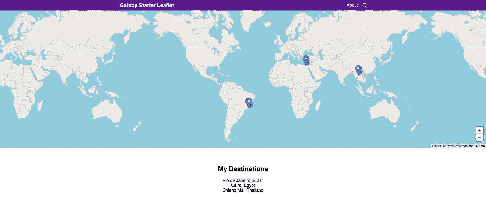

Markers for each destination in the mapping app

但是我们想知道每个位置是什么，所以我们也给每个标记添加一个弹出窗口来显示名称。

首先，我们需要从`react-leaflet`导入`Popup`:

```
import { Marker, Popup } from 'react-leaflet'; 
```

然后，让我们更新我们的`<Marker>`组件以返回:

```
return (
  <Marker key={id} position={position}>
    <Popup>{ name }</Popup>
  </Marker>
); 
```

一旦我们保存并打开备份地图，您现在可以点击每个标记并查看我们的目的地名称！

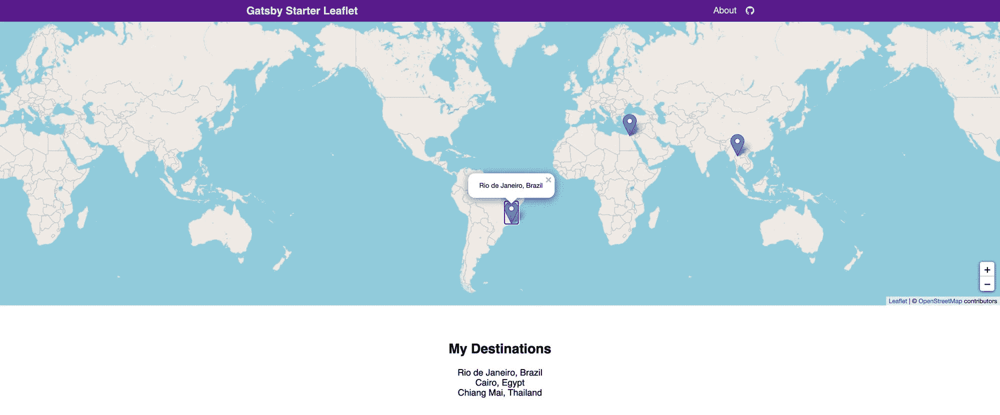

Popup for each destination marker in the mapping app

### 在我们结束之前，把地图放在中间

之前，我们的演示地图以 DC 的华盛顿州为中心。让我们把它更新到世界的中心，因为我们的地图没有聚焦在美国。

将`LOCATION`变量更新为:

```
const LOCATION = {
  lat: 0,
  lng: 0,
}; 
```

就这样，我们有了地图！

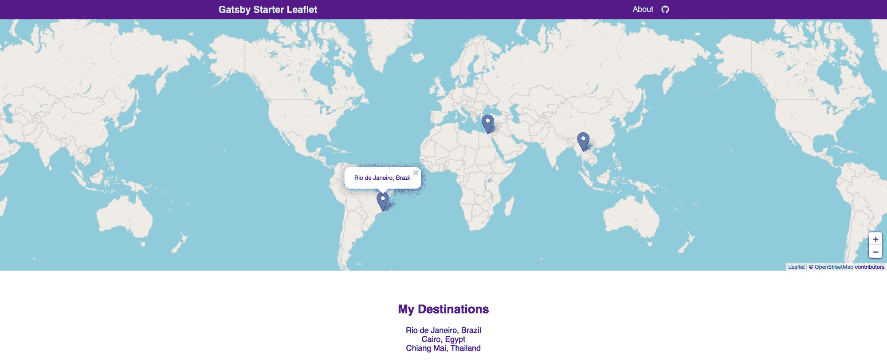

Final mapping app with markers and popups for each destination

[跟随提交！](https://github.com/colbyfayock/my-travel-bucket-list/commit/56dbadb74cea2770174eb8ea7c039be27ca18971)

## 我们还可以在应用程序中添加哪些其他功能？

### 添加检查每个位置的方法

在 GraphCMS 中，您可以向目的地内容模型添加一个新字段，允许您选择是否访问了每个位置。

有了这个值，我们可以将它添加到我们的查询中，并使用某种指示器(如复选标记)来更新我们的地图，以表明我们已经将它从我们的清单中删除了！

### 自定义地图背景样式

我们使用的是公开版本的 OpenStreetMap，它是开源的，但是 T2 的 Mapbox 提供了一些很酷的地图，我们可以用它们来使它看起来更令人印象深刻。

如果你想开始改变你的地图样式，你可以[看看我的另一个演练](https://www.freecodecamp.org/news/how-to-set-up-a-custom-mapbox-basemap-with-gatsby-and-react-leaflet/)来学习如何使用 Mapbox。

[查看博文](https://www.colbyfayock.com/2020/04/how-to-set-up-a-custom-mapbox-basemap-style-with-react-leaflet-and-leaflet-gatsby-starter)或[观看视频](https://www.youtube.com/watch?v=KcPJr1b_rv0)！

### 使用自定义图像设置地图标记的样式

您可以查看我的视频，了解如何将标记更改为自定义图像。

更进一步，当你检查完一个位置时，使用上面的功能动态显示不同的标记图像。

查看 Egghead.io 上的视频！

## 想了解更多关于地图的知识？

查看我的其他教程和视频:

*   [用反应传单](https://egghead.io/playlists/mapping-with-react-leaflet-e0e0?af=atzgap) ( [egghead.io](https://egghead.io/?af=atzgap) )作图
*   [有 React、【盖茨比】、&传单](https://www.youtube.com/playlist?list=PLFsfg2xP7cbJTnTFH3OGXEAt9O1mpoqpR)(【youtube.com】T2 的地图应用
*   [如何用盖茨比和传单](https://www.colbyfayock.com/2020/03/how-to-create-a-coronavirus-covid-19-dashboard-map-app-with-gatsby-and-leaflet)(colbyfayock.com)创建冠状病毒(新冠肺炎)仪表盘&地图 App
*   [如何用盖茨比和宣传单](https://www.colbyfayock.com/2020/03/how-to-create-a-summer-road-trip-mapping-app-with-gatsby-and-leaflet)(colbyfayock.com)创建一个夏季公路旅行地图应用
*   [如何使用传单](https://www.freecodecamp.org/news/easily-spin-up-a-mapping-app-in-react-with-leaflet/)(colbyfayock.com)以简单的方式创建地图应用
*   [谁都会地图！灵感和对地图世界的介绍](https://www.colbyfayock.com/2020/03/anyone-can-map-inspiration-and-an-introduction-to-the-world-of-mapping)(colbyfayock.com)

## 你的旅行愿望清单上有什么？

在推特上告诉我！

> 想学习如何创建一个包含所有梦想目的地的旅行清单吗？？？
> 
> 我会带你通过 [@GatsbyJS](https://twitter.com/GatsbyJS?ref_src=twsrc%5Etfw) 和 [@LeafletJS](https://twitter.com/LeafletJS?ref_src=twsrc%5Etfw) 创建一个新的 [#mapping](https://twitter.com/hashtag/mapping?src=hash&ref_src=twsrc%5Etfw) 应用程序，显示你所有用 [@GraphCMS](https://twitter.com/GraphCMS?ref_src=twsrc%5Etfw) 管理的目的地。
> 
> ？[# web dev](https://twitter.com/hashtag/webdev?src=hash&ref_src=twsrc%5Etfw)[# 100 daysofcode](https://twitter.com/hashtag/100DaysOfCode?src=hash&ref_src=twsrc%5Etfw)[https://t.co/1hhWiQOfYw](https://t.co/1hhWiQOfYw)
> 
> — Colby Fayock (@colbyfayock) [June 23, 2020](https://twitter.com/colbyfayock/status/1275441134144110595?ref_src=twsrc%5Etfw)