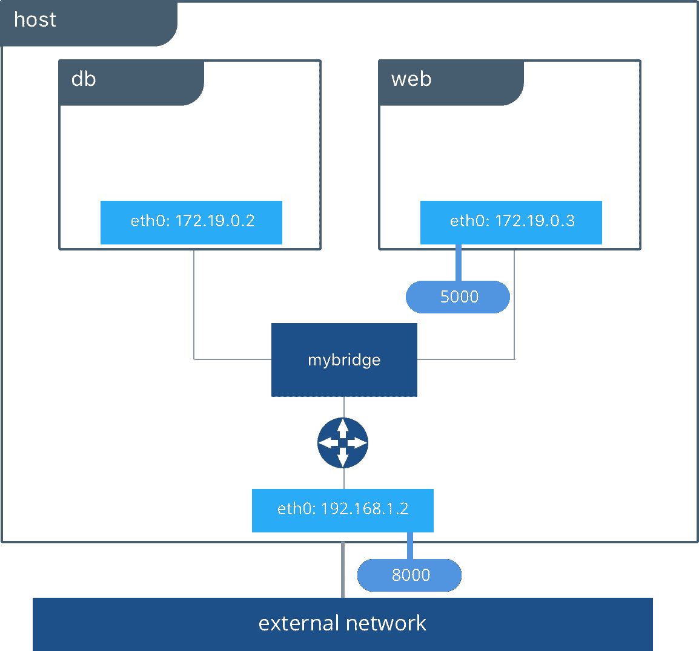
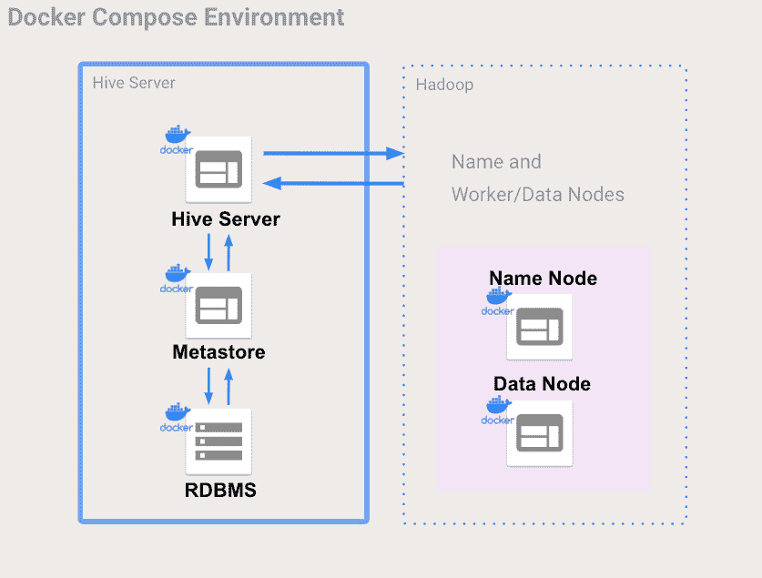
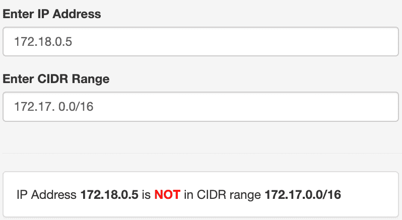

# 如何获得 Docker 容器的 IP 地址——举例说明

> 原文：<https://www.freecodecamp.org/news/how-to-get-a-docker-container-ip-address-explained-with-examples/>

Docker 提供了在松散隔离的环境(称为容器)中打包和运行应用程序的能力。

我知道你可能在想什么——拜托，别再发一篇解释 Docker 是什么的帖子了，现在 Docker 无处不在！


但是别担心，我们会跳过这个基本介绍。本文的目标读者应该已经对 Docker 和容器有了基本的了解。

但是你有没有想过如何获得 Docker 容器的 IP 地址？

## Docker 网解释

首先，我们来了解一下 Docker 网络的工作原理。为此，我们将重点关注默认的`bridge`网络。当你使用 Docker 时，如果你没有指定一个驱动程序，这就是你正在使用的网络类型。



Docker network from: [understanding-docker-networking-drivers-use-cases](https://www.docker.com/blog/understanding-docker-networking-drivers-use-cases/)

`bridge`网络作为主机内部的私有网络工作，因此其上的容器可以通信。通过向容器公开端口来授予外部访问权限。

当您的应用程序在需要通信的独立容器中运行时，使用桥接网络。

在上图中，`db`和`web`可以在用户创建的名为`mybridge`的桥接网络上相互通信。

如果您从未在 Docker 中添加过网络，您应该会看到类似下面的内容:

```
$ docker network ls

NETWORK ID          NAME                  DRIVER              SCOPE
c3cd46f397ce        bridge                bridge              local
ad4e4c24568e        host                  host                local
1c69593fc6ac        none                  null                local
```

列出了默认的`bridge`网络，以及`host`和`none`。我们将忽略其他两个，并在讨论示例时使用`bridge`网络。

## 码头集装箱 IP 地址

默认情况下，容器会为其连接的每个 Docker 网络分配一个 IP 地址。每个网络都有一个默认的子网掩码，以后可以用它作为一个地址池来分配 IP 地址。

通常 Docker 使用默认的 **172.17。用于容器网络的 0.0/16** 子网。

现在为了更好地理解它，我们将执行一个真实的用例。


### Docker 示例

为了说明这一点，我们将使用一个包含 5 个 Docker 容器的 Hive 和 Hadoop 环境。

查看我们将要执行的`docker-compose.yml`文件:

```
version: "3"

services:
  namenode:
    image: bde2020/hadoop-namenode:2.0.0-hadoop2.7.4-java8
    volumes:
      - namenode:/hadoop/dfs/name
    environment:
      - CLUSTER_NAME=test
    env_file:
      - ./hadoop-hive.env
    ports:
      - "50070:50070"
  datanode:
    image: bde2020/hadoop-datanode:2.0.0-hadoop2.7.4-java8
    volumes:
      - datanode:/hadoop/dfs/data
    env_file:
      - ./hadoop-hive.env
    environment:
      SERVICE_PRECONDITION: "namenode:50070"
    ports:
      - "50075:50075"
  hive-server:
    image: bde2020/hive:2.3.2-postgresql-metastore
    env_file:
      - ./hadoop-hive.env
    environment:
      HIVE_CORE_CONF_javax_jdo_option_ConnectionURL: "jdbc:postgresql://hive-metastore/metastore"
      SERVICE_PRECONDITION: "hive-metastore:9083"
    ports:
      - "10000:10000"
  hive-metastore:
    image: bde2020/hive:2.3.2-postgresql-metastore
    env_file:
      - ./hadoop-hive.env
    command: /opt/hive/bin/hive --service metastore
    environment:
      SERVICE_PRECONDITION: "namenode:50070 datanode:50075 hive-metastore-postgresql:5432"
    ports:
      - "9083:9083"
  hive-metastore-postgresql:
    image: bde2020/hive-metastore-postgresql:2.3.0

volumes:
  namenode:
  datanode: 
```

[来自**【对接-hive】**github](https://github.com/mesmacosta/docker-hive)

没有人想读一个**巨大的**配置文件，对吧？这是一张图片:



好多了！现在让我们启动这些容器:

```
docker-compose up -d 
```

我们可以看到 5 个容器:

```
$ docker ps --format \
"table {{.ID}}\t{{.Status}}\t{{.Names}}"

CONTAINER ID        STATUS                   NAMES
158741ba0339        Up 1 minutes             dockerhive_hive-metastore-postgresql
607b00c25f29        Up 1 minutes             dockerhive_namenode
2a2247e49046        Up 1 minutes             dockerhive_hive-metastore
7f653d83f5d0        Up 1 minutes (healthy)   dockerhive_hive-server
75000c343eb7        Up 1 minutes (healthy)   dockerhive_datanode
```

接下来，让我们检查一下我们的 Docker 网络:

```
$ docker network ls

NETWORK ID          NAME                  DRIVER              SCOPE
c3cd46f397ce        bridge                bridge              local
9f6bc3c15568        docker-hive_default   bridge              local
ad4e4c24568e        host                  host                local
1c69593fc6ac        none                  null                local
```

等一下...有一个新的网络叫做`docker-hive_default`！

默认情况下，docker compose 会为您的应用程序设置一个单独的网络。您的应用程序的网络根据“项目名称”命名，源自其所在目录的名称。

既然我们的目录被命名为`docker-hive`，这就解释了新的网络。

接下来是一些如何获得 Docker IP 地址的例子。

## 如何获得 Docker 容器的 IP 地址-示例

现在你们注意到了，我们要揭开神秘的面纱。


### 1.使用 Docker 检查

Docker inspect 是检索 Docker 对象底层信息的好方法。您可以以相当简单的方式从返回的 JSON 中挑选出任何字段。

那么我们要用它从`dockerhive_datanode`那里得到 IP 地址吗？

```
$ docker inspect -f \
'{{range .NetworkSettings.Networks}}{{.IPAddress}}{{end}}' \
75000c343eb7

172.18.0.5
```

你不是说 Docker 用默认的 **172.17 吗。用于容器联网的 0.0/16** 子网？为什么返回的 IP 地址: **172.18.0.5** 在外面？



Image created on [ip-address-in-cidr-range](https://tehnoblog.org/ip-tools/ip-address-in-cidr-range/)

要回答这个问题，我们必须看看我们的网络设置:

```
$ docker network inspect -f \
'{{range .IPAM.Config}}{{.Subnet}}{{end}}'  9f6bc3c15568

172.18.0.0/16
```

我们在计算引擎虚拟机中执行了这个示例，在这个测试中，docker 网络被分配了一个不同的子网: **172.18.0.0/16** 。这就解释了！

此外，我们还可以查找`docker-hive_default`网络内部的所有 IP 地址。

所以我们不需要单独查找每个容器的 IP:

```
$ docker network inspect -f \
'{{json .Containers}}' 9f6bc3c15568 | \
jq '.[] | .Name + ":" + .IPv4Address'

"dockerhive_hive-metastore-postgresql:172.18.0.6/16"
"dockerhive_hive-metastore:172.18.0.2/16"
"dockerhive_namenode:172.18.0.3/16"
"dockerhive_datanode:172.18.0.5/16"
"dockerhive_hive-server:172.18.0.4/16"
```


如果你没有注意到，我们使用 [**jq**](https://github.com/stedolan/jq) 帮助解析`Containers`地图对象。

### 2.使用 Docker exec

在下面的例子中，我们将使用`dockerhive_namenode`。

```
$ docker exec dockerhive_namenode cat /etc/hosts

127.0.0.1       localhost
::1     localhost ip6-localhost ip6-loopback
fe00::0 ip6-localnet
ff00::0 ip6-mcastprefix
ff02::1 ip6-allnodes
ff02::2 ip6-allrouters
172.18.0.3      607b00c25f29
```

### 3.码头集装箱内

```
$ docker exec -it dockerhive_namenode /bin/bash

# running inside the dockerhive_namenode container
ip -4 -o address

7: eth0    inet 172.18.0.3/16 brd 172.18.255.255 scope global eth0
```

我们甚至可以找到同一网络中一个容器内的其他容器的 IP 地址:

**数据节点**

```
# running inside the dockerhive_namenode container
ping dockerhive_datanode

PING dockerhive_datanode (172.18.0.5): 56 data bytes
64 bytes from 172.18.0.5: icmp_seq=0 ttl=64 time=0.092 ms
```

**Hive mestastore**

```
# running inside the dockerhive_namenode container
ping dockerhive_hive-metastore

PING dockerhive_hive-metastore_1 (172.18.0.2): 56 data bytes
64 bytes from 172.18.0.2: icmp_seq=0 ttl=64 time=0.087 ms
```

**蜂巢服务器**

```
# running inside the container
ping dockerhive_hive-server

PING dockerhive_hive-server (172.18.0.4): 56 data bytes
64 bytes from 172.18.0.4: icmp_seq=0 ttl=64 time=0.172 ms
```

## **总结**

所有示例都是在 linux 分布式计算引擎虚拟机中执行的。如果您在 macOS 或 Windows 环境中执行它们，示例命令可能会有一些变化。

还要记住，示例中的 IP 地址是示例`docker-hive_default`网络的内部地址。因此，如果您有一个从外部连接到这些容器的用例，您将需要使用主机的外部 IP(假设您正确地公开了容器端口)。

或者如果你正在使用 kubernetes，例如，管理你的 Docker 容器，让它为你处理 IP 地址[kubernetes-expose-external-IP-address](https://kubernetes.io/docs/tutorials/stateless-application/expose-external-ip-address/)？。

***插图来自[icons8.com](https://icons8.com/)作者[缪拉·卡尔卡万](https://dribbble.com/muratkalkavan)。**