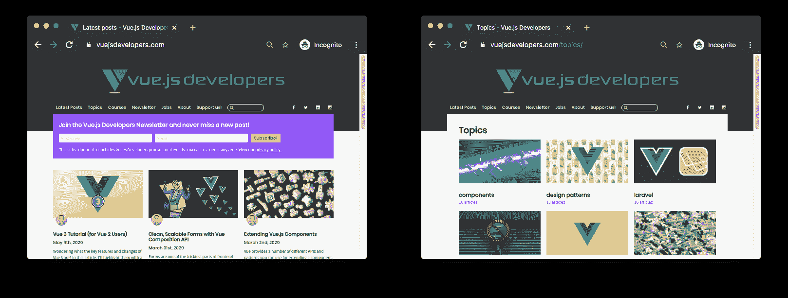

# 如何在静态 Nuxt 应用程序中使用平面文件数据

> 原文：<https://www.freecodecamp.org/news/how-to-use-flat-file-data-in-a-static-nuxt-app/>

让你的 Nuxt web 应用成为静态的，可能会节省你设置服务器渲染应用的时间和金钱。它还可以提供卓越的性能。

但是如果你的应用需要动态数据呢？最流行的解决方案是在静态应用程序旁边建立一个 API，通过 AJAX 传递动态数据。

在本文中，我将向您展示另一种可能的架构——使用平面文件数据库。这种架构可以省去设置 API 的麻烦，并提供卓越的性能。

## 什么是平面文件数据库？

“平面文件数据库”是一种数据库架构，其中数据存储在一个简单的文本文件中，而不是像 MySQL 或 MongoDB 这样的数据库软件中。

在 Nuxt 应用程序中，这个文件可以是一个 JSON 文件，它位于静态文件目录中，与标记文件一起部署。

在运行时，JSON 文件由 Nuxt 应用程序加载。一旦数据被解析为 JavaScript 数据，就可以用来驱动应用程序。

## 为什么要使用平面文件数据库？

平面文件数据库的优势在于其简单性和低开销。但是它们也不安全，不能提供传统数据库软件的性能优势，这也是它们很少被使用的原因。

然而，在 Nuxt 应用程序的环境中，它们有另一个很大的优势——它们可以通过静态托管来存储和访问。

与 API 服务相比，使用平面文件数据库还具有性能优势，API 服务在服务器处理请求时会产生较小的延迟开销。

然而，平面文件数据库并不总是适合使用，因为它们不提供安全性，并且在生产中是只读的。这意味着你需要在任何时候重建站点来写入新的数据。

元数据是一种适合进行平面文件存储和检索的数据类型。例如，在我用 Nuxt 构建的 [Vue.js 开发者博客](https://vuejsdevelopers.com/)上，我使用一个平面文件数据库来存储关于已发布帖子的元数据。

这使我可以轻松地访问整个站点的数据，例如，在显示最新博客文章的主页上，以及在根据应用的主题标签对文章进行索引的主题页面上(如下所示)。



## 在 Nuxt 中实现平面文件数据库架构

现在让我们看看如何在您自己的 Nuxt 站点中实现平面文件数据库架构。

假设我们想创建一个博客主页，显示像 Vue.js 开发人员博客上那样的最新发表的文章。

我们将从查看平面文件来源的数据如何在页面中使用开始，然后反向工作，直到我们可以看到整个架构是如何工作的。

### 在页面中使用平面文件数据

在我们的主页组件 *pages/index.vue* 中，我们将从即将创建的 JavaScript 模块`flatFileDb`中导入`getArticleSummaries`。

该方法将返回一个包含文章摘要数据的承诺，以便在页面上使用。

当然，您可以在构建时通过`asyncData`使用这些数据，在运行时通过`created`钩子使用这些数据。

页面/索引。视图:

```
const { getArticleSummaries } from "@/assets/js/flatFileDb";

export default {
    data: () => ({
        articleSummaries: []
    }),
    async asyncData () {
        const articleSummaries = await getArticleSummaries();
        return { articleSummaries }
    },
    async created () {
        this.articleSummaries = await getArticleSummaries();
    }
} 
```

请注意，我们将从`getArticleSummaries`获得的数据结构将是这样一个对象数组:

```
[
    {
        title: "...",
        description: "...",
        published: "...",
        ...
    },
    ...
] 
```

注意:如果你有多个实体(例如，除了文章之外，你还存储关于视频的信息)，每个实体在应用程序中都有自己的平面文件和自己的检索方法，就像`getVideoSummaries`。

### 平面文件数据库模块

我们在上面看到从`flatFileDb`模块中导入了一个`getArticleSummary`方法。让我们看看如何实现它。

我们的平面文件数据库将包含在我们的静态文件中，并且应该是一个 JSON 文件，因为这些很容易解析为有效的 JavaScript 数据。

我们将通过使用动态导入来包含这个 JSON 文件。这个特性是为导入 JavaScript 模块而设计的，但是它可以通过 Webpack 直接使用 JSON 文件。方便的是，您可以获得已经被解析为 JavaScript 的 JSON 文件。

重要的是在`try/catch`块中调用动态导入，以防止在文件丢失或 JSON 解析失败时应用崩溃。

在我们将数据返回给消费组件之前，我们需要用另一个定制方法`decodeArticleSummaries`来“解码”它。我一会儿会解释的。

最后，注意 JSON 文件没有默认的导出，所以您需要访问 db 模块的`default`属性来访问数据。

*assets/js/flatFileDb.js* :

```
import { decodeArticleSummaries } from "dbDecoders";

const getArticleSummaries = async () => {
    try {
    const db = await import(`@/static/article-summaries.json`);
    return decodeArticleSummaries(db.default);
  } catch (err) {
    console.log(err);
    return [];
  }
};

export { getArticleSummaries }; 
```

### 解码数据库

上面，我说过提供给组件的数据应该是这样的:

```
{
    title: "...",
    description: "...",
    published: "...",
    // etc
} 
```

但是，它不应该像这样存储在数据库中，因为属性名太长了。

为了使平面文件尽可能精简，我们应该在创建数据库时对每个键进行“编码”。然后我们应该在组件使用它们之前对它们进行解码，这样开发人员就可以使用它们的全名了。

所以，假设我们让“title”= >“t”，“description”= >“d”，“published”= >“p”。在大型数据库中，这种转换可以将文件大小减少许多字节。

*assets/js/dbDecode.js* :

```
const decodeArticleSummaries = db => {
    return db.map(article => ({
        title: article.t,
        description: article.d,
        published: article.p
        // etc
    }));
} 
```

## 生成平面文件数据库

现在我们已经看到了平面文件数据库在运行时是如何被消耗的。它是如何产生的？

您可以手动创建平面文件数据库，但是通常您会希望在构建时使用 Node.js 脚本来生成它。

在我们的例子中，我们希望编写一个脚本，提取每篇文章的元数据，并将其存储为*static/article-summaries . JSON*。让我们假设文章以 markdown 的形式存储在项目根目录下的“articles”目录中。

该脚本的细节将特定于您的实现，所以我只给你伪代码来传达基本思想。

*scripts/generateDb.js* :

```
const fs = require("fs");
const frontmatterExtractor = require("./frontmatterExtractor");
const encodeArticleSummaries = require("./encodeArticleSummaries");

module.exports = async () => {
    // Load article files
    const articles = await fs.readdir("/articles", (err, filePaths) => {
        // Create the database by reading each file
        const db = filePaths.map(async path => {
            const file = await fs.readFile(path);
            // Extract the meta data
            return frontmatterExtractor(file);
        });
        // Encode the data
        const encoded = encodeArticleSummaries(db);
        // Write the database object to a JSON file
        await fs.writeFile(
            "/static/article-summaries.json", 
            JSON.stringify(encoded)
        );
    });
} 
```

## 在站点构建之前运行数据库生成器脚本

现在我们已经有了一个数据库生成器脚本，让我们在构建(或生成)流程需要使用它之前触发它运行。

为此，我们将它压缩到 *package.json* 中的 NPM 命令中。注意，通过使用`&&`操作符，我们可以确保 Nuxt 进程在生成器脚本完成之前不会开始。

*package.json* :

```
{
    ...
    "scripts": {
        ...
        "build": "node scripts/generateDb && nuxt build",
        "generate": "node scripts/generateDb && nuxt generate",
        ...
    }
    ...
} 
```

然而，在开发过程中，我发现每当我需要更新数据库时，在命令行上手动生成数据库更容易:

```
$ node scripts/generateDb 
```

## 进一步阅读

这是解释的基本架构。以下是其他几篇文章，了解更多信息:

*   [使用 Netlify 和 Nuxt 进行 jam stack](https://blog.lichter.io/posts/jamstack-nuxt-netlify/)
*   【JAMStack 中多种 API 集成方式
*   [在 Vue 或 Nuxt SPA 中包含降价内容](https://vuejsdevelopers.com/2018/12/31/vue-nuxt-spa-markdown/)