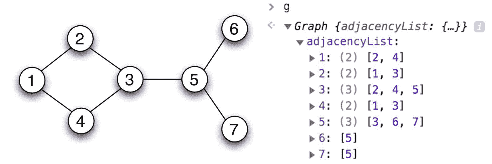
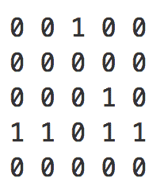
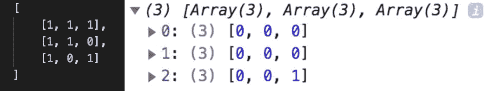
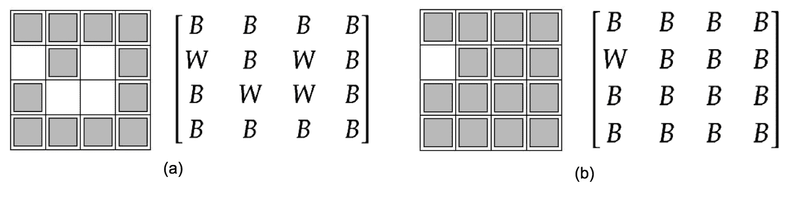
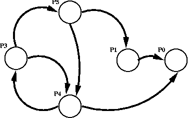
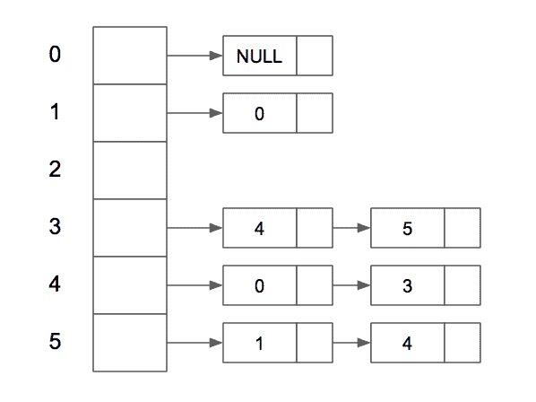
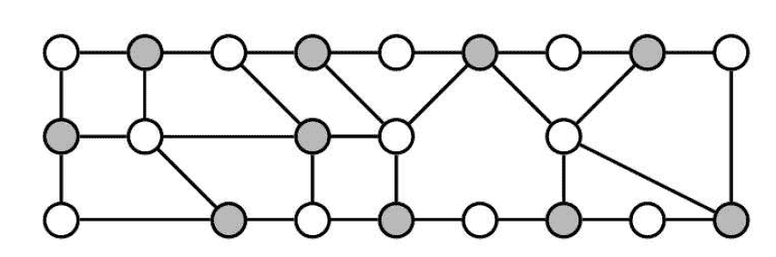

# 如何在 JavaScript 中实现 8 种基本的图形算法

> 原文：<https://www.freecodecamp.org/news/8-essential-graph-algorithms-in-javascript/>

在本文中，我将实现 **8 个图算法**,探索 JavaScript 中图的搜索和组合问题(遍历、最短路径和匹配)。

这些问题是从《Java 编程面试的元素》一书中借来的。书中的解决方案是用 Java、Python 或 C++编写的，这取决于你所拥有的书的版本。

尽管问题建模背后的逻辑是与语言无关的，但我在本文中提供的代码片段使用了一些 JavaScript 警告。

每个问题的每个解决方案都分为 3 个部分:解决方案概述、伪代码，最后是 JavaScript 中的实际代码。

为了测试代码并看到它做它应该做的事情，你可以使用 Chrome 的开发工具在浏览器上运行代码片段，或者使用 NodeJS 从命令行运行它们。

## 图形实现

图的两个最常用的[表示是邻接表和邻接矩阵。](https://www.geeksforgeeks.org/graph-and-its-representations/)

我要解决的问题是针对稀疏图(很少的边)，邻接表方法中的顶点操作需要常数(添加一个顶点，O(1))和线性时间(删除一个顶点，O(V+E))。因此，在大多数情况下，我将坚持使用该实现。

让我们使用**邻接表**用一个简单的**无向图**实现来解决这个问题。我们将维护一个对象(adjacencyList ),它将包含图形中的所有顶点作为键。这些值将是所有相邻顶点的数组。在下面的例子中，顶点 1 连接到顶点 2 和 4，因此 adjacencyList: { 1 : [ 2，4 ] }对其他顶点依此类推。

为了构建这个图，我们有两个函数: **addVertex** 和 **addEdge** 。addVertex 用于向列表中添加一个顶点。addEdge 用于通过将相邻顶点添加到源和目标数组来连接顶点，因为这是一个无向图。要制作一个有向图，我们可以简单地删除下面代码中的第 14–16 行和第 18 行。

在删除一个顶点之前，我们需要遍历相邻顶点的数组，并删除该顶点所有可能的连接。



An undirected, unweighted graph implemented using Adjacency List

```
class Graph {
  constructor() {
    this.adjacencyList = {};
  }
  addVertex(vertex) {
    if (!this.adjacencyList[vertex]) {
      this.adjacencyList[vertex] = [];
    }
  }
  addEdge(source, destination) {
    if (!this.adjacencyList[source]) {
      this.addVertex(source);
    }
    if (!this.adjacencyList[destination]) {
      this.addVertex(destination);
    }
    this.adjacencyList[source].push(destination);
    this.adjacencyList[destination].push(source);
  }
  removeEdge(source, destination) {
    this.adjacencyList[source] = this.adjacencyList[source].filter(vertex => vertex !== destination);
    this.adjacencyList[destination] = this.adjacencyList[destination].filter(vertex => vertex !== source);
  }
  removeVertex(vertex) {
    while (this.adjacencyList[vertex]) {
      const adjacentVertex = this.adjacencyList[vertex].pop();
      this.removeEdge(vertex, adjacentVertex);
    }
    delete this.adjacencyList[vertex];
  }  
}
```

## 图形遍历

基于上一节中的图形实现，我们将实现图形遍历:广度优先搜索和深度优先搜索。

### 横向优先搜索

BFS 一次访问节点**的一层**。为了防止多次访问同一个节点，我们将维护一个**访问过的**对象。

因为我们需要以先进先出的方式处理节点，所以队列是使用数据结构的一个很好的竞争者。时间复杂度为 O(V+E)。

```
function BFS
   Initialize an empty queue, empty 'result' array & a 'visited' map
   Add the starting vertex to the queue & visited map
   While Queue is not empty:
     - Dequeue and store current vertex
     - Push current vertex to result array
     - Iterate through current vertex's adjacency list:
       - For each adjacent vertex, if vertex is unvisited:
         - Add vertex to visited map
         - Enqueue vertex
   Return result array
```

### 深度优先搜索

DFS 以深度方式访问节点。因为我们需要以后进先出的方式处理节点，所以我们将使用一个**栈**。

从一个顶点开始，我们将把相邻的顶点推到堆栈中。每当弹出一个顶点时，它在我们的已访问对象中被标记为已访问。它的相邻顶点被推到堆栈中。由于我们总是弹出一个新的相邻顶点，我们的算法将总是**探索一个新的层次**。

我们也可以使用内部堆栈调用递归地实现 DFS。逻辑是一样的。

时间复杂度与 BFS 相同，O(V+E)。

```
function DFS
   Initialize an empty stack, empty 'result' array & a 'visited' map
   Add the starting vertex to the stack & visited map
   While Stack is not empty:
     - Pop and store current vertex
     - Push current vertex to result array
     - Iterate through current vertex's adjacency list:
       - For each adjacent vertex, if vertex is unvisited:
         - Add vertex to visited map
         - Push vertex to stack
   Return result array
```

```
Graph.prototype.bfs = function(start) {
    const queue = [start];
    const result = [];
    const visited = {};
    visited[start] = true;
    let currentVertex;
    while (queue.length) {
      currentVertex = queue.shift();
      result.push(currentVertex);
      this.adjacencyList[currentVertex].forEach(neighbor => {
        if (!visited[neighbor]) {
          visited[neighbor] = true;
          queue.push(neighbor);
        }
      });
    }
    return result;
}
Graph.prototype.dfsRecursive = function(start) {
    const result = [];
    const visited = {};
    const adjacencyList = this.adjacencyList;
    (function dfs(vertex){
      if (!vertex) return null;
      visited[vertex] = true;
      result.push(vertex);
      adjacencyList[vertex].forEach(neighbor => {
          if (!visited[neighbor]) {
            return dfs(neighbor);
          }
      })
    })(start);
    return result;
}
Graph.prototype.dfsIterative = function(start) {
    const result = [];
    const stack = [start];
    const visited = {};
    visited[start] = true;
    let currentVertex;
    while (stack.length) {
      currentVertex = stack.pop();
      result.push(currentVertex);
      this.adjacencyList[currentVertex].forEach(neighbor => {
        if (!visited[neighbor]) {
          visited[neighbor] = true;
          stack.push(neighbor);
        }
      });
    }
    return result;
}
```

## 搜索迷宫

问题陈述:

> 给定一个由黑白条目组成的 2D 数组，代表一个有指定入口和出口点的迷宫，找出一条从入口到出口的路径，如果存在的话。–Aziz、Adnan 等人*节目采访的要素*

我们将用 0 表示白色条目，用 1 表示黑色条目。白色条目表示开放区域，黑色条目表示墙壁。入口点和出口点由一个数组表示，第 0 个索引和第 1 个索引分别用行和列索引填充。



Maze represented by 2D array

解决方案:

*   为了移动到不同的位置，我们将在**方向数组**中硬编码四种可能的移动(右、下、左和上；无对角线移动):

```
[ [0,1], [1,0], [0,-1], [-1,0] ]
```

*   为了跟踪我们已经访问过的单元格，我们将用黑色条目( **1 的**)替换白色条目( **0 的**)。我们基本上是递归地使用 **DFS** 来遍历迷宫。结束递归的基本情况是，要么我们已经到达出口点并返回真值，要么我们已经访问了每个白色入口并返回假值。
*   另一件需要跟踪的重要事情是确保我们始终在迷宫的边界内，并且只有当我们在白色入口处是 T4 时，我们才继续前进。**是一个可行的函数**会处理这个问题。
*   时间复杂度:O(V+E)

伪代码:

```
function hasPath
   Start at the entry point
   While exit point has not been reached
     1\. Move to the top cell
     2\. Check if position is feasible (white cell & within boundary)
     3\. Mark cell as visited (turn it into a black cell)
     4\. Repeat steps 1-3 for the other 3 directions
```

```
var hasPath = function(maze, start, destination) {
    maze[start[0]][start[1]] = 1;
    return searchMazeHelper(maze, start, destination);
};
function searchMazeHelper(maze, current, end) { // dfs
    if (current[0] == end[0] && current[1] == end[1]) {
        return true;
    }
    let neighborIndices, neighbor;
    // Indices: 0->top,1->right, 2->bottom, 3->left 
    let directions = [ [0,1] , [1,0] , [0,-1] , [-1,0] ];
    for (const direction of directions) {
        neighborIndices = [current[0]+direction[0], current[1]+direction[1]];
        if (isFeasible(maze, neighborIndices)) {
            maze[neighborIndices[0]][neighborIndices[1]] = 1;
            if (searchMazeHelper(maze, neighborIndices, end)) {
                return true;
            }
        }
    }
    return false;
}
function isFeasible(maze, indices) {
    let x = indices[0], y = indices[1];
    return x >= 0 && x < maze.length && y >= 0 && y < maze[x].length && maze[x][y] === 0;
}
var maze = [[0,0,1,0,0],[0,0,0,0,0],[0,0,0,1,0],[1,1,0,1,1],[0,0,0,0,0]]
hasPath(maze, [0,4], [3,2]);
```

## 绘制布尔矩阵

问题陈述:

> *实现一个例程，该例程采用一个 n X m 布尔数组 A 和一个条目(X，y ),并翻转与(X，y)关联的区域的颜色。–*Aziz、Adnan 等*编程面试的要素*

这两种颜色将由 0 和 1 表示。

在下面的例子中，我们从数组的中心([1，1])开始。注意，从那个位置开始，我们只能到达最左上的三角形矩阵。无法到达最右侧的最低位置([2，2])。因此，在这个过程的最后，它是唯一没有翻转的颜色。



n x m Boolean array before and after colors are flipped

解决方案:

*   像上一个问题一样，我们将编写一个数组来定义 4 个可能的移动。
*   我们将使用 BFS 来遍历图形。
*   我们将稍微修改 is 可行函数。它仍将检查新位置是否在矩阵的边界内。另一个要求是新位置的颜色要和以前的位置一样。如果新位置符合要求，它的颜色就会翻转。
*   时间复杂度:O(mn)

伪代码:

```
function flipColor
   Start at the passed coordinates and store the color
   Initialize queue
   Add starting position to queue
   While Queue is not empty:
     - Dequeue and store current position
     - Move to the top cell
       1\. Check if cell is feasible
       2\. If feasible,
          - Flip color
          - Enqueue cell
       3\. Repeat steps 1-2 for the other 3 directions
```

```
function flipColor(image, x, y) {
    let directions = [ [0,1] , [1,0] , [0,-1] , [-1,0] ];
    let color = image[x][y];
    let queue = [];
    image[x][y] = Number(!color);
    queue.push([x,y]);
    let currentPosition, neighbor;
    while (queue.length) {
        currentPosition = queue.shift();
        for (const direction of directions) {
            neighbor = [currentPosition[0]+direction[0], currentPosition[1]+direction[1]];
            if (isFeasible(image, neighbor, color)) {
                image[neighbor[0]][neighbor[1]] = Number(!color);
                queue.push([neighbor[0], neighbor[1]]);
            }
        }
    }
    return image;
}
function isFeasible(image, indices, color) {
    let x = indices[0], y = indices[1];
    return x >= 0 && x < image.length && y >= 0 && y < image[x].length && image[x][y] == color;
}
var image = [[1,1,1],[1,1,0],[1,0,1]];
flipColor(image,1,1);
```

## 计算封闭区域

问题陈述:

> *设 A 是一个 2D 数组，其条目不是 W 就是 b .写一个程序，取 A，用 b 替换所有不能到达边界的 W——*Aziz，Adnan，et al. *编程面试要素*



The grids before and after being enclosed

解决方案:

*   与其遍历所有条目来寻找被包围的 W 条目，不如从边界 W 条目开始**，遍历图，**标记连接的 W 条目**更好。这些标记的条目保证是**而不是封闭的**，因为它们连接到棋盘边界上的 W 条目。这个预处理基本上是程序必须完成的任务的补充。**
*   然后，A 被再次迭代，并且未标记的**W 条目(将是被包围的条目)被改变为 **B 条目**。**
*   我们将使用与 A 维数相同的布尔数组来跟踪标记和未标记的 W 条目。标记的条目将被设置为 true。
*   时间复杂度:O(mn)

伪代码:

```
function fillSurroundedRegions
   1\. Initialize a 'visited' array of same length as the input array
      pre-filled with 'false' values
   2\. Start at the boundary entries
   3\. If the boundary entry is a W entry and unmarked:
         Call markBoundaryRegion function
   4\. Iterate through A and change the unvisited W entry to B
function markBoundaryRegion
   Start with a boundary W entry
   Traverse the grid using BFS
   Mark the feasible entries as true
```

```
function fillSurroundedRegions(board) {
    if (!board.length) {
        return;
    }
    const numRows = board.length, numCols = board[0].length;
    let visited = [];
    for (let i=0; i<numRows; i++) {
        visited.push(new Array(numCols).fill(false, 0, numCols));
    }
    for (let i=0; i<board.length; i++) {
        if (board[i][0] == 'W' && !visited[i][0]) {
            markBoundaryRegion(i, 0, board, visited);
        }
        if (board[i][board.length-1] == 'W' && !visited[i][board.length-1]) {
            markBoundaryRegion(i, board.length-1, board, visited);
        }
    }
    for (let j=0; j<board[0].length; j++) {
        if (board[0][j] == 'W' && !visited[0][j]) {
            markBoundaryRegion(0, j, board, visited);
        }
        if (board[board.length-1][j] == 'W' && !visited[board.length-1][j]) {
            markBoundaryRegion(board.length-1, j, board, visited);
        }
    }
    for (let i=1; i<board.length-1; i++) {
        for (let j=1; j<board.length-1; j++) {
            if (board[i][j] == 'W' && !visited[i][j]) {
                board[i][j] = 'B';
            }
        }
    }
    return board;
}
function markBoundaryRegion(i, j, board, visited) {
    let directions = [ [0,1] , [1,0] , [0,-1] , [-1,0] ];
    const queue = [];
    queue.push([i,j]);
    visited[i][j] = true;
    let currentPosition, neighbor;
    while (queue.length) {
        currentPosition = queue.shift();
        for (const direction of directions) {
            neighbor = [i+direction[0], j+direction[1]];
            if (isFeasible(board,visited,neighbor)) {
                visited[neighbor[0]][neighbor[1]] = true;
                queue.push(neighbor);
            }
        }
    }
}
function isFeasible(board, visited, neighbor) {
    let x = neighbor[0], y = neighbor[1];
    return x >= 0 && x < board.length && y >= 0 && y < board[x].length && board[x][y] == 'W';
}
var board = [['B','B','B','B'],['W','B','W','B'],['B','W','W','B'],['B','B','B','B']];
fillSurroundedRegions(board);
```

## 死锁检测(有向图中的循环)

问题陈述:

> 一种死锁检测算法利用“等待”图来跟踪一个进程当前阻塞了哪些其他进程。在等待图中，进程被表示为节点，从进程 P 到 0 的边意味着 0 持有 P 需要的资源，因此 P 正在等待 0 释放它对该资源的锁定。此图中的循环意味着死锁的可能性。这引发了下面的问题。
> *写一个程序，输入一个有向图，并检查这个图是否包含一个圈。–*Aziz、Adnan 等人*编程访谈的要素*



Example of a Wait-for graph (a)

在上面的等待图中，我们的**死锁检测程序**将检测至少一个**周期**并返回 true。

对于这个算法，我们将使用稍微不同的**有向图**的实现来探索其他数据结构。我们仍然使用**邻接表**来实现它，但是代替一个对象(地图)，我们将顶点存储在一个**数组**中。

从第**个进程**开始，**个进程**将被建模为**个顶点**。流程之间的**依赖关系**将被建模为顶点之间的**边**。**边**(相邻顶点)将存储在**链表**中，依次存储在对应于进程号的索引处。

```
class Node {
    constructor(data) {
        this.data = data;
        this.next = null;
    }
}
class LinkedList {
    constructor() {
        this.head = null;
    }
    insertAtHead(data) {
        let temp = new Node(data);
        temp.next = this.head;
        this.head = temp;
        return this;
    }
    getHead() {
        return this.head;
    }
}
class Graph {
    constructor(vertices) {
        this.vertices = vertices;
        this.list = [];
        for (let i=0; i<vertices; i++) {
            let temp = new LinkedList();
            this.list.push(temp);
        }
    }
    addEdge(source, destination) {
        if (source < this.vertices && destination < this.vertices) {
            this.list[source].insertAtHead(destination);
        }
        return this;
    }
}
```



Wait-for graph (a) implementation

解决方案:

*   每个顶点将被赋予三种不同的颜色:白色、灰色和黑色。最初所有的顶点将被涂成白色**。当一个顶点正在被处理时，它将被着色为**灰色**，处理后**黑色**。**
*   **使用深度优先搜索遍历图形。**
*   **如果存在从一个灰色顶点到另一个灰色顶点的边，我们已经发现了一个**后沿**(一个自循环或连接到其祖先之一的边)，因此检测到一个**循环**。**
*   **时间复杂度:O(V+E)**

**伪代码:**

```
`function isDeadlocked
   Color all vertices white
   Run DFS on the vertices
     1\. Mark current node Gray
     2\. If adjacent vertex is Gray, return true
     3\. Mark current node Black
   Return false`
```

```
`const Colors = {
    WHITE: 'white', 
    GRAY: 'gray', 
    BLACK: 'black'
}
Object.freeze(Colors);
function isDeadlocked(g) {
    let color = [];
    for (let i=0; i<g.vertices; i++) {
        color[i] = Colors.WHITE;
    }
    for (let i=0; i<g.vertices; i++) {
        if (color[i] == Colors.WHITE) {
             if (detectCycle(g, i, color)) {
                return true;
             }   
        }
    }
    return false;
};
function detectCycle(g, currentVertex, color) {
    color[currentVertex] = Colors.GRAY;
    let neighbor;
    let nextNode = g.list[currentVertex].getHead();
    while (nextNode !== null) {
        neighbor = nextNode.data;
        if (color[neighbor] == Colors.GRAY) {
            return true;
        }
        if (color[neighbor] == Colors.WHITE && detectCycle(g, neighbor, color)) {
            return true;
        }
    }
    color[currentVertex] = Colors.BLACK;
    return false;
}
let g = new Graph(3);
g.addEdge(0,1);
g.addEdge(0,2);
isDeadlocked(g);`
```

## **克隆图**

**问题陈述:**

> **考虑有向图的顶点类型，其中有两个字段:整数标签和对其他顶点的引用列表。设计一个算法，它引用一个顶点 u，并在从 u 可达的顶点上创建一个图的副本。返回 u 的副本**

**解决方案:**

*   **维护一个**图**，该图**将原始顶点映射到其对应的**。在边缘复制。**
*   **使用 BFS 访问相邻的顶点(边)。**
*   **时间复杂度:O(n)，其中 n 是节点总数。**

**伪代码:**

```
`function cloneGraph
   Initialize an empty map
   Run BFS
   Add original vertex as key and clone as value to map
   Copy over edges if vertices exist in map
   Return clone`
```

```
`class GraphVertex {
    constructor(value) {
        this.value = value;
        this.edges = [];
    }
}
function cloneGraph(g) {
    if (g == null) {
        return null;
    }
    let vertexMap = {};
    let queue = [g];
    vertexMap[g] = new GraphVertex(g.value);
    while (queue.length) {
        let currentVertex = queue.shift();
        currentVertex.edges.forEach(v => {
            if (!vertexMap[v]) {
                vertexMap[v] = new GraphVertex(v.value);
                queue.push(v);
            }
            vertexMap[currentVertex].edges.push(vertexMap[v]);
        });
    }
    return vertexMap[g];
}
let n1 = new GraphVertex(1);
let n2 = new GraphVertex(2);
let n3 = new GraphVertex(3);
let n4 = new GraphVertex(4);
n1.edges.push(n2, n4);
n2.edges.push(n1, n3);
n3.edges.push(n2, n4);
n4.edges.push(n1, n3);
cloneGraph(n1);`
```

## **进行有线连接**

**问题陈述:**

> ***设计一种算法，该算法采用一组引脚和一组连接引脚对的导线，并确定是否有可能将一些引脚放在 PCB 的左半部分，而将其余引脚放在右半部分，从而使每根导线位于左半部分和右半部分之间。返回这样的划分，如果存在的话。–*Aziz、Adnan 等*编程面试的要素***

**

An example of such a division** 

**解决方案:**

*   **将集合建模为图形。管脚由顶点表示，连接它们的线是边。我们将使用一个[边列表](https://www.khanacademy.org/computing/computer-science/algorithms/graph-representation/a/representing-graphs)来实现这个图。**

**问题陈述中描述的配对只有在顶点(大头针)可以分成“两个独立的集合，U 和 V，使得每个边(U，V)或者连接从 U 到 V 的顶点，或者连接从 V 到 U 的顶点”的情况下才是可能的([源](https://www.geeksforgeeks.org/bipartite-graph/))这样的图被称为**二部图**。**

**为了检查图是否是二分的，我们将使用**图着色**技术。因为我们需要两组图钉，我们必须检查这个图是否是 2-可着色的(我们将表示为 0 和 1)。**

**最初，所有顶点都是无色的(-1)。如果相邻的顶点被赋予相同的颜色，那么这个图就不是二分图。仅使用两种颜色不可能将两种颜色交替分配给具有奇数长度循环的图，因此我们可以贪婪地给图着色。**

**额外的步骤:我们将处理一个不连通的图的情况。外部 for 循环通过遍历所有顶点来处理这个问题。**

*   **时间复杂度:O(V+E)**

**伪代码:**

```
`function isBipartite
   1\. Initialize an array to store uncolored vertices
   2\. Iterate through all vertices one by one
   3\. Assign one color (0) to the source vertex
   4\. Use DFS to reach the adjacent vertices
   5\. Assign the neighbors a different color (1 - current color)
   6\. Repeat steps 3 to 5 as long as it satisfies the two-colored     constraint
   7\. If a neighbor has the same color as the current vertex, break the loop and return false`
```

```
`function isBipartite(graph) {
    let color = [];
    for (let i=0; i<graph.length; i++) {
        color[i] = -1;
    }
    for (let i=0; i<graph.length; i++) {
        if (color[i] == -1) {
            let stack = [];
            stack.push(i);
            color[i] = 0;
            let node;
            while (stack.length) {
                node = stack.pop();
                for (const neighbor of graph[node]) {
                    if (color[neighbor] == -1) {
                        stack.push(neighbor);
                        color[neighbor] = 1 - color[node];
                    }
                    else if (color[neighbor] == color[node]) {
                        return false;
                    }
                }
            }
        }
    }
    return true;
}
isBipartite([[],[2,4,6],[1,4,8,9],[7,8],[1,2,8,9],[6,9],[1,5,7,8,9],[3,6,9],[2,3,4,6,9],[2,4,5,6,7,8]]);`
```

## **将一个字符串转换为另一个字符串**

**问题陈述:**

> ***给定一个字典 D 和两个字符串 s 和 f，写一个程序确定 s 是否产生 t，假设所有字符都是小写字母。如果 s 确实产生 f，则输出最短产生序列的长度；否则，输出-1。–*Aziz、Adnan 等*编程面试的要素***

**例如，如果字典 D 为["hot "、" dot "、" dog "、" lot "、" log "、" cog]]，s 为" hit "，t 为" cog "，则最短生产序列的长度为 5。
“撞”——>“热”——>“点”——>“狗”——>“齿轮”**

**解决方案:**

*   **将**字符串**表示为无向图中的**顶点**，如果相应的字符串在**中最多相差一个字符**，则在两个顶点之间有一条**边**。我们将实现一个函数(compareStrings)来计算两个字符串之间的字符差异。**
*   **借用前面的例子，我们图中的顶点将是**

```
`{hit, hot, dot, dog, lot, log, cog}`
```

*   **我们在第 0 节中讨论的邻接表方法表示的边。图形实现，将是:**

```
`{
    "hit": ["hot"],
    "hot": ["dot", "lot"],
    "dot": ["hot", "dog", "lot"],
    "dog": ["dot", "lot", "cog"],
    "lot": ["hot", "dot", "log"],
    "log": ["dog", "lot", "cog"],
    "cog": ["dog", "log"]
}`
```

*   **一旦我们完成了图的构建，问题就归结为寻找从开始节点到结束节点的最短路径。这可以使用**广度优先搜索**自然计算。**
*   **时间复杂度:O(M x M x N)，其中 M 是每个单词的长度，N 是词典中的总字数。**

**伪代码:**

```
`function compareStrings
   Compare two strings char by char
   Return how many chars differ
function transformString
   1\. Build graph using compareStrings function. Add edges if and only if  the two strings differ by 1 character
   2\. Run BFS and increment length
   3\. Return length of production sequence`
```

```
`function transformString(beginWord, endWord, wordList) {
    let graph = buildGraph(wordList, beginWord);
    if (!graph.has(endWord)) return 0;
    let queue = [beginWord];
    let visited = {};
    visited[beginWord] = true;
    let count = 1;
    while (queue.length) {
        let size = queue.length;
        for (let i=0; i<size; i++) {
            let currentWord = queue.shift();
            if (currentWord === endWord) {
                return count;
            }
            graph.get(currentWord).forEach( neighbor => {
                if (!visited[neighbor]) {
                    queue.push(neighbor);
                    visited[neighbor] = true;
                }
            })
        }
        count++;
    }
    return 0;
};

function compareStrings (str1, str2) {
    let diff = 0;
    for (let i=0; i<str1.length; i++) {
        if (str1[i] !== str2[i]) diff++
    }
    return diff;
}

function buildGraph(wordList, beginWord) {
    let graph = new Map();
    wordList.forEach( (word) => {
        graph.set(word, []);
        wordList.forEach( (nextWord) => {
            if (compareStrings(word, nextWord) == 1) {
                graph.get(word).push(nextWord);
            }
        })
    })
    if (!graph.has(beginWord)) {
        graph.set(beginWord, []);
        wordList.forEach( (nextWord) => {
            if (compareStrings(beginWord, nextWord) == 1) {
                graph.get(beginWord).push(nextWord);
            }
        })
    }
    return graph;
}`
```

## **从这里去哪里？**

**希望在本文结束时，您已经认识到图问题中最具挑战性的部分是识别如何将问题建模为图。从那里，您可以使用/修改两个图遍历来获得预期的输出。**

**您的工具包中最好包含的其他图形算法有:**

*   **拓扑排序**
*   **最短路径算法(Dijkstra 和 Floyd Warshall)**
*   **最小生成树算法(Prim 和 Kruskal)**

**如果你觉得这篇文章有帮助，可以考虑[给我买杯咖啡](https://www.buymeacoffee.com/girish)。它会让我在做这篇文章的视频教程时保持清醒:)**

### **参考资料:**

**《编程访谈的要素》。第二版。，创建空间独立发布平台，2012。**