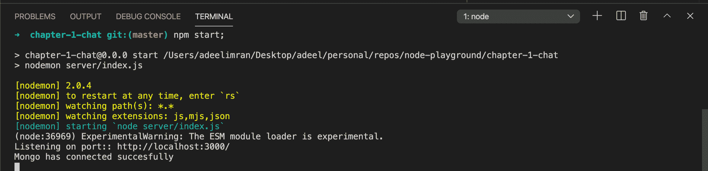
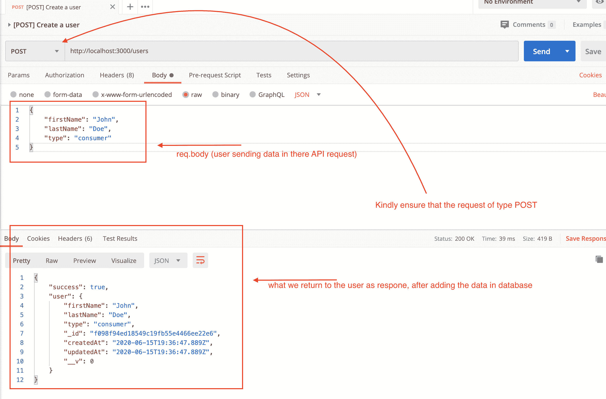
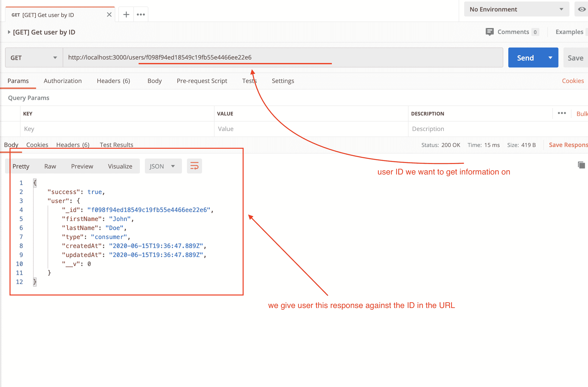
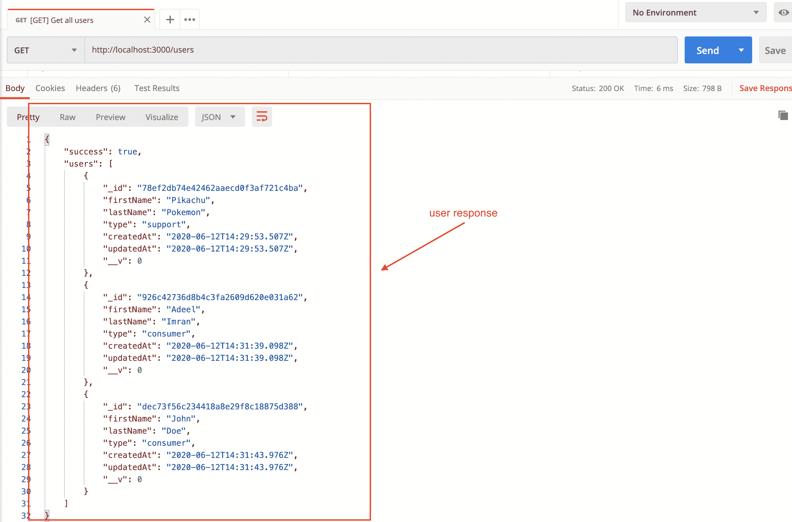
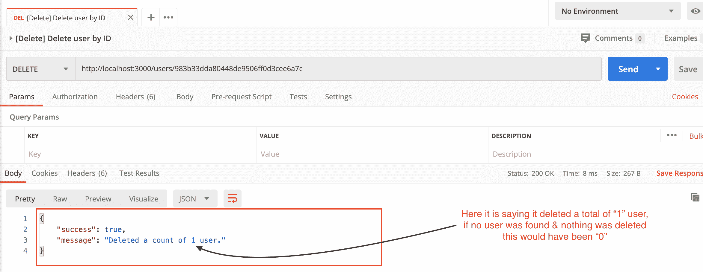
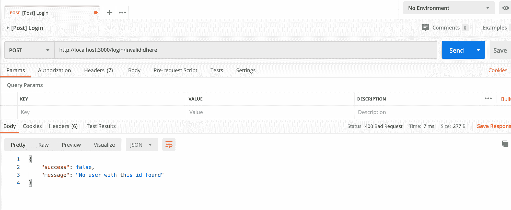
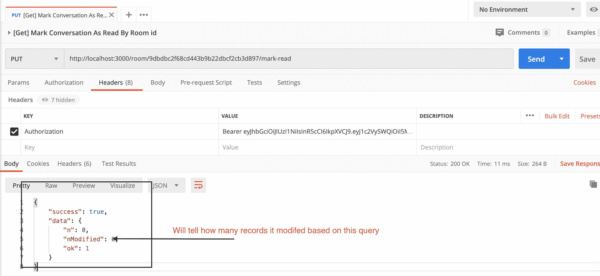

# 如何用 NodeJS 中的 Sockets 创建专业的聊天 API 解决方案【初级水平】

> 原文：<https://www.freecodecamp.org/news/create-a-professional-node-express/>

你有没有想过聊天应用程序是如何在幕后工作的？好了，今天我将带你了解如何使用 [MongoDB](https://www.mongodb.com/) 在 [NodeJS](https://nodejs.org/) / [ExpressJS](http://expressjs.com/) 之上构建一个基于 REST + Sockets 的应用程序。

我已经为这篇文章的内容工作了一个多星期了——我真的希望它能帮助到一些人。

## 先决条件

*   在你的机器上设置 Mongodb[[安装指南写在这里](https://github.com/adeelibr/node-playground/blob/master/chapter-1-chat/guidelines/installing-mongo.md)
*   对于 windows 用户，您可以在这里找到安装指南
*   对于 macOS 用户，你可以在这里找到安装指南[][[到我写的](https://github.com/adeelibr/node-playground/blob/master/chapter-1-chat/guidelines/installing-mongo.md)的要点安装
*   对于 Linux 用户，你可以在这里找到安装指南
*   在您的机器上安装节点/NPM[[安装链接这里](https://nodejs.org/en/download/) ](我使用的是节点版本 v12.18.0)

## 我们将涉及的主题

### 一般

*   创建快速服务器
*   如何进行 API 验证
*   为整个应用程序创建基本框架
*   设置 MongoDB(安装，在 express 中设置)
*   创建用户 API +数据库(创建用户，通过 id 获取用户，获取所有用户，通过 id 删除用户)
*   理解什么是中间件
*   JWT (JSON web 令牌)认证(解码/编码)-登录中间件
*   Web socket 类，当用户断开连接、添加其身份、加入聊天室、想要关闭聊天室时处理事件
*   聊天室&聊天消息数据库模型探讨

### 对于 API

*   发起用户之间的聊天
*   在聊天室创建消息
*   通过 id 查看聊天室的对话
*   将整个对话标记为已读(类似于 Whatsapp)
*   从所有聊天中获取最近的对话(类似于脸书信使)

### 奖金- API

*   按 id 删除聊天室及其所有相关消息
*   按 id 删除邮件

在我们开始之前，我想在下面的视频中介绍一些基础知识。

### 了解 ExpressJS 的基础知识

什么是路线？控制器？我们如何允许 CORS(跨源资源共享)？我们如何允许 enduser 在 API 请求中发送 JSON 格式的数据？

我在这个视频中谈到了所有这些和更多(包括 REST 约定):

[https://www.youtube.com/embed/t7-yuYFVG1Y?feature=oembed](https://www.youtube.com/embed/t7-yuYFVG1Y?feature=oembed)

另外，这里有一个 [GitHub 链接，链接到这个视频的全部源代码](https://github.com/adeelibr/node-playground/tree/master/chapter-0-basic)【第 0 章】

请务必查看 README.md 中的“第 0 章”源代码。它有我在视频中提到的所有相关的学习链接，还有一个令人惊讶的关于邮递员的半小时教程。

### 向 API 端点添加 API 验证

在下面的视频中，您将学习如何使用名为“make-validation”的库编写自己的自定义验证:

[https://www.youtube.com/embed/t-KGXLM0YlE?feature=oembed](https://www.youtube.com/embed/t-KGXLM0YlE?feature=oembed)

下面是这个视频【第 0 章】的完整源代码的 [GitHub 链接。](https://github.com/adeelibr/node-playground/tree/master/chapter-0-basic)

下面是 **make-validation** 库链接【G[itHub](https://github.com/withvoid/make-validation)[[NPM](https://www.npmjs.com/package/@withvoid/make-validation)][[示例](https://github.com/withvoid/make-validation/tree/master/example)。

本教程的全部源代码可以在 **[这里](https://github.com/adeelibr/node-playground/tree/master/chapter-1-chat)** 找到。如果您有任何反馈，请通过 http://twitter.com/adeelibr[联系我。如果你喜欢这个教程，请在](http://twitter.com/adeelibr) [**github 资源库**](https://github.com/adeelibr/node-playground) **上留下一颗星。**

现在让我们开始，您已经了解了 ExpressJS 的基础知识以及如何验证用户响应。

## 入门指南

创建一个名为`chat-app`的文件夹:

```
mkdir chat-app;
cd chat-app;
```

接下来，通过键入以下内容，在项目根文件夹中初始化一个新的 npm 项目:

```
npm init -y
```

并安装以下软件包:

```
npm i cors @withvoid/make-validation express jsonwebtoken mongoose morgan socket.io uuid --save;
npm i nodemon --save-dev;
```

在您的`package.json` `scripts`部分添加以下两个脚本:

```
"scripts": {
	"start": "nodemon server/index.js",
	"start:server": "node server/index.js"
},
```

您的`package.json`现在应该看起来像这样:

```
{
  "name": "chapter-1-chat",
  "version": "0.0.0",
  "private": true,
  "type": "module",
  "scripts": {
    "start": "nodemon server/index.js",
    "start:server": "node server/index.js"
  },
  "dependencies": {
    "@withvoid/make-validation": "1.0.5",
    "cors": "2.8.5",
    "express": "4.16.1",
    "jsonwebtoken": "8.5.1",
    "mongoose": "5.9.18",
    "morgan": "1.9.1",
    "socket.io": "2.3.0",
    "uuid": "8.1.0"
  },
  "devDependencies": {
    "nodemon": "2.0.4"
  }
} 
```

厉害！

现在在项目的根文件夹中创建一个名为`server`的新文件夹:

```
cd chat-app;
mkdir server;
cd server;
```

在您的`server`文件夹中创建一个名为`index.js`的文件，并向其中添加以下内容:

```
import http from "http";
import express from "express";
import logger from "morgan";
import cors from "cors";
// routes
import indexRouter from "./routes/index.js";
import userRouter from "./routes/user.js";
import chatRoomRouter from "./routes/chatRoom.js";
import deleteRouter from "./routes/delete.js";
// middlewares
import { decode } from './middlewares/jwt.js'

const app = express();

/** Get port from environment and store in Express. */
const port = process.env.PORT || "3000";
app.set("port", port);

app.use(logger("dev"));
app.use(express.json());
app.use(express.urlencoded({ extended: false }));

app.use("/", indexRouter);
app.use("/users", userRouter);
app.use("/room", decode, chatRoomRouter);
app.use("/delete", deleteRouter);

/** catch 404 and forward to error handler */
app.use('*', (req, res) => {
  return res.status(404).json({
    success: false,
    message: 'API endpoint doesnt exist'
  })
});

/** Create HTTP server. */
const server = http.createServer(app);
/** Listen on provided port, on all network interfaces. */
server.listen(port);
/** Event listener for HTTP server "listening" event. */
server.on("listening", () => {
  console.log(`Listening on port:: http://localhost:${port}/`)
}); 
```

让我们添加`indexRouter` `userRouter` `chatRoomRouter` & `deleteRouter`的航线。

在项目的根文件夹中创建一个名为`routes`的文件夹。在`routes`文件夹中添加以下文件:

*   `index.js`
*   `user.js`
*   `chatRoom.js`
*   `delete.js`

让我们先为`routes/index.js`添加内容:

```
import express from 'express';
// controllers
import users from '../controllers/user.js';
// middlewares
import { encode } from '../middlewares/jwt.js';

const router = express.Router();

router
  .post('/login/:userId', encode, (req, res, next) => { });

export default router; 
```

接下来让我们为`routes/user.js`添加内容:

```
import express from 'express';
// controllers
import user from '../controllers/user.js';

const router = express.Router();

router
  .get('/', user.onGetAllUsers)
  .post('/', user.onCreateUser)
  .get('/:id', user.onGetUserById)
  .delete('/:id', user.onDeleteUserById)

export default router; 
```

现在让我们为`routes/chatRoom.js`添加内容:

```
import express from 'express';
// controllers
import chatRoom from '../controllers/chatRoom.js';

const router = express.Router();

router
  .get('/', chatRoom.getRecentConversation)
  .get('/:roomId', chatRoom.getConversationByRoomId)
  .post('/initiate', chatRoom.initiate)
  .post('/:roomId/message', chatRoom.postMessage)
  .put('/:roomId/mark-read', chatRoom.markConversationReadByRoomId)

export default router; 
```

最后，让我们为`routes/delete.js`添加内容:

```
import express from 'express';
// controllers
import deleteController from '../controllers/delete.js';

const router = express.Router();

router
  .delete('/room/:roomId', deleteController.deleteRoomById)
  .delete('/message/:messageId', deleteController.deleteMessageById)

export default router; 
```

太棒了，现在我们的路线已经准备好了，让我们为每条路线添加控制器。

创建一个名为`controllers`的新文件夹。在该文件夹中创建以下文件:

*   ``user.js``
*   `chatRoom.js`
*   `delete.js`

让我们从`controllers/user.js`开始:

```
export default {
  onGetAllUsers: async (req, res) => { },
  onGetUserById: async (req, res) => { },
  onCreateUser: async (req, res) => { },
  onDeleteUserById: async (req, res) => { },
}
```

接下来让我们在`controllers/chatRoom.js`中添加内容:

```
export default {
  initiate: async (req, res) => { },
  postMessage: async (req, res) => { },
  getRecentConversation: async (req, res) => { },
  getConversationByRoomId: async (req, res) => { },
  markConversationReadByRoomId: async (req, res) => { },
}
```

最后，让我们为`controllers/delete.js`添加内容:

```
export default {
  deleteRoomById: async (req, res) => {},
  deleteMessageById: async (req, res) => {},
}
```

到目前为止，我们已经为每条路线添加了空控制器，所以它们还没有做太多。我们稍后会添加一些功能。

还有一件事——让我们添加一个名为`middlewares`的新文件夹，并在该文件夹中创建一个名为`jwt.js`的文件。然后向其中添加以下内容:

```
import jwt from 'jsonwebtoken';

export const decode = (req, res, next) => {}

export const encode = async (req, res, next) => {}
```

我一会儿会谈到这个文件的作用，所以现在让我们忽略它。


We are done with our basic boilerplate of the code base

我们已经完成了以下工作:

*   创建了一个侦听端口 3000 的 Express 服务器
*   将跨来源资源(CORS)添加到我们的`server.js`
*   在我们的`server.js`中添加了一个记录器
*   还添加了带有空控制器的路由处理程序。

目前为止，没有什么新奇的东西是我在上面的视频中没有提到的。

## 让我们在应用程序中设置 MongoDB

在我们将 MongoDB 添加到我们的代码库之前，通过运行以下命令之一，确保它已经安装在您的机器上:

*   适用于 Windows 用户的安装指南[ [此处为](https://docs.mongodb.com/manual/tutorial/install-mongodb-on-windows/#procedure)
*   针对 macOS 用户的安装指南[ [此处](https://docs.mongodb.com/manual/tutorial/install-mongodb-on-os-x/#install-homebrew) ][ [我写的要点安装](https://github.com/adeelibr/node-playground/blob/master/chapter-1-chat/guidelines/installing-mongo.md)
*   Linux 用户安装指南[ [此处](https://docs.mongodb.com/manual/administration/install-on-linux/)

如果您在安装 MongoDB 时遇到问题，请通过[https://twitter.com/adeelibr](https://twitter.com/adeelibr)告诉我，我会为您编写定制指南或制作安装视频指南。:)

我使用 [Robo3T](https://robomongo.org/) 作为我的 MongoDB GUI。

现在您应该已经运行了 MongoDB 实例并安装了 [Robo3T](https://robomongo.org/) 。(为此，您可以使用任何您喜欢的 GUI 客户端。我很喜欢 [Robo3T](https://robomongo.org/) 所以我在用它。而且，它是开源的。)

这是我在 YouTube 上找到的一个小视频，它用 6 分钟的时间介绍了机器人 3T:

[https://www.youtube.com/embed/DKZr1Urs7sA?feature=oembed](https://www.youtube.com/embed/DKZr1Urs7sA?feature=oembed)

一旦您的 MongoDB 实例启动并运行，让我们也开始在代码中集成 MongoDB。

在您的根文件夹中创建一个名为`config`的新文件夹。在该文件夹中创建一个名为`index.js`的文件，并添加以下内容:

```
const config = {
  db: {
    url: 'localhost:27017',
    name: 'chatdb'
  }
}

export default config 
```

通常情况下，`MongoDB`实例运行的默认端口是`27017`。

在这里，我们设置关于我们的数据库 URL(在`db`中)和数据库的`name`的信息，后者是`chatdb`(你可以随意称呼它)。

接下来创建一个名为`config/mongo.js`的新文件，并添加以下内容:

```
import mongoose from 'mongoose'
import config from './index.js'

const CONNECTION_URL = `mongodb://${config.db.url}/${config.db.name}`

mongoose.connect(CONNECTION_URL, {
  useNewUrlParser: true,
  useUnifiedTopology: true
})

mongoose.connection.on('connected', () => {
  console.log('Mongo has connected succesfully')
})
mongoose.connection.on('reconnected', () => {
  console.log('Mongo has reconnected')
})
mongoose.connection.on('error', error => {
  console.log('Mongo connection has an error', error)
  mongoose.disconnect()
})
mongoose.connection.on('disconnected', () => {
  console.log('Mongo connection is disconnected')
}) 
```

下一次导入`server/index.js`文件中的`config/mongo.js`,如下所示:

```
.
.
// mongo connection
import "./config/mongo.js";
// routes
import indexRouter from "./routes/index.js";
```

如果你在任何时候迷路了，这个教程的全部源代码就在这里[](https://github.com/adeelibr/node-playground/tree/master/chapter-1-chat)****。****

**让我们一步一步地讨论我们正在做的事情:**

**我们首先在`config/mongo.js`中导入我们的`config.js`文件。接下来，我们像这样把值传递给我们的`CONNECTION_URL`:**

```
`const CONNECTION_URL = `mongodb://${config.db.url}/${config.db.name}`` 
```

**然后使用`CONNECTION_URL`我们通过这样做形成一个 Mongo 连接:**

```
`mongoose.connect(CONNECTION_URL, {
  useNewUrlParser: true,
  useUnifiedTopology: true
})`
```

**这告诉`mongoose`用我们的 Node/Express 应用程序与数据库建立连接。**

**我们给 Mongo 的选择是:**

*   **`useNewUrlParser` : MongoDB 驱动已经弃用了他们当前的[连接字符串](https://docs.mongodb.com/manual/reference/connection-string/)解析器。`useNewUrlParser: true`告诉 mongoose 使用 Mongo 的新解析器。(如果设置为 true，我们必须在`CONNECTION_URL`中提供一个数据库端口。)**
*   **`useUnifiedTopology`:默认为假。设置为`true`以选择使用 [MongoDB 驱动程序的新连接管理引擎](https://mongoosejs.com/docs/deprecations.html#useunifiedtopology)。您应该将此选项设置为`true`，除非它会阻止您保持稳定的连接。**

**接下来我们简单地像这样添加`mongoose`事件处理程序:**

```
`mongoose.connection.on('connected', () => {
  console.log('Mongo has connected succesfully')
})
mongoose.connection.on('reconnected', () => {
  console.log('Mongo has reconnected')
})
mongoose.connection.on('error', error => {
  console.log('Mongo connection has an error', error)
  mongoose.disconnect()
})
mongoose.connection.on('disconnected', () => {
  console.log('Mongo connection is disconnected')
})`
```

*   **一旦建立了数据库连接，就会调用`connected`**
*   **当您的 Mongo 连接被禁用时，将调用`disconnected`**
*   **如果连接到您的 Mongo 数据库时出现错误，将调用`error`**
*   **`reconnected`当数据库失去连接，然后尝试成功重新连接时，调用事件。**

**一旦你准备好了，只需进入你的`server/index.js`文件并导入`config/mongo.js`。就是这样。现在，当您通过键入以下命令启动服务器时:**

```
`npm start;`
```

**您应该会看到类似这样的内容:**

**

Logs when you start your server** 

**如果你看到这个，你已经成功地将 Mongo 添加到你的应用程序中。**

**恭喜你！**

**如果你因为某种原因被困在这里，请在[twitter.com/adeelibr](https://twitter.com/adeelibr)告诉我，我会尽力帮你解决。:)**

## **让我们为用户设置第一个 API 部分/**

**在本教程中，我们为`users/`设置的 API 没有认证令牌，因为我的主要目的是在这里教你关于聊天应用程序的知识。**

### **用户模式方案**

**让我们为`user`集合创建第一个模型(数据库模式)。**

**创建一个名为`models`的新文件夹。在该文件夹中创建一个名为`User.js`的文件，并添加以下内容:**

```
`import mongoose from "mongoose";
import { v4 as uuidv4 } from "uuid";

export const USER_TYPES = {
  CONSUMER: "consumer",
  SUPPORT: "support",
};

const userSchema = new mongoose.Schema(
  {
    _id: {
      type: String,
      default: () => uuidv4().replace(/\-/g, ""),
    },
    firstName: String,
    lastName: String,
    type: String,
  },
  {
    timestamps: true,
    collection: "users",
  }
);

export default mongoose.model("User", userSchema);`
```

**让我们把它分成几部分:**

```
`export const USER_TYPES = {
  CONSUMER: "consumer",
  SUPPORT: "support",
};`
```

**我们基本上会有两种类型的用户，`consumer`和`support`。我这样写是因为我想以编程方式确保 API 和 DB 验证，这一点我将在后面讨论。**

**接下来，我们创建一个模式，描述单个`document`(对象/项目/条目/行)在我们的`user`集合中的外观(集合相当于一个 MySQL 表)。我们这样定义它:**

```
`const userSchema = new mongoose.Schema(
  {
    _id: {
      type: String,
      default: () => uuidv4().replace(/\-/g, ""),
    },
    firstName: String,
    lastName: String,
    type: String,
  },
  {
    timestamps: true,
    collection: "users",
  }
);`
```

**这里我们告诉`mongoose`对于我们的`users`集合中的单个文档，我们希望其结构如下:**

```
`{
	id: String // will get random string by default thanks to uuidv4
    	firstName: String,
    	lastName: String,
    	type: String // this can be of 2 types consumer/support
}`
```

**在模式的第二部分，我们有这样的内容:**

```
`{
    timestamps: true,
    collection: "users",
}`
```

**将`timestamps`设置为`true`将向我的模式中添加两件东西:一个`createdAt`和一个`updatedAt`日期值。每次当我们创建一个新的条目时，`createdAt`会自动更新，当我们使用 mongoose 更新数据库中的条目时，`updatedAt`也会更新。这两个都是由`mongoose`自动完成的。**

**第二部是`collection`。这显示了我的数据库中的集合名称。我把它命名为`users`。**

**最后，我们将像这样导出对象:**

```
`export default mongoose.model("User", userSchema);` 
```

**所以`mongoose.model`在这里接受两个参数。**

*   **型号的名称，这里是`User`**
*   **与该模型相关联的模式，在本例中是`userSchema`**

**注意:基于模型的名称，在本例中是`User`，我们没有在 schema 部分添加`collection`键。它将采用这个`User`名称并在它后面添加一个`s`，并以它的名称创建一个集合，这个名称就变成了`user`。**

**太好了，现在我们有了第一个模型。**

**如果你在某个地方卡住了，只要看看[源代码](https://github.com/adeelibr/node-playground/tree/master/chapter-1-chat)就可以了。**

### **创建新的用户 API[发布请求]**

**接下来让我们为这条路线编写第一个控制器:`.post('/', user.onCreateUser)`。**

**进入`controllers/user.js`并在顶部导入两个东西:**

```
`// utils
import makeValidation from '@withvoid/make-validation';
// models
import UserModel, { USER_TYPES } from '../models/User.js';`
```

**在这里，我们正在导入我在视频最上方谈到的验证库。我们还从同一个文件中导入了用户模型和`USER_TYPES`。**

**这就是`USER_TYPES`所代表的:**

```
`export const USER_TYPES = {
  CONSUMER: "consumer",
  SUPPORT: "support",
};`
```

**接下来找到控制器`onCreateUser`并向其添加以下内容:**

```
`onCreateUser: async (req, res) => {
    try {
      const validation = makeValidation(types => ({
        payload: req.body,
        checks: {
          firstName: { type: types.string },
          lastName: { type: types.string },
          type: { type: types.enum, options: { enum: USER_TYPES } },
        }
      }));
      if (!validation.success) return res.status(400).json(validation);

      const { firstName, lastName, type } = req.body;
      const user = await UserModel.createUser(firstName, lastName, type);
      return res.status(200).json({ success: true, user });
    } catch (error) {
      return res.status(500).json({ success: false, error: error })
    }
  },`
```

**让我们把它分成两部分。**

**首先，我们通过这样做来验证用户响应:**

```
`const validation = makeValidation(types => ({
  payload: req.body,
  checks: {
    firstName: { type: types.string },
    lastName: { type: types.string },
    type: { type: types.enum, options: { enum: USER_TYPES } },
  }
}));
if (!validation.success) return res.status(400).json({ ...validation });`
```

**请确保您已经看过`validate an API request in Node using custom validation or by using make-validation library`上的视频(如上)。**

**这里我们使用的是`[make-validation](https://www.npmjs.com/package/@withvoid/make-validation)`库(这是我在写这篇教程的时候做的)。我在本教程开始的视频中谈到了它的用法。**

**我们在这里所做的就是将`req.body`传递给`payload`。然后在检查中，我们添加了一个对象，在那里我们告诉每个`key`对每种类型的要求是什么，例如:**

```
`firstName: { type: types.string },`
```

**这里我们告诉它`firstName`是字符串类型。如果用户在点击 API 时忘记添加这个值，或者如果类型不是 string，就会抛出一个错误。**

**`validation`变量将返回一个有三样东西的对象:`{success: boolean, message: string, errors: object}`。**

**如果`validation.success`为假，我们简单地返回来自验证的所有内容，并用状态码`400`将其交给用户。**

**一旦我们的验证就绪，并且我们知道我们正在获取的数据是有效的，那么我们将执行以下操作:**

```
`const { firstName, lastName, type } = req.body;
const user = await UserModel.createUser(firstName, lastName, type);
return res.status(200).json({ success: true, user });`
```

**然后我们从`req.body`中析构`firstName, lastName, type`，并将这些值传递给我们的`UserModel.createUser`。如果一切顺利，它会简单地返回`success: true`，并创建新的`user`和状态`200`。**

**如果在这个过程中有任何地方出错，它将抛出一个错误并转到 catch 块:**

```
`catch (error) {
  return res.status(500).json({ success: false, error: error })
}`
```

**在这里，我们简单地返回一条错误消息和 HTTP 状态`500`。**

**这里我们唯一缺少的是`UserModel.createUser()`方法。**

**因此，让我们回到我们的`models/User.js`文件，并添加它:**

```
`userSchema.statics.createUser = async function (
	firstName, 
    	lastName, 
    	type
) {
  try {
    const user = await this.create({ firstName, lastName, type });
    return user;
  } catch (error) {
    throw error;
  }
}

export default mongoose.model("User", userSchema);` 
```

**所以我们在这里所做的就是给我们的`userSchema`添加一个静态方法，名为`createUser`，它接受 3 个参数:`firstName, lastName, type`。**

**接下来我们用这个:**

```
`const user = await this.create({ firstName, lastName, type });`
```

**这里的`this`部分非常重要，因为我们正在编写一个关于`userSchema`的静态方法。编写`this`将确保我们在`userSchema`对象上执行操作**

**这里需要注意的一点是`userSchema.statics.createUser = async function (firstName, lastName, type) => {}`是行不通的。如果你使用一个`=>`箭头函数，那么`this`上下文将会丢失，它将不起作用。**

**如果你想了解更多关于 mongoose 中的`static`方法，请看这里的这个简短但有用的文档示例[。](https://mongoosejs.com/docs/2.7.x/docs/methods-statics.html)**

**现在我们已经设置好了一切，让我们通过在项目的根文件夹中运行以下命令来启动我们的终端:**

```
`npm start;` 
```

**进入 postman，在这个 API `http://localhost:3000/users`上设置一个`POST`请求，并将以下主体添加到 API 中:**

```
`{
	firstName: 'John'
    	lastName: 'Doe',
    	type: 'consumer'
}`
```

**像这样:**

****

**你还可以从 [**这里**](https://www.getpostman.com/collections/c28b12148c3d980fc39d) 获得**完整的邮差 API** 集合，这样就不用一遍又一遍的写 API 了。**

**太棒了——我们刚刚完成了我们的第一个 API。在进入聊天部分之前，让我们再创建几个用户 API，因为没有用户就没有聊天(除非我们有机器人，但机器人也是用户？).**

### **通过 ID API 获取用户[获取请求]**

**接下来，我们需要编写一个 API，通过 ID 获取用户。因此，对于我们的路线`.get('/:id', user.onGetUserById)`,让我们写下它的控制器。**

**转到`controllers/user.js`并为方法`onGetUserById`写下:**

```
`onGetUserById: async (req, res) => {
  try {
    const user = await UserModel.getUserById(req.params.id);
    return res.status(200).json({ success: true, user });
  } catch (error) {
    return res.status(500).json({ success: false, error: error })
  }
},`
```

**酷，这看起来很简单。让我们将`UserModel.getUserById()`添加到我们的`models/User.js`文件中。**

**将此方法添加到您编写的最后一个`static`方法下面:**

```
`userSchema.statics.getUserById = async function (id) {
  try {
    const user = await this.findOne({ _id: id });
    if (!user) throw ({ error: 'No user with this id found' });
    return user;
  } catch (error) {
    throw error;
  }
}`
```

**我们传入一个`id`参数，并在`try/catch`中包装我们的函数。当你使用`async/await`时，这是非常重要的。这里需要重点关注的是这 2 行:**

```
`const user = await this.findOne({ _id: id });
if (!user) throw ({ error: 'No user with this id found' });`
```

**我们使用`mongoose`的`findOne`方法通过`id`找到一个条目。我们知道这个`id`的集合中只有一个项目，因为`id`是唯一的。如果没有找到用户，我们简单地抛出一个错误消息`No user with this id found`。**

**就是这样！让我们启动我们的服务器:**

```
`npm start;`
```

**打开 postman 并创建一个`GET`请求`http://localhost:3000/users/:id`。**

**注意:我使用的是我们刚刚创建的最后一个用户的 ID。**

****

**做得好！干得好。**

**我们的用户部分还需要两个 API。**

### **获取所有用户 API[获取请求]**

**对于我们在`.get('/', user.onGetAllUsers)`中的路由器，让我们向它的控制器添加信息。**

**转到`controllers/user.js`并在`onGetAllUsers()`方法中添加代码:**

```
`onGetAllUsers: async (req, res) => {
  try {
    const users = await UserModel.getUsers();
    return res.status(200).json({ success: true, users });
  } catch (error) {
    return res.status(500).json({ success: false, error: error })
  }
},`
```

**接下来让我们在`models/User.js`文件中为`getUsers()`创建静态方法。在您在该文件中编写的最后一个静态方法下面，键入:**

```
`userSchema.statics.getUsers = async function () {
  try {
    const users = await this.find();
    return users;
  } catch (error) {
    throw error;
  }
}`
```

**我们使用名为`await this.find();`的`mongoose`方法来获取我们的`users`集合的所有记录并将其返回。**

**注意:我没有在我们的用户 API 中处理分页，因为这不是这里的重点。一旦我们转向我们的聊天 API，我将谈论分页。**

**让我们启动我们的服务器:**

```
`npm start;`
```

**打开 postman 并为此路线`http://localhost:3000/users`创建一个`GET`请求:**

****

**我继续下去，最终又创建了几个用户。？**

### **通过 ID API [DELETE request]删除用户(这是一个额外的部分，如果您愿意，可以跳过这一部分)**

**让我们创建最后一条路由，通过 ID 删除用户。对于路线`.delete('/:id', user.onDeleteUserById)`,转到其在`controllers/user.js`中的控制器，并在`onDeleteUserById()`方法中编写该代码:**

```
`onDeleteUserById: async (req, res) => {
  try {
    const user = await UserModel.deleteByUserById(req.params.id);
    return res.status(200).json({ 
      success: true, 
      message: `Deleted a count of ${user.deletedCount} user.` 
    });
  } catch (error) {
    return res.status(500).json({ success: false, error: error })
  }
},`
```

**让我们在`models/User.js`中添加静态方法`deleteByUserById`:**

```
`userSchema.statics.deleteByUserById = async function (id) {
  try {
    const result = await this.remove({ _id: id });
    return result;
  } catch (error) {
    throw error;
  }
}`
```

**我们将这里的`id`作为参数传入，然后使用名为`this.remove`的`mongoose`方法从特定集合中删除一个记录项。在这种情况下，它是`users`集合。**

**让我们启动我们的服务器:**

```
`npm start;` 
```

**去邮递员那里创建一条新的`DELETE`路线:**

****

**至此，我们将结束我们的用户 API 部分。**

**接下来，我们将介绍如何使用身份验证令牌来验证路由。在继续讨论聊天部分之前，这是我想谈的最后一件事——因为所有的聊天 API 都将被认证。**

### **ExpressJS 中的中间件是什么？**

**我们该如何写它们呢？通过在应用程序中添加 JWT 中间件:**

 **[https://www.youtube.com/embed/G8Z6yeV0ytc?feature=oembed](https://www.youtube.com/embed/G8Z6yeV0ytc?feature=oembed)** 

**这是 GitHub 的链接，链接到这个视频的全部源代码。**

**同样，所有相关信息都可以在 READ.ME 中找到。**

**回到我们的代码库，让我们创建一个 JWT 中间件来认证我们的路由。转到`middlewares/jwt.js`并添加以下内容:**

```
`import jwt from 'jsonwebtoken';
// models
import UserModel from '../models/User.js';

const SECRET_KEY = 'some-secret-key';

export const encode = async (req, res, next) => {
  try {
    const { userId } = req.params;
    const user = await UserModel.getUserById(userId);
    const payload = {
      userId: user._id,
      userType: user.type,
    };
    const authToken = jwt.sign(payload, SECRET_KEY);
    console.log('Auth', authToken);
    req.authToken = authToken;
    next();
  } catch (error) {
    return res.status(400).json({ success: false, message: error.error });
  }
}

export const decode = (req, res, next) => {
  if (!req.headers['authorization']) {
    return res.status(400).json({ success: false, message: 'No access token provided' });
  }
  const accessToken = req.headers.authorization.split(' ')[1];
  try {
    const decoded = jwt.verify(accessToken, SECRET_KEY);
    req.userId = decoded.userId;
    req.userType = decoded.type;
    return next();
  } catch (error) {

    return res.status(401).json({ success: false, message: error.message });
  }
}`
```

**我们先来讨论一下`encode`方法:**

```
`export const encode = async (req, res, next) => {
  try {
    const { userId } = req.params;
    const user = await UserModel.getUserById(userId);
    const payload = {
      userId: user._id,
      userType: user.type,
    };
    const authToken = jwt.sign(payload, SECRET_KEY);
    console.log('Auth', authToken);
    req.authToken = authToken;
    next();
  } catch (error) {
    return res.status(400).json({ 
    	success: false, message: error.error 
    });
  }
}`
```

**让我们一步一步来。**

**我们从我们的`req.params`中得到`userId`。如果您还记得之前的视频，`req.params`是我们的 routes 部分中定义的`/:<identifier>`。**

**接下来，我们使用最近刚刚创建的`const user = await UserModel.getUserById(userId);`方法来获取用户信息。如果存在，也就是说——否则这一行将抛出一个错误，它将直接转到`catch`块，在那里我们将向用户返回一个`400`响应和一条错误消息。**

**但是如果我们从`getUserById`方法中得到一个响应，我们就可以得到一个有效载荷:**

```
`const payload = {
      userId: user._id,
      userType: user.type,
};`
```

**接下来，我们在 JWT 使用以下内容对有效载荷进行签名:**

```
`const authToken = jwt.sign(payload, SECRET_KEY);`
```

**一旦我们签署了 JWT 协议，我们就这样做:**

```
`req.authToken = authToken;
next();`
```

**将其设置为我们的`req.authToken`，然后将此信息作为`next()`转发。**

**接下来我们来谈谈`decode`方法:**

```
`export const decode = (req, res, next) => {
  if (!req.headers['authorization']) {
    return res.status(400).json({ success: false, message: 'No access token provided' });
  }
  const accessToken = req.headers.authorization.split(' ')[1];
  try {
    const decoded = jwt.verify(accessToken, SECRET_KEY);
    req.userId = decoded.userId;
    req.userType = decoded.type;
    return next();
  } catch (error) {

    return res.status(401).json({ success: false, message: error.message });
  }
}`
```

**让我们来分解一下:**

```
`if (!req.headers['authorization']) {
  return res.status(400).json({ 
  	success: false, 
    	message: 'No access token provided' 
  });
}`
```

**首先，我们检查`authorization`标题是否存在。如果没有，我们简单地返回一个错误消息给用户。**

**然后我们这样做:**

```
`const accessToken = req.headers.authorization.split(' ')[1];` 
```

**它由空格组成`split(' ')`，然后我们通过访问它的`[1]`索引得到数组的第二个索引，因为约定是`authorization: Bearer <auth-token>`。想了解更多相关信息吗？看看 quora 上这条漂亮的[线。](https://www.quora.com/Why-is-Bearer-required-before-the-token-in-Authorization-header-in-a-HTTP-request)**

**然后我们尝试解码我们的令牌:**

```
`try {
  const decoded = jwt.verify(accessToken, SECRET_KEY);
  req.userId = decoded.userId;
  req.userType = decoded.type;
  return next();
} catch (error) {
  return res.status(401).json({ 
  	success: false, message: error.message 
  });
}`
```

**如果这不成功，`jwt.verify(accessToken, SECRET_KEY)`将简单地抛出一个错误，我们的代码将立即进入`catch`块。如果成功了，我们就可以解码了。我们从令牌中获取`userId`和`type`，并将其保存为`req.userId, req.userType`，然后点击`next()`。**

**现在，向前看，通过这个`decode`中间件的每条路由都将拥有当前用户的`id & it's type`。**

**这就是中间件部分的内容。让我们创建一个`login`路由，这样我们就可以向用户询问他们的信息，并给出一个令牌作为回报(因为接下来他们将需要一个令牌来访问其余的聊天 API)。**

### **创建登录路径[发布请求]**

**转到您的`routes/index.js`文件并粘贴以下内容:**

```
`import express from 'express';
// middlewares
import { encode } from '../middlewares/jwt.js';

const router = express.Router();

router
  .post('/login/:userId', encode, (req, res, next) => {
    return res
      .status(200)
      .json({
        success: true,
        authorization: req.authToken,
      });
  });

export default router;` 
```

**所以我们所做的就是将`encode`中间件添加到我们的`http://localhost:3000/login/:<user-id>`【POST】路线中。如果一切顺利，用户将获得一个`authorization`令牌。**

**注意:我没有添加登录/注册流程，但是我仍然想在本教程中讨论一下 JWT/中间件。**

**通常身份验证是以类似的方式完成的。这里唯一的补充是用户没有提供他们的 ID。他们提供他们的用户名和密码(我们在数据库中验证)，如果一切都检查通过，我们给他们一个授权令牌。**

**如果你在这一点上遇到了什么困难，请在[twitter.com/adeelibr](https://twitter.com/adeelibr)写信给我，这样我可以改进内容。如果你想学点别的，也可以给我写信。**

**提醒一下，完整的源代码可以在[这里](https://github.com/adeelibr/node-playground/tree/master/chapter-1-chat)找到。您不必按照本教程编写代码，但是如果您这样做了，这些概念会更容易理解。**

**让我们现在检查一下我们的路线。**

**启动您的服务器:**

```
`npm start;` 
```

**让我们跑邮差。创建新的发布请求`http://localhost:3000/login/<user-id>`:**

**

When the user ID is correct** **

When the user ID is invalid** 

**至此，我们的登录流程也完成了。**

**这太多了。但现在我们只能专注于我们的聊天路线。**

## **创建一个 web 套接字类**

**这个 web socket 类将处理当用户断开连接、加入聊天室或想要关闭聊天室时的事件。**

**因此，让我们创建一个 web-socket 类来为我们管理套接字。创建一个名为`utils`的新文件夹。在该文件夹中创建一个名为`WebSockets.js`的文件，并添加以下内容:**

```
`class WebSockets {
  users = [];
  connection(client) {
    // event fired when the chat room is disconnected
    client.on("disconnect", () => {
      this.users = this.users.filter((user) => user.socketId !== client.id);
    });
    // add identity of user mapped to the socket id
    client.on("identity", (userId) => {
      this.users.push({
        socketId: client.id,
        userId: userId,
      });
    });
    // subscribe person to chat & other user as well
    client.on("subscribe", (room, otherUserId = "") => {
      this.subscribeOtherUser(room, otherUserId);
      client.join(room);
    });
    // mute a chat room
    client.on("unsubscribe", (room) => {
      client.leave(room);
    });
  }

  subscribeOtherUser(room, otherUserId) {
    const userSockets = this.users.filter(
      (user) => user.userId === otherUserId
    );
    userSockets.map((userInfo) => {
      const socketConn = global.io.sockets.connected(userInfo.socketId);
      if (socketConn) {
        socketConn.join(room);
      }
    });
  }
}

export default new WebSockets();` 
```

**WebSockets 类有三个主要内容:**

*   **用户数组**
*   **连接方法**
*   **为聊天室的成员订阅。`subscribeOtherUser`**

**我们来分析一下。**

**我们有一节课:**

```
`class WebSockets {

}

export default new WebSocket();`
```

**我们创建一个类并导出该类的一个实例。**

**在类内部，我们有一个空的`users`数组。这个数组将包含使用我们的应用程序的所有在线活动用户的列表。**

**接下来我们有一个`connection`方法，这个类的核心:**

```
`connection(client) {
  // event fired when the chat room is disconnected
  client.on("disconnect", () => {
    this.users = this.users.filter((user) => user.socketId !== client.id);
  });
  // add identity of user mapped to the socket id
  client.on("identity", (userId) => {
    this.users.push({
      socketId: client.id,
      userId: userId,
    });
  });
  // subscribe person to chat & other user as well
  client.on("subscribe", (room, otherUserId = "") => {
    this.subscribeOtherUser(room, otherUserId);
    client.join(room);
  });
  // mute a chat room
  client.on("unsubscribe", (room) => {
    client.leave(room);
  });
}`
```

**`connection`方法接受一个名为`client`的参数(这里的客户端将是我们的服务器实例，我稍后会详细介绍)。**

**我们获取参数`client`并向其添加一些事件**

*   **client.on('disconnect') //当用户连接丢失时，将调用此方法**
*   **client.on('identity') //当用户从前端登录时，他们将通过提供他们的身份与我们的服务器建立连接**
*   **client.on('subscribe') //当用户加入聊天室时，调用此方法**
*   **client.on('unsubscribe') //当用户离开聊天室或希望将聊天室静音时**

**再说说`disconnect`:**

```
`client.on("disconnect", () => {
  this.users = this.users.filter((user) => user.socketId !== client.id);
});`
```

**一旦连接断开，我们就在用户阵列上运行过滤器。在找到`user.id === client.id`的地方，我们将它从套接字数组中移除。(`client`这里是来自函数 param。)**

**再说说`identity`:**

```
`client.on("identity", (userId) => {
  this.users.push({
    socketId: client.id,
    userId: userId,
  });
});`
```

**当用户通过前端应用程序 web/android/ios 登录时，他们将与我们的后端应用程序建立套接字连接，并调用此身份方法。他们还会发送自己的用户 id。**

**我们将获取该用户 id 和客户机 id(socket . io 在用户与我们的 BE 建立连接时创建的用户自己的惟一套接字 id)。**

**接下来我们有`unsubscribe`:**

```
`client.on("unsubscribe", (room) => {
  client.leave(room);
});`
```

**用户传入`room` id，我们只告诉`client.leave()`从特定的聊天室中删除当前调用该方法的用户。**

**接下来我们订阅了:**

```
`client.on("subscribe", (room, otherUserId = "") => {
  this.subscribeOtherUser(room, otherUserId);
  client.join(room);
});`
```

**当一个用户加入一个聊天室时，他们会告诉我们他们想要加入的聊天室以及该聊天室的其他成员。**

**注意:我们稍后会看到，当我们启动一个聊天室时，我们会在 API 响应中获得与该聊天室相关联的所有用户。**

****我认为**:我们在这里可以做的另一件事是，当用户发送房间号码时，我们可以进行 DB 查询，查看聊天室的所有成员，如果他们此刻在线(即在我们的用户列表中)，就让他们加入。**

**`subscribeOtherUser`方法是这样定义的:**

```
`subscribeOtherUser(room, otherUserId) {
  const userSockets = this.users.filter(
    (user) => user.userId === otherUserId
  );
  userSockets.map((userInfo) => {
    const socketConn = global.io.sockets.connected(userInfo.socketId);
    if (socketConn) {
      socketConn.join(room);
    }
  });
}`
```

**我们将`room`和`otherUserId`作为参数传递给这个函数。**

**使用`otherUserId`我们过滤我们的`this.users`数组，所有匹配的结果都存储在`userSockets`数组中。**

**您可能会想——一个用户怎么可能在用户阵列中有多个存在呢？好吧，考虑一个场景，同一个用户从他们的 web 应用程序和移动电话登录。它将为同一个用户创建多个套接字连接。**

**接下来我们在`userSockets`上绘制地图。对于数组中的每一项，我们将其传递给这个方法:`const socketConn = global.io.sockets.connected(userInfo.socketId)`**

**稍后我会详细讨论这个问题。但是它最初做的是接受`userInfo.socketId`，如果它存在于我们的套接字连接中，它将返回连接，否则返回`null`。**

**接下来我们简单看看`socketConn`是否可用。如果是这样，我们采用那个`socketConn`并使这个连接加入函数中传递的`room`:**

```
`if (socketConn) {
	socketConn.join(room);
}`
```

**这就是我们的 WebSockets 类。**

**让我们将这个文件导入到我们的`server/index.js`文件中:**

```
`import socketio from "socket.io";
// mongo connection
import "./config/mongo.js";
// socket configuration
import WebSockets from "./utils/WebSockets.js";`
```

**所以只需在顶部某处导入`socket.io`和`WebSockets`即可。**

**接下来，在我们创建服务器的地方，在下面添加内容:**

```
`/** Create HTTP server. */
const server = http.createServer(app);
/** Create socket connection */
global.io = socketio.listen(server);
global.io.on('connection', WebSockets.connection)`
```

**创建了`server`之后，我们做了两件事:**

*   **将`global.io`分配给`socketio.listen(server)`(一旦端口开始监听`server`，套接字也开始监听该端口上发生的事件。)**
*   **然后我们分配`global.io.on('connection', WebSockets.connection)`方法。每次有人从前端进行套接字连接时，`connection`方法将被调用，这将调用我们的`Websockets`类和该类中的`connection`方法。**

**`global.io`相当于浏览器中的`windows`对象。但是因为我们在 NodeJS 中没有`windows`，所以我们使用`global.io`。我们在`global.io`中输入的任何内容在整个应用程序中都是可用的。**

**这与我们在`subscribeOtherUser`方法中的`WebSockets`类中使用的`global.io`相同。**

**如果你迷路了，这里是这个聊天应用程序的完整源代码。也可以给我留言，告诉我你的反馈，我会努力改进本教程的内容。**

## **聊天室&聊天消息数据库模型探讨**

**在开始聊天之前，我认为讨论我们将在其上创建聊天应用程序的数据库模型非常重要。看看下面的视频:**

 **[https://www.youtube.com/embed/GAt-XjGvMxM?feature=oembed](https://www.youtube.com/embed/GAt-XjGvMxM?feature=oembed)** 

**现在你对我们的聊天结构有了一个清晰的概念，让我们从制作聊天室模型开始。**

**进入你的`models`文件夹，创建下面的`ChatRoom.js`。添加以下内容:**

```
`import mongoose from "mongoose";
import { v4 as uuidv4 } from "uuid";

export const CHAT_ROOM_TYPES = {
  CONSUMER_TO_CONSUMER: "consumer-to-consumer",
  CONSUMER_TO_SUPPORT: "consumer-to-support",
};

const chatRoomSchema = new mongoose.Schema(
  {
    _id: {
      type: String,
      default: () => uuidv4().replace(/\-/g, ""),
    },
    userIds: Array,
    type: String,
    chatInitiator: String,
  },
  {
    timestamps: true,
    collection: "chatrooms",
  }
);

chatRoomSchema.statics.initiateChat = async function (
	userIds, type, chatInitiator
) {
  try {
    const availableRoom = await this.findOne({
      userIds: {
        $size: userIds.length,
        $all: [...userIds],
      },
      type,
    });
    if (availableRoom) {
      return {
        isNew: false,
        message: 'retrieving an old chat room',
        chatRoomId: availableRoom._doc._id,
        type: availableRoom._doc.type,
      };
    }

    const newRoom = await this.create({ userIds, type, chatInitiator });
    return {
      isNew: true,
      message: 'creating a new chatroom',
      chatRoomId: newRoom._doc._id,
      type: newRoom._doc.type,
    };
  } catch (error) {
    console.log('error on start chat method', error);
    throw error;
  }
}

export default mongoose.model("ChatRoom", chatRoomSchema);`
```

**我们有三件事要做:**

*   **我们有一个只有两种类型的常量`CHAT_ROOM_TYPES`**
*   **我们定义我们的聊天室模式**
*   **我们添加了一个静态方法来启动聊天**

## **聊天相关 API**

### **在用户之间发起聊天(/room/initiate [POST request])**

**让我们讨论一下在`models/ChatRoom.js`中定义的名为`initiateChat`的静态方法:**

```
`chatRoomSchema.statics.initiateChat = async function (userIds, type, chatInitiator) {
  try {
    const availableRoom = await this.findOne({
      userIds: {
        $size: userIds.length,
        $all: [...userIds],
      },
      type,
    });
    if (availableRoom) {
      return {
        isNew: false,
        message: 'retrieving an old chat room',
        chatRoomId: availableRoom._doc._id,
        type: availableRoom._doc.type,
      };
    }

    const newRoom = await this.create({ userIds, type, chatInitiator });
    return {
      isNew: true,
      message: 'creating a new chatroom',
      chatRoomId: newRoom._doc._id,
      type: newRoom._doc.type,
    };
  } catch (error) {
    console.log('error on start chat method', error);
    throw error;
  }
}`
```

**该函数接受三个参数:**

*   **用户标识(用户数组)**
*   **类型(聊天室的类型)**
*   **chatInitiator(创建聊天室的用户)**

**接下来我们要做两件事:要么返回一个现有的聊天室文档，要么创建一个新的。**

**让我们来分解一下:**

```
`const availableRoom = await this.findOne({
  userIds: {
    $size: userIds.length,
    $all: [...userIds],
  },
  type,
});
if (availableRoom) {
  return {
    isNew: false,
    message: 'retrieving an old chat room',
    chatRoomId: availableRoom._doc._id,
    type: availableRoom._doc.type,
  };
}`
```

**首先在 mongoose 中使用`this.findOne()` API，我们找到满足以下标准的所有聊天室:**

```
`userIds: { $size: userIds.length, $all: [...userIds] },
type: type,`
```

**你可以在这里阅读更多关于$size 操作符[的内容，在这里](https://docs.mongodb.com/manual/reference/operator/query/size/)阅读更多关于$all 操作符[的内容。](https://docs.mongodb.com/manual/reference/operator/query/all/)**

**我们正在检查查找聊天室文档，其中有一个项目存在于我们的聊天室集合中，其中**

1.  **`userIds`与我们传递给这个函数的相同(不考虑用户 id 的顺序)，并且**
2.  **`userIds`的长度与我们通过函数传递的 my `userIds.length`的长度相同。**

**此外，我们正在检查聊天室类型应该是相同的。**

**如果发现这样的东西，我们只需返回现有的聊天室。**

**否则，我们创建一个新的聊天室，并通过以下方式返回它:**

```
`const newRoom = await this.create({ userIds, type, chatInitiator });
return {
  isNew: true,
  message: 'creating a new chatroom',
  chatRoomId: newRoom._doc._id,
  type: newRoom._doc.type,
};`
```

**创建一个新房间并返回响应。**

**我们还有一个`isNew`键，如果它正在检索一个旧聊天室，我们将它设置为`false`，否则设置为`true`。**

**接下来，对于在`routes/chatRoom.js`中创建的名为`post('/initiate', chatRoom.initiate)`的路线，转到其在`controllers/chatRoom.js`中的相应控制器，并在`initiate`方法中添加以下内容:**

```
`initiate: async (req, res) => {
  try {
    const validation = makeValidation(types => ({
      payload: req.body,
      checks: {
        userIds: { 
          type: types.array, 
          options: { unique: true, empty: false, stringOnly: true } 
        },
        type: { type: types.enum, options: { enum: CHAT_ROOM_TYPES } },
      }
    }));
    if (!validation.success) return res.status(400).json({ ...validation });

    const { userIds, type } = req.body;
    const { userId: chatInitiator } = req;
    const allUserIds = [...userIds, chatInitiator];
    const chatRoom = await ChatRoomModel.initiateChat(allUserIds, type, chatInitiator);
    return res.status(200).json({ success: true, chatRoom });
  } catch (error) {
    return res.status(500).json({ success: false, error: error })
  }
},`
```

**我们在这里使用`[make-validation](https://www.npmjs.com/package/@withvoid/make-validation)`库来验证用户的请求。对于 initiate API，我们希望用户发送一个数组`users`，并定义正在创建的`chat-room`的类型。**

**一旦验证通过，则:**

```
`const { userIds, type } = req.body;
const { userId: chatInitiator } = req;
const allUserIds = [...userIds, chatInitiator];
const chatRoom = await ChatRoomModel.initiateChat(allUserIds, type, chatInitiator);
return res.status(200).json({ success: true, chatRoom });`
```

**这里要注意的一件事是`userIds, type`来自`req.body`，而别名为`chatInitiatorId`的`userId`来自`req`，这要感谢我们的`decode`中间件。**

**如果你记得，我们在我们的`server/index.js`文件中附加了`app.use("/room", decode, chatRoomRouter);`。这意味着这条路线`/room/initiate`是经过认证的。所以`const { userId: chatInitiator } = req;`是当前登录用户的 id。**

**我们简单地从`ChatRoomModel`调用我们的`initiateChat`方法，并传递它`allUserIds, type, chatInitiator`。不管结果是什么，我们只是把它传递给用户。**

**让我们运行一下，看看它是否有效(这是我做这件事的视频):**

 **[https://www.youtube.com/embed/vWzmTrNoNJs?feature=oembed](https://www.youtube.com/embed/vWzmTrNoNJs?feature=oembed)** 

### **在聊天室创建消息(/:roomId/message)[发布请求]**

**让我们为刚刚用`pikachu`创建的聊天室创建一条消息。**

**但是在我们创建消息之前，我们需要为我们的`chatmessages`创建一个模型。所以让我们先这样做。在你的`models`文件夹中创建一个名为`ChatMessage.js`的新文件，并添加以下内容:**

```
`import mongoose from "mongoose";
import { v4 as uuidv4 } from "uuid";

const MESSAGE_TYPES = {
  TYPE_TEXT: "text",
};

const readByRecipientSchema = new mongoose.Schema(
  {
    _id: false,
    readByUserId: String,
    readAt: {
      type: Date,
      default: Date.now(),
    },
  },
  {
    timestamps: false,
  }
);

const chatMessageSchema = new mongoose.Schema(
  {
    _id: {
      type: String,
      default: () => uuidv4().replace(/\-/g, ""),
    },
    chatRoomId: String,
    message: mongoose.Schema.Types.Mixed,
    type: {
      type: String,
      default: () => MESSAGE_TYPES.TYPE_TEXT,
    },
    postedByUser: String,
    readByRecipients: [readByRecipientSchema],
  },
  {
    timestamps: true,
    collection: "chatmessages",
  }
);

chatMessageSchema.statics.createPostInChatRoom = async function (chatRoomId, message, postedByUser) {
  try {
    const post = await this.create({
      chatRoomId,
      message,
      postedByUser,
      readByRecipients: { readByUserId: postedByUser }
    });
    const aggregate = await this.aggregate([
      // get post where _id = post._id
      { $match: { _id: post._id } },
      // do a join on another table called users, and 
      // get me a user whose _id = postedByUser
      {
        $lookup: {
          from: 'users',
          localField: 'postedByUser',
          foreignField: '_id',
          as: 'postedByUser',
        }
      },
      { $unwind: '$postedByUser' },
      // do a join on another table called chatrooms, and 
      // get me a chatroom whose _id = chatRoomId
      {
        $lookup: {
          from: 'chatrooms',
          localField: 'chatRoomId',
          foreignField: '_id',
          as: 'chatRoomInfo',
        }
      },
      { $unwind: '$chatRoomInfo' },
      { $unwind: '$chatRoomInfo.userIds' },
      // do a join on another table called users, and 
      // get me a user whose _id = userIds
      {
        $lookup: {
          from: 'users',
          localField: 'chatRoomInfo.userIds',
          foreignField: '_id',
          as: 'chatRoomInfo.userProfile',
        }
      },
      { $unwind: '$chatRoomInfo.userProfile' },
      // group data
      {
        $group: {
          _id: '$chatRoomInfo._id',
          postId: { $last: '$_id' },
          chatRoomId: { $last: '$chatRoomInfo._id' },
          message: { $last: '$message' },
          type: { $last: '$type' },
          postedByUser: { $last: '$postedByUser' },
          readByRecipients: { $last: '$readByRecipients' },
          chatRoomInfo: { $addToSet: '$chatRoomInfo.userProfile' },
          createdAt: { $last: '$createdAt' },
          updatedAt: { $last: '$updatedAt' },
        }
      }
    ]);
    return aggregate[0];
  } catch (error) {
    throw error;
  }
}

export default mongoose.model("ChatMessage", chatMessageSchema);`
```

**这里发生了几件事:**

*   **我们有一个`MESSAGE_TYPES`对象，它只有一种叫做`text`的类型**
*   **我们正在为`chatmessage`和`readByRecipient`定义我们的模式**
*   **然后我们为`createPostInChatRoom`编写静态方法**

**我知道这是很多内容，但请耐心听我说。让我们为创建该消息的路由编写控制器。**

**对于在我们名为`.post('/:roomId/message', chatRoom.postMessage)`的`routes/chatRoom.js` API 中定义的路线，让我们转到它在`controllers/chatRoom.js`中的控制器并定义它:**

```
`postMessage: async (req, res) => {
  try {
    const { roomId } = req.params;
    const validation = makeValidation(types => ({
      payload: req.body,
      checks: {
        messageText: { type: types.string },
      }
    }));
    if (!validation.success) return res.status(400).json({ ...validation });

    const messagePayload = {
      messageText: req.body.messageText,
    };
    const currentLoggedUser = req.userId;
    const post = await ChatMessageModel.createPostInChatRoom(roomId, messagePayload, currentLoggedUser);
    global.io.sockets.in(roomId).emit('new message', { message: post });
    return res.status(200).json({ success: true, post });
  } catch (error) {
    return res.status(500).json({ success: false, error: error })
  }
},`
```

**酷，让我们讨论一下我们在这里做什么:**

 **[https://www.youtube.com/embed/z1C0Sl2wmJU?feature=oembed](https://www.youtube.com/embed/z1C0Sl2wmJU?feature=oembed)** 

**本视频中讨论的操作员包括:**

*   **[$match](https://docs.mongodb.com/manual/reference/operator/aggregation/match/)**
*   **[$最后一次](https://docs.mongodb.com/manual/reference/operator/aggregation/last/)**
*   **[$addToSet](https://docs.mongodb.com/manual/reference/operator/update/addToSet/)**
*   **[$查找](https://docs.mongodb.com/manual/reference/operator/aggregation/lookup/)**
*   **[$平仓](https://docs.mongodb.com/manual/reference/operator/aggregation/unwind/)**
*   **[$组](https://docs.mongodb.com/manual/reference/operator/aggregation/group/)**

### **通过 id 查看聊天室的对话[获取请求]**

**现在我们有了**

*   **创建了一个聊天室**
*   **能够在聊天室添加消息**

**让我们看看该聊天的整个对话(带分页)。**

**对于您在`routes/chatRoom.js`中的路线`.get('/:roomId', chatRoom.getConversationByRoomId)`,在`controllers/chatRoom.js`文件中打开其控制器，并将以下内容添加到聊天室中:**

```
`getConversationByRoomId: async (req, res) => {
  try {
    const { roomId } = req.params;
    const room = await ChatRoomModel.getChatRoomByRoomId(roomId)
    if (!room) {
      return res.status(400).json({
        success: false,
        message: 'No room exists for this id',
      })
    }
    const users = await UserModel.getUserByIds(room.userIds);
    const options = {
      page: parseInt(req.query.page) || 0,
      limit: parseInt(req.query.limit) || 10,
    };
    const conversation = await ChatMessageModel.getConversationByRoomId(roomId, options);
    return res.status(200).json({
      success: true,
      conversation,
      users,
    });
  } catch (error) {
    return res.status(500).json({ success: false, error });
  }
},`
```

**接下来让我们在我们的`ChatRoomModel`文件中创建一个新的静态方法，在`models/ChatRoom.js`中称为`getChatRoomByRoomId`:**

```
`chatRoomSchema.statics.getChatRoomByRoomId = async function (roomId) {
  try {
    const room = await this.findOne({ _id: roomId });
    return room;
  } catch (error) {
    throw error;
  }
}` 
```

 **非常简单——我们在这里通过 roomId 获得房间。

接下来在我们的`UserModel`中，在文件`models/User.js`中创建一个名为`getUserByIds`的静态方法:

```
userSchema.statics.getUserByIds = async function (ids) {
  try {
    const users = await this.find({ _id: { $in: ids } });
    return users;
  } catch (error) {
    throw error;
  }
}
```

这里使用的操作符是中的[$我稍后会谈到这一点。](https://docs.mongodb.com/manual/reference/operator/query/in/)

最后，转到`models/ChatMessage.js`中的`ChatMessage`模型，编写一个名为`getConversationByRoomId`的新静态方法:

```
chatMessageSchema.statics.getConversationByRoomId = async function (chatRoomId, options = {}) {
  try {
    return this.aggregate([
      { $match: { chatRoomId } },
      { $sort: { createdAt: -1 } },
      // do a join on another table called users, and 
      // get me a user whose _id = postedByUser
      {
        $lookup: {
          from: 'users',
          localField: 'postedByUser',
          foreignField: '_id',
          as: 'postedByUser',
        }
      },
      { $unwind: "$postedByUser" },
      // apply pagination
      { $skip: options.page * options.limit },
      { $limit: options.limit },
      { $sort: { createdAt: 1 } },
    ]);
  } catch (error) {
    throw error;
  }
}
```

让我们讨论一下到目前为止我们所做的一切:

[https://www.youtube.com/embed/cnwOMrVMv0c?feature=oembed](https://www.youtube.com/embed/cnwOMrVMv0c?feature=oembed)

**[这里有](https://github.com/adeelibr/node-playground/tree/master/chapter-1-chat)所有的源代码。**

### 将整个对话标记为已读(类似于 WhatsApp 的功能)

一旦其他人登录并查看了房间 id 的对话，我们需要将该对话标记为从他们那边阅读。

为此，在你的`routes/chatRoom.js`中寻找路线

```
put('/:roomId/mark-read', chatRoom.markConversationReadByRoomId)
```

转到`controllers/chatRoom.js`中相应的控制器，在`markConversationReadByRoomId`控制器中添加以下内容。

```
markConversationReadByRoomId: async (req, res) => {
  try {
    const { roomId } = req.params;
    const room = await ChatRoomModel.getChatRoomByRoomId(roomId)
    if (!room) {
      return res.status(400).json({
        success: false,
        message: 'No room exists for this id',
      })
    }

    const currentLoggedUser = req.userId;
    const result = await ChatMessageModel.markMessageRead(roomId, currentLoggedUser);
    return res.status(200).json({ success: true, data: result });
  } catch (error) {
    console.log(error);
    return res.status(500).json({ success: false, error });
  }
},
```

我们在这里所做的是首先检查房间是否存在。如果是的话，我们就继续。我们将`req.user.id`作为`currentLoggedUser`接收，并将其传递给以下函数:

```
ChatMessageModel.markMessageRead(roomId, currentLoggedUser);
```

在我们的`ChatMessage`模型中是这样定义的:

```
chatMessageSchema.statics.markMessageRead = async function (chatRoomId, currentUserOnlineId) {
  try {
    return this.updateMany(
      {
        chatRoomId,
        'readByRecipients.readByUserId': { $ne: currentUserOnlineId }
      },
      {
        $addToSet: {
          readByRecipients: { readByUserId: currentUserOnlineId }
        }
      },
      {
        multi: true
      }
    );
  } catch (error) {
    throw error;
  }
}
```

一个可能的用例是，一旦用户打开特定的房间对话，他们可能还没有阅读最后 15 条消息。它们都应该标记为已读。所以我们使用 mongoose 的`this.updateMany`函数。

查询本身分两步定义:

*   发现
*   更新

并且可以有多个语句被更新。

要查找节，请执行以下操作:

```
{
  chatRoomId,
  'readByRecipients.readByUserId': { $ne: currentUserOnlineId }
},
```

这表示我想在`chatmessages`集合中找到所有`chatRoomId`匹配而`readByRecipients`数组不匹配的消息帖子。我传递给这个函数的`userId`是`currentUserOnlineId`。

一旦有了所有符合标准的文档，就该更新它们了:

```
{
  $addToSet: {
    readByRecipients: { readByUserId: currentUserOnlineId }
  }
},
```

`$addToSet`将会把一个新的条目推入到`readByRecipients`数组中。这就像是`Array.push`但是对于 mongo 来说。

接下来我们想告诉`mongoose`不仅更新它找到的第一条记录，还要更新条件匹配的所有记录。所以这样做:

```
{
  multi: true
}
```

仅此而已——我们按原样返回数据。

让我们运行这个 API。

启动服务器:

```
npm start;
```

打开您的 postman 并创建一个新的`PUT`请求来测试这条路线`ocalhost:3000/room/<room=id-here>/mark-read`:



### 奖金部分

*   如何删除聊天室及其所有相关消息
*   如何通过消息 id 删除消息

[https://www.youtube.com/embed/GHhOIg5ZDa4?feature=oembed](https://www.youtube.com/embed/GHhOIg5ZDa4?feature=oembed)

我们完了。哇，今天学到了很多东西。

你可以在这里找到本教程[的源代码。](https://github.com/adeelibr/node-playground/tree/master/chapter-1-chat)

请在推特上联系我，告诉我你的反馈——如果你有任何改进的建议，我会很高兴听到:[twitter.com/adeelibr](https://twitter.com/adeelibr)

如果你喜欢这篇文章，请给 github 库一颗星，并订阅我的 [youtube 频道](https://www.youtube.com/channel/UCGHFI8lm4QzUzFH5nnzqkjA)。**