# 如何在多个设备和环境之间同步 VS 代码设置

> 原文：<https://www.freecodecamp.org/news/how-to-sync-vs-code-settings-between-multiple-devices-and-environments/>

所有开发人员都以某种方式喜欢他们的文本编辑器，但是很难确保您的所有环境都具有相同的配置。我们如何确保我们的 VS 代码配置在我们使用它的任何地方都是相同的？

*   [什么是 VS 代码？](#what-is-vs-code)
*   我们将使用什么？
*   它是如何工作的？
*   [步骤 1:安装设置同步](#step-1-install-settings-sync)
*   [第二步:授权访问 Github](#step-2-authorize-access-to-github)
*   [第三步:上传您当前的设置](#step-3-upload-your-current-settings)
*   [步骤 4:将您的配置同步到另一个环境](#step-4-syncing-your-configuration-to-another-environment)
*   [步骤 5:更新您的配置](#step-5-updating-your-configuration)

[https://www.youtube.com/embed/TR2va67cVkQ?feature=oembed](https://www.youtube.com/embed/TR2va67cVkQ?feature=oembed)

## 什么是 VS 代码？

Visual Studio Code 或 VS Code，是一个包罗万象的代码编辑器，它把你想从代码工作中得到的所有特性都放在一个编辑器中，让你超高效。

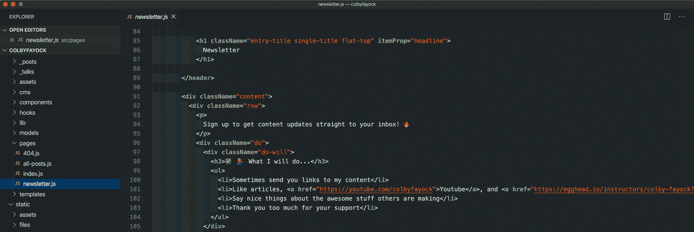

VS Code editor

现在，它已经成为“最酷的孩子”有一段时间了，并且越来越受欢迎，至少在 JavaScript 社区是这样。微软花了很大力气让它成为人们想用的东西(他们在这方面做得很好)。

## 我们将使用什么？

我们将使用一个名为 [Settings Sync](https://marketplace.visualstudio.com/items?itemName=Shan.code-settings-sync) 的 VS 代码扩展，它利用 Github 的 [Gist](https://gist.github.com/) 特性在云中存储一个私有的 JSON 配置文件。

## 它是如何工作的？

扩展使用 Github 的 OAuth 登录你的 Github 账户。一旦获得批准，VS Code 就会获得一个访问令牌，并把你的设置文件存储和下载到一个私有的 Github Gist 中。

一旦设置完成，您就可以在 VS 代码的任何其他实例上配置扩展，并立即下载您的配置来同步您的编辑器。

## 步骤 0: VS 代码

在本演练中，我们假设您已经安装了 VS 代码。虽然你不需要有任何特殊的配置，但有一些不同于默认的东西(比如[颜色主题](https://code.visualstudio.com/docs/getstarted/themes))会帮助你看到它的工作。

我们开始吧！

## 步骤 1:安装设置同步

我们需要做的第一件事是安装扩展。你可以用几种方式来完成这个—你可以访问[网页](https://marketplace.visualstudio.com/items?itemName=Shan.code-settings-sync)并点击**安装**，这将打开 VS 代码，或者你可以在扩展面板中搜索扩展。

VS Code Settings Sync extension

一旦安装，它将打开一个新的标签与设置同步仪表板。

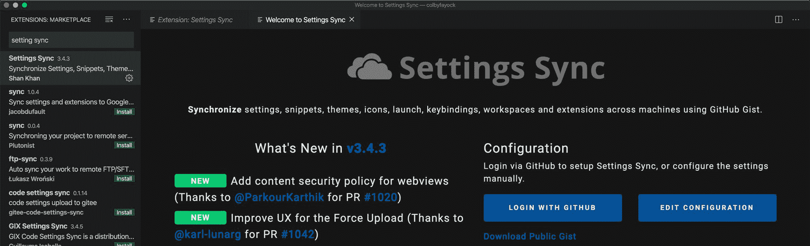

Settings Sync dashboard after installation

## 步骤 2:授权访问 Github

要开始使用 Github，点击设置同步面板中的**登录 Github** 按钮。

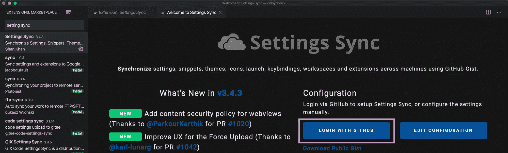

Log in to Settings Sync with Github

这将在你默认的网络浏览器中打开 Github，并要求你登录。虽然你可以使用任何你想要的 Github 帐号，但是使用你的个人帐号可能是最有意义的。

Successful Github login to Settings Sync

登录后，您应该会看到**成功了！**在您的浏览器中。

## 步骤 3:上传您当前的设置

现在您已经连接到 Github，可以上传您的设置了。

用 CMD+Shift+P 打开你的[命令面板](https://code.visualstudio.com/docs/getstarted/userinterface#_command-palette)(在 Mac 上)或者导航到视图和命令面板。一旦选择了**同步:更新/上传设置**选项，输入“同步上传”将过滤命令并按回车键。

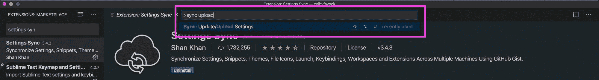

Update/Upload Settings command in Settings Sync

进行此操作时，屏幕可能会提示您是否要强制上传——按 **Yes** 。

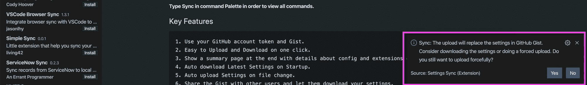

Force upload new settings in Settings Sync

此时，设置同步将使用您的配置设置在您的 Github 帐户中创建新的 Gist。完成后，您应该会看到一条成功消息。

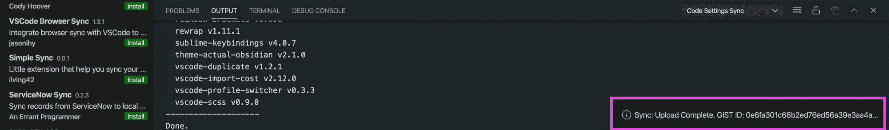

Successful settings upload in Settings Sync

你现在应该可以访问[gist.github.com](https://gist.github.com/)并找到一个新的私有`cloudSettings`要点，包括你所有的 VS 代码设置！

## 步骤 4:将您的配置同步到另一个环境

要将您的 VS 代码配置同步到另一台计算机或 VS 代码环境，您需要首先遵循上面的步骤 1 和 2——安装扩展并登录到 Github。

不同的是，这一次，您将需要配置 VS 代码来下载您的设置，而不是上传它们。

若要开始，请先打开“备份同步设置”仪表板。如果这是一个新的安装，就像我们在这里假设的那样，你可以打开命令面板，键入“同步下载”，然后按回车键，这将打开那个仪表板。这里，这次点击**编辑配置**。

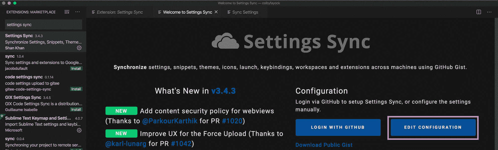

Edit Settings Sync configuration

在这个屏幕上，您应该看到您的 **Github 访问令牌**，但是您还应该看到一个用于 Gist ID 的空字段。这里，我们想首先从我们的 cloudSettings Gist URL 获取 ID:

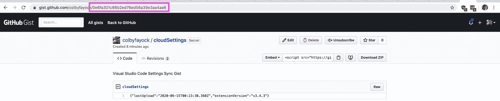

VS Code cloudSettings Gist ID

然后将该值粘贴到我们在 VS 代码中输入的 **Gist ID** 中。

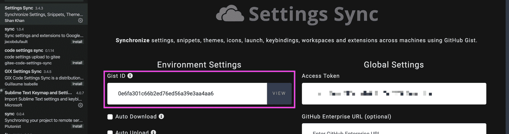

Adding Gist ID to Settings Sync configuration

一旦有了它，你可以再次打开命令面板，输入“同步下载”，并按下回车键，同步设置将从 Gist 中获取你的 VS 代码配置，并用该配置更新你的本地设置！

## 步骤 5:更新您的配置

从现在开始，任何时候您想要对您存储的配置进行新的更改，您都需要使用我们上面使用的更新/上传和下载功能。

要将一个新的调整更新到您的配置中，请键入“sync update”并按 enter:

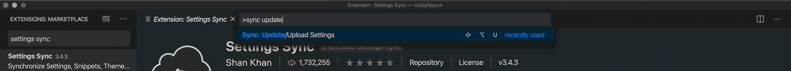

Update command for Settings Sync

要下载您的配置以同步另一个编辑器，请键入“同步下载”并按回车键:

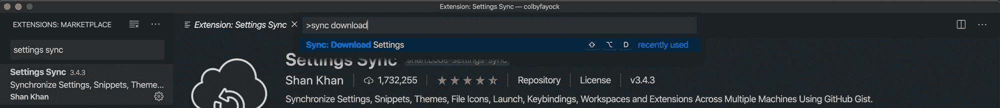

Download settings command for Settings Sync

这些命令将更新您的 cloudSettings 要点，并从中下载以同步您的 VS 代码实例

## 你最喜欢的 VS 代码技巧是什么？

在推特上与我分享吧！

## 加入对话

> 如果你像我一样喜欢你的 [@code](https://twitter.com/code?ref_src=twsrc%5Etfw) 设置，包括你的主题和扩展？‍?
> 
> 但是如果你同时处理不同的环境，更新所有的环境会很痛苦？‍♂️
> 
> 以下是如何同步你的 VS 所有东西的代码设置？[# web dev](https://twitter.com/hashtag/webdev?src=hash&ref_src=twsrc%5Etfw)[https://t.co/RRjwiU8Sul](https://t.co/RRjwiU8Sul)
> 
> — Colby Fayock (@colbyfayock) [June 16, 2020](https://twitter.com/colbyfayock/status/1272906851005366274?ref_src=twsrc%5Etfw)