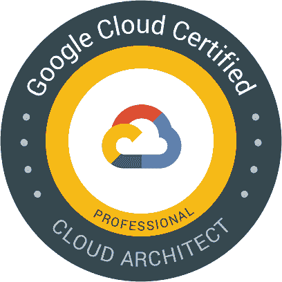
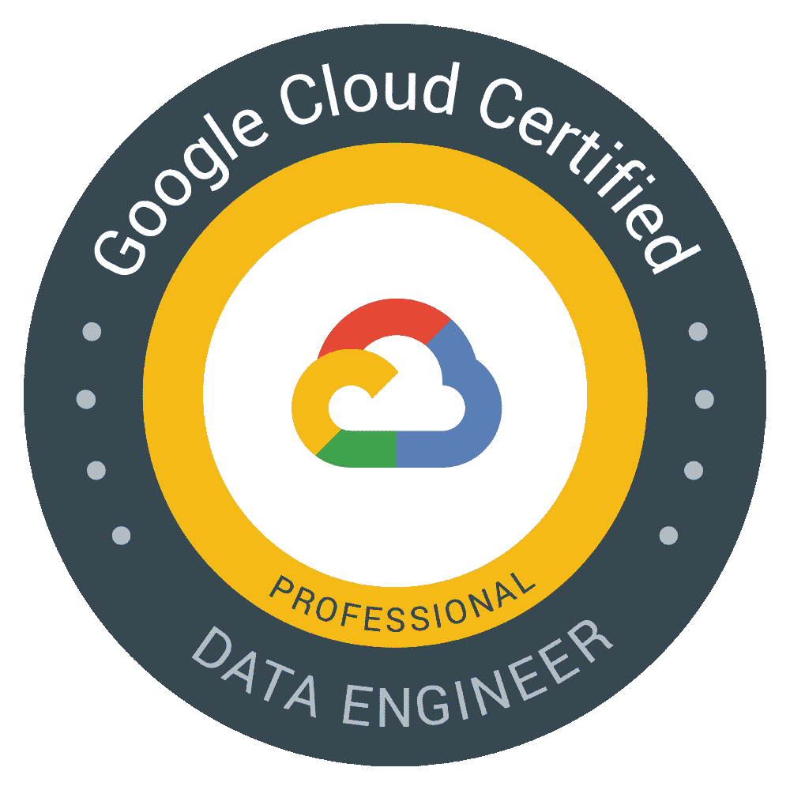
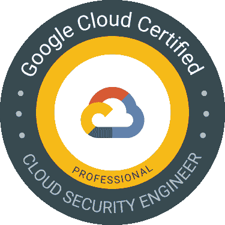
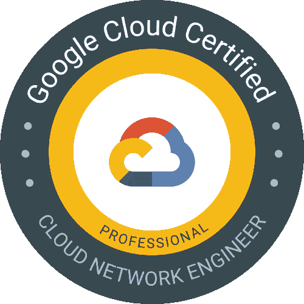
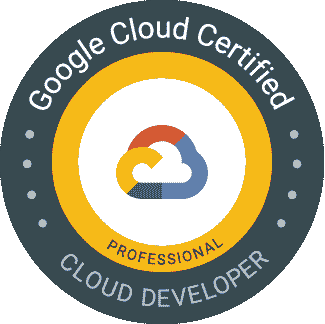
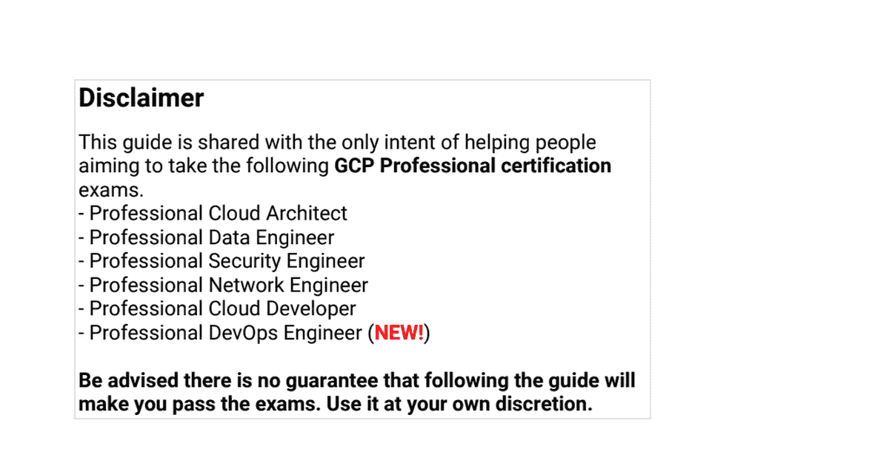
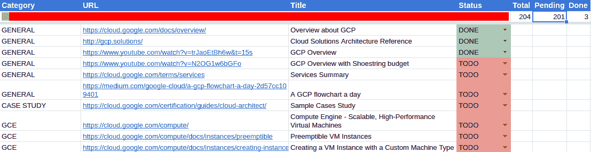

# 如何通过几乎每一个谷歌云平台专业认证考试

> 原文：<https://www.freecodecamp.org/news/how-to-pass-almost-every-google-cloud-professional-certification-exam/>

你有兴趣成为谷歌云平台认证专家吗？

去年，我参加了 GCP 职业考试的七门考试中的五门(在我写这篇文章的时候):

*   [专业云架构师](https://cloud.google.com/certification/cloud-architect)
*   [专业数据工程师](https://cloud.google.com/certification/data-engineer)
*   [专业云安全工程师](https://cloud.google.com/certification/cloud-security-engineer)
*   [专业云网工程师](https://cloud.google.com/certification/cloud-network-engineer)
*   [专业云开发者](https://cloud.google.com/certification/cloud-developer)

在这篇文章中，我将分享一些关于考试的信息，我通过考试的策略，以及我一路创建的学习指南的链接。这些指南已经过一百多名专业人士的实战检验(到目前为止)，他们在他们的帮助下成功获得了认证。

# 关于认证考试

### 专业云架构师

Professional Cloud Architect certification logo

*   **时长:** 2 小时
*   **注册费:** $200(如适用，另加税)
*   **语言:**英语、日语。
*   **考试形式:**多项选择和多项选择，远程参加或在考试时亲自参加。[在你附近找一个考试中心](https://www.kryteriononline.com/Locate-Test-Center)。
*   **考试交付方式:**
    远程参加在线监考，查看在线测试[要求](https://www.webassessor.com/wa.do?page=certInfo&branding=GOOGLECLOUD&tabs=13)。
    在考点参加现场监考考试，[在你附近找一个考点](https://www.kryteriononline.com/Locate-Test-Center)。
*   **先决条件:**无
*   **推荐经验:** 3 年以上行业经验，包括 1 年以上使用 GCP 设计和管理解决方案的经验。

**参考:**【https://cloud.google.com/certification/cloud-architect】T2

### 专业数据工程师

Professional Data Engineer certification logo

*   **时长:** 2 小时
*   **注册费:** $200(如适用，另加税)
*   **语言:**英语、日语。
*   **考试形式:**远程或在考点现场进行的多项选择。[在你附近找一个考试中心](https://www.kryteriononline.com/Locate-Test-Center)。
*   **考试交付方式:**
    远程参加在线监考，查看在线测试[要求](https://www.webassessor.com/wa.do?page=certInfo&branding=GOOGLECLOUD&tabs=13)。
    在考点参加现场监考考试，[在你附近找一个考点](https://www.kryteriononline.com/Locate-Test-Center)。
*   **先决条件:**无
*   **推荐经验:** 3 年以上行业经验，包括 1 年以上使用 GCP 设计和管理解决方案的经验。

**参考:**【https://cloud.google.com/certification/data-engineer】T2

### 专业云安全工程师

Professional Cloud Security Engineer certification logo

*   **时长:** 2 小时
*   **注册费:** $200(如适用，另加税)
*   **语言:**英语。
    **考试形式:**选择题和多项选择题，在考点亲自参加。[在你附近找一个考点](https://www.kryteriononline.com/Locate-Test-Center)。
*   **先决条件:**无
*   **推荐经验:** 3 年以上行业经验，包括 1 年以上使用 GCP 设计和管理解决方案的经验。

**参考:**[https://cloud . Google . com/certification/cloud-security-engineer](https://cloud.google.com/certification/cloud-security-engineer)

### 专业云网络工程师

Professional Cloud Network Engineer certification logo

*   **时长:** 2 小时
*   **注册费:** $200(如适用，另加税)
*   **语言:**英语。
*   **考试形式:**选择题和多项选择题，在一个考点亲自参加。[在你附近找一个考试中心](https://www.kryteriononline.com/Locate-Test-Center)。
*   **先决条件:**无
*   **推荐经验:** 3 年以上行业经验，包括 1 年以上使用 GCP 设计和管理解决方案的经验。

**参考:**[https://cloud . Google . com/certification/cloud-network-engineer](https://cloud.google.com/certification/cloud-network-engineer)

### 专业云开发人员

Professional Cloud Developer certification logo

老实说，这个让我很惊讶。回到 2019 年 12 月，我参加考试的时候，**没有任何东西说是内测**。到那时，考试页面上的信息如下:

*   ****时长**** : 2 小时
*   ****注册费**** : $200(如适用，另加税)
*   ****语言**** :英语、日语。
*   ****考试形式**** :选择题和多项选择题，在考点亲自参加。[在你附近找一个考点](https://www.kryteriononline.com/Locate-Test-Center)。
*   ****先决条件**** :无
*   ****推荐经验**** : 3 年以上行业经验，包括 1 年以上使用 GCP 设计和管理解决方案的经验。

然而，在撰写本文时，考试页面上的可用信息非常不同，如下所示:

测试认证考试是新开发的评估。我们收集问题的表现统计数据，并使用这些统计数据来创建期末考试的认证标准。如果你通过了，你就是谷歌云认证的。

*   节省 40%的认证成本
*   通过申请一个较低的证书编号来证明早期采用
*   获得独家谷歌品牌服装
*   更多详情，请参考我们的[常见问题解答](https://cloud.google.com/certification/faqs#1)

****关于贝塔****

*   ****时长**** : 4 小时
*   **:120 美元(200 美元零售价的 40%折扣)(如适用，另加税)**
*   ******语言**** :英语。**
*   ******考试形式**** :选择题和多项选择题，在考点亲自参加。[在你附近找一个考点](https://www.kryteriononline.com/Locate-Test-Center)。**
*   ******先决条件**** :无**
*   ******推荐经验**** : 3 年以上行业经验，包括 1 年以上使用 GCP 设计和管理解决方案的经验。**
*   ******Beta 考试准备资源**** :
    -参加即将到来的 Beta 考试，使用[修订后的考试指南](https://cloud.google.com/certification/guides/cloud-developer-2)。**

******参考:****【https://cloud.google.com/certification/cloud-developer】T4**

## **准备过程**

**现在你已经有了所有关于考试的基本信息，是时候学习并准备通过考试了。我参加的五次考试的准备过程包括以下步骤:**

1.  **阅读考试概述:
    [专业云架构师考试概述](https://cloud.google.com/certification/cloud-architect)
    [专业数据工程师考试概述](https://cloud.google.com/certification/data-engineer)
    [专业云安全工程师考试概述](https://cloud.google.com/certification/cloud-security-engineer)
    [专业云网络工程师考试概述](https://cloud.google.com/certification/cloud-network-engineer)
    [专业云开发者考试概述](https://cloud.google.com/certification/cloud-developer)** 
2.  **阅读考试指南:
    [专业云架构师考试指南](https://cloud.google.com/certification/guides/cloud-architect)
    [专业数据工程师考试指南](https://cloud.google.com/certification/guides/data-engineer)
    [专业云安全工程师考试指南](https://cloud.google.com/certification/guides/cloud-security-engineer)
    [专业云网络工程师考试指南](https://cloud.google.com/certification/guides/cloud-network-engineer)
    [专业云开发者考试指南](https://cloud.google.com/certification/guides/cloud-developer)** 
3.  **接下来，访问平台的产品页面，找出可能与考试指南中列出的主题相关的每种产品。对于 GCP，你可以在这里找到这个列表。** 
4.  **对于上一步中确定的每个产品，请访问其 ****文档/概念**** ****页面**** 并开始阅读与给定产品相关的每个概念。例如，查看 [GCE 概念页面](https://cloud.google.com/compute/docs/concepts)。** 
5.  **您可能会注意到一些产品似乎相互重叠，并且您可能会发现很难知道何时使用其中一个。谷歌搜索是你最好的朋友。:)** 
6.  **对于**云架构师**考试，在浏览了每个产品及其概念之后，阅读 Google 提供的样本研究案例，并尝试设计能够满足其中描述的需求的潜在解决方案。
    [mount Kirk games 学习案例](https://cloud.google.com/certification/guides/cloud-architect/casestudy-mountkirkgames-rev2)
    [dress 4 win 学习案例](https://cloud.google.com/certification/guides/cloud-architect/casestudy-dress4win-rev2)
    [terra mearth 学习案例](https://cloud.google.com/certification/guides/cloud-architect/casestudy-terramearth-rev2)

    对于**数据工程师**考试，样本学习案例最近已被删除，不再是考试的一部分，至少在 2019 年 6 月之前是如此。

    **其他所有考试**都没有利用样本学习案例，截止到 2019 年。** 
7.  **最后，参加模拟考试。模拟考试在您完成后会为每个问题提供解释。它们还能帮助你了解每次考试中将要面对的问题的格式，并帮助你了解自己准备得如何。
    [专业云架构师实践考试](https://cloud.google.com/certification/practice-exam/cloud-architect)
    [专业数据工程师实践考试](https://cloud.google.com/certification/practice-exam/data-engineer)
    [专业云安全工程师实践考试](https://cloud.google.com/certification/practice-exam/cloud-security-engineer)
    [专业云网络工程师实践考试](https://cloud.google.com/certification/practice-exam/cloud-network-engineer)
    [专业云开发者实践考试](https://cloud.google.com/certification/practice-exam/cloud-developer)** 
8.  **完成练习考试后，记下不顺利的主题，并重新阅读在上述**步骤 4** 中收集的相关文档。** 
9.  **再次参加模拟考试(你可以想参加多少次就参加多少次)，并保持**重复步骤 6 到 8** ，直到你有信心参加真正的考试。**

# **学习指南**

**根据我自己的经验，我可以告诉你**工作量很大**。为此，我决定**回馈社区，分享我在整个准备过程中创建的学习指南**。**

**学习指南包含在下面链接的电子表格中，每个都在单独的选项卡上。**

**[[Ivam Luz] GCP Professional Certifications - Study GuidesDisclaimer Disclaimer This guide is shared with the only intent of helping people aiming to take the following GCP Professional certification exams. - Professional Cloud Architect- Professional Data Engineer- Professional Security Engineer- Professional Network Engineer- Professional Cloud...Google Docs](https://docs.google.com/spreadsheets/d/1LUtqhOEjUMySCfn3zj8Arhzcmazr3vrPzy7VzJwIshE/edit#gid=0)

Spreadsheet containing the study guides** 

**要使用它，请创建您自己的副本。完成后，电子表格将变为可写，您可以更新 ****状态**** 栏，这将帮助您跟踪材料的进度:**

**

A screenshot of the spreadsheet with reference material for both professional certification exams.** 

**您可以自由复制、修改和分发本材料。我唯一善意地请求你的是，你保留一份原始材料的参考资料，并给我适当的学分，如果你觉得有帮助的话。**

**尽管云开发者考试又回到了测试阶段，但我相信我创建的指南仍然是相关的，因为它涵盖了很多主题(可能比需要的还要多 _。**

## **放弃**

**我分享这些指南的唯一目的是帮助那些打算参加**谷歌云专业认证考试**的人。请注意，不能保证遵循指南就能通过考试。请自行决定使用它们。**

# **参加考试的提示**

1.  **了解每个产品做什么，有什么好的，没有什么好的，以及它的计费特点。**
2.  **正如您在上面看到的，除了云开发人员考试(似乎已回到测试阶段)之外，您还有 **2 个小时来完成考试**。谨记 ****良好的时间管理对你的成功至关重要**。****
3.  ******不要在自己不懂的问题上花太多时间**** 。如果您不确定答案，请标记待稍后回顾的问题，然后继续下一个问题。**
4.  ******利用**** 的练习考试尽可能多的练习。**

# **结论**

**在我看来，一个认证 最大的**价值是帮助你知道作为一个专业人士，哪些科目是重要的，如果你愿意从事特定的技术工作的话。****

******专业云安全工程师**** 认证考试对我的学习有很大帮助，指导我学习更多关于谷歌云平台的安全方面的知识。它帮助我**了解了我们在从安全角度考虑或使用许多平台产品时应该关注的具体问题。****

****云网工程师认证是我拿的五个里面最难的一个。我相信这是因为到目前为止我的整个职业生涯都专注于软件开发。****

****我认识到，仅仅因为我获得了认证，它 ****并不意味着我现在是****一名网络专家**** (老实说，我真的不打算成为)。就像有些人说的，一个认证只是“一张纸”，对吗？另一方面，我在这个过程中学到了很多，掌握一些网络技能当然会让我成为一名更好的专业人士。****

**事实上，其中一些技能已经帮助我解决了一个客户的一些基础设施问题。**

**除此之外，认证仍然受到市场的高度重视，可能会帮助你脱颖而出。**

**最后一点，如果你不确定应该先参加哪项认证，我会推荐以下顺序(除非你有与工作相关的特定需求或者非常专注于某个特定领域):**

1.  **专业云架构师**
2.  **专业云安全工程师**
3.  **专业数据工程师**
4.  **专业云网络工程师**
5.  **专业云开发人员(因为它还在测试阶段，否则它可能会在这个列表中排名第三)**

**我希望这篇文章和参考的学习指南能帮助你成为一名 ****谷歌云认证专家**** 和我 ****祝你事业成功**！****

**

Photo by [Mahdi Dastmard](https://unsplash.com/@mahdigp?utm_source=ghost&utm_medium=referral&utm_campaign=api-credit) / [Unsplash](https://unsplash.com/?utm_source=ghost&utm_medium=referral&utm_campaign=api-credit)**