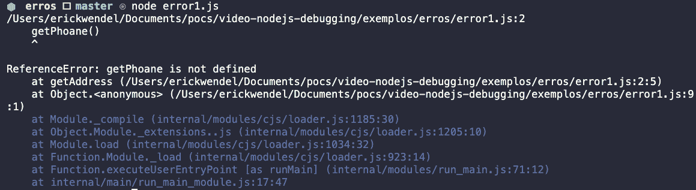
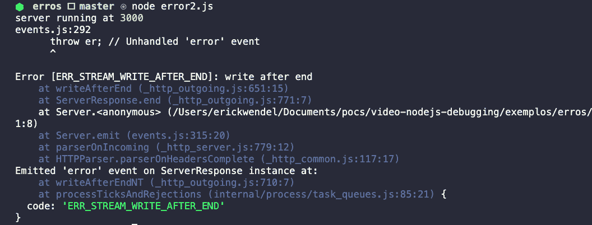
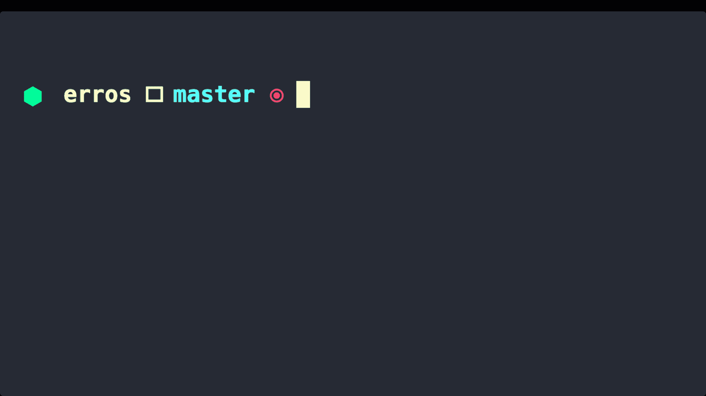
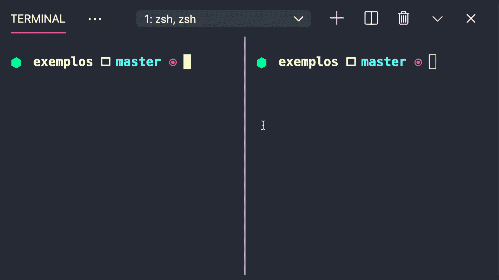
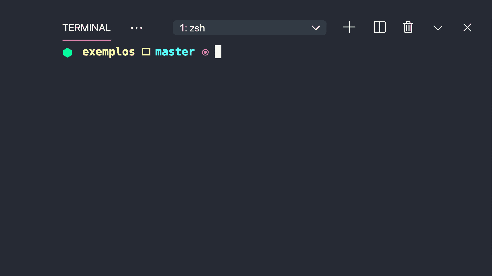
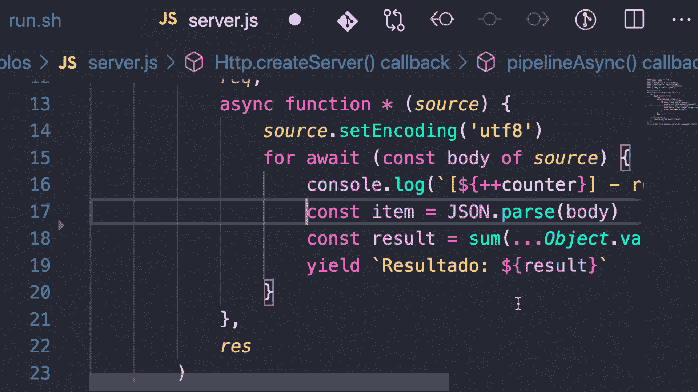
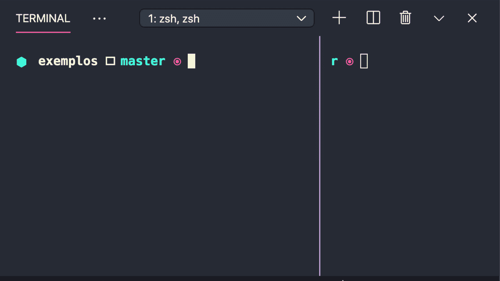
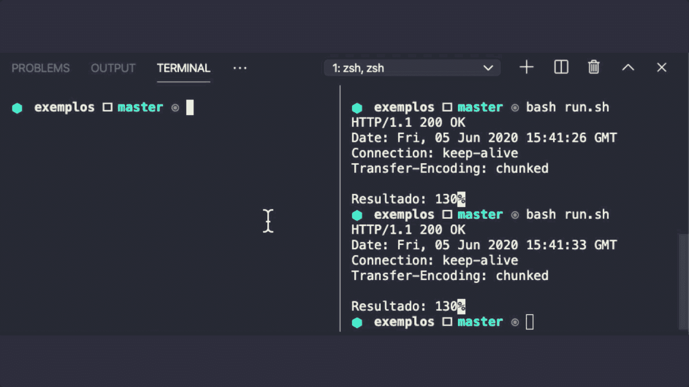
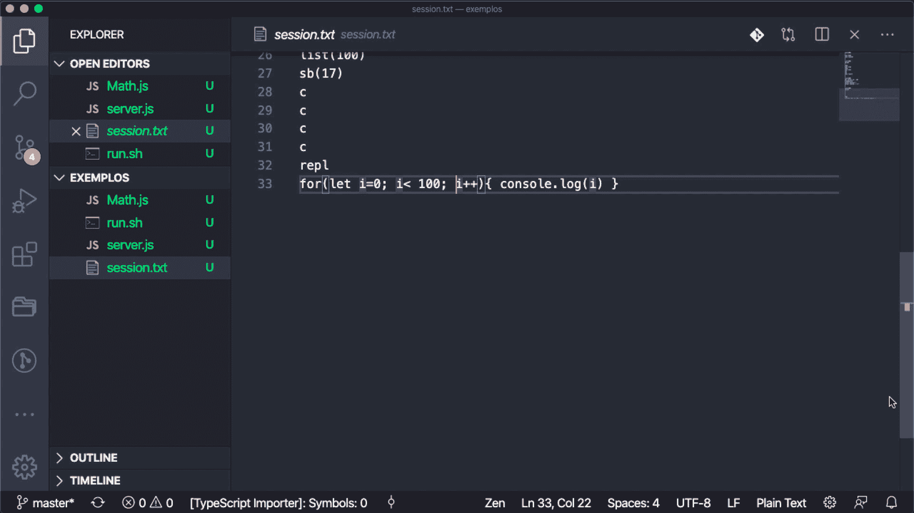

# 如何使用 VSCode、Docker 和终端调试 Node.js 应用程序

> 原文：<https://www.freecodecamp.org/news/node-js-debugging/>

在本文中，我们将使用一些强大的工具来帮助您使用 VSCode、Docker 和您的终端找到并修复 bug。我们还将学习(并实践)调试 Node.js 应用程序的 6 种方法。

您能猜出调试 Node.js 应用程序的 6 种可能方法吗？每个开发人员生活中最常见的实践之一是快速发现 bug，并了解他们的应用程序中发生了什么。

这里展示的大多数例子将使用 Node.js，但是您也可以在您的 JavaScript 前端应用程序上使用它们。您可以使用其他编辑器或 ide，如 Visual Studio 或 Web Storm，但在本文中，我将使用 VSCode。把你在这里学到的东西应用到你选择的编辑器中。

本文结束时，你将学会如何使用以下工具检查你的应用程序:

*   Node.js 读取-评估-打印-循环(REPL)
*   浏览器
*   码头工人
*   VSCode 和本地环境
*   vscode & docker
*   VSCode 和远程环境

## 要求

在接下来的步骤中，您将使用 Node.js 创建 Web API，并使用 VSCode 和 Docker 调试您的应用程序。在开始编码之前，确保您的机器上安装了以下工具:

*   [码头工人](https://docs.docker.com/desktop/)
*   [Node.js v14](https://nodejs.org/en/download/current/)
*   [VSCode](https://code.visualstudio.com/download)

## 介绍

如果你已经做了一段时间的开发人员，你可能知道这并不像电影中那样。事实上，开发人员应该把 80%的工作时间花在思考上，只有 20%的时间用来写代码。

但实际上，这 80%的大部分时间都花在了解决问题、修复 bug 以及试图理解如何避免进一步的问题上。周五晚上可能看起来像下面的 gif:


当我意识到我的工作中发生了一些奇怪的事情时，我会试着问几个问题，你会在接下来的章节中看到。

### 是拼写错误吗？

在这种情况下，问题可能出在我试图调用的某个函数或变量上。控制台将显示错误在哪里，以及引发错误的可能原因，如下图所示:



Image showing a typo in the code by calling getPhoane instead getPhone.

### 这种行为应该与当前的实现一起工作吗？

它可能是一个没有评估我的条件的 *if* 语句，甚至是一个在某些交互后应该停止但没有停止的*循环*。

### 这是怎么回事？

在这种情况下，它可能是一个内部错误或我从未见过的东西。所以我使用 google 来弄清楚我的应用程序中发生了什么。

例如，下图显示了一个内部 Node.js 流错误，它没有显示我在程序中做错了什么。



Node.js stream error with message "error: write after end" as an example for internal errors.

## 调试基于脚本的语言

通常，来自基于脚本的语言(如 Ruby、Python 或 JavaScript)的开发人员不需要使用 ide，如 Visual Studio、WebStorm 等。

相反，他们经常选择使用轻量级编辑器，如 Sublime Text、VSCode、VIM 等。下图显示了检查和“调试”应用程序的常见做法。他们打印出语句来验证应用程序的状态和值。



The console showing the program printing out values such as 'here1', 'here2', and so on.

## 入门指南

我们在上一节中看到的实践并没有达到预期的效果。我们可能会将文本名称与值混淆，打印出不正确的变量，并在简单的错误或拼写错误上浪费时间。在下一节中，我将向您展示改进 bug 搜索和语句验证的其他方法。

这里的主要目标是展示调试应用程序是多么简单。通过使用最常用的工具，您将能够检查从简单的终端命令到世界各地的远程机器的代码。

### 创建示例项目

在我们深入调试概念之前，您应该创建一个应用程序来检查。因此，首先，使用本机 Node.js 的 HTTP 模块创建一个 Web API。API 应该从请求中获取所有字段，对所有值求和，然后用计算结果响应请求者。

在您的机器上选择一个空文件夹，让我们从 Web API 开始。

首先，创建一个`Math.js`文件，它将负责对一个 JavaScript 对象的所有字段求和:

```
//Math.js
module.exports = {
    sum(...args) {
        return args.reduce(
            (prev, next) => 
                Number(prev) + Number(next), 0
        )
    }
} 
```

Math.js module

其次，使用下面的代码创建 Node.js 服务器文件。复制值并创建您的文件，然后粘贴到那里。稍后我会解释那里发生了什么。

注意，这个 API 是一个事件驱动的 API，它将通过使用 Node.js 流方法来处理请求。

```
//server.js
const Http = require('http')
const PORT = 3000
const { promisify } = require('util')
const { pipeline } = require('stream')
const pipelineAsync = promisify(pipeline)
const { sum } = require('./Math')

let counter = 0
Http.createServer(async (req, res) => {
    try {
        await pipelineAsync(
            req,
            async function * (source) {
                source.setEncoding('utf8')
                for await (const body of source) {
                    console.log(`[${++counter}] - request!`, body)
                    const item = JSON.parse(body)

                    const result = sum(...Object.values(item))
                    yield `Result: ${result}`
                }
            },
            res
        )
    } catch (error) {
        console.log('Error!!', error)
    }
})
.listen(PORT, () => console.log('server running at', PORT)) 
```

server.js file

好吧，对于一个简单的 Web API 来说，这看起来像是不寻常的代码。让我解释发生了什么事。

作为替代，这个 API 基于 *[Node.js 流](https://nodejs.org/api/stream.html)* 。因此，您将从传入的**请求**中读取按需数据，对其进行处理，并使用**响应**对象对其进行响应。

在第`(11)`行，有一个管道函数将管理事件流。如果任何流函数出错，它将抛出一个异常，我们将处理来自 *try/catch 的 *catch* 语句的错误。*

在第`(6)`行，我们从*数学*模块导入*求和*函数，然后处理第`(19)`行的输入数据。注意在`(19)`上有一个 *Object.values* 函数，它将所有的对象值展开并作为数组返回。例如，一个对象`{v1: 10, v2: 20}`将被解析为`[10, 20]`。

### 运转

如果您有一个基于 Unix 的系统，您可以使用`cURL`命令，这是一个本地命令来发出 Web 请求。如果你在 Windows 操作系统上工作，你可以使用【Linux 的 Windows 子系统或者 [Git bash](https://git-scm.com/downloads) 来执行 Unix 指令。

用下面的代码创建一个`run.sh`文件。您将创建代码来请求您的 API。如果你熟悉[邮递员](https://www.postman.com/)，你可以跳过这个文件，从那里开始执行。

```
curl -i \
    -X POST \
    -d '{"valor1": "120", "valor2": "10"}' \
    http://localhost:3000
```

run.sh file

注意，你需要安装 Node.js 版本`14`或更高版本。

您需要打开两个终端会话。在我的示例中，我在 VSCode 实例中拼接了两个终端。左侧运行`node server.js`和右侧运行`bash run.sh`如下:



The terminal running and requesting the server.js by using run.sh file.

## 使用 Node.js Read-Eval-Print-Loop 进行调试(REPL)

Node.js 可以帮助你创建最好的应用程序。REPL 是一种从终端调试和检查 Node.js 应用程序的机制。当您在`node`命令后添加`inspect`标志时，程序将在第一行代码处停止，如下所示:



Using node inspect command to stop the program before starting

首先，您将在第`(17)`行的计数器的`console.log`之后写下关键词`debugger`，然后再次执行`node inspect server.js`。

请注意，您可以使用[官方文档](https://nodejs.org/api/repl.html#repl_repl)中列出的命令与 REPL API 进行交互。

在下一张图中，您将看到 REPL 如何使用以下命令的实际示例:

1.  `list(100)`:显示前 100 行代码
2.  `setBreakpoint(17)`:在第 17 行设置断点
3.  `clearBreakpoint(17)`:删除第 17 行的断点
4.  `exec body`:评估`body`变量并打印出结果
5.  `cont`:继续程序的执行

下图显示了它的实际工作原理:



我强烈建议您尝试使用`watch`语句。与在浏览器中一样，您可以按需观看语句。在你的 REPL 会议上写下`watch(counter)`，然后写下`cont`。

要测试手表，你需要选择一个断点——使用`setBreakpoint(line)`。当您运行`run.sh`时，程序将在您的断点处停止并显示观察器。您可能会在控制台上看到以下结果:



## 使用基于 Chromium 的浏览器调试

在浏览器中调试比从终端会话中调试更常见。程序将在初始化之前继续执行，而不是在第一行停止代码。

运行`node --inspect server.js`然后进入浏览器。打开 *DevTools* 菜单(在大多数浏览器上按 **F12** 打开 DevTools )。然后会出现 Node.js 图标。点击它。然后，在 *Sources* 部分，您可以选择想要调试的文件，如下图所示:



## 在 VSCode 中调试

只要在编辑器中编写代码，在浏览器之间来回切换就没那么有趣了。最好的体验是在同一个地方运行和调试代码。

但这不是魔法。您可以配置和指定哪个是主文件。让我们按照以下步骤进行配置:

1.  你需要打开`launch.json`文件。在 macOS 上按`Ctrl` + `Shift` + `P`或者`Command` + `Shift` + `P`就可以打开，然后写*发射*。选择*调试:打开 launch.json* 选项。此外，你可以按下 **F5** 也可以打开文件。
2.  在向导的下一步中，单击 *Node.js* 选项。
3.  您可能已经在编辑器上看到了一个 JSON 文件，其中包含用于调试的预配置。用你的文件名填充**程序**字段——这告诉 VSCode 哪个是主文件。注意这里有一个`${workspaceFolder}`符号。我写它是为了指定文件在我正在处理的当前文件夹中:

```
{
    "version": "0.2.0",
    "configurations": [
        {
            "type": "node",
            "request": "launch",
            "name": "Launch Program", 
            "skipFiles": [
                "<node_internals>/**"
            ],
            "program": "${workspaceFolder}/server.js"
        }
    ]
}
```

launch.json

快到了！转到`server.js`上的源代码，点击代码行指示器的左侧，在第 16 行设置一个断点。按下 **F5** 运行它，并使用 *run.sh、*触发 *server.js* ，其中将显示如下输出:



## 调试基于 Docker 的应用程序

我个人喜欢使用 Docker。它有助于我们尽可能接近生产环境，同时在收据文件中隔离依赖关系。

如果你想使用 Docker，你需要在 Docker 配置文件中配置它。复制下面的代码，在`server.js`旁边创建一个新文件并粘贴进去。

```
FROM node:14-alpine

ADD . .

CMD node --inspect=0.0.0.0 server.js
```

Dockerfile

首先，你需要在你的文件夹上执行 *Docker* build 命令来构建运行`docker build -t app .`的应用。第二，您需要公开*调试*端口(9229)和*服务器*端口(3000 ),以便浏览器或 VSCode 可以查看它并附加一个调试器语句。

```
docker run \
    -p 3000:3000 \
    -p 9229:9229 \
    app
```

如果你再次运行 *run.sh，*文件，它应该请求 Docker 上运行的服务器。

在 VSCode 上调试 Docker 应用并不是一件难事。您需要更改配置以在远程根目录上附加调试器。用下面的代码替换您的 *launch.json* 文件:

```
{
    "configurations": [
        {
            "type": "node",
            "request": "attach",
            "name": "Docker: Attach to Node",
            "remoteRoot": "${workspaceFolder}",
            "localRoot": "${workspaceFolder}"
        }
    ]
}
```

只要你的应用程序运行在 Docker 上，并暴露默认的*调试端口* (9229)，上面的配置就会将应用程序链接到当前目录。运行 **F5** 并触发应用程序将与本地运行具有相同的结果。

## 使用 VSCode 调试远程代码

远程调试很刺激！在开始编码之前，您应该记住一些概念:

1.  目标的 IP 地址是什么？
2.  远程工作目录是如何设置的？

我将更改我的 *launch.json* 文件并添加远程地址。我家里还有一台连接到同一网络的电脑。其 IP 地址为 **192.168.15.12** 。

还有，我这里有 Windows 机器的工作目录:*c://Users/Ana/Desktop/remote-vs code/。*

macOS 基于 Unix 系统，因此文件夹结构与我的 Windows 系统不同。目录结构映射必须更改为*/Users/Ana/Desktop/remote-vs code/*。

```
{
    "version": "0.2.0",
    "configurations": [
        {
            "type": "node",
            "request": "attach",
            "name": "Attach to Remote",
            "address": "192.168.15.12",
            "port": 9229,
            "localRoot": "${workspaceFolder}",
            "remoteRoot": "/Users/Ana/Desktop/remote-vscode/",
            "trace": true,
            "sourceMaps": true,
            "skipFiles": [
                "<node_internals>/**"
            ]
        }
    ]
}
```

在这种特殊情况下，您至少需要两台不同的机器来测试它。我制作了一个简短的视频来展示它在实践中是如何工作的:

[https://www.youtube.com/embed/s6ggU9grLNo](https://www.youtube.com/embed/s6ggU9grLNo)

### 停止使用 console.log 进行调试！

我今天给你的建议是，不要懒惰于手工劳动。每天学习一种新的捷径或工具来提高生产力。多了解一些你每天都在使用的工具，这会帮助你花更多的时间思考而不是编码。

在本文中，您看到了 VSCode 如何成为调试应用程序的有用工具。VSCode 只是一个例子。使用对你来说最舒服的东西。如果你遵循这些建议，天空就是？

## 感谢您的阅读

我真的很感激我们一起度过的时光。希望这个内容不仅仅是文字。我希望它能让你成为一个更好的思考者和程序员。在 [Twitter](https://twitter.com/erickwendel_) 上关注我，并查看我的[个人博客](https://erickwendel.com)，在那里我分享我所有有价值的内容。

再见！？