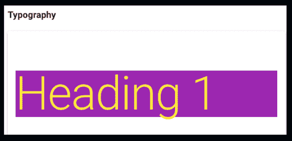
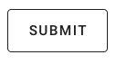
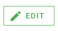
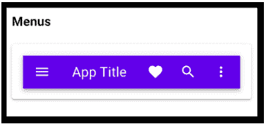
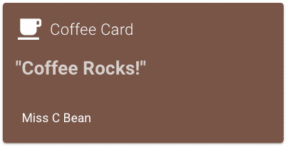

# 在 5 分钟内学会 Vuetify

> 原文：<https://www.freecodecamp.org/news/learn-vuetify-in-5-minutes/>

欢迎来到 Vuetify 的短暂停留之旅，这是 Vue.js 的一个流行组件库。它允许您创建有吸引力的、可访问的应用程序，从一开始就有 80 个元素可供使用，此外它还允许您为定制设计定制元素。

在接下来的五分钟里，我将向您展示以下热门的虚拟化元素:

*   排印
*   间隔
*   小跟班
*   航行
*   格子
*   卡片

到本文结束时，您会对只用几行代码就能制作出令人惊叹的应用程序充满信心。

阅读时，前往 [Scrimba 的 2 小时 Vuetify 课程](https://scrimba.com/course/gvuetify?utm_source=dev.to&utm_medium=referral&utm_campaign=gvuetify_5_minute_article)了解更多信息，并在该平台的互动游乐场探索代码。另外，您可以通过一些交互式编码挑战来测试您的新技能。我们开始吧！

## 创建 Vuetify 对象

要使用 Vue tity，我们首先从他们的 CDNS 中引入 Vue 和 Vue tity。

```
<script src="https://cdn.jsdelivr.net/npm/vue@2.x/dist/vue.js"></script>
<script src="https://cdn.jsdelivr.net/npm/vuetify@2.x/dist/vuetify.js"></script> 
```

这允许我们用 Vuetify 属性实例化一个 Vue 应用程序，并创建一个新的 Vuetify 对象:

```
new Vue({ 
    el: '#app',
    vuetify: new Vuetify({}),
    data: {
        message: 'Using Single File Components'
    }
}); 
```

[点击](https://scrimba.com/p/pP4xZu3/ckPbepSM?utm_source=dev.to&utm_medium=referral&utm_campaign=gvuetify_5_minute_article)查看详情。

## 排印

[](https://scrimba.com/p/pP4xZu3/cMqPmeTG?utm_source=dev.to&utm_medium=referral&utm_campaign=gvuetify_5_minute_article) 
*点击图片去看演员阵容。*

Vuetify 提供了大量选项来创建令人惊叹的版式，从各种大小的标题到标题、副标题和正文:

```
<h1 class="display-4">Heading 1</h1>
<h2 class="display-3">Heading 2</h2>
<h3 class="display-2">Heading 3</h3>
<h4 class="title">Title</h4>
<h5 class="subtitle-1">Subtitle</h5>
<p class="body-1">Body</p> 
```

使用 Vuetify，更改文本颜色和背景颜色也很容易。对于背景颜色，只需将所需颜色的名称添加到元素的类中。对于文本颜色，只需添加颜色名称，后跟`--text`。

这适用于大约 20 种标准颜色，并且可以使用附带的类如`lighten`和`darken`进行定制。

```
<h1 class="display-4 purple yellow--text text--darken-2">Heading 1</h1> 
```

Vuetify 还提供了改变字体粗细和样式的类，以及截断和转换文本的类。[前往演员表](https://scrimba.com/p/pP4xZu3/cMqPmeTG?utm_source=dev.to&utm_medium=referral&utm_campaign=gvuetify_5_minute_article)了解更多信息。

## 间隔

任何使用过 CSS 的人都知道，边距和填充可能会很棘手。不要用 Vuetify！要添加和调整元素之间的间距，只需使用具有以下缩写的类:

`m` =边距
`p` =填充
`t` =顶部
`r` =右侧
`b` =底部
`l` =左侧
`x` =右侧+左侧
`y` =顶部+底部
`a` =全部

间距大小使用数字 1 到 12 进行调整，对应于四个像素的增量。例如`ml-5`表示 20 个像素的左边距。

```
<h3 class="ml-5">Spacing</h3> 
```

使用 Vuetify 也很容易将元素居中。只需将元素包装在一个跨越页面的容器中，然后给它一个左右边距`auto`:

```
<v-row>
     <h3 class="mx-auto">Spacing</h3>
</v-row> 
```

这还不是 Vuetify 关于元素间距的便利技巧的结尾。[点击](https://scrimba.com/p/pP4xZu3/cD7pnzSw?utm_source=dev.to&utm_medium=referral&utm_campaign=gvuetify_5_minute_article)到演员表查看更多！

## 小跟班

Vuetify 提供了几十个按钮样式选项，包括常规的可点击按钮、带有现成图标的轮廓按钮和纯图标按钮。

继续阅读，了解一些开箱即用的选项，或者[点击](https://scrimba.com/p/pP4xZu3/crmrBwtP?utm_source=dev.to&utm_medium=referral&utm_campaign=gvuetify_5_minute_article)查看如何定制按钮。

**大轮廓按钮:**



```
<v-btn large outlined>Submit</v-btn> 
```

**带图标的按钮:**



```
<v-btn tile outlined color="success">
     <v-icon left>mdi-pencil</v-icon> Edit
</v-btn> 
```

**浮动动作图标按钮:**


```
<v-btn class="mx-2" fab dark color="indigo">
     <v-icon dark>mdi-plus</v-icon>
</v-btn> 
```

## 航行

[](https://scrimba.com/p/pP4xZu3/czkwwQCw?utm_source=dev.to&utm_medium=referral&utm_campaign=gvuetify_5_minute_article) 
*点击图片即可走投。*

Vuetify 中的两个主要导航选项是`<v-app-bar>`和`<v-toolbar>`。

```
<v-app-bar
     color="deep-purple accent-4"
     dense
     dark
> 
```

虽然这两个元素在某种程度上是可以互换的，但是`<v-app-bar>`是作为一个站点的主导航而设计的，它包含了一些特性，比如滚动动画和一系列的道具和选项。

`<v-toolbar>`是一个更小、更通用的组件，旨在为应用程序的其他区域提供功能。例如，它可以用于小型文本编辑器的基本编辑功能。

这两个导航元素都处理下拉列表，并自动调整导航图标和按钮的大小。

## 格子

Vuetify 有一个内置的网格系统，使应用程序中元素的大小和位置比以往任何时候都更简单。网格分为 12 列，有五个媒体断点，用于处理各种屏幕尺寸。

虽然元素的默认宽度是 12 列，但是通过更改列值可以很容易地调整它。例如，列值为 6 的项目占据了页面宽度的一半。可以使用`offset`属性来定位项目。

```
<v-col sm="6" offset-sm="3">
    <v-card
    class="pa-2"
    outlined
    tile
    >
    Column
    </v-card>
</v-col> 
```

Vuetify 中的列带有预设的间距。[点击](https://scrimba.com/p/pP4xZu3/cWKBnPSV?utm_source=dev.to&utm_medium=referral&utm_campaign=gvuetify_5_minute_article)到稀松布，查看它如何影响元素以及如何定制它。

## 卡片

[](https://scrimba.com/p/pP4xZu3/cdNW42t8?utm_source=dev.to&utm_medium=referral&utm_campaign=gvuetify_5_minute_article) 
*点击卡片进入稀松布。*

使用 Vuetify 的`<v-card>`元素可以很容易地将卡片添加到您的应用程序中，这可以通过其四个可选的嵌套元素轻松定制:`<v-card-title>`、`<v-card-text>`、`<v-card-actions>`和`<v-list-item-content>`。

我用剧组提供的[卡片做了自己的咖啡卡片。为什么不去看看你的想象力带你去哪里呢？](https://scrimba.com/p/pP4xZu3/cdNW42t8?utm_source=dev.to&utm_medium=referral&utm_campaign=gvuetify_5_minute_article)

```
 <v-card class="mx-auto" color="brown" dark >
    <v-card-title>
    <v-icon large left> mdi-coffee</v-icon>
    <span class="title font-weight-light">Coffee Card</span>
    </v-card-title>

    <v-card-text class="headline font-weight-bold">"Coffee Rocks!"</v-card-text>

    <v-card-actions>
    <v-list-item class="grow">
        <v-list-item-content>
        <v-list-item-title>Miss C Bean</v-list-item-title>
        </v-list-item-content>

        </v-row>
    </v-list-item>
    </v-card-actions>
</v-card> 
```

这就是我们对 Vuetify 基本功能的超高速浏览。要进一步探索，请前往课程并查看 Playground.vue 文件，在那里您可以测试代码并了解它能做什么。

该课程还包括一系列互动挑战，以测试您的新知识，并帮助您顺利成为 Vuetify pro。当你在那里完成后，为什么不看看 [Scrimba 的](https://scrimba.com/?utm_source=dev.to&utm_medium=referral&utm_campaign=gvuetify_5_minute_article)大量其他主题来继续你的学习之旅呢？

不管你接下来选择做什么，编码快乐:)