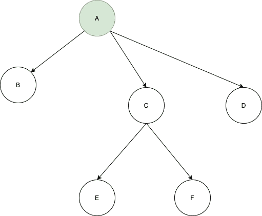
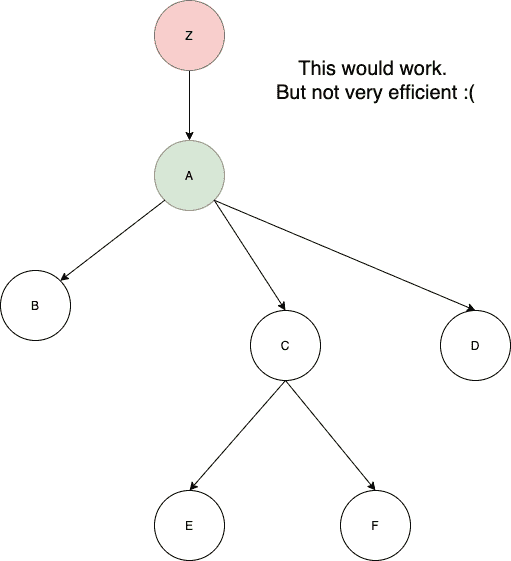
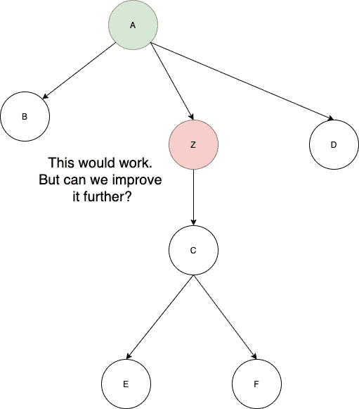
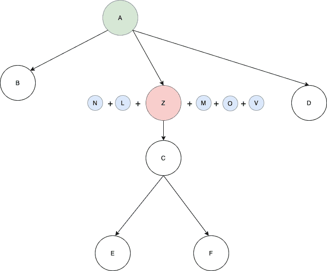

# 如何在 Flutter 中使用提供者模式

> 原文：<https://www.freecodecamp.org/news/provider-pattern-in-flutter/>

在这篇文章中，我们将看看 Flutter 中的提供者模式。其他一些模式，比如 BLoC 架构，在内部使用 provider 模式。但是提供者模式更容易学习，样板代码更少。

在这篇文章中，我们将采用 Flutter 提供的默认计数器应用程序，并将其重构为使用 provider 模式。

如果你想知道谷歌的 Flutter 团队对提供商模式有什么看法，请查看 2019 年的演讲。

如果你想了解更多关于 [BLoC 架构的知识，请点击这里。](https://ayusch.com/understanding-bloc-architecture-in-flutter/)

# 入门指南

创建一个新的 Flutter 项目，想怎么命名就怎么命名。

首先，我们需要删除所有的评论，以便我们有一个干净的石板来工作:

```
import 'package:flutter/material.dart';

void main() {
  runApp(MyApp());
}

class MyApp extends StatelessWidget {
  @override
  Widget build(BuildContext context) {
    return MaterialApp(
      title: 'Flutter Demo',
      theme: ThemeData(
        primarySwatch: Colors.blue,
        visualDensity: VisualDensity.adaptivePlatformDensity,
      ),
      home: MyHomePage(title: 'Flutter Demo Home Page'),
    );
  }
}

class MyHomePage extends StatefulWidget {
  MyHomePage({Key key, this.title}) : super(key: key);
  final String title;
  @override
  _MyHomePageState createState() => _MyHomePageState();
}

class _MyHomePageState extends State<MyHomePage> {
  int _counter = 0;
  void _incrementCounter() {
    setState(() {
      _counter++;
    });
  }

  @override
  Widget build(BuildContext context) {
    return Scaffold(
      appBar: AppBar(
        title: Text(widget.title),
      ),
      body: Center(
        child: Column(
          mainAxisAlignment: MainAxisAlignment.center,
          children: <Widget>[
            Text(
              'You have pushed the button this many times:',
            ),
            Text(
              '$_counter',
              style: Theme.of(context).textTheme.headline4,
            ),
          ],
        ),
      ),
      floatingActionButton: FloatingActionButton(
        onPressed: _incrementCounter,
        tooltip: 'Increment',
        child: Icon(Icons.add),
      ),
    );
  }
} 
```

现在在`pubspec.yaml`文件中添加提供者模式的依赖关系。在撰写本文时，最新版本是 4.1.2。

下面是您的`pubspec.yaml`文件现在的样子:

```
name: provider_pattern_explained
description: A new Flutter project.

publish_to: 'none' 

version: 1.0.0+1

environment:
  sdk: ">=2.7.0 <3.0.0"

dependencies:
  flutter:
    sdk: flutter
  provider: ^4.1.2

  cupertino_icons: ^0.1.3

dev_dependencies:
  flutter_test:
    sdk: flutter

flutter:
  uses-material-design: true 
```

默认的应用程序基本上是一个有状态的小部件，每次你点击`FloatingActionButton`(调用`setState()`)它都会重新构建。

但是现在我们要把它转换成一个无状态的小部件。

# 创建提供者

让我们继续创建我们的提供者。这将是我们应用程序的唯一真实来源。这是我们存储状态的地方，在本例中是当前计数。

创建一个名为`Counter`的类，并添加`count`变量:

```
import 'package:flutter/material.dart';

class Counter {
  var _count = 0;
} 
```

要将其转换成提供者类，请从`material.dart`包中扩展`ChangeNotifier`。这为我们提供了`notifyListeners()`方法，当我们改变一个值时，它会通知所有的监听器。

现在添加一个递增计数器的方法:

```
import 'package:flutter/material.dart';

class Counter extends ChangeNotifier {
  var _count = 0;
  void incrementCounter() {
    _count += 1;
  }
} 
```

在这个方法的最后，我们将调用`notifyListeners()`。这将在整个应用程序中触发一个变化，无论哪个小部件正在监听它。

这就是 Flutter 中提供者模式的美妙之处——您不必关心手动分派到流。

最后，创建一个 getter 来返回计数器值。我们将用它来显示最新的值:

```
import 'package:flutter/material.dart';

class Counter extends ChangeNotifier {
  var _count = 0;
  int get getCounter {
    return _count;
  }

  void incrementCounter() {
    _count += 1;
    notifyListeners();
  }
} 
```

## **倾听按钮的滴答声**

现在我们已经设置了提供者，我们可以继续在我们的主小部件中使用它。

首先，让我们将`MyHomePage`转换成无状态小部件，而不是有状态小部件。我们将不得不删除`setState()`呼叫，因为它仅在`StatefulWidget`中可用:

```
import 'package:flutter/material.dart';

void main() {
  runApp(MyApp());
}

class MyApp extends StatelessWidget {
  @override
  Widget build(BuildContext context) {
    return MaterialApp(
      title: 'Flutter Demo',
      theme: ThemeData(
        primarySwatch: Colors.blue,
        visualDensity: VisualDensity.adaptivePlatformDensity,
      ),
      home: MyHomePage(title: 'Flutter Demo Home Page'),
    );
  }
}

class MyHomePage extends StatelessWidget {
  int _counter = 0;
  final String title;
  MyHomePage({this.title});
  void _incrementCounter() {}
  @override
  Widget build(BuildContext context) {
    return Scaffold(
      appBar: AppBar(
        title: Text(title),
      ),
      body: Center(
        child: Column(
          mainAxisAlignment: MainAxisAlignment.center,
          children: <Widget>[
            Text(
              'You have pushed the button this many times:',
            ),
            Text(
              '$_counter',
              style: Theme.of(context).textTheme.headline4,
            ),
          ],
        ),
      ),
      floatingActionButton: FloatingActionButton(
        onPressed: _incrementCounter,
        tooltip: 'Increment',
        child: Icon(Icons.add),
      ),
    );
  }
} 
```

完成这些后，我们现在可以在 Flutter 中使用 provider 模式来设置和获取计数器值。每点击一次按钮，我们都需要将计数器值加 1。

因此，在`_incrementCounter`方法(当按钮被按下时调用)中添加这一行:

```
Provider.of<Counter>(context, listen: false).incrementCounter();
```

这里发生的事情是，你已经要求 Flutter 在*窗口小部件树*中向上，找到第一个提供`Counter`的地方。(我会在下一节告诉你如何提供。)这就是`Provider.of()`的作用。

泛型(括号内的值 **< >** )告诉 Flutter 要寻找什么类型的提供者。然后 Flutter 遍历小部件树，直到找到提供的值。如果任何地方都没有提供这个值，那么就会抛出一个异常。

最后，一旦获得了提供者，就可以调用它的任何方法。这里我们称我们的`incrementCounter`方法。

但是我们也需要一个上下文，所以我们接受上下文作为参数，并修改`onPressed`方法来传递上下文:

```
void _incrementCounter(BuildContext context) {
  Provider.of<Counter>(context, listen: false).incrementCounter();
} 
```

注意:我们已经将 listen 设置为 false，因为我们不需要在这里监听任何值。我们只是分派一个要执行的动作。

# 提供提供商

Flutter 中的 provider 模式将寻找提供的最新值。下图将帮助你更好地理解。



在这个图中,**绿色**对象 **A** 将对它下面的其余元素可用，即 **B、C、D、E、**和 **F.**

现在假设我们想给应用程序添加一些功能，我们创建了另一个提供者， **Z，** Z 是 E 和 f 所需要的。

那么，在哪里添加它最好呢？

我们可以把它加到根上面 **A** 。这是可行的:



但是这种方法效率不是很高。

Flutter 将遍历上面所有的小部件，然后最终到达根。如果你有很长的窗口小部件树——在生产应用程序中肯定会有——那么把所有东西都放在根上并不是一个好主意。

相反，我们可以看看 E 和 F 的公分母，那就是 c，所以如果我们把 Z 放在 E 和 F 上面，就可以了。



但是如果我们想添加另一个对象 **X** 那就是 E 和 F 需要的**T3 呢？我们会做同样的事情。但是请注意这棵树是如何不断生长的。**


有一个更好的方法来处理这个问题。如果我们在一个层次上提供所有的对象会怎么样？



这是完美的，也是我们最终在 Flutter 中实现提供者模式的方式。我们将使用一个叫做`MultiProvider` 的东西，它允许我们在一个层次上声明多个提供者。

我们将让`MultiProvider`包装`MaterialApp`小部件:

```
class MyApp extends StatelessWidget {
  @override
  Widget build(BuildContext context) {
    return MultiProvider(
      providers: [
        ChangeNotifierProvider.value(
          value: Counter(),
        ),
      ],
      child: MaterialApp(
        title: 'Flutter Demo',
        theme: ThemeData(
          primarySwatch: Colors.blue,
          visualDensity: VisualDensity.adaptivePlatformDensity,
        ),
        home: MyHomePage(title: "AndroidVille Provider Pattern"),
      ),
    );
  }
} 
```

这样，我们就为小部件树提供了提供者，并且可以在树中这一层以下的任何地方使用它。

只剩下一件事:我们需要更新显示的值。

## **更新正文**

要更新文本，请在您的`MyHomePage`小部件的构建函数中获取提供者。我们将使用我们创建的 getter 来获取最新的值。

然后将这个值添加到下面的文本小部件中。

我们完事了。这是您最终的`main.dart`文件的外观:

```
import 'package:flutter/material.dart';
import 'package:provider/provider.dart';
import 'package:provider_pattern_explained/counter.dart';

void main() {
  runApp(MyApp());
}

class MyApp extends StatelessWidget {
  @override
  Widget build(BuildContext context) {
    return MultiProvider(
      providers: [
        ChangeNotifierProvider.value(
          value: Counter(),
        ),
      ],
      child: MaterialApp(
        title: 'Flutter Demo',
        theme: ThemeData(
          primarySwatch: Colors.blue,
          visualDensity: VisualDensity.adaptivePlatformDensity,
        ),
        home: MyHomePage(title: "AndroidVille Provider Pattern"),
      ),
    );
  }
}

class MyHomePage extends StatelessWidget {
  final String title;
  MyHomePage({this.title});
  void _incrementCounter(BuildContext context) {
    Provider.of<Counter>(context, listen: false).incrementCounter();
  }

  @override
  Widget build(BuildContext context) {
    var counter = Provider.of<Counter>(context).getCounter;
    return Scaffold(
      appBar: AppBar(
        title: Text(title),
      ),
      body: Center(
        child: Column(
          mainAxisAlignment: MainAxisAlignment.center,
          children: <Widget>[
            Text(
              'You have pushed the button this many times:',
            ),
            Text(
              '$counter',
              style: Theme.of(context).textTheme.headline4,
            ),
          ],
        ),
      ),
      floatingActionButton: FloatingActionButton(
        onPressed: () => _incrementCounter(context),
        tooltip: 'Increment',
        child: Icon(Icons.add),
      ),
    );
  }
} 
```

注意:在这种情况下，我们没有设置`listen:false`,因为我们想监听计数值的任何更新。

如果你想看的话，下面是 GitHub 上的源代码:[https://github.com/Ayusch/Flutter-Provider-Pattern](https://github.com/Ayusch/Flutter-Provider-Pattern)。

如果你有任何问题，请告诉我。

## 欢迎来到安卓维尔:)

AndroidVille 是一个移动开发者社区，我们在这里分享与 Android 开发、Flutter 开发、React 原生教程、Java、Kotlin 等相关的知识。

点击此链接加入 AndroidVille SLACK 工作空间。绝对免费！

如果你喜欢这篇文章，请随意在脸书或 LinkedIn 上分享。你可以在 [LinkedIn](https://www.linkedin.com/in/ayuschjain) 、 [Twitter](https://twitter.com/ayuschjain) 、 [Quora](https://www.quora.com/profile/Ayusch-Jain) 和 [Medium](https://medium.com/@jain.ayusch10) 上关注我，在那里我会回答有关移动开发、Android 和 Flutter 的问题。