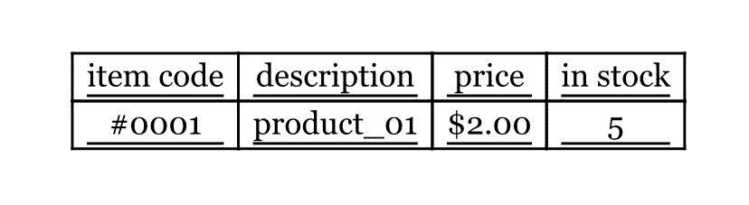

# VLOOKUP 示例–如何在 Excel 中执行 VLOOKUP

> 原文：<https://www.freecodecamp.org/news/vlookup-in-excel/>

Microsoft Excel 包括各种不同的函数，可以帮助用户进行各种计算。Excel 的功能如此全面，以至于普通用户甚至没有利用大多数实用程序。

但是，如果您经常在列和行中滚动查找相同的信息，您可能会喜欢 VLOOKUP 功能。VLOOKUP 代表“垂直查找”，它可以帮助您快速找到与您输入的某个值相关联的数据。

例如，您可能有一个包含具有唯一 id 和价格的产品的表。如果你输入某个产品的 ID，VLOOKUP 可以显示它的价格。

你可以用很多不同的方式使用 VLOOKUP，它会大大简化你的工作，尤其是在处理大表的时候。

你不需要花很多时间去寻找某个单元格，因为这个函数会帮你找到。然而，初学者用户经常发现很难设置 VLOOKUP。因此，我决定通过准备这份详细的指南来帮助你。

## 什么是 VLOOKUP？

首先，VLOOKUP 是一个函数。因此，如果您是 Excel 新手，您可能希望熟悉一些基本函数，如 AVERAGE、SUM 或 TODAY。这样你就很容易理解这个函数是如何工作的。

VLOOKUP 是一个数据库函数，所以它适用于数据库表。这种表格基本上是不同项目的列表。例如，当处理产品、员工、客户等列表时，可以使用这个函数。

比方说，您有一个由四列组成的产品列表。它可能在第一列中包含商品代码，在第二列中包含产品的名称或描述，在第三和第四列中分别包含商品的价格和库存数量。

数据库表中的每一项通常都有某种唯一的标识符。在这种情况下，它是项目代码。该列是 VLOOKUP 函数运行所必需的，并且必须是表中的第一列。

如果你是初学者，你应该做的第一件事就是理解 VLOOKUP 到底是做什么的。简单地说，它根据用户输入的唯一标识符显示列表或数据库中的信息。

如果我们考虑上面的例子，这个函数可以根据产品的项目代码显示产品的价格、描述或可用性。它到底会显示什么取决于你写的公式。VLOOKUP 支持精确匹配和近似匹配，以及部分匹配的通配符。

## VLOOKUP 的工作原理

以下是描述 VLOOKUP 函数的公式语法:

`=VLOOKUP(value, table, column_index, [range])`

*   `value`是该函数将在第一列中查找的内容
*   `table` 是该函数将从中检索必要信息的表格
*   `column_index`是函数将从中检索信息的列的编号
*   `range` 是一个布尔型参数，可以为真也可以为假。TRUE 是默认值，它对应于近似匹配。FALSE 将只显示精确匹配。

甚至这个函数的名字也包含“vertical”，VLOOKUP 只适用于数据以垂直列组织的表。因此，如果你是水平组织数据，这个函数就没用了。在这种情况下，您可以使用类似的函数进行水平查找— [HLOOKUP](https://support.office.com/en-us/article/hlookup-function-a3034eec-b719-4ba3-bb65-e1ad662ed95f) 。

你还应该记住，这个函数只能从左到右工作。换句话说，如果惟一标识符不在表的第一列中，函数将无法从标识符左侧的列中检索信息。

每一列都有自己的编号，所有的列都是从左到右编号的。如果要从某一列中获取值，应该在公式中指定它的编号。在上面的公式模板中，这个数字叫做`column_index`。

例如，如果您想从上面的示例中检索产品的名称，列索引应该是 2。

正如我上面已经提到的，VLOOKUP 函数支持两种匹配模式:近似和精确。此参数是公式中的第四个参数。默认情况下设置近似匹配。如果要选择精确匹配，应该将查找范围设置为`FALSE`。

因此，下面的两个公式都将使用近似匹配来检索数据:

`=VLOOKUP(value, table, column_index)`

`=VLOOKUP(value, table, column_index, TRUE)`

正如你所看到的，如果你想使用精确匹配模式，你应该小心。如果不提供任何查找范围值，该函数仍将使用近似匹配模式。

以下公式将强制精确匹配模式:

`=VLOOKUP(value, table, column_index, FALSE)`

如果要使用精确匹配模式，请确保将值设置为`FALSE`。在大多数情况下，您可能需要精确匹配，所以如果您是 Excel 新手，请不要忘记这个细节。

如果您有一个包含项目标识符的列，精确匹配是正确的选择。它也可以是可用于精确查找的任何唯一值。例如，它可能是一本书或一部电影的唯一标题，以及任何其他唯一关键字。请记住，VLOOKUP 不区分大小写。

然而，有时您可能不需要精确的匹配，而是可能的最佳匹配。在这种情况下，可以使用近似匹配模式。

例如，在处理必要信息对应于特定数值的数据表时，您可以使用这种模式，并且您希望检索表中不包含的值的结果。

基于现有数据进行计算时，可以使用这种方法。如果您输入一个值，并且该函数找到完全匹配的值，它将从相应的行中检索信息。但是，如果表中没有完全匹配，函数将匹配前一行。

为什么它会匹配前一行，而不是另一行？如果你没有用正确的方法整理你的桌子，它就不会。要使 VLOOKUP 能够查找最佳近似值，您应该确保该列中的所有值都按升序排序。在这种情况下，该函数将后退一步并检索最接近的值。

## #不适用错误

使用 VLOOKUP 函数以及 Excel 中的许多其他函数时，您可能会经常遇到#N/A 错误。此错误意味着找不到该值。

出现此错误有几个原因。以下是一些最常见的情况:

*   您拼错了值或添加了额外的空格
*   表中不存在必要的值
*   搜索近似值时，您使用的是精确匹配模式
*   您没有输入正确的表格范围
*   您复制了 VLOOKUP，而表引用没有被锁定。

如果您的表格有绝对引用，这意味着行和列在复制时不会改变。然而，这不是相对引用的情况。在这种情况下，您需要将[切换到绝对参考](https://support.office.com/en-us/article/switch-between-relative-absolute-and-mixed-references-dfec08cd-ae65-4f56-839e-5f0d8d0baca9)。

您可以使用 [IFNA 函数](https://support.office.com/en-ie/article/ifna-function-6626c961-a569-42fc-a49d-79b4951fd461)自定义#N/A 错误的文本。在这种情况下，你必须用 IFNA 写一个包含 VLOOKUP 的更长的公式。

下面是一个将返回“未找到”而不是#N/A 的公式示例:

`=IFNA(VLOOKUP(value, table, column_index, FALSE), "not found")`

下面是一个将返回空白结果的公式:

`=IFNA(VLOOKUP(value, table, column_index, FALSE), "")`

虽然您可以自定义消息，但是您可以考虑使用#N/A 错误，因为它会立即引起您的注意，并让您知道是否出现了问题。

## 如何使用 VLOOKUP

您可以从头开始编写公式，也可以使用 Excel 菜单。选择要显示结果的单元格，然后选择“公式”选项卡。

之后，点击“插入函数”您将看到一个框，您可以在其中选择函数的类别并选择 VLOOKUP 函数。您也可以使用“搜索函数”框，输入“vlookup”

选择函数，将出现“函数参数”框。您可以在这里输入必要的函数参数。在该窗口中，您应该指定您正在寻找的唯一标识符、数据库位置以及与您想要检索的标识符相对应的信息。

这些参数是“查找值”、“表数组”和“列索引号”这些字段以粗体显示，因为这些参数是必需的。

第四个参数是查找模式，您可以指定也可以不指定。默认情况下设置近似模式。

要输入第一个参数，即唯一标识符，可以选择所需的单元格，然后按 enter 键。在这种情况下，该单元格的值将作为 VLOOKUP 函数的第一个参数自动输入。

现在你必须输入第二个参数。数据库不一定要从左上角开始。例如，您也可以有一个描述列的行，作为标题。

“VLOOKUP 功能最好的一点是，数据库的位置也可以定制，”Bridget Allen 指出，他是一个[最佳作家在线](http://bestwritersonline.com/)的会计。

假设 VLOOKUP 只处理一定数量的列，那么您应该指定您的表中要用于查找的区域。这就是“Table_array”框的用途。

例如，如果您的表格从左上角开始，并且它的第一行是标题，则您可以选择整个数据库而不选择第一行。如果您的数据库有四列(A-D)和五项，表格数组将是 A2:D6，因为单元格 A1-D1 将包含标题。

您可以点击必要的工作表标签，并选择带有数据库的区域。按 Enter 键，选定的单元格区域将自动添加到 VLOOKUP 函数的第二个参数中。下面是一个函数参数的示例:

`‘database_name’!A2:D6`

在这种情况下，“数据库名称”是工作表标签的名称。

现在，您只需要指定要检索的信息，并提供所需列的编号。

例如，如果您想从本文开头的表中检索一个商品的价格，您应该使用第三行，并且“Col_index_num”值将是 3。

## 包扎

Microsoft Excel 有各种各样的功能，可以帮助用户处理不同的计算和其他任务。VLOOKUP 是一个非常有用的函数，可以从数据库表中检索对应于某个值的信息。

如果您是 Excel 的新手，您可能会对这个函数感到困难，因为它有四个参数。

然而，如果你遵循我们的指南，你将能够选择正确的参数和使用正确的公式。如果你在实践中多次使用这个函数，你会很快理解它是如何工作的，这样你就可以在任何需要的时候使用 VLOOKUP。