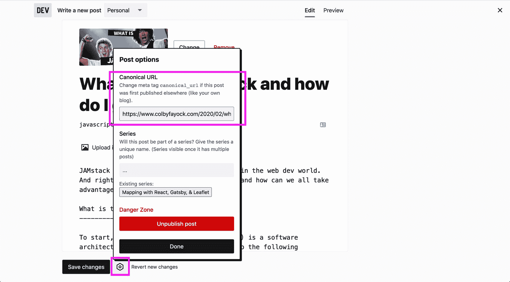
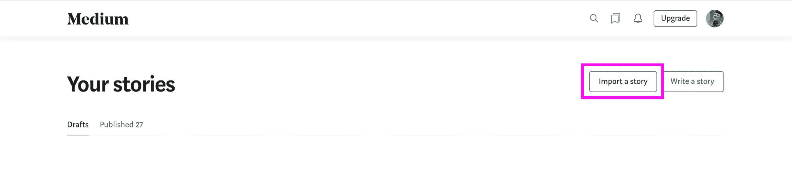
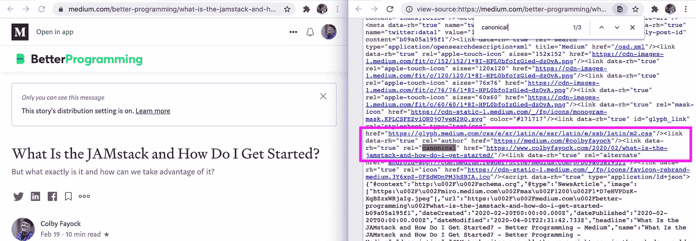

# 如何扩大您的受众并与世界分享您的内容

> 原文：<https://www.freecodecamp.org/news/how-to-grow-your-audience-and-share-your-content-with-the-world/>

构建高质量的内容是一项非常有益的任务。但对于那些刚刚起步或还没有大量受众的人来说，这些内容很容易被淹没在 Twitter 上的其他百万条推文中。我们如何扩大我们的覆盖面，帮助我们的内容影响更多的人？

*   [为大众创造我们的内容](#creating-our-content-for-the-masses)
*   我所说的建立观众群是什么意思？
*   [利用更大的平台和出版物](#leveraging-larger-platforms-and-publications)
*   [与其他平台联合](#syndicating-with-other-platforms)
*   [向其他出版物投稿](#contributing-to-other-publications)
*   [在内容监管平台上分享](#sharing-on-content-curation-platforms)
*   [其他值得注意的地方](#other-notable-places)

## 为大众创造我们的内容

每个内容创作者都经历过——你刚刚写了一篇文章，你对此非常兴奋，认为它会大受欢迎。但你很快就会发现，当你醒来希望在推特上找到成千上万个赞，却发现一个也没有时，一夜之间的成功永远不会到来。

但这可能与你的文章无关。这绝对是开创性的，但不幸的是没有多少人看到它。

社交网络并不倾向于根据你的文章有多好，而是根据这篇文章获得的互动和参与度来排列其订阅源的优先级。虽然这有点道理，但对于刚刚起步的人来说，这并不太好。

那么，我们如何扩大这个范围呢？虽然显而易见的途径是通过广告来获得成功，但我将重点关注我们建立受众的更自然的方式。

## 我说的建立观众群是什么意思？

你最喜欢的网络开发人员或社交媒体影响者并不是从 10 万名追随者开始的——他们中的大多数人都非常努力地工作才达到他们现在的位置。这个过程就是建立观众群的全部。

通过创作内容，你正在努力寻找喜欢你的作品或从中获得灵感的人。理想情况下，这些人会在他们最喜欢的平台上关注你，希望你的下一篇文章能同样激励他们。

您的受众是那些关注您或积极参与您创建的内容的人。那些对你的新视频竖起大拇指来支持你的人。那些订阅你的时事通讯的人，因为他们渴望看到你那一周出色的工作。

通过在你的内容上下功夫，保持一致，并且[找到你的声音](https://www.colbyfayock.com/2020/05/how-to-write-more-effectively-and-develop-your-unique-style/)，你会自然地赢得观众。但是要建立观众群，人们首先需要看到它。那么怎么才能拿到人前呢？

## 利用更大的平台和出版物

虽然你的新博客可能没有人订阅你的 RSS 提要，但有很多平台拥有大量受众，他们正在积极寻找更多作者。

通过利用这些受众，你可以帮助自己获得成功。虽然你可能需要放弃一点文章的所有权，把它写在一个不是你自己的博客上，但是你提供了一种方式让更多的人阅读你的内容并发现你是谁。

这一过程可以采取多种形式，但我将重点关注几件事:

*   与其他平台联合
*   为其他出版物供稿
*   在内容监管平台上分享

## 与其他平台联合

辛迪加你的内容可以是一个更有效的手段来获得一个更大的网络，同时保持自己的内容托管的好处很多。

不是所有的平台都是一样的，但是我将要介绍的大多数平台都允许你提供一个[规范链接](https://moz.com/learn/seo/canonicalization)到你自己的网站。这让你可以在不同的平台上发布你的作品，而“SEO 汁”最终会流回你自己的博客。

虽然从 SEO 的角度来看这很重要，但通常这也是一种很好的方式，可以让你的内容托管在你自己的网站上，你知道在可预见的未来你会维护它。如果这些平台中的一个关闭了，你仍然可以在家里安全地保存所有的内容。

那么，我们可以与哪些平台合作，以及如何建立合作关系呢？

### Dev.to

[Dev.to](https://dev.to/) 是希望分享知识并与更大的技术社区展开对话的开发人员的首选平台。它们提供了一个非常友好和安全的空间，有经验的和新的开发人员可以在这里发布他们的工作。

最棒的是，每个人似乎都有一点公平的机会将自己的工作公之于众。虽然他们有与其他网络相似的功能，你可以关注你最喜欢的作者，但新的作者仍然会出现在内容提要中，给你一个被看到的机会。

要在 dev.to 上进行联合，您需要在 post 配置中设置规范链接。当编辑内容时，您需要寻找设置图标，在那里您将获得一个输入，您可以在其中添加帖子的原始 URL。

Adding a canonical URL to a dev.to post

### 中等

最近，Medium 因其激进的策略和盈利策略受到了很多批评，但对于没有观众的新人来说，它仍然是一个有效的平台。

Medium 庞大的用户网络和内容监管使其成为一个扩大影响力的绝佳平台。但并不止于贴在那里。

为了有效地利用你的媒体文章，你需要通过现有的媒体出版物来发表。 [Better Programming](https://medium.com/better-programming) 是最大的开发者出版物之一，总是[寻找新作者](https://medium.com/better-programming/write-for-us-5c4bcba59397)投稿。

向 Medium 出版物投稿不仅能帮助你利用 Medium 的网络，还能让你有更好的机会被 Medium 的策展团队选中，并登陆某人的简讯收件箱。

不过，给你的中型文章添加一个规范的链接有点棘手。为此，你必须“导入”你的故事，而不是复制粘贴。好消息是，is Medium 还试图导入所有的内容，理想情况下使它更容易添加(记住要检查所有的格式！).

在您的故事页面上，您可以找到“导入”按钮。

Importing a story on Medium

一旦它被导入，您实际上看不到多少，但是一旦您预览页面，您可以查看源代码并找到添加的规范链接。

Canonical link in Medium post source

## 为其他出版物供稿

虽然你可能不得不放弃自己内容的所有权，但为其他出版物写作或写“客座博文”是一个很好的开始方式，可以在你以前可能没有的地方获得一些地盘。

根据出版商的不同，你可能永远也不会有机会在自己的网站上发布它，但你正在用它来换取将你的作品发布给潜在的数百万人的特权，而不是 5 月份的 10 个独立访客。

这甚至可以打开更多机会的大门。这有助于提高你的知名度和权威性，有助于你找工作，或者仅仅是为同一家出版社或另一家更大的出版社写作的另一个机会。

好消息是，你可以向源源不断的知名出版商提交你的作品。这里有几个你可以开始:

*   [freeCodeCamp 新闻](https://www.freecodecamp.org/news/developer-news-style-guide/)
*   [砸弹匣](https://www.smashingmagazine.com/write-for-us/)
*   [CSS-招数](https://css-tricks.com/guest-posting/)
*   [站点点](https://sitepoint.typeform.com/to/DMmYfn)
*   [Tuts+](https://envato.formstack.com/forms/create_a_tutorial?Source=&Medium=)
*   [网页设计师仓库](https://www.webdesignerdepot.com/write-for-us/)
*   [的划分](https://dzone.com/pages/contribute)
*   [多视导轨](https://www.pluralsight.com/guides)(参见页脚中的“示教”)

这些出版物都有不同的出版流程。所以要有耐心，继续努力做好你的内容。

注意:知道另一个提供写作机会的出版商吗？[让我知道](https://twitter.com/colbyfayock)，我会把他们加在上面！

## 在内容监管平台上分享

如果我们都有一个大规模的 Twitter 关注我们的新博客，那就太好了，但通常情况下不是这样。因此，虽然你绝对应该建立一个[社交媒体档案](https://twitter.com/colbyfayock)并在那里发布你的内容，但我在这里将重点放在其他平台上。

### Reddit

尽管根据子网站的不同，自我推销肯定有一定的规则，但 reddit 的是一个由真实的人组成的庞大社区，他们对新事物充满好奇和渴望。

了解现有的不同技术或 [webdev](https://www.reddit.com/r/webdev/) 子主题。开始参与别人的帖子。与那里的人发展关系，展示为什么你的内容有价值。

### 黑客新闻

[黑客新闻](https://news.ycombinator.com/)艰难。很难被人注意到，也很难上头版。即使你上了头版，也很有可能会受到很多你从未想过的批评。

但是如果你脸皮够厚，并学会在受到关注时承受压力，黑客新闻可能是向全世界传播的一种不可思议的方式。人们通过出现在黑客新闻的首页而变得一夜成名，不管他们是不是在那里发布的。

### 更多平台

虽然这只是其中的两个，但还有很多。以下是几个让你开始的例子:

*   [Echo JS](https://www.echojs.com/)
*   [RubyFlow](http://www.rubyflow.com/)
*   [Golang News](https://golangnews.com/)
*   [网页设计师新闻](https://www.webdesignernews.com/)

## 其他著名的地方

### 基于聊天的社区

有大量的[社区](https://www.freecodecamp.org/news/freecodecamp-discord-chat-room-server/)使用像 [Slack](https://slack.com/) 或 [Discord](https://discord.com/) 这样的平台[非常支持](https://www.100daysofcode.com/resources/)帮助彼此成长。虽然你不应该简单地发送你的内容，但试着围绕它展开对话。谈谈为什么这个主题对你很重要，或者你的教程如何帮助其他人的代码之旅。

### 时事通讯

这是很多人后悔没有早点开始的事情，包括我自己。在一个有免费层的平台上开始一份时事通讯[并把它放在你的口袋里，直到你看到一些增长，这并不是太多的努力。没有人会因为你等了几个月才发布内容而对你评头论足，但是一旦你开始增加你的观众，他们会很兴奋地看到你所有的新作品。](https://app.convertkit.com/referrals/l/36ce3fce-f231-48b5-b878-e622d0265c3f)

### 其他人的简讯

你不一定要有自己的时事通讯才能进入别人的收件箱，已经有很多时事通讯管理员在做大量艰苦的工作，在网络上寻找伟大的内容，但是如果他们看不到，他们怎么能包括它呢？

大多数时事通讯出版物都喜欢收到投稿。这有助于他们的出版物增长，并包括来自那些自己可能没有好机会的人的内容。

虽然你可以在谷歌上搜索并找到对你有意义的时事通讯，但这里有一些我会关注的，我知道他们会喜欢看你的作品:

*   所有的 [Cooperpress](https://cooperpress.com/publications/) 出版物包括 [Javascript 周刊](http://javascriptweekly.com/)、[无服务器状态](https://serverless.email/)和[一堆更多的](https://cooperpress.com/publications/)
*   [网络工具周刊](https://webtoolsweekly.com/)
*   [CSS 周刊](https://css-weekly.com/)

## 打造你的“品牌”

“品牌”是一个有趣的词，有时带有负面含义。但作为一名作者，你的目标应该是建立一种形象，通过你所有不同的工作渠道始终如一地展现出来。

例如，在可能的情况下，创建作者简介时尽量使用相同的用户名。你几乎可以在任何地方通过 [@colbyfayock](https://twitter.com/colbyfayock) 找到我——这让人们很容易在一个新的网络上找到我。

也尽量用同一张图。虽然根据不同的人定制不同的个人资料肯定很有趣，但使用同一张照片的好处是人们会通过这张照片认出你。当他们通过自己的订阅源看到你的推文时，他们会立即记得他们看到了你的博客文章。

## 耐心点，你的时候会来的

不花很多钱，你不会一夜成名，所以要有耐心。内容开发是很难的，它需要时间来建立一个观众群和理解你的声音。

但是很有可能，如果这是你写的第一篇文章，也许你寄给它的第一个出版商对它不感兴趣。

**没关系！**不要放弃！将它发送给另一个出版商，并在您的下一篇文章中尝试原始版本。当我刚开始的时候，我花了几篇文章才被 freeCodeCamp 的媒体出版物接受为作者。

你写得越多，你就会越了解什么是有效的。这不是短跑，要有耐心，继续努力。

## 克服分享工作的恐惧

这些事情大多数都不容易做到。你可能不得不面对对你的工作的批评性反馈，这个想法绝对是可怕的！

但是克服这种恐惧是这个过程中重要的一步。当我开始写作的时候，我个人也在这方面挣扎，但是你越是把自己放在那里，它就变得越不可怕，你会很快注意到没有那么多坏人想说你作品的坏话。

相反，你正在向学习和成长的机会敞开心扉。虽然不是每个人都一样，但技术社区可能会非常欢迎和支持。你分享得越多，把自己放在那里，人们就会越愿意听你说些什么。

## 你如何分享你的工作？

在推特上告诉我！

*   [？在 Twitter 上关注我](https://twitter.com/colbyfayock)
*   [？️订阅我的 Youtube](https://youtube.com/colbyfayock)
*   [✉️注册我的简讯](https://www.colbyfayock.com/newsletter/)