# 不要先写所有的软件测试——只写一个

> 原文：<https://www.freecodecamp.org/news/dont-write-all-your-software-tests-first-just-write-one/>

测试驱动开发(TDD)有时被描述为“首先编写测试”。TDD 口头禅指出，在我们编写出测试代码的自动化测试之前，我们不应该编写代码。首先编写代码被认为是次优的。

当然，首先编写代码是我们按照所谓的瀑布模型开发软件的方式。在那个模型中，我们将软件开发活动分成几个阶段。例如，我们有一个“需求收集”阶段，我们有一个“应用构建”阶段，我们有一个“应用测试”阶段，我们有一个“应用部署”阶段等等。

但是这和敏捷方法有什么不同呢？难道我们在敏捷中没有完全相同的阶段吗？

### 敏捷方法与瀑布方法

我们当然知道。关键的区别在于，在敏捷中，这些阶段不是门控的。

在瀑布中，我们控制各个阶段，并严格按顺序执行它们。这意味着在需求被收集、完成、签署和冻结之前，我们不会开始构建运输应用程序。一旦需求被冻结(并由我们的变更管理策略控制)，我们就进入下一个阶段——应用程序构建。

类似地，我们不会进入测试阶段，直到整个应用程序已经构建完成，并且我们已经到达代码完成里程碑，在这一点上，代码更改已经被冻结。

一旦代码被冻结(然后代码冻结由我们的变更管理策略控制)，我们就把它交给测试人员。测试阶段开始了，只有当所有的测试都完成了(并且没有发现重大的缺陷)，我们才进入部署阶段。

在敏捷中，我们并行执行上述所有活动。同时。在构建运输应用程序的同时，我们一直致力于用户故事(规范)。在构建应用程序的同时，我们也在测试它。在我们构建和测试应用程序的同时，我们也在部署它。

我们从部署到生产中的运输应用程序中学习，并将经验证的学习结果作为反馈，告知新的用户故事。这样，循环就结束了，我们在迭代，逐渐提高价值。

实现这种迭代价值流交付的唯一方式是依靠自动化测试。正如我们所描述的，这些测试是在游戏的早期编写的。实际上，测试必须在我们编写运输代码之前编写。

那么为什么这篇文章的标题是“不要先写所有的测试，只写一个”呢？听起来有点混乱。我们来解开这个标题的含义。但首先，这里有一个我们将使用的技术的概述:

### 用于本练习的技术堆栈

为了让练习简单易懂，我选择了 **[。NET Core](https://dotnet.microsoft.com/)** 平台，连同**[xUnit.net](https://xunit.net/)**测试平台。要遵循编码示例，请安装`.NET Core`和`xUnit.net`。

为了能够运行示例代码，请打开`./tests/tests.csproj`文件并将这一行添加到`ItemGroup`:

```
<ProjectReference Include="../app/app.csproj" />
```

现在，您已经为下面的编码练习做好了准备。

## 简单的例子

要理解先写所有测试和先写一个测试之间的区别，展示可能比仅仅讲述更好。

所以让我们试着建立一个简单的例子——在这个练习中，我选择了一个在餐馆计算小费的小例子。很多时候，我们发现自己处于这样一种境地:我们想给餐馆的服务付小费，但是很难在脑子里计算出百分比。所以一个漂亮的小`Tip Calculator`可以派上用场。

以下是我们的期望:

**作为顾客
我想计算总账单(总数加上小费)
因为我想称赞餐厅的服务**

### 场景#1:顾客计算糟糕服务的总额

假设餐厅的总费用是 100.00 美元
并且服务很糟糕
当小费计算器计算总费用
时，小费计算器显示总费用是 100.00 美元

### 场景#2:顾客计算劣质服务的总额

假设餐厅的总费用是 100.00 美元
并且服务很差
，当小费计算器计算总费用
时，小费计算器显示总费用为 105.00 美元

### 场景#3:顾客计算优质服务的总价

假设餐厅的总费用是 100.00 美元
并且服务很好
当小费计算器计算总费用
时，小费计算器显示总费用为 110.00 美元

### 场景#4:顾客计算优质服务的总费用

假设餐厅的总费用是 100.00 美元
并且服务很好
当小费计算器计算总费用
时，小费计算器显示总费用为 115.00 美元

### 场景#5:顾客计算优质服务的总额

假设餐厅的总费用是 100.00 美元
并且服务非常好
当小费计算器计算总费用
时，小费计算器显示总费用为 120.00 美元

现在让我们实现上面的用户故事。

我们看到这个故事有 5 个接受标准(也称为场景)。现在我们进入分析阶段——想想我们的`Tip Calculator`应用程序应该实现的第一个功能是什么。但是首先，让我们打开命令行终端并创建新目录:

```
md TipCalculator
cd TipCalculator
```

并在`TipCalculator`目录下创建`app`和`tests`目录。

现在`cd tests`开始运行:

```
dotnet new xunit
```

然后是`cd ..`和`cd app`，然后运行:

```
dotnet new classlib
```

我们现在准备好跳舞了！

打开你最喜欢的文本编辑器(我的是 [Visual Studio Code](https://code.visualstudio.com/) ，把你的思想放在期望上。我们期待`Tip Calculator`会有什么行为？

为了缩小我们期望的范围，通常采取一个接受标准(即一个场景)并首先关注它会有所帮助。让我们看看场景 1:

### 场景#1:顾客计算糟糕服务的总额

假设餐厅的总费用是 100.00 美元
并且服务很糟糕
当小费计算器计算总费用
时，小费计算器显示总费用是 100.00 美元

万一服务很糟糕，我们不会增加任何小费，`Tip Calculator`正在计算 0.00 美元的小费。那么我们如何自动化这个场景呢？

我的第一个期望是，我们需要以某种方式通知`Tip Calculator`服务很糟糕。我们要么在输入字段中键入单词“糟糕”,要么从可用服务评级列表中选择“糟糕”。

所以这里要做的第一件事是阐明一些关于`Tip Calculator`得到服务糟糕通知的能力的期望。

我总是希望用户输入的内容是有效的。所以我首先编写一个测试，检查评级“糟糕”是否被`Tip Calculator`识别为有效评级。

转到`tests`目录，将自动生成的`UnitTest1.cs`文件重命名为`TipCalculatorTests.cs`，并添加以下测试:

```
[Fact]
public void CheckIfRatingTerribleIsValid(){	
  var expectedResponseForValidRating = true;	
  var actualResponseForValidRating = false;	
  Assert.Equal(expectedResponseForValidRating, 
  actualResponseForValidRating);
}
```

现在转到命令行`cd tests`，运行:

```
dotnet test
```

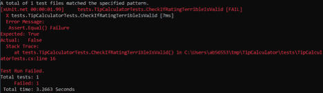

当然，上述琐碎的测试将会失败，因为我们已经硬编码了这些值。但是在我们继续之前，确保我们看到我们的测试失败总是一个好的实践。如果没有测试失败，我们最终会认为一切都如预期的那样工作，那么没有观察到测试失败可能会给我们错误的安全感。

关于上述测试的更多观察:

*   如果测试名称是描述性的，会有所帮助。我选择了`CheckIfRatingTerribleIsValid`来传达这样一个事实:我们必须确保我们的应用程序能够识别我们的命令。
*   如果预期的和实际的变量名是描述性的，也会有所帮助。我选择了`expectedResponseForValidRating`和`actualResponseForValidRating`作为我们在这个测试中的期望的指示，以及`Tip Calculator`将产生什么样的实际值。
*   测试是一流的源代码，必须像对待生产代码一样小心对待。

## 首次设计决策

在这一点上，我们被迫做出决定——我们新生的`Tip Calculator`如何知道用户提供的服务评级是否有效？

想到的设计决策是`Tip Calculator`必须能够存储和检索一些数据。在这种情况下，我们感兴趣的数据是服务等级。

如果我们回到用户案例，回顾五个验收标准，我们会看到期望是`Tip Calculator`必须能够识别五个不同的服务等级:

1.  可怕的
2.  贫穷的；贫困的
3.  好的
4.  伟大的
5.  优秀的

所以让`Tip Calculator`存储这些信息的最简单的方法就是赋予它一个数组，或者一个列表。

但是，我们不应该匆忙地执行这个列表，我们应该再次检查期望，看看我们是否还遗漏了什么。此外，不仅`Tip Calculator`必须能够识别有效的服务评级，还必须能够将每个评级与一个百分比值相关联。

我们的分析显示了以下关联:

1.  可怕=> 0%
2.  差=> 5%
3.  良好=> 10%
4.  很好=> 15%
5.  优秀=> 20%

在这种情况下，一个简单的数组或一个简单的列表不足以保存上述关联。下一个允许我们实现这些关联的最简单的数据结构是什么？在做了一点研究后，我们发现`Hashtable`可能是最合适的数据结构，可以用最少的仪式满足我们的需求。

我们现在导航到`app`目录并将自动生成的`Class1.cs`文件重命名为`TipCalculator.cs`。我们现在想添加一个`Hashtable`保存服务等级和相关的百分比值:

```
System.Collections.Hashtable ratingPercentages = new System.Collections.Hashtable();
```

现在是一个很好的时机来回忆一下，TDD 关注于将期望耦合到应用程序的行为，而不是应用程序的结构。知道了这一点，我们需要修改我们的测试，让`Tip Calculator`展示一些行为。测试对应用程序必须如何运行的一些期望进行了编码，运行的应用程序提供了预期行为的证据。

但是应用程序行为的证据是什么呢？除了通过检查运行中的应用程序产生的值，我们没有其他方法来评估应用程序的行为。

在这种情况下，在我们询问应用程序某个值(即服务等级)是否有效之后，我们期望运行的应用程序产生值`true`或`false`(布尔值)。

为了教会应用程序如何以预期的方式运行，我们需要赋予它一个 API。在这种情况下，我们按如下方式设计 API:

```
public bool CheckIfRatingIsValid(string rating)
```

在我们的测试中，我们将修改实际的期望值来运行应用程序并收集输出值:

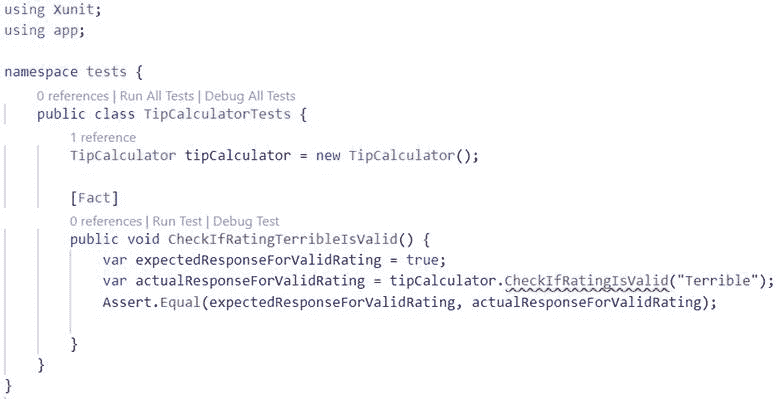

从上面的截图可以看出，我们已经实例化了`TipCalculator`，但是当试图要求实例检查所提供的评级(“糟糕”)是否有效时，编辑器抱怨说它找不到该方法。

当然，这个方法还没有实现。现在是时候开始行动了:

```
public bool CheckIfRatingIsValid(string rating) {	
  return false;
}
```

既然方法已经实现，测试就可以工作了；以下是完整的列表:

```
using Xunit;
using app;

namespace tests {	
  public class TipCalculatorTests {		
    TipCalculator tipCalculator = new TipCalculator();		

    [Fact]		
    public void CheckIfRatingTerribleIsValid(){			
      var expectedResponseForValidRating = true;			
      var actualResponseForValidRating = 
      tipCalculator.CheckIfRatingIsValid("Terrible");			      
      Assert.Equal(expectedResponseForValidRating, 
      actualResponseForValidRating);		
    }	
  }
}
```

从上面的例子中我们看到我们又在作弊了(我们硬编码了 return false 在我们新发明的方法中)。拐弯抹角，仅仅创建框架和脚手架，而不是卷起袖子进行实际的编码，这有什么意义呢？让我们来讨论这个重要的话题。

### 讨论我们的第一个设计决策

我们在这里演示如何一步一步地进行 TDD。有趣的是，这个一步一步的图解实际上就是我们如何进行 TDD 的确切方式:一步一步。除了按部就班地做，没有其他方法可以做 TDD。一步一步来。

这与其他软件开发方式有何不同？即使不遵循 TDD 方法论，我们不也是一步一步地做每件事吗？不完全是。让我解释一下:

TDD 对我来说就像骑着一匹飞奔的马。我们正在快速地向我们的目标前进，但是我们频繁地接触地面(奔马时不时地撞击地面，以便弹开并跑得快)。

相比之下，当我在没有 TDD 的情况下进行软件开发时，我感觉就像在放风筝。我带着风筝快速移动，但是我从来没有接触过地面，一次也没有。当我让风筝着陆的时候，着陆的地方可能不是我想要风筝去的地方(如果风筝在强风中飞行，很难控制它的方向)。

使用 TDD，任何时候我们对代码(测试代码和运输应用程序代码)进行更改，我们运行测试，因此我们接触地面。我们在驰骋，但同时也需要这种频繁的接地气。我们需要看看我们是否走在正确的方向上，以及我们是否在飞奔中打破了什么东西。我们的测试是先知，他不断告诉我们是否一切都如预期的那样工作，或者是否有些事情开始不正常。

修改代码是一件有风险的事情。TDD 提供了一个很好的工具，它既能指导我们的设计决策，又能确保我们不会弄糟一些我们已经确认符合我们期望的东西。

## 用实际处理逻辑替换硬编码值

现在让我们用实际运行的代码替换硬编码的值。我们首先告诉我们的`Tip Calculator`,有一个服务等级叫做“糟糕”,与这个等级相关的小费百分比是 0:

```
public bool CheckIfRatingIsValid(string rating) {	  
  ratingPercentages.Add("Terrible", 0);	
  return false;
}
```

我们的`Tip Calculator`现在知道了这样一个事实:有一个服务等级被标为“糟糕”,与糟糕服务相关的小费比例是 0%。很好，但是我们仍然返回硬编码的值`false`。用实际计算替换它的时间:

```
public bool CheckIfRatingIsValid(string rating) {	
  ratingPercentages.Add("Terrible", 0);	
  return ratingPercentages.ContainsKey(rating);
}
```

再次运行测试:

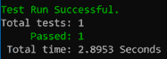

很好，但是代码看起来还是不自然。我们将“可怕的”值加载到`Hashtable ratingPercentages`的实例中，然后立即检查该值是否存在于`Hashtable`中。既然我们已经从失败的测试(红色)转移到通过的测试(绿色)，是时候执行 TDD 循环中的第三步了——重构。

重构基本上是在不影响代码行为的情况下修改代码结构的活动。我们在这里的任务很简单:将负责填充`Hashtable ratingPercentages`的代码提取到一个单独的代码块中。

这种加载最自然的地方是在初始化`Tip Calculator`—`constructor`方法的代码块中。重构后，我们的运输应用程序源代码如下所示:

```
using System.Collections;

namespace app {	
  public class TipCalculator {		
    private Hashtable ratingPercentages = new Hashtable();		
    public TipCalculator() {			
      ratingPercentages.Add("Terrible", 0);		
    }		

    public bool CheckIfRatingIsValid(string rating) {			
      return ratingPercentages.ContainsKey(rating);		
    }	
  }
}
```

再次运行测试，它通过了(我们用绿色表示)。我们修改了代码的结构，但没有修改它的行为！干得好。

## 抛硬币

每当我们满足一个积极的期望时，谨慎的做法是把事情颠倒过来，描述消极的期望。

在这一点上，由于我们已经满足于在`Tip Calculator`中找到合法的服务等级值，我们想要确保在`Tip Calculator`中没有找到不合法的值。

我们所说的非法值是什么意思？除了“可怕”、“差”、“好”、“伟大”、“优秀”之外的任何值。写新期望(即测试)的时间:

```
[Fact]
public void CheckIfRatingWhateverIsValid() {	
  var expectedResponseForValidRating = true;	
  var actualResponseForValidRating = 			           
  tipCalculator.CheckIfRatingIsValid("Whatever");
  Assert.Equal(expectedResponseForValidRating, 
  actualResponseForValidRating);
}
```

运行测试:

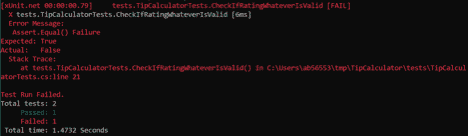

失败了。不出所料。(我们规定，当提供“无论如何”的服务等级时，我们的期望应该是`true`。实际上，它是`false`，因为我们的`Tip Calculator`不包含值“无论如何”。)

修正测试(将`expectedResponseForValidRating`从`true`改为`false`)并再次运行:

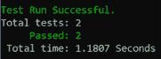

一瞬间的反思:为什么我们伪造了第一次试运行并使其失败？因为我们总是想确保我们观察到我们的新测试失败。这样，我们就知道将来任何成功通过测试的情况都不仅仅是假阳性。

## 赞美稳定状态

软件工程是稳定状态和不稳定状态之间的平衡行为。我们所说的稳态是什么意思？

如果我们有一个系统(一个正在运行的应用程序),它按照我们期望的方式运行(例如，它产生我们指定为期望值的值),我们声明这个系统处于稳定状态。它正在运行，并交付一些价值。

这种价值传递仍然是部分的。在我们的例子中，这个`Tip Calculator` 向用户提供的唯一价值是它能够将“糟糕”的服务评级识别为合法评级。此外，它能够通知我们服务等级“无论如何”不是合法的等级。

这不算多，但总比没有强。好消息是——我们正在运行的应用程序目前处于稳定状态。现在我们想看看如何给我们的`Tip Calculator`添加更多有价值的行为。增加更多价值的唯一方法是做出一些改变。

任何时候我们对应用程序进行更改，都会扰乱它的稳定状态。这种干扰是有风险的。这可能意味着我们的改变会破坏已经在工作的东西。出于这种关切，我们努力尽可能缩短这种不稳定状态的持续时间。

还记得我们如何把 TDD 比作骑着飞奔的马吗？当马在飞行中(即不接触地面)时，它是朝着我们的目标前进，但它不是处于稳定状态。只有马着地了，它的状态才稳定下来。

TDD 鼓励(在飞行中)进行小的改变，并通过验证系统是否回到稳定状态来立即将系统接地。我们重视稳定的状态，尽管我们热切地拥抱变化。没有改变，我们将无法交付价值，但我们必须以一种非常审慎、小心的方式来完成。

在进行 TDD 时，我们对待稳态的变化就像在蛋壳上行走一样。不管我们有多确信知道我们在做什么和如何做软件工程，仍然让失败的测试来指导我们的决定是谨慎的。

## 检查正确的小费百分比是否与服务等级相关联

现在让我们在应用程序中引入另一个变化——验证正确的小费比例是否与服务评级“糟糕”相关联的测试。请记住，我们用以下值填充了`Hashtable ratingPercentages`的实例:

```
ratingPercentages.Add("Terrible", 0);
```

我们已经编写了一个测试来验证我们的`Hashtable ratingPercentages`确实包含合法的服务评级“糟糕”。现在我们需要一个测试来验证服务等级“糟糕”意味着该等级的小费百分比为 0。

```
[Fact]
public void CheckIfRatingTerribleHasZeroPercentTip() {	
  var expectedZeroPercentForTerribleRating = 0;	
  var actualZeroPercentForTerribleRating = 10;	
  Assert.Equal(expectedZeroPercentForTerribleRating, 
  actualZeroPercentForTerribleRating);
}
```

新的测试`CheckIfRatingTerribleHasZeroPercentTip`应该会失败:

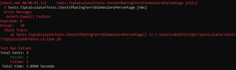

同样，我们故意硬编码错误的实际值，以便我们可以观察到我们全新的测试失败。现在我们必须用对`Tip Calculator`方法的实际调用替换硬编码值，该方法返回服务等级的小费百分比:

```
[Fact]
public void CheckIfRatingTerribleHasZeroPercentTip() {	
  var expectedZeroPercentForTerribleRating = 0;	
  var actualZeroPercentForTerribleRating = 			    
  tipCalculator.GetPercentageTipForRating("Terrible");
  Assert.Equal(expectedZeroPercentForTerribleRating, 
  actualZeroPercentForTerribleRating);
}
```

和前面的例子一样，我们为`Tip Calculator`发明了一个新的 API。我们称这种新能力为`GetPercentageTipForRating("Terrible")`。它获取服务等级的值，并返回该等级的小费百分比。

翻到`app/TipCalculator.cs`，添加新方法的硬编码框架:

```
public int GetPercentageTipForRating(string rating) {	
  return 10;
}
```

运行测试再次失败，因为我们对返回值进行了硬编码。让我们用实际处理来代替它:

```
public int GetPercentageTipForRating(string rating) {	
  int tipPercentage = Int32.Parse(ratingPercentages[rating].ToString());
  return tipPercentage;
}
```

再次运行测试:

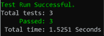

所有三个测试都通过了–我们处于绿色，我们回到了稳定状态！

## 对于非法服务评级，我们期望的小费比例是多少？

多年的实地经验告诉我要有点悲观。现在我们已经让我们的应用程序回到稳定状态并交付价值(回答关于合法服务评级的问题，并给出“糟糕”评级的正确小费百分比)，我们需要看看当我们通过给它不合法的服务评级值(例如，给它服务评级“无论如何”)来运行我们的应用程序时会发生什么。

是时候再次离开稳定状态了。我们将编写另一个测试:

```
[Fact]
public void CheckIfRatingWhateverHasNegativeOnePercentTip() {	
  var expectedZeroPercentForWhateverRating = -1;	
  var actualZeroPercentForWhateverRating = 	  
  tipCalculator.GetPercentageTipForRating("Whatever");
  Assert.Equal(expectedZeroPercentForWhateverRating, 
  actualZeroPercentForWhateverRating);
}
```

当`Tip Calculator`被要求返回服务等级“无论如何”的小费百分比时，我们正在描述我们的期望。因为服务等级“Whatever”是一个非法等级，我们期望`Tip Calculator`返回小费百分比值-1。

这项测试现在促成了我们的运输法规的一项改进。我们需要添加一些逻辑来首先检查所提供的服务等级是否合法。只有在合法的情况下，我们才会要求`Hashtable ratingPercentages`告诉我们小费百分比的相关值是多少。如果提供的服务等级是非法的(例如，如果它是“Whatever”)，我们绕过与`Hashtable ratingPercentages`的对话，简单地返回-1。

```
public int GetPercentageTipForRating(string rating) {	
  int tipPercentage = -1;	
  if(CheckIfRatingIsValid(rating)) {		
    tipPercentage = Int32.Parse(ratingPercentages[rating].ToString());	
  }	
  return tipPercentage;
}
```

运行测试，4 项测试全部通过:

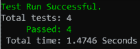

我们回到了稳定状态。又一次进入动荡地区的短途旅行，又一次迅速的胜利和安全地回到稳定的、平静的状态。

## 填充其他服务评级小费百分比

现在是休息一下的好时机，遵循已经建立的模式，做出风险较小的改变。离开稳定状态的安全性，通过添加新的测试来验证服务评级“差”是否是有效的、合法的评级，从而进入不稳定的领域:

```
[Fact]
public void CheckIfRatingPoorIsValid() {	
  var expectedResponseForValidRating = true;	
  var actualResponseForValidRating = 	  
  tipCalculator.CheckIfRatingIsValid("Poor");
  Assert.Equal(expectedResponseForValidRating, 
  actualResponseForValidRating);
}
```

运行此测试将失败:

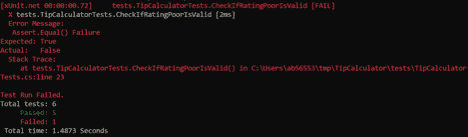

服务等级“差”尚未实施。要使测试通过，通过将此行添加到`TipCalculator`构造函数来实现服务等级“差”:

```
ratingPercentages.Add("Poor", 5);
```

运行测试，我们就安全了:

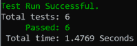

我们正处于稳定状态，成功通过了 6 项测试。

既然我们已经添加了与 5%小费相关的服务评级“差”,让我们编写一个测试来描述这种期望:

```
[Fact]
public void CheckIfRatingPoorHasFivePercentTip() {	
  var expectedZeroPercentForPoorRating = 5;	
  var actualZeroPercentForPoorRating = 	  
  tipCalculator.GetPercentageTipForRating("Poor");
  Assert.Equal(expectedZeroPercentForPoorRating, 
  actualZeroPercentForPoorRating);
}
```

测试成功运行，我们回到了稳定状态下的安全状态。
我将让读者做出改变，从而推动“良好”、“卓越”和“优秀”服务评级的实施。在练习结束时，您应该让系统回到稳定状态，并成功通过 12 项测试:

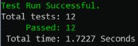

## 给定总额和服务等级，计算总计

我们现在准备好了最后一步——给定总账单和服务等级，我们期望`Tip Calculator`计算小费百分比并将其加到总数中，得出支付给餐馆的总数。

像我们通常做的那样，首先我们描述期望:

```
[Fact]
public void CalculateTotalWithTip() {	
  var expectedTotalWithTip = 135.7;	
  var actualTotalWithTip = 200.0;	
  Assert.Equal(expectedTotalWithTip, actualTotalWithTip);
}
```

像往常一样，我们首先硬编码一些我们知道会失败的期望。这使得我们观察到我们的新测试失败了:

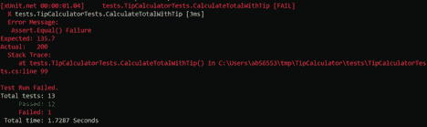

实现处理逻辑的时间，该逻辑将使用 tip 计算正确的总数。鉴于总额为 118.0 美元，服务等级为“优秀”(15%的小费)，我们预计总额为 135.7 美元:

```
[Fact]
public void CalculateTotalWithTip() {	
  var rating = "Great";	
  var total = 118;	
  var expectedTotalWithTip = 135.7;	
  var actualTotalWithTip = tipCalculator.CalculateTotalWithTip(total, 
  rating);	
  Assert.Equal(expectedTotalWithTip, actualTotalWithTip);
}
```

我们设计了一个新的 API`Tip Calculator`——一个叫做`CalculateTotalWithTip(total, rating)`的方法。它获取总值和服务等级，并返回带有小费的总值。该方法的实现如下所示:

```
public double CalculateTotalWithTip(double total, string rating) {	
  double totalWithTip = -1;	
  if(CheckIfRatingIsValid(rating)) {		
    int percentage = GetPercentageTipForRating(rating);		
    totalWithTip = total + ((total/100) * percentage);	
  }	
  return totalWithTip;
}
```

运行测试，我们回到稳定状态:

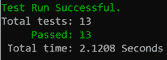

## 我们说完了吗？

不，还没有。即使所有的测试都是绿色的，我们回到了稳定状态，我们仍然需要做一些事情。

首先，我们需要为基于服务等级的小费总额的`Tip Calculator`计算添加一个悲观预期:

```
[Fact]
public void CalculateTotalWithTipForNonlegitimateRating() {	
  var rating = "Meh";	
  var total = 118;	
  var expectedTotalWithTip = 135.7;	
  var actualTotalWithTip = tipCalculator.CalculateTotalWithTip(total, 
  rating);	
  Assert.Equal(expectedTotalWithTip, actualTotalWithTip);
}
```

运行测试会产生一个失败的测试:

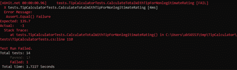

我们对非法服务评级(“Meh”)的预期是不正确的。实际总数是-1，所以我们需要用-1 代替 135.7 来调整我们的期望值。再次运行测试，我们回到稳定状态！

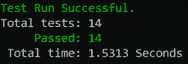

我们现在有 14 个测试，它们都成功通过，我们的*小费计算器*按照我们的期望工作，并满足验收标准。

我们快完成了。在我们自信地发布我们闪亮的新`Tip Calculator`之前，还要进行一次健全性检查——我们必须运行 *[突变测试](https://opensource.com/article/19/9/mutation-testing-example-definition)* 。

我们的突变测试框架将对运输代码进行突变，一次一行，并对每个单独的突变运行所有测试。

如果测试抱怨变异的代码，一切都是好的，我们已经杀死了突变体。如果测试没有问题，我们就有麻烦了。我们的代码库中有一个幸存的突变体，这意味着我们的回购中有一些代码行正在做一些我们没有提供任何预期的事情。

让我们进行突变测试，看看我们的解决方案有多可靠。好消息——我们的解决方案已经杀死了 100%的变种人！

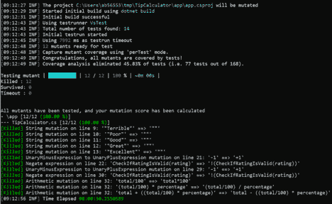

突变测试已经给了我们的运输应用一份健康的清单。我们的`Tip Calculator`看起来状态不错。

## 红绿重构反射

让我们回顾一下我们的`Tip Calculator`建筑练习。我们通过使用经典的用户故事格式描述我们的期望来开始这个过程。用户故事(顾名思义)专注于描述实现最终用户目标的场景。

在这种情况下，简单的目标是根据提供的服务等级和餐馆账单总额计算小费金额。然后，计算出的小费金额会自动添加到总数中。

从那里，我们通过遵循 TDD 方法继续构建我们的航运应用程序。正如我们所展示的，该方法包括编写一个失败的测试，观察它失败(TDD 的红色阶段)，然后立即进行代码更改以确保测试通过(TDD 的绿色阶段)。一旦测试通过，我们就进入重构阶段(我们在不影响代码行为的情况下重构代码)。这样，我们可以确保我们的代码不会因为改变而变得昂贵。

一个适当的 TDD 实践也要求频繁的回顾——我们称之为反思。我们停下来，思考我们迄今为止已经完成的事情，看看我们是否可以从最近的经历中学习。这种反思强化了这个过程，因为它依赖于失败的、随后成功的测试所提供的频繁而紧密的反馈。

我已经将测试驱动的开发比作骑马飞奔的体验。骑马时，我们在空中飞行(即马从地面跃起时达到的速度)和驾驭马之间交替进行。当我们离开地面时，在空中是不可能驾驭这匹马的。在那一点上，我们获得了速度，但是我们不能改变方向。只有当马着地时，我们才能改变方向。

在 TDD 中，我们努力尽可能频繁地接触地面。我们不着地跳跃的时间越长，纠正航向的机会就越少。

我还将不遵循 TDD 原则的软件开发实践与放风筝的体验进行了比较。放风筝时，我们从不接触地面。让风卷起风筝，让它在空中弹跳，这是一种令人兴奋的感觉。那样我们可以达到相当快的速度。但是在这种情况下，我们努力保持想要的方向。当我们最终让风筝着陆后，它通常不会落在我们最初希望它着陆的地方。

为什么这篇文章强调的是“不要先写测试”？许多不熟悉 TDD 中实现的敏捷实践的软件工程师通常要么声称没有必要编写自动化测试，要么声称自动化测试应该在代码完成后编写。

一旦他们开始学习敏捷和 TDD，他们可能会重新考虑他们的实践，并决定在编写实现代码之前编写测试可能更有意义。然而，由于根深蒂固的瀑布思维，一些工程师犯了这样的错误:首先编写所有的测试，然后才开始编写代码。

这种方法是完全错误的。它相当于传统的瀑布方法，在这种方法中，我们通过遵循门控阶段来完成开发过程。

首先，我们编写需求(在这种情况下，需求是以自动化测试的形式编写的期望)。只有当所有的需求(即自动化测试)都被编写、签署和冻结后，我们才能进入下一个阶段——编写运输应用程序的代码。

TDD 与“先写测试”的方法正好相反。在 TDD 中，我们总是只编写一个测试。该测试描述了期望的行为。期望的行为还不存在(这就是为什么它是期望的)，并且测试失败。

然后，我们立即着手修改代码，试图创造出想要的行为。一旦期望的行为被创建，它就被测试验证，如果测试的期望被满足，我们就进入重构代码(以满足非功能性需求，比如变更的成本)。

我们实行严格的纪律，绝不屈服于一次编写多个测试的诱惑。这样，我们可以确保尽可能频繁地接触地面。

我们更喜欢在尽可能短的时间内保持“飞行”状态。在测试中描述的预期行为尚未实现的那段时间里，我们处于“飞行”状态。预期和期望的行为越小，我们的飞行轨迹就越短。这样，我们就能经常接触地面，这给了我们调整转向的机会。

## 结论

构建一个简单的`Tip Calculator`是一个玩具大小的问题，使用这个练习来说明 TDD 方法论并不一定提供一个支持 TDD 的令人信服的论据。尽管如此，在一篇技术文章的限制下，仔细阅读这个实践练习可能会对采用 TDD 的好处提供有价值的见解。

我们仍然认为 TDD 的真正好处只有在处理更大、更复杂的软件工程工作时才变得明显。在对一个庞大复杂的系统进行潜在风险的改变时，保持脚踏实地的能力通常是一个救命稻草。

除此之外，使用 TDD 方法构建软件会导致更少的返工。TDD 驱动高度模块化，这导致模块的高内聚性和模块之间的低耦合。

所有这些特征产生了一个航运应用程序，它的代码库很容易改变，而且成本不高。事实证明，降低变更成本是拥抱变更并放弃“范围蔓延”这一概念的最佳途径。

总而言之，TDD 使软件工程团队能够为业务提供高度的灵活性。