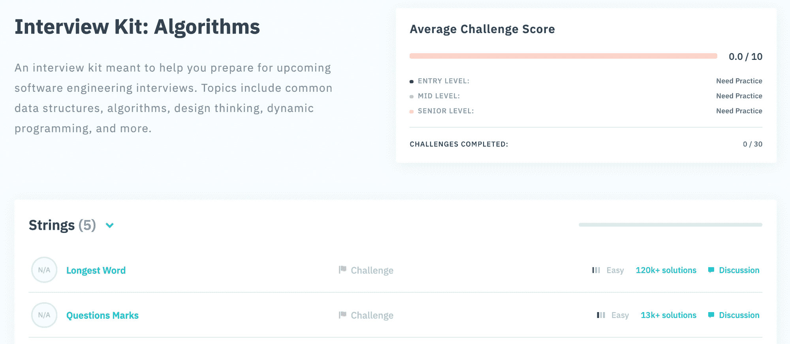
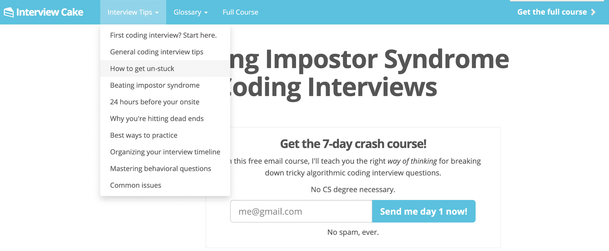
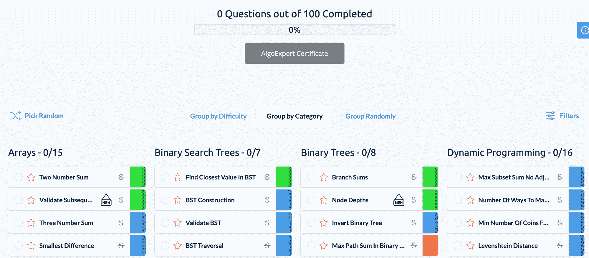
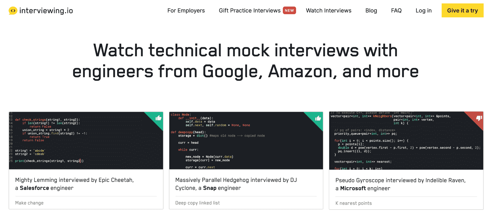
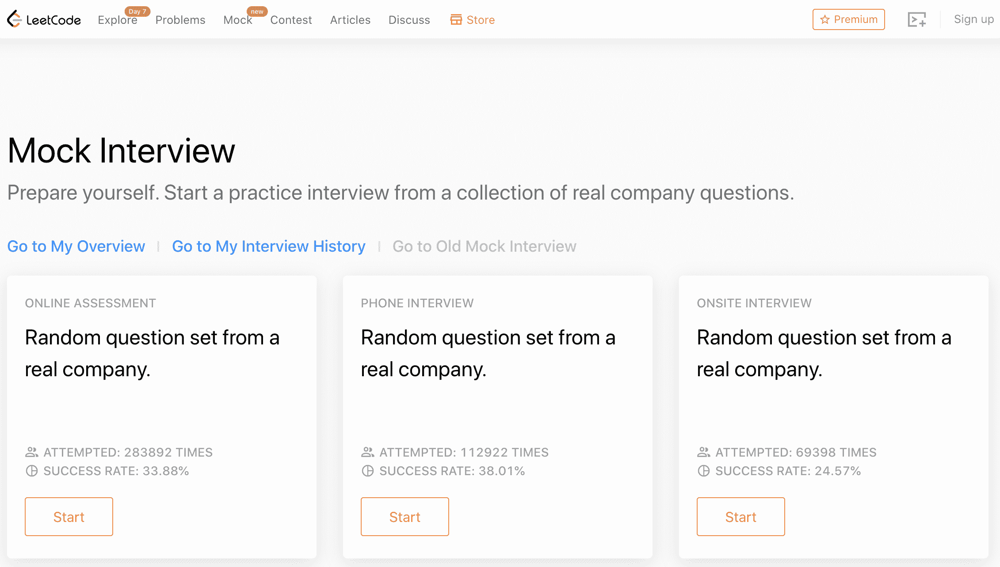
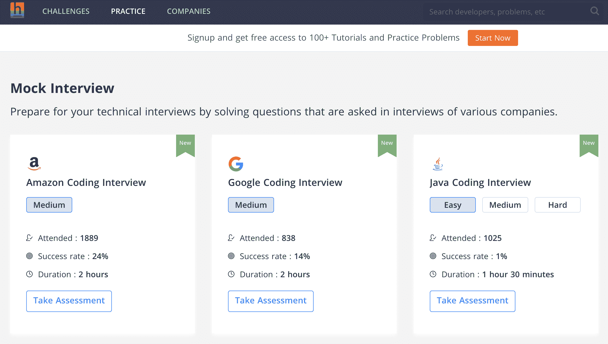
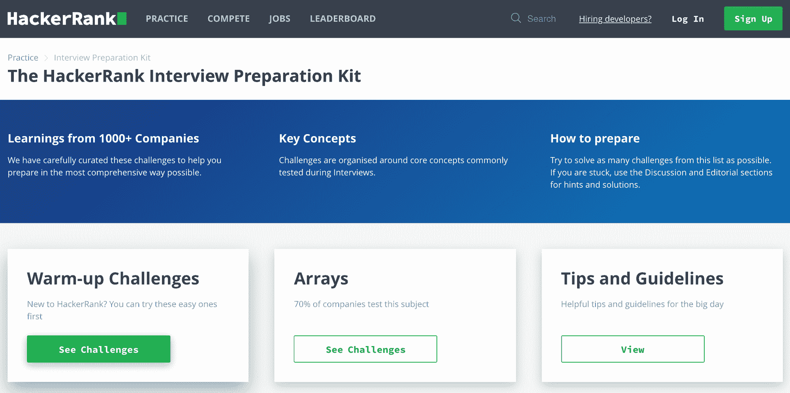

# 2020 年最佳代码面试准备平台

> 原文：<https://www.freecodecamp.org/news/the-best-code-interview-prep-platforms-in-2020/>

软件开发人员面试正在迅速发展。几年前，掌握数据结构和常用算法就足以在面试中胜出并获得一份工作。然而今天，雇主们希望应聘者拥有现实世界的经验和技能。

这也是为什么很多面试官根本不会问数据结构或者算法的问题。相反，他们将专注于全栈技术和协作技能的熟练程度。

求职者明智的做法是练习代码挑战，并进行模拟面试，以确保他们有所准备。书籍和资源不计其数，比如[破解编码面试](https://www.amazon.com/Cracking-Coding-Interview-Programming-Questions/dp/0984782850)，还有[热门在线代码挑战网站](https://www.freecodecamp.org/news/the-8-most-popular-coding-challenge-websites-of-2020/)。

除了这些资源之外，下面是开发人员候选人的最佳代码面试准备平台。

## Coderbyte

有用链接:[网站](https://coderbyte.com/) | [面试准备](https://coderbyte.com/#courses) | [博客](https://medium.com/coderbyte) | [定价](https://coderbyte.com/member)

我的网站 Coderbyte 是唯一一个提供全栈编码挑战、面试准备课程和模拟面试的网站。通过 500 多项挑战、文章和视频，涵盖算法、前端甚至数据库技术，您可以快速评估和完善任何角色的技能。我们还展示用户提交的和官方的所有挑战的解决方案。

## 面试蛋糕

有用链接:[网站](https://www.interviewcake.com/) | [面试准备](https://www.interviewcake.com/table-of-contents) | [博客](https://www.interviewcake.com/coding-interview-beginner-faq) | [定价](https://www.interviewcake.com/upgrade)

面试蛋糕经常被认为是面试文章、技巧和内容的最佳来源，是获得软件开发工作的速成班。

他们提供专门针对领先技术公司的课程，并提供解决编码问题以外的指导，例如即使在你不知道答案的情况下，如何有效地与面试官沟通的建议。

## 算法专家

有用链接:[网站](https://www.algoexpert.io/product) | [面试准备](https://www.algoexpert.io/questions) | [博客](https://www.algoexpert.io/blog) | [定价](https://www.algoexpert.io/purchase)

AlgoExpert 是原创编码挑战网站之一。该网站提供了大量的视频教程、认证和面试技巧。他们的面试准备包括选择 100 个挑战，涵盖所有类型的技术和角色。

## Interviewing.io

有用链接:[网站](https://interviewing.io/) | [面试准备](https://interviewing.io/recordings) | [博客](https://blog.interviewing.io/) | [定价](https://interviewing.io/faq/)

面试。io 采用了一种非常独特的方法对面试准备工作进行编码。与提供内容和练习编码挑战不同，interview . io 有一个真实视频面试库，你可以观看，你可以付费匿名参加一个工程招聘经理的模拟面试。

你可能仍然需要在另一个网站上练习编码，但是这是一个很好的投资来获得可操作的反馈。

## Leetcode

有用链接:[网站](https://leetcode.com/) | [面试准备](https://leetcode.com/interview/) | [博客](https://leetcode.com/articles/) | [定价](https://leetcode.com/subscribe/)

和 Coderbyte、AlgoExpert 一样，Leetcode 也是最初的编码挑战网站之一。他们为科技公司和职位提供许多面试准备课程，并显示不同开发人员群体的平均分数，这样你就可以轻松地进行基准测试。

## 黑客地球

有用链接:[网站](https://www.hackerearth.com/for-developers) | [面试准备](https://www.hackerearth.com/practice/interviews/) | [博客](https://www.hackerearth.com/blog/developers/) |定价:所有内容免费

HackerEarth 以其编程竞赛和黑客马拉松而闻名，最近推出了一个模拟面试的功能。

他们有一个庞大的国际开发商和公司社区，所以如果你也想联系潜在的雇主，这是一个很好的网站。

## HackerRank(黑客等级)

有用链接:[网站](https://www.hackerrank.com/dashboard) | [面试准备](https://www.hackerrank.com/interview/interview-preparation-kit) | [博客](https://blog.hackerrank.com/) |定价:所有内容免费

HackerRank 以其招聘工具而闻名，它还为开发人员提供代码挑战和面试准备。没有高级版本，所以你可以免费访问他们强大的挑战库。对于还不确定是否准备好投资高级面试准备的求职者来说，这是一个很好的起点。