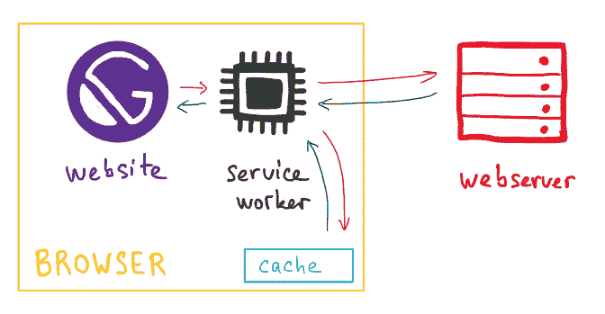
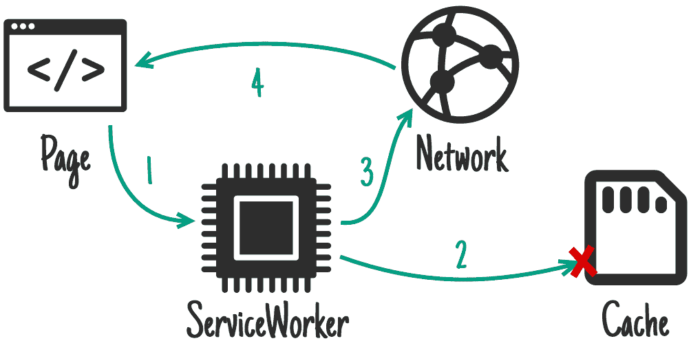
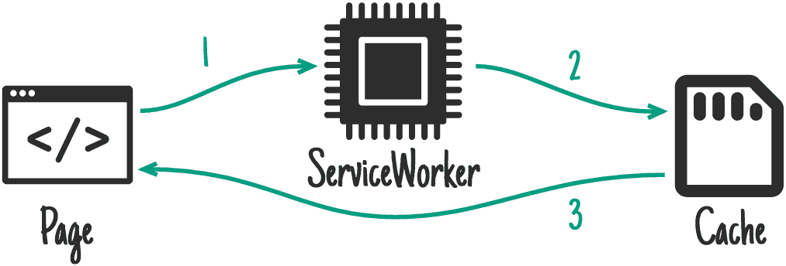
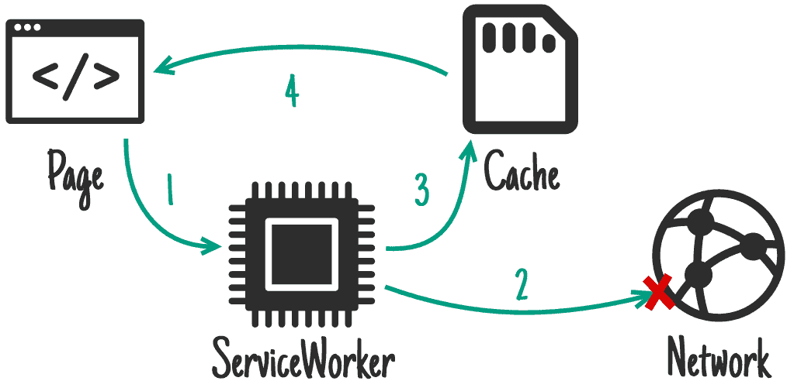
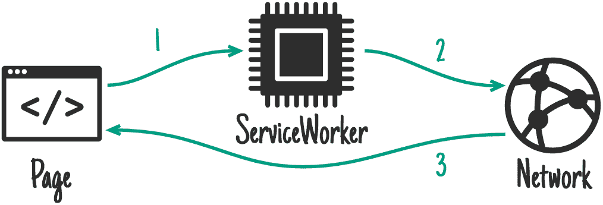
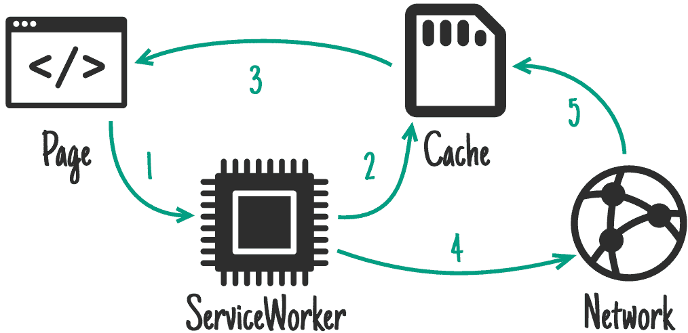

# 如何为您的 Gatsby 站点启用脱机模式

> 原文：<https://www.freecodecamp.org/news/how-to-enable-offline-mode-for-gatsby-site/>

我们创建 JAMstack 站点的原因之一是因为它们的出色性能。提供静态文件既简单又快捷。但是如果我们提升访问者的体验，让网站可以离线访问呢？

看看最近关于 2020 年 JAMstack 状况的报告(你可以看看 [Kontent 的报告](https://tracker.kontent.ai/942894/the-state-of-jamstack-report-2020)和 [Netlify 的报告](https://www.netlify.com/blog/2020/05/27/state-of-the-jamstack-survey-2020-first-results/))很明显，性能是我们建立静态网站的主要原因。

我认为这个事实有点欺骗。JAMstack 的设计带来了性能优势，所以这就像说小狗可爱一样。它们总是很可爱，因为它们是小狗。

但是，如果我们真的重视性能，即使是 JAMstack 网站也可以做得更好。但是在我们开始研究 Gatsby 的离线模式之前，我们必须了解 Gatsby 是如何处理页面的:


访问者不会向服务器请求每一个 HTML 文件。相反，Gatsby 的 JS 客户机向服务器请求相应页面的 *page-data.json* 。这就是访问者如何在不重新加载经典页面的情况下过渡到所请求的页面。但即便如此，我们也需要网络。

## 为什么网站甚至需要离线模式？

这年头，大家都在网上，对吧？手机上网似乎不再是一种选择，而是一种需求。我们一直在使用 Whatsapp、Messenger 等应用。

但是如果我们走进电梯呢？如果我们走向一辆停在地下车库的汽车，或者开车穿过隧道，会怎么样？如果我们在一架即将起飞的飞机里呢？

没有信号。这是所有这些地方共有的。在没有信号的情况下，人们只能用手机看下载的网飞电影。直到您为您的网站启用离线模式。

## 它是如何工作的？

简而言之，我们节省了访问者到服务器的往返行程，并提前下载了所有必要的数据。我们安装了一个 ServiceWorker，它充当服务器，而不是真正的远程服务器。

ServiceWorker 是访问者浏览器在后台运行的脚本，支持推送通知等功能。更多信息见[谷歌文档](https://developers.google.com/web/fundamentals/primers/service-workers)。



有了 Gatsby，就像我们都习惯的那样，就像安装一个插件一样简单:

```
npm i gatsby-offline-plugin --save 
```

并将其添加到`gatsby-config.js`:

```
plugins: [
    ...
    `gatsby-plugin-offline`,
    ...
] 
```

但是每个网站都使用许多不同类型的资产，所以通常情况下，我们需要采取一个额外的步骤来配置服务人员。

## 资产服务策略

每个网站都包含许多资产，从 CSS 文件、图像和图标到 web 字体和实际页面数据。

服务人员无法在第一次页面加载时真正下载所有这些资产，因为这会直接影响性能。如果访问者在决定访问你的图片库时就开始下载 100MB 的图片，他们也会不高兴。

我们可以使用正则表达式来定位特定的文件，并配置服务人员来适当地处理它们。让我们来看看可用的策略:

### CacheFirst

典型用途:网络字体，样式表

服务人员检查高速缓存中所请求的文件。如果文件丢失了，它会联机获取文件，同时将其存储在缓存中以备将来使用。



Image credit: [https://developers.google.com/web/tools/workbox/modules/workbox-strategies](https://developers.google.com/web/tools/workbox/modules/workbox-strategies)

### 仅缓存

可能的用途:您自己的预缓存逻辑

服务人员检查高速缓存中所请求的文件。如果文件丢失，它将返回一个错误。



Image credit: [https://developers.google.com/web/tools/workbox/modules/workbox-strategies](https://developers.google.com/web/tools/workbox/modules/workbox-strategies)

### 网络优先

典型用途:非关键 API 请求

服务人员在线获取所请求的文件。如果网络中断或服务器无响应，它会退回到缓存中。



Image credit: [https://developers.google.com/web/tools/workbox/modules/workbox-strategies](https://developers.google.com/web/tools/workbox/modules/workbox-strategies)

### 仅网络

典型用途:关键 API 请求

服务人员在线获取所请求的文件。如果网络中断或服务器没有响应，它将返回一个错误。



Image credit: [https://developers.google.com/web/tools/workbox/modules/workbox-strategies](https://developers.google.com/web/tools/workbox/modules/workbox-strategies)

### StaleWhileRevalidate

典型用途:前端资产、图像

服务工作者检查所请求文件的高速缓存并提供它。随后，它发出网络请求，以静默方式更新缓存。



Image credit: [https://developers.google.com/web/tools/workbox/modules/workbox-strategies](https://developers.google.com/web/tools/workbox/modules/workbox-strategies)

## 配置 Gatsby 站点

应该脱机工作的 Gatsby 站点的简单配置如下所示:

```
{
    resolve: `gatsby-plugin-offline`,
    options: {
        precachePages: [`/blog/*`],
    },
} 
```

通过这种方式，我将服务人员配置为预缓存所有博客文章，这些文章都是 URL 以`/blog/`开头的页面。

一旦访问者访问了带有博客文章链接的索引页面，他们将能够在没有活跃的互联网连接的情况下点击进入其中的任何一个。也就是说，如果在实现中使用了`Link`元素。标准锚点标签使浏览器绕过服务人员并从远程获取数据。

服务人员将根据默认配置处理所有资产:

*   **CacheFirst**
    JS 文件，CSS 文件，文件夹“static/”里面的一切
*   **network first**
    */page-data/*/page-data . JSON 文件
*   **stalewhirelvalidate**
    图片、网页字体文件等。

因此，如果您担心服务人员会获取所有博客文章的所有资产，那么只有在访问者实际打开博客文章页面之后，服务人员才会这样做。

原因是，缓存空间和访问者的互联网连接带宽是有限的。在第一次页面加载时，访问者下载所有站点范围内的资产，如样式表、web 字体、图标等，因此这些资产将在后续加载时在缓存中可用。一旦页面被请求，预缓存页面的图像和其他资源将被解析，这只能通过自定义逻辑来更改。

那么在什么情况下你想改变配置呢？实际上我能想到的案例并不多，但我确实偶然发现了一些:

*   从没有匹配文件名后缀
    的 URL 提供的资产。css 后缀，默认配置已经包含了它。但是，您可能会从没有适当后缀的 URL 提供图像或其他资源。
*   **获得对缓存的更多控制权**
    通过一些资产，您可以控制某个项目在过期之前可以在缓存中驻留多长时间。
*   **异国资产**
    好吧，异国可能是一个有点强烈的词:-)但 EOT 格式的网页字体，HEIC 格式的图片，短视频，歌曲等。

在这些情况下，您需要调整默认配置，并在插件选项中定义它:

```
{
  resolve: `gatsby-plugin-offline`,
  options: {
    precachePages: [`/blog/*`],
    runtimeCaching: [
      // previous definitions from the default config
      (...),
      {
        urlPattern: /^https:\/\/fonts\.gstatic\.com/,
        handler: 'cacheFirst',
        options: {
          cacheableResponse: {
            statuses: [0, 200]
          },
          cacheName: 'google-fonts-webfonts',
          expiration: {
            maxAgeSeconds: 60 * 60,
            maxEntries: 30
          }
        }
      },
    ]
  },
}, 
```

这个额外的配置项将确保从 gstatic.com 提供的最多 30 个 Google 字体将被缓存最长一个小时，并将使用 CacheFirst 策略进行处理。

### 在测试之前构建站点

完成配置后，请确保在测试离线功能之前构建和服务站点。它们不能在开发模式下工作。

```
gatsby build && gatsby serve 
```

## JAMstack =性能，但是...

在本文中，我向您展示了如何为 Gatsby 安装和配置离线插件。

所有 JAMstack 站点都通过设计带来了惊人性能的巨大好处。与其他 JAMstack 网站相比，通过增加离线功能，你可以让访问者的浏览体验更上一层楼。服务工作者配置允许您进一步微调每个资产的处理和缓存方式。

如果你感兴趣，你可以在 [Gatsby 文档](https://www.gatsbyjs.org/packages/gatsby-plugin-offline/)中找到更多关于这个插件的信息。