# 什么是 Storybook，我如何使用它在 React 中创建组件库？

> 原文：<https://www.freecodecamp.org/news/what-is-storybook-and-how-can-i-use-it-to-create-a-component-libary-in-react/>

像 React、Vue 和 Angular 这样的框架都帮助开发人员使用组件创建模块化系统，但这通常不包括从更高的角度来看待它们的好方法。

那么，我们如何使用故事书来建立图书馆和设计系统，在我们建立它们的时候自我记录呢？

*   什么是故事书？
*   我们要建造什么？
*   [第 0 步:启动应用](#step-0-bootstrapping-an-app)
*   [第一步:安装故事书](#step-1-installing-storybook)
*   [第二步:创建新按钮](#step-2-creating-a-new-button)
*   [步骤 3:使用我们新的按钮组件](#step-3-using-our-new-button-component)
*   [重复:创建新的标题组件](#repeat-creating-a-new-header-component)
*   [更多故事书特色](#more-storybook-features)

[https://www.youtube.com/embed/VApXDsYO5Gg?feature=oembed](https://www.youtube.com/embed/VApXDsYO5Gg?feature=oembed)

## 什么是故事书？

Storybook 是一个 JavaScript 工具，允许开发人员创建有组织的 UI 系统，使构建过程和文档更加有效和易于使用。

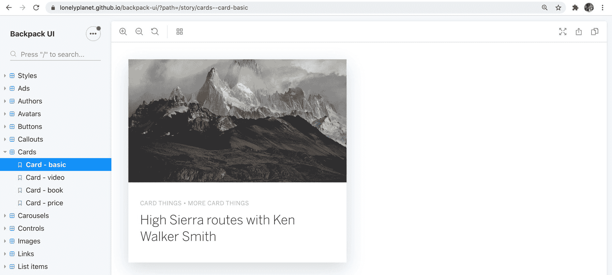

[Lonely Planet's Backpack UI]( https://lonelyplanet.github.io/backpack-ui/?path=/story/cards--card-basic)

一旦您构建了一个组件，Storybook 允许您创建一个“story”文件，然后您可以导入您的组件，并使用该组件在 iFramed 沙盒中创建各种用例示例。

这为构建新组件和处理现有组件提供了一个有组织、有重点的环境。

## 我们要建造什么？

我们将使用[创建 React 应用](https://reactjs.org/docs/create-a-new-react-app.html)来引导一个新的 [React JS](https://reactjs.org/) 应用。

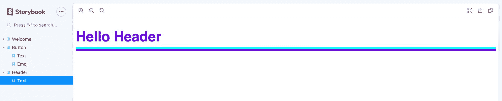

在该应用程序中，我们将安装 Storybook 并创建一些新组件，这些组件将帮助我们学习如何创建可以在故事中使用的新组件，然后在 React 应用程序中使用它。

## 步骤 0:引导应用程序

首先，我们将从 [Create React App](https://reactjs.org/docs/create-a-new-react-app.html) 开始。这将帮助我们专注于提高故事书的效率，而不是将它集成到当前的应用程序中。

也就是说，如果你已经在使用 Create React App 创建了一个没有被弹出的应用程序，你应该仍然能够继续第 1 部分和之后的工作。

让我们从导航到我们想要创建新应用程序的位置开始，并运行 Create React App 命令:

```
npx create-react-app my-storybook 
```

*注意:请随意用您选择的目录名替换`my-storybook`。*

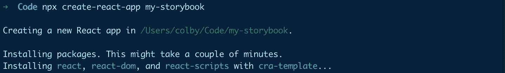

Bootstrapping with Create React App

运行完成后，您可以导航到目录:

```
cd my-storybook 
```

我们准备好出发了！

## 步骤 1:安装故事书

幸运的是，Storybook 使 React 的标准安装变得非常容易。特别是使用 Create React App，Storybook 会自动检测到我们正在使用一个通过 CRA 创建的应用，并为我们安装依赖项和支架。

### 初始化故事书

要开始安装 Storybook，请运行:

```
npx -p @storybook/cli sb init 
```

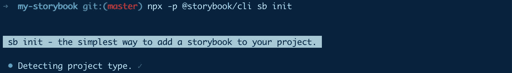

Initializing Storybook in a React app

如果你没有使用 Create React 应用程序或者它不起作用，你可以在他们的文档中查看他们的[可用指南。](https://storybook.js.org/docs/guides/guide-react/)

完成之后，我们所有的故事书依赖项都应该安装好了。

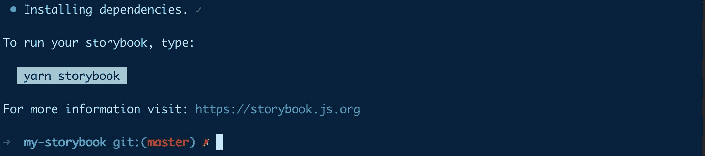

Finished installing Storybook

### 启动故事书

所以现在我们准备好行动了！最后，运行:

```
yarn storybook
# or
npm run storybook 
```

一旦一切完成加载，Storybook 将在您的浏览器中打开一个新的选项卡，您现在应该会在新的 Storybook 仪表板中看到一条欢迎消息！

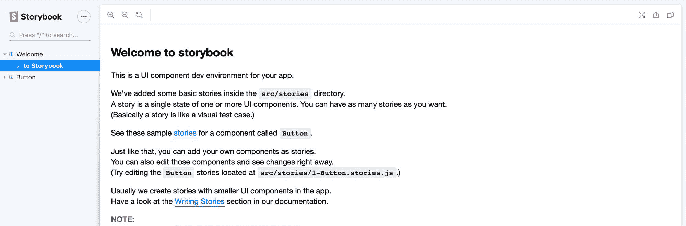

Storybook welcome page

[跟随提交！](https://github.com/colbyfayock/my-storybook/commit/3e994096384e31cb540150c9f14f41758ef3a746)

## 步骤 2:创建新按钮

如果您花点时间浏览一下仪表盘，您可能会注意到它预装了一个按钮，可以作为演示使用。

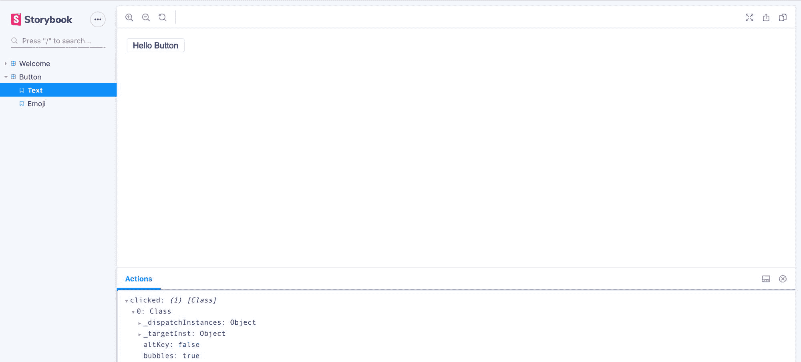

Storybook demo button

您还应该注意到，如果您单击该按钮，您实际上会在底部的 Actions 选项卡中看到一个操作。这显示了从按钮点击中捕获的事件。

这很简单，但这对于很好地了解故事书中的内容很有帮助。唯一的问题是，这纯粹是为了演示的目的，所以让我们构建自己的按钮来替换它。

### 创建新的按钮组件

首先，让我们创建几个目录:

*   在`src`下，创建一个名为`components`的新文件夹
*   在`components`下，创建一个名为`Button`的新文件夹

一旦你创建了这些文件夹，在你的`src/components/Button`文件夹和 add:

```
// Inside src/components/Button/index.js

export { default } from './Button'; 
```

这将导入我们创建的下一个名为`Button.js`的文件，这将允许我们更容易地用`src/components/Button`而不是`/src/components/Button/Button`导入我们的文件。

接下来，让我们在我们的`index.js`文件旁边创建`Button.js`，其内容如下:

```
// Inside src/components/Button/Button.js

import React from 'react';

const Button = ({ children, ...rest }) => {
  return (
    <button className="button" {...rest}>
      { children }
    </button>
  )
}

export default Button; 
```

在这里，我们创建了一个名为 Button 的新组件，它将一个类`button`添加到元素中，并通过`children`传递。我们是一个额外的[析构](https://developer.mozilla.org/en-US/docs/Web/JavaScript/Reference/Operators/Destructuring_assignment)剩余的道具到`rest`变量和[传播](https://developer.mozilla.org/en-US/docs/Web/JavaScript/Reference/Operators/Spread_syntax)那个值到`<button>`元素。

如果您已经完成了，您的文件现在应该是这样的:

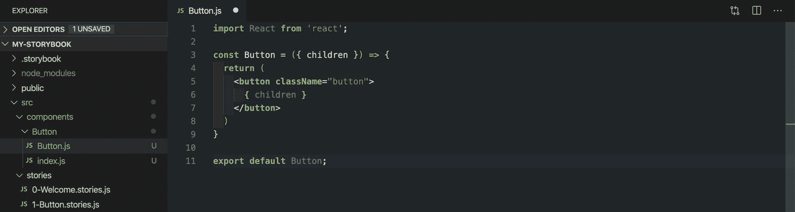

Button component in React

### 使用我们新的按钮组件

现在我们有了按钮组件，让我们使用它吧！

打开文件`src/stories/1-Button.stories.js`,将导入`Button`的行替换为:

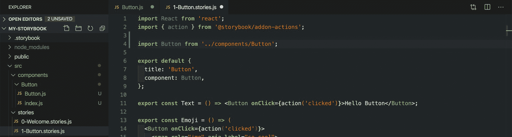

Updating the Button Storybook story

点击“保存”后，您可以使用 Storybook 仪表板打开备份浏览器选项卡，现在您可以看到一个看起来非常相似的按钮，但它使用浏览器的默认样式作为`<button>`元素。您甚至会注意到，如果您单击它，该事件仍然会记录在 Actions 选项卡下。

### 设计按钮组件的样式

最后，我们可能不想使用浏览器的默认样式，所以让它看起来更好。

在我们的`src/components/Button`目录中，添加一个新文件`Button.css`，并添加以下内容:

```
/* Inside src/components/Button/Button.css */

.button {
  color: white;
  font-weight: bold;
  background-color: blueviolet;
  border: none;
  padding: .8em 1em;
  border-radius: .2rem;
} 
```

这为我们的`.button`类应用了一些样式，比如添加背景颜色和将字体颜色改为白色。

但是如果你打开故事书，你会发现它什么也没做。为了使用它，我们需要将它导入到我们的组件中。

在`src/components/Button/Button.js`内，在 React 导入下的顶部添加以下内容:

```
import './Button.css'; 
```

一旦你保存并打开你的浏览器，你现在应该看到我们的新按钮和我们更新的样式！

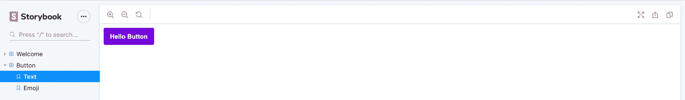

New Button in Storybook

[跟随提交！](https://github.com/colbyfayock/my-storybook/commit/e71e0e9e666adee0455b0b69118053c2f551ab68)

## 步骤 3:使用我们新的按钮组件

我们组件的最终目的是使用它，对吗？所以让我们把它添加到我们的应用程序中。

### 切换到 React 应用程序

首先，我们需要在一个新的终端选项卡中启动 React 应用程序，或者终止 Storybook 进程并在那里启动 React 进程。要使用 Create React app 启动 React App，请运行:

```
yarn start
# or
npm run start 
```

加载完成后，我们应该会有我们的标准 Create React 应用程序，如果你跟我一起做的话:


New Create React App

### 导入和使用新按钮

接下来，在`src/App.js`中，让我们导入页面顶部的新按钮:

```
import Button from './components/Button'; 
```

随着按钮的导入，我们可以使用它。在这里，我们可以简单地将它添加到页面中我们想要的任何地方。我将把“学习反应”链接替换为:

```
<p>
  <Button>Hello, Storybook!</Button>
</p> 
```

如果我们保存并重新加载页面，我们现在应该在页面上看到我们的按钮！

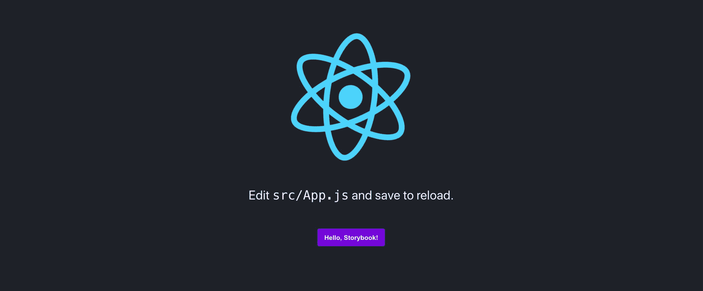

New Button in Create React App

[跟随提交](https://github.com/colbyfayock/my-storybook/commit/e6071aae5be281101d486c4cc7664bf6cacb4028)

## 重复:创建新的标题组件

Storybook 和 React(或任何受支持的框架)的伟大之处在于，这个过程可以扩展到您想要的任意多个组件。

所以让我们建立另一个组件！

### 创建我们的标题组件

类似于我们的按钮，让我们从创建为我们提供组件的一组目录和文件开始。

因为我们已经这样做了一次，所以我将提供代码，而不遍历正在发生的事情。

让我们从旋转备份我们的故事书服务器开始:

```
yarn storybook
# or 
npm run storybook 
```

在`src/components`目录中创建一个`Header`目录。

在`src/components/Header`中创建一个`index.js`文件，内容如下:

```
// In src/components/Header/index.js

export { default } from './Header'; 
```

在`src/components/Header`中创建一个`Header.js`文件，内容如下:

```
// In src/components/Header/Header.js

import React from 'react';
import './Header.css';

const Header = ({ children }) => {
  return (
    <h2 className="header">
      { children }
    </h2>
  )
}

export default Header; 
```

在`src/components/Header`中创建一个`Header.css`文件，内容如下:

```
/* In src/components/Header/Header.css */

.header {
  font-family: sans-serif;
  font-size: 2.5em;
  color: blueviolet;
  border-bottom: solid 5px aqua;
  padding-bottom: .2em;
  box-shadow: 0 5px 0 blueviolet;
} 
```

如果你注意到，如果你试着打开故事书，同样，什么也不会发生。这一次我们需要创建一个新的故事文件。

### 创建新的文章文件

在`src/stories`中，添加一个名为`2-Header.stories.js`的新文件:

```
// Inside src/stories/2-Header.stories.js

import React from 'react';

import Header from '../components/Header';

export default {
  title: 'Header',
  component: Header,
};

export const Text = () => <Header>Hello Header</Header>; 
```

这是我们故事文件的细目分类:

*   首先，我们导入我们的组件——这在我们想要使用它的任何时候都是非常标准的
*   我们导出的第一个东西是一个`default`对象。对于 Storybook，它期望默认导出是我们的故事的配置，所以这里我们为它提供一个标题，并传入我们用于这个故事的组件
*   我们导出的第二个也是最后一个东西是`Text`常量。使用 Storybook，任何非默认导出都将被视为一个变体，它将嵌套在您在默认导出中提供的标题下

如果您保存这个文件并在浏览器中打开您的故事书仪表板，您现在应该会看到新的标题！

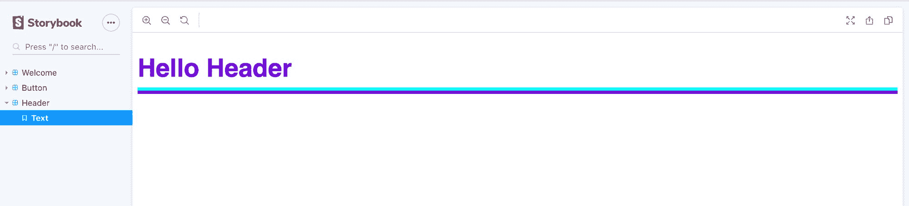

New Header component in Storybook

### 使用标题组件

使用我们的组件和使用我们的按钮组件是一样的，所以在`src/App.js`内部，让我们添加我们的头部。

启动 React 服务器后，首先导入我们的新头:

```
// In src/App.js

import Header from './components/Header'; 
```

然后将其添加到页面顶部:

```
// In src/App.js

<Header>My App</Header> 
```

如果你打开页面，我们会看到我们的新标题！

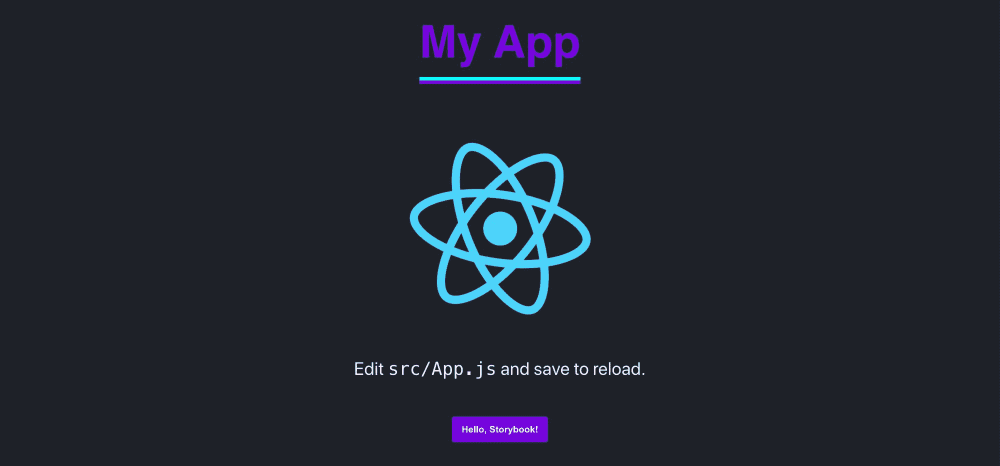

Create React App with new Header and Button components

[跟随提交！](https://github.com/colbyfayock/my-storybook/commit/e1c59eccaf5f4146a2fe039dca8874609d615194)

## 添加更多组件

正如您已经注意到的，在我们的第二个重复步骤中——添加一个新组件与我们想要添加的任何类型的组件几乎是相同的过程。一旦我们的库中有了它，我们就可以在一个集中的环境中开发它，然后将其导入到我们的应用程序中使用。

您现在可以使用它来管理您的组件库，并更好地维护您的项目的整个系统！

## 更多故事书功能

Storybook 不仅仅是添加组件，它还提供了配置[插件](https://storybook.js.org/addons/)的能力，这些插件增强了核心功能，带来了许多可能性。

以下是我最喜欢的一些...

### 故事来源

当构建一个组件系统时，希望人们能够容易地使用这些组件。但是，如果您没有文档，就必须有人打开文件或尝试找到另一个使用示例。

相反， [Story Source](https://github.com/storybookjs/storybook/tree/master/addons/storysource) 显示您创建的故事文件的代码源，允许浏览您的 Storybook 仪表板的人获得一个示例以及组件输出！

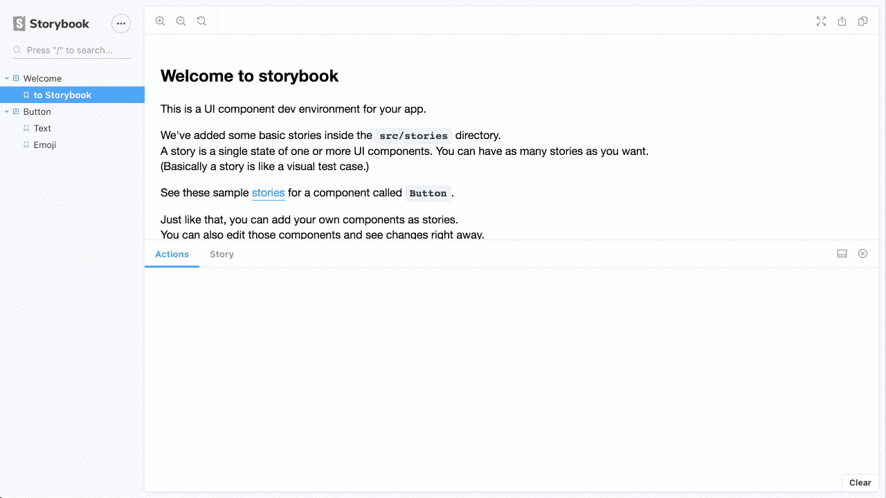

Storybook Story Source demo

### 故事镜头

如果你是自动化测试的爱好者，你可能听说过使用 [Jest](https://jestjs.io/) 或其他工具为你的应用程序添加快照测试。

[StoryShots](https://github.com/storybookjs/storybook/tree/master/addons/storyshots/storyshots-core) 是一种将 Jest 快照测试轻松添加到组件系统的方法。它根据您创建的故事创建快照，因此您可以确保您的组件在开发过程中不会发生根本性的改变(或破坏)。

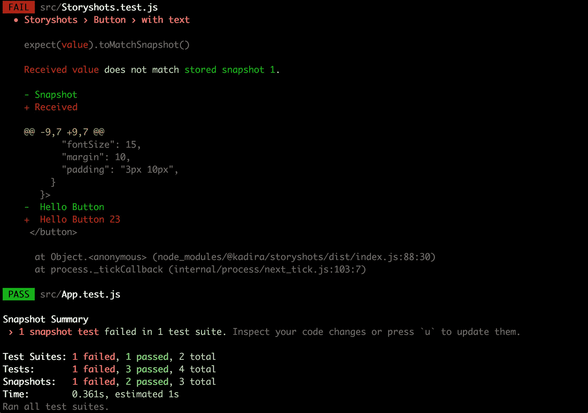

Snapshot example with StoryShots

## 你最喜欢故事书的哪一部分？

在 Twitter 上与我分享！

## 继续对话！

> 。@storybookjs 是一个为你的项目设计系统管理组件库的工具？
> 
> 在一个聚焦的 env 中创建和更新组件很有趣？‍?
> 
> 我走过故事书是什么，如何入门？[# web dev](https://twitter.com/hashtag/webdev?src=hash&ref_src=twsrc%5Etfw)[# 100 daysofcode](https://twitter.com/hashtag/100DaysOfCode?src=hash&ref_src=twsrc%5Etfw)[https://t.co/4TLFlmp4Df](https://t.co/4TLFlmp4Df)
> 
> — Colby Fayock (@colbyfayock) [June 9, 2020](https://twitter.com/colbyfayock/status/1270392710260719616?ref_src=twsrc%5Etfw)