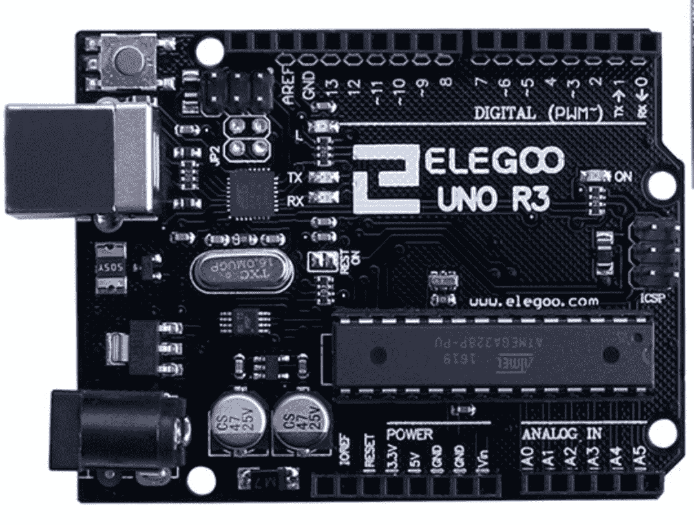
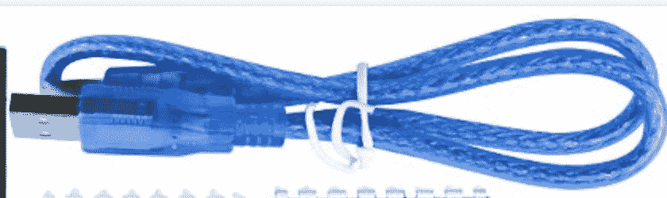
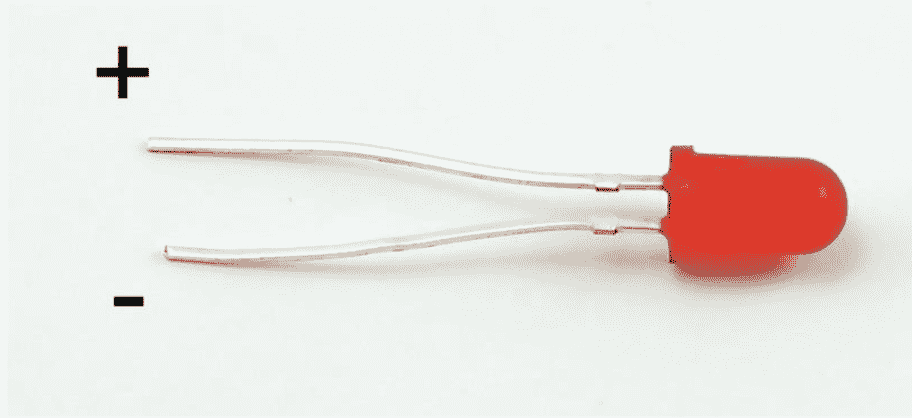
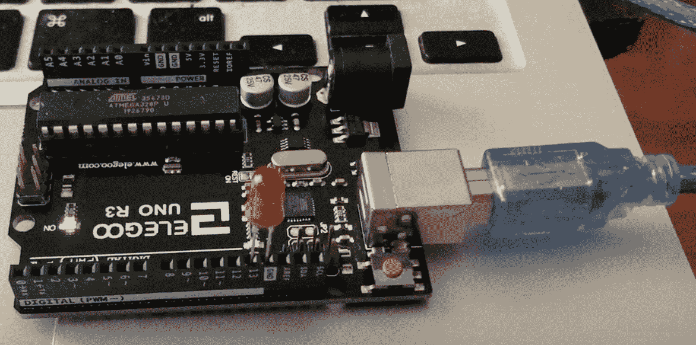

# 如何用代码设置 LED 灯并使其闪烁

> 原文：<https://www.freecodecamp.org/news/code-behind-an-led-light/>

编码 LED 灯是一个介绍性项目，向您展示软件和硬件如何相互作用。这是一个简单的项目，你可以在一个周末完成，它将帮助你学习硬件的一些基本方面。

项目结束时，您将编写自己的 LED 灯代码，掌握在您选择的时间间隔内控制 LED 灯开/关的知识，并学习硬件的基本原理。

Elegoo Uno 初学者工具包拥有制作简单 LED 灯所需的所有硬件和说明。LED 灯是他们套件提供的第一个项目。

Elegoo Uno 附带了许多其他项目，并带您完成从初级到高级的项目。盒子里的每个项目都以一种简单、易于遵循的方式提升你的技能。

## 您需要的组件

### Elegoo Uno R3



Elegoo Uno R3

Elogoo Uno R3 是一个微控制器板。微控制器嵌入在设备内部，以控制产品的动作和功能。它们是设计用于控制操作的紧凑集成电路。

Elogoo Uno R3 包含的微控制器有 14 个数字输入/输出引脚、6 个模拟输入、一个 USB 连接、一个电源插孔和一个复位按钮。该板拥有支持微控制器所需的一切。只需插入 USB 电缆即可打开微控制器。

### usb 电缆



USB Cable

您需要一根 USB 电缆将 Elegoo Uno R3 连接到您的电脑并打开它。USB 代表通用串行总线。USB 用于将您的电脑连接到数码相机、打印机、扫描仪和外部硬盘驱动器等设备。

在我们的项目中，我们将使用 USB 电缆将微控制器连接到计算机。

### 发光二极管



LED Light

LED 代表发光二极管。它有一个积极和消极的领导。较长的一边是正极引线。

## 如何组装组件



在这个项目中，我们只打算让 LED 闪烁。

首先，我们需要将 USB 线插入主板，然后插入电脑。

然后，我们需要将 LED 插入 GND (GND 是电路中测量电压的参考点，也是电流的公共回路)和电路板上的 13 输入端。

### 使 LED 闪烁的代码:

将微控制器板插入计算机后，LED 就在板上了，我们需要编写一些简单的代码来使 LED 闪烁。

```
// the setup function runs once when you press reset or power the board

void setup() {
  // initialize digital pin LED_BUILTIN as an output.
  pinMode(LED_BUILTIN, OUTPUT);
}

// the loop function runs over and over again forever
void loop() {
  digitalWrite(LED_BUILTIN, HIGH);   // turn the LED on 
  delay(1000);                       // wait for a second
  digitalWrite(LED_BUILTIN, LOW);    // turn the LED off
  delay(1000);                       // wait for a second
} 
```

上面的代码基本上是打开 LED 1 秒，然后关闭 1 秒。

这个函数是一个连续的循环。`digitalWrite`是一个接受两个参数的函数，`LED_BUILTIN`和`HIGH || LOW`。该回路基本上接收 LED，然后将电压转到`HIGH`使其开启。然后 1 秒钟后，它通过将电压调到`LOW`来关闭相同的 LED。

### 这是最终产品:

[https://www.youtube.com/embed/D6IkSkKcY5s?feature=oembed](https://www.youtube.com/embed/D6IkSkKcY5s?feature=oembed)

这个小小的 LED 灯编码项目的目标是向你介绍硬件和软件如何结合的基本原理。我希望你喜欢它！