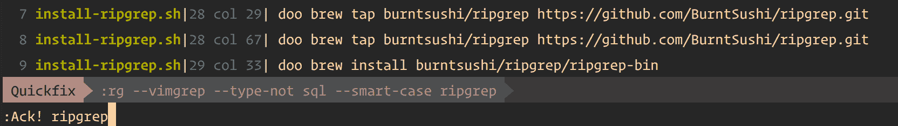
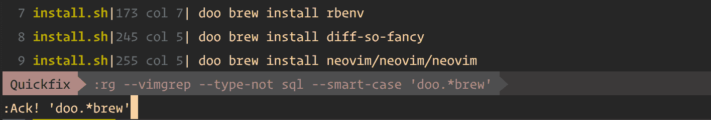

# 我如何让 VIM 的项目范围搜索与 ripgrep 无缝结合

> 原文：<https://www.freecodecamp.org/news/how-to-search-project-wide-vim-ripgrep-ack/>

是的，我放弃了 grep & the_silver_searcher(ag)而选择了 ripgrep。

无论您是被迫在工作场所使用 VIM，还是像我一样痴迷于生产效率的 VIM 狂热者，项目范围的关键字搜索都是每个开发人员在其编辑器库中需要的基本要求。我们预计它会非常快。⚡️

我已经使用 VIM 大约 3 年了。由于有着崇高的背景，项目范围内的搜索是必不可少的。

ripgrep 和 [a](https://github.com/mileszs/ack.vim) ck.vim 是我在 grep 和 _silver_searcher(ag)的不成功经历后采用的东西。从那以后我再也没有回头。

这篇文章是我在一段时间内尝试不同的搜索工具和渐进式改进的结果，直到我感觉恰到好处。

## 为什么选择 ack.vim & ripgrep？

1.  快速:我做过 Symfony 和 JavaScript 项目，有数千个文件，速度非常快。这里有一个[与其他搜索工具的快速比较](https://github.com/BurntSushi/ripgrep#quick-examples-comparing-tools)。
    我对速度的基准是，“永远不要觉得慢”。我注意到在我离开 grep、silver searcher 和 ack 之后有了巨大的进步。
2.  ****快速导航** :** ack.vim 负责填充 Quickfix 列表，这让您可以方便地在不同文件的所有搜索结果之间移动。
3.  **Sensible defaults:**ripgrep 默认考虑 gitignore，自动跳过隐藏文件/目录和二进制文件。

## 概观

ack.vim 是一个 vim 插件，它作为一个包装器来搜索关键字并填充 Quickfix 列表以导航结果。

**ripgrep (rg)** 是一个命令行工具，ack.vim 将在内部使用它来执行实际的项目范围的搜索。

## 步伐

### **步骤 1** :安装 ripgrep

如果你像我一样喜欢 [自制软件](https://brew.sh/)，运行以下命令来安装 rg:

```
brew tap burntsushi/ripgrep https://github.com/BurntSushi/ripgrep.git
brew install burntsushi/ripgrep/ripgrep-bin
```

这里有一个自动脚本，我用它作为我的[点文件](https://github.com/pezcoder/dotfiles)的一部分。

如果您喜欢任何其他安装模式，请参考 ripgrep 的官方[安装](https://github.com/BurntSushi/ripgrep#installation)部分。

### **第二步**:安装 ack.vim

要使用 [vim-plug](https://github.com/junegunn/vim-plug) 软件包管理器安装 ack.vim，请在您的 vimrc 中添加以下内容:

```
Plug 'mileszs/ack.vim' 
```

或者参考 ack.vim 的[安装](https://github.com/mileszs/ack.vim#installation)部分。

### **步骤 3** :配置 ack.vim 使用 rg

在 vimrc 中添加以下配置:

```
" ack.vim --- {{{

" Use ripgrep for searching ⚡️
" Options include:
" --vimgrep -> Needed to parse the rg response properly for ack.vim
" --type-not sql -> Avoid huge sql file dumps as it slows down the search
" --smart-case -> Search case insensitive if all lowercase pattern, Search case sensitively otherwise
let g:ackprg = 'rg --vimgrep --type-not sql --smart-case'

" Auto close the Quickfix list after pressing '<enter>' on a list item
let g:ack_autoclose = 1

" Any empty ack search will search for the work the cursor is on
let g:ack_use_cword_for_empty_search = 1

" Don't jump to first match
cnoreabbrev Ack Ack!

" Maps <leader>/ so we're ready to type the search keyword
nnoremap <Leader>/ :Ack!<Space>
" }}}

" Navigate quickfix list with ease
nnoremap <silent> [q :cprevious<CR>
nnoremap <silent> ]q :cnext<CR>
```

注意:`let g:ackprg`定义 ack.vim 将在内部运行的命令。
还要注意，我们在这里使用`rg`和一些选项。查看`man rg`，修改可能符合您要求的选项。

要探索 ack.vim 的选项，请查看下面的[文档](https://github.com/mileszs/ack.vim/blob/master/doc/ack.txt)。

## 使用

现在我们已经准备好了，下面是最常见的使用案例:

### 在光标下查找一个单词

*按下<键> /然后回车*。
因为我们已经设置了`let g:ack_use_cword_for_empty_search = 1`，Ack 会退回到光标下的当前单词进行搜索，所以不需要输入那个单词。

### 单词搜索

*按< leader > /后跟单词(不带任何引号)&回车。*
因为我们在 ripgrep 中使用了智能大小写，所以如果单词全是小写的话，它将进行不区分大小写的搜索，否则进行区分大小写的搜索。



word search with ack.vim

### 正则表达式搜索

*按下< leader > /后跟引号中的正则表达式模式&回车。*



regex search with ack.vim

### 在结果中导航

Ack.vim 在 Quickfix 列表中填充结果，该列表作为一个单独的底部窗口打开。有多种方法可以导航结果列表:

*   您可以使用`j/k`浏览快速修复列表，并按`enter`关闭快速修复列表。VIM 将带您到找到的单词的确切位置。
*   您也可以使用热键`]q`或`[q`。VIM 会将光标移动到下一个/上一个结果，如果需要，会在新的缓冲区中打开文件。
    完成后要关闭快速修复列表，你可以去底部的快速修复窗口并关闭它，或者直接运行`:cclose`
*   要重新打开快速修复列表，运行`:copen`

## 结束语

现在你有了它，一个无缝的搜索和导航，为你的下一个项目范围的关键字搜索！

如果您被困在某个地方，请在各自的存储库中查找各自的 ack.vim 和 ripgrep 文档/问题，或者给我发消息。分享你引以为豪的配置，这样可以帮助其他人改进他们的配置。

下面是我的[点文件](https://github.com/pezcoder/dotfiles)。