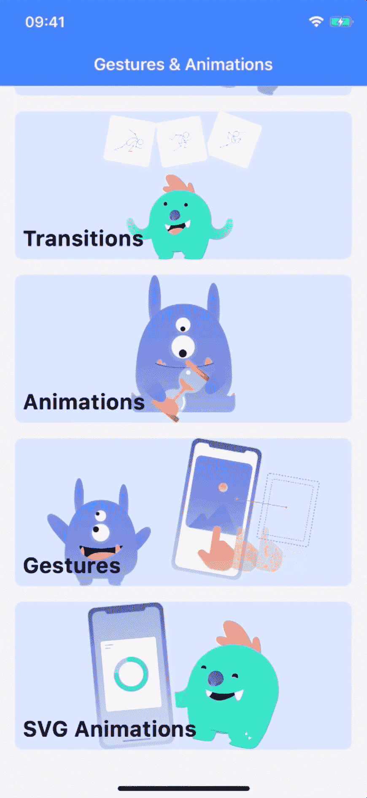

# 添加手势和动画来反应本地项目

> 原文：<https://www.freecodecamp.org/news/react-native-gestures-animations-tutorial/>

React Native 允许开发者使用 React 和 JavaScript 构建原生 Android 和 iOS 应用。React Native 使用与常规 iOS 和 Android 应用相同的基本 UI 构建块。为了让你的应用脱颖而出，你应该包含手势和动画。

我们已经发布了一个来自 William Candillon 的视频课程，该课程将教你如何向 React 本地项目添加声明性手势和动画。

在本课程中，您将学习:

1.  为什么？您将了解为什么在使用 React Native 时手势和动画的理解非常重要。您还将了解重要的策略和 API。
2.  过渡。过渡是在 React Native 中制作组件动画的最简单方法。
3.  动画。您将学习如何使用裸机动画 API 构建一个简单的定时动画，可以循环、暂停、恢复、暂停、恢复。
4.  手势。您将学习如何添加手势来与屏幕上的卡片和元素进行交互。
5.  SVG 动画。您将了解这些手势和动画如何很好地与 SVG 集成，并且您将了解如何使用手势和 SVG 动画构建圆形滑块。

如果你准备好在 React Native 中发现强大的声明性手势和动画世界，请查看下面的视频或 freeCodeCamp.org YouTube 频道上的视频。

[https://www.youtube.com/embed/wEVjaXK4sYQ?feature=oembed](https://www.youtube.com/embed/wEVjaXK4sYQ?feature=oembed)